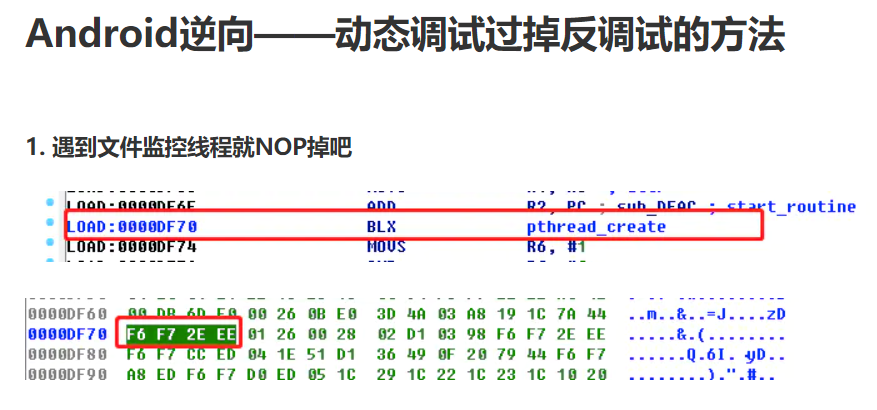

# 关于手游反调试的事

url：https://segmentfault.com/a/1190000014901361

## Android 常用反调试方法

## Android 常用反调试方法

1. Pid：/proc/self/status 的 TracerPid 字段，非调试状态下的数值为 0，调试状态下的数值为调试器的进程 pid
2. 子进程调试：子进程对父进程进行调试，占用调试名额，防止其它调试器附加
3. rtld_db_dlactivity：Linker 符号 `rtld_db_dlactivity` ，函数指针，非调试状态下为空指针，调试状态下指向断点；非导出函数，遍历内存中的 `/system/bin/linker` 的符号表获得符号地址
4. Debug 类：执行 Android 系统函数 `android.os.Debug.isDebuggerConnected()` ，返回当前的调试器的附加状态

|        方法        |               效果               |
| :----------------: | :------------------------------: |
|     TracerPid      |          获得调试器PID           |
|     子进程调试     | 占据调试名额，防止非法调试器附加 |
| rtld_db_dlactivity |        获得调试器附加状态        |
|      Debug 类      |        获得调试器附加状态        |

理论上这几种反调试单独使用都能取得不错的效果，但容易被绕过。所以一般情况下都是联合使用，增加反反调试的成本，同时还可以应对不同的场景。

如使用 SDK 方式分发安全模块，则不能影响手游项目的正向开发。正常的开发环境下，调试器和游戏进程在同一个用户组中，这种情况下只能使用检测 TracerPid 的方式。取出调试器的 GID 和游戏进程的 GID 看是否在同一个用户组中，即可判断出是否为合法调试器。

## iOS 常用反调试方法

1. 禁止附加：通过 `ptrace(PT_DENY_ATTACH,0,0,0)` 来禁止调试器附加，`ptrace` 函数在 iOS 下没有对应的头文件函数声明，需要通过 `dlsym` 或 `extern int ptrace(int,pid_t,cadrr_t,int)`的形式获得
2. 检测跟踪标识：使用 `sysctl` 查询当前进程是否有 `P_TRACED` 标识，该标志存在则标识进程正在被调试

```
// 禁止附加
extern int ptrace(int, pid_t, caddr_t, int);
void DisablePtrace() { 
    ptrace(PT_DENY_ATTACH, 0, 0, 0); 
}
// 检测跟踪标识
int IsPflagExist() {
    size_t size = sizeof(struct kinfo_proc);
    struct kinfo_proc info;
    int name[4];
    memset(&info, 0, sizeof(struct kinfo_proc));
    name[0] = CTL_KERN;
    name[1] = KERN_PROC;
    name[2] = KERN_PROC_PID;
    name[3] = getpid();
    if (!sysctl(name, 4, &info, &size, NULL, 0)) {
        return (info.kp_proc.p_flag & P_TRACED) ? 1 : 0;
    }
    return 0;
}
```

在 App 发布时使用这两段代码可以有效阻止攻击者进行调试。iOS 的反调试功能应由项目组添加，不该由第三方模块提供。

~~### 禁止注入~~(已过时)
~~iOS 下的注入大多数是通过环境变量 `DYLD_INSERT_LIBRARIES` 来实现，如 Cydia Substrate、Cycript 和 dumpdecrypted 等等。~~
~~如果 App 的 Mach-O 文件中存在 `Section(__RESTRICT/__restrict)`，那么在 App 启动时，`dyld`会和忽略加载 `DYLD_INSERT_LIBRARIES` 环境变量指向的动态库。使得攻击者无法直接使用 `dumpdecrypted` 进行脱壳。~~

~~方法：在 xcode 的 `Other Linker Flags` 中添加参数 `-Wl,-sectcreate,__RESTRICT,__restrict,/dev/null`~~


