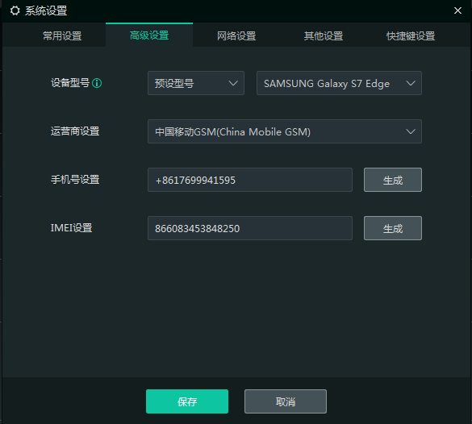
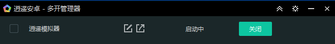
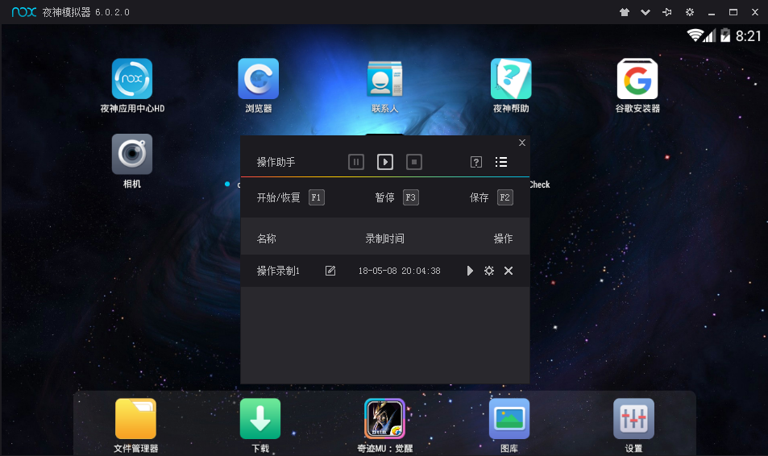
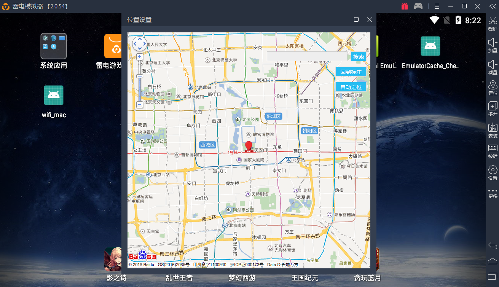
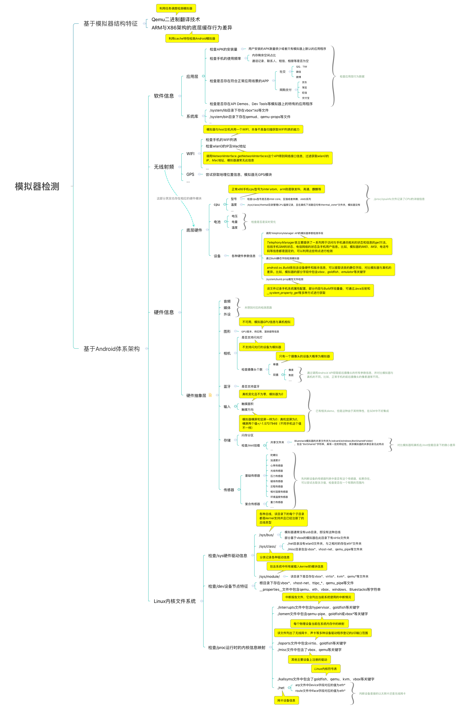
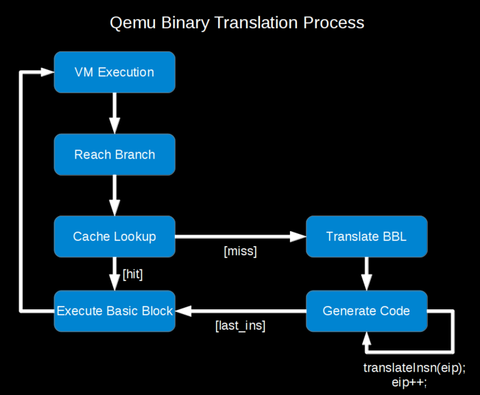
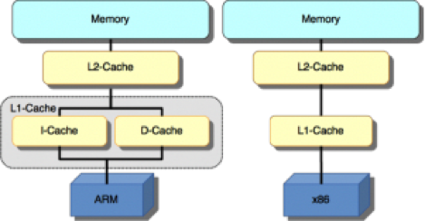

# Android模拟器检测体系梳理

url：http://www.wireghost.cn/2018/05/10/Android%E6%A8%A1%E6%8B%9F%E5%99%A8%E6%A3%80%E6%B5%8B%E4%BD%93%E7%B3%BB%E6%A2%B3%E7%90%86/

模拟器作为一种虚拟机，配合改机工具，能够以较低成本实现设备多开，因此而备受黑灰产的青睐。如何准确识别模拟器成为App开发中的一个重要模块，目前也有专门的公司提供相应的SDK供开发者识别模拟器。通过前段时间对模拟器检测技术的调研，希望能总结出一套特征挖掘的体系化方案。

## 模拟器概述

### 定义

安卓模拟器是一种可以运行在电脑上的虚拟设备，通过它可以实现应用的跨平台操作，让移动端APP无需任何改动即可在PC上执行。

### 特性

#### 优势

随着技术的不断发展，目前模拟器基本已经能够完成手机90%以上的功能。此外，由于在PC端工作，与传统手机相比，具有以下几点优势：

- **更炫**：支持大屏幕、提供更炫酷的视觉效果，从而能够天然的将一些移动端由于适配成客户端应用；
- **易上手**：支持鼠标、键盘、手柄、摄像头等众多硬件外设，将操作方式从手指运动中解放出来，发挥外设的优势；
- **更强的性能**：通过模拟器可自定义配置性能参数，发挥PC硬件性能优势，跑分数据远超手机，使得高配游戏运行不再卡顿；
- **更好的操控性**：通过虚拟按键功能，能够将任意点触操作、震动、摇摇等手机独有操作映射到键盘的自定义按键，更加简易、便捷；
- **使用PC工具**：利用PC端其他辅助工具完成对移动端应用的支持，如通过按键精灵完成自动挂机等操作，解放双手；
- **模拟多人操作**：通过模拟器多开功能，零成本体验同时多部手机、多个账户开小黑屋，实现刷单的快感；
- **更便捷的虚拟定位功能**：通过模拟器虚拟定位，让你轻松落脚五湖四海；
- **再也不用担心电池电量、手机流量了…**

#### 问题

此外，Android模拟器鉴于自身技术瓶颈，也存在以下普遍问题：

- **性能**：运行时普遍需要占据较大的CPU、内存等资源，导致低配机运行不流畅。此外，即便是高配机，多开也很容易出现卡顿等现象；
- **稳定性**：模拟器技术本身的BUG导致的闪退、花屏、无响应等现象；
- 兼容性
  - **硬件兼容性**：主要表现为大部分模拟器对AMD架构PC的不支持；
  - **应用兼容性**：比如部分模拟器尚不兼容ARM架构的APP，又或者某些应用对安卓内核、虚拟机的调用方式比较底层，当模拟器对这些接口支持的不好时，表现为该类程序无法在模拟器上运行；
  - **PC系统兼容性**：表现为模拟器主要适配Windows主流平台，而能在Mac下运行的很少，且过低、过高版本支持的不好（如XP之前版本、Win 10，市面上某些定制的平板系统等）；
  - **安卓系统兼容性**：目前模拟器上的Android系统仍然停留在4.x，部分达到5.1，使得部分对安卓版本有要求的应用或游戏在模拟器上运行体验不好。

## 底层关键技术

### 虚拟化技术

模拟器是用软件来模拟硬件操作，这就需要用到虚拟化技术。广义的虚拟化，是指将网络、CPU、内存及存储等各种实体资源，予以抽象、转换后呈现出来，进而打破实体结构间不可切割的障碍，使用户可以比原本的组态更好的方式来应用这些资源。我们所熟知的虚拟机就是虚拟化技术中的一种，通常来说它们只是模拟了一套与Host主机相同架构、相同指令集的硬件平台，不涉及内存和CPU的虚拟化。所有的Android模拟器都在不同程度上运用了虚拟化技术，比如雷电、夜神，包括Bluestack模拟器是基于Virtualbox虚拟机，谷歌原生模拟器和红手指云模拟器则是应用了Qemu的虚拟化技术。

#### CPU虚拟化

目前，已知的所有ARM架构的模拟器都是基于Qemu虚拟机。Qemu采用的是纯软件模拟，在物理机的操作系统上创建一个模拟硬件的程序来仿真所有想要的硬件，然后在上面跑ARM运行时。在这种环境下，由于程序每次执行都需要将其翻译成宿主机（X86）的指令，导致性能非常低下，这也是原生模拟器不够流畅的原因之一。

#### ARM Translation

当下主流的Android模拟器都是X86架构，基于Virtualbox虚拟机。由于不需要做CPU虚拟化，少了一层指令集转换过程，因此在运行支持X86架构的app时，就和普通的虚拟机没有区别，速度也就明显提高了很多。
此外，针对ARM架构的兼容性问题，普遍采用的是半虚拟化，根据二进制翻译技术将ARM指令动态翻译成X86指令。

## 黑产常用的模拟器

目前市面上安卓模拟器软件种类繁多，有51、mumu、蓝叠、夜神、逍遥、海马玩、雷电等等。通过在黑产聚集论坛、QQ群等多个渠道进行调研，我们发现黑产当下常用的是夜神、雷电和逍遥模拟器。
可以注意到，这些模拟器的共通点是都自带修改设备参数、多开、操作录制和虚拟定位等功能。

## 模拟器检测技术框架

模拟器检测的本质就是要利用模拟器和真机之间的微小差异，从而判断当前设备是否为模拟器，具体检测技术框架整理如下：

### 如何挖掘特征

结合前面梳理出的模拟器检测框架，后续在做相应的特征挖掘时，可直接根据该脑图做进一步的完善和加强。

| 特征项                            | 细分点               | 描述 | 备注 |      |
| --------------------------------- | -------------------- | ---- | ---- | ---- |
| 软件信息                          | 应用层               |      |      |      |
| 系统库                            |                      |      |      |      |
| 无线射频                          | WIFI                 |      |      |      |
| GPS                               |                      |      |      |      |
| …                                 |                      |      |      |      |
| 硬件信息                          | 底层硬件             | CPU  |      |      |
| 电池                              |                      |      |      |      |
| 设备参数                          |                      |      |      |      |
| 硬件抽象层                        | 图形                 |      |      |      |
| 相机                              |                      |      |      |      |
| 蓝牙                              |                      |      |      |      |
| 输入                              |                      |      |      |      |
| 存储                              |                      |      |      |      |
| 传感器                            |                      |      |      |      |
| 文件系统（重点关注Linux内核相关） | 检查/sys硬件驱动信息 |      |      |      |
| 检查/dev设备节点特征              |                      |      |      |      |
| 检查/proc运行时的内核信息映射     |                      |      |      |      |
| …                                 |                      |      |      |      |

此外，基于文件系统差异的特征挖掘，具体可参考Android根目录文件结构进行操作，以下是几个重要的目录/文件的说明：

- /mnt：挂载点目录
- /etc：指向 /system/etc ，系统配置文件所在目录
- /data：存放用户安装的应用以及各种数据
- /system：Android系统目录文件夹
- /dev：设备节点文件存放地
- /sys：用于挂载 sysfs文件系统，在设备模型中，sysfs文件系统用来表示设备的结构，将设备的层次结构形象的反应到用户空间中
- /proc：这是一个虚拟的文件系统，不占用实际存储空间。它以文件系统的方式为访问系统内核的操作提供接口，动态从系统内核中读出所需信息
- init.rc：启动脚本
- default.prop：系统属性配置文件

### 对应的检测弱点

#### 基于模拟器结构特征

#### 利用任务调度检测模拟器

##### 原理

模拟器与真机的本质区别在于运行载体，市面上已知的ARM模拟器都是基于qemu虚拟机。由于qemu在执行程序时实际上是将其翻译成宿主机的指令，比如将安卓的arm指令翻译成PC的x86指令。为了效率上的考虑，qemu在翻译执行arm指令时并没有实时更新模拟的pc寄存器值，只会在一段代码翻译执行完之后再更新，而真机中pc寄存器是一直在更新的。根据这一点，可以设计一段CPU任务调度程序来检测模拟器。

##### 优缺点

优点：因为是基于qemu的二进制翻译技术来做特征检测，所以能够很好的识别这类Android模拟器。
缺点：

1. 需要自己设计反应离散程度的算法来统计任务调度的地址分布情况，想要实际应用到SDK有些困难
2. 会执行汇编代码，在不同的机器设备上需要考虑稳定性和兼容性等问题

#### 利用cache特性检测Android模拟器

##### 原理

由于绝大部分手机都是基于ARM架构，而模拟器几乎全部是运行在PC的X86架构上。因此，可以利用ARM与X86的底层缓存行为差异来判断是否为真机。
具体来说，ARM采用的是将指令存储与数据存储分开的哈佛架构，L1 Cache（一级缓存）被分成了平行的两块，即I-Cache（指令缓存）和D-Cache（数据缓存），而X86采用的是将指令存储和数据存储合并在一起的冯•诺伊曼结构，L1 Cache是连续的一块缓存。所以，如果我们通过读写地址指令的方式对一段可执行代码进行动态修改，那么在执行的时候，X86架构上的指令缓存会被同步修改，而对ARM架构而言，这种数据读写操作修改的只是D-Cache中的内容，此时I-Cache中的指令并不会被更新。

##### 优缺点

优点：能够准确的识别arm和x86架构。
缺点：要执行汇编代码，在不同的机器设备上需要考虑稳定性和兼容性等问题。实测发现容易引起崩溃，需要配合多进程予以解决。

#### 基于Android体系架构

##### 应用层行为数据

这种检测方案本质上是对正常用户的行为模式进行统计分析，它也许不能有效的对真机和模拟器进行区分，但可以作为风险设备画像的一个参考维度。

##### 无线射频

###### WIFI

检查WIFI列表这种方式，目前没发现明显缺点。当正常手机接入WIFI的时候，周边往往有复数的WIFI信号，而模拟器由于不具备检索周边WIFI的能力，其WIFI列表通常为空或者只有一个WIFI。

###### GPS

这种检测手法的原理是基于模拟器没有真实的GPS模块，通常无法获取到地理位置信息。缺点是部分用户在实际使用中可能会关闭该权限，导致获取不到数据。

##### 硬件信息

###### 底层硬件

- CPU
  1. 型号：正常x86手机的cpu型号为intel atom，arm则是联发科，高通，麒麟等。缺点是需要大盘做数据分析，另外可能要结合手机型号等其他维度才能做一个比较好的识别。
  2. 温度：目前来看应该是比较靠谱的，缺点是需要大量的数据统计做支撑，不排除有误杀的可能。
- 电池
  需要在后台多次采集数据，检验电压、电量是否有实时变化，实际应用起来有些困难。。
- 设备
  通过系统API获取手机硬件参数，可以说是非常传统的模拟器检测方案了。也正是因为传统，基本上都知道会获取哪些信息，所以缺点是很容易遭到篡改。

###### 硬件抽象层

- 相机
  通过提取摄像头参数信息，可以有效的识别当前设备是否为“主流手机”。缺点是考虑到平板、学习机等“冷门设备”的存在，不能直接区分出模拟器，需要结合其他维度一起使用，且需要接入的APP有打开摄像头的权限。
- 蓝牙
  若想从API层面进行检测，那就必须先开启蓝牙，而这个需要弹框让用户确认。
- 输入
  缺点是对触摸事件的处理是在前台完成的，如果是作为SDK可能不是很好接入和应用。
- 存储
  1. 闪存分区
     Android系统的更新以及刷机等方式都有可能导致分区的变化，目前来看，在高版本的机器上检查mmcblk、dm-x分区并不是一个靠谱的特征，需要配合其它维度一起使用。
  2. /mnt挂载
     这种文件名的检测手法只能针对性的做特定模拟器检测、不通用，且很容易通过版本更新、改名等手段进行绕过。
- 传感器
  除判断设备有支持哪些传感器外，若想要做更进一步的验证，就仍然绕不开多次采集数据的问题。

##### 文件系统

特点是用于做特征检出的目录文件与底层硬件的关联性越强，其效果越好，反之越可能失效。建议尽量提取和虚拟机、硬件驱动相关的文件特征，缺点是部分特征可能需要结合大量的机型数据做可靠性验证。

------ 本文结束 感谢阅读 ------