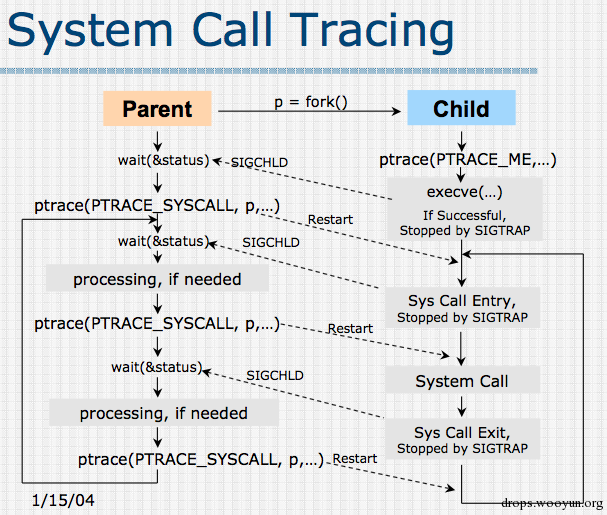
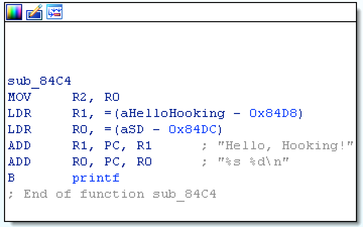
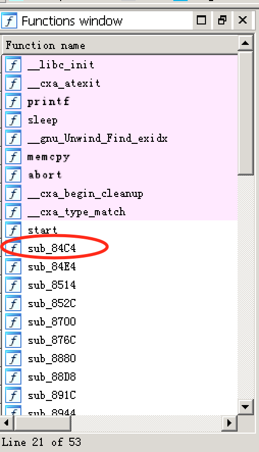

# Android Hooking

url：http://pwn4.fun/2016/06/28/Android-Hooking/

### ptrace on Android

无论是hook还是调试都离不开ptrace这个system call，ptrace可以跟踪目标进程，并且在目标进程暂停的时候对目标进程的内存进行读写。
首先看一下要ptrace的目标程序，用来一直循环输出一句话”Hello, Hooking!”

```
#include <stdio.h>
int count = 0;
void targetFunc(int number)
{
    char *str = "Hello, Hooking!";
    printf("%s %d\n", str, number);
}

int main()
{
    while (1) {
        targetFunc(count);
        count++;
        sleep(1);
    }
    return 0;
}
```

要编译它需要先建立一个Android.mk文件，内容如下，让ndk将文件编译为elf可执行文件：

```
LOCAL_PATH := $(call my-dir)

include $(CLEAR_VARS)
LOCAL_MODULE := target
LOCAL_SRC_FILES := target.c

include $(BUILD_EXECUTABLE)
```

> 只有设置Android SDK<=9编译出的elf文件才是executable的，否则编译出的是shared object（即使是include的BUILD_EXECUTABLE）。

接下来写出hook1.c程序来hook target程序的system call，main函数如下：

```
int main(int argc, char *argv[])
{
    if (argc != 2) {
        printf("Usage: %s <pid to be traced>\n", argv[0]);
        return 1;
    }
    pid_t pid;
    int status;
    pid = atoi(argv[1]);

    if (0 != ptrace(PTRACE_ATTACH, pid, NULL, NULL)) {
        printf("Trace process failed:%d.\n", errno);
        return 1;
    }
    ptrace(PTRACE_SYSCALL, pid, NULL, NULL);
    while (1) {
        wait(&status);
        hookSysCallBefore(pid);
        ptrace(PTARCE_SYSCALL, pid, NULL, NULL);

        wait(&status);
        hookSysCallAfter(pid);
        ptrace(PTRACE_SYSCALL, pid, NULL, NULL);
    }
    ptrace(PTRACE_DETACH, pid, NULL, NULL);
    return 0;
}
```

首先要知道hook目标进程的pid，用ps命令获取。然后使用`ptrace(PTRACE_ATTACH, pid, NULL, NULL)`这个函数对目标进程进行加载。加载成功后，我们可以使用`ptrace(PTRACE_SYSCALL, pid, NULL, NULL)`这个函数来对目标程序下断点，每当目标程序调用system call前的时候，就会暂停下来。然后可以读取寄存器的值来获取system call的各项信息。再一次使用`ptrace(PTRACE_SYSCALL, pid, NULL, NULL)`这个函数就可以让system call在调用完成后再一次暂停下来，并获取system call的返回值。
获取system call编号的函数如下：

```
long getSysCallNo(int pid, struct pt_regs *regs)
{
    long scno = 0;
    scno = ptrace(PTRACE_PEEKTEXT, pid, (void *)(regs->ARM_pc - 4), NULL);
    if (scno = 0) return 0;
    if (scno == 0xef000000) {
        scno = regs->ARM_r7;
    } else {
        if ((scno & 0x0ff00000) != 0x0f900000) {
            return -1;
        }
        scno &= 0x000fffff;
    }
    return scno;
}
```

ARM架构上，所有的系统调用都是通过SWI来实现的。并且在ARM架构中有两个SWI指令，分别针对EABI和OABI：

> [EABI]
> 机器码： 1110 1111 0000 0000 – SWI 0
> 具体的调用号存放在寄存器r7中。
> [OABI]
> 机器码： 1101 1111 vvvv vvvv – SWI immed_8
> 调用号进行转换后得到指令中的立即数。立即数=调用号 | 0x900000

需要兼容两种方法的调用，在代码上就要分开处理。首先要获取SWI指令判断是EABI还是OABI，如果是EABI，可从r7中获取调用号。如果是OABI，则从SWI指令中获取立即数，反向计算出调用号。
接着看hook system call前的函数，和hook system call后的函数：

```
void hookSysCallBefore(pid_t pid)
{
    struct pt_regs regs;
    int sysCallNo = 0;

    ptrace(PTRACE_GETREGS, pid, NULL, &regs);
    sysCallNo = getSysCallNo(pid, &regs);
    printf("Before SysCallNo = %d\n", sysCallNo);

    if (sysCallNo == __NR_write) {
        printf("__NR_write: %ld %p %ld\n", regs.ARM_r0, (void*)regs.ARM_r1, regs.ARM_r2);
    }
}

void hookSysCallAfter(pid_t pid)
{
    struct pt_regs regs;
    int sysCallNo = 0;

    ptrace(PTRACE_GETREGS, pid, NULL, &regs);
    sysCallNo = getSysCallNo(pid, &regs);

    printf("After SysCallNo = %d\n", sysCallNo);

    if (sysCallNo == __NR_write) {
        printf("__NR_write return: %ld\n", regs.ARM_r0);
    }
    printf("\n");
}
```

在获取了system call的调用号后，可以进一步获取各个参数的值，比如说wirte这个system call有三个参数。在arm上，如果形参个数少于或等于4，则形参由`R0`，`R1`，`R2`，`R3`四个寄存器传递。大于四个则通过栈传递。函数的返回值保存在`R0`中。
把target和hook1 push到/data/local/tmp目录下，再chmod 777，接着运行target：

```
root@hammerhead:/data/local/tmp # ./target
Hello, Hooking! 0
Hello, Hooking! 1
Hello, Hooking! 2
Hello, Hooking! 3
...
```

再开一个shell，`ps`获取target的pid，使用hook1程序对target进行hook操作：

```
root@hammerhead:/data/local/tmp # ./hook1 27190
Before SysCallNo = 0
After SysCallNo = 0

Before SysCallNo = 4
__NR_write: 1 0x4f5020 20
After SysCallNo = 4
__NR_write return: 20

Before SysCallNo = 162
After SysCallNo = 162
...
```

syscall No 162是`sleep`函数，syscall No 4是`write`函数，因为printf本质就是调用write这个系统调用。对write函数参数的解析：1是stdout即标准输出，0x4f5020是字符串地址，20表示字符串长度。返回值20是write成功写入的长度。
整个过程的图示：


### 利用ptrace动态修改内存

下面演示用ptrace进行内存读写，将write()输出的string进行翻转。
在hook1.c的基础上继续进行修改，在hookSysCallBefore()函数中加入modifyString(pid, regs.ARM_r1, regs.ARM_r2)这个函数：

```
if (sysCallNo == __NR_write) {
    printf("__NR_write: %ld %p %ld\n", regs.ARM_r0, (void *)regs.ARM_r1, regs.ARM_r2);
    modifyString(pid, regs.ARM_r1, regs.ARM_r2);
}
```

把write的第二个参数字符串地址`r1`和第三个参数字符串长度`r2`传递给`modifyString()`这个函数：

```
void modifyString(pid_t pid, long addr, long strlen)
{
    char *str;
    str = (char *)calloc((strlen+1) * sizeof(char), 1);
    getdata(pid, addr, str, strlen);
    reverse(str);
    putdata(pid, addr, str, strlen);
}
```

`modifyString()`首先获取在内存中的字符串，然后进行翻转操作，最后把翻转后的字符串写入原来的地址。这些操作用到了getdata()和putdata()函数：

```
void getdata(pid_t child, long addr, char *str, int len)
{
    char *laddr;
    int i, j;
    union u {
        long val;
        char chars[long_size];
    } data;
    i = 0;
    j = len / long_size;
    laddr = str;
    while (i < j) {
        data.val = ptrace(PTRACE_PEEKDATA, child, addr+i*4, NULL); // ptrace的内存操作一次只能控制4个字节
        memcpy(laddr, data.chars, long_size);
        ++i;
        laddr += long_size;
    }
    j = len % long_size;
    if (j != 0) {
        data.val = ptrace(PTRACE_PEEKDATA, child, addr+i*4, NULL);
        memcpy(laddr, data.chars, j);
    }
    str[len] = '\0';
}

void putdata(pid_t child, long addr, char *str, int len)
{
    char *laddr;
    int i, j;
    union u {
        long val;
        char chars[long_size];
    } data;
    i = 0;
    j = len / long_size;
    laddr = str;
    while (i < j) {
        memcpy(data.chars, laddr, long_size);
        ptrace(PTRACE_POKEDATA, child, addr+i*4, data.val);
        ++i;
        laddr += long_size;
    }
    j = len % long_size;
    if (j != 0) {
        memcpy(data.chars, laddr, j);
        ptrace(PTRACE_POKEDATA, child, addr+i*4, data.val);
    }
}
```

`getdata()`和`putdata()`分别使用`PTRACE_PEEKDATA`和`PTRACE_POKEDATA`对内存进行读写操作。因为ptrace的内存操作一次只能控制4个字节，所以如果修改比较长的内容需要进行多次操作。
现在运行target，并且在运行中用hook2进行hook：

```
root@hammerhead:/data/local/tmp # ./target
Hello, Hooking! 0
Hello, Hooking! 1
Hello, Hooking! 2
Hello, Hooking! 3
Hello, Hooking! 4
Hello, Hooking! 5
Hello, Hooking! 6
Hello, Hooking! 7
Hello, Hooking! 8
Hello, Hooking! 9
01 !gnikooH ,olleH
11 !gnikooH ,olleH
21 !gnikooH ,olleH
31 !gnikooH ,olleH
41 !gnikooH ,olleH
51 !gnikooH ,olleH
Hello, Hooking! 16
Hello, Hooking! 17
Hello, Hooking! 18
Hello, Hooking! 19
....
```

运行hook2后字符串被翻转，退出hook2字符串回到原顺序。

### 利用ptrace动态执行sleep()函数

下面利用ptrace来执行libc.so中的sleep()函数，主要逻辑如下：

```
void inject(pid_t pid)
{
    struct pt_regs old_regs, regs;
    long sleep_addr;
    // save old regs
    ptrace(PTRACE_GETREGS, pid, NULL, &old_regs);
    memcpy(&regs, &old_regs, sizeof(regs));

    printf("getting remote sleep_addr:\n");
    sleep_addr = get_remote_addr(pid, libc_path, (void *)sleep);
    
    long parameters[1];
    parameters[0] = 10;
    ptrace_call(pid, sleep_addr, parameters, 1, &regs);
    // restore old regs
    ptrace(PTRACE_SETREGS, pid, NULL, &old_regs);
}
```

首先我们用`ptrace(PTRACE_GETREGS, pid, NULL, &old_regs)`获取当前寄存器的值，以便最后恢复数据。然后获取sleep()函数在目标进程中的地址，接着利用ptrace执行sleep()函数。
下面是获取sleep()函数在目标进程中地址的代码：

```
void *get_module_base(pid_t pid, const char *module_name)
{
    FILE *fp;
    long addr = 0;
    char *pch;
    char filename[32], line[1024];
    if (pid == 0) {
        snprintf(filename, sizeof(filename), "/proc/self/maps");
    } else {
        snprintf(filename, sizeof(filename), "/proc/%d/maps", pid);
    }
    fp = fopen(filename, "r");
    if (fp != NULL) {
        while (fgets(line, sizeof(line), fp)) {
            if (strstr(line, module_name)) {
                pch = strtok(line, "-");
                addr = strtoul(pch, NULL, 16);
                if (addr == 0x8000) // 如果被加载的文件是executable而不是so，则不需要加上基址
                    addr = 0;
                break;
            }
        }
        fclose(fp);
    }
    return (void*)addr;
}

long get_remote_addr(pid_t target_pid, const char *module_name, void *local_addr)
{
    void *local_handle, *remote_handle;
    local_handle = get_module_base(0, module_name);
    remote_handle = get_module_base(target_pid, module_name);

    printf("module_base: local[%p], remote[%p]\n", local_handle, remote_handle);
    // 本进程函数地址减去本进程libc地址等于该函数在libc的偏移，再加上负载进程的libc基址即负载进程中函数地址
    long ret_addr = (long)((uint32_t)local_addr - (uint32_t)local_handle + (uint32_t)remote_handle);

    printf("remote_addr: [%p]\n", (void *)ret_addr);
    return ret_addr;
}
```

因为libc.so在内存中的地址是随机的，所以要先获取目标进程的libc.so的加载地址，再获取本进程的libc.so的加载地址和sleep()在内存中的地址。然后我们就能计算出sleep()函数在目标进程中的地址了。要注意的是获取目标进程和本进程的libc.so的加载地址是通过解析`/proc/[pid]/maps`得到的。
接下来执行sleep()函数：

```
int ptrace_call(pid_t pid, long addr, long *params, uint32_t num_params, struct pt_regs *regs)
{
    uint32_t i;
    // 将参数赋给R0-R3
    for (i = 0; i < num_params && i < 4; ++i) {
        regs->uregs[i] = params[i];
    }
    // 参数大于四个，将参数放在栈上
    if (i < num_params) {
        regs->ARM_sp -= (num_params - i) * long_size;
        putdata(pid, (long)regs->ARM_sp, (char *)&params[i], (num_params - i) * long_size);
    }

    regs->ARM_pc = addr;
    if (regs->ARM_pc & 1) {
        /* thumb */
        regs->ARM_pc &= (~1u);
        regs->ARM_cpsr |= CPSR_T_MASK;
    } else {
        /* arm */
        regs->ARM_cpsr &= ~CPSR_T_MASK;
    }
    
    regs->ARM_lr = 0;
    if (ptrace_setregs(pid, regs) == -1 || ptrace_continue(pid) == -1) {
        printf("error\n");
        return -1;
    }
    int stat = 0;
    waitpid(pid, &stat, WUNTRACED);
    while (stat != 0xb7f) {
        if (ptrace_continue(pid) == -1) {
            printf("error\n");
            return -1;
        }
        waitpid(pid, &stat, WUNTRACED);
    }
    return 0;
}
```

首先是将参数赋值给R0-R3，如果参数大于四个的话，再使用putdata()将参数存放在栈上。然后我们将PC的值设置为函数地址。接着再根据是否是thumb指令设置ARM_cpsr寄存器的值。随后我们使用ptrace_setregs()将目标进程寄存器的值进行修改。最后使用waitpid()等待函数被执行。

### 利用ptrace动态加载so并执行自定义函数

逻辑如下：

```
保存当前寄存器的状态
获取目标程序的mmap, dlopen, dlsym, dlclose地址
调用mmap分配一段内存空间来保存参数信息
调用dlopen加载so文件
调用dlsym找到目标函数地址
使用ptrace_call执行目标函数
调用dlclose卸载so文件
恢复寄存器的状态
```

实现整个逻辑的函数injectSo()的代码如下：

```
void injectSo(pid_t pid, char *so_path, char *function_name, char *parameter)
{
    struct pt_regs old_regs, regs;
    long mmap_addr, dlopen_addr, dlsym_addr, dlclose_addr;

    // save old regs
    ptrace(PTRACE_GETREGS, pid, NULL, &old_regs);
    memcpy(&regs, &old_regs, sizeof(regs));
    // get remote address
    printf("getting remote address:\n");
    mmap_addr = get_remote_addr(pid, libc_path, (void *)mmap);
    dlopen_addr = get_remote_addr(pid, libc_path, (void *)dlopen);
    dlsym_addr = get_remote_addr(pid, libc_path, (void *)dlsym);
    dlclose_addr = get_remote_addr(pid, libc_path, (void *)dlclose);

    printf("mmap_addr = %p dlopen_addr=%p dlsym_addr=%p dlclose_addr=%p\n",
            (void *)mmap_addr, (void *)dlopen_addr, (void *)dlsym_addr, (void *)dlclose_addr);
    long parameters[10];

    // mmap
    parameters[0] = 0; // address
    parameters[1] = 0x4000; // size
    parameters[2] = PROT_READ | PROT_WRITE | PROT_EXEC; // WRX
    parameters[3] = MAP_ANONYMOUS | MAP_PRIVATE; // flag
    parameters[4] = 0; // fd
    parameters[5] = 0; // offset

    ptrace_call(pid, mmap_addr, parameters, 6, &regs);
    ptrace(PTRACE_GETREGS, pid, NULL, &regs);
    long map_base = regs.ARM_r0; // 返回映射区的指针

    printf("map_base = %p\n", (void *)map_base);
    // dlopen
    printf("save os_path = %s to map_base %p\n", so_path, (void *)map_base);
    putdata(pid, map_base, so_path, strlen(so_path)+1);

    parameters[0] = map_base;
    parameters[1] = RTLD_NOW | RTLD_GLOBAL;
    ptrace_call(pid, dlopen_addr, parameters, 2, &regs);
    ptrace(PTRACE_GETREGS, pid, NULL, &regs);
    long handle = regs.ARM_r0;

    printf("handle = %p\n", (void *)handle);
    // dlsym
    printf("save function_name = %s to map_base = %p\n", function_name, (void *)map_base);
    putdata(pid, map_base, function_name, strlen(function_name) + 1);

    parameters[0] = handle;
    parameters[1] = map_base;
    ptrace_call(pid, dlsym_addr, parameters, 2, &regs);

    ptrace(PTRACE_GETREGS, pid, NULL, &regs);
    long function_ptr = regs.ARM_r0;

    printf("function_ptr = %p\n", (void *)function_ptr);
    // function_call
    printf("save parameter = %s to map_base = %p\n", parameter, (void *)map_base);
    putdata(pid, map_base, parameter, strlen(parameter)+1); //此处的parameter是通过参数传递进来的

    parameters[0] = map_base;

    ptrace_call(pid, function_ptr, parameters, 1, &regs);
    // dlclose
    parameters[0] = handle;
    ptrace_call(pid, dlclose_addr, parameters, 1, &regs);
    // restore old regs
    ptrace(PTRACE_SETREGS, pid, NULL, &old_regs);
}
```

mmap()可以用来将一个文件或者其它对象映射进内存，如果我们把flag设置为MAP_ANONYMOUS并且把参数fd设置为0的话就相当于直接映射一段内容为空的内存。mmap()的函数声明和参数如下：

```
void *mmap(void *start, size_t length, int prot, int flags, int fd, off_t offset)
```

> start：映射区的开始地址，设置为0时表示由系统决定映射区的起始地址。
> length：映射区的长度。
> prot：期望的内存保护标志，不能与文件的打开模式冲突。这里设置为RWX。
> flags：指定映射对象的类型，映射选项和映射页是否可以共享。我们这里设置为：MAP_ANONYMOUS(匿名映射，映射区不与任何文件关联)，MAP_PRIVATE(建立一个写入时拷贝的私有映射。内存区域的写入不会影响到原文件)。
> fd：有效的文件描述词。匿名映射设置为0。
> offset：被映射对象内容的起点。设置为0。

`mmap()`映射的内存主要用来保存传递给其他函数的参数。比如接下来我们需要用dlopen()去加载”/data/local/tmp/libinject.so”这个文件，所以需要先用`putdata()`将字符串”/data/local/tmp/libinject.so”放置在mmap()所映射的内存中，再将映射地址作为参数传递给dlopen()。接下来的dlsym()，so中的目标函数，dlclose()都是相同的调用方式。
被加载的so文件内容如下：

```
int injectedFunc(char *str)
{
    printf("injected function pid = %d\n", getpid());
    printf("Hello %s\n", str);
    LOGD("injected function pid = %d\n", getpid());
    LOGD("Hello %s\n", str);
    return 0;
}
```

这里不光使用printf()还使用了android debug的函数LOGD()用来输出调试结果。所以在编译时我们需要加上`LOCAL_LDLIBS := -llog`。
编译完后使用hook4对target进行注入：

```
root@hammerhead:/data/local/tmp # ./target
Hello, Hooking! 0
Hello, Hooking! 1
Hello, Hooking! 2
Hello, Hooking! 3
injected function pid = 13574
Hello Android hooking
Hello, Hooking! 4
Hello, Hooking! 5
Hello, Hooking! 6
...

root@hammerhead:/data/local/tmp # ./hook4 13574
getting remote address:
module_base: local[0xb6f7c000], remote[0xb6ec0000]
remote_addr: [0xb6ed2c5d]
module_base: local[0xb6f7c000], remote[0xb6ec0000]
remote_addr: [0xb6f22f31]
module_base: local[0xb6f7c000], remote[0xb6ec0000]
remote_addr: [0xb6f22e81]
module_base: local[0xb6f7c000], remote[0xb6ec0000]
remote_addr: [0xb6f22dfd]
mmap_addr = 0xb6ed2c5d dlopen_addr=0xb6f22f31 dlsym_addr=0xb6f22e81 dlclose_addr=0xb6f22dfd
map_base = 0xb6e82000
save os_path = /data/local/tmp/libinject.so to map_base 0xb6e82000
handle = 0xb6f1f494
save function_name = injectedFunc to map_base = 0xb6e82000
function_ptr = 0xb6e7cc61
save parameter = Android hooking to map_base = 0xb6e82000
```

可以看到stdout和logcat都成功输出了调试信息。这意味着可以通过注入让目标进程加载so文件并执行任意代码了。

### 利用函数挂钩实现native层的hook

这一节要实现用函数挂钩hook目标函数，函数挂钩的基本原理是先用mprotect()将原代码段改成可读可写可执行，然后修改原函数的入口处的代码，让pc指针跳转到动态加载的so文件中的hook函数中，执行完hook函数以后再让pc指针跳转回原本的函数中。
用来注入的程序hook5逻辑与hook4相比并没有太大变化，仅仅少了”调用dlclose卸载so文件”这一个步骤，因为要执行的hook后的函数在so中，所以不需要卸载，步骤如下：

```
保存当前寄存器的状态
获取目标程序的mmap, dlopen, dlsym地址
调用mmap分配一段内存空间用来保存参数信息
调用dlopen加载so文件
调用dlsym找到目标函数地址
使用ptrace_call执行目标函数
恢复寄存器的状态
```

hook5的主要代码如下：

```
void injectSo(pid_t pid,char *so_path, char *function_name,char *parameter)
{
    struct pt_regs old_regs,regs;
    long mmap_addr, dlopen_addr, dlsym_addr;

    // save old regs
    ptrace(PTRACE_GETREGS, pid, NULL, &old_regs);
    memcpy(&regs, &old_regs, sizeof(regs));

    // get remote address
    printf("getting remote addres:\n");
    mmap_addr = get_remote_addr(pid, libc_path, (void *)mmap);
    dlopen_addr = get_remote_addr(pid, libc_path, (void *)dlopen);
    dlsym_addr = get_remote_addr(pid, libc_path, (void *)dlsym);
    
    printf("mmap_addr=%p dlopen_addr=%p dlsym_addr=%p\n",
    (void*)mmap_addr,(void*)dlopen_addr,(void*)dlsym_addr);
    
    long parameters[10];

    // mmap
    parameters[0] = 0; // address
    parameters[1] = 0x4000; // size
    parameters[2] = PROT_READ | PROT_WRITE | PROT_EXEC; // WRX
    parameters[3] = MAP_ANONYMOUS | MAP_PRIVATE; // flag
    parameters[4] = 0; // fd
    parameters[5] = 0; // offset
    
    ptrace_call(pid, mmap_addr, parameters, 6, &regs);
    ptrace(PTRACE_GETREGS, pid, NULL, &regs);

    long map_base = regs.ARM_r0;
    printf("map_base = %p\n", (void*)map_base);

    // dlopen
    printf("save so_path = %s to map_base = %p\n", so_path, (void*)map_base);
    putdata(pid, map_base, so_path, strlen(so_path) + 1);

    parameters[0] = map_base;
    parameters[1] = RTLD_NOW| RTLD_GLOBAL;

    ptrace_call(pid, dlopen_addr, parameters, 2, &regs);
    ptrace(PTRACE_GETREGS, pid, NULL, &regs);
    
    long handle = regs.ARM_r0;
    
    printf("handle = %p\n",(void*) handle);

    // dlsym
    printf("save function_name = %s to map_base = %p\n", function_name, (void*)map_base);
    putdata(pid, map_base, function_name, strlen(function_name) + 1);

    parameters[0] = handle;
    parameters[1] = map_base;

    ptrace_call(pid, dlsym_addr, parameters, 2, &regs);
    ptrace(PTRACE_GETREGS, pid, NULL, &regs);
    
    long function_ptr = regs.ARM_r0;

    printf("function_ptr = %p\n", (void*)function_ptr);

    // function_call
    printf("save parameter = %s to map_base = %p\n", parameter, (void*)map_base);
    putdata(pid, map_base, parameter, strlen(parameter) + 1);

    parameters[0] = map_base;

    ptrace_call(pid, function_ptr, parameters, 1, &regs);

    // restore old regs
    ptrace(PTRACE_SETREGS, pid, NULL, &old_regs);
}
```

arm处理器支持两种指令集，一种是arm指令集，另一种是thumb指令集。所以要hook的函数可能是被编译成arm指令集的，也有可能是被编译成thumb指令集的。需要注意的是thumb指令的长度是不固定的，但arm指令是固定的32位长度。
为了更容易地理解hook的原理，先只考虑arm指令集，因为arm相比thumb要简单一点，不需要考虑指令长度的问题。所以我们需要将target和hook的so编译成arm指令集的形式。很简单，只要在Android.mk中的文件名后面加上”.arm”即可 (真正的文件不用加)。

```
include $(CLEAR_VARS)
LOCAL_MODULE    := target
LOCAL_SRC_FILES := target.c.arm
include $(BUILD_EXECUTABLE)
 
include $(CLEAR_VARS)
LOCAL_MODULE    := inject2
LOCAL_SRC_FILES := inject2.c.arm
LOCAL_LDLIBS := -llog 
include $(BUILD_SHARED_LIBRARY)
```

确定了指令集以后，来看实现挂钩最重要的逻辑，这个逻辑是在注入的so里实现的。首先我们需要一个结构体保存汇编代码和hook地址：

```
struct hook_t {
    unsigned int jump[3]; // 保存跳转指令
    unsigned int store[3]; // 保存原指令
    unsigned int orig; // 保存原函数地址
    unsigned int patch; // 保存hook函数地址
};
```

接着来看注入的逻辑，最重要的函数为hook_direct()，他有三个参数，1）最开始定义的用来保存汇编代码和hook地址的结构体，2）要hook的原函数的地址，3）用来执行的hook函数地址。函数的源码如下：

```
int hook_direct(struct hook_t *h, unsigned int addr, void *hookf)
{
    int i;
 
    printf("addr  = %x\n", addr);
    printf("hookf = %x\n", (unsigned int)hookf);
 
    // 将代码段改成可读可写可执行
    mprotect((void*)0x8000, 0xa000-0x8000, PROT_READ|PROT_WRITE|PROT_EXEC);
 
    // modify function entry 
    h->patch = (unsigned int)hookf; // hook函数地址
    h->orig = addr; // 原函数地址
    h->jump[0] = 0xe59ff000; // 把目标函数第一条指令改成 LDR pc, [pc, #0];跳转到PC指针所指的地址
    h->jump[1] = h->patch; // 由于pc寄存器读出的值实际上是当前指令地址加8，所以我们把后面两处指令
    h->jump[2] = h->patch; // 都保存为hook函数的地址，这样的话，我们就能控制PC跳转到hook函数的地址了。
    for (i = 0; i < 3; i++) // 保存原函数的前三条指令
        h->store[i] = ((int*)h->orig)[i];
    for (i = 0; i < 3; i++) // 将函数入口指令改成跳转指令
        ((int*)h->orig)[i] = h->jump[i];
 
    // 刷新指令的缓存。因为虽然前面的操作修改了内存中的指令，但有可能被修改的指令已经被缓存起来了   
    hook_cacheflush((unsigned int)h->orig, (unsigned int)h->orig + sizeof(h->jump));
    return 1;
}
```

虽然android有ASLR，但并没有PIE，所以program image是固定在0x8000这个地址的，因此我们用mprotect()函数将整个target代码段变成RWX，这样我们就能修改函数入口处的代码了。是否修改成功可以通过cat /proc/[pid]/maps查看：

```
root@hammerhead:/ # cat /proc/18029/maps
00008000-0000a000 rwxp 00000000 b3:1c 671749     /data/local/tmp/target
0000a000-0000b000 r--p 00001000 b3:1c 671749     /data/local/tmp/target
...
```

然后需要确定目标函数的地址，这个有两种方法。1）如果目标程序本身没有被strip的话，那些symbol都是存在的，因此可以使用dlopen()和dlsym()等方法来获取目标函数地址。但很多情况，目标程序都会被strip，特别是可以直接运行的二进制文件默认都会被直接strip。比如target中的targetFunc()这个函数名会在编译的时候去掉，所以使用dlsym()的话是无法找到这个函数的。2）这时候我们就需要使用IDA或者objdump来定位一下目标函数的地址。比如用IDA找一下target程序里面targetFunc(int number)这个函数的地址：

虽然target这个binary被strip了，但还是可以找到targetFunc()这个函数的起始地址是在0x84c4。一般ARM程序在IDA中打开后，自定义的函数都在`Functions window`的前几个：

最后一个参数也就是我们要执行的hook函数的地址。得到这个地址非常简单，因为是so中的函数，调用hook_direct()的时候直接写上函数名即可。

```
hook_direct(&eph, hookaddr, hookFunc);
```

hook_cacheflush()代码如下：

```
void inline hook_cacheflush(unsigned int begin, unsigned int end)
{   
    const int syscall = 0xf0002;
 
    __asm __volatile (
        "mov     r0, %0\n"         
        "mov     r1, %1\n"
        "mov     r7, %2\n"
        "mov     r2, #0x0\n"
        "svc     0x00000000\n"
        :
        :   "r" (begin), "r" (end), "r" (syscall)
        :   "r0", "r1", "r7"
        );
}
```

刷新完缓存后，再执行到原函数的时候，pc指针就会跳转到自定义的hook函数中了，hook函数里的代码如下：

```
void  __attribute__ ((noinline)) hookFunc(int number)
{
    printf("targetFunc() called, number = %d\n", number);
    number *= 2;

    void (*orig_targetFunc)(int number);
    orig_targetFunc = (void *)eph.orig;
    
    hook_precall(&eph);
    orig_targetFunc(number);
    hook_postcall(&eph);
}
```

首先在hook函数中，可以获得原函数的参数（参数已经在寄存器中了，编写hook函数的时候，参数与原函数相同即可），并且可以对原函数的参数进行修改，比如说将数字乘2。随后使用`hook_precall(&eph);`将原本函数的内容进行还原。hook_precall()内容如下：

```
void hook_precall(struct hook_t *h)
{
    int i;
    for (i = 0; i < 3; i++)
        ((int*)h->orig)[i] = h->store[i];
 
    hook_cacheflush((unsigned int)h->orig, (unsigned int)h->orig+sizeof(h->jump)*10);
}
```

在hook_precall()中，先对原本的三条指令进行还原，然后使用hook_cacheflush()对内存进行刷新。经过处理之后，就可以执行原来的函数orig_targetFunc(number)了。执行完后，如果还想再次hook这个函数，就需要调用hook_postcall(&eph)将原本的三条指令再进行一次修改。
下面用hook5和libinject2.so来注入以下target这个程序：

```
root@hammerhead:/data/local/tmp # ./target
Hello, Hooking! 0
Hello, Hooking! 1
Hello, Hooking! 2
Hello, Hooking! 3
Hello, Hooking! 4
Hello, Hooking! 5
Hello, Hooking! 6
Hook Function pid = 18561
Hello HookFunction
addr  = 84c4
hookf = b6ea3da5
targetFunc() called, number = 7
Hello, Hooking! 14
targetFunc() called, number = 8
Hello, Hooking! 16
targetFunc() called, number = 9
Hello, Hooking! 18
targetFunc() called, number = 10
Hello, Hooking! 20
targetFunc() called, number = 11
Hello, Hooking! 22
...

root@hammerhead:/data/local/tmp # ./hook5 18561
getting remote addres:
mmap_addr=0xb6ef9c5d dlopen_addr=0xb6f49f31 dlsym_addr=0xb6f49e81
map_base = 0xb6ea9000
save so_path = /data/local/tmp/libinject2.so to map_base = 0xb6ea9000
handle = 0xb6f46494
save function_name = hookEntry to map_base = 0xb6ea9000
function_ptr = 0xb6ea3e3d
save parameter = HookFunction to map_base = 0xb6ea9000
```

**reference**
http://drops.wooyun.org/tips/9300
http://drops.wooyun.org/papers/10156