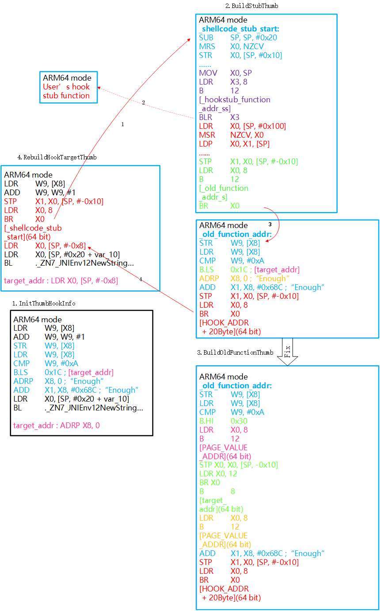
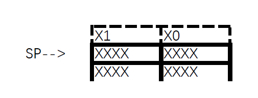
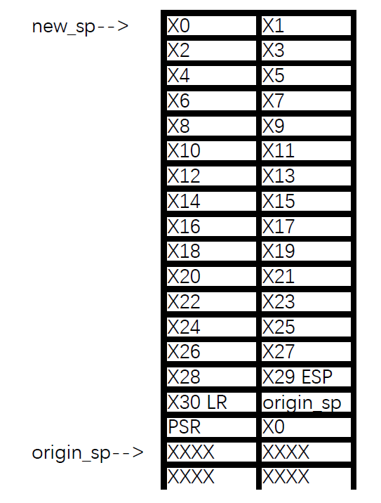
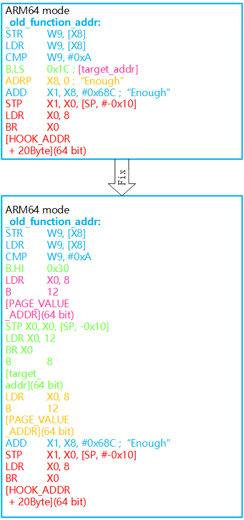

# ARM64下的Android Native Hook工具实践

url：https://gtoad.github.io/2018/09/20/Android-Native-Hook-Practice-Arm64/


> 强烈建议阅读本文前请先阅读前文[《Android Native Hook工具实践》](https://gtoad.github.io/2018/07/06/Android-Native-Hook-Practice/)，因为有些重复的内容在本文中可能不会详细说明。

> 本文讲的是[Android Native Hook工具实践](https://gtoad.github.io/2018/07/06/Android-Native-Hook-Practice/)一文的后续。为了使得安全测试人员可以在ARM64的手机上进行Android Native Hook而继续做的一些工作。

> 本文对测试机环境配置的要求较高，文中使用的设备是Pixel。

> [ARM32项目地址](https://github.com/GToad/Android_Inline_Hook.git)

> [ARM64项目地址](https://github.com/GToad/Android_Inline_Hook_ARM64.git)

## 一些废话

ARM64的手机芯片是向下兼容ARM32和Thumb-2指令集的，这也导致许多App其实并没有管用户手机是32位的还是64位的，依然只在apk中打包32位的.so而并没有arm64-v8a的so文件。并且有的App的32位so还不是armeabi-v7a，例如微信依然在使用ARMv5，这个架构老得连Thumb-2都不支持。由此可见市面上相当多的App其实并没有急着去使用ARM64。

第一部64位的谷歌亲儿子手机是2015年的Nexus 6p，它搭载了高通的第一个ARM64架构的芯片——骁龙810。而最后一部32位的谷歌亲儿子手机是2014年的Nexus 5。也就是说nexus 5已经发布4年了，我们且不讨论一部手机能不能正常工作4年，但它的性能是肯定已经开始跟不上当前的许多用户需求了。我的Nexus 5测试机在仅仅安装了微信，QQ等5个常用App后的不久便开始卡了起来。

2018年初的时候Android 4.4及以前的手机比例已经低于30%了，Nexus 5也是最后一部能刷Android 4.4的谷歌亲儿子，多巧啊。当初做这个Native Hook工具的初衷就是认为Android 4.4及之前的手机在市面上的比例在未来的几年会进一步缩小，测试人员迟早需要面对在5.0以上的测试机环境中进行安全测试的情况，因为2015年后发布的手机几乎出厂设置版本都高于Android 5.0，再没有4.4的手机给我们用了。

也许这些Neuxs 5同时代的手机可以用模拟器模拟，但是目前反模拟器技术也是一大热门，在测试前先过掉各个App的反模拟器检测会耽误不少功夫。

过不了几年，等32位手机急剧下降到一定比例的时候，不少App会为了追求更高的性能而选择ARM64的。因此有必要对ARM64指令集进行一定的知识储备和测试工具开发。

## 环境准备

这部分的环境搭建是为了方便本人开发调试本框架而准备的，读者有自己习惯的ARM64进程注入环境可以不看本章。

#### 测试机选择

想要开发这个工具，那我至少需要一个ARM64的运行环境，有如下三种选择：

1. 虚拟机——太慢了，而且在x64的电脑上模拟ARM64可能会出现真机上不会出现的坑。
2. 骁龙810+的品牌手机——不少品牌如华为、oppo连解锁都困难，那ROOT手机就更麻烦了，刷机也比亲儿子麻烦。
3. 骁龙810+的谷歌亲儿子——最坏的情况下也能用AOSP来自己编译系统刷机。`采用`

那么选哪款谷歌亲儿子好呢？

1. Nexus 6p——骁龙810，二手450元左右，外形不是很好看。
2. Pixel——骁龙821，二手无锁版750元左右，黑版外形可接受。`采用`
3. Pixel 2——骁龙835，二手2000+，太贵了。

#### 系统选择

刷什么系统？

1. CyanogenMod——俗称CM，在用Nexus 5做测试的时候很喜欢刷这个，自带ROOT和全局调试，但是官方已经倒闭了，生前给Pixel没留啥资源。
2. LineageOS——CM的残部组建的，这个系统刷了以后发现ROOT要单独刷，要配合TWRP，但是最后发现兼容性也有问题，ROOT包并没有起作用。Pixel与Android 7.1的“双系统”策略也留了好多没填补成功的坑。
3. Google官方——业界标杆，估计出不了太离谱的坑。`采用`

如何获取ROOT权限并搭建基本调试环境？

1. Kingroot等root工具都失败了
2. twrp+Magisk——可以获得ROOT权限，但Magisk与正常的Xposed框架存在冲突，只能使用Magisk定制版的Xposed，但那个不稳定，老是使得手机在开机画面中无线循环。
3. twrp+SuperSU——可以获得ROOT权限，但发现在企图把IDA pro的调试服务端android-server64放入/system/bin下时会报错：read-only file system。这个错误按理来说用`adb root``adb remount`就能解决了，但这里并没有效果，直接使用`mount`命令也无果，最后使用需要执行`adb disable verity`而这条命令在官方编译好的user版本系统中并没有执行权限。
4. AOSP——由于众所周知的原因国内对AOSP的编译工作会比国外麻烦，下载代码的过程也不能按照官方教程来进行。最后编译上的小错误也很多，每次编译时间长，磁盘占用超过了150GB。但是现在我也只能靠它了。`采用`

AOSP编译哪个版本？

1. user——给普通用户用的，我们通常买到的手机中都是user版的系统，用户权限非常小，没有ROOT和其它权限。
2. userdebug——给应用开发者用的，自带ROOT权限和全局调试，适合对运行在安卓系统之上的App进行调试与测试。`采用`
3. eng——给系统研究者用的，自带ROOT权限和其它一些Google额外提供的调试工具，但是实际编译下来发现缺乏对硬件的支持，主要是给模拟器用的。适合那些学习安卓源码的人使用。

#### 进程注入环境

系统编译好刷好机以后，开始打算按照[《Android Native Hook工具实践》](https://gtoad.github.io/2018/07/06/Android-Native-Hook-Practice/)里的老套路——装个Xposed来加载我们的so文件从而开展Native Hook的工作。但是产生了一系列的报错，经过测试和推测，最终的原因应该是Android 7.0之后对于非公开API的调用限制。这下就得先解决这个本质上是进程注入的问题，否则我们的so根本就加载不起来。有如下几条路让我选择：

1. 360的非虫大佬9月分在自己的微信公众号上发了一篇《动手打造Android7.0以上的注入工具》——难度较高，暂且跟不上T.T。
2. 后悔没有买450元的Nexus 6p——虽然Nexus6p可以刷6.0的系统从而避开这个问题，但是这就和我们在安卓Dalvik转ART后把测试工作环境限制在4.4之前版本一样，都是一时的退让，过几年年，大家都用Android 7.0以上的手机了，那就又不行了。
3. AOSP中/bionic/linker/linker.cpp下存在一个灰名单，把我们的so文件加入这个灰名单就能加载。——每次测试一个新的App就重新编译一次AOSP？然后其它环境都重装？太麻烦了。
4. 官方文档中有提及这个机制也有白名单/vendor/etc/public.libraries.txt和/system/etc/public.libraries.txt——一开始以为这个方法是最好也是最简单的。结果修改这俩白名单文件后，的确是加载了我们的so库，但是是在Zygote启动时加载了白名单中的so库。众所周知，之后启动的App都是它fork出来的，所以这些白名单so也会直接出现在新启动的所有App内，因此不会在App启动后利用`__attribute__((constructor))`来自动执行。同时由于对第三方so库的限制依然在而导致大量App奔溃。因此这个方法行不通。
5. AOSP里把这个机制给去掉——通过查阅资料，AOSP 7.0以后关于NDK限制机制的核心代码是在 /bionic/linker/linker.cpp。通过修改其中的源码并编译出镜像刷入我的Pixel手机中，从而解决了这个问题。`采用`

## 方案设计

我们先回忆一下当初在ARM32的手机处理器下我针对给出的设计方案，以当初的Thumb-2部分设计图为例：


这次的ARM64指令集下是不是也能单单把上面这个方案“翻译”成ARM64版的就行了呢？我原本是这么打算的，但是在进一步学习了ARM64指令集后才发现并没有想象中那么轻松。ARM64相比于ARM32多了哪些不利的约束呢？

#### 不利的约束

1. ARM64处理器下是兼容ARM32指令集的，因此，ARM64处理器上可以运行ARM64，ARM32,Thumb-2(Thumb16+Thumb32)三套指令！我们回忆一下前文介绍的ARM32上Thumb-2和ARM32指令集可以通过跳转地址的奇偶性来任意切换，同时Thumb-2中的Thumb16和Thumb32指令集可以直接混在一起当一套变长指令集使用。那么ARM64指令集也能这样吗？答案是否定的，尽管理论上在一个App中同时出现ARM64，ARM32,Thumb-2是可行的，但是从ARM64切换到ARM32处理器模式来处理ARM32和Thumb-2需要产生Ring1的异常才行。也就是说当我们想要Hook一段ARM64指令集的代码段时，根本不用担心出现ARM64和其它指令集混用的情况。
2. ARM64指令集中PC，SP不再是通用寄存器X0-X31中的一员。在ARM32中，R13就是SP，R14就是LR，R15就是PC。在ARM64中，X29是栈帧寄存器，X30是LR,而PC，SP是独立的寄存器。这也导致了对它们的操控和读写有了更多限制，尤其是PC寄存器。在ARM64中，PC寄存器的读写限制非常大，还记得我们在前文中介绍的ARM32的插桩跳转指令`LDR PC, [PC, #0/-4]`吗？这个方法在ARM64中已经是非法只指令了，因为PC的值目前只能间接读取或改变，而不能像这条指令一样直接对PC进行读写。毫无疑问，对于PC寄存器读写的巨大限制会严重影响ARM64下Inline Hook的设计方案。
3. 没有了PUSH/POP和LDM/STM指令！又是一个严重的限制，也就是说ARM64中没有了单独压栈或出栈的指令，也没有了批量寄存器压栈或出栈的指令！仅仅LDP/STP这一对双寄存器栈操作。想要实现单独的压栈出栈操作需要自己用别的多行指令来代替，而批量栈操作则只能靠大量的LDP/STP和PUSH/POP的代替指令来实现。并且也要注意到：ARM64下栈也有限制，SP必须是16字节对齐的。

```
总结：第一个约束中，ARM64与ARM32的关系是兼容而不是混用因此对Inline Hook工作影响不大，遇到不同指令集时分开使用本文和前文的Inline Hook框架即可。第二、三个约束则比较棘手，看到这俩约束条件，本人甚至怀疑ARM64模式之所以比ARM32模式快仅仅是由于寄存器多而已，从指令集本身来看效率是降低的。
```

#### 方案设计图

在以上坑爹的约束下，本方案与前文两套设计方案差距较大，如图：



从图中可以看出来，这套方案比前文那俩复杂多了。接下来分章节一一解释。并且太复杂的地方是为了稳定性，如果对于不稳定的优化简化方案感兴趣，请耐心阅读至`优化简化`章节。在开始前，我对我接下来的描述进行一些背景假设：

1. 我们这次编译出来的so文件叫`libHOOK.so`。
2. 想要Hook的目标在`libAPP.so`中。
3. 涉及的寄存器我们优先用X0寄存器为例以节省篇幅。
4. 文中汇编指令每行默认32bit，如果看到某个单词换行占了两行，说明这东西占64bit。

## 第一步——原程序插桩

通过对比前文中的设计图，我们可以看出本设计方案插桩指令段长了好多。没办法啊，这都是`约束2`的功劳。设计思路是：首先插桩代码最基本的是要一个跳转功能。ARM64中PC不让直接读写，那我们怎么改变PC呢？通常程序跳转都有两类方法：相对寻址和直接寻址。

先来试试相对寻址，我们使用`B ???`指令来跳转，这个跳转是相对当前PC的一个offset，那么这个offset能有多大呢，经过查找资料和实际测试，可以达到前后4MB。这显然是不够的，因为我们的`libAPP.so`和`libHook.so`都在内存中，但是代码段是各自独立的，因此，从`libAPP.so`的代码中跳转到`libHook.so`中的`ihookstub.s`代码段的距离很大概率是超过4MB的。因此，这个方法在个别App中可能可行，但是是极为不稳定的。

再来试试直接寻址，ARM64中有`BR X??`可以直接把程序跳转到X??寄存器中存储的64位地址上。那么，这时候的方案就应该是：

```
LDR X0, 8
BR X0
[TARGET_
ADDRESS] (64bit)
```

上面的代码中是先用`LDR`将X0寄存器中存入64bit的TARGET_ADDRESS。然后使用`BR X0`来跳转到TARGET_ADDRESS指向的地址处。这样就能使得代码跳转到第二步的ihookstub.s中啦。但是，这样会破坏X0中原本的值，那么我们找一个不太会被用到的寄存器如X18之类的来使用？那也会不稳定啊，没有哪个寄存器是肯定不会被用到的。因此，此处我们需要对寄存器进行保存。

```
STP X1, X0, [SP, #-0x10]
LDR X0, 8
BR X0
[TARGET_
ADDRESS] (64bit)
```

上面的第一个指令就是把X1,X0保存到栈上，这里的X1当然是多余的，纯属是为了满足ARM64上栈要16字节对齐且没有PUSH指令可用的约束。

那么解决掉寄存器保存的问题后，这个插桩就算完成了吗？不，并没有，它还要更复杂一点。从上面这部分内容中我们已经可以看出，利用绝对地址进行跳转是需要改变一个寄存器作为代价的，这里是从原程序跳出去，把恢复寄存器的工作交给了下一步的`ihhokstub.s`中。那最后跳转回原程序时，我们是不是也需要在第三步末尾加一个这样的绝对地址跳转？是的。这个绝对地址跳转后是不是也需要恢复一下被它污染的寄存器？是的！因此，跳转回原程序后我们需要在原程序中执行一次恢复寄存器的操作。此时插桩如下：

```
STP X1, X0, [SP, #-0x10]
LDR X0, 8
BR X0
[TARGET_
ADDRESS] (64bit)
LDR X0, [SP, -0x8]
```

增添了最后一行指令，用以恢复受污染的X0寄存器。当第三步完成后，会跳回到最后一行指令处去执行它，然后接着继续原程序指令序列的执行。

至此，第一步的插桩就完成了，这个稳定版的桩代码占用了原程序Hook处开始的6条ARM64指令的位置，原本的6条ARM64指令会被备份起来在第三步进行修复执行。如果嫌这个占用太大，可以看看`优化简化`章节的精简版。

## 第二步——桩程序

通过第一步的插桩代码，我们成功将原程序的执行流程引入了本章的`ihookstub.s`部分。首先我们需要恢复刚刚在第一步被保存在栈上的寄存器X0……吗？不用，第二部分一开始就是要用栈来保存全部的寄存器状态，所以先不急着把它从栈上拿出来。先来介绍我是打算如何在栈上保存所有寄存器的。首先，刚进入第二步时，栈的情况如图所示：



我打算把栈布置成如图所示的样子：



于是保存寄存器的指令如下：

```
    sub     sp, sp, #0x20

    mrs     x0, NZCV
    str     x0, [sp, #0x10]
    str     x30, [sp]   
    add     x30, sp, #0x20
    str     x30, [sp, #0x8]    
    ldr     x0, [sp, #0x18]

    sub     sp, sp, #0xf0
    stp     X0, X1, [SP]
    stp     X2, X3, [SP,#0x10]
    stp     X4, X5, [SP,#0x20]
    stp     X6, X7, [SP,#0x30]
    stp     X8, X9, [SP,#0x40]
    stp     X10, X11, [SP,#0x50]
    stp     X12, X13, [SP,#0x60]
    stp     X14, X15, [SP,#0x70]
    stp     X16, X17, [SP,#0x80]
    stp     X18, X19, [SP,#0x90]
    stp     X20, X21, [SP,#0xa0]
    stp     X22, X23, [SP,#0xb0]
    stp     X24, X25, [SP,#0xc0]
    stp     X26, X27, [SP,#0xd0]
    stp     X28, X29, [SP,#0xe0]
```

和前文对比后可以看出，由于没有了LDM/STM指令，我们向栈上存大量寄存器也会变得好麻烦。接下来依然是通过X0指向栈顶来向我们自己需要的Hook_Function中传递参数，从而使得该函数可以对任意寄存器进行读写。指令如下：

```
    mov     x0, sp
    ldr     x3, 8
    b       12

_hookstub_function_addr_s:
.double 0xffffffffffffffff
```

接下来就是恢复寄存器并跳转到第三步，指令如下：

```
    blr     x3
    ldr     x0, [sp, #0x100]
    msr     NZCV, x0

    ldp     X0, X1, [SP]
    ldp     X2, X3, [SP,#0x10]
    ldp     X4, X5, [SP,#0x20]
    ldp     X6, X7, [SP,#0x30]
    ldp     X8, X9, [SP,#0x40]
    ldp     X10, X11, [SP,#0x50]
    ldp     X12, X13, [SP,#0x60]
    ldp     X14, X15, [SP,#0x70]
    ldp     X16, X17, [SP,#0x80]
    ldp     X18, X19, [SP,#0x90]
    ldp     X20, X21, [SP,#0xa0]
    ldp     X22, X23, [SP,#0xb0]
    ldp     X24, X25, [SP,#0xc0]
    ldp     X26, X27, [SP,#0xd0]
    ldp     X28, X29, [SP,#0xe0]
    add     sp, sp, #0xf0
     
    ldr     x30, [sp]
    add     sp, sp, #0x20

    stp     X1, X0, [SP, #-0x10]
    ldr     x0, 8
    b       12

_old_function_addr_s:
.double 0xffffffffffffffff

    br      x0
```

总的来说第二步和前文俩方案的第二步思路完全一样，前文中介绍得已经很详细了，因此就不再多介绍了。

## 第三步——备份指令执行

一开始先把第二步跳转过来使用的X0寄存器进行恢复，然后这一步的工作就是把第一步中备份的那6条原程序的ARM64指令进行修复执行。关于修复执行的细节前文中已经有说明，这里不再赘述。给出如下案例图片：



当指令修复完成后，依然是使用X0作为绝对地址来跳转回原程序中位于Hook点下20字节偏移的位置，那里就是桩代码的最后一条`LDR X0, [SP, -0x8]`,它会恢复X0寄存器的。

## 使用说明

与前文一样，本框架的使用方法依然是读者自己用自己喜欢的进程注入的方法，如Java Hook来使得目标App加载`libHOOK.so`即可。因为本框架中的主函数依然采用`__attribute__((constructor))`的方法使得它一进入内存就会自动执行。

如果读者对Hook生效的时机有特殊要求的话，那也可以把`__attribute__((constructor))`给去掉，自行调用本框架的主函数。

## 优化简化

可能有同学会觉得上文的方案比起前文那两套真的复杂太多了，但是本人是出于稳定性的考虑而这么做的。如果抛开稳定性，读者可以进行如下优化：

1. 当你确认Hook代码段并不需要使用某个通用寄存器，如X18时。第一步的插桩代码可以简化成如下：

```
LDR X18, 8
BR X18
[TARGET_
ADDRESS] (64bit)
```

因为既然这个X18寄存器程序本来就不用，那就不用保存它和恢复它了，直接用它作为跳转的中间寄存器即可。

1. 当某个通用寄存器之后马上就要被赋值的情况下，也可以和`优化1`中的优化方案一样，因为此时尽管该寄存器之后会被使用，但是它在Hook处的值对之后的程序运行无影响，因此可以不用保存与恢复。

## 总结

从上文中可以看出，ARM64下的Inline Hook由于指令集上的许多约束条件而变得复杂多变。这也使得我们寻求一种通用的Inline Hook框架时会非常复杂和臃肿。我举例子说明一下：

1. 在针对某个App的测试，那完全可以分析其不需要的寄存器后采用`优化1`的方法来精简Hook时的插桩复杂度。上文中的24字节的插桩只是为了能适应更多的App。对于二进制能力较强的测试人员来说，`优化1`才是更好的选择。
2. 在指令修复时，有的指令很容易针对具体环境进行修复，相反，为它们寻找一种通用的修复方法则很难。这种在ARM32下是很少见的，因为ARM32下的跳转可以做到绝对地址跳转后干干净净而不影响任何通用寄存器。而ARM64中需要在跳转之后进行寄存器的恢复。
3. 比如我要修复一个相对跳转指令`B 8`,通用情况下我需要判断它的跳转目标在不在这个插桩的范围里？如果不在的话，那这个跳转目标指令在ARM64下也需要被覆盖一个寄存器恢复指令`LDR X0, [SP, -0x8]`，并且这个目标指令和`B 8`都需要在内存的其它地方进行修复执行。那么问题来了,万一目标指令还是一个跳转指令呢，比如又是一个`B 16`,那对这个目标指令进行修复的时候需要再更进一步去看新的跳转目标指令。由此这类指令的通用修复工作应该是一个迭代结构。同时，由于是跳转修复需要污染一个中间寄存器来进行绝对跳转，所以也需要避开目标指令需要用到的寄存器。而判断目标指令可能用到的寄存器这一步对人来说是很容易判断的，通过看汇编代码的形式能轻易判断。而在代码上判断则需要整理256个ARM64汇编指令的格式并提取其中的寄存器位置，这是非常繁杂的。

因此，我们可以看出ARM64位下的Inline Hook其实是很需要根据目标App的实际情况的，因为从上面的几点可以看出针对特定情况下的针对性Hook方案可以比通用方案简化简单很多：插桩代码会更小，修复代码逻辑会更简单。

总而言之,本文希望教会大家使用ARM64下的Inline Hook技术来应对各种各样有反检测措施的App，而不是成为工具党。同时，由于目前网上的许多Hook工具实在太依赖于ptrace来完成Hook功能，遇到反调试就集体歇菜了。本文向各位展示了一种最单纯且有力的Inline Hook来帮助大家进行相关测试工作。这种方式难以被察觉，难以被阻挡。