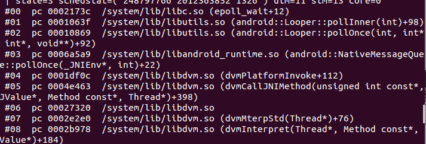

# ARM平台backtrace与inlineHook多线程安全浅析

url：http://ele7enxxh.com/Analysis-Of-Backtrace-And-Inline-Hook-Thread-Safety-On-The-ARM-Platform.html


本文主要讨论了Android+ARM平台的backtrace原理以及inlineHook中涉及到的多线程安全的问题。

> 本文关于Arm Inline Hook线程处理的解决方案已经过时，新方案点[这里](http://ele7enxxh.com/Android-Arm-Inline-Hook.html)

## 前言

在之前的Android inline hook项目中，在复杂环境下，如果遇到下面两个场景可能导致异常，甚至引起被hook进程的crash。

1. 待hook的函数正在执行；

2. 待hook的函数处于函数调用栈中；

   举个例子，代码为：

   ```
   #include <stdio.h>
   #include <pthread.h>
   
   #include "inlineHook.h"
   
   int new_thread()
   {
   	while(1) {
   		printf("new_a\n");
   		sleep(1);
   	}
   }
   
   int thread()
   {
   	while(1) {
   		printf("a\n");
   		sleep(1);
   	}
   }
   
   int main()
   {
   	int err;
   	pthread_t tid;
   	
   	err = pthread_create(&tid, NULL, thread, NULL);
   	if (err) {
   		return -1;
   	}
   	pthread_join(tid, NULL);
   	return 0;
   }
   ```

当我们对要hook的代码前8-10个字节变动的时候，如果子线程刚好执行到此处，或者子线程的函数调用栈包含此处地址，那么有一定几率会导致异常甚至crash。

## backtrace

为了防止上述情况发生，我们在hook之前需要对当前进程的所有线程做检测，以确保hook的函数不在当前的函数调用栈中。我们可以利用backtrace机制，获取线程的每层调用地址与我们需要hook的函数地址做比较，来实现该检测。
栈回溯（backtrace）是指程序运行时打印出当前的调用栈，在程序发生崩溃时，系统常常会打印出栈回溯信息。linux+arm平台下，编译器通过unwind实现栈回溯。
[](http://ele7enxxh.com/images/Analysis-Of-Backtrace-And-Inline-Hook-Thread-Safety-On-The-ARM-Platform_1.png)1
上面是在Android平台通过kill -3 pid命令打印出的调用栈，包含了调用的函数、具体偏移地址以及现场保存的寄存器信息。我们只需要其中的每一层的调用具体地址即可。不走运的是，NDK中并没有提供直接backtrace的接口函数，查看源码，在dalvik/vm/interp/Stack.cpp的dvmDumpNativeStack函数实现了backtrace的功能，dvmDumpNativeStack源码如下：

```
void dvmDumpNativeStack(const DebugOutputTarget* target, pid_t tid)
{
#ifdef HAVE_ANDROID_OS
    const size_t MAX_DEPTH = 32;
    backtrace_frame_t backtrace[MAX_DEPTH];
    ssize_t frames = unwind_backtrace_thread(tid, backtrace, 0, MAX_DEPTH);
    if (frames > 0) {
        backtrace_symbol_t backtrace_symbols[MAX_DEPTH];
        get_backtrace_symbols(backtrace, frames, backtrace_symbols);

        for (size_t i = 0; i < size_t(frames); i++) {
            char line[MAX_BACKTRACE_LINE_LENGTH];
            format_backtrace_line(i, &backtrace[i], &backtrace_symbols[i],
                    line, MAX_BACKTRACE_LINE_LENGTH);
            dvmPrintDebugMessage(target, "  %s\n", line);
        }

        free_backtrace_symbols(backtrace_symbols, frames);
    } else {
        dvmPrintDebugMessage(target, "  (native backtrace unavailable)\n");
    }
#endif
}
```


dvmDumpNativeStack函数功能为打印指定线程的backtrace，这里是直接将打印信息输出，与需求不符。查阅system/core/libcorkscrew/backtrace.c中的unwind_backtrace_thread函数：

```
ssize_t unwind_backtrace_thread(pid_t tid, backtrace_frame_t* backtrace,
        size_t ignore_depth, size_t max_depth) {
    if (tid == gettid()) {
        return unwind_backtrace(backtrace, ignore_depth + 1, max_depth);
    }

    ALOGV("Unwinding thread %d from thread %d.", tid, gettid());

    // TODO: there's no tgkill(2) on Mac OS, so we'd either need the
    // mach_port_t or the pthread_t rather than the tid.
#if defined(CORKSCREW_HAVE_ARCH) && !defined(__APPLE__)
    struct sigaction act;
    struct sigaction oact;
    memset(&act, 0, sizeof(act));
    act.sa_sigaction = unwind_backtrace_thread_signal_handler;
    act.sa_flags = SA_RESTART | SA_SIGINFO | SA_ONSTACK;
    sigemptyset(&act.sa_mask);

    pthread_mutex_lock(&g_unwind_signal_mutex);
    map_info_t* milist = acquire_my_map_info_list();

    ssize_t frames = -1;
    if (!sigaction(SIGURG, &act, &oact)) {
        g_unwind_signal_state.map_info_list = milist;
        g_unwind_signal_state.backtrace = backtrace;
        g_unwind_signal_state.ignore_depth = ignore_depth;
        g_unwind_signal_state.max_depth = max_depth;
        ...
```


这里由于函数比较长，只贴出了前部分。其中判断如果线程id为当前线程id，则直接调用unwind_backtrace函数，而unwind_backtrace函数通过调用_Unwind_Backtrace、__Unwind_Backtrace、__gnu_Unwind_Backtrace解析.ARM.extab和.ARM.exidx节（具体解析过程实在有点麻烦，不再深入研究），将每层调用栈的信息存存入类型为backtrace_frame_t的backtrace结构体中，贴出backtrace_frame_t定义：

```
typedef struct {
    uintptr_t absolute_pc;     /* absolute PC offset */
    uintptr_t stack_top;       /* top of stack for this frame */
    size_t stack_size;         /* size of this stack frame */
} backtrace_frame_t;
```


其中absolute_pc即为调用地址，unwind_backtrace_thread的返回值则为调用栈的层数。

## 方案

最后给出具体的方案：

1. 遍历/proc/pid/task目录，获得进程下的所有线程id号；
2. 通过tkill函数向所有线程发SIGSTOP信号；
3. 通过dlopen、dlsym调用libcorkscrew.so的unwind_backtrace_thread函数，获得所有线程的函数调用栈信息；
4. 遍历所有线程的函数调用栈信息，将每层调用地址与需要hook的函数作判断，若调用地址均不位于待hook的函数内，则可以安全的进行inline hook，否则停止；
5. 通过tkill函数向所有线程发生SIGCONT信号；

## 参考

1. Android下打印调试堆栈方法：http://docs.oracle.com/cd/E26926_01/html/E25910/chapter6-43405.html#scrolltoc
2. Android4.4.2源码：http://androidxref.com/4.4.4_r1/xref/system/core/include/corkscrew/