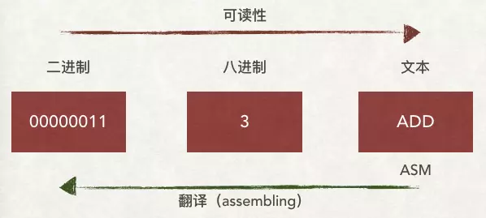
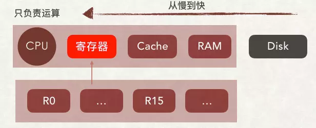
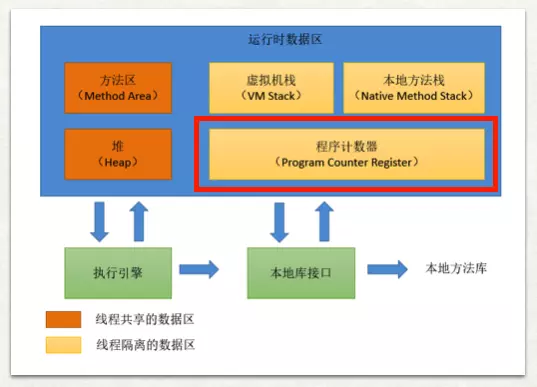
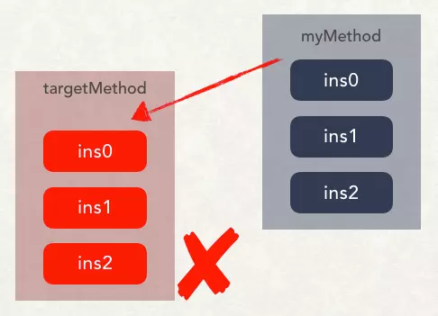
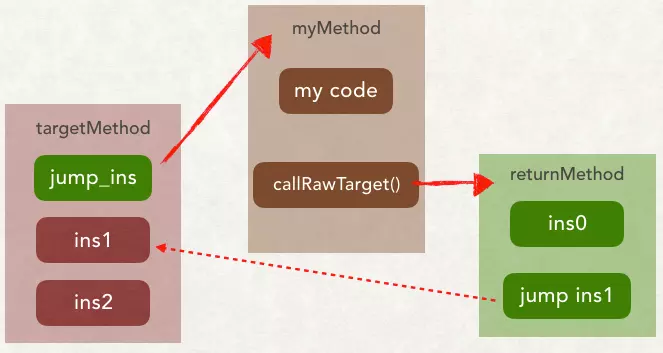
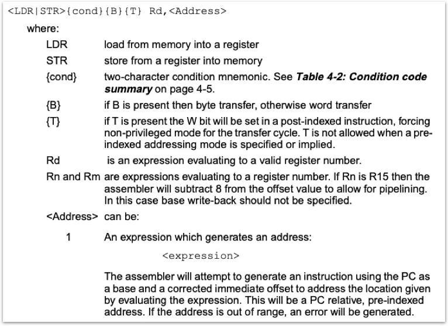
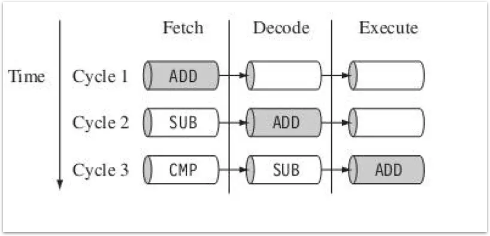
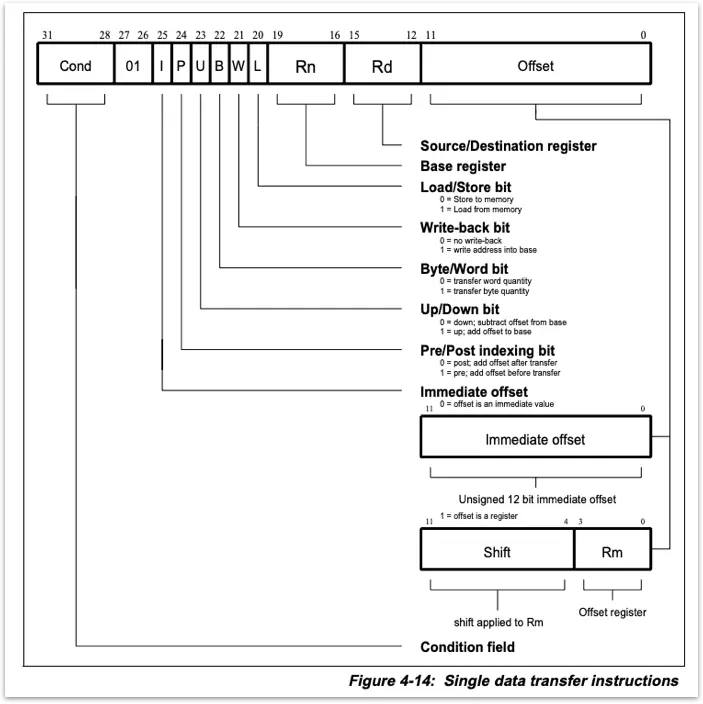
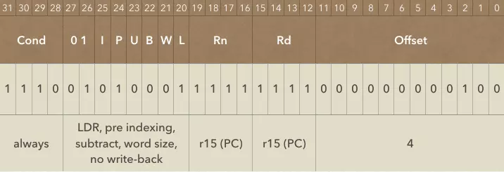

# Android Inline Hook详解

url：https://leeon7.github.io/2019/10/27/android-inline-hook/


## Hook

Hook在Android系统的应用根据框架层次可以分为两类，Java层和Native层，常见的实现方式如下：

| 框架层次 | Hook手段                                     |
| :------- | :------------------------------------------- |
| Java层   | 动态代理，代码、字节码织入（AspectJ、ASM等） |
| Native层 | GOT/PLT Hook，Trap Hook，Inline Hook         |

其中Native层的三种hook手段在应用范围、实现难度、性能等维度上有以下区别：

| 比较维度 | GOT/PLT Hook   | Trap Hook       | Inline Hook    |
| :------- | :------------- | :-------------- | :------------- |
| 实现原理 | 修改延时绑定表 | SIGTRAP断点信号 | 运行时指令替换 |
| 粒度     | 方法级         | 指令级          | 指令级         |
| 作用域   | 窄             | 广              | 广             |
| 性能     | 高             | 低              | 高             |
| 难度     | 中             | 中              | 极高           |

这三种方式在实际环境中应用较多的是GOT/PLT Hook，由于只是在ELF动态链接的默认流程上稍作修改，这种方式侵入性较低，且能保证性能，可以方便的实现对so库的方法hook，唯一的缺点是只能作用于绑定表中存在的方法，作用域有一定限制。trap hook由于使用系统中断，在性能上表现不好。Inline hook是终极hook手段，通过直接修改运行时内存的方式替换指令，完全手工的完成hook及跳回操作，理论上可以实现任意位置的hook，不过手写指令时需要考虑abi兼容等众多因素，实现难度很高，实际应用的场景不多。

## 汇编

在手撕汇编之前，先简单回顾下基础知识


平时用来开发的高级语言必须转换成低级语言才能被CPU执行，根据是否有中间结果的区别，完成转换的可能是编译器或虚拟机。和百花齐放的高级语言不同，低级语言只有两种，汇编和机器码（即二进制码），汇编是机器码的文本化表示，两者是一对一的对应关系。



逻辑上讲，汇编是为了解决机器码可读性的产物，汇编在执行前需要先翻译成机器码，这个过程叫assembing，所以汇编语言叫ASM。

> $ gcc -S yourfile可以将c文件编译成汇编文件.s

## 寄存器



为了填平运算组件（CPU）和存储单元（硬盘）的性能沟壑，会在其间加几个缓冲单元，从慢到快依次是RAM、Cache、寄存器。一般CPU会自带这些缓冲层，其中寄存器直接跟CPU交互，是读取速度最快的单位。随着发展CPU的寄存器数量从几个增长到了几十个（ARM有37个），其中前16个一般会被当作通用寄存器使用（编号0-15），而编号15的寄存器又最为特殊，一般会把r15当作program counter，熟悉JVM的同学知道在虚拟机中也有类似的概念，只是一个是虚拟的，一个是真实的：



一般把r15当作PC寄存器，即program counter，也就是Instruction Pointer，指向程序当前执行到的那条指令。

## Inline Hook

回到主题，指令级别的hook跟高级语言层面的实现方式在感官上有很大区别，高级语言中不管借助什么手段，只需将hook代码织入到目标代码之中即可，但这种方式在指令级别是行不通的，见下图：




我们需要知道，操作系统将程序指令成段装载到内存里，我们手动把若干指令插入到某个位置就是改动了程序装载后的内存结构，这意味着程序需要重新做`地址重定位`才能正常运行，这本该由链接器完成的工作换成人工来计算几乎是不可能的，所以这肯定不是实现hook的正确方式。为了保持内存结构不变，正确的方法是使用`指令替换`而不是指令插入的方式来实现hook，见下图：



假设目标方法内有ins0, ins1, ins2三条指令，首先将起始指令（实际上是前2条指令）替换为`等长`的跳转指令jump_ins，jump_ins负责跳转到hook方法执行，而hook操作后，往往还需要保留调用原方法的能力以保证功能可用性，所以hook方法内还有一个跳转指令来调回原方法继续执行（jump ins1），调回前需要先补充执行目标方法已被替换的原始指令（图中ins0），保证原方法完整性。综上，inline hook需要完成的工作就是图中绿色的部分，即跳转指令的替换、补充执行原指令、跳回原方法继续执行这三步。

### 跳转指令

先简单熟悉下ARM的常用指令集

| 类型           | 功能                    | 举例               |
| :------------- | :---------------------- | :----------------- |
| 跳转           | 跳转到目标地址执行      | B, BL, BLX, BX     |
| 数据处理       | 数据传送、算术、比较等  | MOV, CMP, ADD, MUL |
| 加载/存储      | 读取/写入寄存器         | LDR, LDRB, LDRH    |
| 访问状态寄存器 | 读取/写入程序状态寄存器 | MRS, MSR           |
| 访问协处理器   | 操作协处理器            | CDP, LDC           |
| 异常/中断      | 产生软件中断            | SWI, BKPT          |
| 伪指令         | -                       | -                  |

以B开头的指令是专门的跳转指令，不过在这里不适用inline hook的场景，因为它们只用来完成32MB以内的相对地址的跳转，而我们无法保证hook方法在这个范围内。如何实现绝对地址的跳转呢？回忆下，还记得PC这个特殊地位的寄存器吗？它存储着程序当前执行的指令地址，换句话说，CPU执行的指令是从PC指向的地址取出来的，那么我们将一个目标地址写入PC就实现了绝对地址的跳转，对应的是写入寄存器的指令：LDR。查询文档，LDR指令格式如下：



大括号内的可选参数暂时不管，指令格式可归纳为`LDR Rd, <destication address>`，其中Rd为目标寄存器，中括号内为得出一个绝对地址的表达式，表达式内部可能用到Rn和Rm两个寄存器作为操作数，也可能是一个立即数。假设想要跳转的地址是0x11111111，那么将该地址写入PC的指令就是`LDR PC, 0x11111111`，可随即遇到一个问题，ARM下每条指令的长度是32位，而地址长度也是32位，将一个绝对地址写入一个指令里显然是不可能的，像`LDR PC, 0x11111111`这样的指令是无法写入内存的。那么该如何在一条指令的空间里写入一个绝对地址的表达式呢？

#### 寄存器间接寻址

注意到一个寄存器的容量也是32位，刚好能装下一个绝对地址，所以可以把目标地址先存到某个寄存器（Rm）中，然后执行`LDR PC, Rm`就实现了绝对地址的跳转，这种以某个寄存器作为基准的寻址方式叫做寄存器间接寻址。再进一步，在实际开发中我们发现PC寄存器就是一个天然的铆点，并且`想要跳转的目标地址往往离程序当前执行到的地址不远`，所以索性用PC加上一个偏移量来表达一个绝对地址，格式为：`LDR PC, [PC, offset]`，这种寻址方式又叫`PC相对寻址`。使用PC相对寻址，我们可以用8个字节（即2条指令的长度）来完成一个绝对地址的跳转操作：

| 虚拟地址   | 内容                |
| :--------- | :------------------ |
| 0x00006000 | LDR PC, [PC, 4]     |
| 0x00006004 | destination address |

0x00006000位置的指令含义为当CPU执行到此时，将该地址加4字节-即0x00006004地址内的内容写入到PC中，而内容就是我们事先写入的目标地址。

到此跳转指令似乎完成了，可实际上还需要做一个调整，由于ARM下CPU遵循`三级流水`的执行流程，PC并不指向当前指令，见下图：



三级流水可以近似理解为三线程并行。三级流水将CPU运行拆解为三个步骤：取指、转译、执行。取指单元在取出一条指令后，会交给下游-转译单元进行翻译，转而继续取下一条指令，无需等待该指令后续的步骤。三个单元有各自的流水线，这样造成的结果就是PC（即取指单元）总是指向正在执行的指令往后两条指令的地址位置，如图当CPU执行ADD指令时，Fetch已取到了CMP指令，领先了ADD两条指令的距离。依据此，需要对上面的跳转指令做如下调整：

| 虚拟地址   | 内容                |
| :--------- | :------------------ |
| 0x00006000 | LDR PC, [PC, -4]    |
| 0x00006004 | destination address |

可以看到，从PC+4变成了PC-4，PC-4其实是[PC-8]+4。即当CPU执行到0x00006000时PC已经指向了0x00006000+2*4的位置，需要先减去8字节才得到当前执行位置，再加4字节便得到0x00006004。

#### 翻译为机器码

将指令写入内存时需要翻译为机器码，根据文档，LDR命令的机器码格式为：



根据文档将指令`LDR PC, [PC, -4]`翻译为32位的二进制机器码：



其中28-31位表示执行条件，1110代表总是执行，26-27位01表示LDR，后面到20位是6个独立标志位，其中第23位U为0表示做`减法`，Rn表示基准寄存器编号，1111即为15，表示r15，也就是PC，Rd表示目标寄存器，也是PC，0-11位用来存储立即数，100就是4，这就是`LDR PC, [PC, -4]`的机器码，转换成16进制是**0xe51ff004**。最终得到跳转hook方法地址的程序内容如下：

| 虚拟地址   | 内容              |
| :--------- | :---------------- |
| 0x00006000 | 0xe51ff004        |
| 0x00006004 | my method address |

### 跳回指令

跳回指令和跳转指令格式一样，只是将目标地址从hook方法的起始地址改为原函数继续执行的地址：

| 虚拟地址   | 内容           |
| :--------- | :------------- |
| 0x00008000 | 0xe51ff004     |
| 0x00008004 | return address |

其中return address = 目标方法起始地址 + 替换指令长度 = 目标方法起始地址 + 8字节

### 指令修复

完成了跳转和跳回指令，剩下的操作就只有补充执行原函数中被替换的原始指令了。这步是inline hook最复杂的一步，也是inline hook的难度所在。回忆下前面提到的`PC相对寻址`，实际上这种寻址方式应用相当广泛，带来的结果就是指令往往与当前的PC值强绑定。当我们手动修改程序流程，跳到hook方法再回头执行原始指令时，PC已不再是原始指令预期的值，毫无疑问会执行异常。所以执行原始指令前要进行指令修复，修复方法就是将指令中PC的值修改为预期的值（注意并不是修改PC，只是修改指令中的表示PC值的那几位数据）。

指令修复需要涵盖PC相关的所有指令类型，这里只用ADD指令来举例说明：

> ADD Rd, [PC, Rm]

对上面指令进行修复，可以预见指令的机器码中第一个操作数那几位肯定是1111（即r15=PC），我们需要将其改为一个其他寄存器Rx，而Rx中存入该指令预期的PC值，即指令被替换前的PC值。代码如下：

```
//执行到原方法时，pc值是原方法起始地址+8字节
uint32_t pc = target_addr + 8;

int rd;
int rm;
int r;

//用位运算提取出指令中用到的Rd和Rm寄存器编号
rd = (instruction & 0xF000) >> 12;
rm = instruction & 0xF;

//找出一个闲置寄存器r（既不是Rd也不是Rm），用来保存hook前的pc
for (r = 12; ; --r) {
	if (r != rd && r != rm) {
		break;
	}
}

//将Rr的值入栈暂存
trampoline_instructions[trampoline_pos++] = 0xE52D0004 | (r << 12);	// PUSH {Rr}
//将原始pc值写入Rx
trampoline_instructions[trampoline_pos++] = 0xE59F0008 | (r << 12);	// LDR Rr, [PC, #8]
//用Rx编号替换指令中的PC编号
trampoline_instructions[trampoline_pos++] = (instruction & 0xFFF0FFFF) | (r << 16);
//暂存值出栈到Rx
trampoline_instructions[trampoline_pos++] = 0xE49D0004 | (r << 12);	// POP {Rr}
//跳越4字节执行
trampoline_instructions[trampoline_pos++] = 0xE28FF000;	// ADD PC, PC
trampoline_instructions[trampoline_pos++] = pc;
```

这样就完成了加法指令的修复，其他类型指令的修复方式大同小异，基本思想都是PC值替换。

## 三方库

实现inline hook的三方库很稀缺，已知的有Cydia Substrate，并已停止开源，官网：http://www.cydiasubstrate.com/

> 参考：http://ele7enxxh.com/Android-Arm-Inline-Hook.html