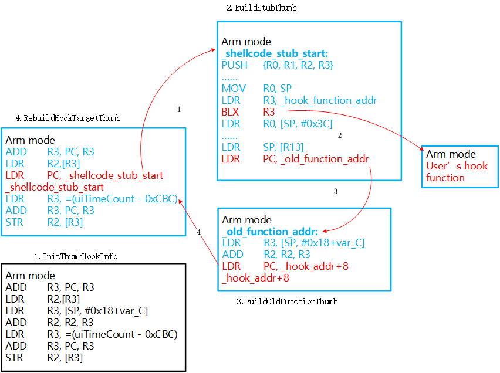

# Android Native Hook技术路线概述

url：https://gtoad.github.io/2018/07/05/Android-Native-Hook/

## 前言

在目前的安卓APP测试中对于Native Hook的需求越来越大，越来越多的APP开始逐渐使用NDK来开发核心或者敏感代码逻辑。 个人认为原因如下：

1. 安全的考虑。各大APP越来越注重安全性，NDK所编译出来的so库逆向难度明显高于java代码产生的dex文件。越是敏感的加密算法与数据就越是需要用NDK进行开发。
2. 性能的追求。NDK对于一些高性能的功能需求是java层无法比拟的。
3. 手游的兴起。虚幻4，Unity等引擎开发的手游中都有大量包含游戏逻辑的so库。

因此，本人调查了一下Android Native Hook工具目前的现状:尽管Java层的Hook工具多种多样，但是Native Hook的工具缺寥寥无几。（文末说明1） 主要有两大路线：

1. PLT Hook
2. Inline Hook

这两种技术路线本人都实践了一下，下面来对比总结。

## PLT Hook

先来介绍一下Android PLT Hook的基本原理。Linux在执行动态链接的ELF的时候，为了优化性能使用了一个叫延时绑定的策略。相关资料有很多，这边简述一下：这个策略是为了解决原本静态编译时要把各种系统API的具体实现代码都编译进当前ELF文件里导致文件巨大臃肿的问题。所以当在动态链接的ELF程序里调用共享库的函数时，第一次调用时先去查找PLT表中相应的项目，而PLT表中再跳跃到GOT表中希望得到该函数的实际地址，但这时GOT表中指向的是PLT中那条跳跃指令下面的代码，最终会执行`_dl_runtime_resolve()`并执行目标函数。第二次调用时也是PLT跳转到GOT表，但是GOT中对应项目已经在第一次`_dl_runtime_resolve()`中被修改为函数实际地址，因此第二次及以后的调用直接就去执行目标函数，不用再去执行`_dl_runtime_resolve()`了。因此，PLT Hook通过直接修改GOT表，使得在调用该共享库的函数时跳转到的是用户自定义的Hook功能代码。

了解PLT Hook的原理后，可以进一步分析出这种技术的特点：

1. 由于修改的是GOT表中的数据，因此修改后，所有对该函数进行调用的地方就都会被Hook到。这个效果的影响范围是该PLT和GOT所处的整个so库。因此，当目标so库中多行被执行代码都调用了该PLT项所对应的函数，那它们都会去执行Hook功能。
2. PLT与GOT表中仅仅包含本ELF需要调用的共享库函数项目，因此不在PLT表中的函数无法Hook到。

那么这些特点会导致什么呢？

1. 可以大量Hook那些系统API，但是难以精准Hook住某次函数调用。这比较适用于开发者对于自家APP性能监控的需求。比如Hook住malloc使其输出参数，这样就能大量统计评估该APP对于内存的需求。但是对于一些对Hook对象有一定精准度要求的需求来说很不利，比如说是安全测试或者逆向分析的工作需求，这些工作中往往需要对于目标so中的某些关键点有准确的观察。
2. 对于一些so内部自定义的函数无法Hook到。因为这些函数不在PLT表和GOT表里。这个缺点对于不少软件分析者来说可能是无法忍受的。因为许多关键或核心的代码逻辑往往都是自定义的。例如NDK中实现的一些加密工作，即使使用了共享库中的加密函数，但秘钥的保存管理等依然需要进一步分析，而这些工作对于自定义函数甚至是某行汇编代码的监控能力要求是远远超出PLT Hook所能提供的范围。
3. 在回调原函数方面，PLT Hook在hook目标函数时，如果需要回调原来的函数，那就在Hook后的功能函数中直接调用目标函数即可。可能有点绕，详细解释一下：假设对目标函数malloc()的调用在1.so中，用户用PLT Hook技术开发的HookMalloc()功能函数在2.so中。（因为通常情况下目标函数与用户的自定义Hook功能函数不在一个ELF文件里）当1.so中调用malloc()时会去1.so的PLT表中查询，结果是执行流程进入了2.so中的HookMalloc()中。如果这时候HookMalloc中希望调用原目标函数malloc()，那就直接调用malloc()就好了。因为这里的malloc会去2.so中的PLT表中查询，不受1.so中那个被修改过的PLT表的影响。

#### 典型的PLT Hook工具推荐

本技术路线的典型代表是爱奇艺开源的[xHook](https://github.com/iqiyi/xHook)工具库。xhook 是一个针对 Android 平台 ELF (可执行文件和动态库) 的 PLT (Procedure Linkage Table) hook 库。从维护频率和项目标志设计来看这是一款产品级的开源工具。

通过学习其源码与使用后可以发现，这个工具库主要是用于开发者开发时把该项目集成进自己的APP，然后使用这个工具库来帮助开发者监控APK运行时那些他们关心的性能数据。比如通过hook malloc来监控内存分配等。由于这个库是被开发者集成进了APP中，所以它对于这个app的监控是不需要Root权限的。

我个人认为这个工具对于PLT Hook技术的解读与定位非常好！在我上文分析的三点中不难看出，PLT Hook技术应用的方向就应该是对自家开发的APP的性能监控。用该技术进行Hook的最大优势就在于其对于目标API可以进行批量Hook，使得开发者可以节省下大量的原本需要在APP中各个功能点上插入相关日志输出的工作。PLT Hook技术是偏向于开发者的利器的定位非常明确。对于非官方的软件分析者似乎并不适合。

## Inline Hook

本技术路线的基本原理是在代码段中插入跳转指令，从而把程序执行流程引向用户需要的功能代码中去，以此达到Hook的效果，如下图所示：

这张图是一张arm下最基本的hook流程，如果客官对于Inline Hook有着进一步的学习需求的话，请看一下本人的另一篇文章[《Android Native Hook工具实践》](https://gtoad.github.io/2018/07/06/Android-Native-Hook-Practice/)吧~。从上图中可以看出主要有如下几个步骤：

1. 在想要Hook的目标代码处备份下面的几条指令，然后插入跳转指令，把程序流程转移到一个stub段上去。
2. 在stub代码段上先把所有寄存器的状态保存好，并调用用户自定义的Hook功能函数，然后把所有寄存器的状态恢复并跳转到备份代码处。
3. 在备份代码处把当初备份的那几条指令都执行一下，然后跳转到当初备份代码位置的下面接着执行程序。

由此可以看出使用Inline Hook有如下的Hook效果特点：

1. 完全不受函数是否在PLT表中的限制，直接在目标so中的任意代码位置都可进行Hook。这个Hook精准度是汇编指令级的。这对于逆向分析人员和安全测试人员来说是个非常好的特性！
2. 可以介入任意函数的操作。由于汇编指令级的Hook精度，以及不受PLT表的限制，Inline Hook技术可以去函数执行中的任意代码行间进行Hook功能操作，从而读取或修改任意寄存器，使得函数的操作流程完全可以被控制。
3. 对Hook功能函数的限制较小。由于在第二步调用Hook功能函数前已经把所有之前的寄存器状态都进行保存了，因此此时的Hook功能函数几乎就是个独立的函数，它无需受限于原本目标函数的参数形式，完全都由自己说了算。并且执行完后也完全是一个正常的函数退出形式释放栈空间。
4. 对于PLT Hook的强制批量Hook的特性，Native Hook要灵活许多。当想要进行批量Hook一些系统API时也可以直接去找内存里对应的如libc.so这些库，对它们中的API进行Hook，这样的话，所有对这个API的调用也就都被批量Hook了。

## 技术对比

根据以上的分析，我们发现这两种技术在原理和适用场景上的差别是相当大的。因此有必要进行一下对比，给那些有Native Hook需求的童鞋一些参考。

| Name     | PLT Hook                         | Native Hook                               |
| :------- | :------------------------------- | :---------------------------------------- |
| 精准度   | `中` 函数级                      | `高`汇编级                                |
| 范围     | `小` 出现在PLT表中的动态链接函数 | `大` 目标so内全部可执行代码               |
| 灵活性   | `差` 只能批量                    | `好` 单次或批量都可以                     |
| 技术难度 | `中` 涉及内存地址计算和修改等    | `高` 涉及寄存器计算、手写汇编、指令修复等 |

## 总结

从上面的分析中不难看出，这两种技术各有特点。PLT Hook技术就好比自行车，容易得到，操作简便，但是功能极为有限;Inline Hook技术就像汽车，造价昂贵，操作复杂，但是几乎可以应对各种需求。 因此对于正在寻找Native Hook工具的同学们需要仔细预估一下自己的Native Hook需求，如果只对于系统调用有参数或者性能上的监控需求，那可以考虑采用PLT Hook技术路线。一般适合APP的官方员工。 而如果是希望应对各种各样APP自己独有的NDK函数或者代码段的话，目前只能选择Inline Hook。适合APP逆向人员，软件分析人员，CTF Android逆向解题等。

## 文末说明

关于文中的一些解释与需求可能与别的同学的理解有偏差，这很正常，因为大家对Native Hook的需求不同。此处补充解释一下：

1. 关于目前公开的Android Native Hook工具寥寥无几这一点我补充解释一下：唯一一个公开且接近于Java Hook的Xposed那样好用的工具可能就只是Cydia Substrate了。但是该项目已经好几年没更新，并且只支持到`安卓5.0以前`。还有一个不错的Native Hook工具是`Frida`，但是它的运行原理涉及`调试`，因此遇到`反调试`会相当棘手。由于本人反调试遇到的情况较多，所以Frida不怎么用。