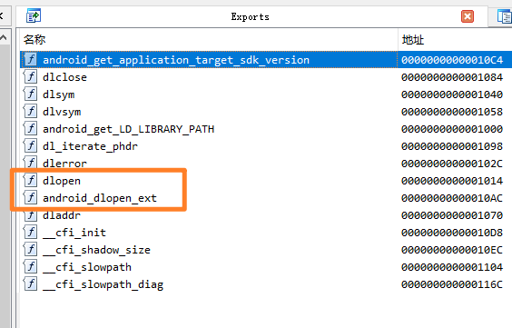
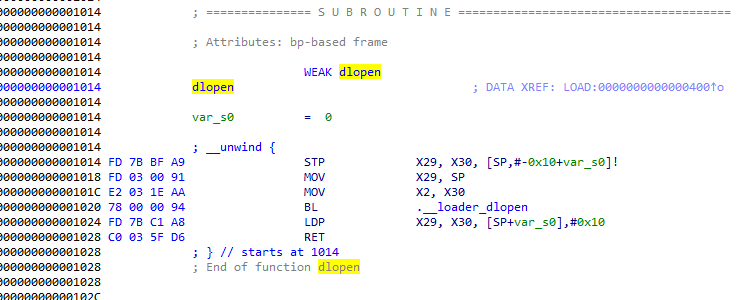
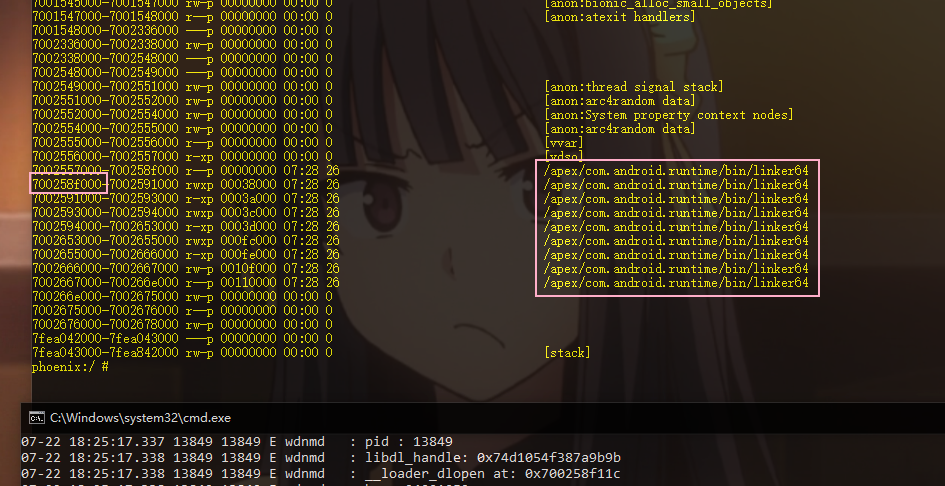
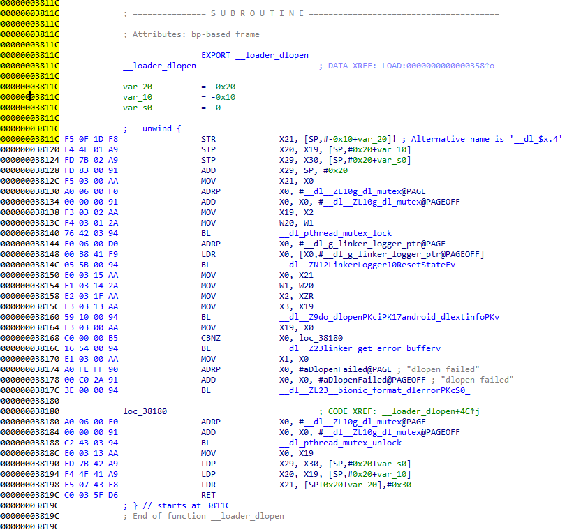
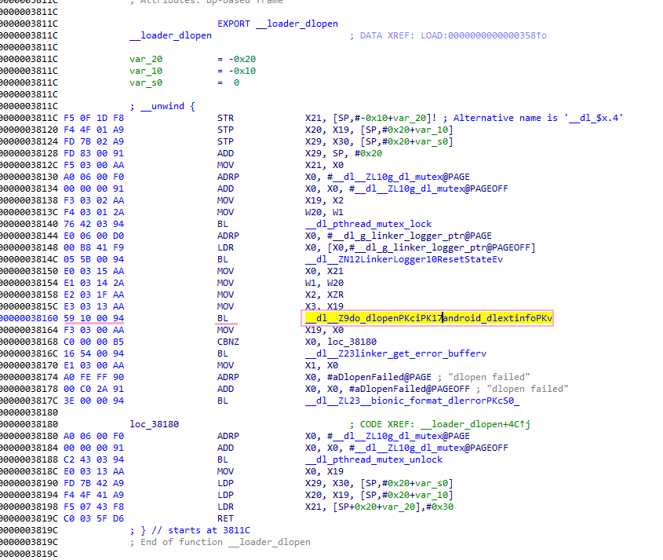
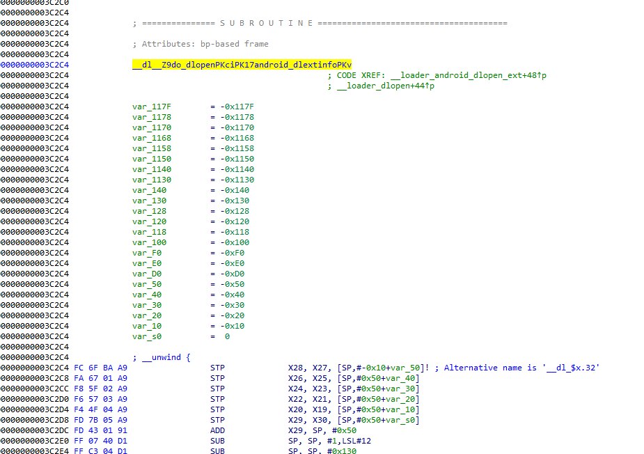

# Android10 aarch64 dlopen Hook

url：https://www.52pojie.cn/thread-1226153-1-1.html

# 前言[toc]
对于自动化hook Il2cpp 的模块来说, dlopen 的hook相当于一个大门, 没有该大门口, 一切都是纸上谈兵

在 armabi-v7a 上hook dlopen, 轻松的不要不要的, 甚至借用一下 virtual 系列app的 va++ 核心提供的 hook_dlopen 函数的接口都行

可是到了 aarch64 这里, 找了一圈, 能用的 hook构件 也就一枚 And64InlineHook, 而且源项目好像还得自己手动修一下才能使用.... (可惜whale不支持安卓10, 原hookzz的Dobby也木大)

好了有 hook构件 了, 但是我看了一圈主流的 VirtualApp 商业授权做出来的 虚拟多开 系列软件, 基本上都没实现 aarch64 的 hook_dlopen, 有的实现了却没有给调用, 自己去调用的话就会卡死 (还想 借鉴 一下方案, 逃个课先)


# 环境 & 预习
```
测试平台
机型: 红米K30-4G, 已Root
系统: miui11, android-10
```


看雪上看到的一篇文章: [Android9.0 hook dlopen问题](https://bbs.pediy.com/thread-257022.htm)
虽然半年前就看到这篇文章,但是基本上在看天书,现在拿出来看了一圈, 关键实现就是这里


虽然我看不懂什么 LR寄存器 什么的, 但是唯独看懂这第三个参数强制赋值为 dlerror 函数的函数地址, 以达到越过系统的限制

而关于那所谓的系统限制, 就是在安卓7开始, 系统就禁止 用户APP 打开/读取 部分 系统库文件 , 所以直接 dlopen linker 会直接失败, 具体可以使用 dlerror() 函数查看原因 (懒 不贴图了)

# 初步尝试Hook
## 反汇编 libdl.so
貌似安卓9开始, dlopen就由 libdl.so 库进行导入, 反汇编看看

看了一下导出函数, 也就只有两个函数涉及到dlopen




让我康康这个 dlopen 长什么样!



中间的 .__loader_dlopen 是个跳板


最终指向的是got表的导出变量 __loader_dlopen


## 康康 __loader_dlopen
步骤很简单

1. 加载 libdl.so

2. 使用 dlsym() 获取 __loader_dlopen

3. 打印该值, 顺便看看该内存所在maps的何处

```
LOGE("pid: %d", getpid());

void *libdl_handle = dlopen("libdl.so", RTLD_NOW);
LOGE("libdl_handle: %p", libdl_handle);

void *__loader_dlopen_addr = dlsym(libdl_handle, "__loader_dlopen");
LOGE("__loader_dlopen at: %p", __loader_dlopen_addr);
```

先查看logcat输出


__loader_dlopen 的值为0x700258f11c

使用adb shell去查看对应的内存区段

```
adb shell
su #升级为root用户
cat /proc/目标pid/maps
```



跑到 linker64 里去了, 把文件提取出来反汇编, 顺便先把这 __loader_dlopen 的偏移值算出来
0x700258f11c - 0x7002557000 = 0x3811C

## 反汇编 linker64
利用刚刚算出来的偏移,转跳后发现指向的是 linker64 里的 __loader_dlopen 函数



## 淦ta
直接一套组合拳打在 __loader_dlopen 函数上!

```
// 定义原型
void *(*orig___loader_dlopen)(const char *, int , const void *) = nullptr;
void *new___loader_dlopen(const char *filename, int flags, const void *caller_addr)
{
    void *handle = orig___loader_dlopen(filename, flags, caller_addr);
    LOGE("LoadedLib: {%s}:%p", filename, handle);
    return handle;
}

//执行hook
LOGE("pid: %d", getpid());

void *libdl_handle = dlopen("libdl.so", RTLD_NOW);
LOGE("libdl_handle: %p", libdl_handle);

void *__loader_dlopen_addr = dlsym(libdl_handle, "__loader_dlopen");
LOGE("__loader_dlopen at: %p", __loader_dlopen_addr);

A64HookFunction(__loader_dlopen_addr, (void *)new___loader_dlopen,
                (void **)&orig___loader_dlopen);
```

然后TM就蹦了!


# 骚操作 Hook
## 各种骚操作(木大)
一开始以为是hook构件出问题, 各种log查看
后来试试whale, 但这玩意不支持安卓10 (淦)
然后试试直接dlopen直接加载 libil2cpp.so, 也木大
尝试直接加载 linker64 再去hook, 但这玩意直接被限制, 读取都做不到
一天下来, 都要放弃了, 突然想到一个骚主意, 再试试吧

## 解析转跳指令

__loader_dlopen 函数中实际上进行dlopen的是该函数




不过由于没法进行加载 linker64 文件, 正常手段根本获取不到这玩意
(virtualApp的解析用上了open函数, 但是linker64文件无法被加载...木大)

不过好在我有解析过 Bxx指令 的经验
相关文章: [B与BL跳转指令目标地址计算方法](https://blog.csdn.net/qq_38365495/article/details/80537000) (aarch64无需再+8)

关键逻辑就是 (手动计算时,注意大小端转换! 人话就是,字节倒序才是内存中实际的样子!)

1. 指令进行左移8位(2字节)去掉转跳指令
2. 右移8位, 高位空缺填补回去
3. 左移2位, 获得实际的转跳偏移

合并到一起就变成了

```
//提取B指令的偏移  !!指令为4字节,一定要用对应的数据类型
#define Extract(symbol) (*(int32_t *)(symbol) << 8 >> 6)
```

## 测试看看
计算目标指令的偏移(目标指令地址-函数头地址=偏移)
0x38160 - 0x3811C = 0x44

上代码!

```
//提取B指令的偏移
#define Extract(symbol) (ulong)(*(int32_t *)(symbol) << 8 >> 6)

// 内存偏移
template <class T>
inline T MemoryOff(void *addr, ulong off) {
    return (T)((char *)addr + off);
}

// 修正B指令转跳
template <typename T>
inline T Amend_Bxx(T symbol) {
    return MemoryOff<T>((void *)symbol, Extract(symbol));
}

//打印
auto b_do_dlopen = MemoryOff<void *>(__loader_dlopen_addr, 0x44);
LOGE("hex: %x", *(int32_t *)b_do_dlopen);

auto do_dlopen = Amend_Bxx(b_do_dlopen);
LOGE("do_dlopen: %p", do_dlopen);
```

让我康康!


指令是没错了, 解析也正常, 看看打印出来的地址是否正确
0x70025932c4 - 0x7002557000 = 0x3C2C4




完美!!

进行Hook
直接提着地址进行hook!

```
//源函数声明
void *(*_DlopenV26)(const char *, int, int, int) = nullptr;
void *DlopenV26(const char *name, int flag1, int flag2, int flag3)
{
    void *handle = _DlopenV26(name, flag1, flag2, flag3);
    if (handle != nullptr)
        LOGE("LoadedLib: {%s}:%p", name, handle);
    return handle;
}

//hook
A64HookFunction(do_dlopen, (void *)DlopenV26, (void **)&_DlopenV26);
```

终于成功!!

# 关于Bxx指令偏移
目前只反编译过 红米K30-4G, 红米K20Pro 的 linker64 文件
偏移均为 0x44, 其他机型的 linker64 文件建议自行反编译看看
因为用的是骚操作, 能用就已经算不错了 T_T

# 总结
本方法算是笨方法, 不过总算有个门能让我踏进 aarch64 的世界了
有点诡异的是, 不知为何hook __loader_dlopen 函数会奔溃
理论上 Bxx指令 的偏移都是 0x44, 源码的实现都应该一样的
至于其他安卓版本....手头上就只有安卓10啊, 有心无力...


> [CIBao 发表于 2020-8-9 15:44](https://www.52pojie.cn/forum.php?mod=redirect&goto=findpost&pid=33504715&ptid=1226153)
> 但是调用回去我是没看懂莫名其妙的, chaos也没这个问题, 现在开源的支持安卓高版本的vapp除了这个vxp还有 ...


调用原函数分为两个步骤，第一个是跳转到跳板函数里，在这个函数里要执行所有被覆盖的指令，其中包含相对地址的要全部换成绝对地址，完成被覆盖的指令的执行后，在跳转回被覆盖指令的下一条进行执行，因为arm64不支持直接修改pc寄存器，所以必须对一个寄存器进行污染，And64InlineHook选的好像是x17吧，记不清了。因此64位的inlinehook调用原函数的逻辑是比较难理解的，不过这应该不是重点吧，主要是跟踪看一下哪里对内存的访问出现了问题，看看是哪个函数生成对应opcode的，修复修复就好了


