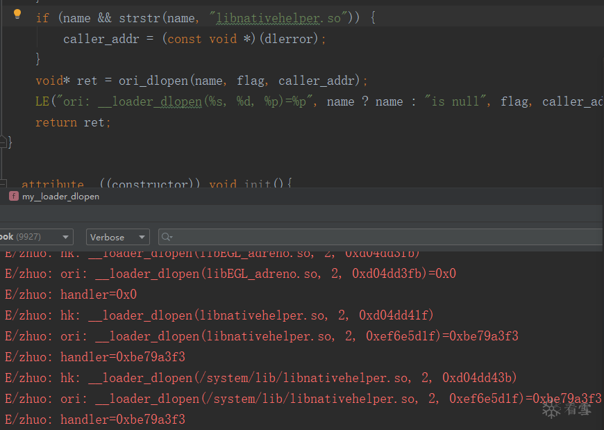

# Android9.0 hook dlopen问题/如何hook dlopen相关函数 

url：https://bbs.pediy.com/thread-257022.htm


Android9.0中在activity的onCreate之前hook dlopen函数，如果需要返回值(即修改了LR寄存器)，那么会触发：E/libEGL: EGL_ANDROID_blob_cache advertised, but unable to get eglSetBlobCacheFuncsANDROID。不会crash，但是界面不会绘制出来。

 

是因为dlopen(libEGL_adreno.so, 2)、dlopen(libGLESv2_adreno.so, 2)返回都是null。理论上其他任何hook框架也都存在这个问题，测试了几个也确实都存在。

 

dlopen函数实现在libdl.so，

```
.text:0000000000000EF8                 WEAK dlopen
.text:0000000000000EF8 dlopen                                  ; DATA XREF: LOAD:0000000000000508↑o
.text:0000000000000EF8
.text:0000000000000EF8 var_s0          =  0
.text:0000000000000EF8
.text:0000000000000EF8 ; __unwind {
.text:0000000000000EF8                 STP             X29, X30, [SP,#-0x10+var_s0]!
.text:0000000000000EFC                 MOV             X29, SP
.text:0000000000000F00                 MOV             X2, X30 ; a3
.text:0000000000000F04                 BL              .__loader_dlopen
.text:0000000000000F08                 LDP             X29, X30, [SP+var_s0],#0x10
.text:0000000000000F0C                 RET
.text:0000000000000F0C ; } // starts at EF8
.text:0000000000000F0C ; End of function dlopen
```

这里把LR寄存器当作第三个参数传递给.__loader_dlopen，而我们hook时为了能拿到返回值是修改了LR寄存器的，这是不可避免的。如果不修改LR寄存器，除非我们知道函数结尾，在函数结尾修改LR寄存器或者跳到shellcode/hook函数，但是通常是不现实的，函数开头容易确认，函数结尾很难自动化确认。

```
// Proxy calls to bionic loader
__attribute__((__weak__))
void* dlopen(const char* filename, int flag) {
  const void* caller_addr = __builtin_return_address(0);
  return __loader_dlopen(filename, flag, caller_addr);
}
```

__builtin_return_address函数应该是gcc内部函数，0获取的是被调用函数返回后执行的指令地址，至于1之后的数字是否能获取到函数调用栈待测试。已测试：
1、0获取的就是进入函LR寄存器的值。
2、1获取的是r7(thumb)/r12(arm)，即ip寄存器的值，所以能不能获取到正确的值取决于上层是否使用了ip寄存器暂存sp，且ip寄存器之后(栈上)就是在栈上存储的LR寄存器的值。所以不满足这些条件的函数是获取不到的甚至是错误的。

```
爷爷函数：
.text:0000C250 ; __unwind {
.text:0000C250                 PUSH            {R4,R5,R7,LR}
.text:0000C252                 ADD             R7, SP, #8
...
.text:0000C292                 BLX             j__Z12test_replacev ; test_replace(void)
 
--------------------------------------
 
父函数：
.text:0000B648                 PUSH            {R7,LR}
.text:0000B64A                 MOV             R7, SP
...
.text:0000B6A6                 BLX             j__Z12dump_replacePvS_PFvP10my_pt_regsP11STR_HK_INFOES5_PKc ;
 
--------------------------------------
 
子函数：
.text:0000D268                 PUSH            {R4-R7,LR}
.text:0000D26A                 ADD             R7, SP, #0xC
...
.text:0000D2DA                 MOV             R1, R7
.text:0000D2DC                 LDR             R1, [R1];    父函数传过来的R7的值
.text:0000D2DE                 LDR             R3, [R1,#4];r3寄存器为__builtin_return_address(1)，即取父函数放在R7之后的LR寄存器的值

```

.__loader_dlopen就是一个跳板

```
.plt:0000000000000DD8 ; __int64 __fastcall __loader_dlopen(__int64 a1, __int64 a2, __int64 a3)
.plt:0000000000000DD8 .__loader_dlopen                        ; CODE XREF: dlopen+C↓p
.plt:0000000000000DD8                 ADRP            X16, #off_1FF70@PAGE
.plt:0000000000000DDC                 LDR             X17, [X16,#off_1FF70@PAGEOFF]
.plt:0000000000000DE0                 ADD             X16, X16, #off_1FF70@PAGEOFF
.plt:0000000000000DE4                 BR              X17     ; __loader_dlopen
.plt:0000000000000DE4 ; End of function .__loader_dlopen

```

导入**loader_dlopen函数，实现在linker/64，所以从libdl.so的got表中可以获取**loader_dlopen函数的绝对地址。

```
static void* dlopen_ext(const char* filename,
                        int flags,
                        const android_dlextinfo* extinfo,
                        const void* caller_addr) {
  ScopedPthreadMutexLocker locker(&g_dl_mutex);
  g_linker_logger.ResetState();
  void* result = do_dlopen(filename, flags, extinfo, caller_addr);
  if (result == nullptr) {
    __bionic_format_dlerror("dlopen failed", linker_get_error_buffer());
    return nullptr;
  }
  return result;
}
 
void* __loader_android_dlopen_ext(const char* filename,
                           int flags,
                           const android_dlextinfo* extinfo,
                           const void* caller_addr) {
  return dlopen_ext(filename, flags, extinfo, caller_addr);
}
 
void* __loader_dlopen(const char* filename, int flags, const void* caller_addr) {
  return dlopen_ext(filename, flags, nullptr, caller_addr);
}
```

dlopen_ext函数被**loader_dlopen函数内联了，所以**loader_dlopen函数足够被inline hook了。

```
__int64 __fastcall _loader_dlopen(__int64 a1, unsigned int a2, __int64 a3)
{
  _BYTE *v3; // x21
  __int64 v4; // x19
  unsigned int v5; // w20
  __int64 v6; // x19
  __int64 v7; // x0
 
  v3 = (_BYTE *)a1;
  v4 = a3;
  v5 = a2;
  _dl_pthread_mutex_lock(&_dl__ZL10g_dl_mutex);
  _dl__ZN12LinkerLogger10ResetStateEv(&_dl_g_linker_logger);
  v6 = _dl__Z9do_dlopenPKciPK17android_dlextinfoPKv(v3, v5, 0LL, v4);
  if ( !v6 )
  {
    v7 = _dl__Z23linker_get_error_bufferv(0LL);
    _dl__ZL23__bionic_format_dlerrorPKcS0_("dlopen failed", v7);
  }
  _dl_pthread_mutex_unlock(&_dl__ZL10g_dl_mutex);
  return v6;
}
```


首先为了验证是不是因为LR寄存器导致的问题，使用dump函数"(dump((void*)dlopen, onPreCallBack, NULL, "dlopen");)"，只在函数之前打印下参数寄存器，之后调用原函数，发现可以正常运行了。

 

使用导入表/导出表hook dlopen也出现该问题。

 

hook __loader_dlopen代替dlopen，发现dump、replace都可以正常运行，至此可以确定确实是修改了LR寄存器的问题。

 

而**loader_dlopen函数导出在linker，通过dlsym(RTLD_DEFAULT, "**loader_dlopen")是获取不到的，linker不是动态库，这里采用

```
//高版本尽量使用，没有详细看各个版本的Android，不过记忆中从Android8.0使用的libdl.so，所以应该8.0及以上
//或者一步到位hook所有dlopen(包括dlopen_ext)都调用的函数do_dlopen，这个函数在linker中，所以需要在linker中找到函数地址，并没有导出，但是没有去符号，可以自己解析
//    void *do_dlopen = dlsym(RTLD_DEFAULT, "__dl__Z9do_dlopenPKciPK17android_dlextinfoPKv");
//    LE("do_dlopen=%p", do_dlopen);
//    dump((void*)do_dlopen, onPreCallBack, onCallBack, "do_dlopen");
void test__loader_dlopen(){
    //因为__loader_dlopen只在libdl.so导入，真正的导出函数是在linker中
    void *__loader_dlopen = dlsym(RTLD_DEFAULT, "__loader_dlopen");//0x7d3ff19dd8
    LE("__loader_dlopen=%p", __loader_dlopen);
    if (!__loader_dlopen) {
        //通过libdl.so拿到的__loader_dlopen地址就是linker导出的函数地址。看源码的话这个__loader_dlopen函数只是调用dlopen_ext，应该因为
        //太短无法hook，不过就是因为太短被和dlopen_ext内联成一个函数了，dlopen_ext未导出。所以可以hook。
        void *dl = dlopen("libdl.so", RTLD_LAZY);
        LE("libdl.so=%p", dl);
        __loader_dlopen = dlsym(dl, "__loader_dlopen");//0x7d3ff19dd8
        LE("__loader_dlopen=%p", __loader_dlopen);
    }
 
    if (!__loader_dlopen) {
        return;
    }
 
    //    dump((void*)__loader_dlopen, onPreCallBack, onCallBack, "__loader_dlopen");
    const RetInfo info = dump_replace((void *) __loader_dlopen, (void *) (my__loader_dlopen), NULL,
                                       NULL, "__loader_dlopen");
    if (info.status != success) {
        LE("hook __loader_dlopen error=%d", info.status);
    }
 
}
```

通过第三个参数确定libEGL_adreno.so是被libGLESv2_adreno.so内的函数dlopen；libGLESv2_adreno.so应该是被libadreno_utils.so内的函数dlopen；依此类推libgrallocutils.so、libadreno_utils.so、libboost.so、libgui.so。可能有误，因为这个其实不关键，我也不关心gui流程，有谁关心这个的可以分析整个流程。

 

因为传入的p(LR寄存器的值)导致返回null,即使不为null，后面对应的android_namespace_t肯定也不一致。

```
soinfo* find_containing_library(const void* p) {
  ElfW(Addr) address = reinterpret_cast<ElfW(Addr)>(p);
  for (soinfo* si = solist_get_head(); si != nullptr; si = si->next) {
    if (address >= si->base && address - si->base < si->size) {
      return si;
    }
  }
  return nullptr;
}
```


最终结果就是已加载的so是其他命名空间、classloader加载的，所以查找不到最终返回null。看到这发现和7.0之后的限制私有api是一回事。那么即然是根据第三个参数判断的，那么hook __loader_dlopen函数传入一个符合的地址是不是就可以绕过了。

 

进行测试：


看到日志linker: library "/system/lib/libnativehelper.so" ("/system/lib/libnativehelper.so") needed or dlopened by可以确定就是android7.0开始采用的命名空间限制私有api调用。

 

对其进行过滤，把LR寄存器的值改为符合地址范围的，这里我使用dlerror的地址，只要符合即可。通过日志可以看到成功了。


 

所以这就是我早期针对Android7.0限制私有api的一种绕过方式，比起自己加载系统so，自己解析再通过偏移值确定地址好些。。。，通过这还可以延伸出我动态注入时做的一件事情全局绕过私有api限制。以前frida是没有这么做过的，没看最近的代码，不确定是否现在也采用这样的方法了没有。

 

所以对于hook dlopen可以这么划分：
1、低于7.0的版本只hook dlopen即可。
2、8.0以上最好hook __loader_dlopen或者do_dlopen。或者hook dlopen过滤发现是系统so(限制的私有so)不取返回值(即不修改LR寄存器)，或者自行解析、重组dlopen的指令传入原来的LR寄存器(不推荐)。
3、7.0-7.1的hook do_dlopen，因为没有采用libdl.so做中转。
4、全局关闭命名空间限制使用私有api，不是特别推荐吧，但其实我是这么做的。
5、更投机取巧的方法，即然只要LR寄存器合乎规则即可，那么可以针对dlopen、dlsym从BL指令转成先设置LR寄存器为一个libc等so里面的一个不常用的函数c(常用的也不是不行，但是对效率可能有影响)，之后使用B指令跳转到备份/修复的dlopen原函数执行。c函数进行hook，使用一样的跳板，只是shellcode有些不一样。因为dlopen等函数执行完会跳回c函数，那么LR寄存器就是c函数的地址，只要c函数不是一个递归函数，那么就可以通过判断LR寄存器区别出是dlopen等函数的返回还是其他函数正常调用的c函数。当是dlopen函数返回时再跳回dlopen的shellcode处完成返回。

 

未解决的疑问：
我记得梆梆也hook了dlopen、dlsym，arm使用的是Cydia Substrate框架，在高版本上应该也存在这个问题的，但是以前没仔细看，我记得应该没特殊处理的，奇怪。抽时间再逆下，除非他改了生成的shellcode，非自己要hook的so就过滤掉，不修改LR寄存器。

 

已解决：后来抽时间看下，原来也是解析了**loader_dlopen、**dl__Z9do_dlopenPKciPK17android_dlextinfoPKv等，

```
if ( sdk_0 >= 24 )
      {
        if ( g_addr_do_dlopen )
        {
            p_dlopen = (void *(**)(const char *, int))g_addr_do_dlopen;

```

所以也是参照上面的3来做的。不过看其定位了一些安卓源码中没有的符号，所以也存在兼容性问题？看来也是存在风险的。毕竟不是标准c/c++ api，确实有可能被魔改。

 

dlsym等其他几个函数也是类似的处理，甚至如果只是为了调用系统的私有api，只hook **loader_dlsym即可，使用dlsym(RTLD_DEFAULT, "xx")即可，把**loader_dlsym的第三个参数改为合法的地址。


评论：

```
void hook_dlopen() {
    void *symbol = NULL;
 
    if (find_symbol("__dl__Z9do_dlopenPKciPK17android_dlextinfoPKv", "linker", (unsigned long *)&symbol) == 0) {
        ZzHookReplace(symbol, (void*)&fake_dlopen_V24, (void**)&real_dlopen_V24);
    } else if (find_symbol("__dl__Z9do_dlopenPKciPK17android_dlextinfoPv", "linker", (unsigned long *)&symbol) == 0) {
        ZzHookReplace(symbol, (void*)&fake_dlopen_V24, (void**)&real_dlopen_V24);
    } else if (find_symbol("__dl__ZL10dlopen_extPKciPK17android_dlextinfoPv", "linker", (unsigned long *)&symbol) == 0) {
        ZzHookReplace(symbol, (void*)&fake_dlopen_V24, (void**)&real_dlopen_V24);
    } else if (find_symbol("__dl__Z20__android_dlopen_extPKciPK17android_dlextinfoPKv", "linker", (unsigned long *)&symbol) == 0) {
        ZzHookReplace(symbol, (void*)&fake_dlopen_V24, (void**)&real_dlopen_V24);
    } else if (find_symbol("__dl___loader_android_dlopen_ext", "linker", (unsigned long *)&symbol) == 0) {
        ZzHookReplace(symbol, (void*)&fake_dlopen_V24, (void**)&real_dlopen_V24);
    } else if (find_symbol("__dl__Z9do_dlopenPKciPK17android_dlextinfo", "linker", (unsigned long *)&symbol) == 0) {
        ZzHookReplace(symbol, (void*)&fake_dlopen_V19, (void**)&real_dlopen_V19);
    } else if (find_symbol("__dl__Z8__dlopenPKciPKv", "linker", (unsigned long *)&symbol) == 0) {
        ZzHookReplace(symbol, (void*)&fake_dlopen_V19, (void**)&real_dlopen_V19);
    } else if (find_symbol("__dl___loader_dlopen", "linker", (unsigned long *)&symbol) == 0) {
        ZzHookReplace(symbol, (void*)&fake_dlopen_V19, (void**)&real_dlopen_V19);
    } else if (find_symbol("__dl_dlopen", "linker", (unsigned long *)&symbol) == 0) {
        ZzHookReplace(symbol, (void*)&fake_dlopen, (void**)&real_dlopen);
    } else {
        ZzHookReplace((void*)dlopen, (void*)&fake_dlopen, (void**)&real_dlopen);
    }
}
```

frida解决hook dlopen方案好像是 <7.0直接hook dlopen ，>7.0则用capstone 解析 dlopen汇编获取 __loader_dlopen 第三个参数是libc.so的基址


> [lion张 ](https://bbs.pediy.com/user-639328.htm)请问楼主，可知道有什么办法在android直接调用基于glibc编译的arm动态库？以前找了一些加载库的代码（crazy_linker），不行。

没做过，无法回答，难道不应该自己定位下错误是什么去进行修复吗，比如先查找这个动态库依赖哪些glibc的so，比如libgcc_s.so、libc.so.6之类的，自己编译个arm可用的glibc、linker等。


> b xxx PreCall 和 PostCall 很鸡肋 所以我删了

留着吧，我一般用来打印LR