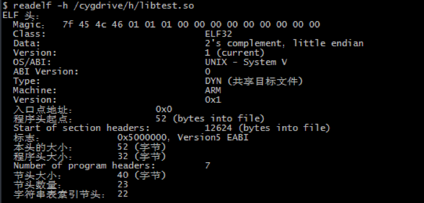
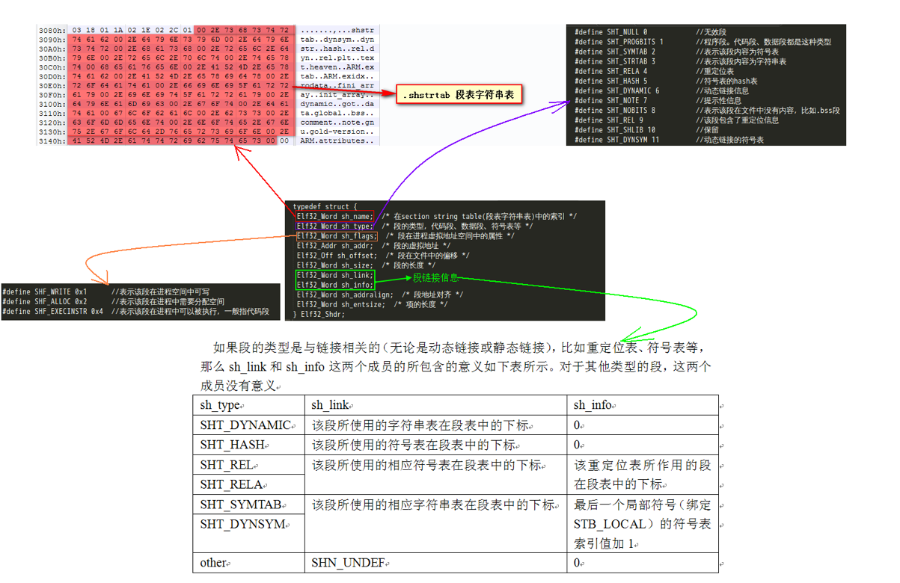

# ELF Hook总结与代码实现

url：http://www.wireghost.cn/2015/04/28/ELF-Hook%E6%80%BB%E7%BB%93%E4%B8%8E%E4%BB%A3%E7%A0%81%E5%AE%9E%E7%8E%B0/


## 什么是Hook

Hook，中文又译为“挂钩”或“钩子”。这里可以首先从字面上做了解，钩子是干什么的呢？日常生活中，我们的钩子是用来钩住某种东西的，比如说，鱼钩是用来钓鱼的，一旦鱼咬了钩，钩子就一直钩住鱼了，任凭鱼在水里怎么游，也逃不出鱼钩的控制。同样的，Android、IOS中的钩子Hook也是用来钩东西的，比较抽象的是它是用来钩函数或者变量的。举个例子，Hook钩子钩住键盘事件相关的函数，那么当有任何相应的键盘操作时，通过Hook就能知道用户都输入了些什么，多么形象啊，把老鼠Mouse钩住了，不管你干什么，都逃不过我钩子Hook的手掌心。

## Native Hook

掌握ELF Hook，有必要先了解下ELF文件格式，特别是对于符号表、GOT（全局偏移表）、PLT（过程链接表）、重定位表需要有个清晰的认识。至于这部分在之前的博文中就已做了详细介绍。。

### Hook 方式

So的Hook手法大体来说，一共有3种方式：导入表、导出表及Inline Hook。

#### 导入表Hook

前面已经提到过“.rel.dyn”和“.rel.plt”两个段中分别保存了该模块所需要导入的变量、函数符号以及其所在模块等信息，而“.got”和“.got.plt”则是保存着这些变量和函数的真正地址。所以，导入表hook的原理主要就是替换.GOT表中外部函数地址（还有一部分被保存在data数据段，比如使用全局函数指针调用外部函数时）

```
/*
 * hook rel.plt
 */
void plt_hook(const char* selfso,const char* funcName, void* realFunc, void** orgFunc){
    void* handle  = dlopen(selfso, RTLD_GLOBAL);
    if(!handle)
        return;
    soinfo* si = (soinfo*)handle;
    Elf32_Sym* symtab = si->symtab;
    const char* strtab = si->strtab;
    Elf32_Rel* rel = si->plt_rel;
    unsigned count = si->plt_rel_count;

    LOGW("realFunc:0x%08X",realFunc);
    bool flag = 0;
    for(unsigned idx = 0; idx < count; idx++){//外部依赖函数在rel_plt中
        unsigned type = ELF32_R_TYPE(rel->r_info);
        unsigned sym = ELF32_R_SYM(rel->r_info);
        unsigned reloc = (unsigned)(rel->r_offset + si->base);
        if(*((unsigned int*)reloc) == (unsigned int)realFunc){
            LOGW("addr had been replace.");
            break;
        }
        char* sym_name = (char*)(strtab + symtab[sym].st_name);
        LOGI("sym_name:%s, reloc_addr = %p",sym_name,reloc - (si->base));
        if(strcmp(sym_name, funcName)==0){
            LOGD("found %s in plt_rel",funcName);
            if(!replaceFunc((void*)reloc,realFunc,orgFunc)){
                break;
            }
        }
        rel++;
    }
    if(flag){
        LOGD("not find :%s in plt_rel",funcName);
    }
    dlclose(handle);
}
```


具体思路为：当用dlopen打开一个so时，实际返回的是一个soinfo结构体，这里已经包含了so的相关信息。之后，直接根据“.rel.plt”重定位表中的offset定位到“.got.plt”，进行修改替换即可。
如果细心观察的话，就会注意到上面的代码是有所遗漏的。它仅针对了直接调用外部函数的情况，当使用全局函数指针调用外部函数时（重定位类型为R_ARM_ABS32），用的是”.rel.dyn”重定位表，其下的offset会定位到data段，数据段的该地址下保存着实际外部函数的真正地址。对应实现上，只需补个重定位类型的判断，其余代码都是类似的，将”.rel.plt”换成”.rel.dyn”即可，有兴趣的同学可以自己动手试试。

##### 小结

导入表 HOOK的本质其实就是”改自身”，即修改当前应用进程下的Got表中外部符号地址。所以它的功能是很有限的，不会影响到其他进程。此外，对于通过dlopen 动态获得并调用外部符号这种情形是无效的。
特点：即时生效。因为是直接改的Got表、修改了外部函数的调用地址，所以在进行测试时是hook后可直接看到效果的。。

#### 导出表Hook

ELF文件中的符号表有说明该符号为导入符号还是导出符号，这点在linker.c源码中可以看到。linker将so加载到内存后，在最后阶段是有对符号进行重定位的。在重定位过程中，如果发现符号为外部符号，会去解析相应的依赖库，获取外部符号的地址。所以，导出表Hook的原理就是修改要hook的函数所在so中的符号表中的值，并对其进行替换。

```
/*
 * hook symtab
 */
void sym_hook(const char* hookso,const char* funcName, void* realFunc, void** orgFunc){
    void* handle  = dlopen(hookso, RTLD_GLOBAL);
    if(!handle)
        return;
    soinfo* si = (soinfo*)handle;
    Elf32_Sym* symtab = si->symtab;
    const char* strtab = si->strtab;

    for(unsigned idx = 0; idx < si->nchain; idx++){//自定义函数在symtab中
        char* sym_name = (char*)(strtab + symtab[idx].st_name);
        LOGI("sym_name in exports:%s, func_addr:0x%08X",sym_name,symtab[idx].st_value);
        if(strcmp(sym_name, funcName)==0){
            LOGD("found %s in exports",funcName);
            void* funcAddr = (void*)(symtab[idx].st_value + si->base);
            if((&symtab[idx])->st_value == (Elf32_Addr)((unsigned)realFunc-(si->base))){
                LOGW("addr had been replace.");
                break;
            }
            *orgFunc = funcAddr;
            LOGW("base_addr:0x%08X",si->base);
            LOGW("OldFun:0x%08X",*orgFunc);
            if(modifyMemAccess(&symtab[idx], PROT_EXEC|PROT_READ|PROT_WRITE)){
                LOGE("[-] modifymemAccess fails, error %s.", strerror(errno));
                break;
            }
            (&symtab[idx])->st_value = (Elf32_Addr)((unsigned)realFunc - (si->base));
            clearCache(symtab, getpagesize());
            LOGW("st_value:0x%08X, NewFun:0x%08X",symtab[idx].st_value,realFunc);
            break;
        }
    }
    dlclose(handle);
}
```


具体思路为：用dlopen打开一个so，根据返回的soinfo结构体定位到符号表。在符号表中查找要hook的函数名，并修改该符号的st_value值为NewFunc – BaseAddr（st_value保存的是偏移地址）

##### 小结

导出表Hook和导入表Hook的代码实现其实比较类似，本质都是修改函数地址，但却能起到较好的效果。因为它是直接改的要hook的函数所在so中的符号表，其他库要调用该so中的方法，都会从它的符号表下进行引用，并填充到自身的Got表下，所以能够起到一次Hook，永久替换的效果。当然，其拦截效果还是不如inline这种方式。不过由于inline hook会受到函数字节数的轻微限制，导出表hook也可视为一种对Inline的补充。此外，导出表Hook只能Hook导出的符号，对偏移函数没有办法。
特点：不能即时生效。因为改的是符号表，当前运行的程序已经加载完成，调用外部函数时，是直接走的Got。所以进行测试时，在hook完成后，还需要再loadlibrary一次，让修改过的符号重新导入到Got表。说到这里，其实也能dlopen、dlsym来进行测试，让dlsym来检验是否已修改目标的st_value。。

#### Inline Hook

Inline hook其实就是直接修改函数指令，对代码的调用流程进行替换，它的基本流程如下所示：
[](http://www.wireghost.cn/2015/04/28/ELF-Hook总结与代码实现/1.png)这部分的代码实现，个人是直接参考的https://github.com/crmulliner/adbi这个开源的hook 框架。不过，它有个bug，注意到这个问题是在http://drops.wooyun.org/tips/5409放出阿里举办的安全挑战赛的解题思路时（其实了解到adbi hook也是这个时间）。
[](http://www.wireghost.cn/2015/04/28/ELF-Hook总结与代码实现/2.png)对adbi hook源码中的这一部分进行修改后，再来分析下它的实现原理。先看看hook.h头文件中定义的hook_t结构体，具体结构如下：

```
struct hook_t {
    unsigned int jump[3];         //要修改的Hook指令(ARM)
    unsigned int store[3];        //被修改的原指令(ARM)
    unsigned char jumpt[20];      //要修改的Hook指令(Thumb)
    unsigned char storet[20];     //被修改的原指令(Thumb)
    unsigned int orig;            //被Hook的函数地址
    unsigned int patch;           //Hook的函数地址
    unsigned char thumb;          //表明要Hook函数所使用的指令集，1为Thumb，0为Arm
    unsigned char name[128];      //被Hook的函数名
    void *data;
};
```


可以注意到，inline hook是有判断原函数所使用的指令模式的。这是因为Arm处理器支持两种指令集，一个基本的Arm指令集，另一个是Thumb指令集。而hook的函数有可能是被编译成Arm指令集的，也有可能是被编译成Thumb指令集的。若一个用Arm指令集编译的函数被用Thumb指令集的指令给修改了，那必定会崩溃，反之亦然。。
那么要如何判断hook的函数用的是哪种指令集呢？代码中是这么判断的：

```
/* 使用Arm指令集的情况 */  
if (addr % 4 == 0) {  
    ......  
}   
/* 使用Thumb指令集的情况 */  
else {  
    ......  
}
```


这是因为Arm与Thumb之间的状态切换是通过专用的转移交换指令BX来实现。BX指令以通用寄存器（R0~R15）为操作数，通过拷贝Rn到PC实现绝对跳转。BX利用Rn寄存器中目的地址值的最后一位来判断跳转后的状态，如果为“1”表示跳转到Thumb指令集的函数中，如果为“0”则表示跳转到Arm指令集的函数中。而Arm指令集的每条指令是32位，即4个字节，也就是说 Arm指令的地址肯定是4的倍数，最后两位必定为“00”。所以，可直接将从符号表中获得的调用地址对4求余，看是否为0来判断要hook的函数用的是Arm指令集还是Thumb指令集。
需要说明的是，这里的调用地址与函数的映射地址是不一样的概念。所谓调用地址，是从ELF文件中的符号表里获得的。但是Thumb指令集是16位的，也就意味着其不可能映射到奇数地址上，映射地址的最后一位肯定不为“1”。关于这点，还是拿前面用来分析ELF文件格式的例子so来进行说明：
[](http://www.wireghost.cn/2015/04/28/ELF-Hook总结与代码实现/3.png)以registerNatives方法为例，其符号值为0x00000dad，最后一位是“1”，表示其是用Thumb指令集编译的。这个函数在内存中的映射地址为0x400D1DAC - 0x400D1000 = 0x00000DAC，最后一位是“0”。通过这个比较可以看出，编译器如果用Thumb指令编译了一个函数，会自动将该函数的符号地址设置为“真正映射地址 -1”，这样可以实现无缝的Thumb指令集函数与Arm指令集代码混编。
[](http://www.wireghost.cn/2015/04/28/ELF-Hook总结与代码实现/4.png)再回来看下对Arm的处理，先将hook函数和要被hook的函数地址保留下来。然后生成hook代码，只用到了3 *4 = 12个字节。其中，第一个字节是代码“LDR pc, [pc, #0]”，由于pc寄存器读出的值实际上是当前指令地址加8（预取2条指令，2*4），所以这里是把jump[2]的值加载进pc寄存器，而jump[2]处保存的是hook函数的地址。因此，jump[0]到jump[3]实际上保存的是跳转到hook函数的指令。然后，将原函数的前3 * 4个字节保存下来，方便以后做恢复。最后，将跳转指令写入到被hook函数（原函数）的前12个字节。这样，当要调用被hook函数的时候，实际执行的指令就是跳转到hook函数。

```
if (addr % 4 == 0) {
    log("ARM using 0x%x\n", hook_arm)
    h->thumb = 0;
    h->patch = (unsigned int)hook_arm;
    h->orig = addr;
    h->jump[0] = 0xe59ff000; // LDR pc, [pc, #0]
    h->jump[1] = h->patch;
    h->jump[2] = h->patch;
    for (i = 0; i < 3; i++)
        h->store[i] = ((int*)h->orig)[i];
    for (i = 0; i < 3; i++)
        ((int*)h->orig)[i] = h->jump[i];
}
```


对Thumb指令的处理，与对Arm的处理稍有不同，是通过pop指令来修改PC寄存器。

```
else {
    if ((unsigned long int)hook_thumb % 4 == 0)
        log("warning hook is not thumb 0x%x\n", hook_thumb)
    h->thumb = 1;
    log("THUMB using 0x%x\n", hook_thumb)
    h->patch = (unsigned int)hook_thumb;
    h->orig = addr; 
    h->jumpt[1] = 0xb4;
    h->jumpt[0] = 0x60; // push {r5,r6}
    h->jumpt[3] = 0xa5;
    h->jumpt[2] = 0x03; // add r5, pc, #12
    h->jumpt[5] = 0x68;
    h->jumpt[4] = 0x2d; // ldr r5, [r5]
    h->jumpt[7] = 0xb0;
    h->jumpt[6] = 0x02; // add sp,sp,#8
    h->jumpt[9] = 0xb4;
    h->jumpt[8] = 0x20; // push {r5}
    h->jumpt[11] = 0xb0;
    h->jumpt[10] = 0x81; // sub sp,sp,#4
    h->jumpt[13] = 0xbd;
    h->jumpt[12] = 0x20; // pop {r5, pc}
    h->jumpt[15] = 0x46;
    h->jumpt[14] = 0xaf; // mov pc, r5 ; just to pad to 4 byte boundary
    memcpy(&h->jumpt[16], (unsigned char*)&h->patch, sizeof(unsigned int));
    unsigned int orig = addr - 1; // sub 1 to get real address
    for (i = 0; i < 20; i++) {
        h->storet[i] = ((unsigned char*)orig)[i];
        //log("%0.2x ", h->storet[i])
    }
    //log("\n")
    for (i = 0; i < 20; i++) {
        ((unsigned char*)orig)[i] = h->jumpt[i];
        //log("%0.2x ", ((unsigned char*)orig)[i])
    }
}
```


首先，压栈r5、r6寄存器，将r5压栈是因为后面修改了r5寄存器的值，压栈方便以后做恢复，而将r6寄存器压栈则是为了要保留一个位置。接着，将PC寄存器的值加上12赋值给r5。然后，读出的PC寄存器的值是当前指令地址加上4（预取2条指令，2*2）。于是，r5寄存器的值指向的应该是jumpt[18]，但果真如此么？jumpt[16]中存放着hook函数地址，如果要做跳转的话，应该是指向jumpt[16]才对。在翻看Thumb&ARM指令文档后，才明白中间缘由。主要就是，thmub模式下的”ADD Rd, PC, #立即数”这条语句有点特殊：1、加上的立即数必须是4的倍数；2、加完后需要与0xFFFFFFFc进行与运算、将地址的最后2位清零。也就是，(2 + 4)&0xFFFFFFFc 等于4，4再加上12指向jumpt[16]。
[](http://www.wireghost.cn/2015/04/28/ELF-Hook总结与代码实现/5.png)[](http://www.wireghost.cn/2015/04/28/ELF-Hook总结与代码实现/6.png)再下面的指令”ldr r5, [r5]” 就是将保存在jumpt[16]处的hook函数地址加载到r5寄存器中，后面则是一些栈操作，大致的流程图如下：
[](http://www.wireghost.cn/2015/04/28/ELF-Hook总结与代码实现/7.png)所以，下面的”pop {r5, pc}”指令刚好可以完成恢复r5寄存器并且修改PC寄存器，从而跳转到hook函数的操作。接下来的指令（jumpt[14]到jumpt[15]）其实是多余的了，根本不会执行到，只是因为前面的add指令只能加4的倍数。另外，还有一点不同的是，因为被hook函数是Thumb指令集，所以其真正的内存映射地址是其符号地址减1。
经过上面的处理，被hook函数的前几条指令已经被修改成跳转到hook函数的指令了，接下来被hook函数如果被调用到了，实际上就会跳转到指定的hook函数上去。

##### 小结

Inline Hook是直接改的函数运行代码，能够即时生效，且拦截性高。缺点是实现较为复杂，与硬件平台相关。另外inline的替换字节为12到16个字节左右，当函数比较简短的时候，会无法发挥效果。。