# Android之JNI混淆技术--OLLVM（趟坑记录）

url：https://www.jianshu.com/p/4a43ca8a9b13

## 前言

相信大部分的第一感觉就是觉得jni居然也可以混淆？！！是的，在没有接触这块的时候我和大家是一样的懵逼，居然还有这种操作！对于混淆来说，做的最多的还是app端的代码混淆，那么对应so文件我的印象还是比较安全的，没有想到还有混淆so文件的情况。但是so真的那么安全吗？其实不见得，如果你的so文件没有经过任何包装，打出so文件直接使用，那么通过不能混淆的native方法和反编译so库，就能大致知晓你要调的方法甚至是你的代码实现。不信？那就来看看吧。

## 为何要对jni混淆？

我们先看个例子：
 jni代码：


```cpp
JNICALL
Java_com_zdu_nativedemo_MainActivity_stringFromJNI(JNIEnv *env, jobject /* this */) {
    int a = 2, b = 3;
    int c = a * b;
    char str[20];
    sprintf(str,"%d",c);
    return env->NewStringUTF(str);
}
```

很简单的一个计算，输出a*b的值，我们编译成so文件后，使用反编译工具IDA看下：

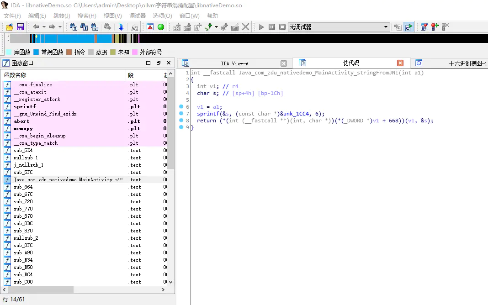

IDA反编译


 虽然我们看不懂伪代码，但对比我们写的jni会发现，逻辑步骤基本一样，大神们甚至可以通过这些伪代码来还原我们真实的实现。
**如此，你还会觉得so文件很安全吗？**
 对于so文件的安全性上有两个方面可以研究：


> 一个是so文件的加壳技术，简单的说替换jni方法名，反编译后找不到具体的实现方法，这个研究是我另一个同事雷某某在搞，等这家伙写完博客后我会贴上；
>  另一个方面就是对jni里的方法实现混淆，使代码非常难以读懂，增大反编译的难度。

## 编译OLLVM

不知道OLLVM的同学自己google去吧，简单的说就是一种混淆jni文件的一种工具。
 编译OLLVM之前需要做些准备：

> 首先，你要准备一台ubuntu系统的电脑，MAC也行。如果是虚拟机的话，内存设置最好4g以上，硬盘30g，cpu核心跟你电脑的核心一样就行。重点：**不要试图在window系统上编译OLLVM，不要试图在window系统上编译OLLVM，不要试图在window系统上编译OLLVM**，无论你做了多少工作，安装了多少需要的工具，编译到100%的时候肯定会报错，`mingw32-make: *** [Makefile:151: all] Error 2`。我是搞不定，如果你能搞定，恳请大神回复咋搞定的。

> 其次：需要安装好几个工具：git，cmake，make，gcc，g++。注意：cmake不要直接使用命令行安装，版本太低了，需要到官网上下载安装，不会的同学移步：[ubuntu安装CMake的几种方式](https://blog.csdn.net/lj402159806/article/details/76408597/)

> 最后：安装好AS以及NDK，移步：[Ubuntu下安装AndroidStudio](https://blog.csdn.net/weidong32768/article/details/80466980)。建议使用AS内嵌的NDK。
>  **PS：如果使用内嵌的SDK编译报错clang++:......"-nostdlib++"这样的错误，放弃吧骚年，我已经趟了很久的坑了，然而并没有解决，百@度不到任何有用的资料，只能去Google，最后发现是NDK内部编译器的错误，18e版本也没有修复，但神奇的是直接使用AS的cmake语句去编译ndk，却没有问题，我没有搞明白。幸运的是我找到了其他的方式，只使用NDK的r10e版本。
>  移步：[Ubuntu下最新Android NDK安装](https://blog.csdn.net/fireroll/article/details/49187269)**

准备工作都做完了，那么我们可以按照官方的知道来编译OLLVM了：

> $ git clone -b llvm-4.0 https://github.com/obfuscator-llvm/obfuscator.git

> $ mkdir build

> $ cd build

> $ cmake -DCMAKE_BUILD_TYPE=Release ../obfuscator/
>  这一步如果报错，修改参数为：
>  cmake -DCMAKE_BUILD_TYPE=Release -DLLVM_INCLUDE_TESTS=OFF ../obfuscator/

> $ make -j7

下载obfuscator的比较慢，速度大概10k左右，慢慢等等吧。编译OLLVM根据你的电脑配置，30分钟到几个小时不等，要有耐心。


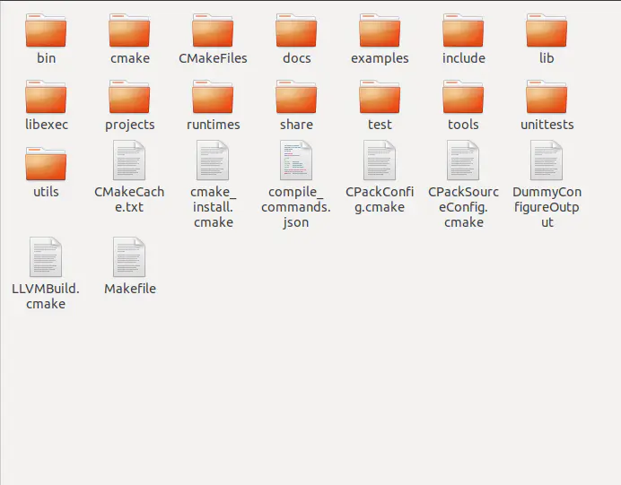

编译完成的目录

编译完成后，只有`bin`和`lib`文件是有用的，其他用不着可以删掉。**附上ubuntu下编译好的obfuscator：**[不点赞你好意思下载吗](https://pan.baidu.com/s/1BJV9tzFsITtKeekm_dbdxA) **提取码: bcqf**

## 集成到NDK

ubuntu系统下的二进制叠加包我已经给大家准备好，[ubuntu下NDK二进制叠加包](https://pan.baidu.com/s/19GrlqiAoa4bIx2CefdUY2A)提取码: 6v3n，说明一下，这是NDK-r10版本的二进制叠加包，建议直接使用此版本。
 （什么是二进制叠加包？知道了又有什么卵用，跟着步骤走就完全ojbk了）（其实就是一些预设好的配置文件）

傻瓜式安装步骤：

> 第一步：解压缩。
>  只有一个`toolchains`文件夹，内涵两个文件夹`arm-linux-androideabi-clang3.4-obfuscator`和`obfuscator-llvm-3.4`，注意这个版本都是3.4的。

> 第二步：复制此文件夹到ndk根目录，覆盖即可；

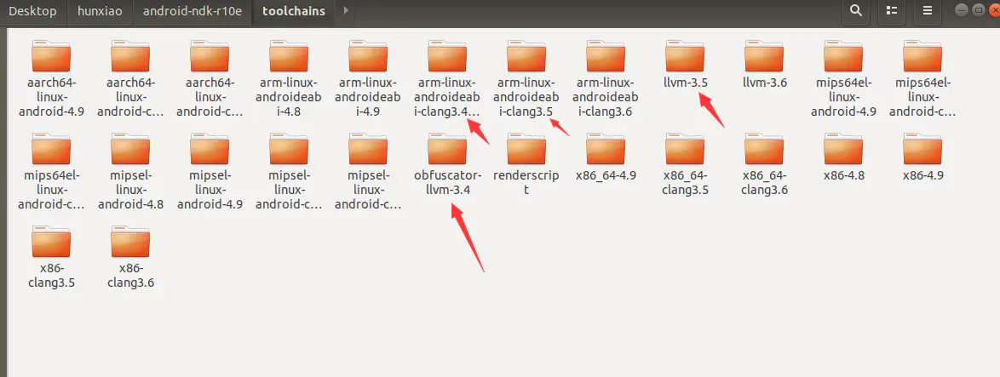

NDK/toolchains


到NDK/toolchains的目录下，你会发现，llvm最低是3.5版，而我们复制过来的是3.4版，这个没有关系，一样可以使用，注意区分版本就行了。

> 第三步：软链编译器
>  没啥好解释的，照着命令执行就行。
>  `cp -r $NDK_PATH/toolchains/arm-linux-androideabi-clang3.5 $NDK_PATH/toolchains/arm-linux-androideabi-clang3.4-obfuscator`

命令执行完，查看`arm-linux-androideabi-clang3.4-obfuscator`文件夹


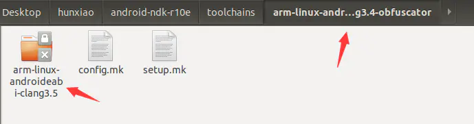

arm-linux-androideabi-clang3.4-obfuscator


 如果有箭头标记的带锁的那个文件夹，说明已经软链成功了。


> 第四步：修改setup.mk文件
>  打开复制到NKD目录下的`arm-linux-androideabi-clang3.4-obfuscator`文件夹下的`setup.mk`文件，找到这几行代码：


```jsx
TARGET_CC := $(LLVM_TOOLCHAIN_PREFIX)clang$(HOST_EXEEXT)
TARGET_CXX := $(LLVM_TOOLCHAIN_PREFIX)clang++$(HOST_EXEEXT)
```

并将其替换成：


```tsx
LLVM_TOOLCHAIN_PATH := <PATH_TO_OBFUSCATOR_REPO>/build/bin/
TARGET_CC := $(LLVM_TOOLCHAIN_PATH)clang$(HOST_EXEEXT)
TARGET_CXX := $(LLVM_TOOLCHAIN_PATH)clang++$(HOST_EXEEXT)
LLVM_TOOLCHAIN_PATH`指向的是你编译完成build文件夹下的bin的全路径，比如说我的就是这样设置的：`LLVM_TOOLCHAIN_PATH := /home/du/Desktop/hunxiao/FileName/build/bin/
```

至此，就完成了全部的准备工作了。

## 混淆JNI

首先得说明一点：本文使用的是NDK-build的方式来完成混淆，不是cmake。
 创建jni目录，并创建我们的jni类，名字就叫`native-lib.cpp`，代码还是使用文章刚开始的那样：


```cpp
JNICALL
Java_com_zdu_nativedemo_MainActivity_stringFromJNI(JNIEnv *env, jobject /* this */) {
    int a = 2, b = 3;
    int c = a * b;
    char str[20];
    sprintf(str,"%d",c);
    return env->NewStringUTF(str);
}
```

编写`Application.mk`：


```ruby
LOCAL_PATH := $(call my-dir)
include $(CLEAR_VARS)
APP_ABI := armeabi-v7a  
NDK_TOOLCHAIN_VERSION := clang3.4-obfuscator #指定编译器
APP_PLATFORM = android-16 
APP_STL := c++_shared #llvm编译需此编译库

include $(BUILD_EXECUTABLE)
```

编写`Android.mk`：


```ruby
LOCAL_PATH := $(call my-dir)
include $(CLEAR_VARS)
LOCAL_MODULE := nativeDemo
LOCAL_LDLIBS += -llog -landroid -lc 
LOCAL_SRC_FILES := native-lib.cpp           
LOCAL_CFLAGS := -mllvm -bcf  -mllvm -sub -mllvm -fla #开启三种混淆方式
include $(BUILD_SHARED_LIBRARY)
```

最终如图：


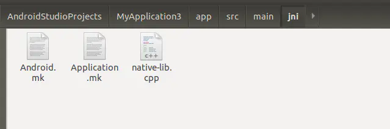

打开命令行，执行`ndk-build`，完成编译，建议是在root环境下，省去权限问题了。如图：


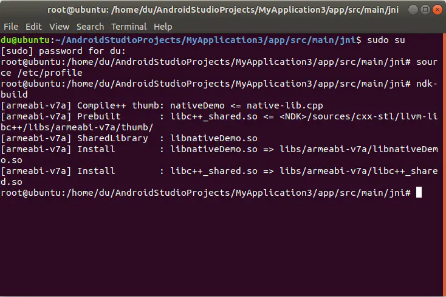
 最终在lib文件夹里编译打包出我们的`libnativeDemo.so`文件。
 我们先看看混淆后的成果，打开IDA反编译器，找到我们的方法打开一看：

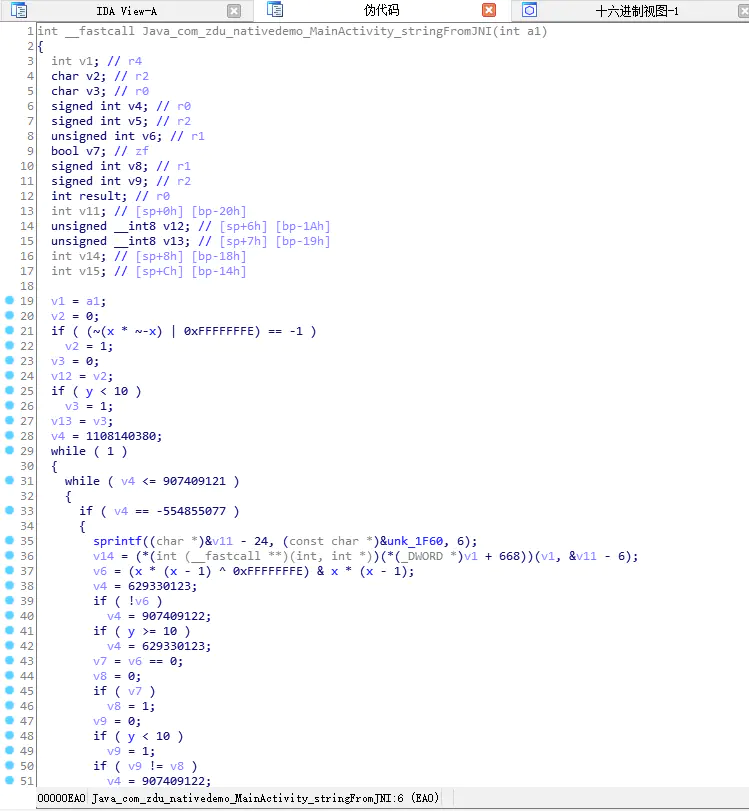


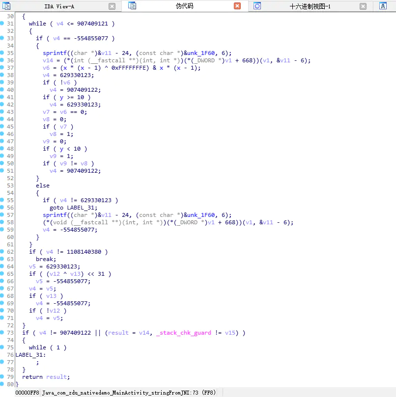

看一下图表概览：


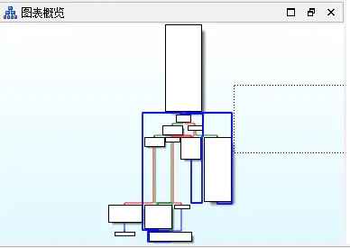


一个简单的运算被增加了那么多逻辑，效果太惊人了。
 对比下原来的伪代码：


再对比下我们的实际代码：


```cpp
JNICALL
Java_com_zdu_nativedemo_MainActivity_stringFromJNI(JNIEnv *env, jobject /* this */) {
    int a = 2, b = 3;
    int c = a * b;
    char str[20];
    sprintf(str,"%d",c);
    return env->NewStringUTF(str);
}
```

没有混淆前的伪代码大致的还能看的出是什么意思，但是混淆后的代码，我相信没有几个人能看的懂，就算是大神费了九牛二虎之力看懂，结果发现只是求a*b的值这么简单的运算，是不是有种不想活的感觉了。


混淆后的文件13.5k，没有混淆的9.4k，增加了43%的大小。那么对于一个正常使用的so库的话，使用三种混淆方式混淆的话，so文件大小大概会增大50%左右，毕竟增加了那么多的代码啊。

## 实际项目使用中遇到的问题

在实际项目中应用的时候会发现，三种混淆方式全都使用的话，会有一个问题，那就是编译时间会特别特别长，甚至根本就打不出so文件。长会长的什么程度呢？有一次我用项目中的jni混淆，一个算是比较简单的，只有3个cpp类，编译了大概1个小时才编译出来；用我们项目中比较复杂的，十几个cpp文件的jni，编译了4个小时，依然没有编译完成，预计是不可能编译出来了。
 那么遇到这种问题又该怎么办呢？我先不说结果，咱们先分别使用三种混淆jni方式混淆下，看看单独的效果如何。

##### 只使用控制流扁平化： `-mllvm -fla`

编译完成发现大小只有9.4k，跟没有混淆过一样，反编译后发现：


 居然跟没有混淆过一模一样，为什么会这样呢？难度说`-fla`根本不起作用吗？
 其实并不是这样，看下[官方wiki](https://github.com/obfuscator-llvm/obfuscator/wiki/Features)：


> `-fla`表示使用控制流平展模式，最直观的感受就是简单的if-else语句，被嵌套成了while-switch语句，出现了很多干扰无用的分支，增加阅读难度。

**我们的代码中又没有if-else语句，当然没有任何效果了。**

##### 只使用指令替换： `-mllvm -sub`

结果跟`-fla`混淆一样，跟没有混淆过的代码一样。看下官方wiki：

> 这种混淆技术的目标仅仅在于用功能上等效但更复杂的指令序列替换标准二元运算符（如加法，减法或布尔运算符）。当有几个等效的指令序列可用时，随机选择一个。
>  这种混淆是相当简单的，并没有增加很多安全性，因为它可以通过重新优化生成的代码轻松删除。然而，假设伪随机生成器以不同的值接种，则指令替换在所产生的二进制中带来多样性。
>  目前，只有整数运算符可用，因为在浮点值上替换运算符会带来舍入误差和不必要的数值误差。

**我们代码中没有 + , – , & , | 和 ^ 操作，只有`\*`，但还不支持混淆，所以没有任何效果。**

##### 只使用虚假控制流程： `-mllvm -bcf`

这也是最后一个混淆方式，可以说肯定是有效果的，上图：


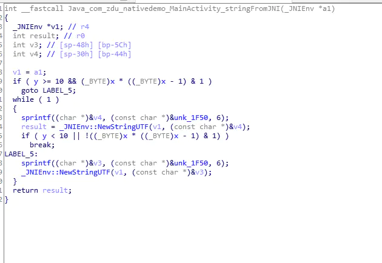

混淆后13.1k。代码通过bcf增加了很多虚假控制的代码，然后这些代码又经过平流展开fla和指令替换sub的方式增加额外混淆，就成了我们最终三种混淆结果。
 **三种混淆方式单独使用后我们可以得出结论：混淆效果最好的指令是虚假控制流程`-bcf`，而平流展开`-fla`和指令替换`-sub`在我们的测试demo中并没有体现出很大的效果，但如何使用相信大家心里已经很清楚了**

## 扩展1：

平流展开-fla

> -mllvm -fla：激活控制流扁平化
>  -mllvm -split：激活基本块分割。在一起使用时改善展平。
>  -mllvm -split_num=3：如果激活了传递，则在每个基本块上应用3次。默认值：1

指令替换-sub

> -mllvm -sub：激活指令替换
>  -mllvm -sub_loop=3：如果激活了传递，则在函数上应用3次。默认值：1。

虚假控制-bcf

> -mllvm -bcf：激活虚假控制流程
>  -mllvm -bcf_loop=3：如果激活了传递，则在函数上应用3次。默认值：1
>  -mllvm -bcf_prob=40：如果激活了传递，基本块将以40％的概率进行模糊处理。默认值：30

举例：如果要使用平流展开并应用3次：
 `LOCAL_CFLAGS := -mllvm -fla -mllvm -split -mllvm -split_num=3`

PS：每个混淆扩展的作用都是非常的大，举例平流展开，我们demo单独使用没有任何效果，但如果激活-split就会有效果，再应用次数变化的话，效果也很明显，而且so文件大小也不是很大，这里就不贴图了，大家自己编译看看吧。

# 扩展2：字符串混淆

上述三种以及其扩展混淆都无法对字符串进行任何有效的混淆，反编译后无论怎么混淆都能看到实际代码中的字符串，如果一些key保存到so库中，这无形中就暴露了，所以我们还需要对字符串进行混淆。
 字符串混淆的技术是**孤挺花（Armariris）** -- 由上海交通大学密码与计算机安全实验室维护的LLVM混淆框架，目前只放出了字符串混淆技术，但正好整合到我们的OLLVM中，实现4种方式混淆。先贴上孤挺花（Armariris）的github地址：[孤挺花（Armariris） -- 由上海交通大学密码与计算机安全实验室维护的LLVM混淆框架](https://github.com/GoSSIP-SJTU/Armariris)。
 额外说一点：我曾单独编译过Armariris的llvm，但发现缺少cmakelists.txt文件，无法完成编译，不知道是我操作有误还是其他问题，但这不影响我们提取Armariris的字符串混淆技术。

### 集成

1.在孤挺花（Armariris）的github中找到位于`include/llvm/Transforms/Obfuscation`文件夹下的[StringObfuscation.h](https://github.com/GoSSIP-SJTU/Armariris/blob/master/include/llvm/Transforms/Obfuscation/StringObfuscation.h)，复制到你的ollvm相对应的目录下

2.找到位于`lib/Transforms/Obfuscation`文件夹下的[StringObfuscation.cpp](https://github.com/GoSSIP-SJTU/Armariris/blob/master/lib/Transforms/Obfuscation/StringObfuscation.cpp)，复制到对应的OLLVM目录下，并修改对应目录下的`cmakelists.txt`文件，将`StringObfuscation.cpp`添加到编译库中：

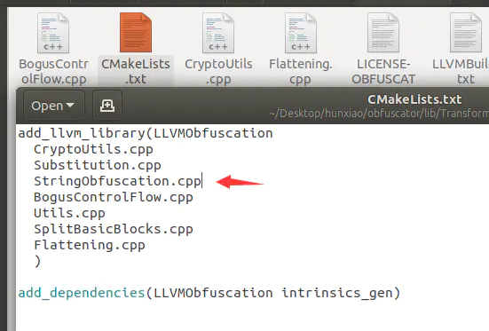


 3.找到位于`lib/Transforms/IPO`文件夹下的`PassManagerBuilder.cpp`，添加引用：
`#include "llvm/Transforms/Obfuscation/StringObfuscation.h"`如图：

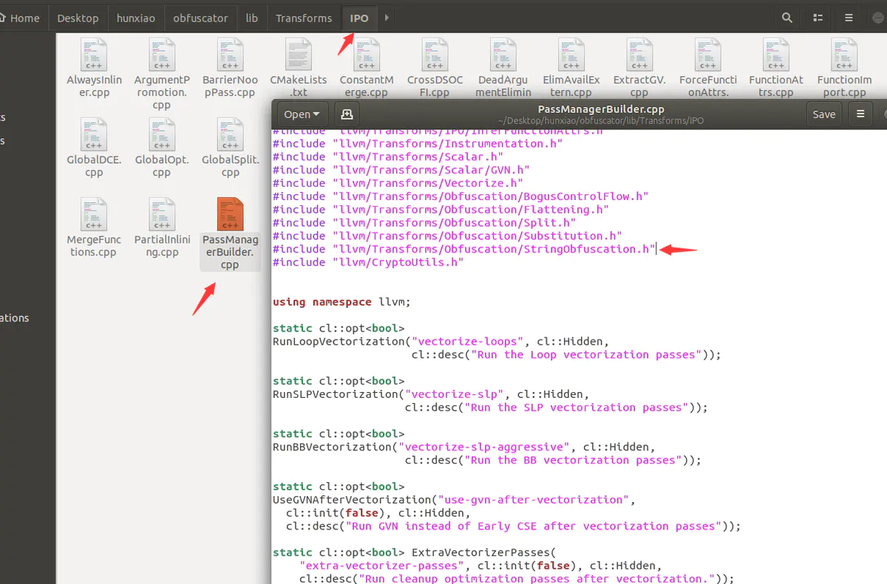


4.还是`PassManagerBuilder.cpp`，按照图示位置添加两句代码，编译时的编译参数-mllvm -sobf：


```none
static cl::opt<std::string> Seed("seed", cl::init(""), cl::desc("seed for the random"));                                
static cl::opt<bool> StringObf("sobf", cl::init(false), cl::desc("Enable the string obfuscation"));
```

如图：


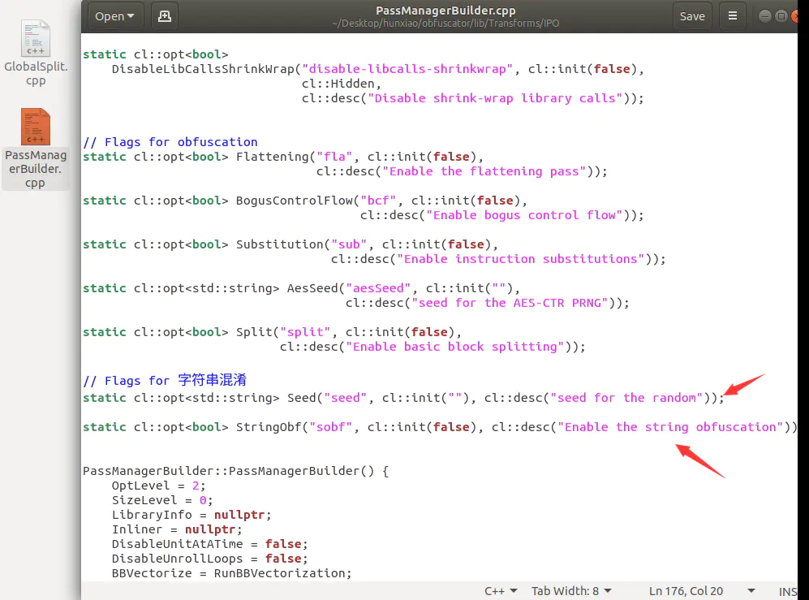

5.还是`PassManagerBuilder.cpp`，找到`PassManagerBuilder::PassManagerBuilder()`，在构造函数中添加随机数因子的初始化代码：


```php
//添加随机数因子的初始化
if(!Seed.empty()) {
   if(!llvm::cryptoutils->prng_seed(Seed.c_str()))
      exit(1);
}
```

如图：


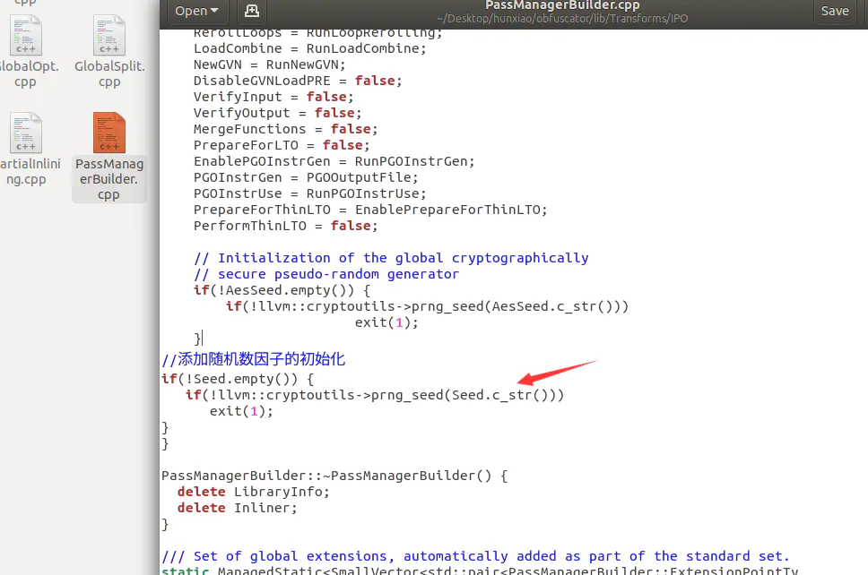

6.还是`PassManagerBuilder.cpp`，找到`void PassManagerBuilder::populateModulePassManager`，添加代码：


```csharp
MPM.add(createStringObfuscation(StringObf));
```

如图：


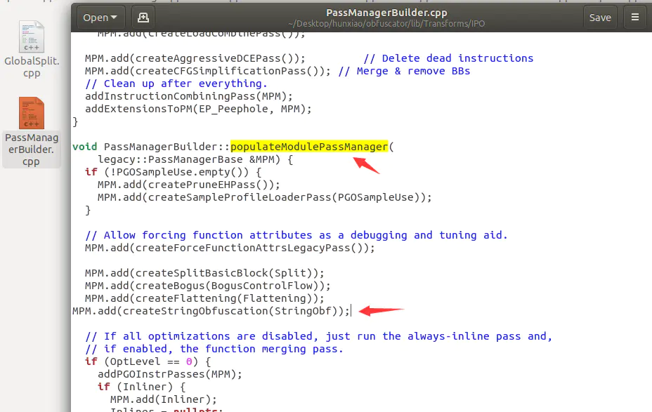

完成上述6个步骤后，重新编译一遍ollvm即可。这个编译好的文件我也有，这次就不放出来了，大家总归还是要亲自动手体会下才有印象。
 开启字符串混淆的方式也很简单，在Android.mk中添加：`LOCAL_CFLAGS += -mllvm -sobf`即可。开启后混淆字符串，反编译后你将找不到任何字符串，全部被混淆成二进制了。

## 踩坑记录

在完成扩展2中添加字符串混淆配置后，开始重新编译ollvm，编译到30-40%时会报错，`mingw32-make: *** [Makefile:151: all] Error 2`，参考了大神的博客解决了该问题：[Win10 OLLVM添加字符串混淆踩坑篇by sudami](https://zhuanlan.zhihu.com/p/39322683)，简单的说就是将`StringObfuscation.h`修改为以下代码：


```cpp
#ifndef _STRINGOBFUSCATION_H_
#define _STRINGOBFUSCATION_H_

// LLVM include
#include "llvm/Pass.h"
#include "llvm/IR/Function.h"
#include "llvm/IR/Instructions.h"
#include "llvm/ADT/Statistic.h"
#include "llvm/Transforms/IPO.h"
#include "llvm/IR/Module.h"
#include "llvm/Support/CommandLine.h"
#include "llvm/CryptoUtils.h"

// Namespace
using namespace llvm;
using namespace std;

namespace llvm {
      Pass* createStringObfuscation(bool flag);
}

#endif
```

保存，再次执行编译，等待100%编译完成即可。

## 结语

本篇在国庆前就已经完成了70%，假期都背着电脑回家了，就想着在家搞完，结果你们都懂得了。幸好间隔不是很久，记忆还都在，赶紧写下来，以便日后查询，**只有把别人的知识掌握了，才算是自己的技术。**


