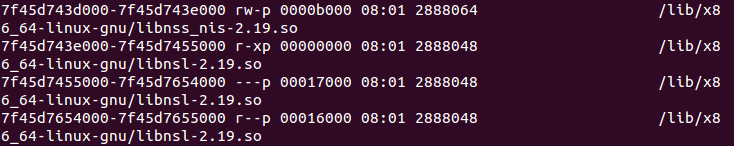
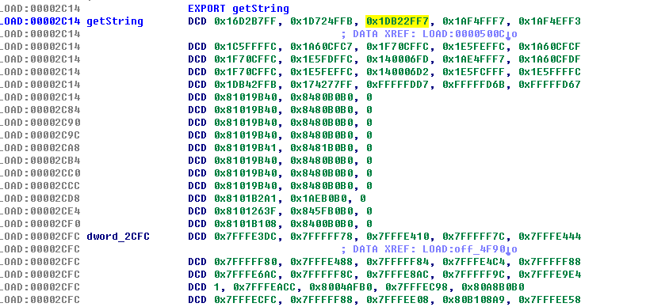
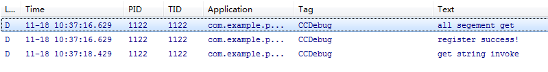

# so文件的简单加密

url：https://www.cnblogs.com/lanrenxinxin/p/4962470.html)

## 0x00  前言

之前的两篇文章从链接视图和执行视图分析了elf文件的大致结构，这篇文章主要内容是对于so文件进行简单的加密工作，针对Ida等静态分析工具的分析，一旦开始动态调试就应该很容易就可以dump出内存，直接修复了。

## 0x01  思路

主要是两种思路，

对文件中指定的section加密，然后在运行时由.initarray进行解密；
对指定的函数进行加密，在运行时由.initarray进行解密。
两种不同的方法说到底也就是不同的View而已。

①基于链接视图，对指定的section进行加密工作。原理很简单，就是借助GCC 编译器的__attribute__关键字增加一个自定义的section，然后对增加的section进行加密，最后利用.initarray在so被加载时调用进行解密工作。

②基于执行视图，对指定的函数进行加密工作。同样也要利用的GCC编译器的__attribute__关键字来将解密代码放置于.initarray段，在so被加载时调用。

## 0x02   实现

### 基于链接视图

非常简单的程序，点击Button，然后调用jni层的getString()函数，返回一串字符串
```
JNIEXPORT jstring JNICALL getString(JNIEnv* env,jobject clazz)
{
    LOGD("getString invoke");
    return env->NewStringUTF("Hello_CC");
}
```
 但是函数的声明要注意：
```
JNIEXPORT jstring JNICALL getString(JNIEnv*,jobject)__attribute__((section(".mytext")));
```
 将函数放置在”.mytext” section。

 这里Java 层和native层的映射关系是自己手动向虚拟机注册，对于JNI不太了解可以移步这篇博文Android JNI 初体验


```
static JNINativeMethod g_methods[] = {
        {
            "getString",
            "()Ljava/lang/String;",
            (void*)getString
        }
};
```


```
jint JNI_OnLoad(JavaVM *vm,void * reserved)
{
    jint result = -1;
    JNIEnv *env = NULL;
    if(vm->GetEnv((void**)&env,JNI_VERSION_1_4) != JNI_OK)
    {
        result = -1;
    }
    //com.example.protectsection
    jclass clazz = env->FindClass("com/example/protectsection/MainActivity");
    if(clazz == NULL)
    {
        LOGD("find class failed");
        return result;
    }

    if(env->RegisterNatives(clazz,g_methods,sizeof(g_methods)/sizeof(g_methods[0]))<0)
    {
        LOGD("register natives failed");
        return result;
    }
    result  = JNI_VERSION_1_4;
    return result;
}
```
然后就开始我们的加密之旅了，下面是加密程序，基于链接视图，找到目标名为”.mytext”的section，然后将该section内的代码进行简单的取反工作，最后写回文件中。


```
#include <stdio.h>
#include <stdlib.h>
#include <elf.h>
#include <fcntl.h>

int main(int argc,char ** argv)
{
    char section_name[] = ".mytext";
    Elf32_Ehdr ehdr;
    Elf32_Shdr shdr;
    char * ptr_shstrtab = NULL;
    Elf32_Off    target_section_offset = 0;
    Elf32_Word target_section_size = 0;
    char * ptr_section_content = NULL;
    int page_size = 4096;
    int fd;
    if(argc < 2)
    {
        puts("input so file\n");
        return -1;
    }
    fd = open(argv[1],O_RDWR);
    if(fd < 0)
    {
        goto _error;
    }
    if(read(fd,&ehdr,sizeof(Elf32_Ehdr)) != sizeof(Elf32_Ehdr))
    {
        puts("read elf header failed\n");
        goto _error;
    }
    lseek(fd,ehdr.e_shoff+sizeof(Elf32_Shdr)*ehdr.e_shstrndx,SEEK_SET);
    if(read(fd,&shdr,sizeof(Elf32_Shdr)) != sizeof(Elf32_Shdr))
    {
        puts("read elf .shstrtab header failed\n");
        goto _error;
    }
    ptr_shstrtab = (char*)malloc(shdr.sh_size);
    if(NULL == ptr_shstrtab)
    {
        puts("apply mem failed\n");
        goto _error;
    }
    //read shstrtab
    lseek(fd,shdr.sh_offset,SEEK_SET);
    if(read (fd,ptr_shstrtab,shdr.sh_size) != shdr.sh_size)
    {
        goto _error;
    }
    lseek(fd,ehdr.e_shoff,SEEK_SET);
    int i = 0;
    for(i = 0;i < ehdr.e_shnum;i++)
    {
        if(read(fd,&shdr,sizeof(Elf32_Shdr)) != sizeof(Elf32_Shdr))
        {
            puts("find target section faile\nd");
            goto _error;
        }
        if( !strcmp(ptr_shstrtab + shdr.sh_name , section_name) )
        {
            target_section_offset  = shdr.sh_offset;
            target_section_size = shdr.sh_size;
            break;
        }
    }
    lseek(fd,target_section_offset,SEEK_SET);
    ptr_section_content = (char*)malloc(target_section_size);
    if(NULL ==ptr_section_content)
    {
        goto _error;
    }
    if(read(fd,ptr_section_content,target_section_size) != target_section_size)
    {
        goto _error;
    }
    int num_page = target_section_size/page_size + 1;
    ehdr.e_entry =  target_section_size;
    ehdr.e_shoff =  target_section_offset;
    for(i = 0; i<target_section_size;i++)
    {
        ptr_section_content[i] =~ ptr_section_content[i];
    }
    lseek(fd,0,SEEK_SET);
    if(write(fd,&ehdr,sizeof(Elf32_Ehdr)) != sizeof(Elf32_Ehdr))
    {
        goto _error;
    }
    lseek(fd , target_section_offset , SEEK_SET);
    if(write(fd , ptr_section_content,target_section_size) != target_section_size)
    {
        goto _error;
    }
    puts("completed\n");
_error:
    if(NULL != ptr_section_content)
    {
        free(ptr_section_content);
    }
    if(NULL != ptr_shstrtab)
    {
        free(ptr_shstrtab);
    }
    if(NULL != fd)
    {
        close(fd);
    }
    return 0;
}
```
 用ida查看的效果图：


 接下来就是运行时的解密工作,通过我们自己的init_getString函数在so初始化时对目标section进行解密:
```
void init_getString()__attribute__((constructor));  //initarray
```

 完整的init_getString函数如下：

```
void init_getString()
{
    //LOGD("Hello init_getString");
    unsigned long lib_addr;
    Elf32_Ehdr* ptr_ehdr = NULL;
    Elf32_Shdr* ptr_shdr = NULL;
    unsigned long mytext_addr;
    unsigned long mytext_size = 0;
    unsigned long page_size = 0x1000;
    lib_addr = get_cur_lib_addr();
    if(NULL == lib_addr)
    {
        return ;
    }
    ptr_ehdr = (Elf32_Ehdr*)lib_addr;
    mytext_size = ptr_ehdr->e_entry; //size
    mytext_addr = ptr_ehdr->e_shoff + lib_addr;  //offset
    unsigned long offset = mytext_addr % page_size;
    LOGD("invoke mprotect first");
    if(mprotect((const void*)(mytext_addr-offset) , mytext_size,PROT_READ | PROT_WRITE | PROT_EXEC) != 0)
    {
        LOGD("change the mem failed");
        return ;
    }
    for(int i=0;i<mytext_size;i++)
    {
        ((char*)mytext_addr)[i] =~ ((char*)mytext_addr)[i];
    }
    LOGD("invoke mprotect to resume the page");
    if(mprotect((const void*)(mytext_addr-offset),mytext_size,PROT_READ | PROT_EXEC)!=0)
    {
        LOGD("resume mem failed");
        return ;
    }
}
```


 获得自己的so模块在内存中的加载基地址是通过linux的“/proc”文件系统得到的，进程的运行时的状态都会显示在”/proc”文件系统中。例如下图就是某个进程的内存中模块的的信息。

 

```
unsigned long get_cur_lib_addr()
{
    unsigned long addr = 0;
    char section_name[] = "libprotect_section.so";
     pid_t pid = 0;     //<types.h>
     char buf[1024] = {0};
     FILE* fp = NULL;
     char* tmp = NULL;
    pid = getpid();   //<unistd.h>
    sprintf(buf,"/proc/%d/maps",pid);    //<stdio.h>
    fp = fopen(buf,"r");
    if(NULL == fp)
    {
        return 0;
    }
    while(fgets(buf,sizeof(buf),fp))
    {
        if(strstr(buf,section_name))
        {
            tmp = strtok(buf,"-");
            addr = strtoul(tmp,NULL,0x10);   //<stdlib.h>
            break;
        }
    }
    fclose(fp);
    return addr;
}
```


 最后的运行结果：


完整代码：https://github.com/ChengChengCC/Android-demo/tree/master/ProtectSection

 

 

 

### 基于执行视图

就是基于执行视图解释ELF文件格式，如果不太了解请移步这篇博文从dlsym()源码看动态链接过程

 就是通过动态链接的过程，通过.dynamic段定位.symtab ,  .dynstr, .hash，然后找到目标函数的文件偏移和大小，然后将目标函数取反，达到简单的加密，ida查看的效果图如下

 


```
#include <stdio.h>
#include <stdlib.h>
#include <stddef.h>
#include <elf.h>
#include <fcntl.h>

#define SYMTAB  0x01
#define HASH    0X02
#define STRTAB  0x04
#define STRSZ   0X08

static unsigned elfhash(const char *_name)
{
    const unsigned char *name = (const unsigned char *) _name;
    unsigned h = 0, g;
    while(*name) {
        h = (h << 4) + *name++;
        g = h & 0xf0000000;
        h ^= g;
        h ^= g >> 24;
    }
    return h;
}

int main(int argc ,char** argv)
{
    Elf32_Ehdr ehdr;
    Elf32_Phdr phdr;
    Elf32_Word dyn_size,dyn_strsz;
    Elf32_Off  dyn_off;
    Elf32_Dyn   dyn;
    Elf32_Addr  dyn_sym,dyn_str,dyn_hash;
    unsigned   func_hash,nbucket,nchain,func_index;
    char * ptr_dynstr = NULL;
    char * ptr_func_content = NULL;
    Elf32_Sym   func_sym;

    int   flag = 0;
    int i = 0;
    
    char func_name[] = "getString";
    if(argc < 2)
    {
        printf("input the so file\n");
        return 0;
    }
    int fd = open(argv[1],O_RDWR);
    if(fd < 0)
    {
    
        printf("open file failed\n");
        goto _error;
    }
    lseek(fd,0,SEEK_SET);
    if(read(fd,&ehdr,sizeof(Elf32_Ehdr)) != sizeof(Elf32_Ehdr))
    {
        printf("read elf header failed\n");
        goto _error;
    
    }
    
    lseek(fd,ehdr.e_phoff,SEEK_SET);
    for(i=0; i<ehdr.e_phnum;i++)
    {
        memset(&phdr,0,sizeof(phdr));
        if(read(fd,&phdr,sizeof(Elf32_Phdr)) != sizeof(Elf32_Phdr))
        {
            printf("read segment failed\n");
            goto _error;
        }
        if(phdr.p_type == PT_DYNAMIC)
        {
            dyn_off = phdr.p_offset;
            dyn_size = phdr.p_filesz;
            printf("find .dynamic section\n");
            break;
        }
    }
    lseek(fd,dyn_off,SEEK_SET);
    //for(i = 0;i<dyn_size/sizeof(Elf32_Dyn);i++)


    do{
        if(read(fd,&dyn,sizeof(Elf32_Dyn)) != sizeof(Elf32_Dyn))
        {
            printf("read .dynamic failed\n");
            goto _error;
        }
        if(dyn.d_tag == DT_SYMTAB)
        {
            flag |= SYMTAB;
            dyn_sym = dyn.d_un.d_ptr;
        }
        if(dyn.d_tag == DT_STRTAB)
        {
            flag |= STRTAB;
            dyn_str = dyn.d_un.d_ptr;
        }
        if(dyn.d_tag == DT_STRSZ)
        {
            flag |= STRSZ;
            dyn_strsz = dyn.d_un.d_val;
        }
        if(dyn.d_tag == DT_HASH)
        {
            flag |= HASH;
            dyn_hash = dyn.d_un.d_ptr;
        }
    } while(dyn.d_tag != DT_NULL);
    
    if((flag & 0x0f) != 0x0f)
    {
        printf("find the needed dynamic section failed\n");
        goto _error;
    }
    
    ptr_dynstr = (char*)malloc(dyn_strsz);
    if(ptr_dynstr == NULL)
    {
        printf("malloc .dynstr failed\n");
        goto _error;
    }
    lseek(fd,dyn_str,SEEK_SET);
    if(read(fd,ptr_dynstr,dyn_strsz) != dyn_strsz)
    {
        printf("read .dynstr failed\n");
        goto _error;
    }
    
    func_hash = elfhash(func_name);
    lseek(fd,dyn_hash,SEEK_SET);
    if(read(fd,&nbucket,4) != 4)
    {
        printf("read hash nbucket failed\n");
        goto _error;
    }
    if(read(fd,&nchain,4) != 4)
    {
        printf("read hash nchain failed\n");
        goto _error;
    }
    func_hash = func_hash%nbucket;
    
    lseek(fd,func_hash*4,SEEK_CUR);
    if(read(fd,&func_index,4) != 4)//索引是符号表或者chain
    {
        printf("read funck index failed\n");
        goto _error;
    }
    lseek(fd,dyn_sym+func_index*sizeof(Elf32_Sym),SEEK_SET);
    if(read(fd,&func_sym,sizeof(Elf32_Sym)) != sizeof(Elf32_Sym))
    {
        printf("read func sym entry failed\n'");
    }
    if(strcmp(ptr_dynstr+func_sym.st_name,func_name) != 0)
    {
        while(1)  //纯C语言是没有true的
        {
            lseek(fd,dyn_hash+4*(2+nbucket+func_index),SEEK_SET);
            if(read(fd,&func_index,4) != 4)
            {
                printf("read func index failed\n");
                goto _error;
            }
    
            lseek(fd,dyn_sym + func_index*sizeof(Elf32_Sym),SEEK_SET);
            memset(&func_sym,0,sizeof(Elf32_Sym));
            if(read(fd,&func_sym,sizeof(Elf32_Sym)) != sizeof(Elf32_Sym))
            {
                goto _error;
            }
            if(strcmp(func_name,dyn_str+func_sym.st_name) == 0)
            {
                break;
            }
    
        }
    }
    printf("find target func addr: %x,sizeo:%x\n",func_sym.st_value,func_sym.st_size);
    ptr_func_content = (char*)malloc(func_sym.st_size);
    if(ptr_func_content == NULL)
    {
        printf("alloc for func failed\n");
        goto _error;
    }
    
    lseek(fd,func_sym.st_value,SEEK_SET);
    
    if(read(fd,ptr_func_content,func_sym.st_size) != func_sym.st_size)
    {
        printf("read func content failed\n");
        goto _error;
    }


    for(i=0;i<func_sym.st_size;i++)
    {
        ptr_func_content[i] = ~ptr_func_content[i];
    }


    lseek(fd,func_sym.st_value,SEEK_SET);
    if(write(fd,ptr_func_content,func_sym.st_size) != func_sym.st_size)
    {
        printf("write to func failed\n");
        goto _error;
    }
    
    printf("Complete \n");

_error:
    if(ptr_dynstr != NULL)
    {
        free(ptr_dynstr);
    }
    if(ptr_func_content != NULL)
    {
        free(ptr_func_content);
    }
    return 0;
}
```
同样的是在so初始化时进行解密
```
void init_getString() __attribute__((constructor));
```

```
void init_getString()
{
    unsigned long lib_addr = 0;
    Elf32_Ehdr*  ptr_ehdr = NULL;
    Elf32_Phdr*  ptr_phdr = NULL;
    Elf32_Dyn*   ptr_dyn = NULL;;
    Elf32_Sym*   ptr_dynsym = NULL;
    Elf32_Sym*      sym = NULL;
    const char* ptr_hashtab = NULL;
    const char* ptr_dynstr = NULL;
    int flag = 0;
    unsigned long strtab_size = 0;
    unsigned func_hash = 0;
    const char func_name[] = "getString";
    unsigned long func_addr = 0;
    unsigned   func_size =0;
    unsigned long func = (unsigned long)getString;
    size_t nbucket;
    size_t nchain;
    unsigned* bucket;
    unsigned* chain;
    const unsigned page_size = 0x1000;

    int i =0;
    lib_addr = get_cur_lib_addr();
    if(0 == lib_addr)
    {
        LOGD("get_cur_lib_addr failed");
        return;
    }
    ptr_ehdr = (Elf32_Ehdr*)lib_addr;
    ptr_phdr = (Elf32_Phdr*)(lib_addr+ptr_ehdr->e_phoff);
    for(i=0;i<ptr_ehdr->e_phnum;i++,ptr_phdr++)
    {
        if(PT_DYNAMIC == ptr_phdr->p_type)
        {
            ptr_dyn = (Elf32_Dyn*)(lib_addr+ptr_phdr->p_vaddr);
            break;
        }
    
    }
    if(NULL == ptr_dyn)
    {
        LOGD("find .dynamic failed");
        return ;
    }
    // .dynsym  .dynstr .hash .
    for (Elf32_Dyn* d = ptr_dyn; d->d_tag != DT_NULL; ++d)
    {
        switch(d->d_tag)
        {
        case DT_SYMTAB:
            ptr_dynsym = (Elf32_Sym*)(lib_addr+d->d_un.d_ptr);
            flag |= SYMTAB;
            break;
        case DT_STRTAB:
            ptr_dynstr = (const char*)(lib_addr + d->d_un.d_ptr);
            flag |= STRTAB;
            break;
        case DT_STRSZ:
            strtab_size = d->d_un.d_val;
            flag |= STRSZ;
            break;
        case DT_HASH:
            ptr_hashtab = (const char*)(lib_addr + d->d_un.d_ptr);
            flag |= HASH;
            break;
        }
    }
    
    if(flag & 0xf == 0xf)
    {
        LOGD("all segement get");
    }
    nbucket = *(unsigned*)ptr_hashtab;
    nchain = *(unsigned*)(ptr_hashtab+4);
    bucket = (unsigned*)(ptr_hashtab+8);
    chain = bucket + nbucket;
    
    func_hash = elfhash(func_name);
    
    for (unsigned n = bucket[func_hash % nbucket]; n != 0; n = chain[n])
    {
        sym = ptr_dynsym + n;
        if (strcmp(ptr_dynstr + sym->st_name, func_name)) continue;
    
        switch(ELF32_ST_BIND(sym->st_info))
        {
        case STB_GLOBAL:
        case STB_WEAK:
            if (sym->st_shndx == SHN_UNDEF)
            {
                  continue;
            }
        }
        func_addr = lib_addr+sym->st_value;
        func_size = sym->st_size;
        break;
    }
    unsigned page_off = func_addr % page_size;
    
    if(mprotect((const void*)(func_addr-page_off),func_size+page_off,PROT_WRITE|PROT_READ|PROT_EXEC)!= JNI_OK)
    {
        int n = errno;
        char *msg = strerror(errno);
        LOGD("change page protect failed");
        LOGD(msg);
        return;
    
    }
    for(int i =0;i<func_size;i++)
    {
        ((char*)func_addr)[i] = ~((char*)func_addr)[i];
    }
    if(mprotect((const void*)(func_addr-page_off),func_size+page_off,PROT_READ|PROT_EXEC) != JNI_OK)
    {
        int n = errno;
        char *msg = strerror(errno);
        LOGD("resume page protect failed");
        LOGD(msg);
        return;
    }

}
```


运行效果图：



完整代码：https://github.com/ChengChengCC/Android-demo/tree/master/ProtectFunc