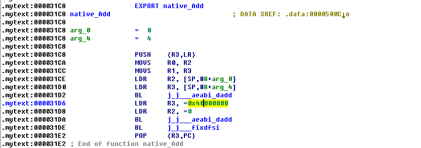
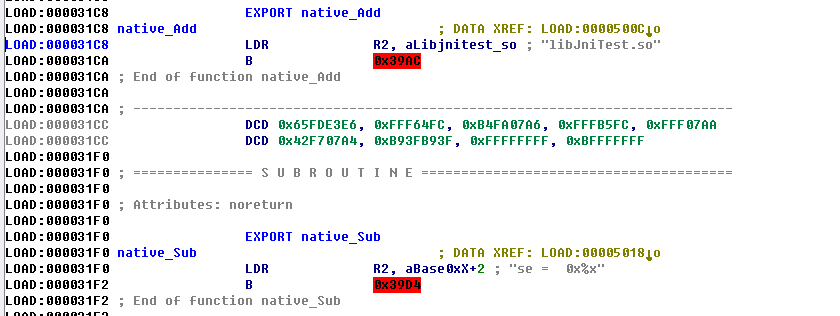
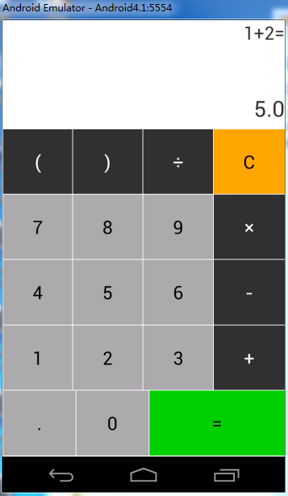
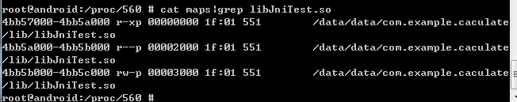
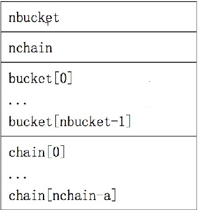
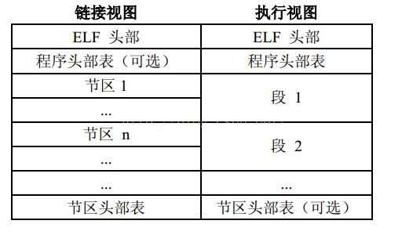
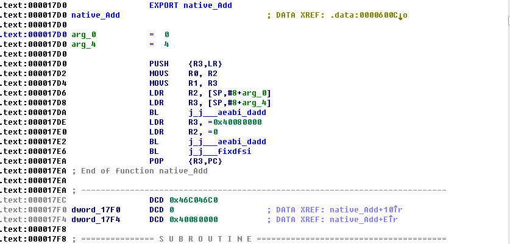
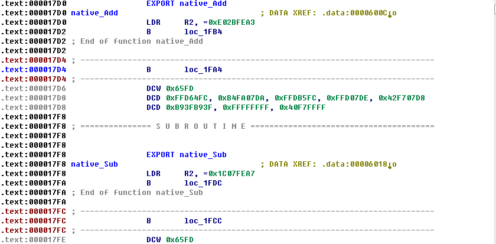
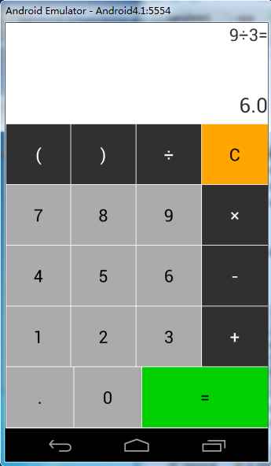

# 安卓加固之so文件加固

url：https://www.cnblogs.com/aliflycoris/p/5880195.html


**一、前言**

　　最近在学习安卓加固方面的知识，看到了[jiangwei212](http://www.wjdiankong.cn/category/android技术篇/)的博客，其中有对so文件加固的两篇文章通过节加密函数和通过hash段找到函数地址直接加密函数，感觉写的特别好，然后自己动手实践探索so加密，这里记录一下学习遇到的困难和所得吧，收获还是非常大的。

 

**二、通过加密节的方式加密函数**

　1、加解密思路

　　加密：我们自己写一个Demo根据ELF文件格式，找到我们要加密的节，加密保存在ELF文件中
　　解密：这里有一个属性__attribute__((constructor)),这个属性使用的节优于main先执行，使我们解密有了可能。

 

　2、实现流程

　　①编写我们的native代码，在native中将要加密的函数置于一个节中，并将解密函数赋予__attribute__((constructor))属性

　　　　a.在函数申明后面加上 __attribute__((section(".mytext"))) ，将函数定义在我们自己的section中

　　　　b.我们需要编写一个解密函数，属性用__attribute((constructor))申明，这样就可以在在so被加载的时候，在main之前将我们的节解密。
　　　　　然后使用ndk-build将native代码编译成so文件

　　②编写加密程序(我这里使用VS2010)
　　　　a.解析so文件，找到.mytext段的起始地址和大小，这里是遍历所有节，根据其在字符串节中的名称，确定.mytext节
　　　　b.找到.mytext之后，进行加密，我们这里只是简单的异或，可以使用其他加密手段，最后写入文件

　  ③将加密之后的so文件作为第三方库加载，注意这里不能直接编译后打包，要进行加密操作，android studio的加载方式可以参考我之前写的

​     [Android Studio使用JNI](https://www.cnblogs.com/aliflycoris/p/5507236.html)中的使用第三方库加载，这里就不在多余的说明了。

 

　　3.代码实现

　　①Native代码，我们将要加密的函数置于一个新节中，利用__attribute__((section(".mytext")))属性

```
jint JNICALL native_Add(JNIEnv* env, jobject obj, jdouble num1, jdouble num2)  __attribute__((section (".mytext")));
jint JNICALL native_Sub(JNIEnv *env, jobject obj, jdouble num1, jdouble num2)  __attribute__((section (".mytext")));
jint JNICALL native_Mul(JNIEnv *env, jobject obj, jdouble num1, jdouble num2)  __attribute__((section (".mytext")));
jint JNICALL native_Div(JNIEnv *env, jobject obj, jdouble num1, jdouble num2)  __attribute__((section (".mytext")));
```

　　②Native代码，我们编写解密函数，我们给我们的解密函数__attribute__((constructor))属性，在so加载的时候优先执行

[](javascript:void(0);)

```
//此属性在so被加载时，优于main执行，开始解密
void init_native_Add() __attribute__((constructor));
unsigned long getLibAddr();


void init_native_Add(){
    char name[15];
    unsigned int nblock;
    unsigned int nsize;
    unsigned long base;
    unsigned long text_addr;
    unsigned int i;
    Elf32_Ehdr *ehdr;
    Elf32_Shdr *shdr;
    base=getLibAddr(); //在/proc/id/maps文件中找到我们的so文件，活动so文件地址
    ehdr=(Elf32_Ehdr *)base;
    text_addr=ehdr->e_shoff+base;//加密节的地址
    nblock=ehdr->e_entry >>16;//加密节的大小
    nsize=ehdr->e_entry&0xffff;//加密节的大小
    LOGD("nblock =  0x%d,nsize:%d", nblock,nsize);
    LOGD("base =  0x%x", text_addr);
    printf("nblock = %d\n", nblock);
    //修改内存权限
    if(mprotect((void *) (text_addr / PAGE_SIZE * PAGE_SIZE), 4096 * nsize, PROT_READ | PROT_EXEC | PROT_WRITE) != 0){
        puts("mem privilege change failed");
        LOGD("mem privilege change failed");
    }
    //进行解密，是针对加密算法的
    for(i=0;i<nblock;i++){
        char *addr=(char*)(text_addr+i);
        *addr=~(*addr);
    }
    if(mprotect((void *) (text_addr / PAGE_SIZE * PAGE_SIZE), 4096 * nsize, PROT_READ | PROT_EXEC) != 0){
        puts("mem privilege change failed");
    }
    puts("Decrypt success");
}
//获取到SO文件加载到内存中的起始地址，只有找到起始地址才能够进行解密；
unsigned long getLibAddr(){
    unsigned long ret=0;
    char name[]="libJniTest.so";
    char buf[4096];
    char *temp;
    int pid;
    FILE *fp;
    pid=getpid();
    sprintf(buf,"/proc/%d/maps",pid);  //这个文件中保存了进程映射的模块信息  cap /proc/id/maps  查看
    fp=fopen(buf,"r");
    if(fp==NULL){
        LOGD("Error open maps file in progress %d",pid);
        puts("open failed");
        goto _error;
    }
    while (fgets(buf,sizeof(buf),fp)){
        if(strstr(buf,name)){
            temp = strtok(buf, "-");  //分割字符串，返回 - 之前的字符
            LOGD("Target so is %s\r\n",temp);
            ret = strtoul(temp, NULL, 16);  //获取地址
            LOGD("Target so address is %x",ret);
            break;
        }
    }
    _error:
    fclose(fp);
    return ret;
}
```

[](javascript:void(0);)

　　解密函数的实现很简单，这里我们首先在getLibAddr函数中通过/proc/<pid>/maps文件获得加载的so文件路径，其中<pid>是该程序的id，maps文件中存放了加载的所有so文件的路径和基址，可通过shell命令 cat /proc/id/maps获得所有模块信息，也可以通过cat /proc/id/maps | grep libJniTest.so获得libJniTest.so模块的信息

　　然后我们通过ehdr->e_entry这个变量获取到被加密节的大小，ehdr->e_shoff获得加密节的地址偏移(加密的时候将加密节的信息写入这两个变量中，所以这里可以直接读取解密)。

　　然后在实现native中的注册代码，这里也不多说明了，可以看之前的[Android Studio使用JNI](http://www.cnblogs.com/aliflycoris/p/5507236.html)，也可以看上传的[代码](http://pan.baidu.com/s/1eSHl9GA)。


③使用VS2010编写加密程序

　　这里需要熟悉ELF格式文件，找到我们自己定义的节.mytext，将节使用加密算法加密，将基地址和大小存入e_shoff和e_entry中

[](javascript:void(0);)

```
int _tmain(int argc, _TCHAR* argv[])
{

    char szSoPath[MAX_PATH] = "libJniTest.so";
    char szSection[] = ".mytext";
    
    char *shstr = NULL;
    char *content = NULL;
    

    int i;
    unsigned int base, length;
    unsigned short nblock;
    unsigned short nsize;
    unsigned char block_size = 16;

    char* szFileData = NULL;
    unsigned int ulLow;
    HANDLE hFile;
    ULONG ulHigh = 0;
    ULONG ulReturn = 0;

    //读取文件到内存
    hFile = CreateFileA(szSoPath,GENERIC_READ|GENERIC_WRITE,FILE_SHARE_READ,NULL,OPEN_EXISTING,FILE_ATTRIBUTE_NORMAL,NULL);
    if (hFile==INVALID_HANDLE_VALUE)
    {
        printf("打开的文件不存在！");
        return -1;
    }
    ulLow = GetFileSize(hFile,&ulHigh); 
    szFileData = new char[ulLow + 20];
    printf("Read File at 0x%x\r\n",szFileData);
    if (ReadFile(hFile,szFileData,ulLow,&ulReturn,NULL)==0)
    {
        CloseHandle(hFile);
        delete szFileData;
        return FALSE;
    }

    Elf32_Ehdr* ehdr = (Elf32_Ehdr*)(szFileData);
    Elf32_Shdr* shdrstr =  (Elf32_Shdr*)(szFileData + ehdr->e_shoff + sizeof(Elf32_Shdr) * ehdr->e_shstrndx); //字符串表的索引，偏移到字符串表
    shstr = (char*)(szFileData + shdrstr->sh_offset);//偏移到字符串表
    Elf32_Shdr* Shdr = (Elf32_Shdr*)(szFileData + ehdr->e_shoff);


    for(i = 0; i < ehdr->e_shnum; i++){
        //根据字符串表的名称比较
        if(strcmp(shstr + Shdr->sh_name, szSection) == 0){
            base = Shdr->sh_offset;
            length = Shdr->sh_size;
            printf("Find section %s at 0x%x the size is 0x%x\n", szSection,base,length);
            break;
        }
        Shdr++;
    }

    content= (char*)(szFileData + base);
    nblock = length / block_size;
    nsize = base / 4096 + (base % 4096 == 0 ? 0 : 1);
    printf("base = 0x%x, length = 0x%x\n", base, length);
    printf("nblock = %d, nsize = %d\n", nblock, nsize);

    //将节的地址和大小写入
    ehdr->e_entry = (length << 16) + nsize;
    ehdr->e_shoff = base; //节的地址
    
    printf("content is %x",content);
    //加密
    for(i=0;i<length;i++){
        content[i] = ~content[i];
    }

    strcat(szSoPath,"_");
    HANDLE hFile1 = CreateFileA(szSoPath,GENERIC_READ|GENERIC_WRITE,FILE_SHARE_READ,NULL,OPEN_ALWAYS,FILE_ATTRIBUTE_NORMAL,NULL);
    if (hFile1==INVALID_HANDLE_VALUE)
    {
        printf("创建文件失败！");
        return -1;
    }
    BOOL bRet = WriteFile(hFile1,szFileData,ulLow,&ulReturn,NULL);
    if(bRet)
    {
        printf("写入成功!\r\n");
    }
    else
    {
        int a = GetLastError();
        printf("写入失败：%d\r\n",a);
    }

_error:
    delete(szFileData);
    CloseHandle(hFile);

    return 0;
}
```

[](javascript:void(0);)

　　1)作为动态链接库，e_entry入口地址是无意义的，因为程序被加载时，设定的跳转地址是动态连接器的地址，这个字段是可以被作为数据填充的。

　　2)so装载时，与链接视图没有关系，即e_shoff、e_shentsize、e_shnum和e_shstrndx这些字段是可以任意修改的。被修改之后，使用readelf和ida等工具打开，会报各种错误，相信读者已经见识过了。

 

　　④运行结果

　　1)加密前

　　

 

　　2)加密后

　　

 

　　3)运行结果

　　(注:这里结果在原结果上加2)

 

　　4)使用grep命令查看加载模块

　　

 

　　4.相关知识点

　　①将要加密的函数置于一个节中，解密函数使用__attribute__((constructor))属性优先执行，对于so动态链接库e_entry和e_shoff是可以修改存放我们加密节的大小和地址的，便于解密。

　　②掌握ELF文件格式知识，遍历节表，对应于字符串表中的节名，找到要加密的节，进行加密操作。

 

**三、直接加密指定函数**

 　1.原理

　　在so文件中，每个函数的结构描述是存放在.dynsym段中，每个函数名称保存在.dynstr段中，在ELF格式中有一个.hash段，由Elf32_Word对象组成的哈希表支持符号表访问。

　　　　

　　bucket数组包含nbucket个项目，chain数组包含了nchain个项目，下标都是从0开始。

　　bucket和chain中都保存符号表索引，**chain和符号表存在对应关系**，符号表项的数目应该和nchain相等，所以符号表的索引也可用来选取chain表项，哈希函数能够接受符号名并且返回一个可以用来计算bucket的索引。
　　因此，如果哈希函数针对某个名字返回了数值X，则bucket[X%nbucket]给出了一个索引y，该索引可用于符号表，也可用于chain表。如果符号表不是所需要的，那么chain[y]则给出了具有相同哈希值的下一个符号表项。我们可以沿着chain链一直搜索，直到所选中的符号表项包含了所需要的符号，或者chain项中包含值STN_UNDEF。

　　上面的话有些复杂，简单来说就是用函数名称在hash函数中得到一个hash值，通过这个hash在chain中的位置就可以找到这个函数对应在.dynsym中对应的条目了。

　　hash函数如下

[](javascript:void(0);)

```
unsigned long elf_hash(const unsigned char* name){
　　unsigned long h = 0,g;
　　while(*name)
　　{
    　　h = (h<<4)+*name++;
    　　if(g = h & 0xf0000000)
    　　{
       　　 h^=g>>24;
        　　h&=-g;
    　　}
    　　return h;
　　}
}
```

[](javascript:void(0);)

　　那么我们只用得到.hash段即可，但是我们怎么得到这个section呢？

　　

　　由于so被加载到内存之后，就没有section了，对应的是segment了，而一个section包含多个section，相同的section可以被包含到不同的segment中。.dynamic段一般用于动态链接，所以.dynsym和.dynstr,.hash肯定包含在这里。我们可以解析了程序头信息之后，通过type获取到.dynamic程序头信息，然后获取到这个segment的偏移地址和大小，在进行解析成elf32_dyn结构。

 

　　2.实现方案

　　我们给函数加密，加密和解密都是基于装载视图实现，需要注意的是，被加密函数如果用static声明，那么函数是不会出现在.dynsym中，是无法在装载视图中通过函数名找到进行解密的。

　　①加密流程：
　　1)读取文件头，获取e_phoff、e_phentsize和e_phnum信息
　　2)通过Elf32_Phdr中的p_type字段，找到DYNAMIC。其实，DYNAMIC就是.dynamic section。从p_offset和p_filesz字段得到文件中的起始位置和长度。
　　3)遍历.dynamic，找到.dynsym、.dynstr、.hash section文件中的偏移和.dynstr的大小，
　　4)根据函数名称，计算hash值
　　5)根据hash值，找到下标hash%nbuckets的bucket;根据bucket中的值，读取.dynsym中的对应索引的Elf32_Sym符号，从符号的st_name索引找到在.dynstr中对应的字符串与函数名进行比较。若不等，则根据chain[hash%nbuckets]找下一个Elf32_Sym符号，直到找到或者chain终止为止。

　　6)找到函数对应的Elf32_Sym符号之后，即可以根据st_value和st_size字段找到函数的位置和大小

　　7)加密，写入文件

 

 　②解密流程为加密逆过程，找到函数地址的方式和加密流程中的方法是一致的，都是通过chain在dynsym中找到对应的函数项，然后在函数地址处进行解密。

 

 　3.代码实现

　　 ①使用VS2010编写加密代码

[](javascript:void(0);)

```
// Encrypting.cpp : 定义控制台应用程序的入口点。
//
#include "stdafx.h"
#include <stdio.h>
#include <iostream>
using namespace std;
#include <Windows.h>
#include "elf.h"

typedef struct _funcInfo{  
    Elf32_Addr st_value;  
    Elf32_Word st_size;  
}funcInfo;  


static Elf32_Off findTargetSectionAddr(char* szFileData, const char *szSection);
static char getTargetFuncInfo(char* szFileData, const char *funcName, funcInfo *info);
static unsigned elfhash(const char *_name); 


int _tmain(int argc, _TCHAR* argv[])
{
        char *shstr = NULL;
        funcInfo info;  
        int i;
        char* szFileData = NULL;
        unsigned int ulLow;
        HANDLE hFile;
        ULONG ulHigh = 0;
        ULONG ulReturn = 0;
 
        char funcNameAdd[] = "native_Add";
        char funcNameSub[] = "native_Sub";
        char funcNameMul[] = "native_Mul";
        char funcNameDiv[] = "native_Div";
        char szSoPath[MAX_PATH] = "libJniTest.so";
        char szSection[] =  ".text";
        Elf32_Off secOff;  

        //读入文件在内存中
        hFile = CreateFileA(szSoPath,GENERIC_READ|GENERIC_WRITE,FILE_SHARE_READ,NULL,OPEN_EXISTING,FILE_ATTRIBUTE_NORMAL,NULL);
        if (hFile==INVALID_HANDLE_VALUE)
        {
            printf("打开的文件不存在！");
            return -1;
        }
        ulLow = GetFileSize(hFile,&ulHigh); 
        szFileData = new char[ulLow + 20];
        if (ReadFile(hFile,szFileData,ulLow,&ulReturn,NULL)==0)
        {
            CloseHandle(hFile);
            delete szFileData;
            return FALSE;
        }
        
        //通过hash段中chain链获得的索引，获取在dynsym对应的条目
        if(getTargetFuncInfo(szFileData, funcNameAdd, &info) == -1){  
            printf("Find function %s failed\n", funcNameAdd);  
            goto _error;  
        }  

        //得到函数地址
        for(i=0;i<info.st_size-1;i++){
            char *content = (char*)(szFileData + info.st_value -1 + i);
            *content = ~(*content);
        }

        //通过hash段中chain链获得的索引，获取在dynsym对应的条目
        if(getTargetFuncInfo(szFileData, funcNameSub, &info) == -1){  
            printf("Find function %s failed\n", funcNameSub);  
            goto _error;  
        }  
        //得到函数地址
        for(i=0;i<info.st_size-1;i++){
            char *content = (char*)(szFileData + info.st_value -1 + i);
            *content = ~(*content);
        }
        //通过hash段中chain链获得的索引，获取在dynsym对应的条目
        if(getTargetFuncInfo(szFileData, funcNameMul, &info) == -1){  
            printf("Find function %s failed\n", funcNameMul);  
            goto _error;  
        }  
        //得到函数地址
        for(i=0;i<info.st_size-1;i++){
            char *content = (char*)(szFileData + info.st_value -1 + i);
            *content = ~(*content);
        }
        //通过hash段中chain链获得的索引，获取在dynsym对应的条目
        if(getTargetFuncInfo(szFileData, funcNameDiv, &info) == -1){  
            printf("Find function %s failed\n", funcNameDiv);  
            goto _error;  
        }  
        //得到函数地址
        for(i=0;i<info.st_size-1;i++){
            char *content = (char*)(szFileData + info.st_value -1 + i);
            *content = ~(*content);
        }

        //写入文件保存
        strcat(szSoPath,"_");
        HANDLE hFile1 = CreateFileA(szSoPath,GENERIC_READ|GENERIC_WRITE,FILE_SHARE_READ,NULL,OPEN_ALWAYS,FILE_ATTRIBUTE_NORMAL,NULL);
        if (hFile1==INVALID_HANDLE_VALUE)
        {
            printf("创建文件失败！");
            return -1;
        }
        BOOL bRet = WriteFile(hFile1,szFileData,ulLow,&ulReturn,NULL);
        if(bRet)
        {
            printf("写入成功!\r\n");
        }
        else
        {
            int a = GetLastError();
            printf("写入失败：%d\r\n",a);
        }
_error:
        delete(szFileData);
        CloseHandle(hFile);

    return 0;
}


static unsigned elfhash(const char *_name)  
{  
    const unsigned char *name = (const unsigned char *) _name;  
    unsigned h = 0, g;  

    while(*name) {  
        h = (h << 4) + *name++;  
        g = h & 0xf0000000;  
        h ^= g;  
        h ^= g >> 24;  
    }  
    return h;  
}  static char getTargetFuncInfo(char* szFileData, const char *funcName, funcInfo *info){  
    char flag = -1;
    char *dynstr = NULL;  
    int i;  
    Elf32_Sym* funSym;  
    Elf32_Phdr* phdr;  
    Elf32_Off dyn_off;  
    Elf32_Word dyn_size, dyn_strsz;  
    Elf32_Dyn* dyn;  
    Elf32_Addr dyn_symtab, dyn_strtab, dyn_hash;  
    unsigned funHash, nbucket, nchain, funIndex;  
    Elf32_Ehdr* ehdr = (Elf32_Ehdr*)szFileData;

    //视图模式
    phdr = (Elf32_Phdr*)(szFileData + ehdr->e_phoff);
    for(i=0;i < ehdr->e_phnum; i++){  
        //获得动态链接节
        if(phdr->p_type ==  PT_DYNAMIC){  
            dyn_size = phdr->p_filesz;  
            dyn_off = phdr->p_offset;  
            flag = 0;  
            printf("Find section %s, size = 0x%x, addr = 0x%x\n", ".dynamic", dyn_size, dyn_off);  
            break;  
        }  
        phdr++;
    }  
    if(flag){  
        puts("Find .dynamic failed");  
        goto _error;  
    }  
    flag = 0;  

    printf("dyn_size:%d\n",dyn_size);  
    printf("count:%d\n",(dyn_size/sizeof(Elf32_Dyn)));  
    printf("off:%x\n",dyn_off);  


    dyn = (Elf32_Dyn*)(szFileData + dyn_off);
    for(i=0;i < dyn_size / sizeof(Elf32_Dyn); i++){  
        
        //符号表位置
        if(dyn->d_tag == DT_SYMTAB){  
            dyn_symtab = dyn->d_un.d_ptr;  
            flag += 1;  
            printf("Find .dynsym, addr = 0x%x, val = 0x%x\n", dyn_symtab, dyn->d_un.d_val);  
        }  
        //获得hash段
        if(dyn->d_tag == DT_HASH){  
            dyn_hash = dyn->d_un.d_ptr;  
            flag += 2;  
            printf("Find .hash, addr = 0x%x\n", dyn_hash);  
        }  
        //保存函数字符串的位置
        if(dyn->d_tag == DT_STRTAB){  
            dyn_strtab = dyn->d_un.d_ptr;  
            flag += 4;  
            printf("Find .dynstr, addr = 0x%x\n", dyn_strtab);  
        }  
        //字符串长度
        if(dyn->d_tag == DT_STRSZ){  
            dyn_strsz = dyn->d_un.d_val;  
            flag += 8;  
            printf("Find .dynstr size, size = 0x%x\n", dyn_strsz);  
        }  
        dyn++;
    }  

    if((flag & 0x0f) != 0x0f){  
        puts("Find needed .section failed\n");  
        goto _error;  
    }  

    dynstr = (char*) malloc(dyn_strsz);  
    if(dynstr == NULL){  
        printf("Malloc .dynstr space failed");  
        goto _error;  
    }  
    memcpy(dynstr,szFileData + dyn_strtab,dyn_strsz);

/*     nbucket                                                                 
 *-----------------
 *       nchain
 *------------------
 *      bucket[0]
 *       ...
 *   bucket[nbucket-1]
 * ------------------
 *     chain[0]
 *       ...
 *   chain[nchain-1]
 */
    funHash = elfhash(funcName);  //获得函数名称经过hash运行后的值
    printf("Function %s hashVal = 0x%x\n", funcName, funHash);  

    nbucket = *(int*)(szFileData + dyn_hash); //获得nbucket的值
    printf("nbucket = %d\n", nbucket);  

    nchain = *(int*)(szFileData + dyn_hash + 4);//获得nchain的值
    printf("nchain = %d\n", nchain);  

    funHash = funHash % nbucket;        //bucket[X%nbucket]给出了一个索引y，该索引可用于符号表，也可用于chain表
    printf("funHash mod nbucket = %d \n", funHash);  

    funIndex = *(int*)(szFileData + dyn_hash + 8 + funHash * 4);//y = bucket[X%nbucket]返回的索引y
    printf("funcIndex:%d\n", funIndex);  
    funSym = (Elf32_Sym*)(szFileData + dyn_symtab + funIndex*sizeof(Elf32_Sym));//该索引对应的符号表
    

    if(strcmp(dynstr + funSym->st_name, funcName) != 0){  //如果索引y对应的符号表不是所需要的,那么chain[y]则给出了具有相同哈希值的下一个符号表项
        while(1){  
            //我们可以沿着chain链一直搜索，直到所选中的符号表项包含了所需要的符号
            printf("hash:%x,nbucket:%d,funIndex:%d\n",dyn_hash,nbucket,funIndex);  
            funIndex = *(int*)(szFileData + dyn_hash + 4*(2+nbucket+funIndex));  //搜索chain链
            printf("funcIndex:%d\n", funIndex);  

            if(funIndex == 0){  
                puts("Cannot find funtion!\n");  
                goto _error;  
            }  
            funSym = (Elf32_Sym*)(szFileData + dyn_symtab + funIndex*sizeof(Elf32_Sym)); //chain[]中对应的符号表
            if(strcmp(dynstr + funSym->st_name, funcName) == 0){  
                break;  
            }  
        }  
    }  

    printf("Find: %s, offset = 0x%x, size = 0x%x\n", funcName, funSym->st_value, funSym->st_size);  
    info->st_value = funSym->st_value;  
    info->st_size = funSym->st_size;  
    free(dynstr);  
    return 0;  

_error:  
    free(dynstr);  
    return -1;  
}  
```

[](javascript:void(0);)

　　

　　②Native代码

[](javascript:void(0);)

```
#include <jni.h>
#include <stdio.h>
//#include <assert.h>
#include <stdlib.h>
#include <unistd.h>
#include <sys/types.h>
#include <sys/stat.h>
#include <fcntl.h>
#include <android/log.h>
#include <elf.h>
#include <sys/mman.h>

#define LOG_TAG "Jiami"
#define LOGD(fmt,args...) __android_log_print(ANDROID_LOG_DEBUG,LOG_TAG,fmt,##args)

typedef struct _funcInfo{
  Elf32_Addr st_value;
  Elf32_Word st_size;
}funcInfo;


JNIEXPORT jint JNICALL native_Add
(JNIEnv *env, jobject obj, jdouble num1, jdouble num2)
{
    return (jint)(num1 + num2 +3);
}


JNIEXPORT jint JNICALL native_Sub
        (JNIEnv *env, jobject obj, jdouble num1, jdouble num2)
{
    return (jint)(num1 - num2 +3);
}


JNIEXPORT jint JNICALL native_Mul
        (JNIEnv *env, jobject obj, jdouble num1, jdouble num2)
{
    return (jint)(num1 * num2 +3);
}

JNIEXPORT jint JNICALL native_Div
        (JNIEnv *env, jobject obj, jdouble num1, jdouble num2)
{
    if (num2 == 0) return 0;
    return (jint)(num1 / num2 +3);
}

//Java和JNI函数的绑定表
static JNINativeMethod gMethods[] = {
        {"Add", "(DD)I", (void *)native_Add},
        {"Sub", "(DD)I", (void *)native_Sub},
        {"Mul", "(DD)I", (void *)native_Mul},
        {"Div", "(DD)I", (void *)native_Div},
};


//注册native方法到java中
static int registerNativeMethods(JNIEnv* env, const char* className,
                                JNINativeMethod* gMethods, int numMethods)
{
    jclass clazz;
    clazz = (*env)->FindClass(env, className);
    if (clazz == NULL) {
        return JNI_FALSE;
    }
    if ((*env)->RegisterNatives(env, clazz, gMethods,numMethods) < 0){
        return JNI_FALSE;
    }

    return JNI_TRUE;
}


int register_ndk_load(JNIEnv *env)
{

    return registerNativeMethods(env, "com/example/caculate/MainActivity",
                                 gMethods,sizeof(gMethods) / sizeof(gMethods[0]));
                                 //NELEM(gMethods));
}


JNIEXPORT jint JNI_OnLoad(JavaVM* vm, void* reserved)
{
    JNIEnv* env = NULL;
    jint result = -1;

    if ((*vm)->GetEnv(vm, (void**) &env, JNI_VERSION_1_4) != JNI_OK) {
        return result;
    }

    register_ndk_load(env);

    // 返回jni的版本
    return JNI_VERSION_1_4;
}


//此属性在so被加载时，优于main执行，开始解密
void init_native_Add() __attribute__((constructor));
void init_native_Sub();
void init_native_Mul();
void init_native_Div();
unsigned long getLibAddr();

static char getTargetFuncInfo(unsigned long base, const char *funcName, funcInfo *info);


static unsigned elfhash(const char *_name)
{
    const unsigned char *name = (const unsigned char *) _name;
    unsigned h = 0, g;

    while(*name) {
        h = (h << 4) + *name++;
        g = h & 0xf0000000;
        h ^= g;
        h ^= g >> 24;
    }
    return h;
}

void init_native_Add(){

    const char target_fun[] = "native_Add";
    funcInfo info;
    int i;
    unsigned int npage, base = getLibAddr();

    LOGD("base addr is 0x%x",base);
    if(getTargetFuncInfo(base, target_fun, &info) == -1){
          LOGD("Find native_Add failed");
          return ;
    }

    npage = info.st_size / PAGE_SIZE + ((info.st_size % PAGE_SIZE == 0) ? 0 : 1);
    LOGD("npage =  0x%d", npage);
    LOGD("npage =  0x%d", PAGE_SIZE);

    if(mprotect((void *) ((base + info.st_value) / PAGE_SIZE * PAGE_SIZE), 4096*npage, PROT_READ | PROT_EXEC | PROT_WRITE) != 0){
          LOGD("mem privilege change failed");
     }

      for(i=0;i< info.st_size - 1; i++){
          char *addr = (char*)(base + info.st_value -1 + i);
          *addr = ~(*addr);
      }

      if(mprotect((void *) ((base + info.st_value) / PAGE_SIZE * PAGE_SIZE), 4096*npage, PROT_READ | PROT_EXEC) != 0){
          LOGD("mem privilege change failed");
      }
    init_native_Sub();
    init_native_Mul();
    init_native_Div();
}

void init_native_Sub(){

    const char target_fun[] = "native_Sub";
    funcInfo info;
    int i;
    unsigned int npage, base = getLibAddr();

    LOGD("base addr is 0x%x",base);
    if(getTargetFuncInfo(base, target_fun, &info) == -1){
          LOGD("Find native_Sub failed");
          return ;
    }

    npage = info.st_size / PAGE_SIZE + ((info.st_size % PAGE_SIZE == 0) ? 0 : 1);
    LOGD("npage =  0x%d", npage);
    LOGD("npage =  0x%d", PAGE_SIZE);

    if(mprotect((void *) ((base + info.st_value) / PAGE_SIZE * PAGE_SIZE), 4096*npage, PROT_READ | PROT_EXEC | PROT_WRITE) != 0){
          LOGD("mem privilege change failed");
     }

      for(i=0;i< info.st_size - 1; i++){
          char *addr = (char*)(base + info.st_value -1 + i);
          *addr = ~(*addr);
      }

      if(mprotect((void *) ((base + info.st_value) / PAGE_SIZE * PAGE_SIZE), 4096*npage, PROT_READ | PROT_EXEC) != 0){
          LOGD("mem privilege change failed");
      }
}

void init_native_Div(){

    const char target_fun[] = "native_Div";
    funcInfo info;
    int i;
    unsigned int npage, base = getLibAddr();

    LOGD("base addr is 0x%x",base);
    if(getTargetFuncInfo(base, target_fun, &info) == -1){
          LOGD("Find native_Div failed");
          return ;
    }

    npage = info.st_size / PAGE_SIZE + ((info.st_size % PAGE_SIZE == 0) ? 0 : 1);
    LOGD("npage =  0x%d", npage);
    LOGD("npage =  0x%d", PAGE_SIZE);

    if(mprotect((void *) ((base + info.st_value) / PAGE_SIZE * PAGE_SIZE), 4096*npage, PROT_READ | PROT_EXEC | PROT_WRITE) != 0){
          LOGD("mem privilege change failed");
     }

      for(i=0;i< info.st_size - 1; i++){
          char *addr = (char*)(base + info.st_value -1 + i);
          *addr = ~(*addr);
      }

      if(mprotect((void *) ((base + info.st_value) / PAGE_SIZE * PAGE_SIZE), 4096*npage, PROT_READ | PROT_EXEC) != 0){
          LOGD("mem privilege change failed");
      }
}

void init_native_Mul(){

    const char target_fun[] = "native_Mul";
    funcInfo info;
    int i;
    unsigned int npage, base = getLibAddr();

    LOGD("base addr is 0x%x",base);
    if(getTargetFuncInfo(base, target_fun, &info) == -1){
          LOGD("Find native_Mul failed");
          return ;
    }

    npage = info.st_size / PAGE_SIZE + ((info.st_size % PAGE_SIZE == 0) ? 0 : 1);
    LOGD("npage =  0x%d", npage);
    LOGD("npage =  0x%d", PAGE_SIZE);

    if(mprotect((void *) ((base + info.st_value) / PAGE_SIZE * PAGE_SIZE), 4096*npage, PROT_READ | PROT_EXEC | PROT_WRITE) != 0){
          LOGD("mem privilege change failed");
     }

      for(i=0;i< info.st_size - 1; i++){
          char *addr = (char*)(base + info.st_value -1 + i);
          *addr = ~(*addr);
      }

      if(mprotect((void *) ((base + info.st_value) / PAGE_SIZE * PAGE_SIZE), 4096*npage, PROT_READ | PROT_EXEC) != 0){
          LOGD("mem privilege change failed");
      }
}
//获取到SO文件加载到内存中的起始地址，只有找到起始地址才能够进行解密；
unsigned long getLibAddr(){
    unsigned long ret=0;
    char name[]="libJniTest.so";
    char buf[4096];
    char *temp;
    int pid;
    FILE *fp;
    pid=getpid();
    sprintf(buf,"/proc/%d/maps",pid);  //这个文件中保存了进程映射的模块信息  cap /proc/id/maps  查看
    fp=fopen(buf,"r");
    if(fp==NULL){
        LOGD("Error open maps file in progress %d",pid);
        puts("open failed");
        goto _error;
    }
    while (fgets(buf,sizeof(buf),fp)){
        if(strstr(buf,name)){
            temp = strtok(buf, "-");  //分割字符串，返回 - 之前的字符
            LOGD("Target so is %s\r\n",temp);
            ret = strtoul(temp, NULL, 16);  //获取地址
            LOGD("Target so address is %x",ret);
            break;
        }
    }
    _error:
    fclose(fp);
    return ret;
}


static char getTargetFuncInfo(unsigned long base, const char *funcName, funcInfo *info){
    char flag = -1, *dynstr;
    int i;
    Elf32_Ehdr *ehdr;
    Elf32_Phdr *phdr;
    Elf32_Off dyn_vaddr;
    Elf32_Word dyn_size, dyn_strsz;
    Elf32_Dyn *dyn;
    Elf32_Addr dyn_symtab, dyn_strtab, dyn_hash;
    Elf32_Sym *funSym;
    unsigned funHash, nbucket;
    unsigned *bucket, *chain;

    ehdr = (Elf32_Ehdr *)base;
    phdr = (Elf32_Phdr *)(base + ehdr->e_phoff);//视图模式
    LOGD("[+]phdr =  0x%p, size = 0x%x\n", phdr, ehdr->e_phnum);
    for (i = 0; i < ehdr->e_phnum; ++i) {
        LOGD("[+]phdr =  0x%p\n", phdr);
        //获得动态链接节
        if(phdr->p_type ==  PT_DYNAMIC){
            flag = 0;
            LOGD("Find .dynamic segment");
            break;
        }
        phdr ++;
    }
    if(flag)
        goto _error;
    dyn_vaddr = phdr->p_vaddr + base;
    dyn_size = phdr->p_filesz;
    LOGD("[+]dyn_vadd =  0x%x, dyn_size =  0x%x", dyn_vaddr, dyn_size);
    flag = 0;
    for (i = 0; i < dyn_size / sizeof(Elf32_Dyn); ++i) {
        dyn = (Elf32_Dyn *)(dyn_vaddr + i * sizeof(Elf32_Dyn));
        //符号表位置
        if(dyn->d_tag == DT_SYMTAB){
            dyn_symtab = (dyn->d_un).d_ptr;
            flag += 1;
            LOGD("[+]Find .dynsym section, addr = 0x%x\n", dyn_symtab);
        }
        //获得hash段
        if(dyn->d_tag == DT_HASH){
            dyn_hash = (dyn->d_un).d_ptr;
            flag += 2;
            LOGD("[+]Find .hash section, addr = 0x%x\n", dyn_hash);
        }
        //保存函数字符串的位置
        if(dyn->d_tag == DT_STRTAB){
            dyn_strtab = (dyn->d_un).d_ptr;
            flag += 4;
            LOGD("[+]Find .dynstr section, addr = 0x%x\n", dyn_strtab);
        }
        //字符串长度
        if(dyn->d_tag == DT_STRSZ){
            dyn_strsz = (dyn->d_un).d_val;
            flag += 8;
            LOGD("[+]Find strsz size = 0x%x\n", dyn_strsz);
        }
    }
    if((flag & 0x0f) != 0x0f){
        LOGD("Find needed .section failed\n");
        goto _error;
    }
    dyn_symtab += base;
    dyn_hash += base;
    dyn_strtab += base;
    dyn_strsz += base;

/*     nbucket                                                                 
 *-----------------
 *       nchain
 *------------------
 *      bucket[0]
 *       ...
 *   bucket[nbucket-1]
 * ------------------
 *     chain[0]
 *       ...
 *   chain[nchain-1]
 */
    funHash = elfhash(funcName);//获得函数名称经过hash运行后的值
    funSym = (Elf32_Sym *) dyn_symtab;
    dynstr = (char*) dyn_strtab;
    nbucket = *((int *) dyn_hash);//获得nbucket的值
    bucket = (int *)(dyn_hash + 8);//bucket链
    chain = (unsigned int *)(dyn_hash + 4 * (2 + nbucket));//越过bucket链，到达chain链

    flag = -1;
    LOGD("[+]hash = 0x%x, nbucket = 0x%x\n", funHash, nbucket);
    //bucket[X%nbucket]给出了一个索引y，该索引可用于符号表，也可用于chain表
    int mod = (funHash % nbucket);
    LOGD("[+]mod = %d\n", mod);
    LOGD("[+]i = 0x%d\n", bucket[mod]);
    //i = mod = bucket[funHash%nbucket]，通过遍历i = chain[i]表，找到funSym对应的符号表
    for(i = bucket[mod]; i != 0; i = chain[i]){
        LOGD("[+]Find index = %d\n", i);
        if(strcmp(dynstr + ((Elf32_Sym*)((char*)funSym + i* sizeof(Elf32_Sym)))->st_name, funcName) == 0){
            flag = 0;
            LOGD("[+]Find %s\n", funcName);
            break;
        }
    }
    if(flag) goto _error;
    info->st_value = ((Elf32_Sym*)((char*)funSym + i* sizeof(Elf32_Sym)))->st_value;//函数对应符号表中保存函数的地址
    info->st_size =((Elf32_Sym*)((char*)funSym + i* sizeof(Elf32_Sym)))->st_size;//函数符号表中保存函数的大小
    LOGD("[+]st_value = %d,st_size = %d",info->st_value,info->st_size);
    return 0;
_error:
    return -1;
}
```

[](javascript:void(0);)

　　Android.mk文件

[](javascript:void(0);)

```
LOCAL_PATH := $(call my-dir)
include $(CLEAR_VARS)
LOCAL_LDLIBS := -L$(SYSROOT)/usr/lib -llog
LOCAL_PRELINK_MODULE := false
LOCAL_MODULE := JniTest
LOCAL_SRC_FILES := MyJniCalc.c
LOCAL_SHARED_LIBRARIES := libandroid_runtime
include $(BUILD_SHARED_LIBRARY)
```

[](javascript:void(0);)

 

　　4.执行结果

　　1）加密之前

　　

 

　　2）加密之后

　　

 

　　3)运行结果

　　(注:这里结果为原结果加3)

 

　**四、总结**

　　这里的so文件加固相对于windows平台还是比较简单的，没有复杂的跳转，学习起来比较容易的，只需熟悉ELF格式，找到对应的位置进行加解密。这篇属于拿来主义，不过自己在实践学习的过程中也学习到特别多的知识，比如安卓模拟器使用grep命令，加载第三方库的方法，也犯了很多小错误也一一解决了，期待以后更加深入的学习和分享~

　　代码下载：http://pan.baidu.com/s/1eSHl9GA