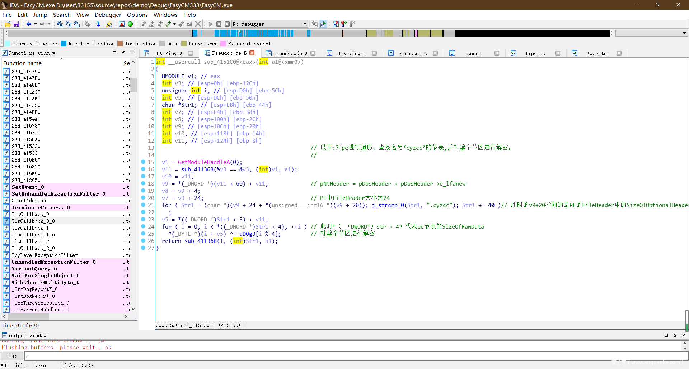

# SMC自解码总结

url：https://www.anquanke.com/post/id/238645


## 0.说明

编译语言：c、x86汇编

编译器：vs2019

 

## 1.SMC自解码简介

### a.原理

> SMC：Self Modifying Code

即**自修改代码**，简而言之就是程序中的部分代码在运行前是被加密成一段数据，不可反编译，通过程序运行后执行相关解码代功能，对加密的代码数据进行解密，让其恢复正常功能!

PS:代码二进制文件中就是字节码。本身就是一段二进制数据。

下面是伪代码演示一种SMC的典型应用：

```c
proc main:
............
IF .运行条件满足
  CALL DecryptProc （Address of MyProc）;对某个函数代码解密
  ........
  CALL MyProc                           ;调用这个函数
  ........
  CALL EncryptProc （Address of MyProc）;再对代码进行加密，防止程序被Dump

......
end main
```

### b.一般实现方法

自修改代码，提前手动将要修改的代码部分替换为加密数据，运行自己的函数对修改部分进行解码。

1. 有两个函数，一个函数加密，一个函数解密，两者对应。
2. 找到要进行SMC的代码地址，然后事先在程序开始的地方设置：对该地址数据的解密函数。
3. 取出要进行SMC的代码的字节码，对其进行加密操作得到一串加密数据。
4. 用这串加密数据替换原代码的字节码。

通过这种方式，对核心代码进行SMC加密。

程序在被静态反编译的时候，核心代码就是一串数据无法反编译。程序在运行的时候又能成功将这段核心代码复原。

保护程序，同时亦可以将一些特征代码变形隐藏。

> 写在前面：在自己实现SMC时，一定注意SMC加解密代码所属的节区是否有可写权限！！！！

 

## 2.五种实现SMC的形式

SMC简单来说包括：加解密、寻找解码地址。

加解密的话，可以任意设置。重点在于如何**程序自己**如何找到要进行解码的地址。

下面便是四种寻址方式

### ①.给定的固定地址->函数体

这是最简单的SMC加密方式，

一般是先写好解密代码，通过调试得到要解密的代码首地址RVA，在通过函数中的`ret`指令，计算函数代码块的大小，然后将函数首地址RVA给到解密代码，根据代码块大小进行加解密。

然后保存程序，再找到该函数在二进制文件中的地址FOA，对其字节码进行加密，然后替换掉。

> 注意代码段节区属性，是否可写？

### ②.取出函数的字节码放入数组->函数体

与①中所述类似，是通过调试，将要进行SMC加密的代码对应的字节码字节码给取出来，加密后放到数组里。然后程序事先执行解密代码，对该数组进行解密，再通过**函数指针**调用这部分代码。

### ③.添加代码段节区—>代码段

该部分需要了解**PE结构**中**节表**的知识:[PE头结构说明及C语言解析](https://blog.csdn.net/qq_35289660/article/details/106058233)

[](https://p5.ssl.qhimg.com/t01c0a38d7b11e22332.png)

预编译指令#pragma为程序添加一个代码段节区，用于存放函数。

```c
#pragma code_seg(".scode")//告诉编译器为程序生成一个名为“.scode”的代码段节区。节区名不可超过8字节！

//添加的函数
void __declspec(naked)__cdecl Func(  )//我这里声明一个裸函数，自己开辟堆栈和释放堆栈，避开检测堆栈的函数，防止函数地址重定位的影响
{//55 8b ec 83函数开始的字节码
    __asm
    {
        push ebp
        mov ebp,esp
        sub esp,0x40
        push ebx
        push esi
        push edi
        mov eax,0xCCCCCCCC
        mov ecx,0x10
        lea edi,dword ptr ds:[ebp-0x40]
        rep stos dword ptr es:[edi]
    }
    //功能代码处
    __asm
    {
        pop edi
        pop esi
        pop ebx
        mov esp,ebp
        pop ebp
        ret
    }
}

#pragma code_seg()//告诉编译器此处是新代码段的结束位置。
#pragma comment(linker,"/SECTION:.scode,ERW")//告诉链接程序最终在生成代码时添加这个名为“.scode”的代码段，段属性为“ERW”，分别表示可执行、可读和可写。
```

编译成功后通过PE查看器可发现多了一个名为`.code`的节区，节区属性为0xE0000020，也就是0x00000020（代码段）、0x10000000（可执行）、0x40000000（可读）和0x80000000（可写）四个属性的组合。

那么我们就可以编写解密函数：通过API:[GetModuleHandle](https://docs.microsoft.com/en-us/windows/win32/api/libloaderapi/nf-libloaderapi-getmodulehandlea)获得自己进程的句柄

```c
HMODULE GetModuleHandleA(
  LPCSTR lpModuleName
);//如果此参数为NULL，则 GetModuleHandle返回用于创建调用进程的文件（.exe文件）的句柄，即自身exe模块在内存中的句柄。
```

当参数为NULL时，返回的自己进程的句柄，值是一个地址，改地址指必定向`MZ`标志，即PE结构开头。

然后即可遍历自己的PE结构，找到节区名为`.code`的节表，表中的**VirtualAddress**即为该节区的RVA，即可找到SMC加密代码的地址，然后直接根据表中的**SizeOfRawData**对整个节区进行解密操作得到真实代码。

```c++
void decode()//0x009AD000
{//55 8b ec 83
    LPVOID pModule = GetModuleHandle(NULL);//获得自己进程的句柄
    PIMAGE_DOS_HEADER pDosHeader = (PIMAGE_DOS_HEADER)pModule;
    PIMAGE_NT_HEADERS32 pNtHeader = (PIMAGE_NT_HEADERS32)((DWORD)pDosHeader + pDosHeader->e_lfanew);
    PIMAGE_FILE_HEADER pFileHeader = (PIMAGE_FILE_HEADER)((DWORD)pNtHeader + 4);
    PIMAGE_OPTIONAL_HEADER pOptionalHeader = (PIMAGE_OPTIONAL_HEADER)((DWORD)pNtHeader + IMAGE_SIZEOF_FILE_HEADER + 4);
    PIMAGE_SECTION_HEADER pSectionHeader = (PIMAGE_SECTION_HEADER)((DWORD)pOptionalHeader + pFileHeader->SizeOfOptionalHeader);
       //遍历节表头找到名为“.scode”的节表地址
    while (strcmp((char*)pSectionHeader->Name, ".scode"))
        pSectionHeader = (PIMAGE_SECTION_HEADER)((DWORD)pSectionHeader + IMAGE_SIZEOF_SECTION_HEADER);
    PBYTE pSection = (PBYTE)((DWORD)pModule + pSectionHeader->VirtualAddress);//该节区的VA

    //下面这个是我个人的加解密操作，因为异或具有对称性，所以加密解密都可以这段代码。可以按照需求自行加解密。
    for (DWORD i = 0; i < pSectionHeader->SizeOfRawData; i++)
        *(pSection + i) = *(pSection + i) ^ key[i % 4];

    //初始加密的时候，通过以下代码，将加密后的节区数据保存到文件中，方便我替换^.^hhhhhh
    FILE* pFile = NULL;
    char FileName[] = "./Data";
    pFile = fopen(FileName, "wb");
    if (!pFile)
    {
        printf("file creation failed!\n");
        return;
    }
    fwrite(pSection, pSectionHeader->SizeOfRawData, 1, pFile);
    fclose(pFile);

}
```

只需将解密函数放在调用SMC加密函数之前的位置。

最后记得在程序生成之后对“.scode”代码段预先加密

反编译出来的SMC解密代码，是真的难看！。。。。。

[](https://p3.ssl.qhimg.com/t012bece93b7055ea46.png)

这种方法由于会在pe结构中单独生成一个代码段节区，点儿“此地无银三百两”，会让破解者尤其“照顾”。

### ④.函数名存放函数地址->函数体

> c/c++中函数名就是函数地址，

针对这一特性，我们直接可以直接可以根据函数名当做指针获取函数对应的字节码进行加解密。

而要加解密的函数的大小，一般用这两种方式：

调试程序，手动计算函数中ret指令据起始指令的偏移，即为函数代码块大小。

```asm
#例如下面这段函数代码块的大小

void Func()
5: {
00D33C20 55                   push        ebp  
00D33C21 8B EC                mov         ebp,esp  
00D33C23 81 EC C0 00 00 00    sub         esp,0C0h  
00D33C29 53                   push        ebx  
00D33C2A 56                   push        esi  
00D33C2B 57                   push        edi  
00D33C2C 8D BD 40 FF FF FF    lea         edi,[ebp-0C0h]  
00D33C32 B9 30 00 00 00       mov         ecx,30h  
00D33C37 B8 CC CC CC CC       mov         eax,0CCCCCCCCh  
00D33C3C F3 AB                rep stos    dword ptr es:[edi]  
00D33C3E B9 15 C0 D3 00       mov         ecx,offset _FA250FC7_源@cpp (0D3C015h)  
00D33C43 E8 BB D5 FF FF       call        @__CheckForDebuggerJustMyCode@4 (0D31203h)  
     6:     MessageBox(NULL, "hello", "Func", 0);
00D33C48 8B F4                mov         esi,esp  
00D33C4A 6A 00                push        0  
00D33C4C 68 30 7B D3 00       push        offset string "Func" (0D37B30h)  
00D33C51 68 38 7B D3 00       push        offset string "hello" (0D37B38h)  
00D33C56 6A 00                push        0  
00D33C58 FF 15 98 B0 D3 00    call        dword ptr [__imp__MessageBoxA@16 (0D3B098h)]  
00D33C5E 3B F4                cmp         esi,esp  
00D33C60 E8 A8 D5 FF FF       call        __RTC_CheckEsp (0D3120Dh)  
     7: }
00D33C65 5F                   pop         edi  
00D33C66 5E                   pop         esi  
00D33C67 5B                   pop         ebx  
00D33C68 81 C4 C0 00 00 00    add         esp,0C0h  
00D33C6E 3B EC                cmp         ebp,esp  
00D33C70 E8 98 D5 FF FF       call        __RTC_CheckEsp (0D3120Dh)  
00D33C75 8B E5                mov         esp,ebp  
00D33C77 5D                   pop         ebp  
00D33C78 C3                   ret  


#这里函数起始地址为：00D33C20h，函数结束地址为：00D33C78h，俩地址相减00D33C78h-00D33C20h=58h即为这个函数代码块的大小
```

在加解密函数的下面继续声明一个函数，计算两个函数的起始位置之差，即可得到加解密函数的代码块大小。

> 不过 这种方法我在自己测试时并没有成功实现！两个相邻函数，地址却并没有**紧密**相邻！

此外，这种SMC加密方式还有一个问题：

> 但是很多时候，函数名存放的地址，跳过去是一个jmp指令，再跳转一次才能到达函数位置。

识别函数名地址跳过去是否是jmp表，因为jmp对应的字节码是E9，假设指令为`jmp 0xaabbccdd`：

| 地址       | 字节码 | 操作数   |
| ---------- | ------ | -------- |
| 0x11223344 | E9     | AABBCCDD |

所以E9的操作数AABBCCDD的计算方法为

> 因为字节码`E9 AABBCCDD`整条指令的大小是5个字节
>
> AABBCCDD = 0xaabbccdd – （0x11223344+5）
>
> 即：E9操作数 = 真实跳转地址 – E9下一条指令的大小

所以我们可以通过jmp的对应字节码E9的操作数，计算出真实跳转的函数地址。

```c
    char *pFuncAddr = (char *)Func;//函数名，强转类型
    if(*((unsigned char*)pFuncAddr) == 0xE9)//判断是否是跳转指令
    {
        pFuncAddr++; //跳过0xE9指令
        i =* (int *)pFuncAddr;//这个jmp指令的操作数，也就是跳转的距离，四个字节的E9操作数
        pFuncAddr = i + (pFuncAddr + 4); //修正到正确的位置。多加4是因为此时pFuncAddr已经自增1了，且此操作数也是4个字节。
        //此时的pFuncAddr即使正确的函数地址了！
    }
```

> ps：我在测试的时候，一直没遇到函数名存放的地址跳过去是jmp指令，这种问题0.0！！！不过还是记录了这种问题的解决方法！
>
> 注意代码段节区属性，是否可写？

### ⑤.巧妙：扫描特征码->代码块

这种方法比较巧妙：

> 分别在函数开始和函数结尾构造对应特征码，通过扫描对应特征码，确定SMC自修改代码的开始和结束位置。

解释：利用花指令的原理，通过汇编指令`_emit`在SMC代码块的开始位置嵌入自己定义的**开始特征码**，同时在SMC代码块的结束位置嵌入自己定义的**结束特征码**，解密函数只需扫描对应的大致内存中**开始特征码**确定SMC自修改代码的开始位置，扫描到**结束特征码**确定SMC自修改代码的结束位置！

```c
//利用花指令原理实现特征码定位SMC加密代码块
void func()
{
    //添加“开始特征码”:"hElLowoRLd"
    asm
    {
        jz label_1;
        jnz label_1;
        _emit 'h';
        _emit 'E';
        _emit 'l';
        _emit 'L';
        _emit 'o';
        _emit 'w';
        _emit 'o';
        _emit 'R';
        _emit 'L';
        _emit 'd';

        lable_1:
    }

    //*************
    //要加密的代码
    //*************

    //添加“结束特征码”:"dLRowoLlEh"（直接将开“开始特征码”反过来）
        asm
    {
        jz label_2;
        jnz label_2;
        _emit 'd';
        _emit 'L';  
        _emit 'R';
        _emit 'o';    
        _emit 'w';
        _emit 'o';    
        _emit 'L';    
        _emit 'l';
        _emit 'E';
        _emit 'h';       

        lable_2:
    }

}
```

中间的二进制数据就是我们要SMC加密的函数代码块！

[](https://p5.ssl.qhimg.com/t017a9d03eee11f6392.png)

然后我们只需扫描模块（或代码段节区）中的特征码，获得SMC加密的代码块地址和大小。

搜索算法我这里就不演示了。这种SMC加密方式比较巧妙，同时又较易理解，容易实现，很不错！

 

## 3.SMC的调整

上面的讲解的都是对函数整体进行SMC解密，破解者一进去反编译，整段代码都不可反编译，难免怀疑函数代码块被SMC加密了。为了隐藏自己，可以对较少的指令进行SMC加密。

或者，我们只对一两个字节码进行加密。

[](https://p2.ssl.qhimg.com/t01bcd0c5bbd205d9ac.png)

这两种方式，第①种不能静态反编译，第②种能够静态反编译。

简述图中第②种方式：

> 这里+运算对应的字节码是0x03
>
> -运算对应的字节码是0x2b
>
> 0x03 ^ 0x2B = 0x28

我们用+运算字节码0x03 ^ 0x28 = 0x2b，得到-运算字节码

用-运算字节码0x2b ^ 0x28 = 0x03，得到+运算字节码

 

## 4.SMC原理利用：交替加密

通过 `3.SMC的调整`所述的第②钟方法，可以延伸一种实现**交替加密**的方法。

**即将两个相同函数类型但不同加密方式的函数进行异或，得到一串数据，使用这串数据对加密函数的代码块进行异或，即可得到另一个加密函数。**

> **可以在调用加密函数时，任意切换两种加密方法**。
>
> 当然，加密的方式肯定不止异或，这里只是简单的演示原理，只要能实现切换，任意加密都可以。

利用异或切换加密的过程可以直接主线程完成，也可以利用子线程完成。

这种方式的好处就是：**在一个函数大小的内存里，执行两套代码。**当然拿到程序能够反编译，不过只能反编译出一套加密加密函数的代码，这样破解者如果只是看静态加密，很容易就被误导。

 

## 4.SMC重点：避免加密到动态地址及解决方法

动态地址多指头文件提供的函数的地址，此外全局变量的地址，在实现SMC时，都应该尽量避免。

这部分要了解PE结构中的重定位知识：[重定位表的原理](https://blog.csdn.net/qq_35289660/article/details/107107887)

### 地址问题

由于一个exe在执行代码前，是先进行修正重定位，再执行我们的代码。

如果我们把代码给通过SMC给加密了，exe启动时，先根据重定位表把内存中的存储的地址修正，然后再执行我们的代码，到SMC解密代码时，把刚修正的正确的地址也连着解密，结果才修正的地址又错误了。所以就会导致地址错误。

### 解决方法

对于这样的问题，一般的解决方法是尽可能的避免使用此类动态地址。

但是如果遇到很重要的变量涉及到动态地址，又一定要使用，有一个很不错方法，就是将该变量在放在SMC加密函数外部，程序运行时该变量就能正确赋值，**通过堆栈传入该变量**，SMC加密的代码调用该变量是通过`[ebp-0x4]`类似这样的方式取值。或者直接通过参数传入动态地址。

这样可以避免这个问题，建议自己实现SMC加密时遇到此类问题，可以试试这种方法。

 

## 5.SMC易踩雷点

1.注意SMC加解密代码所属的节区是否有可写权限！！！！

2.注意pe结构中的数据，尤其是目录项中的各种表结构。

3.涉及到要重定位的动态地址被加密。

 

## 6.闲话

感觉SMC加密技术比较考验使用者对内存和地址的理解，挺不错的，可以保护代码加大反调试的难度，也可以用于恶意代码的变形。

 

## 7.最后

参考文章：[用C/C++实现SMC动态代码加密技术](https://blog.csdn.net/orbit/article/details/1497457#commentBox)