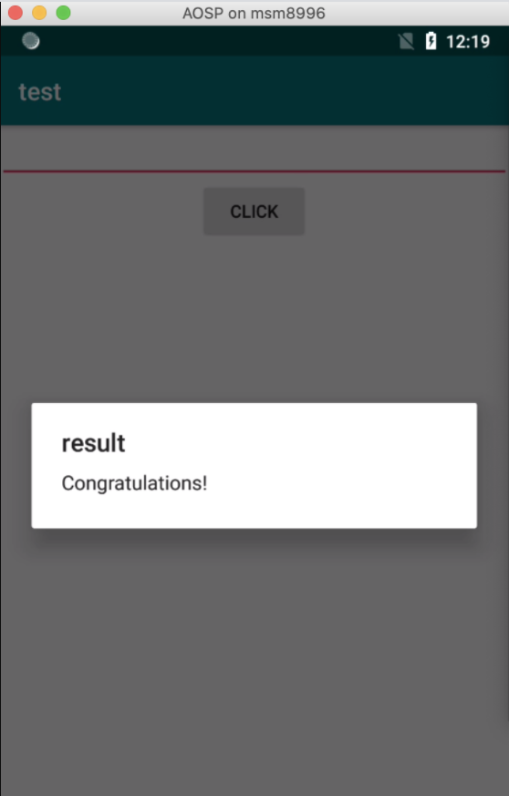

# dex动态自修改demo题解

url：https://bbs.pediy.com/thread-267122.htm


## 前言

题目来自看雪2w班9月第一题。题目主要考察AES+RC4算法，但是神奇的是用了一个dex中的一个stringID在动态运行时被修改成另一个值了，因此导致静态看到结果和动态观察不一致。

## 正文

脱壳，脱壳后进行逆向，

 


 

一开始感觉so文件完全没啥用，反而有一个Utils的类十分可疑

```
package com.kanxue.test;
 
import android.util.Base64;
import java.security.Key;
import javax.crypto.Cipher;
import javax.crypto.spec.SecretKeySpec;
 
public class Utils {
    public static String cipher;
 
    static {
        Utils.cipher = "sGpdX0nDoRPWnonSt0SQQXOk/0wID0jvtAqb2QxJoW4=";
    }
 
    public Utils() {
        super();
    }
 
    public static String aaaaa(String arg7, String arg8) throws Exception {
        String v0 = null;
        if(arg8 == null) {
            return v0;
        }
 
        if(arg8.length() != 16) {
            return v0;
        }
 
        SecretKeySpec v2 = new SecretKeySpec(arg8.getBytes("utf-8"), "AES");
        Cipher v3 = Cipher.getInstance("AES/ECB/PKCS5Padding");
        v3.init(1, ((Key)v2));
        return new String(Base64.encode(v3.doFinal(arg7.getBytes("utf-8")), 0));
    }
 
    static String bbbbb(String arg14, String arg15) {
        int v0 = 0x100;
        char[] v1 = new char[v0];
        char[] v2 = new char[v0];
        int v3;
        for(v3 = 0; v3 < v0; ++v3) {
            v1[v3] = arg14.charAt(v3 % arg14.length());
            v2[v3] = ((char)v3);
        }
 
        v3 = 0;
        int v4;
        for(v4 = 0; v4 < v0; ++v4) {
            v3 = v2[v4] + v3 + v1[v4] & 0xFF;
            char v5 = v2[v4];
            v2[v4] = v2[v3];
            v2[v3] = v5;
        }
 
        v0 = 0;
        v3 = 0;
        String v4_1 = "";
        int v5_1;
        for(v5_1 = 0; v5_1 < arg15.length(); ++v5_1) {
            v0 = v0 + 1 & 0xFF;
            char v6 = v2[v0];
            v3 = v3 + v6 & 0xFF;
            char v7 = ((char)(v2[v3] + v6 & 0xFF));
            v2[v0] = v2[v3];
            v2[v3] = v6;
            try {
                v4_1 = v4_1 + new String(new char[]{((char)(arg15.charAt(v5_1) ^ v2[v7]))});
            }
            catch(Exception v8) {
                v8.printStackTrace();
            }
        }
 
        return v4_1;
    }
 
    public static boolean test(String arg6) {
        boolean v0 = false;
        new Utils();
        String v2 = Utils.bbbbb("kanxue", arg6);
        try {
            if(!Utils.aaaaa(v2, "0123456789abcdef").replace("\n", "").equals(Utils.cipher)) {
                return v0;
            }
        }
        catch(Exception v3) {
            v3.printStackTrace();
            return v0;
        }
 
        return true;
    }
}
```

很明显的test函数是入口，然后调用`bbbbb`函数进行加密得到的返回值作为`aaaaa`函数的参数进行加密，最后确认是否等于Utils.Cipher

 

一开始一看 不是很明显嘛直接CyberChef，然而。。

 


 

很明显不对。。想到之前寒冰师傅出的题，一定是动态修改，那么那个so文件应该就做了这件事。。。

 

直接用Objection打印吧

 


 

果然。。。

 

再来CyberChef


 

还是不对，难道不是也不是AES嘛 。。

 

后来经过主动调用发现AES是对的，那么RC4魔改了？？？？直接抠出来用Java工程跑一遍，确实和标准的RC4不一致。。

 

不过由于RC4这种是一个对称密码，那么我直接拿AES解密后的去再调用一次这个函数就行了。。

 

最终frida跑出来原来的正确的flag

 


 

脚本关键函数如下

```
function hexToBytes(hex) {
    for (var bytes = [], c = 0; c < hex.length; c += 2)
    bytes.push(parseInt(hex.substr(c, 2), 16));
    return bytes;
}
 var jsBytes = hexToBytes("c3bfc29fc3b3c3a335c2a803c294c38c4c670ac39cc3a6c29229005176216dc38d1773");
            var buffer = Java.array('byte', jsBytes);
            var inputStr = string.$new(buffer);
 
             var test = Utils.bbbbb("kanxue", inputStr);
             console.log("Src ->",test);
```

这里的`c3bfc...`是我用CyberChef逆出来的。

 

或者自己写一个java工程，把这个类的所有代码拷出来。。。写个反向的工程就行了。这里我贴出我为了印证RC4的Java工程的代码吧


这里的`c3bfc...`是我用CyberChef逆出来的。

 

或者自己写一个java工程，把这个类的所有代码拷出来。。。写个反向的工程就行了。这里我贴出我为了印证RC4的Java工程的代码吧

```
public class main {
 
    static String bbbbb(String key, String input) {
        int len = 256;
        char[] k = new char[len];
        char[] S = new char[len];
        int i;
        for(i = 0; i < len; ++i) {
            k[i] = key.charAt(i % key.length());
            S[i] = ((char)i);
        }
 
        i = 0;
        int j;
        for(j = 0; j < len; ++j) {
            i = S[j] + i + k[j] & 0xFF;
            char tmp = S[j];
            S[j] = S[i];
            S[i] = tmp;
        }
 
        len = 0;
        i = 0;
        String v4_1 = "";
        int t;
        for(t = 0; t < input.length(); ++t) {
            len = len + 1 & 0xFF;
            char v6 = S[len];
            i = i + v6 & 0xFF;
            char v7 = ((char)(S[i] + v6 & 0xFF));
            S[len] = S[i];
            S[i] = v6;
            try {
                v4_1 = v4_1 + new String(new char[]{((char)(input.charAt(t) ^ S[v7]))});
            }
            catch(Exception v8) {
                v8.printStackTrace();
            }
        }
 
        return v4_1;
    }
    public static byte[] hexStringToByteArray(String s) {
        int len = s.length();
        byte[] data = new byte[len / 2];
        for (int i = 0; i < len; i += 2) {
            data[i / 2] = (byte) ((Character.digit(s.charAt(i), 16) << 4)
                    + Character.digit(s.charAt(i+1), 16));
        }
        return data;
    }
 
    public static void main(String[] args) {
        String hex = "c3bfc29fc3b3c3a335c2a803c294c38c4c670ac39cc3a6c29229005176216dc38d1773";
        byte[] bytes_input = hexStringToByteArray(hex);
        String result = bbbbb("kanxue",new String(bytes_input));
        System.out.println(result);
        /*
        byte[] bytes = result.getBytes();
 
        for (int i = 0; i < bytes.length; i++) {
            System.out.print(String.format("%02x", bytes[i] & 0xff));
        }*/
 
    }
 
}
```

最后验证索然无味



## 后记

永远要记得只有动态在内存中的才是真的，静态看到的可能只是一个谎言。