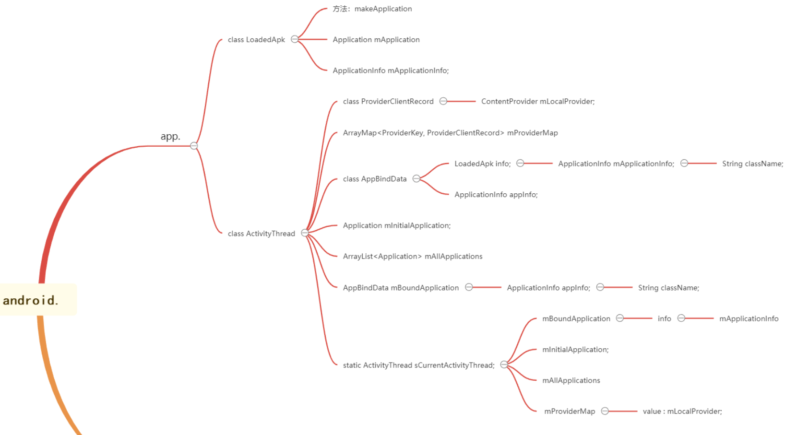
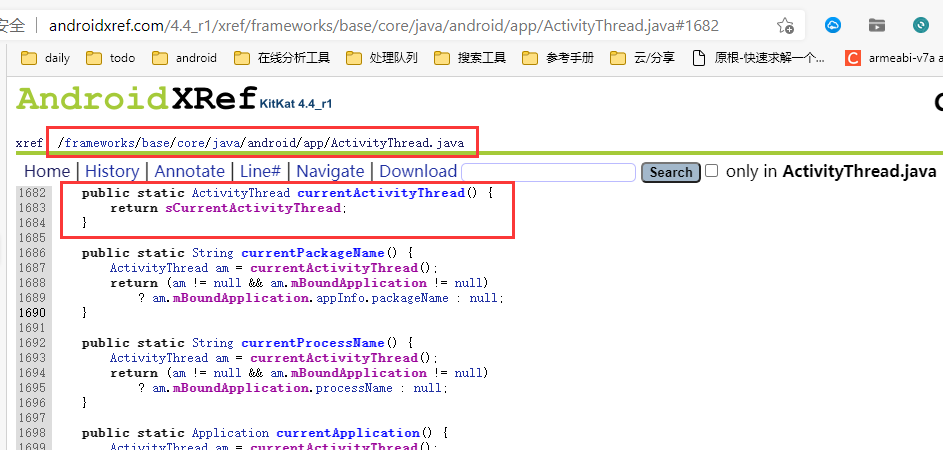
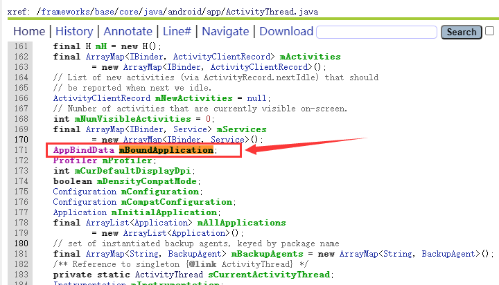
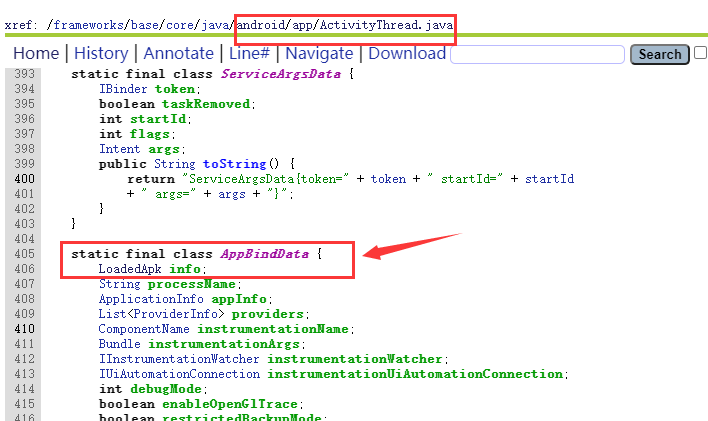
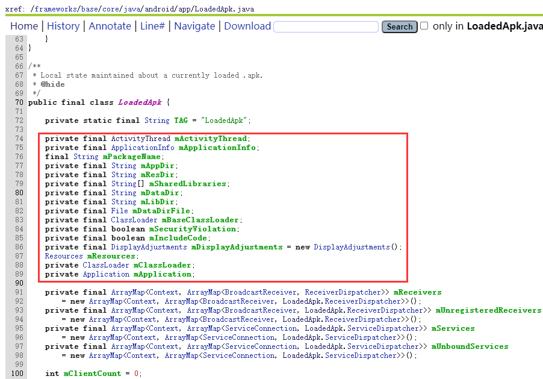
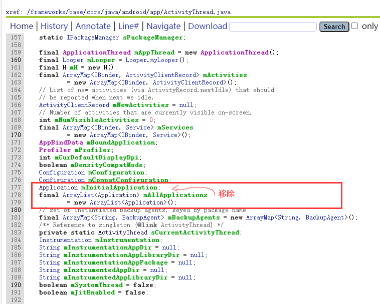
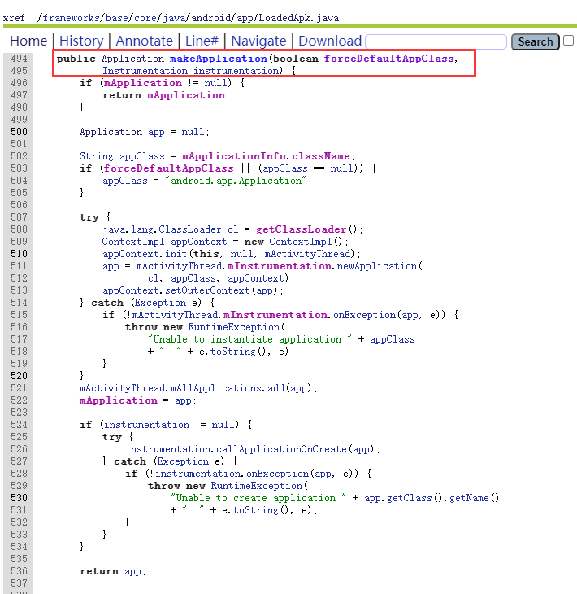
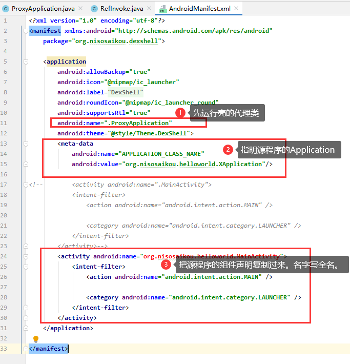
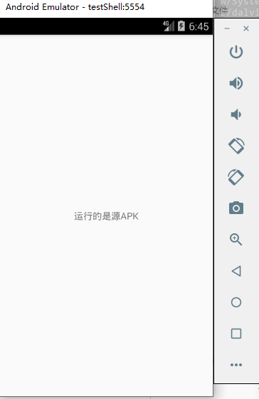

# dex壳简单分析与实现过程 

url：https://bbs.pediy.com/thread-266831.htm


# 2：dex壳

## 加壳原理


 

根据上面的原理图，我们需要3个对象。

- **源Apk**：需要加壳的apk。
- **壳Apk**：将apk解密还原并执行。
- **加密工具：**将源apk和壳dex进行组合成新的dex并且修正新的dex。

## 项目代码编写

> IDE：`Android Studio 4.1.3`
>
> Android版本：4.4+
>
> 项目源码：[nisosaikou/AndroidDEX壳 - 码云 - 开源中国 (gitee.com)](https://gitee.com/nisosaikou/android-dex-shell)

### 编写源APK

- 自定义的一个`Application`类，让这个类继承`Application`，并且实现`onCreate`方法。

  

- 修改`MainActivity.java`的父类，使得`MainActivity`继承于`Activity`。将文本显示修改为**运行的是源APK**。

  

**生成一个release版本apk，把这个apk保存起来。**

### 编写壳APK

#### `ProxyApplication.java`

> 新建一个类叫`ProxyApplication`，继承于类`Application`。这个类用来解密原始的APK。

##### `attachBaseContext()`

- 把壳dex中包含的源apk释放出来。

- 把释放的apk进行解密。

- 把源apk中的`lib`目录中的文件复制到当前程序(壳)的路径下。

- 创建一个新的`DexClassLoader`，替换到父节点的`DexClassLoader`。

  > **DexClassLoader**
  > 继承自BaseDexClassLoader，这个比较灵活，每个参数都可以自定义，我们一般用这个来加载自定义的apk/dex/jar文件。

##### `onCreate()`

- 加载源apk资源。
- 获取`manifest.xml`中记录的源apk的启动类名。
- 设置ActivityThread信息(`android.app.ActivityThread`->`currentActivityThread`)。

##### 关于ActivityThread部分代码解释

> **ActivityThread功能**
>
> 它管理应用进程的主线程的执行(相当于普通Java程序的main入口函数)，并根据AMS的要求（通过IApplicationThread接口，AMS为Client、ActivityThread.ApplicationThread为Server）负责调度和执行activities、broadcasts和其它操作。
>
> 在Android系统中，在默认情况下，一个应用程序内的各个组件(如Activity、BroadcastReceiver、Service)都会在同一个进程(Process)里执行，且由此进程的【主线程】负责执行。
>
> 在Android系统中，如果有特别指定(通过android:process)，也可以让特定组件在不同的进程中运行。无论组件在哪一个进程中运行，默认情况下，他们都由此进程的【主线程】负责执行。
>
> 【主线程】既要处理Activity组件的UI事件，又要处理Service后台服务工作，通常会忙不过来。为了解决此问题，主线程可以创建多个子线程来处理后台服务工作，而本身专心处理UI画面的事件。
>
> 【主线程】的主要责任：
>
> - 快速处理UI事件。而且只有它才处理UI事件， 其它线程还不能存取UI画面上的对象(如TextView等)，此时， 主线程就叫做UI线程。基本上，Android希望UI线程能根据用户的要求做出快速响应，如果UI线程花太多时间处理后台的工作，当UI事件发生时，让用户等待时间超过5秒而未处理，Android系统就会给用户显示ANR提示信息。
> - 只有UI线程才能执行View派生类的onDraw()函数。
> - 快速处理Broadcast消息。【主线程】除了处理UI事件之外，还要处理Broadcast消息。所以在BroadcastReceiver的onReceive()函数中，不宜占用太长的时间，否则导致【主线程】无法处理其它的Broadcast消息或UI事件。如果占用时间超过10秒， Android系统就会给用户显示ANR提示信息。
>
> 注意事项：
>
> - 尽量避免让【主线程】执行耗时的操作，让它能快速处理UI事件和Broadcast消息。
> - BroadcastReceiver的子类都是无状态的，即每次启动时，才会创建其对象，然后调用它的onReceive()函数，当执行完onReceive()函数时，就立即删除此对象。由于每次调用其函数时，会重新创建一个新的对象，所以对象里的属性值，是无法让各函数所共享。
>   ————————————————
>   版权声明：本文为CSDN博主「Arrow」的原创文章，遵循CC 4.0 BY-SA版权协议，转载请附上原文出处链接及本声明。
>   原文链接：https://blog.csdn.net/myarrow/article/details/14223493/

 

**类结构参考**

 




- 调用`currentActivityThread`方法获取`ActivityThread`中的成员变量`sCurrentActivityThread`。

```
	
Object currentActivityThread = RefInvoke.invokeStaticMethod("android.app.ActivityThread", "currentActivityThread", new Class[] {}, new Object[] {});
```




- 获取`sCurrentActivityThread`中的`mBoundApplication`。

```
Object mBoundApplication = RefInvoke.getFieldOjbect("android.app.ActivityThread", currentActivityThread, "mBoundApplication");
```




* 获取`mBoundApplication`中成员变量`info`。

```
Object loadedApkInfo = RefInvoke.getFieldOjbect("android.app.ActivityThread$AppBindData", mBoundApplication, "info");
```



- 观察`LoadedApk`这个类，能发现一些重要的属性，这个下面会用到。

  

- 将`info`中的`mApplication`属性置空。

  `RefInvoke.setFieldOjbect(``"android.app.LoadedApk"``, ``"mApplication"``, loadedApkInfo, null);`

- 在`sCurrentActivityThread`下的链表`mAllApplications`中移除`mInitialApplication`。`mInitialApplication`存放初始化的应用(当前壳应用)，`mAllApplications`存放的是所有的应用。把当前的应用，从现有的应用中移除掉，然后再把新构建的加入到里面去。


- **构造新的Application**
1. 更新2处`className`。

```
ApplicationInfo appinfo_In_LoadedApk = (ApplicationInfo) RefInvoke.getFieldOjbect("android.app.LoadedApk", loadedApkInfo, "mApplicationInfo");
ApplicationInfo appinfo_In_AppBindData = (ApplicationInfo) RefInvoke.getFieldOjbect("android.app.ActivityThread$AppBindData", mBoundApplication, "appInfo");
appinfo_In_LoadedApk.className = srcAppClassName;
appinfo_In_AppBindData.className = srcAppClassName;
```

2. 注册application(用LoadedApk中的makeApplication方法注册)。

```
Application app = (Application) RefInvoke.invokeMethod("android.app.LoadedApk", "makeApplication", loadedApkInfo, new Class[] { boolean.class, Instrumentation.class }, new Object[] { false, null });
```



3. 替换`mInitialApplication`为刚刚创建的`app`。

```
RefInvoke.setFieldOjbect("android.app.ActivityThread", "mInitialApplication", currentActivityThread, app);
```

4. 更新ContentProvider。

```
ArrayMap mProviderMap = (ArrayMap) RefInvoke.getFieldOjbect("android.app.ActivityThread", currentActivityThread, "mProviderMap");
 
Iterator it = mProviderMap.values().iterator();
while (it.hasNext()) {
    Object providerClientRecord = it.next();
    Object localProvider = RefInvoke.getFieldOjbect("android.app.ActivityThread$ProviderClientRecord", providerClientRecord, "mLocalProvider");
    RefInvoke.setFieldOjbect("android.content.ContentProvider", "mContext", localProvider, app);
}
```

5. 执行新app的`onCreate`方法。

```
app.onCreate();
```

#### `RefInvoke.java`

Java反射调用的方法。

#### `AndroidManifest.xml`



### 关于资源的问题

到目前为止，源程序能够运行起来了，但是apk在运行的时候肯定会用到相关的资源，如布局文件等等，我们并没有介绍如何处理资源。

 

资源有2中大的处理方法。第一种是在壳dex解压出源apk时，把apk中的资源复制到现在程序下。第二种是替换壳apk中dex文件时，顺便用源apk中的资源文件替换到壳apk中。因为本文不重点讨论资源的处理问题，所以采用第二种方法，直接复制替换资源即可。

### 编写工具

将APK和壳DEX文件合并，生成一个新的DEX文件，并且校正新的DEX文件头。

## 加壳

- `src.apk`：源APK。
- `des.apk`：壳APK。
- `DexFixed.jar`：Dex工具。
- `classes.dex`：des.apk中的classes.dex。
- `res`：源APK中的文件夹。
- `resources.arsc`：源APK中的文件。

1. 用DEXFixed.jar工具把src.apk和classes.dex进行合并，生成一个新的Dex，替换到壳APK中。

   

2. 替换壳APK中的`classes.dex`、`res`、`resources.arsc`。

3. apk重新签名。

4. 正常运行。

   

## 总结

dex壳是比较基础的壳，只是将源APK加密后放入dex文件中，在运行时进行释放。我们只需要在壳程序解密出原始的APK运行后，在内存中把dexdump下来就可以了，我们也可以用frida框架进行脱壳。