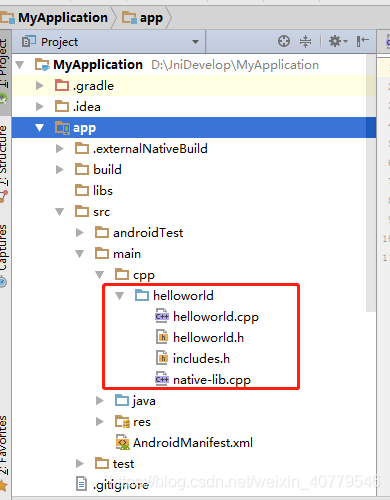
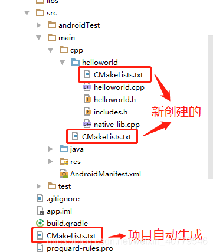
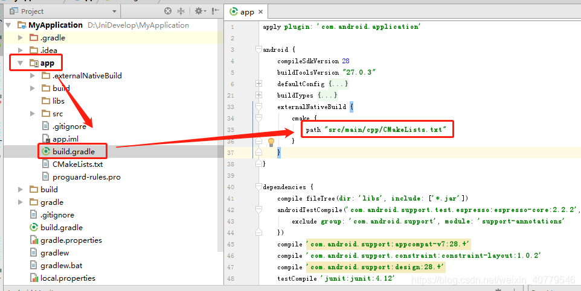
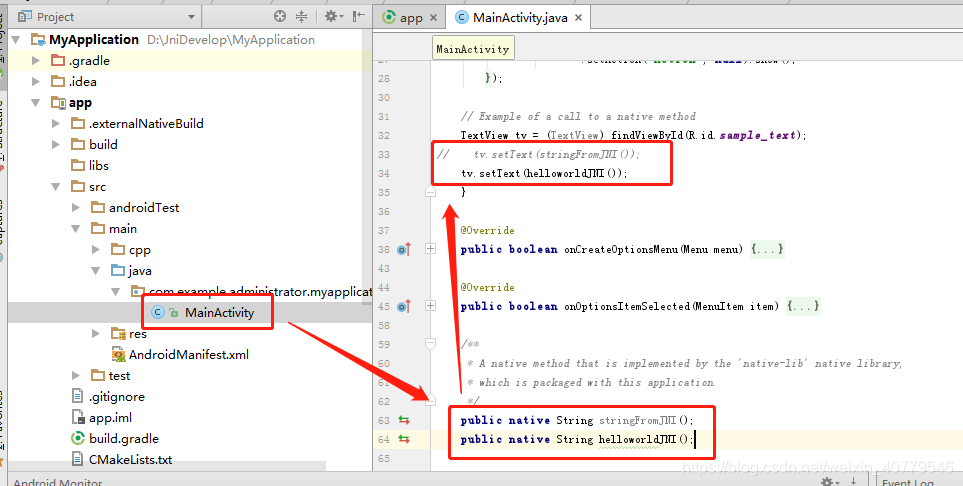

# Android Studio NDK开发案例二 JNI包含多个cpp文件

url：https://blog.csdn.net/weixin_40779546/article/details/84852327


 上一章节我们学会了如何使用Android Studio开发JNI，但是上一章节针对的是单个cpp文件，我们做项目开发时肯定不止一个cpp文件，假如这些cpp文件能够放在一个单独的文件夹下面肯定会更方便我们的操作，但是这些该如何实现呢？其实我们只需要修改CMakeLists.txt及重新定向CMakeLists.txt的路径就可以实现。

该案例在上一章节创建的工程案例中改动实现，上一章节的案例：https://blog.csdn.net/weixin_40779546/article/details/84791694

1、在cpp目录下创建文件夹helloworld，将native-lib.cpp移动到helloworld文件夹，并在helloworld文件夹下创建.cpp和.h文件，结构如下：

```
./cpp/helloworld
          |
          +--- native-lib.cpp
          |
          +--- helloworld.cpp
          |
          +--- helloworld.h
          |
          +--- includes.h
          |          
```




源码如下：

```
//native-lib.cpp
 
 
#include <jni.h>
#include <string>
#include "includes.h"
 
extern "C"
JNIEXPORT jstring JNICALL
Java_com_example_administrator_myapplication_MainActivity_stringFromJNI(
        JNIEnv* env,
        jobject /* this */) {
    std::string hello = "Hello from C++";
    return env->NewStringUTF(hello.c_str());
}
 
extern "C"
JNIEXPORT jstring JNICALL
Java_com_example_administrator_myapplication_MainActivity_helloworldJNI(
        JNIEnv* env,
        jobject instance) {
    std::string hello = helloworld();
    return env->NewStringUTF(hello.c_str());
}
```


```
//helloworld.cpp
 
 
//
// Created by taxiangxuezi on 2018/12/6 0006.
//
 
#include "includes.h"
 
/*******************************************************************************
* 函数名称: char * helloworld(void)
* 函数功能:
* 输入参数:
* 输出参数:
* 返回值  :
*******************************************************************************/
char * helloworld(void)
{
    char *ptr = "hello world";
    return ptr;
}
```


```
//helloworld.h
 
 
 
//
// Created by taxiangxuezi on 2018/12/6 0006.
//
 
#ifndef MYAPPLICATION_HELLOWORLD_H
#define MYAPPLICATION_HELLOWORLD_H
 
extern char * helloworld(void);
 
#endif //MYAPPLICATION_HELLOWORLD_H
```


```
//includes.h
 
 
//
// Created by taxiangxuezi on 2018/12/6 0006.
//
 
#ifndef MYAPPLICATION_INCLUDES_H
#define MYAPPLICATION_INCLUDES_H
 
#include "helloworld.h"
 
#endif //MYAPPLICATION_INCLUDES_H
```

这样将所有源码放在一个文件夹，方便管理和移植。

2、源文件准备好后，开始修改编译链接规则。我们知道在创建JNI工程时，在app/目录下会自动生成CMakeLists.txt，如下图：


此处为了今后使用方便，我们使用自己生成的CMakeLists.txt，重新生成的CMakeLists.txt位置结构如下：

```
./cpp/helloworld
   |      |
   |      +--- native-lib.cpp
   |      |
   |      +--- helloworld.cpp
   |      |
   |      +--- helloworld.h
   |      |
   |      +--- includes.h
   |      |  
   |      +--- CMakeLists.txt 
   |      | 
   |         
   |
   +--- CMakeLists.txt   
   |
```



两个CMakeLists.txt的源码如下：

```
// ./cpp/CMakeLists.txt
 
 
#指定需要CMAKE的最小版本
cmake_minimum_required(VERSION 3.4.1)
#C的编译选项是 CMAKE_C_FLAGS
#指定编译参数，可选
SET(CMAKE_CXX_FLAGS "-Wno-error=format-security -Wno-error=pointer-sign")
#设置生成的so动态库最后输出的路径
#set(CMAKE_LIBRARY_OUTPUT_DIRECTORY ${PROJECT_SOURCE_DIR}/../jniLibs/${ANDROID_ABI})
#设置头文件搜索路径（和此txt同个路径的头文件无需设置），可选
#INCLUDE_DIRECTORIES(${CMAKE_CURRENT_SOURCE_DIR}/common)
#指定用到的系统库或者NDK库或者第三方库的搜索路径，可选。
#LINK_DIRECTORIES(/usr/local/lib)
#添加子目录,将会调用子目录中的CMakeLists.txt
ADD_SUBDIRECTORY(helloworld)
```


```
// ./cpp/helloworld/CMakeLists.txt
 
 
 
#生成so动态库
 
# 查找当前目录下的所有源文件，并保存到 DIR_LIB_SRCS 变量
aux_source_directory(. DIR_LIB_SRCS)
 
# 生成链接库
ADD_LIBRARY(native-lib SHARED ${DIR_LIB_SRCS})
 
# 导入当前目录下的所有头文件
include_directories(.)
 
find_library(log-lib log)
 
target_link_libraries(native-lib ${log-lib})
```

aux_source_directory 查找在某个路径下的所有源文件。

aux_source_directory(< dir > < variable >)

　　搜集所有在指定路径下的源文件的文件名，将输出结果列表储存在指定的变量中。该命令主要用在那些使用显式模板实例化的工程上。模板实例化文件可以存储在Templates子目录下，然后可以使用这条命令自动收集起来；这样可以避免手工罗列所有的实例。

　　使用该命令来避免为一个库或可执行目标写源文件的清单，是非常具有吸引力的。但是如果该命令貌似可以发挥作用，那么CMake就不需要生成一个感知新的源文件何时被加进来的构建系统了（也就是说，新文件的加入，并不会导致CMakeLists.txt过时，从而不能引起CMake重新运行。——译注）。正常情况下，生成的构建系统能够感知它何时需要重新运行CMake，因为需要修改CMakeLists.txt来引入一个新的源文件。当源文件仅仅是加到了该路径下，但是没有修改这个CMakeLists.txt文件，使用者只能手动重新运行CMake来产生一个包含这个新文件的构建系统。

 

打开\MyApplication\app\build.gradle，修改CMakeLists.txt路径，源码如下：

```
    externalNativeBuild {
        cmake {
            path "src/main/cpp/CMakeLists.txt"
        }
    }
```



这样在编译时就会指定src/main/cpp/CMakeLists.txt，并按照其规则编译程序，而app目录下的CMakeLists.txt则会失效，不用删除它也没影响。

编译，生成so库。

3、打开MainActivity.java，按照下图修改代码：



4、在虚拟机运行，运行结果如下：

