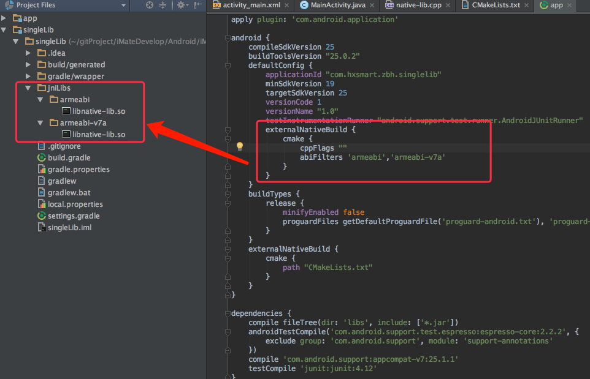
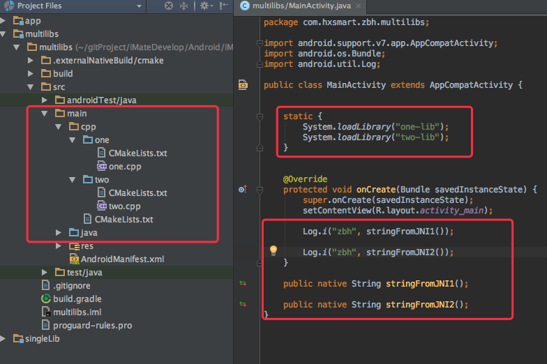
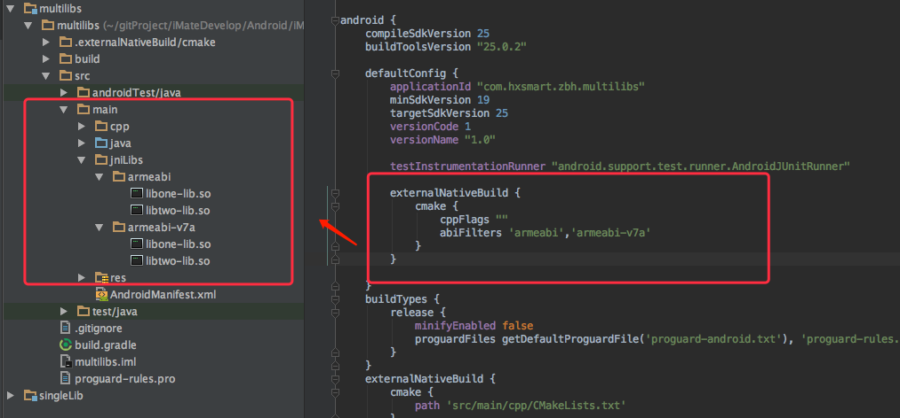

# Android Studio NDK CMake 指定so输出路径以及生成多个so的案例与总结

url：https://blog.csdn.net/b2259909/article/details/58591898


前文

注意：此文的所有配置都是mac电脑下
一直想用Android Studio的新方式Cmake来编译JNI 代码，之前也尝试过，奈何有两个难题挡住了我

只能生成一个 so库，不能一次性生成多个 so库，之前的mk是可以有子模块的。
每次生成的so所在的目录不是在 jniLibs下，虽然知道如果打包，会将它打包进去，但就是觉得看不见它，想提供给别人用，还要去某个目录找。
经过尝试，这两个问题都可以解决了。

2020年1月6号补充
如果Android工程有第三方so库，并且jni编译后使用下面的cmake指定输出目录到 jniLibs下，有可能会发生 so库重复的错误。
请采用以下方法避免错误:

```
android {
 			..........
 		packagingOptions {
        	//解决AS BUG. 优先选择JNILIBS下的so库
        	pickFirst 'lib/arm64-v8a/libDriver.so'
        	pickFirst 'lib/armeabi/libDriver.so'
        	pickFirst 'lib/armeabi-v7a/libDriver.so'
   		}
}

```

## 生成单个so的案例

demo下载地址: http://download.csdn.net/detail/b2259909/9766081

直接看CMakeLists.txt文件:

```
#指定需要CMAKE的最小版本
cmake_minimum_required(VERSION 3.4.1)


#C 的编译选项是 CMAKE_C_FLAGS
# 指定编译参数，可选
SET(CMAKE_CXX_FLAGS "-Wno-error=format-security -Wno-error=pointer-sign")

#设置生成的so动态库最后输出的路径
set(CMAKE_LIBRARY_OUTPUT_DIRECTORY ${PROJECT_SOURCE_DIR}/../jniLibs/${ANDROID_ABI})

#设置头文件搜索路径（和此txt同个路径的头文件无需设置），可选
#INCLUDE_DIRECTORIES(${CMAKE_CURRENT_SOURCE_DIR}/common)

#指定用到的系统库或者NDK库或者第三方库的搜索路径，可选。
#LINK_DIRECTORIES(/usr/local/lib)


add_library( native-lib
             SHARED
             src/main/cpp/native-lib.cpp )

target_link_libraries( native-lib
                       log )

```

其中 各个设置都有说明。主要看这个：

```
set(CMAKE_LIBRARY_OUTPUT_DIRECTORY ${PROJECT_SOURCE_DIR}/../jniLibs/${ANDROID_ABI})
```

它将会把生成的so库按照你在 build.gradle 指定的 abi分别放置在 jniLibs下



**非常好，先解决了第二个问题了。**

------

## 生成多个so案例

还是上面那个demo，重新建一个module。

cpp的目录结构:



直接看CMakeLists.txt文件:

```
#指定需要CMAKE的最小版本
cmake_minimum_required(VERSION 3.4.1)


#C 的编译选项是 CMAKE_C_FLAGS
# 指定编译参数，可选
SET(CMAKE_CXX_FLAGS "-Wno-error=format-security -Wno-error=pointer-sign")

#设置生成的so动态库最后输出的路径
set(CMAKE_LIBRARY_OUTPUT_DIRECTORY ${PROJECT_SOURCE_DIR}/../jniLibs/${ANDROID_ABI})

#设置头文件搜索路径（和此txt同个路径的头文件无需设置），可选
#INCLUDE_DIRECTORIES(${CMAKE_CURRENT_SOURCE_DIR}/common)

#指定用到的系统库或者NDK库或者第三方库的搜索路径，可选。
#LINK_DIRECTORIES(/usr/local/lib)


#添加子目录,将会调用子目录中的CMakeLists.txt
ADD_SUBDIRECTORY(one)
ADD_SUBDIRECTORY(two)

```

不同的地方是改为添加子目录：

```
#添加子目录,将会调用子目录中的CMakeLists.txt
ADD_SUBDIRECTORY(one)
ADD_SUBDIRECTORY(two)
```

这样就会先去跑到子目录下的 one 和 two 的CmakeLists.txt，执行成功再返回。
此时子目录one下的CmakeLists.txt:

```
#继承上一层的CMakeLists.txt的变量，也可以在这里重新赋值
#C 的编译选项是 CMAKE_C_FLAGS
# 指定编译参数，可选
#SET(CMAKE_CXX_FLAGS "-Wno-error=format-security -Wno-error=pointer-sign")

#生成so动态库
ADD_LIBRARY(one-lib SHARED one.cpp)

target_link_libraries(one-lib log)
```

子目录two下的CmakeLists.txt:

```
#继承上一层的CMakeLists.txt的变量，也可以在这里重新赋值
#C 的编译选项是 CMAKE_C_FLAGS
# 指定编译参数，可选
#SET(CMAKE_CXX_FLAGS "-Wno-error=format-security -Wno-error=pointer-sign")

#生成so动态库
ADD_LIBRARY(two-lib SHARED two.cpp)

target_link_libraries(two-lib log)
```

最后生成了以下两个so文件,并自动按照abi分别放置在了 jniLibs下:




第一个问题也成功了。

总结
最后，除了 设定abiFilters 必须在 build.gradle
主要是发现CmakeLists.txt里 其实可以指定很多东西:

so输出路径 CMAKE_LIBRARY_OUTPUT_DIRECTORY
.a 静态库输出路径 CMAKE_ARCHIVE_OUTPUT_DIRECTORY
获取当前编译的abi ， ANDROID_ABI
编译选项：
CMAKE_C_FLAGS
CMAKE_CXX_FLAGS
CMAKE_CXX_FLAGS_DEBUG/CMAKE_CXX_FLAGS_RELEASE
子目录编译: ADD_SUBDIRECTORY
#设置.c文件集合的变量

```
#当前cmakelists.txt所在目录的所有.c .cpp源文件
AUX_SOURCE_DIRECTORY(. SRC_LIST)

#增加其他目录的源文件到集合变量中
list(APPEND SRC_LIST
        ../common/1.c
        ../common/2.c
        ../common/3.c
        ../common/4.c
        ../common/5.c
        ../common/WriteLog.c
    )

#生成so库，直接使用变量代表那些.c文件集合
add_library(mylib SHARED ${SRC_LIST})
```

6._执行自定义命令:

```
# copy头文件到 静态库相同文件夹下
add_custom_command(TARGET myjni
  PRE_BUILD
  COMMAND echo "executing a copy command"
  COMMAND cp ${CMAKE_CURRENT_SOURCE_DIR}/myjni.h ${PROJECT_SOURCE_DIR}/../../../build/outputs/staticLib/myjni/${ANDROID_ABI}
  COMMENT "PRE_BUILD, so This command will be executed before building target myjni"
 )
```

最后，因为很多时候，JNI的参数还要转为C的方式，当我们在JAVA层写了native方法，android IDE自动提示红色，这时按下 ALT + ENTER 可以自动生成JNI下的方法声明，并且入参也帮我们转换好了。不过有时候这个插件不生效。

所以我写了一个JNI 的入参转为 C/C++的代码插件: JNI-Convert-Var,直接在 plugin 的仓库搜就有了。
最近尝试实现android studio的ALT + ENTER 可以自动生成JNI下的方法声明，结果发现好多IntelliJ IDEA的接口不熟悉。 只能先放弃了，以下是我的逻辑：

当鼠标点击在 Native声明方法上时：

1. 检查文件类型，如果为java就继续

2. 获取当前行的上下共三行字符串数据，使用正则表达式获取native声明的完整方法。

3. 检查当前模块目录下的jni或者cpp目录下的.c或者.cpp文件。

4. 如果没有文件，弹窗让用户创建一个C/C++文件，并追加转换后(如何转换会有一个专门的类)的Java2C方法在文件末尾. 在IDE打开此文件。

5. 如果JNI或者cpp目录有一个以上的C/C++文件, 弹窗让用户选择一个C/C++文件或者创建，之后打开文件追加转换后(如何转换会有一个专门的类)的Java2C方法在文件末尾. 。 在IDE打开此文件。

上面逻辑中：

1. 文件类型 ，IntelliJ IDEA 的plugin开发API中可以获取到
2. 获取当前行的上下共三行字符串数据 ，IntelliJ IDEA 的plugin开发API中可以获取到
3. 模块目录的API暂时没找到
4. 在IDE打开C/C++文件，不知道用什么接口