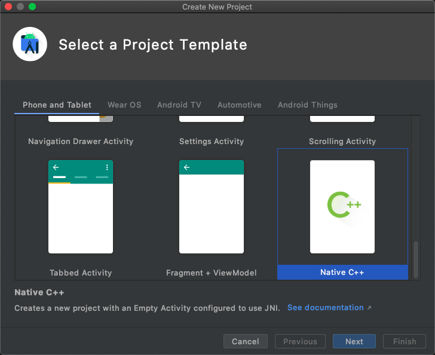
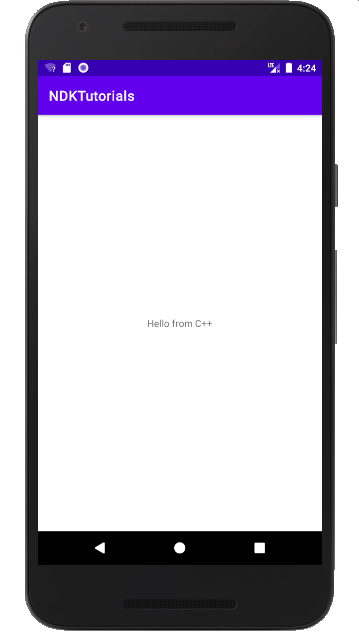
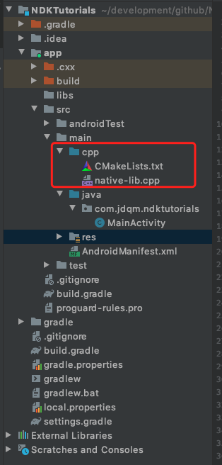
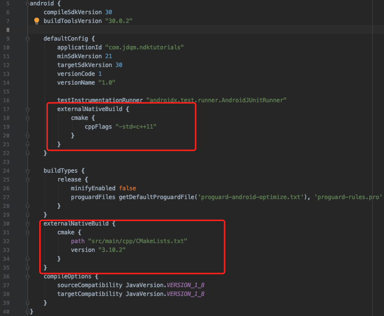
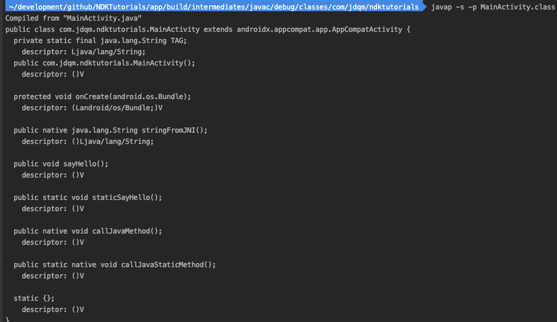

# NDK学习笔记

url：https://www.jianshu.com/p/3067d4138e75


整理了一份NDK学习笔记，分享给需要的朋友: [https://github.com/jdqm/ndk](https://links.jianshu.com/go?to=https%3A%2F%2Fgithub.com%2Fjdqm%2Fndk)

# 目录

- [一、CMake入门基础](https://links.jianshu.com/go?to=chapter-1%2FREADME.md)
  - [1.1 创建NDK项目](https://links.jianshu.com/go?to=https%3A%2F%2Fgithub.com%2Fjdqm%2Fndk%2Fblob%2Fmaster%2Fchapter-1%2F1.1.md)
  - [1.2 CMake编译基础语法](https://links.jianshu.com/go?to=https%3A%2F%2Fgithub.com%2Fjdqm%2Fndk%2Fblob%2Fmaster%2Fchapter-1%2F1.2.md)
- [二、Java与JNI交互](https://links.jianshu.com/go?to=https%3A%2F%2Fgithub.com%2Fjdqm%2Fndk%2Fblob%2Fmaster%2Fchapter-2%2FREADME.md)
  - [2.1 在Java中调用JNI方法](https://links.jianshu.com/go?to=https%3A%2F%2Fgithub.com%2Fjdqm%2Fndk%2Fblob%2Fmaster%2Fchapter-2%2F2.1.md)
  - [2.2 函数的注册](https://links.jianshu.com/go?to=https%3A%2F%2Fgithub.com%2Fjdqm%2Fndk%2Fblob%2Fmaster%2Fchapter-2%2F2.2.md)
  - [2.3 Java与JNI基础数据类型转换](https://links.jianshu.com/go?to=https%3A%2F%2Fgithub.com%2Fjdqm%2Fndk%2Fblob%2Fmaster%2Fchapter-2%2F2.3.md)
  - [2.4 Java与JNI字符串转换](https://links.jianshu.com/go?to=https%3A%2F%2Fgithub.com%2Fjdqm%2Fndk%2Fblob%2Fmaster%2Fchapter-2%2F2.4.md)
  - [2.5 Java与JNI引用类型转换](https://links.jianshu.com/go?to=https%3A%2F%2Fgithub.com%2Fjdqm%2Fndk%2Fblob%2Fmaster%2Fchapter-2%2F2.5.md)
  - [2.6 JNI访问Java类字段](https://links.jianshu.com/go?to=https%3A%2F%2Fgithub.com%2Fjdqm%2Fndk%2Fblob%2Fmaster%2Fchapter-2%2F2.6.md)
  - [2.7 JNI访问Java类方法](https://links.jianshu.com/go?to=https%3A%2F%2Fgithub.com%2Fjdqm%2Fndk%2Fblob%2Fmaster%2Fchapter-2%2F2.7.md)
  - [2.8 JNI线程访问Java类方法](https://links.jianshu.com/go?to=https%3A%2F%2Fgithub.com%2Fjdqm%2Fndk%2Fblob%2Fmaster%2Fchapter-2%2F2.8.md)
  - [2.9 JNI访问Java构造方法](https://links.jianshu.com/go?to=https%3A%2F%2Fgithub.com%2Fjdqm%2Fndk%2Fblob%2Fmaster%2Fchapter-2%2F2.9.md)
- [三、引用类型管理和异常处理](https://links.jianshu.com/go?to=https%3A%2F%2Fgithub.com%2Fjdqm%2Fndk%2Fblob%2Fmaster%2Fchapter-3%2FREADME.md)
  - [3.1 JNI引用类型管理](https://links.jianshu.com/go?to=https%3A%2F%2Fgithub.com%2Fjdqm%2Fndk%2Fblob%2Fmaster%2Fchapter-3%2F3.1.md)
  - [3.2 JNI异常处理](https://links.jianshu.com/go?to=https%3A%2F%2Fgithub.com%2Fjdqm%2Fndk%2Fblob%2Fmaster%2Fchapter-3%2F3.2.md)
- [四、线程创建与同步、Bitmap处理](https://links.jianshu.com/go?to=chapter-4%2FREADME.md)
  - [4.1 JNI线程的创建](https://links.jianshu.com/go?to=https%3A%2F%2Fgithub.com%2Fjdqm%2Fndk%2Fblob%2Fmaster%2Fchapter-4%2F4.1.md)
  - [4.2 JNI线程同步](https://links.jianshu.com/go?to=https%3A%2F%2Fgithub.com%2Fjdqm%2Fndk%2Fblob%2Fmaster%2Fchapter-4%2F4.2.md)
  - [4.3 JNI中Bitmap操作](https://links.jianshu.com/go?to=https%3A%2F%2Fgithub.com%2Fjdqm%2Fndk%2Fblob%2Fmaster%2Fchapter-4%2F4.3.md)
  - [4.4 总结](https://links.jianshu.com/go?to=https%3A%2F%2Fgithub.com%2Fjdqm%2Fndk%2Fblob%2Fmaster%2Fchapter-4%2F4.4.md)


# 一、CMake入门基础

## 1.1 NDK项目创建

Android Studio创建一个NDK项目比较简单，直接选择Native C++模板即可。

[](https://github.com/jdqm/ndk/blob/master/assets/create_ndk_project.png)

项目跑起来是这样：

[](https://github.com/jdqm/ndk/blob/master/assets/run.png)

其中Hello form C++就是Java调用了JNI方法返回的字符串。


## 1.2 CMake编译基础语法与实践

上一小节已经通过Android Studio创建了一个支持NDK的项目，这小节来看看AS帮助我们写了哪些代码，与普通的通常有什么不一样。

1、从项目结构上来看，AS帮我们在main目录先创建了一个cpp的文件夹，用来存放CMake脚本，以及native源文件。

[](https://github.com/jdqm/ndk/blob/master/assets/project_dir.png)

2、主Module（即app Module）的build.gradle文件也新增了一些内容。

[](https://github.com/jdqm/ndk/blob/master/assets/app_build_gradle.png)

```
externalNativeBuild {
    cmake {
        cppFlags "-std=c++11"
    }
}
```

-std=c++11是在创建项目时选择的C++标准。

```
externalNativeBuild {
    cmake {
        path "src/main/cpp/CMakeLists.txt"
        version "3.10.2"
    }
}
```

这里声明了CMake的脚本路径，版本号，下面看看CMakeLists.txt写了什么内容：

```
# For more information about using CMake with Android Studio, read the
# documentation: https://d.android.com/studio/projects/add-native-code.html

# Sets the minimum version of CMake required to build the native library.

cmake_minimum_required(VERSION 3.10.2)

# Declares and names the project.

project("ndktutorials")

# Creates and names a library, sets it as either STATIC
# or SHARED, and provides the relative paths to its source code.
# You can define multiple libraries, and CMake builds them for you.
# Gradle automatically packages shared libraries with your APK.

add_library( # Sets the name of the library.
             native-lib

             # Sets the library as a shared library.
             SHARED

             # Provides a relative path to your source file(s).
             native-lib.cpp )

# Searches for a specified prebuilt library and stores the path as a
# variable. Because CMake includes system libraries in the search path by
# default, you only need to specify the name of the public NDK library
# you want to add. CMake verifies that the library exists before
# completing its build.

find_library( # Sets the name of the path variable.
              log-lib

              # Specifies the name of the NDK library that
              # you want CMake to locate.
              log )

# Specifies libraries CMake should link to your target library. You
# can link multiple libraries, such as libraries you define in this
# build script, prebuilt third-party libraries, or system libraries.

target_link_libraries( # Specifies the target library.
                       native-lib

                       # Links the target library to the log library
                       # included in the NDK.
                       ${log-lib} )
```

早期其实可以先只关注这几行：

```
add_library( # Sets the name of the library.
             native-lib //生成so库的名字

             # Sets the library as a shared library.
             SHARED

             # Provides a relative path to your source file(s).
             native-lib.cpp ) //源码
```

接下来看看MainActivity

```
public class MainActivity extends AppCompatActivity {

    // Used to load the 'native-lib' library on application startup.
    static {
        System.loadLibrary("native-lib");
    }

    @Override
    protected void onCreate(Bundle savedInstanceState) {
        super.onCreate(savedInstanceState);
        setContentView(R.layout.activity_main);

        // Example of a call to a native method
        TextView tv = findViewById(R.id.sample_text);
        tv.setText(stringFromJNI());
    }

    /**
     * A native method that is implemented by the 'native-lib' native library,
     * which is packaged with this application.
     */
    public native String stringFromJNI();
}
```

1、声明了一个native方法 stringFromJNI()； 2、System.loadLibrary("native-lib")加载so库； 3、调用native方法

下面看看这个native方法的实现：

```
extern "C" JNIEXPORT jstring JNICALL
Java_com_jdqm_ndktutorials_MainActivity_stringFromJNI(
        JNIEnv* env,
        jobject /* this */) {
    std::string hello = "Hello from C++";
    return env->NewStringUTF(hello.c_str());
}
```

jstring：返回值 com_jdqm_ndktutorials：包名点换成了下划线 MainActivity：声明native方法的类名 stringFromJNI：方法名


# 二 Java、JNI交互

## 2.1 在Java中调用JNI方法

### 一、Java调用JNI方法

其实在AS帮助我们创建的工程里，就已经向我们阐述了java如何调用native方法。

1、加载so库，选择合适的时机加载需要使用的so库，例如在静态代码块中直接加载。

```
// Used to load the 'native-lib' library on application startup.
static {
    System.loadLibrary("native-lib");
}
```

2、调用Java中通过native声明的方法，最终会调用到native中的C/C++代码。

### 二、JNI调用Java实例方法

```
public void sayHello() {
    Log.d(TAG, "Hello I am Java method.");
}
extern "C" 
JNIEXPORT void JNICALL
Java_com_jdqm_ndktutorials_MainActivity_callJavaMethod(JNIEnv *env, jobject thiz) {
    jclass jclazz = env->FindClass("com/jdqm/ndktutorials/MainActivity");
    jmethodID jmethodId = env->GetMethodID(jclazz, "sayHello", "()V");
    env->CallVoidMethod(thiz, jmethodId);
}
```

这个例子是在native层调用了Java的实例方法seyHello()，分3步：

- 找到jclass;
- 找到jclass中对应的方法id；
- 调用方法

### 三、JNI调用Java静态方法

```
public static void staticSayHello() {
    Log.d(TAG, "Hello I am Java static method.");
}
extern "C"
JNIEXPORT void JNICALL
Java_com_jdqm_ndktutorials_MainActivity_callJavaStaticMethod(JNIEnv *env, jclass clazz) {
    jclass jclazz = env->FindClass("com/jdqm/ndktutorials/MainActivity");
    jmethodID jmethodId = env->GetStaticMethodID(jclazz, "staticSayHello", "()V");
    env->CallStaticVoidMethod(jclazz, jmethodId);
}
```

步骤其实和实例方法差不多，只不过调用env中的方法时，多了Static。值得一提的是，静态native方法`JNIEnv *env, jclass clazz`第二个参数是jclass，对应的是声明native方法的Class对象，而实例方法则是jobject，对应的是声明native方法类的实例对象。

留意其中一个函数

```
jmethodID GetStaticMethodID(jclass clazz, const char* name, const char* sig)
```

这个函数的三个参数分别是：Class对象，方法名，方法签名。其中方法签名是用来辅助找到方法，因为Java中方法可以重载，也就是说单单通过方法名无法定位到具体的方法。这里的方法签名包含两个部分：参数列表，返回值，早期可以用命令javap来辅助查看方法签名，熟悉规律了之后其实就不在需要了。

[](https://github.com/jdqm/ndk/blob/master/assets/javap.png)

### 四、JNI方法签名规范

基本格式

> (参数1类型;参数2类型;...参数N;)返回值类型

当参数为引用类型的时候，参数类型的根式为"L包名"，其中包名的.(点)要换成"/"，比如String是Ljava/lang/String，Bundle是(Landroid/os/Bundle。

| Java类型 | 类型标识 |
| -------- | -------- |
| boolean  | Z        |
| byte     | B        |
| char     | C        |
| short    | S        |
| int      | I        |
| long     | J        |
| float    | F        |
| double   | D        |

这个其实很好记的，除了boolean和long，其他都是首字母大写，主要这两个被占用了，B被byte占用，L与引用类型“L包名”冲突。如果返回值是void，对应的签名是V。另外有一个特殊的类型：数组

| Java类型 | 类型标识            |
| -------- | ------------------- |
| int[]    | [I                  |
| String[] | [Ljava/lang/String; |


## 2.2 函数的注册

JNI中本地方法注册的方法有两种： 1、静态注册 默认的方式，方法名需要符合一定的规则，以便native声明的方法和native层的方法绑定 2、动态注册 方法名不需要符合特定规则，重写JNI_OnLoad()函数此方法会再加载so时调用：①告诉java VM此C组件使用哪一个JNI版本，即方法的返回值；②通过该方法中的参数`JavaVM *vm `取得`JNIEnv`指针，调用其`RegisterNatives(jclass clazz, const JNINativeMethod* methods, jint nMethods)`进行注册。

在Java层声明native方法

```
public class JNIDynamicLoad {
    public native int sum(int a, int b);

    public native String  getNativeString();
}
```

2、 JNI层进行动态注册

```
jstring getMessage(JNIEnv *env, jobject job) {
    return env->NewStringUTF("This is message from C++");
}

jint plus(JNIEnv *env, jobject job, int x, int y) {
    return x + y;
}

/**
 * Java层的getNativeString()与native层的getMessage()绑定
 * Java层的sum()与native层的plus()绑定
 */
static JNINativeMethod gMethods[] = {
        {"getNativeString", "()Ljava/lang/String;", (void *) getMessage},
        {"sum",             "(II)I",                (void *) plus},
};

int registerNativeMethods(JNIEnv *env, const char *name,
                          const JNINativeMethod *methods,
                          jint nMethods) {
    jclass jclass1 = env->FindClass(name);
    if (jclass1 == nullptr) {
        return JNI_FALSE;
    }

    if (env->RegisterNatives(jclass1, gMethods, nMethods) < 0) {
        return JNI_FALSE;
    }

    return JNI_OK;
}

JNIEXPORT int JNICALL JNI_OnLoad (JavaVM *vm , void *reserved) {
    JNIEnv *env;
    if (vm->GetEnv(reinterpret_cast<void **>(&env), JNI_VERSION_1_6) != JNI_OK) {
        return JNI_FALSE;
    }
    registerNativeMethods(env, "com/jdqm/ndktutorials/JNIDynamicLoad", gMethods, sizeof(gMethods) / sizeof(gMethods[0]));

    LOGD("jni onLoad call");
    return JNI_VERSION_1_6;
}
```

## 2.3 Java与JNI基础数据类型转换

Java基本数据类型在JNI中对应的类型

```
public class JNIBasicTypes {
    static {
        System.loadLibrary("native-lib");
    }

    public native int callNativeInt(int num);

    public native byte callNativeByte(byte b);

    public native char callNativeChar(char ch);

    public native short callNativeShort(short sh);

    public native long callNativeLong(long l);

    public native float callNativeFloat(float f);

    public native double callNativeDouble(double d);

    public native boolean callNativeBoolean(boolean value);
}
extern "C"
JNIEXPORT jint JNICALL
Java_com_jdqm_ndktutorials_jni_JNIBasicTypes_callNativeInt(JNIEnv *env, jobject thiz, jint num) {
    LOGD("java int value is %d",num);
    int c_num=num *2;
    return c_num;
}

extern "C"
JNIEXPORT jbyte JNICALL
Java_com_jdqm_ndktutorials_jni_JNIBasicTypes_callNativeByte(JNIEnv *env, jobject thiz,
                                                                jbyte b) {
    LOGD("java byte value is %d", b);
    jbyte c_byte = b + (jbyte) 10;
    return c_byte;
}


extern "C"
JNIEXPORT jchar JNICALL
Java_com_jdqm_ndktutorials_jni_JNIBasicTypes_callNativeChar(JNIEnv *env, jobject thiz,
                                                                jchar ch) {
    LOGD("java char value is %c", ch);
    jchar c_char = ch + (jchar) 3;
    return c_char;
}

extern "C"
JNIEXPORT jshort JNICALL
Java_com_jdqm_ndktutorials_jni_JNIBasicTypes_callNativeShort(JNIEnv *env, jobject thiz,
                                                                 jshort sh) {
    LOGD("java char value is %d", sh);
    jshort c_short = sh + (jshort) 10;
    return c_short;
}

extern "C"
JNIEXPORT jlong JNICALL
Java_com_jdqm_ndktutorials_jni_JNIBasicTypes_callNativeLong(JNIEnv *env, jobject thiz,
                                                                jlong l) {
    LOGD("java long value is %ld", l);
    jlong c_long = l + 100;
    return c_long;
}


extern "C"
JNIEXPORT jfloat JNICALL
Java_com_jdqm_ndktutorials_jni_JNIBasicTypes_callNativeFloat(JNIEnv *env, jobject thiz,
                                                                 jfloat f) {
    LOGD("java float value is %f", f);
    jfloat c_float = f + (jfloat) 10.0;
    return c_float;
}


extern "C"
JNIEXPORT jdouble JNICALL
Java_com_jdqm_ndktutorials_jni_JNIBasicTypes_callNativeDouble(JNIEnv *env, jobject thiz,
                                                                  jdouble d) {
    LOGD("java double value is %f", d);
    jdouble c_double = d + 20.0;
    return c_double;
}

extern "C"
JNIEXPORT jboolean JNICALL
Java_com_jdqm_ndktutorials_jni_JNIBasicTypes_callNativeBoolean(JNIEnv *env, jobject thiz,
                                                                   jboolean value) {
    LOGD("java boolean value is %d", value);
    jboolean c_bool = (jboolean) !value;
    return c_bool;
}
```


## 2.4 Java与JNI字符串转换

```
public class JNIString {
    static {
        System.loadLibrary("native-lib");
    }

    public native String callNativeString(String str);

    public native void StringMethod(String str);

    public native String reverseString(String str);

    public native String getHalfString(String str);

}
extern "C"
JNIEXPORT jstring JNICALL
Java_com_jdqm_ndktutorials_jni_JNIString_callNativeString(JNIEnv *env, jobject thiz,
                                                          jstring str_) {
    // Java 的字符串并不能直接转成 C/C++ 风格的字符串
    // 需要用到 GetStringChars 或者 GetStringUTFChars 相应的函数来申请内存
    // 转成一个指向 JVM 地址的指针
    // 最后还要释放该指针的内存

    const char *str = env->GetStringUTFChars(str_, 0);
    LOGD("java string  is %s", str);
    // GetStringUTFChars 涉及到申请内存，最好做个检查，防止 OOM
    // Get 和 Release 要配套使用，避免内存泄漏
    env->ReleaseStringUTFChars(str_, str);
    // 从 Native 返回字符串，将 C/C++ 风格的字符串返回到 Java 层
    // 也需要用到特定的函数来转换 NewStringUTF 或者 NewString 等
    const char *c_str = "this is C style string";

//    env->GetStringRegion()
    return env->NewStringUTF(c_str);
}


/**
 * 反转字符串操作
 */
extern "C"
JNIEXPORT jstring JNICALL
Java_com_jdqm_ndktutorials_jni_JNIString_reverseString(JNIEnv *env, jobject thiz,
                                                       jstring str_) {


    const char *str = env->GetStringUTFChars(str_, 0);

    int length = env->GetStringLength(str_);

    char reverseString[length];

    for (int i = 0; i < length; ++i) {
        reverseString[i] = str[length - 1 - i];
    }

    env->ReleaseStringUTFChars(str_, str);

    // 此处的使用会引起崩溃,传入的字符串是 hello str 时
    return env->NewStringUTF(reverseString);
}


/**
 * 得到字符串一半内容，使用 GetStringRegion 方法
 */
extern "C"
JNIEXPORT jstring JNICALL
Java_com_jdqm_ndktutorials_jni_JNIString_getHalfString(JNIEnv *env, jobject thiz,
                                                       jstring str_) {

    int len = env->GetStringLength(str_);

    jchar outputBuf[len / 2];

    // 截取一部分内容放到缓冲区里面去
    env->GetStringRegion(str_, 0, len / 2, outputBuf);

    // 再从缓冲区中得到 Java 字符串
    jstring ret = env->NewString(outputBuf, len / 2);

    return ret;
}


extern "C"
JNIEXPORT void JNICALL
Java_com_jdqm_ndktutorials_jni_JNIString_StringMethod(JNIEnv *env, jobject thiz, jstring str_) {

    const char *str = env->GetStringUTFChars(str_, 0);
    char buf[128];
    int len = env->GetStringLength(str_);
    LOGD("java string length is %d", len);
    env->GetStringUTFRegion(str_, 0, len - 1, buf);
    LOGD("java string length is %s", buf);
    env->ReleaseStringUTFChars(str_, str);
}
```


## 2.5 Java与JNI引用类型转换

```
public class JNIReference extends BaseOperation {


    @Override
    public void invoke() {
//        errorCacheLocalReference();
//        cacheWithGlobalReference();
//        useWeakGlobalReference();
        print( errorCacheLocalReference(), cacheWithGlobalReference(), useWeakGlobalReference());

    }

    public native String errorCacheLocalReference();
    public native String cacheWithGlobalReference();
    public native String useWeakGlobalReference();
}
/**
 * 局部引用
 */
extern "C"
JNIEXPORT jstring JNICALL
Java_com_jdqm_ndktutorials_jni_JNIReference_errorCacheLocalReference(JNIEnv *env, jobject thiz) {
    jclass localRefs = env->FindClass("java/lang/String");
    jmethodID mid = env->GetMethodID(localRefs, "<init>", "(Ljava/lang/String;)V");
    jstring str = env->NewStringUTF("string");
    //局部引用如果引用过多需要手动及时释放
    for (int i = 0; i < 1000; ++i) {
        jclass cls = env->FindClass("java/lang/String");

        env->DeleteLocalRef(cls);

    }
    return static_cast<jstring>(env->NewObject(localRefs, mid, str));
}

/**
 * 全局引用
 * 可以全局缓存
 */
extern "C"
JNIEXPORT jstring JNICALL
Java_com_jdqm_ndktutorials_jni_JNIReference_cacheWithGlobalReference(JNIEnv *env, jobject thiz) {
    static jclass stringClass = nullptr;
    if (stringClass == nullptr) {
        jclass cls = env->FindClass("java/lang/String");
        stringClass = static_cast<jclass>(env->NewGlobalRef(cls));
        env->DeleteLocalRef(cls);
    } else {
        LOGD("USER CACHED");
    }
    jmethodID mid = env->GetMethodID(stringClass, "<init>", "(Ljava/lang/String;)V");
    jstring str = env->NewStringUTF("string");
    return static_cast<jstring>(env->NewObject(stringClass, mid, str));
}

/**
 * 弱引用
 */
extern "C"
JNIEXPORT jstring JNICALL
Java_com_jdqm_ndktutorials_jni_JNIReference_useWeakGlobalReference(JNIEnv *env, jobject thiz) {

    static jclass stringClass = nullptr;
    if (stringClass == nullptr) {
        jclass cls = env->FindClass("java/lang/String");
        stringClass = static_cast<jclass>(env->NewWeakGlobalRef(cls));
        env->DeleteLocalRef(cls);
    } else {
        LOGD("USER CACHED");
    }
    jmethodID mid = env->GetMethodID(stringClass, "<init>", "(Ljava/lang/String;)V");
    jboolean isGc = env->IsSameObject(stringClass, nullptr);
    if (!isGc) {
        jstring str = env->NewStringUTF("string");
        return static_cast<jstring>(env->NewObject(stringClass, mid, str));
    } else {
        jstring str = env->NewStringUTF("弱引用被释放");
        return static_cast<jstring>(env->NewObject(stringClass, mid, str));
    }
}
```

## 2.6 JNI访问Java类字段

```
public class JNIAccessField extends BaseOperation {
    private static final String TAG = "JNIAccessField";
    final Animal animal = new Animal("animal");
    static int num = 1;

    @Override
    public void invoke() {

        // 访问实例的字段
        accessInstanceFiled(animal);
        Log.d(TAG, "after access instance field,the name is " + animal.getName());

        // 访问静态类的字段
        accessStaticField(animal);
        Log.d(TAG, "after access static field,the num is " + Animal.num);

        staticAccessInstanceField();
        Log.d(TAG, "--staticAccessInstanceField--,the num is " + JNIAccessField.num);

        // 访问实例的方法
        callInstanceMethod(animal);
        // 访问静态类的方法
        callStaticMethod(animal);
    }

    private native int accessInstanceFiled(Animal animal);

    private native int accessStaticField(Animal animal);

    private native void callInstanceMethod(Animal animal);

    private native void callStaticMethod(Animal animal);

    public static native void staticAccessInstanceField();

}
extern "C"
JNIEXPORT jint JNICALL
Java_com_jdqm_ndktutorials_jni_JNIAccessField_accessInstanceFiled(JNIEnv *env, jobject thiz,
                                                                  jobject animal) {

    //找到这个类
    jclass cls = env->GetObjectClass(animal);
    jfieldID fid = env->GetFieldID(cls, "name", "Ljava/lang/String;");//找到实例字段
    jstring str = env->NewStringUTF("this is new name");
    //重新设值
    env->SetObjectField(animal, fid, str);
    return JNI_OK;
}


extern "C"
JNIEXPORT jint JNICALL
Java_com_jdqm_ndktutorials_jni_JNIAccessField_accessStaticField(JNIEnv *env, jobject thiz,
                                                                jobject animal) {
    jclass cls = env->GetObjectClass(animal);//找到类
    jfieldID fid = env->GetStaticFieldID(cls, "num", "I");//找到静态字段
    int num = env->GetStaticIntField(cls, fid);
    //重新设值
    env->SetStaticIntField(cls, fid, num + 1);
    return JNI_OK;
}


extern "C"
JNIEXPORT void JNICALL
Java_com_jdqm_ndktutorials_jni_JNIAccessField_staticAccessInstanceField(JNIEnv *env,
                                                                        jclass clazz) {

    jfieldID fid = env->GetStaticFieldID(clazz, "num", "I");
    int num = env->GetStaticIntField(clazz, fid);
    //重新设值
    env->SetStaticIntField(clazz, fid, num + 1);
}


// Native 访问 Java 的类实例方法
extern "C"
JNIEXPORT void JNICALL
Java_com_jdqm_ndktutorials_jni_JNIAccessField_callInstanceMethod(JNIEnv *env, jobject thiz,
                                                                 jobject animal) {

    jclass cls = env->GetObjectClass(animal);
    jmethodID mid = env->GetMethodID(cls, "callInstanceMethod", "(I)V");
    if (mid != nullptr) {
        env->CallVoidMethod(animal, mid, 2);
    }
}


// Native 访问 Java 的静态方法
extern "C"
JNIEXPORT void JNICALL
Java_com_jdqm_ndktutorials_jni_JNIAccessField_callStaticMethod(JNIEnv *env, jobject thiz,
                                                               jobject animal) {

    jclass cls = env->GetObjectClass(animal);
    jmethodID argsmid = nullptr;

    argsmid = env->GetStaticMethodID(cls, "callStaticMethod",
                                               "(Ljava/lang/String;)Ljava/lang/String;");
    if (argsmid == nullptr) {
        return;
    }
    jstring jstr = env->NewStringUTF("jstring");
    env->CallStaticObjectMethod(cls, argsmid, jstr);


    argsmid = env->GetStaticMethodID(cls, "callStaticMethod",
                                     "([Ljava/lang/String;I)Ljava/lang/String;");
    if (argsmid == nullptr) {
        return;
    }

    jobjectArray objArray;

    jclass objclass = env->FindClass("java/lang/String");

    if (objclass == nullptr) {
        return;
    }

    int size = 100;
    objArray = env->NewObjectArray(size, objclass, nullptr);

    if (objArray == nullptr) {
        return;
    }
    jstring strElement;
    for (int i = 0; i < size; ++i) {
        strElement = env->NewStringUTF("str in c");
        env->SetObjectArrayElement(objArray, i, strElement);
    }

    env->CallStaticObjectMethod(cls, argsmid, objArray, size);

}
public class Animal {
    private static final String TAG = "Animal";


    protected String name;

    public static int num = 0;

    public Animal(String name) {
        this.name = name;
    }


    public String getName() {
        Log.d(TAG,"call getName method");
        return this.name;
    }

    public int getNum() {
        return num;
    }

    // C++ 调用 Java 的实例方法
    public void callInstanceMethod(int num) {
        Log.d(TAG, "call instance method and num is " + num);
    }

    // C++ 调用 Java 的类方法
    public static String callStaticMethod(String str) {

        if (str != null) {
            Log.d(TAG, "call static method with " + str);
        } else {
            Log.d(TAG, "call static method str is null");
        }
        return "";
    }

    public static String callStaticMethod(String[] strs, int num) {
        Log.d(TAG, "call static method with string array " + num);
        if (strs != null) {
//            for (String str : strs) {
//                Log.d(TAG, "str in array is " + str+"");
//            }
            for (int i = 0; i <strs.length ; i++) {
                Log.d(TAG, "str in array is " + strs[i]+ i);
            }
        }
        return "";
    }

    public static void callStaticVoidMethod() {
        Log.d(TAG, "call static void method");
    }
}
```


## 2.7 JNI访问Java类方法

```
// Native 访问 Java 的类实例方法
extern "C"
JNIEXPORT void JNICALL
Java_com_jdqm_ndktutorials_jni_JNIAccessField_callInstanceMethod(JNIEnv *env, jobject thiz,
                                                                 jobject animal) {

    jclass cls = env->GetObjectClass(animal);
    jmethodID mid = env->GetMethodID(cls, "callInstanceMethod", "(I)V");
    if (mid != nullptr) {
        env->CallVoidMethod(animal, mid, 2);
    }
}


// Native 访问 Java 的静态方法
extern "C"
JNIEXPORT void JNICALL
Java_com_jdqm_ndktutorials_jni_JNIAccessField_callStaticMethod(JNIEnv *env, jobject thiz,
                                                               jobject animal) {

    jclass cls = env->GetObjectClass(animal);
    jmethodID argsmid = nullptr;

    argsmid = env->GetStaticMethodID(cls, "callStaticMethod",
                                               "(Ljava/lang/String;)Ljava/lang/String;");
    if (argsmid == nullptr) {
        return;
    }
    jstring jstr = env->NewStringUTF("jstring");
    env->CallStaticObjectMethod(cls, argsmid, jstr);


    argsmid = env->GetStaticMethodID(cls, "callStaticMethod",
                                     "([Ljava/lang/String;I)Ljava/lang/String;");
    if (argsmid == nullptr) {
        return;
    }

    jobjectArray objArray;

    jclass objclass = env->FindClass("java/lang/String");

    if (objclass == nullptr) {
        return;
    }

    int size = 100;
    objArray = env->NewObjectArray(size, objclass, nullptr);

    if (objArray == nullptr) {
        return;
    }
    jstring strElement;
    for (int i = 0; i < size; ++i) {
        strElement = env->NewStringUTF("str in c");
        env->SetObjectArrayElement(objArray, i, strElement);
    }

    env->CallStaticObjectMethod(cls, argsmid, objArray, size);

}
```


## 2.8 JNI线程访问Java类方法

```
//回调，包括子线程回调
JNIInvokeMethod jniInvokeMethod = new JNIInvokeMethod();
jniInvokeMethod.nativeCallback(new ICallbackMethod() {
    @Override
    public void callback() {
        Log.d(TAG, "callback: " + Thread.currentThread().getName());
    }
});
jniInvokeMethod.nativeThreadCallback(new IThreadCallback() {
    @Override
    public void callback() {
        Log.d(TAG, "callback: " + Thread.currentThread().getName());
    }
});
public interface ICallbackMethod {
    void callback();
}
public interface IThreadCallback {
    void callback();
}
public class JNIInvokeMethod extends BaseOperation {
    @Override
    public void invoke() {

    }

    public native void nativeCallback(ICallbackMethod mICallbackMethod );
    public native void nativeThreadCallback(IThreadCallback mIThreadCallback);
}
static jclass threadClazz;
static jmethodID threadMethod;
static jobject threadObject;

extern "C"
JNIEXPORT void JNICALL
Java_com_jdqm_ndktutorials_jni_JNIInvokeMethod_nativeCallback(JNIEnv *env, jobject instance,
                                                              jobject callback) {
    LOGD("nativeCallback");
    jclass callbackClazz = env->GetObjectClass(callback);
    jmethodID callbackMethod = env->GetMethodID(callbackClazz, "callback", "()V");
    env->CallVoidMethod(callback, callbackMethod);
}

void *threadCallback(void *) {
    //env 是不能跨线程
    JavaVM *gVM = getJvm();
    JNIEnv *env = nullptr;
    if (gVM->AttachCurrentThread(&env, nullptr) == 0) {
        env->CallVoidMethod(threadObject, threadMethod);
        gVM->DetachCurrentThread();
    }
    return JNI_OK;
}

extern "C"
JNIEXPORT void JNICALL
Java_com_jdqm_ndktutorials_jni_JNIInvokeMethod_nativeThreadCallback(JNIEnv *env,
                                                                    jobject instance,
                                                                    jobject callback) {
    //env 是不能跨线程的
    threadClazz = env->GetObjectClass(callback);
    threadMethod = env->GetMethodID(threadClazz, "callback", "()V");
    threadObject = env->NewGlobalRef(callback);
    pthread_t handle;
    pthread_create(&handle, nullptr, threadCallback, nullptr);
}
```


## 2.9 JNI访问Java构造方法

`<init>`

```
/**
 * 全局引用
 * 可以全局缓存
 */
extern "C"
JNIEXPORT jstring JNICALL
Java_com_jdqm_ndktutorials_jni_JNIReference_cacheWithGlobalReference(JNIEnv *env, jobject thiz) {
    static jclass stringClass = nullptr;
    if (stringClass == nullptr) {
        jclass cls = env->FindClass("java/lang/String");
        stringClass = static_cast<jclass>(env->NewGlobalRef(cls));
        env->DeleteLocalRef(cls);
    } else {
        LOGD("USER CACHED");
    }
    jmethodID mid = env->GetMethodID(stringClass, "<init>", "(Ljava/lang/String;)V");
    jstring str = env->NewStringUTF("string");
    return static_cast<jstring>(env->NewObject(stringClass, mid, str));
}
```

# 三、引用类型管理和异常处理

## 3.1 JNI引用类型管理

```
//java类型	Native类型	符号属性	字长
//boolean	jboolean	无符号	8位
//byte	jbyte	有符号	8位
//char	jchar	无符号	16位
//short	jshort	有符号	16位
//int	jint	有符号	32位
//long	jlong	有符号	64位
//float	jfloat	有符号	32位
//double	jdouble	有符号	64位


//java类型	                      Native类型
// ALL Object                     jobject
//java.lang.Class	              jclass
//java.lang.Throwable	          jthrowable
//java.lang.String	              jstring
//java.lang.Object[]	          jobjectArray
//Boolean[]	                      jbooleanArray
//Byte[]	                      jbyteArray
//Char[]	                      jcharArray
//Short[]	                      jshortArray
//int[]	                          jintArray
//long[]	                      jlongArray
//float[]	                      jfloatArray
//double[]	                      jdoubleArray


#include <jni.h>
#include <base.h>
#include <cstdio>

extern "C"
JNIEXPORT jstring JNICALL
Java_com_jdqm_ndktutorials_jni_JNIReferenceType_callNativeStringArray(JNIEnv *env, jobject thiz,
                                                                      jobjectArray str_array) {

    int len = env->GetArrayLength(str_array); //这个方法对于所有的数组都是公用的
    LOGD("len is %d ", len);
    jstring firstStr = static_cast<jstring>(env->GetObjectArrayElement(str_array, 0));//拿到对象数组的首元素
//    const char* str:
//    意义：确保*str的内容不会改变，也就是用str这个指针无法改变str这个指针指向的地址的内容，
//    但是可以改变这个指针
//    char const str和const charstr含义一样
//    char* const str:
//    意义：确保str这个指针不会改变，但是这个指针里面的内容可以改变。
    const char *str = env->GetStringUTFChars(firstStr, 0);
    LOGD("len is %s ", str);
    env->ReleaseStringUTFChars(firstStr, str);
    return env->NewStringUTF(str);
}
```


## 3.2 JNI异常处理

```
public class JNIException extends BaseOperation {
    private static final String TAG = "JNIException";

    @Override
    public void invoke() {

//        try {
//            doit();
//        } catch (Exception error) {
//            Log.i(TAG, error.getMessage());
//        }

//        try {
//            nativeThrowException();
//        }catch (Exception error){
//            Log.i(TAG, error.getMessage());
//        }
//
        nativeInvokeJavaException();

    }


    private native void doit() throws IllegalArgumentException;

    private native void nativeThrowException() throws IllegalArgumentException;

    /**
     * Native 代码调用 Java 时发生了异常，并不会处理
     */
    private native void nativeInvokeJavaException();

    /**
     * 由 Native 来调用该函数，由于 除数为 0 ，引发异常，在 Native 代码中清除这次异常
     *
     * @return
     */
    private int operation() {
        return 2 / 0;
    }

    /**
     * Native 调用  Java 方方法时，导致异常了并不会立即终止 Native 方法的执行
     *
     * @throws NullPointerException
     */
    private void callback() throws NullPointerException {
        throw new NullPointerException("CatchThrow.callback by Native Code");
    }

}
extern "C"
JNIEXPORT void JNICALL
Java_com_jdqm_ndktutorials_jni_JNIException_doit(JNIEnv *env, jobject thiz) {
    jthrowable exc;
    jobject obj;
    jclass cls = env->FindClass("com/jdqm/ndktutorials/jni/JNIException");
    jmethodID initMid = env->GetMethodID(cls, "<init>", "()V");
    obj = env->NewObject(cls, initMid);
    jmethodID mid = env->GetMethodID(cls, "callback", "()V");

    if (mid == nullptr) {
        return;
    }
    env->CallVoidMethod(obj, mid);
    exc = env->ExceptionOccurred();
    if (exc) {
        env->ExceptionDescribe();
        env->ExceptionClear();
        // 发生异常了要记得释放资源
        env->DeleteLocalRef(cls);
        env->DeleteLocalRef(obj);

        //清空异常
        jclass newExcCls;
        newExcCls = env->FindClass("java/lang/IllegalArgumentException");
        if (newExcCls == nullptr) {
            return;
        }
        env->ThrowNew(newExcCls, "Thrown from C++ code");
    }
}


extern "C"
JNIEXPORT void JNICALL
Java_com_jdqm_ndktutorials_jni_JNIException_nativeThrowException(JNIEnv *env, jobject thiz) {

    jclass cls = env->FindClass("java/lang/IllegalArgumentException");
    env->ThrowNew(cls, "native throw exception");

//  throwByName(env, "java/lang/IllegalArgumentException", "native throw exception");
}

/**
 * Native 代码调用 Java 的函数，引发了异常
 */
extern "C"
JNIEXPORT void JNICALL
Java_com_jdqm_ndktutorials_jni_JNIException_nativeInvokeJavaException(JNIEnv *env,
                                                                           jobject thiz) {

    jclass cls = env->FindClass("com/jdqm/ndktutorials/jni/JNIException");
    jmethodID mid = env->GetMethodID(cls, "operation", "()I");
    jmethodID mid2 = env->GetMethodID(cls, "<init>", "()V");
    jobject obj = env->NewObject(cls, mid2);
    env->CallIntMethod(obj, mid);
    //检查是否发生了异常
    jthrowable exc = env->ExceptionOccurred();
    if (exc) {
        // 打印日志
        env->ExceptionDescribe();
        // 这代码才是关键不让应用崩溃的代码
        env->ExceptionClear();
        // 发生异常了要记得释放资源
        env->DeleteLocalRef(cls);
        env->DeleteLocalRef(obj);
    }

}
```


# 四、线程创建与同步、Bitmap处理

## 4.1 JNI线程的创建

```
public class JNIThread extends BaseOperation {

    @Override
    public void invoke() {
        createNativeThread();
        createNativeThreadWithArgs();
        joinNativeThread();
    }

    public native int createNativeThread();

    public native int createNativeThreadWithArgs();

    public native void joinNativeThread();

}
struct ThreadRunArgs {
    int id;
    int result;
};

void *printThreadHello(void *) {
    LOGE("say %s", "hello ");
//    显示退出函数
    pthread_exit(0);
    return nullptr;
}


void *printThreadArgs(void *arg) {
    ThreadRunArgs *args = static_cast<ThreadRunArgs *>(arg);
    LOGE("Thread id is %d", args->id);
    LOGE("Thread id result %d", args->result);
    return nullptr;
}


extern "C"
JNIEXPORT jint JNICALL
Java_com_jdqm_ndktutorials_jni_JNIThread_createNativeThread(JNIEnv *env, jobject thiz) {
    pthread_t handles;
    int result = pthread_create(&handles, nullptr, printThreadHello, nullptr);
    if (result == JNI_OK) {
        LOGD("create thread success");
    } else {
        LOGD("create thread failed");
    }

    return result;
}


extern "C"
JNIEXPORT jint JNICALL
Java_com_jdqm_ndktutorials_jni_JNIThread_createNativeThreadWithArgs(JNIEnv *env,
                                                                    jobject thiz) {
    pthread_t handles;
    ThreadRunArgs *args = new ThreadRunArgs;
    args->id = 2;
    args->result = 100;
    int result = pthread_create(&handles, nullptr, printThreadArgs, args);
    if (result == JNI_OK) {
        LOGD("create thread success");
    } else {
        LOGD("create thread failed");
    }
    return result;
}

void *printThreadJoin(void *arg) {
    ThreadRunArgs *args = static_cast<ThreadRunArgs *>(arg);
    struct timeval begin;
    gettimeofday(&begin, nullptr);
    LOGD("start time is %ld", begin.tv_sec);
    sleep(3);
    struct timeval end;
    gettimeofday(&end, nullptr);
    LOGD("end time is %ld", end.tv_sec);

    LOGD("Time used is %ld", end.tv_sec - begin.tv_sec);

    return reinterpret_cast<void *>(args->result);
}

extern "C"
JNIEXPORT void JNICALL
Java_com_jdqm_ndktutorials_jni_JNIThread_joinNativeThread(JNIEnv *env, jobject thiz) {
//拿到异步线程的结果
    pthread_t handles;
    ThreadRunArgs *args = new ThreadRunArgs;
    args->id = 2;
    args->result = 100;
    int result = pthread_create(&handles, nullptr, printThreadJoin, args);
    if (result == JNI_OK) {
        LOGD("create thread success");
    } else {
        LOGD("create thread failed");
    }
    void *ret = nullptr;

    pthread_join(handles, &ret);

    LOGD("result is %d", ret);
}
```


```
public class JNIThread extends BaseOperation {

    @Override
    public void invoke() {
        createNativeThread();
        createNativeThreadWithArgs();
        joinNativeThread();
    }

    public native int createNativeThread();

    public native int createNativeThreadWithArgs();

    public native void joinNativeThread();

}
struct ThreadRunArgs {
    int id;
    int result;
};

void *printThreadHello(void *) {
    LOGE("say %s", "hello ");
//    显示退出函数
    pthread_exit(0);
    return nullptr;
}


void *printThreadArgs(void *arg) {
    ThreadRunArgs *args = static_cast<ThreadRunArgs *>(arg);
    LOGE("Thread id is %d", args->id);
    LOGE("Thread id result %d", args->result);
    return nullptr;
}


extern "C"
JNIEXPORT jint JNICALL
Java_com_jdqm_ndktutorials_jni_JNIThread_createNativeThread(JNIEnv *env, jobject thiz) {
    pthread_t handles;
    int result = pthread_create(&handles, nullptr, printThreadHello, nullptr);
    if (result == JNI_OK) {
        LOGD("create thread success");
    } else {
        LOGD("create thread failed");
    }

    return result;
}


extern "C"
JNIEXPORT jint JNICALL
Java_com_jdqm_ndktutorials_jni_JNIThread_createNativeThreadWithArgs(JNIEnv *env,
                                                                    jobject thiz) {
    pthread_t handles;
    ThreadRunArgs *args = new ThreadRunArgs;
    args->id = 2;
    args->result = 100;
    int result = pthread_create(&handles, nullptr, printThreadArgs, args);
    if (result == JNI_OK) {
        LOGD("create thread success");
    } else {
        LOGD("create thread failed");
    }
    return result;
}

void *printThreadJoin(void *arg) {
    ThreadRunArgs *args = static_cast<ThreadRunArgs *>(arg);
    struct timeval begin;
    gettimeofday(&begin, nullptr);
    LOGD("start time is %ld", begin.tv_sec);
    sleep(3);
    struct timeval end;
    gettimeofday(&end, nullptr);
    LOGD("end time is %ld", end.tv_sec);

    LOGD("Time used is %ld", end.tv_sec - begin.tv_sec);

    return reinterpret_cast<void *>(args->result);
}

extern "C"
JNIEXPORT void JNICALL
Java_com_jdqm_ndktutorials_jni_JNIThread_joinNativeThread(JNIEnv *env, jobject thiz) {
//拿到异步线程的结果
    pthread_t handles;
    ThreadRunArgs *args = new ThreadRunArgs;
    args->id = 2;
    args->result = 100;
    int result = pthread_create(&handles, nullptr, printThreadJoin, args);
    if (result == JNI_OK) {
        LOGD("create thread success");
    } else {
        LOGD("create thread failed");
    }
    void *ret = nullptr;

    pthread_join(handles, &ret);

    LOGD("result is %d", ret);
}
```

## 4.2 JNI线程同步

Wait/Notify

```
public class JNIWaitNotify extends BaseOperation {
    @Override
    public void invoke() {
        waitNativeThread();
        notifyNativeThread();
    }

    public native void  waitNativeThread();

    public native void  notifyNativeThread();
}
pthread_mutex_t mutex;
pthread_cond_t cond;

pthread_t waitHandle;
pthread_t notifyHandle;

int flag = 0;

void *waitThread(void *) {
    LOGD("wait thread lock");
    pthread_mutex_lock(&mutex);
    while (flag == 0) {
        LOGI("waiting");
        pthread_cond_wait(&cond, &mutex);
    }
    LOGI("wait thread unlock");
    pthread_mutex_unlock(&mutex);
    pthread_exit(0);
}

void *notifyThread(void *) {
    LOGD("notify thread lock");
    pthread_mutex_lock(&mutex);
    flag = 1;
    pthread_mutex_unlock(&mutex);
    pthread_cond_signal(&cond);
    LOGD("signal");
    LOGD("notify thread unlock");
    pthread_exit(0);

}

extern "C"
JNIEXPORT void JNICALL
Java_com_jdqm_ndktutorials_jni_JNIWaitNotify_waitNativeThread(JNIEnv *env, jobject thiz) {
    pthread_mutex_init(&mutex, nullptr);
    pthread_cond_init(&cond, nullptr);
    pthread_create(&waitHandle, nullptr, waitThread, nullptr);
}


extern "C"
JNIEXPORT void JNICALL
Java_com_jdqm_ndktutorials_jni_JNIWaitNotify_notifyNativeThread(JNIEnv *env, jobject thiz) {
    pthread_create(&notifyHandle, nullptr, notifyThread, nullptr);
}
```

## 4.3 JNI中Bitmap操作

Native 层创建一个镜像Bitmap

```
jobject generateBitmap(JNIEnv *env, int width, int height);

extern "C"
JNIEXPORT jobject JNICALL
Java_com_jdqm_ndktutorials_jni_JNIBitmap_callNativeMirrorBitmap(JNIEnv *env, jobject thiz,jobject bitmap) {

    AndroidBitmapInfo bitmapInfo;
    int ret;
    if ((ret = AndroidBitmap_getInfo(env, bitmap, &bitmapInfo)) < 0) {
        LOGE("AndroidBitmap_getInfo() failed ! error=%d", ret);
        return NULL;
    }

    LOGD("Width is %d",bitmapInfo.width);
    LOGD("height is %d",bitmapInfo.height);
    // 读取 bitmap 的像素内容到 native 内存
    void *bitmapPixels;
    if ((ret = AndroidBitmap_lockPixels(env, bitmap, &bitmapPixels)) < 0) {
        LOGE("AndroidBitmap_lockPixels() failed ! error=%d", ret);
        return NULL;
    }
    int newWidth = bitmapInfo.width;
    int newHeight = bitmapInfo.height;

    int *newBitmapPixels = new int[newWidth * newHeight];

    int whereToGet = 0;

    // 弄明白 bitmapPixels 的排列，这里不同于二维数组了。
    for (int y = 0; y < newHeight; ++y) {
        for (int x = newWidth - 1; x >= 0; x--) {
            uint32_t pixel = ((uint32_t *) bitmapPixels)[whereToGet++];
            newBitmapPixels[newWidth * y + x] = pixel;
        }
    }


    AndroidBitmap_unlockPixels(env,bitmap);

    jobject newBitmap = generateBitmap(env, newWidth, newHeight);
    void *resultBitmapPixels;
    AndroidBitmap_lockPixels(env,newBitmap,&resultBitmapPixels);

    int pixelsCount = newWidth * newHeight;

    memcpy((uint32_t *)resultBitmapPixels,newBitmapPixels,  sizeof(uint32_t) * pixelsCount);

    AndroidBitmap_unlockPixels(env,newBitmap);

    delete [] newBitmapPixels;

    return newBitmap;

}

jobject generateBitmap(JNIEnv *env, int width, int height) {

    jclass bitmapCls = env->FindClass("android/graphics/Bitmap");
    jmethodID createBitmapFunction = env->GetStaticMethodID(bitmapCls,
                                                            "createBitmap",
                                                            "(IILandroid/graphics/Bitmap$Config;Z)Landroid/graphics/Bitmap;");
    jstring configName = env->NewStringUTF("ARGB_8888");
    jclass bitmapConfigClass = env->FindClass("android/graphics/Bitmap$Config");
    jmethodID valueOfBitmapConfigFunction = env->GetStaticMethodID(
            bitmapConfigClass, "valueOf",
            "(Ljava/lang/String;)Landroid/graphics/Bitmap$Config;");

    jobject bitmapConfig = env->CallStaticObjectMethod(bitmapConfigClass,
                                                       valueOfBitmapConfigFunction, configName);

    jobject newBitmap = env->CallStaticObjectMethod(bitmapCls,
                                                    createBitmapFunction,
                                                    width,
                                                    height, bitmapConfig, true);

    return newBitmap;
}
```

## 4.4 总结

例子中代码示例可参考以下链接：

https://github.com/jdqm/NDKTutorials/