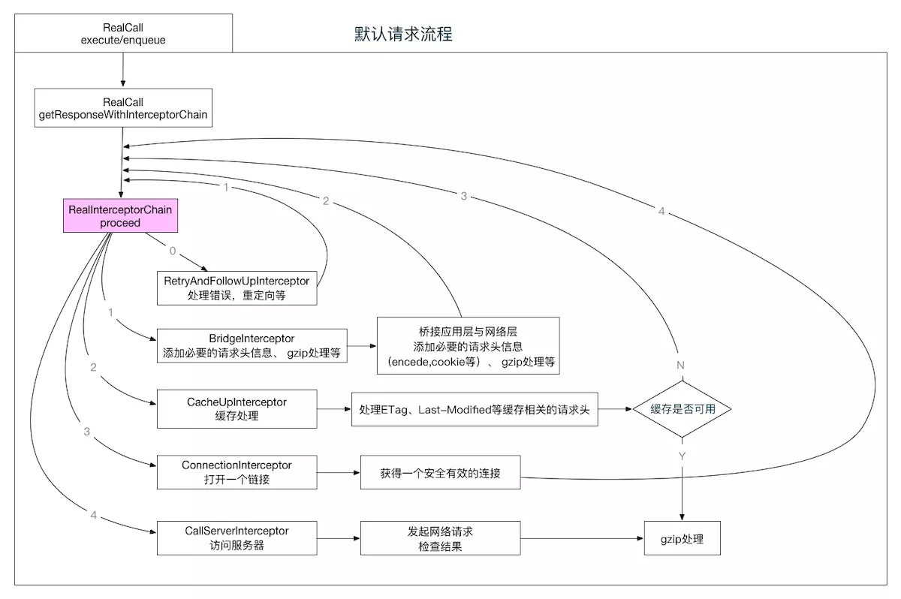
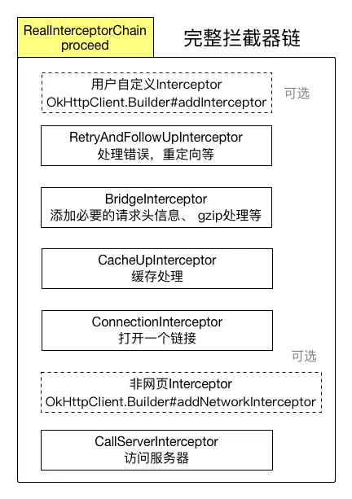
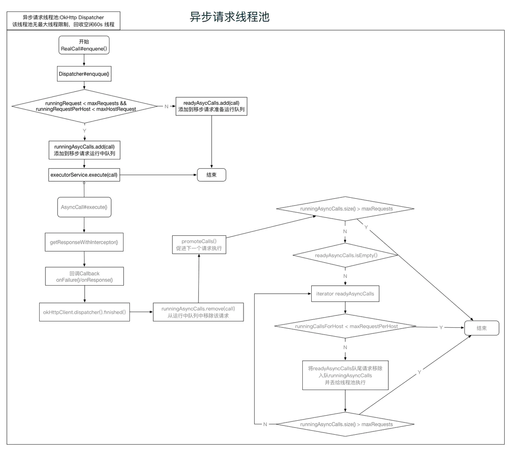
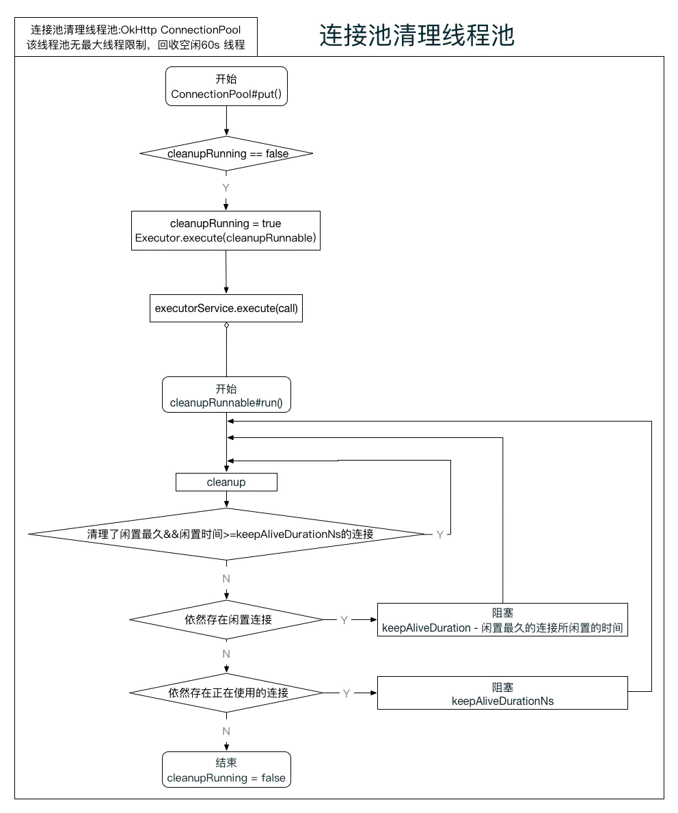

# OkHttp3架构分析

在OkHttp3中，其灵活性很大程度上体现在，可以intercept其任意一个环节，而这个优势便是okhttp3整个请求响应架构体系的精髓所在:




Okhttp请求流程

- 在OkHttp3中，每一个请求任务都封装为一个Call，其实现为RealCall。
- 而所有的策略几乎都可以通过OkHttpClient传入
- 所有全局策略与数据，除了存储在允许上层访问的OkHttpClient实例以外，还有一部分是存储在只允许包可见的Internal.instance中（如连接池、路由黑名单等)
- OkHttp中用户可传入的interceptor分为两类，一类是全局interceptor，该类interceptor在请求开始之前最早被调用，另外一类为非网页请求的networkInterceptor，这类interceptor只有在非网页请求中会被调用，并且是在组装完成请求之后，真正发起请求之前被调用(这块具体可以参看RealCall#getResponseWithInterceptorChain()方法)
- 整个请求过程通过RealInterceptorChain#proceed来连接，在每个interceptor中调用下一个interceptor来完成整个请求流程，并且在回到当前interceptor后完成响应处理
- 在异步请求中，我们通过Callback来获得简单清晰的请求回调(onFailure、onResponse)
- 在OkHttpClient中，我们可以传入EventListener的工厂方法，为每一个请求创建一个EventListener，来接收非常细的事件回调




完整interceptor-chain

## OkHttp3中的线程池

`OkHttp` 中的对所有的任务采用 `NamedRunnable`，约束每个执行单元给出对应的业务名称，以便于线程维护。

## 1.异步请求线程池-OkHttp Dispatcher


```java
  public synchronized ExecutorService executorService() {
    if (executorService == null) {
      executorService = new ThreadPoolExecutor(0, Integer.MAX_VALUE, 60, TimeUnit.SECONDS,
          new SynchronousQueue<Runnable>(), Util.threadFactory("OkHttp Dispatcher", false));
    }
    return executorService;
  }
```

- 该线程池与Android下的 `Executors.newCachedThreadPool()` 比较类似；
- 无任务上限，自动回收闲置60s的线程，适用于大量耗时较短的任务；
- 虽然线程池无任务上限，但是Dispatcher对入口`enqueue()`进行了把关，最大的异步任务数默认是64，同一个主机默认是5，当然这两个默认值是可以修改的，Dispatcher提供的修改接口；


```css
okHttpClient.dispatcher().setMaxRequests(128);
okHttpClient.dispatcher().setMaxRequestsPerHost(10);
```

- 通过两个双端队列来维护准备执行的任务和正在执行的任务：`Deque<AsyncCall> readyAsyncCalls`, `Deque<AsyncCall> runningAsyncCalls`；
- 在每个任务结束时，都会检查 `readyAsyncCalls` 是否有任务，在条件满足的情况下，按照先进先出的原则将任务移动到 `runningAsyncCalls`中，并在线程池中执行；



异步请求线程池

## 2.连接池清理线程池-OkHttp ConnectionPool


```dart
/**
* Background threads are used to cleanup expired connections. There will be at most a single
* thread running per connection pool. The thread pool executor permits the pool itself to be
* garbage collected.
*/
private static final Executor executor = new ThreadPoolExecutor(0 /* corePoolSize */,
    Integer.MAX_VALUE /* maximumPoolSize */, 60L /* keepAliveTime */, TimeUnit.SECONDS,
    new SynchronousQueue<Runnable>(), Util.threadFactory("OkHttp ConnectionPool", true));
```

- 该线程池用来清理长时间闲置的和泄漏的连接；
- 该线程池本身无任务上限，线程闲置60s自动回收；
- 虽然任务无上限，但其通过 `cleanupRunning` 标记来控制只有一个线程在运行，当连接池中没有连接后才会被重新设置为 `false`;


```csharp
void put(RealConnection connection) {
    assert (Thread.holdsLock(this));
    if (!cleanupRunning) {
        cleanupRunning = true;
        executor.execute(cleanupRunnable);
    }
    connections.add(connection);
}
```

- 次工作线程会不断地清理，当清理完一遍后超时连接后，根据当前连接池中最近的下一个空闲超时连接计算出一个阻塞时间并阻塞，直到连接池中没有任何连接才结束，并将 `cleanupRunning` 设为 `false`;
- 在每次有连接加入连接池时，如果当前没有清理任务运行，会加入一个清理任务到到线程池中执行;


```csharp
void put(RealConnection connection) {
    assert (Thread.holdsLock(this));
    if (!cleanupRunning) {
        cleanupRunning = true;
        executor.execute(cleanupRunnable);
    }
    connections.add(connection);
  }
```



连接池清理线程池

## 3. 缓存整理线程池-OkHttp DiskLruCache


```cpp
// Use a single background thread to evict entries.
Executor executor = new ThreadPoolExecutor(0, 1, 60L, TimeUnit.SECONDS,
    new LinkedBlockingQueue<Runnable>(), Util.threadFactory("OkHttp DiskLruCache", true));
```

- 该线程池用于整理本地请求缓存数据；
- 缓存的整理包含: 达到阀值大小的文件，删除最近最少使用的记录，在有关操作达到一定数量以后对记录进行重建；
- 最大运行线程数1，无需考虑线程安全问题，自动回收闲置60s的线程；

## 4. HTTP2异步事务线程池-OkHttp Http2Connection

- HTTP2采用了多路复用，因此需要维护连接有效性，本线程池就是用于维护相关的各类HTTP2事务;
- 线程池本身无任务上限，自动回收闲置60s的线程;
- 每一个HTTP2连接都有这么一个线程池存在;

相关阅读

- [1.Okhttp的基本使用](https://www.jianshu.com/p/da4a806e599b)
- [2.Okhttp主流程源码分析](https://www.jianshu.com/p/b0353ed71151)
- [3.Okhttp3架构分析，主要通过一些流程图类展现](https://www.jianshu.com/p/9deec36f2759)

