# 深入理解 Android（三）：Xposed 详解

url：https://www.infoq.cn/article/android-in-depth-xposed

**编者按**：随着移动设备硬件能力的提升，Android 系统开放的特质开始显现，各种开发的奇技淫巧、黑科技不断涌现，InfoQ 特联合《深入理解 Android》系列图书作者邓凡平，开设[深入理解Android ](http://www.infoq.com/cn/android-in-depth)专栏，探索Android 从框架到应用开发的奥秘。

*Xposed*，大名鼎鼎得 Xposed，是 Android 平台上最负盛名的一个框架。在这个框架下，我们可以加载很多插件 App，这些插件 App 可以直接或间接操纵系统层面的东西，比如操纵一些本来只对系统厂商才 open 的功能（实际上是因为 Android 系统很多 API 是不公开的，而第三方 APP 又没有权限）。有了 _Xposed_ 后，理论上我们的插件 APP 可以 hook 到系统任意一个 Java 进程（zygote，systemserver，systemui 好不啦！）。

功能太强大，自然也有缺点。Xposed 不仅仅是一个插件加载功能，而是它从根上 Hook 了 Android Java 虚拟机，所以它需要 root，所以每次为它启用新插件 APP 都需要重新启动。而如果仅是一个插件加载模块的话，当前有很多开源的插件加载模块，就没这么复杂了。

Anyway，Xposed 强大，我们可以学习其中的精髓，并且可以把它的思想和技术用到自己的插件加载模块里。这就是我们要学习 Xposed 的意义。

Xposed 支持 32 位和 64 位的 dalvik 以及 ART，同时支持 selinux。我仔细看了下，如果拓展把这些东西都讲的话，一个是很枯燥，另外一个是背离了我们本章讲解插件的主线。所以，本章将围绕下面几个点开展介绍：

l 32 位 dalvik 上非 selinux 模式下的 xposed 实现原理

64 位、selinux 模式其实难度不在虚拟机上，而是在 selinux 上。

## 二、 初识 Xposed

本章先来介绍下 Xposed，这是一个大工程，包含多个项目，我也是花了不少时间才把它整个玩转起来的。Xposed 包含如下几个工程：

- [XposedInstaller ](https://github.com/rovo89/XposedInstaller)，这是 Xposed 的插件管理和功能控制 APP，也就是说 Xposed 整体管控功能就是由这个 APP 来完成的，它包括启用 Xposed 插件功能，下载和启用指定插件 APP，还可以禁用 Xposed 插件功能等。注意，这个 app 要正常无误得运行必须能拿到 root 权限。
- [Xposed ](https://github.com/rovo89/Xposed)，这个项目属于 Xposed 框架，其实它就是单独搞了一套 xposed 版的 zygote。这个 zygote 会替换系统原生的 zygote。所以，它需要由 XposedInstaller 在 root 之后放到 /system/bin 下。
- [XposedBridge ](https://github.com/rovo89/XposedBridge)。这个项目也是 Xposed 框架，它属于 Xposed 框架的 Java 部分，编译出来是一个 XposedBridge.jar 包。
- [XposedTools ](https://github.com/rovo89/XposedTools)。Xposed 和 XposedBridge 编译依赖于 Android 源码，而且还有一些定制化的东西。所以 XposedTools 就是用来帮助我们编译 _Xposed_ 和 _XposedBridge_ 的。

提示，提示，提示：

我把所有相关代码都下载并放到下面的地址了：

[https://code.csdn.net/Innost/xposed-learning ](https://code.csdn.net/Innost/xposed-learning)里边包含：

1 xposed 所有代码库的内容

2 XposedDemo：Xposed 插件 APP Demo，非常简单

3 XposedDemoTarget：XposedDemo 将 hook 上的目标 App

### 2.1 编译 Xposed

下面介绍下如何编译 Xposed，这里以 Android 4.4.4 为例。做 Android 开发最好配一个 Nexus 手机或 Pad。我用得是 Nexus 7 2013Wi-Fi 版。Anyway，Xposed 的编译和具体机器无关，不过下面的前提条件需要满足：

- 准备 Android 4.4.4 源码。我分享了很多[ AOSP 源码](http://blog.csdn.net/innost/article/details/43342087)，注意：我提供的源码没有.repo 和.git，虽然省了很多空间，不过在编译 Xposed 的时候，还是需要有.repo。
- [下载](https://code.csdn.net/Innost/xposed-learning)我提供的 Xposed 源码和测试 Demo。

好，马上开始我们的步骤：

#### 2.1.1 下载支持库

根据 XposedTools 的说明，我们先要修改下 AOSP 源码里的.repo，具体步骤如下：

- 进入 AOSP/.repo 目录。
- 在.repo 目录下新建 local_manifests 目录。
- 把 XposedTools/local_manifests/ 下的目标文件拷贝过去。local_manifests/ 目录下是各种 API 版本（即 SDK=19,21 之类）对应的 xml 文件。由于本例对应的 SDK 版本是 19，所以需要把该目录下 xposed_sdk19.xml 文件拷贝到.repo/local_manifests/ 目录下。

这个文件是什么内容呢？来看图 1：

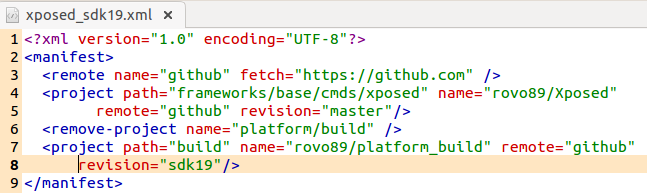

这个文件内容是啥意思呢？

- ：新添远程仓库地址为 github。
- 第一个 __：为 frameworks/base/cmds/ 下新增加[ _xposed_ 工程](https://github.com/rovo89/Xposed)。当然，这个工程我们刚才下载过了。你可以直接 copy 到指定目录下。
- ：移除 AOSP/build 目录。xposed 有自己的处理。
- 第二个 __：下载 xposed 自己的 build。*path=“build”*，表示下载路径就是 AOSP/build。

配置好后，请在 AOSP 目录下执行 repo sync。这样它会根据 manifests 更新 AOSP 源码。当然，也可以只是下载 frameworks/base/cmds/xposed 工程和更新 build 工程。

注意，repo sync 是一个重型操作，会导致所有工程都进行一次同步。我建议的方法是直接下载和更新对应的工程

比如，下载 xposed 工程，用 repo sync frameworks/base/cmds/xposed 即可。对于 build 目录，先把原来的 build 挪到其他地方。然后 repo sync build 即可。

好了，到此，所有源码都已经 ready 了。

#### 2.1.2 修改 build.conf

下面我们进入 XposedTools 目录，然后修改其中的 build.conf 文件。该文件用于指示 AOSP 源码等参数。如图 2 所示：

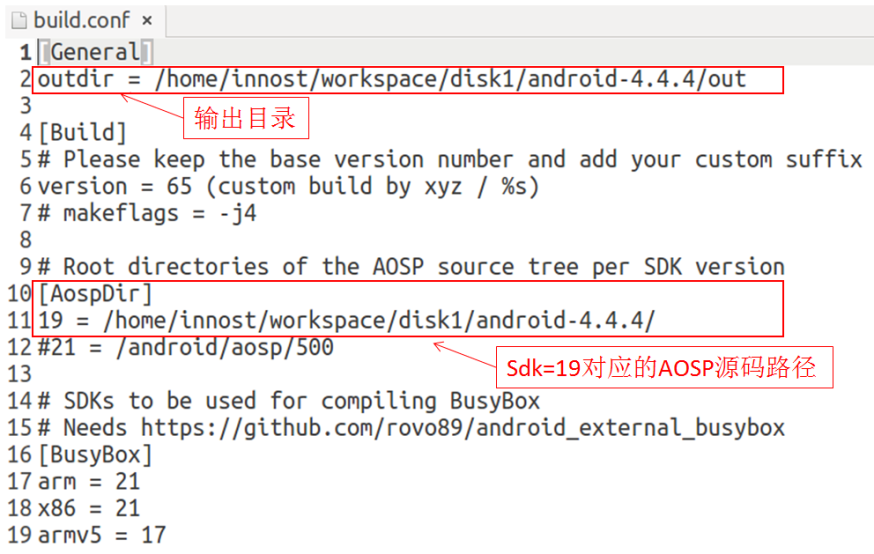

XposdTools 提供了一个 _build.conf.sample_ 模板，图 2 中的 _build.conf_ 文件是在这个模板基础上修改而来。红框中是我修改的结果。其他选项没有变化。

#### 2.1.3 执行 build.pl

到 XposedTools 目录下，执行：_./build.pl -t arm:19_ 命令，这表明我要编译 arm 平台上 SDK=19 版本的 xposed 框架。注意，./build.pl --help 会打印出使用方法。_build.pl_ 是一个 perl 脚本。图 3 是编译过程截图：

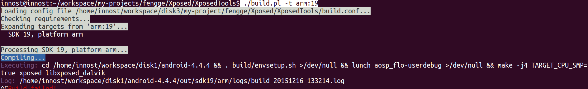

图 3 中，你可以发现 build.pl 跑到 AOSP 源码目录下，执行了：

- *. build/envsetup.sh*：初始化 AOSP 编译环境
- *lunch aosp_flo-userdebug*：选择交叉编译平台。注意，这一块我是修改了 XposedTools/xposed.pom，使它单独为我的 nexus 7 编译，而不是针对 ARM 平台做 generic 的编译。
- *make -j4 xposed libxposed_dalvik*：编译 xposed 和 libxposed_dalvik 这两个目标文件。

在使用 build.pl 时，它还依赖一些 Perl 的类库，请童鞋们按照下面步骤下载这些依赖库：

sudo apt-get install libconfig-inifiles-perl

sudo apt-get install libio-all-perl

sudo apt-get install libfile-readbackwards-perl

sudo apt-get install libfile-tail-perl

sudo apt-get install libtie-ixhash-perl

build.pl 执行过程中，如果报还有其他依赖库未找到，请通过下面命令

apt-cache search perl XXX 来查找需要 apt-get install 哪个目标库。XXX 是 build.pl 执行过程中报错时提供的库信息

#### 2.1.4 编译结果

编译完成后，将产生一个 zip 包到 AOSP/out/sdk19/arm 下。AOSP/out 是我在 build.conf 中指定的目录。如图 4 所示：

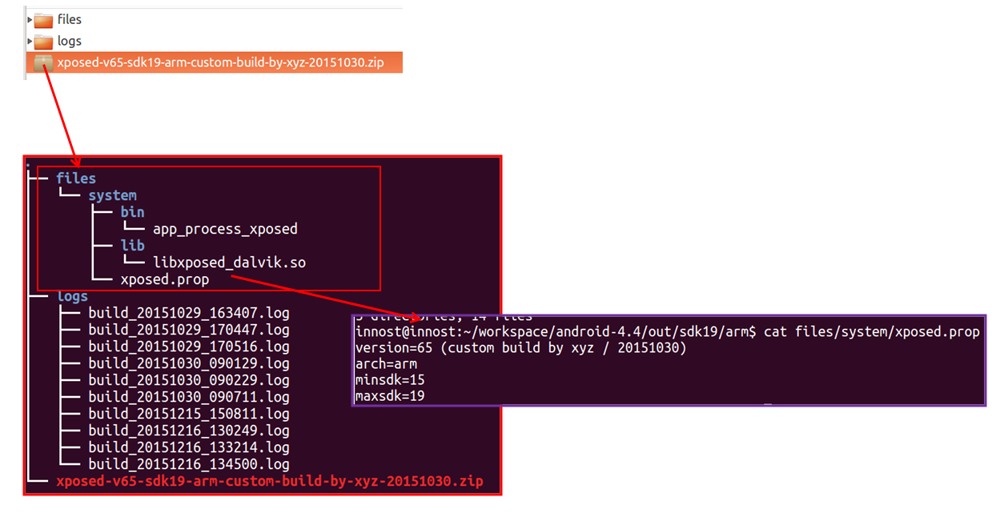

编译结果是一个 _xposed-v65-arm-custom-build-xyz-20151030.zip_ 包，这个包可以通过 recovery 刷到手机上。包的内容就是 files 文件夹下的内容，包含：

- *system/bin/app_process_xposed*：xposed 版 zygote。
- *system/bin/libxposed_dalvik.so*：xposed 框架的 native 层。
- *system/xposed.prop*：xposed 框架信息，包含版本号等。内容如右边图所示。

## 三、 XposedInstaller

XposedInstaller 是 Xposed 的 App，用于管理 Xposed 框架和插件 App。本节我们主要讨论它是如何安装 Xposed 框架和插件 App 的。

XposedInstaller 启动界面如图 5 所示：

图 5 中可知 XposedInstaller 提供好几项子页面。第一个“框架”用来安装或卸载 Xposed 框架的。我们来看它。

### 3.1 安装 Xposed 框架

如图 6 所示：

注意，图 6 右上角的“程序自带”两个版本号，分别是 app_process 版本号为 58，XposedBridge.jar 版本号是 54.

而“激活”这两项为空，因为我们的系统还没有安装 Xposed 框架。

“程序自带”是什么意思？原来，XposedInstaller 在自己的 assets 目录下携带了所需要的 xposed 框架程序和模块，如图 7 所示：

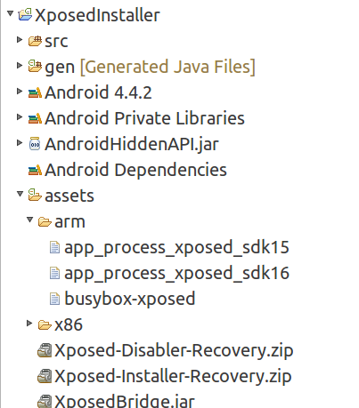

从图 7 可知，XposdInstaller 自带了 xposed 版 zyote(比如 app_process_xposed_sdk16)，为了更好得支持不同版本的 Android，它还区分了 SDK 版本。另外，XposedInstaller 也支持刷机包把 xposed 框架模块刷入系统，比如 _Xposed-Installer-Recovery.zip_，里边包含的主要内容就是一个脚本，在 recovery 模式下运行，其内部也是把 assets 里的文件拷贝到 _/system_ 相关目录中。这一块我们后续看代码就知道怎么玩儿了。

安装 Xposed 框架的主要功能由 _InstallerFragment.java_ 提供，我们看看相关代码。

#### 3.1.1 onCreateView

onCreateView 函数是 Fragment 里初始化 UI 的核心回调，其代码如图 8 所示：

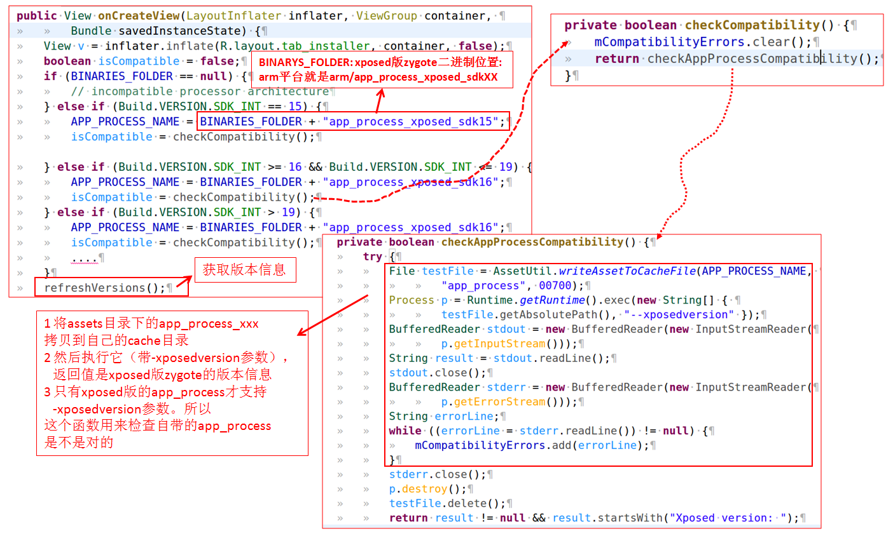

图 8 代码中最后的 refreshVersions 用于获取版本号，也就是图 6 中右上角“程序自带”要显示的信息，它包括两个东西：

- xposed 版 app_process 的版本，包括程序自带（也就是 XposedInstaller 放在 assets 目录下的）和系统安装的。当然，只有该系统安装过 Xposed 版 app_process 才有必要检查它的版本。图 6 中由于没有装过，所以“激活”那一栏显示为“-”。
- XposedBridge.jar：也包括程序自带和系统已安装两个 jar 包的版本。

检查版本主要是为了兼容性考虑。代码中的 refreshVersions 用于获取他们的版本号，代码如图 9 所示：

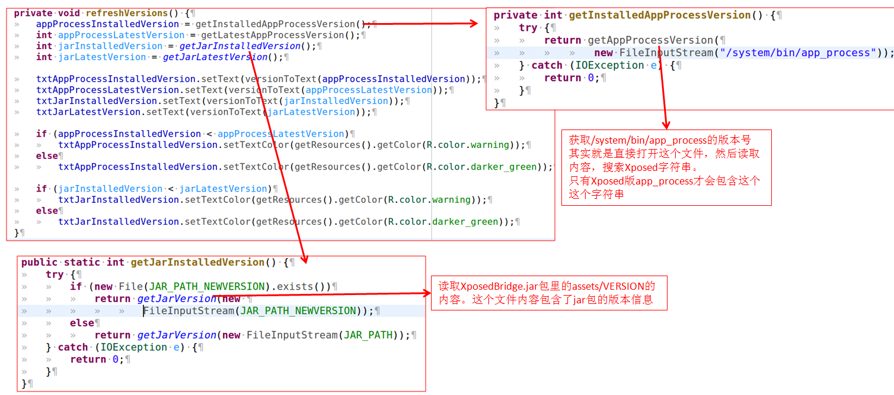

图 9 中：

- *getInstalledAppProcessVersion*：读取 _/system/bin/app_process_ 的版本号。
- *getLatestAppProcessVersion*：读取自带 _app_process_sdkXX_ 的版本号。
- *getJarInstalledVersion*，读取 _/data/data/de.robv.android.xposed.installer/bin/ XposedBridge.jar_ 版本号。对，你没看错，_XposedBridge.jar_ 是放在 XposedInstaller 自己的目录下的。
- *getJarLatestVersion*：读取自带 XposedBridge.jar 的版本号。

想知道怎么获取版本系想你吗？来看图 10：

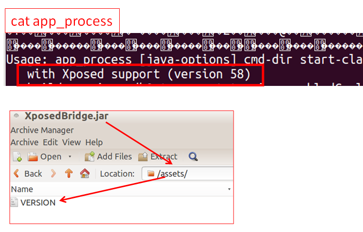

- 对于 _app_process_，直接读取文件内容，然后找到红框中的那一行，后面的 _58_ 就是版本号。
- 对于 _XposedBrdige.jar_，打开这个 jar 包，读取 _assets/VERSION_ 的内容，里边就是存储了一个版本号信息。

太简单了，不惜得说。

注意 XposedBridge.jar 包安装版的位置，它在 /data/data/de.robv.android.xposed.installer/bin/XposedBridge.jar 里

#### 3.1.2 安装 xposed 框架

InstallerFragment 的 install 函数用于安装 xposed 框架相关的模块。这个函数一点也不复杂，不过还是给大家看看。如图 11 所示：

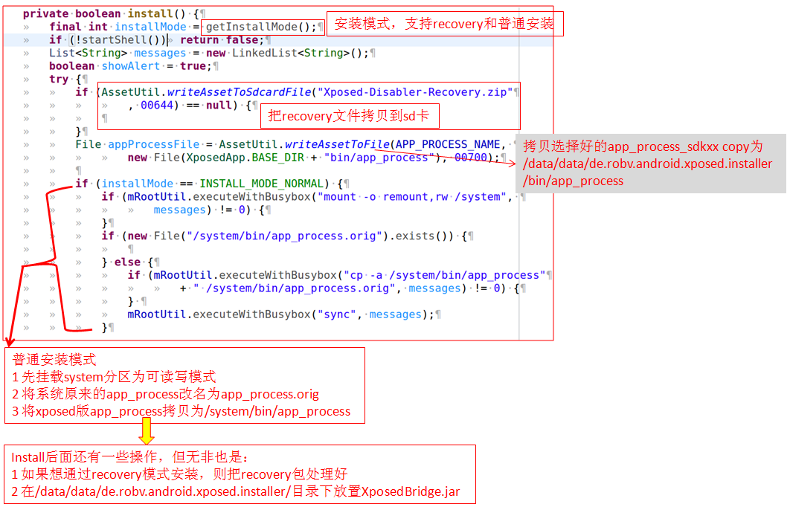

install 函数没什么难度，但是我们要总结下 xposed 框架安装到底做了什么手脚：

- 将 xposed 版的 app_process 拷贝到 _/system/bin/_，系统原来的 app_process 改名为 app_process.orig
- 将 XposedBridge.jar 放到 _/data/data/de.robv.android.xposed.installer_ 下
- 删除 _/data/data/de.robv.android.xposed.installer/conf/disabled_ 文件。如果有 disabled 文件则表明整个 Xposed 功能被禁止使用。

嗯嗯，也没什么太多可说的。

#### 3.1.3 安装 xposed 插件

xposed 插件，在 xposed 世界里我们说它是插件，但是放到 Android 世界里它就是一种特殊的 APP。这种类型的 APP 由 xposed 框架识别并加载，然后 hook 到其他的 App 进程。

当然，这里既然提到进程，那么这些 APP 就必须要被先启动起来才是。

XposedInstaller 的插件管控由 ModulesFragment 界面来处理。本节主要想介绍下 XposedInstaller 是怎么对待 Xposed 插件 APP 的。

来看代码，如图 12 所示：

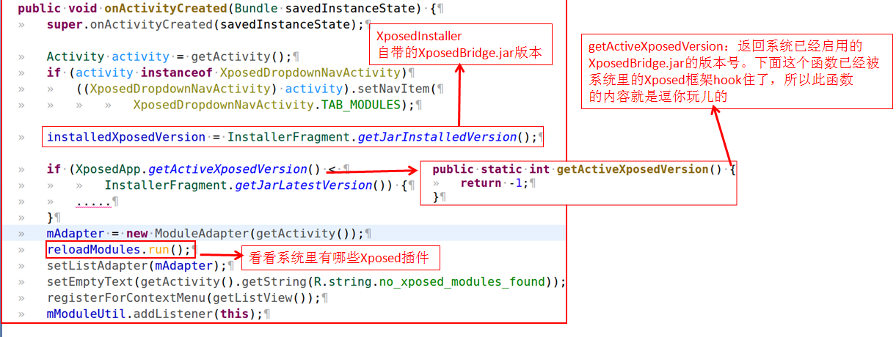

我们重点来看看 Xposed 插件 APP 是怎么被 load 的，代码其实在 ModuleUtil 的 reloadInstalledModules 函数中。代码很简单如图 13 所示：

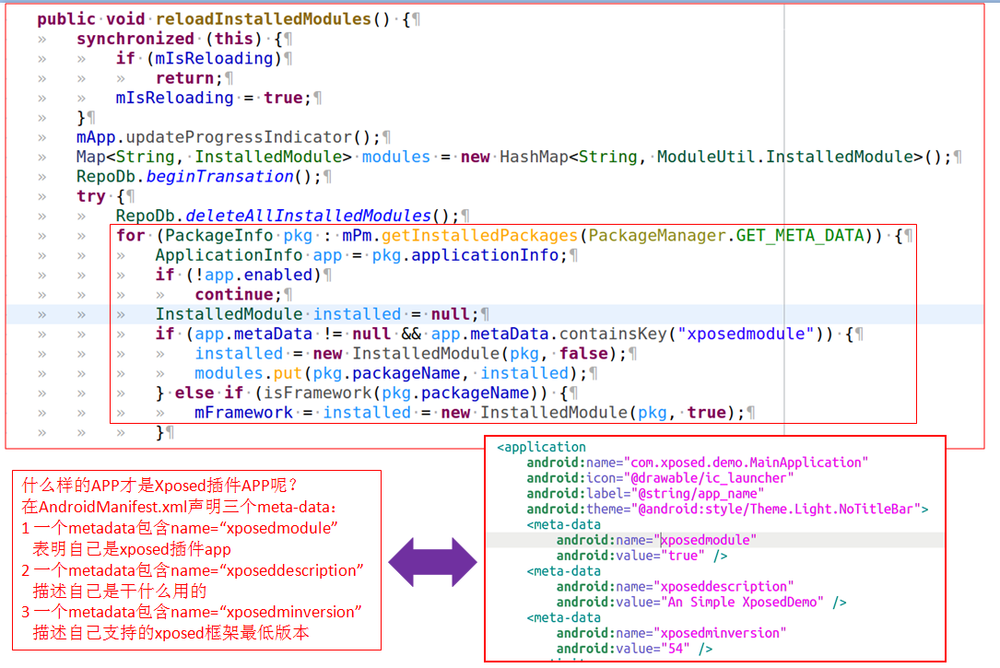

图 13 左下角已经告诉各位 Xposed 插件 APP 该是什么样的了，右下角是 XposedDemo 示例。

在 AndroidManifest.xml 里定义这些东西只是告诉 Xposed 自己是一个插件 APP。但是作为一个挂钩插件，Xposed 还需要知道这个 APP 里哪个类是用来挂钩的。这句话的意思是：

1 这个 APP 是一个插件 APP。该 APP 包含很多功能。

2 这个 APP 包含的众多功能中，有一个功能是给目标进程挂钩。挂钩操作是 Xposed 框架来做的，所以它需要知道该 APP 中哪个类是继承了 Xposed 钩子接口。这样，Xposed 框架找到插件 APP 之后会触发这个 app 的钩子接口进行挂钩。

要做到第二步就得在 assets/ 下放一个名叫 xposed_init 文件，里边指明插件 APP 的挂钩类名。XposedDemo 的

assets/xposed_init 的内容就是：com.xposed.demo.MyXposedModule。当然，这个插件类必须实现 Xposed 的 IXposedHookLoadPackage 接口类。这个我们以后再讨论。

## 四、 Xposed 框架介绍

Xposed 框架分为 xposed 版 app_process 和 XposedBridge.jar 两部分。app_process 就是 zygote，我们先看看 xposed 版的 zygote 干了些什么。

### 4.1 Xposed 版 zygote

注意，本章只分析 32 位，dalvik 版的 xposed app_process，其入口 main 函数位于 app_main.cpp 里。

图 14 所示的代码展示了 Xposed 版 zygote 与众不同之处。

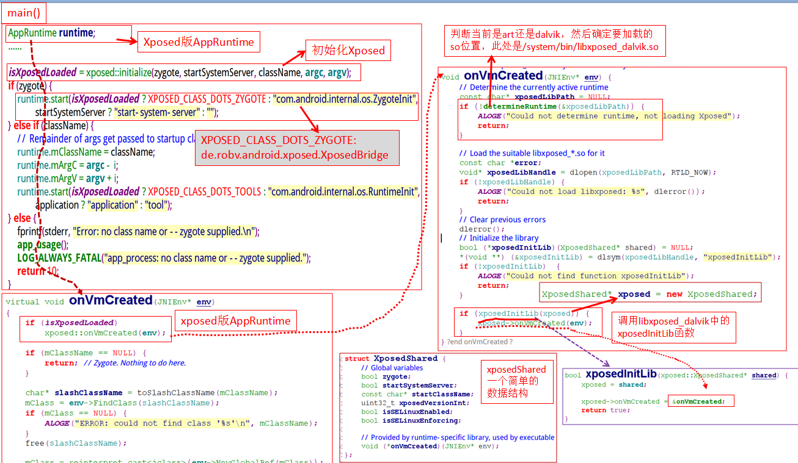

图 14 中，左上角的框是 app_main 的 main 函数，里边有两处不同之处：

- *AppRuntime*：此处的 AppRuntime 类是 xposed 版的 AppRuntime。它的与众不同之处从左下图的 _onVmCreated_ 开始。当检查到 _isXposedLoaded_ 为真是时，将调用 _xposed::onVmCreated_ 函数。
- *xposed::onVmCreated_ 函数位于右上框，它先判断当前虚拟机是 ART 还是 dalvik，然后加载 xposed 一个特殊 so，此处是*/system/bin/libxposed_dalvik.so_。注意，这里的 xposed 框架和 XposedInstaller 略有区别。因为 XposedInstaller 比较旧了（也就支持 sdk 16 的样子），还没有涉及到 ART 和 dalvik 的区别。在 onVmCreate 中，它将调用 _libxposed_dalvik.so_ 中的 xposedInitLib 函数，然后再调用 so 中设置的 onVmCreated 函数。这个 _onVmCreated_ 函数由 _xposedInitLib_ 设置。
- 左上框中还有一个 _xposed:initialized_ 函数。这个函数初始化了 _XposedShared_ 类型的全局变量 xposed，同时还把一个重要的 jar 包加到了 CLASSPATH 里。来看代码。如图 15 所示：

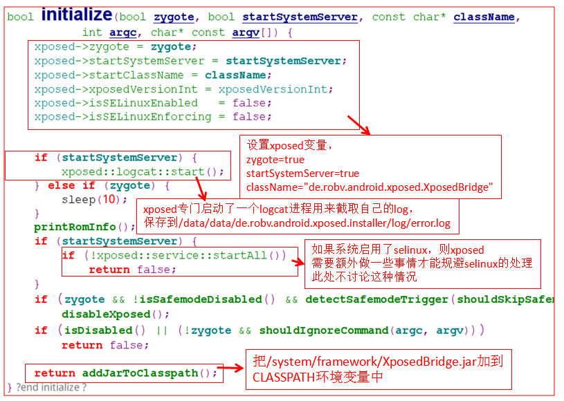

图 9 展示了 initialize 函数的内容，主要是最后一个把 _/system/bin/XposedBridge.jar_（这个 jar 包的位置和我们在 XposedInstaller 那里看到得不同，原因前面解释过了）加到 _CLASSPATH_ 比较重要。

注意，我们这里虽然对 initialize 介绍的内容很少，但实际上这个函数要真正看明白还是很需要技术实力的：

1 logcat:start：里边 fork 了 logcat 进程用来存储 xposed 自己的 log

2 service:startAll：为了完美支持 selinux，这里的处理更是很有技巧。selinux 是一个完整的知识体系，想彻底掌握它的童鞋请参考我的三部曲文章[《深入理解SELinux SEAndroid》](http://blog.csdn.net/innost/article/details/19299937)

1&2 其实很真实得反映出 xposed 的作者在 Android、Linux 上水平很高，经验很丰富。

最后，如果 xposed 框架启用成功，那么 zygote 的入口类将由以前的 _com.android.internal.os.ZygoteInit_ 变成 _de.robv.android.xposed.XposedBridge_。

下面我们按照执行流程，把相关函数分析一遍：

- AppRuntime 的 _onVmCreated_，它最终会导致 libxposed_dalvik.so 中的 _onVmCreated_ 被调用。我们直接分析最后这个 _onVmCreated_。
- 然后 AppRuntime 里会调用 _de.robv.android.xposed.XposedBridge.main_ 函数。

### 4.2 onVmCreated

图 16 为代码：

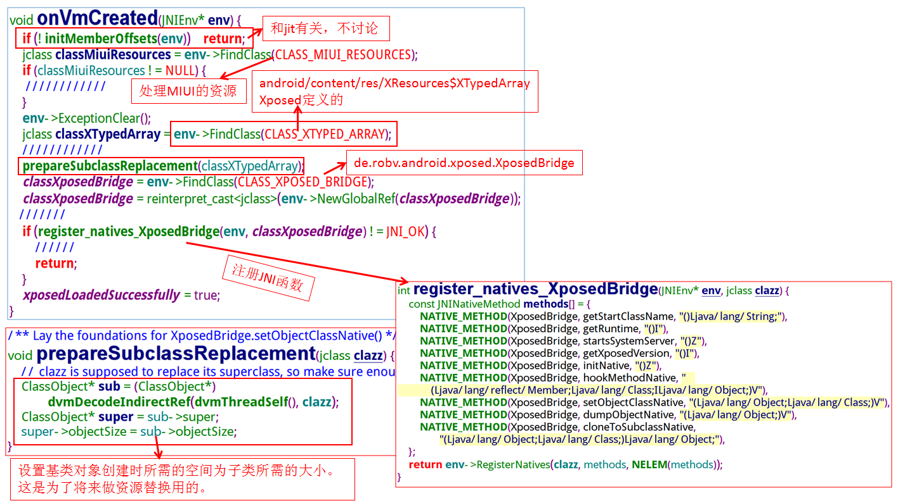

onVmCreated 比较简单了：

- 针对 _android/content/res/XResource&XTypedArray_ 进行了一些处理，这是为将来资源替换时候做准备。以后我们碰到再说。
- 为 _XposedBridge_ 注册 JNI 函数

xposed 官方说 MIUI 大量用了 xposed 的东西，并且不共享，以后碰到 MIUI 的问题他们不再支持。Don’t know what to say…

### 4.3 XposdBridge.main 函数

main 函数代码如图 17 所示：

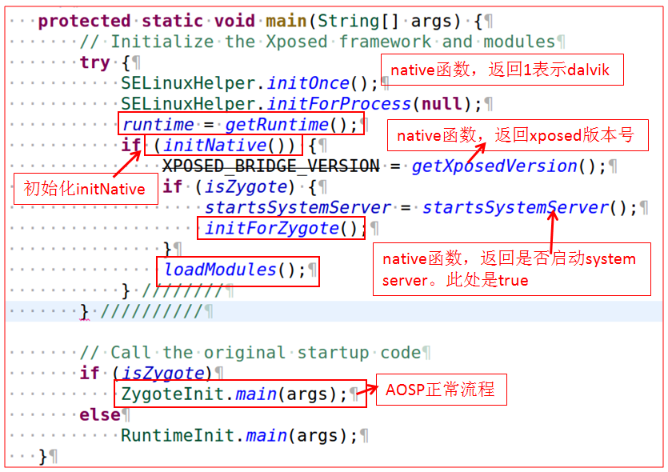

main 函数里有三个重要函数：

- initNative：好好学习下
- initForZygote：好好学习下
- loadModules：加载 App 插件

#### 4.3.1 initNative

initNative 很重要，来看代码，如图 18 所示：

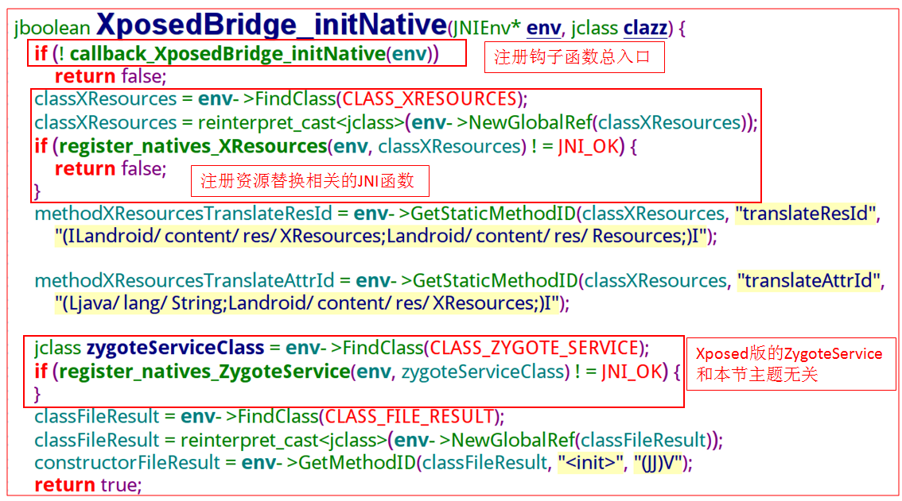

图 18 中，我们重点看一下 _callback_XposedBridge_initNative_ 和 _register_natives_XResources_ 这两个函数。这两个函数比较简单，我们统一放到图 19 中：

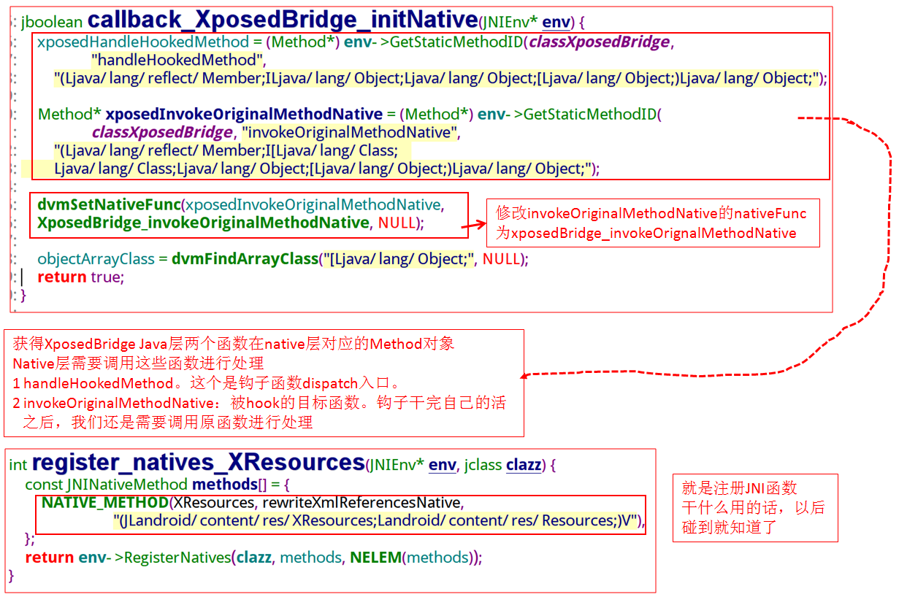

不多说了，没什么难度。

#### 4.3.2 initForZygote

从这个函数开始，xposed 就开始给系统一些关键函数挂钩子了。我们看看它怎么玩儿的。代码如图 20 所示：

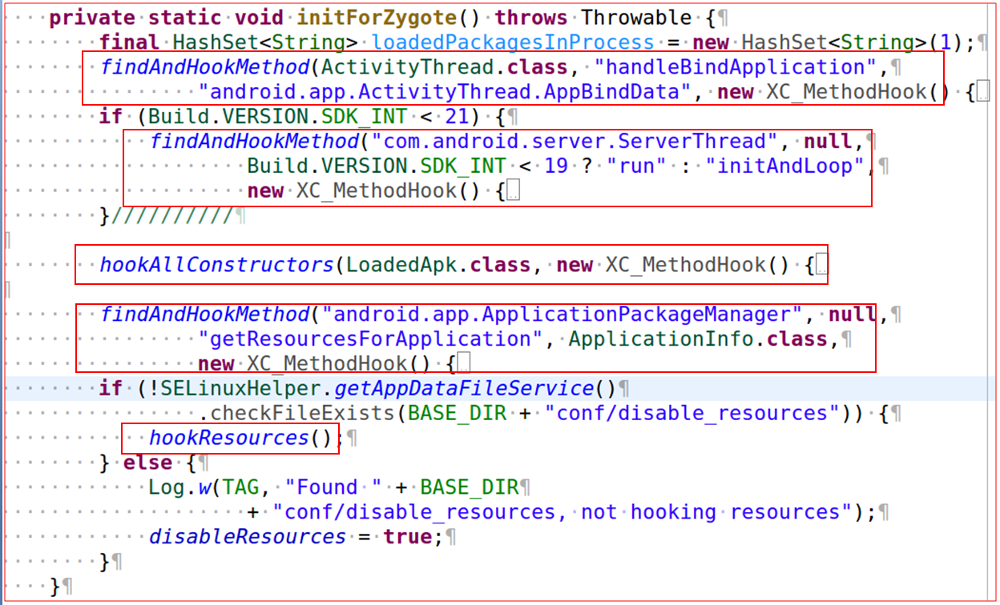

图 20 中我在 eclipse 里用了代码缩略显示的方法，可知一共有五个框，分别 hook 了一些关键内容。我们从上到下一次分析。先来分析下 Xposed 框架提供的挂钩函数 _findAndHookMethod_。

##### （1） findAndHookMethod 介绍

findAndHookMethod 用来对指定类的指定函数进行挂钩。这个函数很重要，开发插件 APP 时用得最多。来看它的代码，如图 21 所示：

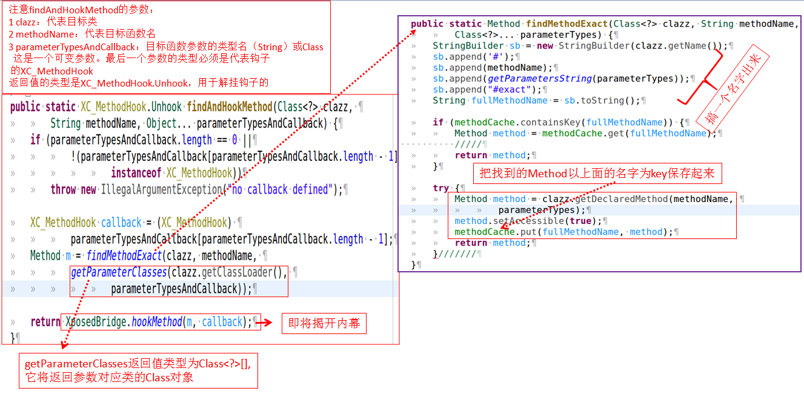

_findAndHookMethod_ 代码 Java 层面的逻辑还是比较好理解的：

- 首先是通过 class 相关的函数找到指定的函数对象。这里的查找需要指定函数所在的类，函数名，函数参数信息等，属于精确（exact）查找。注意，findAndHookMethod 函数的最后一个参数必须是 _XC_MethodHook_ 类型，即钩子对象的数据类型。
- 然后就是 _XposedBridge.hookMethod_。

来看 hookMethod，如图 22 所示：

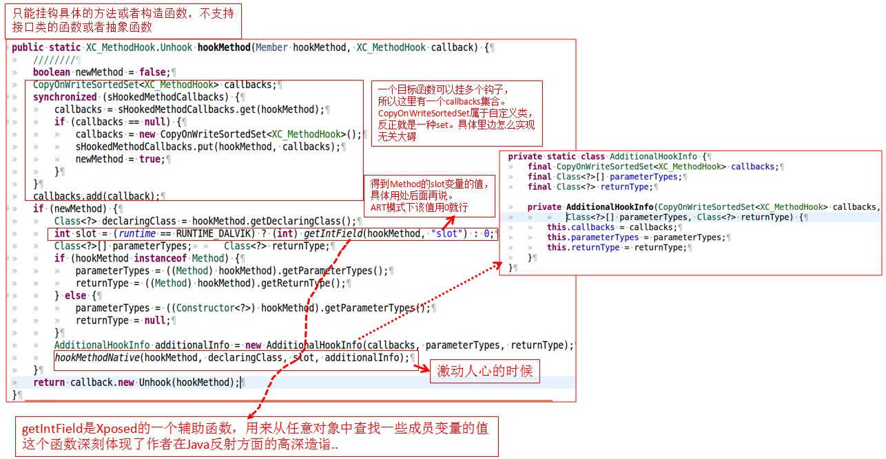

由 _hookMethod_ 可知，一个目标函数可以挂多个钩子，这些钩子由一个集合来存储。然后我们将转到 JNI 层去看看 _hookMethodNative_ 干了什么事情。这才是 hook 的核心。代码如图 23 所示：

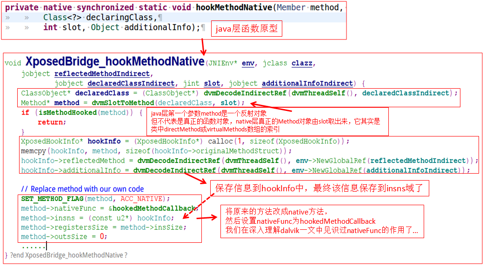

_hookMethodNative_ 完成了真正的挂钩处理，其思想很简单：

- 先找到目标函数在 native 层对应的 Method 对象。
- 修改这个 Method 为 native 方法，并设置 _nativeFunc_ 为 _hookedMethodCallback_ 函数。
- 然后还要保存原函数的一些信息到 _insns_ 域。

我们在[《深入理解Android 之dalvik》](http://blog.csdn.net/innost/article/details/50377905)一文中介绍过，JVM 调用java 函数时候，发现这个函数为native 的话，就调用它的_nativeFunc_。下面我们看看钩子函数的调用。

##### （2） 调用钩子函数

hook 钩子函数后我们就要调用它。上一节我们发现 xposed 在挂钩子的时候会把原函数改造成 native 属性（即 Dalvik 会按 native 函数的方式调用它），对应的 nativeFunc 是 hookedMethodCallback，其代码如图 24 所示：

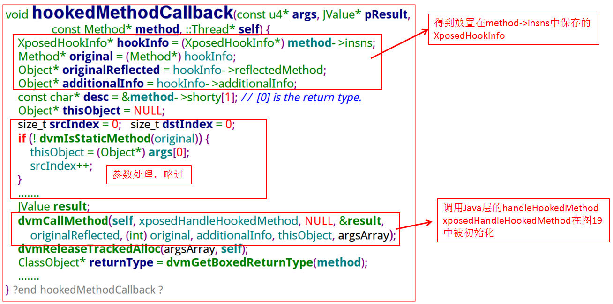

注意喔，我们现在已经在处理被挂钩函数的调用了喔…从 JNI 会进入到 java 层的钩子函数 dispatch 总入口，及 _handleHookedMethod_，这个函数比较复杂，我们一段一段来看它。

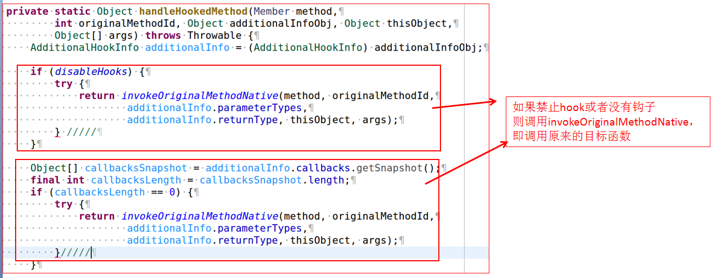

很简单。接着看第二段，如图 26 所示：

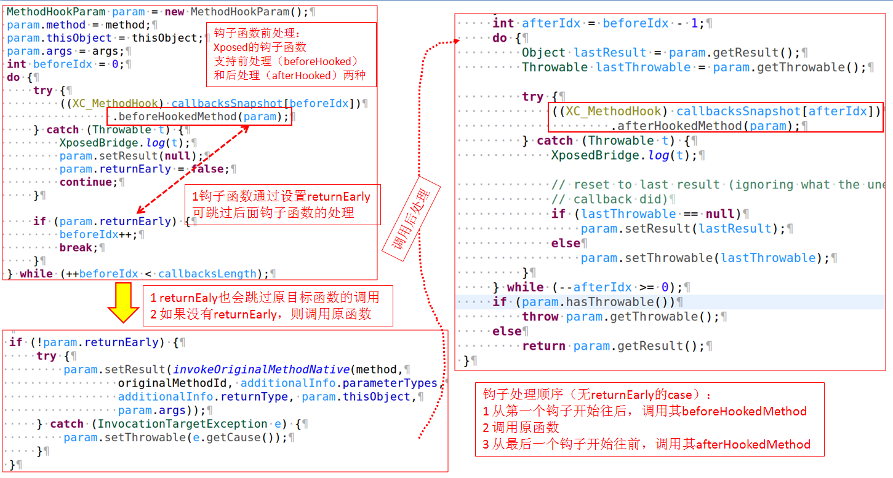

貌似也很简单喔…

现在来看原目标函数的调用，即 _invokeOriginalMethodNative_。代码如图 27 所示：

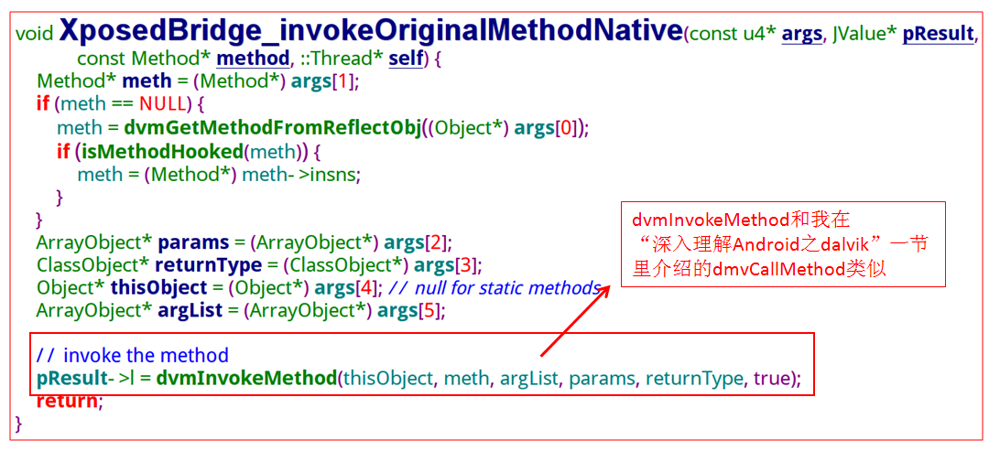

同样很容易，不多说了。到此，我们已经看到了 Xposed 挂钩的所有过程。好像也没什么复杂的，只要对 dalvik 稍微属性点，应该是比较容易做的。

当然，本文只是给大家 show 了主要流程，真要自己动手做，我觉得难点在于参数传递等方面。anyway，了解了大体流程，后面的事情也好办，多尝试几次就好。

下面我们回过头来看 initForZygote 里加的几个钩子都干了什么。

##### （3） initForZygote 钩子设置

图 20 的 initForZygote 代码示意中可知 xposed 对下面几个函数进行 hook（此处先不讨论钩子函数干了什么）

- *ActivityThread.handleBindApplication*：这个函数是 _ActivityManagerService_ 内部调用 _ActivityThread.bindApplication_ 间接触发的。该函数的详情可参考《深入理解 Android 卷 2》第六章[深入理解 ActivityManagerService ](http://blog.csdn.net/innost/article/details/47254381)的“ApplicationThread 的 bindApplication 分析”一节。_handleBindApplication_ 主要工作是初始化 APP（APP 由 zygote 进程 fork 而来，在 _hanldeBindApplication_ 之前，这个 APP 进程和 zygote 没什么区别。只有调用完 _handleBindApplication_ 之后，这个 APP 进程才是 APP, 比如该进程有了对应的名字，Aplication 对象被创建等）。
- *com.android.server.ServerThread.* _initAndLoop_ 函数：这个函数是给 system_server 用的，用于启动系统各种重要服务。
- *LoadedApk__ 构造函数*：通过 _hookAllConstructors_ 来对 LoadedApk 各种构造函数进行挂钩。LoadedApk 是 APK 文件在 APP 里的代表对象，里边有很多重要的信息。
- *android.app.ApplicationPackageManager. getResourcesForApplication*：挂钩 PackageManager 的资源获取函数。
- *hookResources*：对资源进行 hook。这一块由于涉及到 android APP 对资源的管控，以后有机会我们再详细介绍。

#### 4.3.3 loadModules

main 函数在 initForZygote 之后的下一个动作就是 loadModules，这就是加载所有的插件 APP。我们来看看这个函数，代码如图 28 所示：

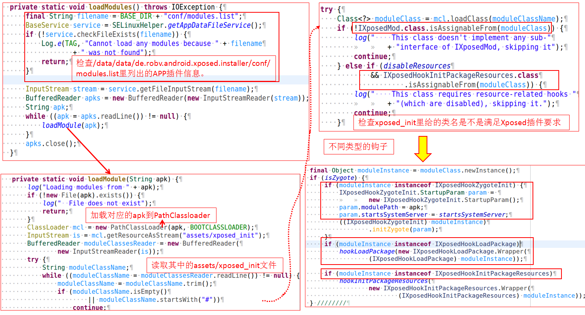

我们来看下 loadModules 的处理：

- 先从 _XposedInstaller_ 那获取当前已经安装（并启用）的插件 APP 列表，然后调用 loadModule 来加载这个 APP。
- _loadModule_ 从 APP 的 _assets/xposed_init_ 文件里看看这个 apk 里声明了哪些钩子类。
- loadModule 校验这些钩子类是不是符合 Xposed 定义的钩子类类型，然后作对应处理。图 29 列出了 Xposed 支持的钩子类类型。

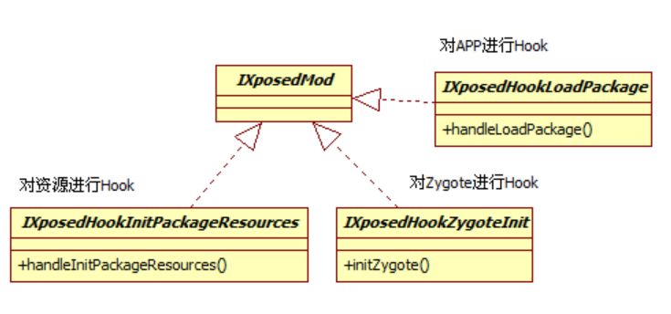

图 30 展示了 _hookLoadPackage_ 和 _hookInitPackageResource_ 两个函数的内容，特别简单。

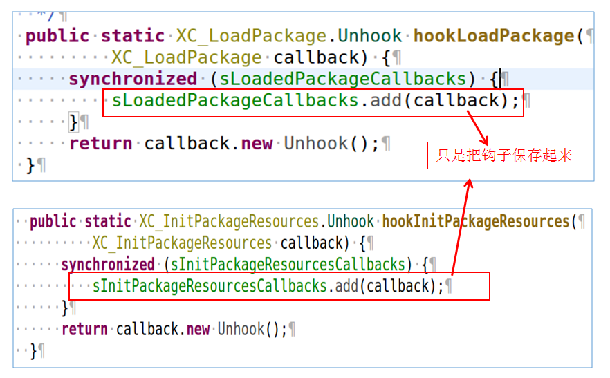

嗯嗯，就是把对应的钩子函数保存起来先。

好了，下面我们就来开始分析 initForZygote 里挂上的几个钩子分别有什么用。

#### 4.3.4 handleBindApplication 钩子

initForZygote 为 hanldeBindApplication 设置了前处理钩子，代码如图 31 所示：

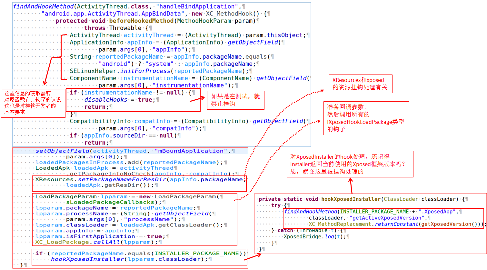

前面说过，在 APP 生命周期内，_handleBindApplication_ 是 APP 刚准备好相关信息的一个重要点，在这个点去进行挂钩处理简直是最好不过了。当然，此处的挂钩处理也就是准备好这个 APP 的相关信息然后调用所有的 _IXposedHookLoadPackage_ 类型的钩子。

注意，除了 _handleBindApplication_ 之外，由于一个 APP 进程事实上可以加载多个 APK（比如那些申明同样的 uid 和运行在同一进程的 APP），在 _LoadedApk_ 的构造函数中也做了类似的处理

IXposedHookLoadPackage 钩子一般会干些什么呢？图 31 对 XposedInstaller 的处理就很明显了。一般而言，这种钩子会对目标 APP 中感兴趣的函数进行挂钩（调用 findAndHookMethod），比如 XposedInstaller 对 getActiveXposedVersion 进行了挂钩，用于返回系统里正在使用的 Xposed 框架版本。

我们应该在钩子函数里干些什么？这是一个重要问题。我也不废话了，直接上 XposedDemo 的源码，如图 32 所示：

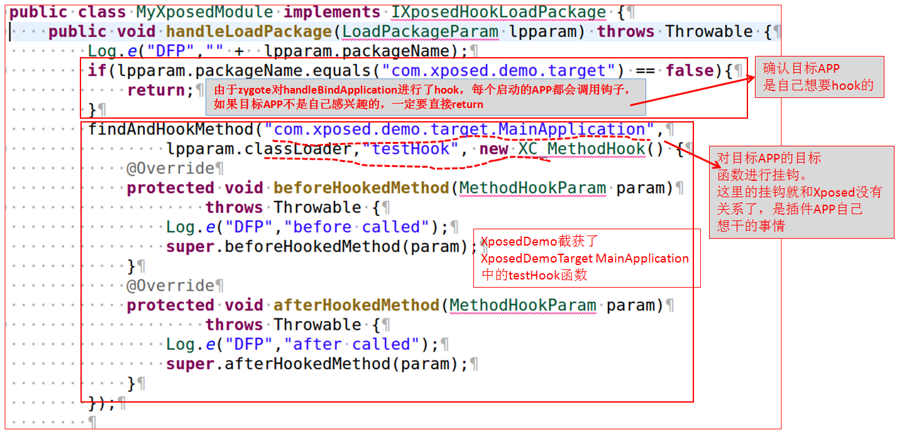

图 32 是我在 xposed-learning 项目中提供的 XposedDemo 示例，可知：

- Xposed 框架对 handleBindApplication 进行 hook 后，当有 APP 启动的时候，该框架就会调用所有 IXposedHookLoadPackage 类型的钩子。
- 这种钩子一定要区分当前被 hook 的 APP 是不是自己想要 Hook 的 APP。如果不是，请直接 return。如果是自己的目标 APP，则进一步通过 findAndHookMethod 进行挂钩。

简单点说，我们在 IXposedHookLoadPackage 的 handleLoadPackage 中把该挂的钩子都挂上就好。

#### 4.3.5 initAndLoop 钩子

initAndLoop 是 system_server 进程的关键函数，在这个函数里 Android Framework 的绝大部分 Service 都将被创建。真是艺高人胆大，这个进程居然都提供了挂钩处理。其代码如图 33 所示：

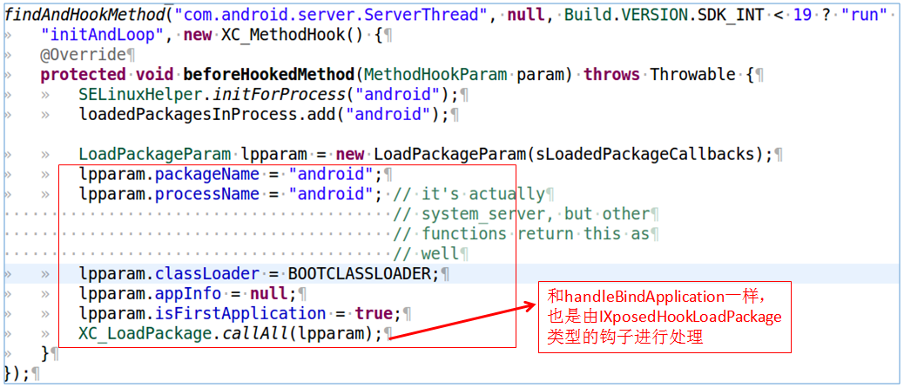

代码倒是很简单，无非是针对 system_server 进行 hook。插件函数如果想区分被 hook 的进程是否为 system_server 的话，只需要判断 packageName 是否为"android"即可。

再次强调，system_server 是 Android Java 层 Framework 的核心，要 hook 它需要万分小心，否则或导致手机系统出现会各种不稳定，崩溃，重启等情况。

下面我们介绍下 Xposed 框架对资源是怎么 Hook 的。

### 4.4 对资源的 Hook

前面章节介绍了 Xposed 框架如何对代码调用逻辑进行 hook。在 Android APP 中，除了代码逻辑外，Xposed 还支持对资源进行 Hook。对资源 Hook 的原理其实和对代码调用进行 Hook 的原理类似。这里我们简单介绍下 Xposed 框架如何对资源进行 Hook。

在 Android APP 中，资源有三个重要类：

- *ResourcesManager*：一个 APP 进程有一个 _ResourcesManager_。一个 _ResourcesManager_ 可以管理多个 Resouces。
- *Resources*：Resources 是一个 APK 中资源的代表，注意，它不是指单独的一种类型的资源（比如字符串，图片等），它是一个 APK 文件中资源文件的代表。*Resources_ 对象有一个 _AssetManager*，_AssetManager_ 能操作 APK 文件（其实就是一个压缩包）assets 以及 res 目录里的内容。
- _Resources_ 通过 _ResourcesKey_ 将自己保存到 ResourceManager 中的一个 ArrayMap 里。
- 对于资源挂钩来说，Xposed 框架及插件 APP 做如下几件重要的事情：
- 和 _handleBindApplication_ 类似，在 APP 进程某个时间点的时候（猜测：初始化资源相关模块）进行 Hook，然后调用 IXposedHookInitPackageResources 类型的钩子。
- _IXposedHookInitPackageResources_ 类型的钩子通过 Xposed 提供的 _XResources_ 类的 setReplacement 对原有的资源进行替换。在 Xposed 框架中，_XResources_ 是用于替代 _Resources_ 的。
- App 运行时候，Xposed 框架截获相关的资源获取函数（比如 Context 的 getString），先看看是否被 replace 了，如果是，则返回被 replace 的结果。

就这么简单。我们一步一步来看。

注意，XposedDemo 并没有 hook 资源，请感兴趣的童鞋们自行加上该功能进行测试。

#### 4.4.1 hookResource

hookResource 对 ResourceManager 等进行了挂钩处理。来看代码，如图 34 所示：

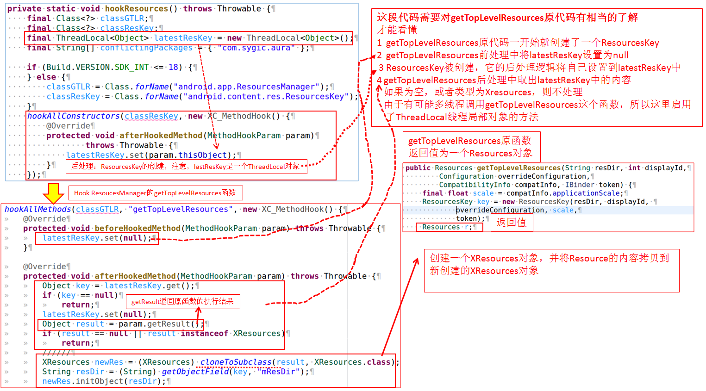

hookResources 主要是对 ResourcesManager 的 getTopLevelResources 进行了 Hook。APP 中原来使用的是 Resources 代表资源，Hook 之后，Xposed 用 XResources 代替了 Resources。图 35 展示了 XResources 的派生关系。

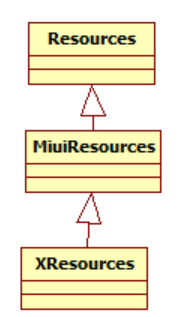

接着看 hookResources 第二段代码，如图 36 所示：

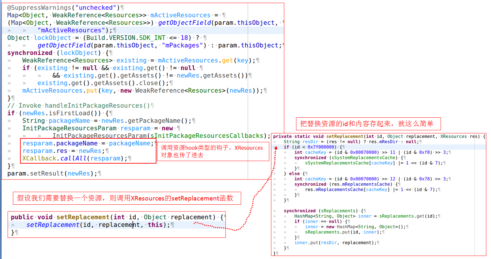

第二段代码中，Xposed 资源 Hook 框架调用了资源 hook 类型的钩子。同样，我们需要关注在这种类型的钩子里插件 APP 要干得事情，那就是：

- 通过 XResources 的 setReplacement 函数将目标资源的 id 和内容进行替换。

上面替换的还是 APP 自己的资源，除此之外，Xposed 还能替换系统资源（即 framework-res.apk 里声明的资源），这部分代码也在 hookResources 里，来看图 37：

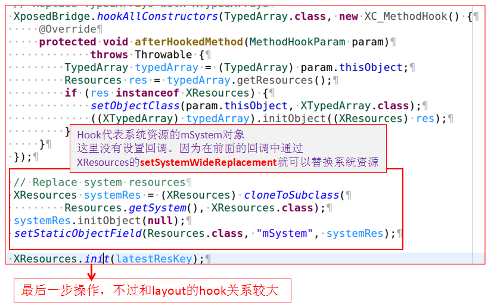

图 37 中，Xposed 将 Resources 里代表系统资源的 _mSystem_ 对象也进行了替换。不过这里没有独立调用回调。没关系，因为在第二部分的回调中，插件 APP 通过 _XResources_ 的 _setSystemWideReplacement_ 可以对系统资源进行替换。

注意，hookResources 之后，APP 里调用的 Resources 相关的函数就全部转到 XResources 来处理了。比如获取字符串的 getString 函数，其最终会调用到 XResources 的 getText 函数，代码如图 38 所示：

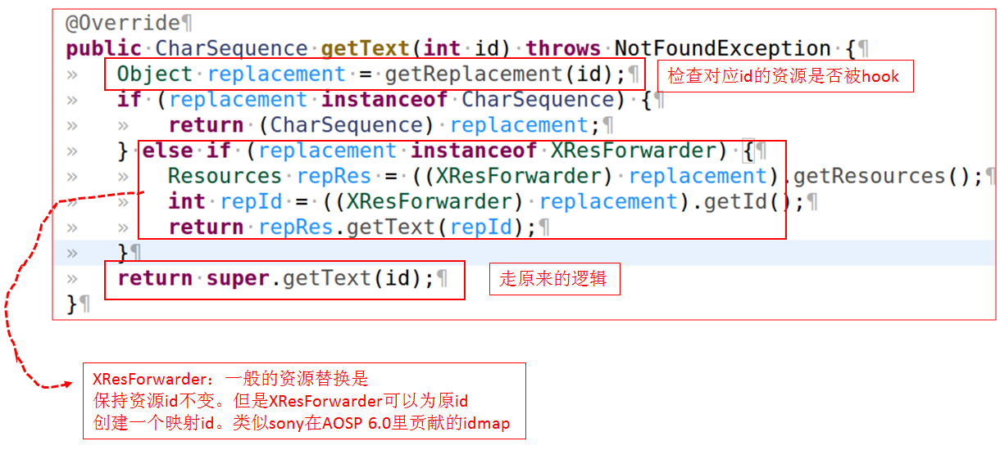

到此，我们对 Xposed 框架如何 hook 资源进行了介绍。不过，layout 资源的 hook 我这里并没有介绍，请童鞋们阅读 XResources 的 getLayout 函数和 init 函数。

## 五、 总结

到此 Xposed 32 位 dalvik 版框架基本介绍完了。这一趟绝对不是本篇这 20 多页文章这么轻松的事情。正如我在《深入理解 Android 之 Dalvik》一文写得那样，我是在研究 xposed 的时候，发现必须要搞清楚 dalvik，所以才先写了 dalvik 的文章，然后才能走到今天这一步。

Xposed 是一个成熟框架，高度体现了开发者在 Java 虚拟机这块有着非常深厚的知识积累。同时，如果加上 selinux 的话，那开发者对 linux 系统也是相当相当熟悉。另外，貌似开发者是用业余时间搞出来的，这在当下上班时间强制为 996 的码农而言几乎是不可能的事情。

再次向开发者致敬，也同时呼吁基于 xposed 框架的派生框架开发者遵守相关开源协议。