# 深入理解 Android（二）：Java 虚拟机 Dalvik

url：https://www.infoq.cn/article/android-in-depth-dalvik

**编者按**：随着移动设备硬件能力的提升，Android 系统开放的特质开始显现，各种开发的奇技淫巧、黑科技不断涌现，InfoQ 特联合《深入理解 Android》系列图书作者邓凡平，开设[深入理解 Android ](http://www.infoq.com/cn/android-in-depth)专栏，探索 Android 从框架到应用开发的奥秘。

## 一、背景

这个选题很大，但并不是一开始就有这么高大上的追求。最初之时，只是源于对 Xposed 的好奇。Xposed 几乎是定制 ROM 的神器软件技术架构或者说方法了。它到底是怎么实现呢？我本意就是想搞明白 Xposed 的实现原理，但随着代码研究的深入，我发现如果不了解虚拟机的实现，而仅简单停留在 Xposed 的调用流程之上，那真是对 Xposed 最大的不敬了。另外，歪果仁为什么能写出 Xposed？Android 上的 Java 虚拟机对他们来说应该也是相对陌生的，何以他们能做而我们没有人搞出这样的东西？

所以，在研究 Xposed 之后，我决定把虚拟机方面的东西也来研究一番。诚如我在很多场合中提到的关于 Android 学习的三个终极问题（其实对其他各科学习也适用）：学什么？怎么学？学到什么程度为止？关于这三个问题，以本次研究的情况来看，回答如下：

- 学习目标是：按顺序是 dalvik 虚拟机，然后是 Xposed 针对 dalvik 的实现，然后是 art 虚拟机。
- 学习方法：VM 原理配合具体实现，以代码为主。Java VM 有一套规范，各公司具体的 VM 实现必须遵守此规范。所以对 VM 学习而言，规范很重要，它是不变的，而代码实现只不过是该规范的一种实现罢了。这里也直接体现了我提出的关于专业知识学习的一句警语“基于 Android，高于 Android”。对 VM 而言，先掌握规范才是最最重要和核心的事情。
- 学到什么程度为止：对于 dalvik 虚拟机，我们以学会一段 Java 程序从代码，到字节码，最后到如何被 VM 加载并运行它为止。关于 dalvik 的内存管理我们不会介绍。对于 XPosed，基于 dalvik+selinux 环境的代码我们会全部分析。对于 ART，由于它是 Google 未来较长一段时期的重点，所以我们也会围绕它做更多的分析，诸如内存管理怕是肯定会加上的。

除了这三个问题，其实还有一个隐含的疑问，学完之后有什么用呢？

- 这个问题的答案要看各位的需求了。从本人角度来看，我就是想知道 Xposed 是怎么实现的。另外，如果了解虚拟机实现的话，我还想定制它，使得它在智能 POS 领域变得更安全一点。
- 当然，我自己有一个比较高大上的梦想，就是我一直想写 Linux Kernel 方面的书，而且我自认为已经找到了一个绝妙的学习它的入手点（我在魅族做分享的时候介绍过。到今天为止一年多过去了，不知道当初的有心人是否借此脱引而出，如果有的话也请和大家分享下你的学习经历）。Anyway，从目前的工作环境和需求来看，VM 是当前更好的学习目标。

言归正传，现在开始正式介绍 dalvik，请牢记关于它的学习目标和学习程度。

你也可以下载本专题对应的[ demo 代码](https://code.csdn.net/Innost/javavmtest)用于学习。

## 二、Class、dex、odex 文件结构

### 2.1 Class 文件结构总览

Class 文件是理解 Vm 实现的关键。关于 Class 文件的结构，这里介绍的内容直接参考 JVM 规范，因为它是最权威的资料。

Oracle 的 JVM SE7 官方规范：[ https://docs.oracle.com/javase/specs/jvms/se7/html/](https://docs.oracle.com/javase/specs/jvms/se7/html/)

还算很有良心，纯网页版的，也可以下载 PDF 版。另外，周志明老师曾经翻译过中文版的 JVM 规范，网上可搜索到。

作为分析 Class 文件的入口，我在 Demo 示例中提供了一个特别简单的例子，代码如图 1 所示：

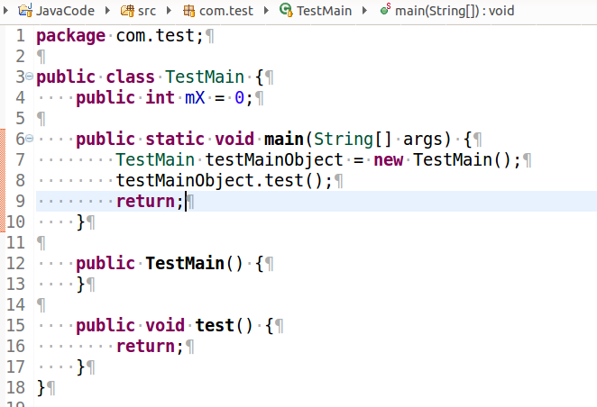

TestMain 类的代码简单到不行，此处也不拟多说，因为没有特殊之处。

当我们用 eclipse 编译这个类后，将得到 bin/com/test/TestMain.class。这个 TestMain.class 就是我们要分析的 Class 文件了。

Class 文件到底是什么东西？我觉得一种通俗易懂的解释就是：

1. *.java 文件是人编写的，给人看的。
2. *.class 是通过工具处理 *.java 文件后的产物，它是给 VM 看的，给 VM 操作的

在某种哲学意义上看，java 源文件和处理得到的 class 文件是同一种东西…

那么，这个给 VM 使用的 class 文件，其内部结构是怎样的呢？Jvm 规范很聪明，它通过一个 C 的数据结构表达了 class 文件结构。这个数据结构如图 2 所示：


请大家务必驻足停留片刻，因为搞清楚图 2 的内容对后续的学习非常关键。图 2 的 ClassFile 这个数据结构真得是太容易理解了。相比那些 native 的二进制程序而言，ClassFile 的组织结构和 Java 源码的组织结构匹配度非常高，以致于我第一眼看到这个结构体时，我觉得自己差不多就理解了它：

- 比如，类的是 public 的还是 final 的，还是 interface，就由 access_flags 来表示。其具体取值我觉得都不用管，代码中用得是名字诸如 ACC_XXX 这样得的标志位来表示，一看知道是啥玩意儿。
- Java 类中定义的域（成员变量），方法等都有对应的数据结构来表达，而且还是个数组。
- 唯一有点特别之处的是常量池。什么东西会放在常量池呢？最容易想到的就是字符串了。对头，这个 Java 源码中的类名，方法名，变量名，居然都是以字符串形式存储在常量池中。所以，图 2 中的 this_class 和 super_class 分别指向两个字符串，代表本类的名字和基类的名字。这两个字符串存储在常量池中，所以 this_class 和 super_class 的类型都是 u2（索引，代表长度为 2 个字节）。

Class 文件用 javap 工具可以很好得解析成图 2 那样的格式，我这里替大家解析了一把，结果如图 3 所示（先显示部分内容）：

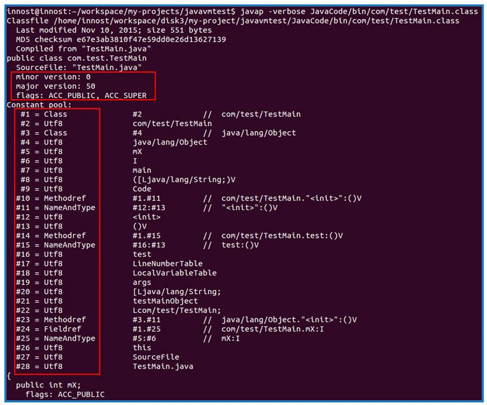

注意，解析方法为：javap -verbose xxxx.class

先来看看常量池。

#### **2.1.1 常量池介绍**

常量池看起来陌生，其实简单得要死。注意，count_pool_count 是常量池数组长度 +1。比如，假设某个 Class 文件常量池只有 4 个元素，那么 count_pool_count=5）。

javap 解析 class 文件的时候，常量池的索引从 1 算起,0 默认是给 VM 自己用得, 一般不显示 0 这一项。这也是为什么图 3 中常量池第一个元素以#1 开头。所以，如果 count_pool_count=5 的话，真正有用的元素是从 count_pool[1] 到 count_pool[4]。

常量池数组的元素类型由下面的代码表示：

复制代码

```
cp_info { // 特别注意，这是介绍的 cp_info 是相关元素类型的通用表达。
    u1 tag;   //tag 为 1 个字节长。不论 cp_info 具体是哪种，第一个字节一定代表 tag
    u1 info[]; // 其他信息，长度随 tag 不同而不同
}
{1}
//tag 取值，先列几个简单的：
tag=7 <==info 代表这个 cp_info 是 CONSTANT_Class_info 结构体
tag=9<==info 代表 CONSTANT_Fieldrefs_info 结构体
tag=10<==info 代表 CONSTANT_Methodrefs_info 结构体
tag=8<==info 代表 CONSTANT_String_info 结构体
tag=1<==info 代表 CONSTANT_Utf8_info 结构体
{1}
{1}
```

在 JVM 规范中，真正代表字符串的数据结构是 CONSTANT_Utf8_info 结构体，它的结构如下代码所示：

复制代码

```
CONSTANT_Utf8_info {
    u1 tag;
    u2 length;  // 下面就是存储 UTF8 字符串的地方了
    u1 bytes[length];
}
 
```

大家看图 3 中常量池的内容，比如#2=Utf8 com/test/TestMain 这行表示：

数组第二个元素的类型是 CONSTANT_Utf8_info，字符串为“com/test/TestMain”

下面我们看几个常用的常量池元素类型

##### （1） CONSTANT_Class_info

这个类型是用于描述类信息的，此处的类信息很简单，就是类名（也就是代表类名的字符串）

复制代码

```
CONSTANT_Class_info {
    u1 tag;   //tag 取值为 7，代表 CONSTANT_Class_info
    u2 name_index;  //name_index 表示代表自己类名的字符串信息位于于常量池数组中哪一个，也就是索引
}
```

唉，够懒的，name_index 对应的那个常量池元素必须是 CONSTANT_Utf8_info，也就是字符串。图 3 中的例子，咱们再看看：

\#1 = Class #2 //com/test/TestMain

\#2 = Utf8 com/test/TestMain

这说明：

1. 常量池第一个元素类型为 Class_info，它对应的 name_index 取值为 2，表示使用第 2 个元素
2. 常量池第二个元素类型为 Utf8 内容为“com/test/TestMain”
3. \#1 最后的 // 表示注释，它把第二行的字符串内容直接搬过来，方便我们查看

##### （2） CONSTANT_NameAndType_Info

这个结构也是常量池数据结构中中比较重要的一个，干什么用得呢？恩，它用来描述方法 / 成员名以及类型信息的。有点 JNI 基础的童鞋相信不难明白，在 JNI 中，一个类的成员函数或成员变量都可以由这个类名字符串 + 函数名字符串 + 参数类型字符串 + 返回值类型来确定（如果是成员变量，就是类名字符串 + 变量名字符串 + 类型字符串）来表达。既然是字符串，那么 NameAndType_Info 也就是存储了对应字符串在常量池数组中的索引：

复制代码

```
CONSTANT_NameAndType_info {
   u1 tag;
   u2 name_index;  // 方法名或域名对应的字符串索引
   u2 descriptor_index; // 方法信息（参数 + 返回值），或者成员变量的信息（类型）对应的字符串索引
}
// 还是来看图 3 中的例子吧
#13 = Utf8  ()V
#15 = NameAnType  #16.#13  // 合起来就是 test.()V 函数名是 test，参数和返回值是 ()V
#16=Utf8 test
 
```

太简单了，都不惜得说…，请大家自行解析#25 这个常量池元素的内容，一定要做喔！

注意，对于构造函数和类初始化函数来说，JVM 要求函数名必须是和。当然，这两个函数是编译器生成的。

##### （3） CONSTANT_MethodrefInfo 三兄弟

Methodref_Info 还有两个兄弟，分别是 Fieldref_Info，InterfaceMethodref_Info，他们三用于描述方法、成员变量和接口信息。刚才的 NameAndType_Info 其实已经描述了方法和成员变量信息的一部分，唯一还缺的就是没有地方描述它们属于哪个类。而咱这三兄弟就补全了这些信息。他们三的数据结构如图 4 所示：


如此直白简单，不解释了。不放心的童鞋们请对照图 3 的例子自行玩耍！

常量池先介绍到这，它还有一些有用的信息，不过要等到后面我们碰到具体问题时再分析

#### **2.1.2 Field 和 Method 描述**

刚才在常量池介绍中有提到 Methodref_Info 和 Fieldref_Info，不过这两个 Info 无非是描述了函数或成员变量的名字，参数，类型等信息。但是真正的方法、成员变量信息还包括比如访问权限，注解，源代码位置等。对于方法来说，更重要的还包括其函数功能（即这个函数对应的字节码）。

在 Java VM 中，方法和成员变量的完整描述由如图 5 所示的数据结构来表达的：


- access_flags：描述诸如 final，static，public 这样的访问标志
- name_index：方法或成员变量名在常量池中对应的索引，类型是 Utf8_Info
- attribute_info：是域或方法中很重要的信息。我们单独用一节来介绍它。

#### **2.1.3 attribute_info 介绍**

attribute_info 结构体很简单，如下代码所示：

复制代码

```
attribute_info {// 特别注意，这里描述的 attribute_info 结构体也是具体属性数据结构的通用表达
    u2 attribute_name_index;  //attribute_info 的描述，指向常量池的字符串
    u4 attribute_length;  // 具体的内容由 info 数组描述
    u1 info[attribute_length];
}
 
```

Java VM 规范中，attribute 类型比较多，我们重点介绍几个，先来看代表一个函数实际内容的 Code 属性。

##### （1） Code 属性

代表 Code 属性的数据结构如图 6 所示：

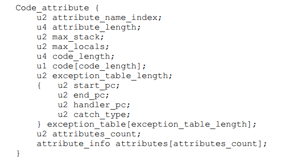

- 前 2 个成员变量就不多说了。属于 attribute 的头 6 个字节，分别指向代表属性名字符串的常量池元素以及后续属性数据的长度。注意，Code 属性的 attribute_name_index 所指向的那个 Utf8 常量池元素对应的字符串内容就是“Code”，大家可参考图 3 的#9。
- max_stack 和 max_locals：虚拟机在执行一个函数的时候，会为它建立一个操作数栈。执行过程中的参数啊，一些计算值啊等都会压入栈中。max_stack 就表示该函数执行时，这个栈的最大深度。这是编译时就能确定的。max_locals 用于描述这个方法最大的栈数和最大的本地变量个数。本地变量个数包括传入的参数。
- code_length 和 code：这个函数编译成 Java 字节码后对应的字节码长度和内容。
- exception_table_length：用来描述该方法对应异常处理的信息。这块我不打算讲了，其实也蛮简单，就是用 start_pc 表示异常处理时候从此方法对应字节码（由 code[] 数组表示）哪个地方开始执行。
- Code 属性本身还能包含一些属性，这是由 attributes_count 和 attributes 数组决定的。

来看个实际例子吧，如图 7 所示（接着图 3 的例子）：

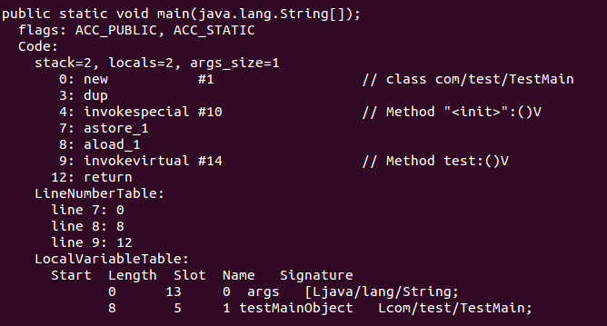

图 7 中：

- stack=2，locals=2，args_size=1。结合代码，main 函数确实有一个参数，而且还有一个本地变量。注意，main 函数是 static 的。如果对于类的非 static 函数，那么 locals 的第 0 个元素代表 this。
- stack 后面接下来的就是 code 数组，也就是这个函数对应的执行代码。0 表示 code[] 的索引位置。0:new：代表这个操作是 new 操作，此操作对应的字节码长度为 3，所以下一个操作对应的字节码从索引 3 开始。
- LineNumberTable 也是属性的一种，用于调试，它将源码和字节码匹配了起来。比如 line 7: 0 这句话代表该函数字节码 0 那一个操作对应代码的第 7 行。
- LocalVariableTable：它也是属性一种，用于调试，它用于描述函数执行时的变量信息。比如图 7 中的 Start = 0：表示从 code[] 第 0 个字节开始，Length = 13 表示到从 start=0 到 start+13 个字节（不包含第 13 个字节，因为 code 数组一共就 12 个字节）这段范围内，这个变量都有效（也就是这个变量的作用域），Slot=0 表示这个变量在本地变量表中第一个元素，还记得前面提到的 locals 吗？，name 为“args”，表示这个参数的名字叫 args，类型（由 Signature 表示）就是 String 数组了。

请大家自行解析图 7 中最后一行，看看能搞明白 LocalVariableTable 的含义不…

另外，Android SDK build Tools 中的 dx 工具 dump class 文件得到的信息更全，大家可以试试。

使用方法是：dx --dump --debug xxx.class。

Class 文件先介绍到这，下面我们来看看 Android 平台上的 dex 文件。

### 2.2 Dex 文件结构和 Odex

#### **2.2.1 dex 文件结构简介**

Android 平台中没有直接使用 Class 文件格式，因为早期的 Anrdroid 手机内存，存储都比较小，而 Class 文件显然有很多可以优化的地方，比如每个 Class 文件都有一个常量池，里边存储了一些字符串。一串内容完全相同的字符串很有可能在不同的 Class 文件的常量池中存在，这就是一个可以优化的地方。当然，Dex 文件结构和 Class 文件结构差异的地方还很多，但是从携带的信息上来看，Dex 和 Class 文件是一致的。所以，你了解了 Class 文件（作为 Java VM 官方 Spec 的标准），Dex 文件结构只不过是一个变种罢了（从学习到什么程度为止的问题来看，如果不是要自己来解析 Dex 文件，或者反编译 / 修改 dex 文件，我觉得大致了解下 Dex 文件结构的情况就可以了）。图 8 所示为 Dex 文件结构的概貌：

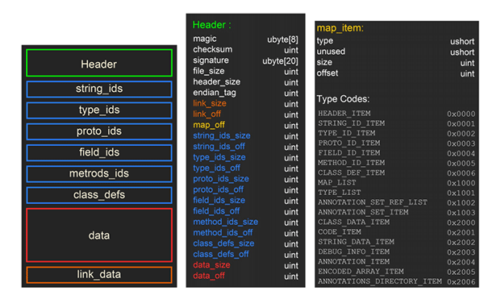

有一点需要说明：传统 Class 文件是一个 Java 源码文件会生成一个.Class 文件，而 Android 是把所有 Class 文件进行合并，优化，然后生成一个最终的 class.dex，如此，多个 Class 文件里如果有重复的字符串，当把它们都放到一个 dex 文件的时候，只要一份就可以了嘛。

dex 头部信息中的 magic 取值为“dex\n035\0”

proto_ids：描述函数原型信息，包括返回值，参数信息。比如“test:()V”

methods_ids：函数信息，包括所属类及对应的 proto 信息。比如

“Lcom.test.TestMain. test:()V”，. 前面是类信息，后面属于 proto 信息

下面我们将示例 TestMain.class 转换成 dex 文件，然后再用 dexdump 工具看看它的结果，如图 9 所示：


具体方法：

- 先将.class 文件转换成 dex 文件，工具是 sdk build-tools 下的 dx 命令。dx --dex --debug --verbose-dump --output=test.dex com/test/TestMain.class，生成 test.dex 文件。
- 同样，利用 build-tools 下的 dexdump 命令查看，dexdump -d -l plain test.dex，得到图 9 的结果

图 9 中的 dexdump 结果其实比图 3 还要清晰易懂。我们重点关注 code 段的内容（图中红框的部分）：

- registers:Dalvik 最初目标是运行在以 ARM 做 CPU 的机器上的，ARM 芯片的一个主要特点是寄存器多。寄存器多的话有好处，就是可以把操作数放在寄存器里，而不是像传统 VM 一样放在栈中。自然，操作寄存器是比操作内存（栈嘛，其实就是一块内存区域）快。registers 变量表示该方法运行过程中会使用多少个寄存器。
- ins：输入参数对应的个数，outs：此函数内部调用其他函数，需要的参数个数。
- insns:size：以 4 字节为单位，代表该函数字节码的长度（类似 Class 文件的 code[] 数组）

Android 官方文档：[ https://source.android.com/devices/tech/dalvik/dex-format.html](https://source.android.com/devices/tech/dalvik/dex-format.html)

说实话，写完这一小节的时候，我又反复看了官方文档还有其他一些参考文档。很痛苦，主要是东西太多，而我们目前又没有实际的问题，所以基本上是一边看一边忘！

恩。至少在这个阶段，先了解到这个程度就好。后面会随着学习的深入，有更多的深入知识，到时候根据需求再加进来。

#### **2.2.2 odex 介绍**

再来看 odex。odex 是 Optimized dex 的简写，也就是优化后的 dex 文件。为什么要优化呢？主要还是为了提高 Dalvik 虚拟机的运行速度。但是 odex 不是简单的、通用的优化，而是在其优化过程中，依赖系统已经编译好的其他模块，简单点说：

- 从 Class 文件到 dex 文件是针对 Android 平台的一种优化，是一种通用的优化。优化过程中，唯一的输入是 Class 文件。
- odex 文件就是 dex 文件具体在某个系统（不同手机，不同手机的 OS，不同版本的 OS 等）上的优化。odex 文件的优化依赖系统上的几个核心模块（由 BOOTCLASSPATH 环境变量给出，一般是 /system/framework/ 下的 jar 包，尤其是 core.jar）。我个人感觉 odex 的优化就好像是把中那些本来需要在执行过程中做的类校验、调用其他类函数时的解析等工作给提前处理了。

图 10 给出了图 1 所示示例代码得到的 test.dex，然后利用 dexopt 得到 test.odex，接着利用 dexdump 得到其内容，最后利用 Beyond Compare 比较这两个文件的差异。

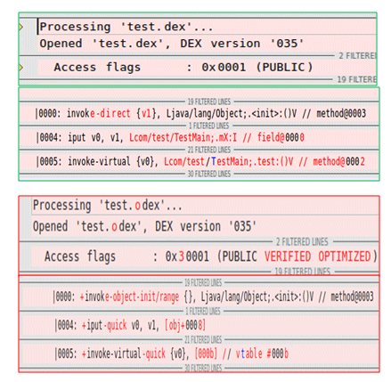

图 10 中，绿色框中是 test.dex 的内容，红色框中是 test.odex 的内容，这也是两个文件的差异内容：

- test.dex 中，TestMain 类仅仅是 PUBLIC 的，但 test.odex 则增加了 VERIFIED 和 OPTIMIZED 两项。VERIFIED 是表示该类被校验过了，至于校验什么东西，以后再说。
- 然后就是一些方法的不同了。优化后的 odex 文件，一些字节码指令变成了 xxx-quick。比如图中最后一句代码对于的字节码中，未优化前 invoke-virtual 指令表示从 method table 指定项（图中是 0002）里找到目标函数，而优化后的 odex 使用了 invoke-virtual-quick 表示从 vtable 中找到目标函数（图中是 000b）。

vtable 是虚表的意思，一般在 OOP 实现中用得很多。vtable 一定比 methodtable 快么？那倒是有可能。我个人猜测：

- method 表应该是每个 dex 文件独有的，即它是基于 dex 文件的。
- 根据 odex 文件的生成方法（后面会讲），我觉得 vtable 恐怕是把 dex 文件及依赖的类（比如 Java 基础类，如 Object 类等）放一起进行了处理，最终得到一张大的 vtable。这个 odex 文件依赖的一些函数都放在 vtable 中。运行时直接调用指定位置的函数就好，不需要再解析了。以上仅是我的猜测。

1 [http://mylifewithandroid.blogspot.com/2009/05/about-quick-method-invocation.html 介绍了 vtable 的生成，大家可以看看](http://mylifewithandroid.blogspot.com/2009/05/about-quick-method-invocation.html介绍了vtable的生成，大家可以看看)

2 [http://pallergabor.uw.hu/androidblog/dalvik_opcodes.html ](http://pallergabor.uw.hu/androidblog/dalvik_opcodes.html)详细描述了 dex/odex 指令的格式，大家有兴趣可以做参考。

##### （1） odex 文件的生成

前面曾经提到过，odex 文件的生成依赖于 BOOTCLASSPATH 提供的系统核心库。以我们这个简单的例子而言，core.jar 是必须的（java 基础类大部分封装在 core.jar 中）。另外，core.jar 对应的 core.odex 文件也需要。所有这些文件我都已经上传到示例代码仓库的 javavmtest/odex-test 目录下。然后执行 dextest.sh 脚本。此脚本内容如下：

复制代码

```
#!/bin/sh
#在根目录下建立 /data/dalvik-cache 目录，这是因为 odex 往往是在机器上生成的，所有这些目录都是
#设备上才有。我们模拟一下罢了
sudo mkdir -p /data/dalvik-cache/
#core.dex 文件名：这也是模拟了机器上的情况。系统将 dex 文件的绝对路径名换成了 @来唯一标示
#一个 dex 文件。由于我在制作 core.dex 的时候，该 core.jar 包放在了 /home/innost/workspace/my-projects/
#javavmtest/odex-test 下，生成的 core.dex 就应该命名为 home@innost@workspace@my-projects@javavmtest@odex-test@core.jar@classes.dex
CORE_TARGET_DEX="home@innost@workspace@my-projects@javavmtest@odex-test@core.jar@"
CURRENT_PATH=`pwd`
#为了减少麻烦，我这里做了一个链接，将需要的 dex 文件链接到此目录下的 core.dex
sudo ln -sf ${CURRENT_PATH}/core.dex /data/dalvik-cache/${CORE_TARGET_DEX}classes.dex
rm test.odex
#设置 BOOTCLASSPATH 变量
export BOOTCLASSPATH=${CURRENT_PATH}/core.jar
/home/innost/workspace/android-4.4.4/out/host/linux-x86/bin/dexopt --preopt ${CURRENT_PATH}/test.jar test.odex "m=y u=n" 
#删掉 /data 目录
sudo rm -rf /data
 
```

odex 文件由 dexopt 生成，这个工具在 SDK 里没有，只能由源码生成。odex 文件的生成有三种方式：

- preopt：即 OEM 厂商（比如手机厂商），在制作镜像的时候，就把那些需要放到镜像文件里的 jar 包，APK 等预先生成对应的 odex 文件，然后再把 classes.dex 文件从 jar 包和 APK 中去掉以节省文件体积。
- installd：当一个 apk 安装的时候，PackageManagerService 会调用 installd 的服务，将 apk 中的 class.dex 进行处理。当然，这种情况下，APK 中的 class.dex 不会被剔除。
- dalvik VM：preopt 是厂商的行为，可做可不做。如果没有做的话，dalvik VM 在加载一个 dex 文件的时候，会先生成 odex。所以，dalvik VM 实际上用得是 odex 文件。以后我们研究 dalvik VM 的时候会看到这部分内容。

实际上 dex 转 odex 是利用了 dalvik vm，里边也会运行 dalvik vm 的相关方法。

### 2.3 小结

本节主要介绍了 Class 文件，以及在 Android 平台上的变种 dex 和 odex 文件。以标准角度来看，Class 文件是由 Java VM 规范定义的，所以通用性更广。dex 或者是 odex 只不过是规范在 Android 平台上的一种具体实现罢了，而且 dex/odex 在很多地方也需要遵守规范。因为 dex 文件的来源其实还是 Class 文件。

对于初学者而言，我建议了解 Class 文件的结构为主。另外，关于 dex/odex 的文件结构，除非有明确需求（比如要自己修改字节码等），否则以了解原理就可以。而且，将来我们看到 dalvik vm 的实际代码后，你会发现 dex 的文件内容还是会转换成代码里的那些你很熟悉的类型，数据结构。比如 dex 存储字符串是一种优化后的方法，但是到 vm 代码中，还不是只能用字符串来表示吗？

另外，你还会发现，Class、dex 还是 odex 文件都存储了很多源码中的信息，比如类名、函数名、参数信息、成员变量信息等，而且直接用得是字符串。这和 Native 的二进制比起来，就容易看懂多了。

## 三、字节码的执行

下面我们来讲讲字节码的执行。很多人对 Java 字节码到底是怎么运行的比较好奇。Java 字节码的运行和操作系统上（比如 Linux）一个进程是如何执行其代码，从理论上说是一致的。只不过 Java 字节码的执行是 JVM，而操作系统上一个进程其代码的执行是由 CPU 来完成。当然，现在 JVM 也可以把 Java 字节码直接转成机器码，然后交给 CPU 来执行。这样可以显著提高运行速度。

本节我们将介绍 Android 平台上 Java 字节码的执行。当然，我并不会具体分析每一行代码都是怎么执行的（比如函数参数的入栈，寄存器的使用），而只是想向大家介绍大体的流程，满足大家的好奇心。如果有更深次的学习需求，你就可以在本节基础上自行开展了！

下面所讲内容的源码全部位于 AOSP 源码 /dalvik/vm/mterp/out 目录下

mterp/out 目录下有好些个源码文件，如图 11 所示：


这个目录中的文件就是不同平台上，Java 字节码处理的代码。每一个平台包含一个汇编文件和一个 C 文件。

- 前面讲过，Java 字节码可以完全由 JVM 自己来执行，比如碰到一个 new instance 的字节码，就对应去调用内存分配函数。这种完全由 JVM 执行的情况，其对应代码位于 InterpC-portable.cpp 中。待会我们先分析它。
- 对于 ARM 平台，则有 InterpAsm-armXXX.S 和对应的 InterpC-armXXX.cpp。其中.S 文件是汇编文件，而.CPP 文件是对应的 C++ 文件。二者要结合起来使用。
- x86 和 mips 平台与 ARM 平台类似。
- 当 CPU 类型不属于 ARM、x86 或 mips（也不采用纯解释方法），则通过 InterpAsm-allstubs.S 和 interpAsm-allsubts.cpp 来处理。

下面我们看对于 new 操作，portable、arm 平台的处理。

### 3.1 portable 的纯解释执行

在 InterpC-portable.cpp 中，有几处关键代码，先来看图 12：

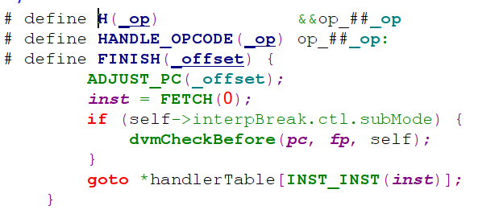

在这段代码中：

- H(_op)：这个宏定义了 &&op_##_op 这样的东西。op_#_op 其实是一个标号（Label，和 goto 中的 label 是一个意思），而 && 代表这个 Label 的地址 [4] 。
- HANDLE_OPCODE(_op)：这个宏定义了一个标号 op_##_op。
- 在 FINISH 宏中，有一个 goto *handleTable，这是 portable 模式下 JVM 执行 Java 字节码的关键。简单点说，portable 模式下，每一种 Java 操作码（OPCode）都对应有一个处理逻辑（是一段代码，但不一定是函数），FINISH 宏就是取出当前的操作码，然后跳转（goto）到对应的处理逻辑去处理它。

那么，handlerTable 是怎么定义的呢？来看图 13：

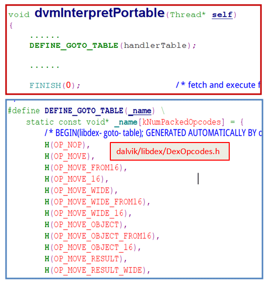

图 13 中：

- dvmInterpretPortable 是 porttable 模式下 Java 字节码的执行入口。也就是当执行 Java 字节码的时候（比如 TestMain.class 中的 main 函数时），都会调用这个函数。这里要强调一点，JVM 执行的时候，除了 Java 字节码外，还有很多 JVM 自己的处理逻辑。比如分配内存时候对堆栈 size 的检查，看看是不是超标。
- DEFINE_GOTO_TABLE 则定义了操作码的标记。

那么，new 操作符对应的 goto label 在哪里呢？来看图 14：

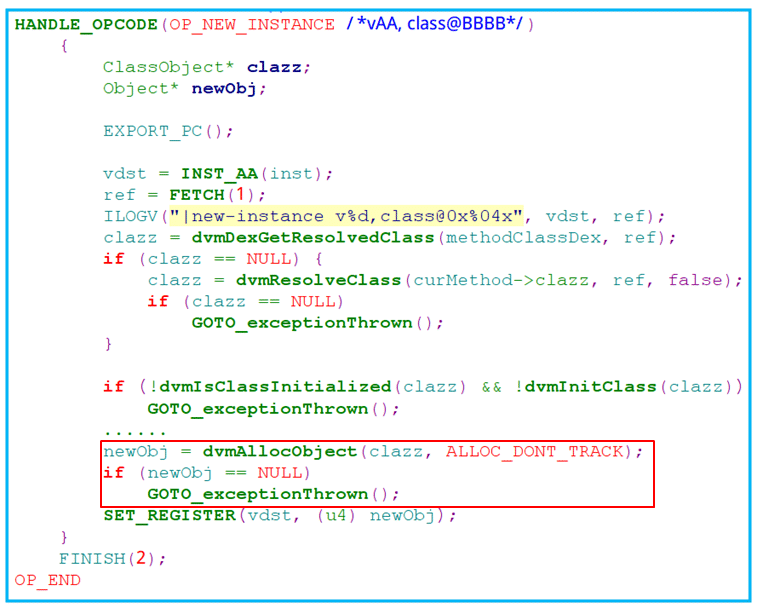

你看，portable.cpp 中通过 HANDLE_OPCODE(OP_NEW_INSTANCE) 定义了 new 操作符的处理逻辑。这段逻辑中，真正分配内存的操作是由红框的 dvmAllocObject 来处理的。

看到这里，你会发现 JVM 执行 Java 字节码还是比较容易理解的。其实对于 arm 等平台也是这样。

### 3.2 ARM 平台上的执行

和 portable 下 dvmInterpretPortable 函数（Java 字节码执行的入口函数）相对应的，其他模式下的入口函数是 dvmMterpStd，其代码如图 15 所示：


dvmMterpStd 中最重要的是 dvmMterpStdRun，这个函数是由各平台对应的 xxx.S 汇编文件定义的。InterpAsm-armv7-a-neon.S 对应的 dvmMterpStdRun 函数以及对 new 的处理逻辑如图 16 所示：


图 16 中：

- dvmMterpStdRun 也是通过 GOTO_OPCODE 调整到不同操作码处理逻辑的地方去执行。
- new 操作符对应的 OP_NEW_INSTANCE 处理也会调用 dvmAllocObject 来分配内存喔。

### 3.3 小结

这一节我们介绍了 JVM 是怎么执行 Java 字节码的，主要以揭秘性质为主，大家也以掌握原理为首要任务。其中，portable 模式下，操作码是一条一条解释执行的。而具体 CPU 平台上，则是由相关汇编代码来处理。二者实际上大同小异。但是由 CPU 来执行，显然处理要快，比如对于 + 这种操作，用 portable 的解释执行当然比直接转换成机器指令来执行要慢很多。

到此，我们了解了 Class 文件结构，以及 Java 字节码到底是怎么执行的。下一步，我们就开始正式分析 Dalvik 虚拟机了。

## 四、Dalvik 虚拟机启动

### 4.1 dalvik 的启动

Android 平台中，第一个虚拟机是通过 app_process 进程启动的，这个进程也就是大名鼎鼎的 Zygote（含义是受精卵）。Zygote 的启动我在《深入理解 Android 卷 I》第四章深入理解 Zygote 中有详细分析，这里我们简单回顾下。图 17 所示为 zygote 启动的触发机制：

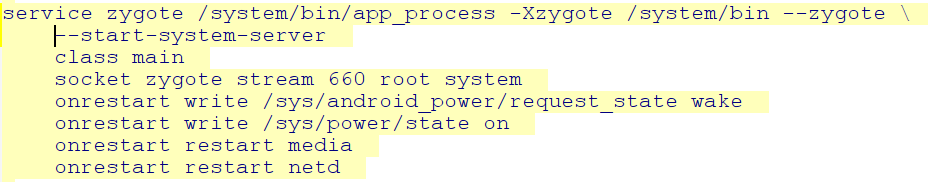

上述代码是位于 init.rc 中，当 Linux 天字号第一进程 init 启动后，将执行 init.rc 中的内容。此处的 zygote 的一个 Service，对应的进程是 /system/bin/app_process，后面的–zygote…等是该进程的参数。

zygote，也就是 app_process，其源码位于 frameworks/base/cmds/app_process 里，源码比较少，主要是一个 App_main.cpp。其 main 函数如下：

复制代码

```
int main(int argc, char* const argv[])
{
    .......
    AppRuntime runtime;  //AppRuntime 是关键数据结构
    const char* argv0 = argv[0];
    int i = runtime.addVmArguments(argc, argv);// 添加参数，不重要
 
    // Parse runtime arguments.  Stop at first unrecognized option.
   .......
    if (zygote) {// 我是 zygote
        runtime.start("com.android.internal.os.ZygoteInit",
                startSystemServer ? "start-system-server" : "");
    } ......
}
 
```

runtime 是核心对象，其类型是 AppRuntime，是定义在 app_process 中的一个 Class，它从 AndroidRuntime 派生。start 函数就是 AndroidRuntime 中的，用于启动 VM 的入口。

#### **4.1.1 AndroidRuntime start 之一**

start 函数我们分两部分讲，第一部分如图 18 所示：


第一部分包含三个主要函数：

- jni_invocation.Init：初始化 JNI 相关的几个重要函数。
- startVm：注意，它传入了一个 JNIEnv* env 对象进去，当这个函数返回时，我们在 JNI 中天天见的 JNIEnv 对象就是这个东西。startVm 是 Dalvik VM 的核心，该函数返回后，VM 就基本就绪了。
- startReg：注册 Android 平台中一些特有的 JNI 函数。

##### （1） JniInvocation Init

该函数内容如图 19 所示：

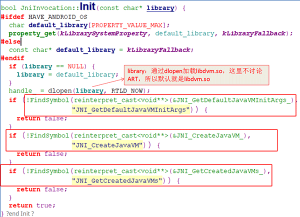

该函数：

- 通过 dlopen 加载 libdvm.so。看来每个 Java 进程都会有这个东西。这可是 dalvik vm 的核心库。这个库有很多 API，我个人觉得如果了解 libdvm.so 的话，应该能干很多事情。我们后续分析 xposed 就会看到。
- 从 libdvm.so 中找到 JNI_GetDefaultJavaVMInitArgs、JNI_CreateVM 和 JNI_GetCreateJavaVMs 这三个函数指针。

所以，以后调用比如 JNI_CreateVM_ 函数的时候，我们知道它的真实实现其实是位于 libdvm.so 中的 JNI_CreateVM 就好。

比较简单，Nothing more…

### 4.2 startVM 之旅

startVM 属于 Android Runtime start 函数的第一部分，不过该函数内容比较多，我们单独搞一大节来讲它！

startVM 此函数前面一大段都是参数处理，所以对本文有意义的内容其实只有图 20 所示的部分：

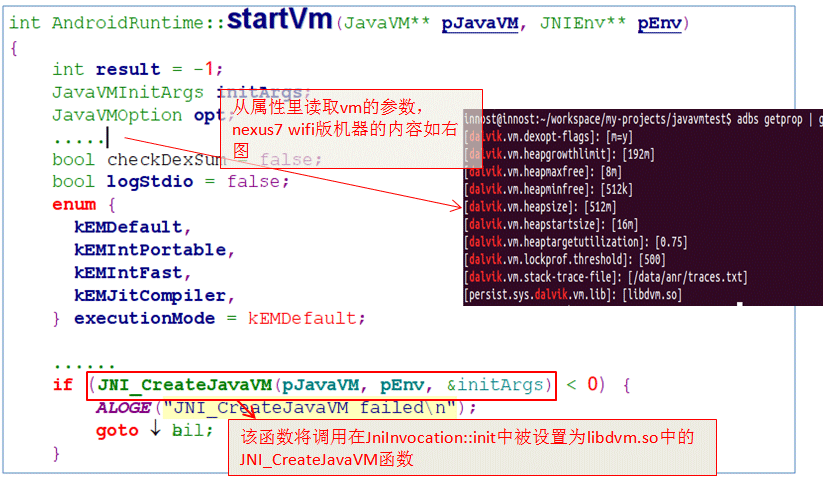

核心内容还是在 libdvm.so 中的 JNI_CreateVM 函数中，这个函数定义在 dalvik/vm/jni.cpp 中。来看它！

#### **4.2.1 JNI_CreateJavaVM**

##### （1） gDvm、JavaVMExt 和 JNIEnvExt

图 21 所示为此函数的主要代码：


图 21 中，首先扑面而来的就是 Dalvik VM 中的几个重量级数据结构：

- gDvm，全局变量，数据类型为结构体 DvmGlobals，该结构体是 Dalvik 的核心数据结构，几乎所有的重要成员，控制参数（比如堆栈大小，状态、已经加载的类信息）等都通过 gDvm 来管理。
- JavaVMExt：JavaVM 在 JNI 编程中代表虚拟机本身。在 Dalvik 中，这个虚拟机本身真正的数据类型是此处的 JavaVMExt。由于 JNI 支持 C 和 C++ 两种语言调用（对 C 而言，就是直接调用函数，对于 C++ 而言，就是调用一个类的成员函数），所以 JavaVM 这个数据结构在 C++ 里是一个类 (如果定义了 __cplusplus 宏，就是 _JavaVM 类)，在 C 里则是 JNIInvokeInterface 数据结构。
- 同样，对于 JNIEnvExt 而言，当使用 C++ 编译时候，它就是 __JNIEnv 类，使用 C 编译时就是 JNINativeInterface。

图 22 所示为 JavaVMExt 和 JNIEnvExt 的内容：


图 22 中可知：

- JavaVMExt 有一个 envList 链表，该链表管理这一个 Java 进程中所有 JNIEnv 环境实体。JNIEnv 环境和线程有关，什么样的线程会需要 JNIEnv 环境呢？所有从 Java 层调用 JNI 的线程以及从 Native 线程往调用 Java 函数的线程都需要创建一个 JNIEnv。说白了，JNIEnv 环境是 Java 和 Native 世界的桥梁。
- JNIEnvExt 提供的跨 Java 和 Native 的桥梁主要就是 JNIEnv 定义的那些函数，它们统一保存在 JNINativeInterface 数据结构体中，比如图中右下角红框中的 NewGlobalRef、NewLocalRef 等。
- 注意，gDvm 的 funcTable 变量指向了全局对象 gInvokeInterface。该变量定义在 dalvik/vm/jni.cpp 中。

再来看 gDvm 的内容，它自己其实就是一大仓库，里边有很多成员变量，每个成员变量都有各自的用途。其内部如图 23 所示：


图 23 中：

- gDvm 的数据类型是 DvmGlobals，里边存储了整个 Dalvik 虚拟机中相关的参数，成员变量。其中 loadedClasses 代表虚拟机加载的所有类信息。
- classJavaLangClass 指向一个类型为 ClassObject 的对象。ClassObject 是 Class 信息在代码中的表示，其主要内容见图右上角，它包括类名信息、成员变量、函数（函数的代码表示是 Method）等。classJavaLangClass 代表的就是 Java 中最基础的 java.lang.Class 类。
- ClassObject 从 Object 类派生（C++ 中，struct 其实就是 class）

这里要特别说明虚拟机中对类唯一性的确定方法：

1 对我们而言，类的唯一性由包名 + 类名表示，比如 java.lang.Class 这个类，就是唯一的。但实际上，根据 Java VM 规范，类的唯一性由全路径类名 + 定义它的 ClassLoader 两者唯一确定。

2 对一个类的加载而言，ClassLoader 有两种情况。一种是直接创建目标类，这种 loader 叫 Define Loader（定义加载器）。另外一种情况是一个 ClassLoader 创建了 Class，但它可以自己直接创建，也可以是委托给比如父加载器创建的，这种 Loader 叫 Initiating Loader（初始加载器）。

3 类的唯一性是由全路径类名 + 定义加载器唯一决定。

下面来看 JNIEnvExt 的创建，这是由图 21 中的 dvmCreateJNIEnv 函数完成的。

##### （2） dvmCreateJNIEnv

图 21 中的调用方法如下：

JNIEnvExt* pEnv = (JNIEnvExt*) dvmCreateJNIEnv(NULL);

该函数的相关代码如图 24 所示：

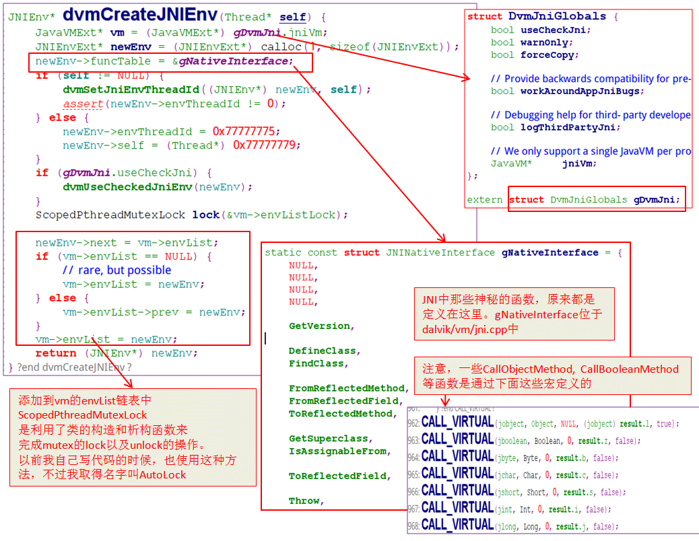

图 24 中，Dalvik 虚拟机里 JNI 的所有函数都封装在 gNativeInterface 中。这个结构体包含了 JNI 定义的所有函数。注意，在使用 sourceInsight 的时候会有一些函数无法被解析。因为这些函数使用了类似图右下角的 CALL_VIRTUAL 宏方式定义。

我确认了下，应该所有函数的定义其实都在 jni.cpp 这一个文件里。

到此，我们为主线程创建和初始化了 gDvm 和 JNI 环境。下面来看 dvmStartup。

#### **4.2.2 dvmStartup：虚拟机创建的核心**

去掉 dvmStartup 函数中一些判断代码后，该函数整个执行流程可由图 25 表示：

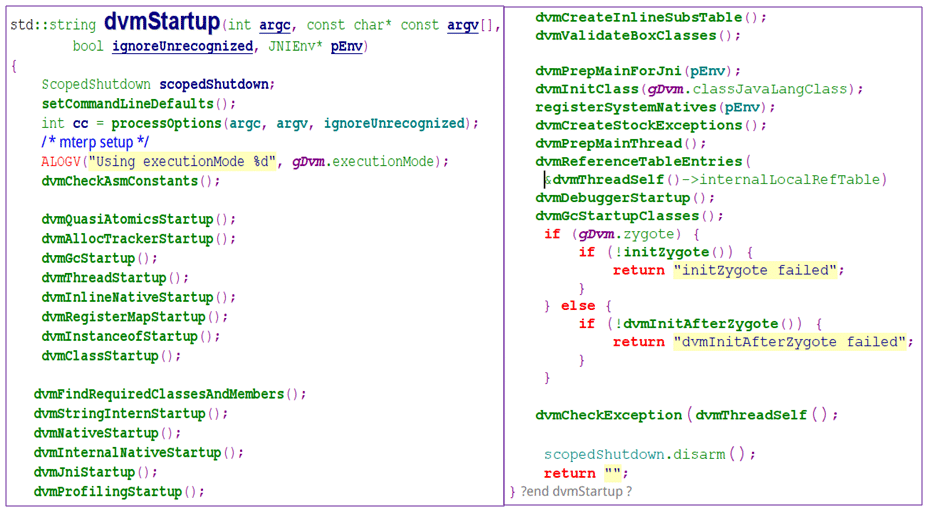

图 25 中，dvmStartup 的执行从左到右。由于本章我只是想讨论 dalvik 是怎么执行的 Java 代码的，所以这里有一些函数（比如 GC 相关的，就不拟讨论）。

dvmStartup 首先是解析参数，这些参数信息可能会传给 gDvm 相关的成员变量。解析参数是由 setCommandLineDefaults 和 processOptions 来完成的。具体代码就不看了，最终设置的几个重要的参数是：

- gDvm.executionMode = kExecutionModeJit：如果定义的 WITH_JIT 宏，则执行模式是 JIT 模式。
- gDvm.bootClassPathStr：由 BOOTCLASSPATH 环境变量提供。Nexus7 WiFi 版 4.4.4 的值如图 26 所示。
- gDvm.mainThreadStackSize = kDefaultStackSize。kDefaultStackSize 值为 16K，代表主线程的堆栈大小
- gDvm.dexOptMode = OPTIMIZE_MODE_VERIFIED，用于控制 odex 操作，该参数表示只对 verified 的类进行 odex。

图 26 为 Nexus 7 Wi-Fi 版 4.4.4 的 BOOTCLASSPATH 值：

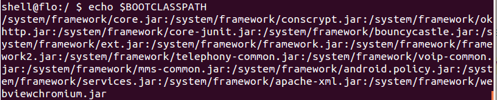

图 26 可知，system/framework 下几乎所有的 jar 包都被放在了 BOOT CLASSPATH 里。这意味这 zygote 进程加载了所有 framework 的包，这进一步意味着 App 也加载了所有 framework 的包…。

下面来分析几个和本章目标相关的函数：

##### （1） dvmThreadStartup

图 27 所示为 dvmThreadStartup 的一些关键代码和解释：


Thread 是 Dalvik 中代表和管理一个线程的重要结构。注意，这里的 Thread 不简单是我们在 Java 层中的线程。在那里，我们只需要在线程里执行要干得活就可以了。而这里的 Thread 几乎模拟了一个 CPU（或者说 CPU 上的一个核）是怎么执行代码的。比如 Thread 中为函数调用要设置和维护一个栈，还要要有一个变量指向当前正在执行的指令（大名鼎鼎的 PC）。这一块我不想浪费时间介绍，有兴趣的童鞋们可以此为契机进行深入研究。

##### （2） dvmInlineNativeStartup

dvmInlineNativeStartup 主要是将一些常用的函数搞成 inline 似的。这里的 inline，其实就是将某些 Java 函数搞成 JNI。比如 String 类的 charAt、compareTo 函数等。相关代码如图 28 所示：

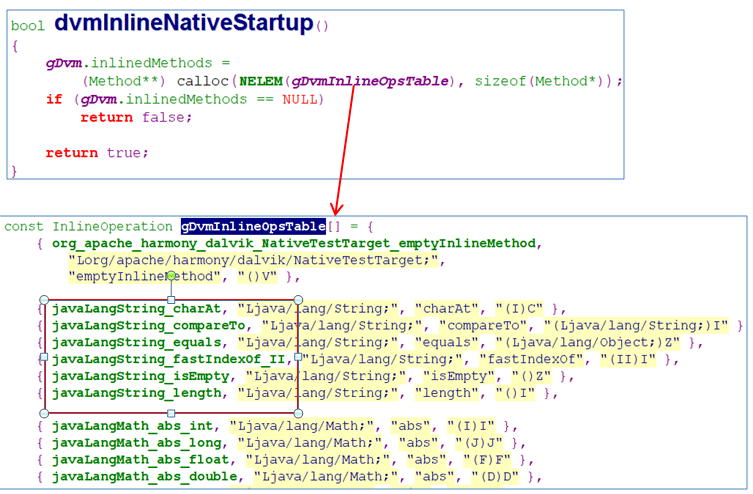

注意，在上面函数中，gDvm.inlineMethods 只不过是分配了一个内存空间，该空间大小和 gDvmInlineOpsTable 一样。而 gDvm.inlineMethods 数组元素并未和 gDvmInlineOpsTable 挂上钩。当然，最终是会挂上的，但是不在这里。此处暂且不表。

##### （3） dvmClassStartup

下面我们跳到 dvmClassStartup，这个函数很重要。图 29 是其代码：

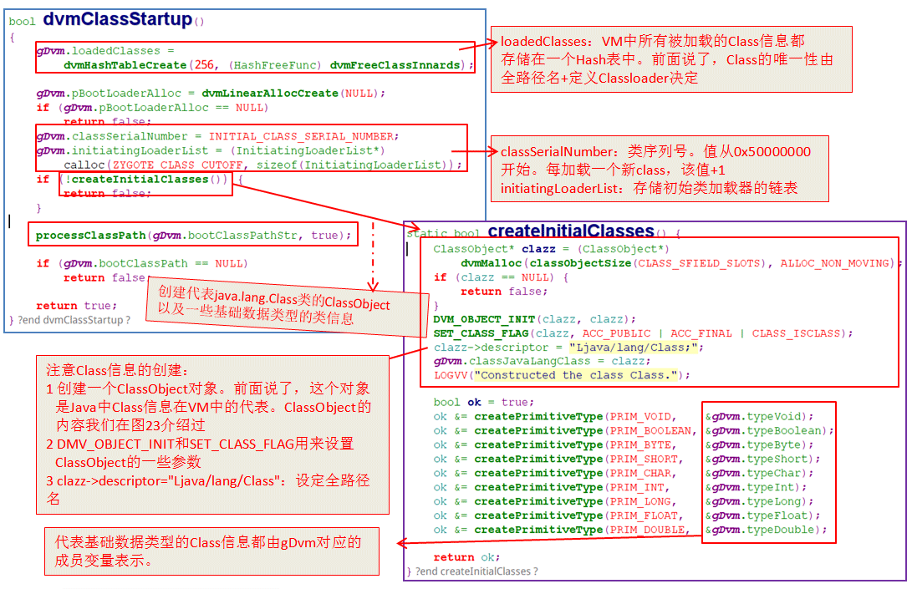

图 29 中：

- 创建了一个 Hash 表，用来存储已经加载的类。
- 创建了代表 java.lang.Class 和所有基础数据类型的 Class 信息。

下面来看 processClassPath 这个函数，它要加载所有的 Boot Class，由于它涉及到类的加载，所以它也是本文的重点内容。先来看图 30：


processClassPath 主要是处理 BOOTCLASSPATH，也就是图 26 中的那些位于 system/framework/ 下的 jar 包。图 31 展示了 prepareCpe 的代码，该函数处理一个一个的文件：


prepareCpe 倒是很简单：

- 对于.jar/.zip/.apk 结尾的文件，则调用 dvmJarFileOpen 进行处理。
- 对于.dex 结尾的文件则调用 dvmRawDexFileOpen 进行处理。
- 处理成功后，则设置 ClassPathEntry 的 kind 为 KCpeJar 或者是 KCpeDex，代表文件的类型是 Jar 还是 Dex。并且设置 cpe->ptr 指针为对应的文件（jar 文件则是 JarFile，Dex 文件这是 RawDexFile）。存储它们的原因是因为后续要从这些文件中解析里边包含的信息。

这里我们看 dvmJarFileOpen 函数，如图 32 所示：


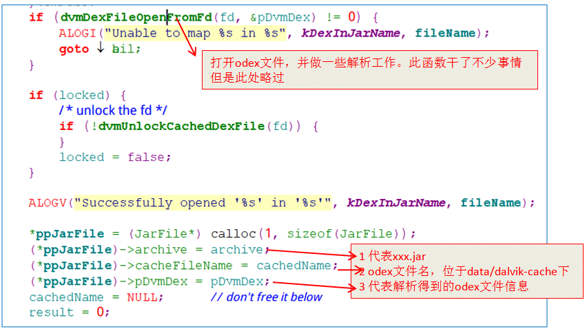

图 32 介绍了 dvmJarFileOpen 的主要内容，其中：

- 打开 jar 中的 classes.dex 文件，然后判断有没有对应的 odex 文件。如果没有，就调用 dexopt 生成一个 odex 文件。文件后缀还是.dex，但是路径位于 /data/dalvik-cache 下。

到此 dvmClassStartup 就介绍完了。下面来看一个重要函数，dvmFindRequiredClassesAndMembers。

##### （4） dvmFindRequiredClassesAndMembers

dvmFindRequiredClassesAndMembers 初始化一些重要类和函数。其代码如图 33 所示：


dvmFindRequiredClassesAndMembers 就是初始化一些类，函数，虚函数等等。我们重点关注它是怎么初始化的。一共有三个重要函数：

- findClassNoInit：和 Java 层的 findClass 有关，涉及到 JVM 中如何加载一个 Class。
- dvmFindDirectMethodByDescriptor 和 dvmFindVirtualMethodByDescriptor：涉及到 JVM 中如何定位到一个方法。

重点是 findClassNoInit，代码如图 34 所示：

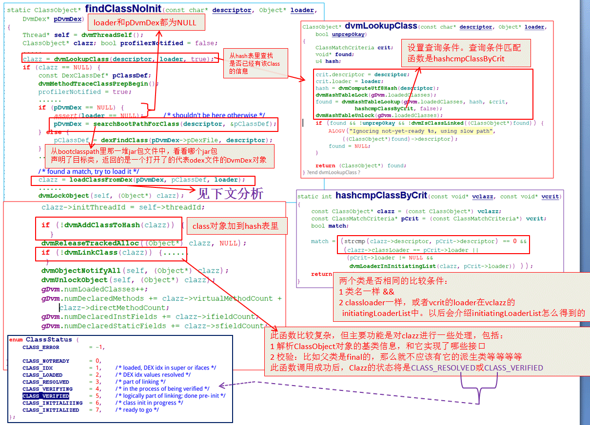

图 34 中，有几个关键点：

- dvmLookupClass：这是从 gDvm 的已加载 Class Hash 表里搜索，看看目标 Class 是否已经加载了。注意搜索时的匹配条件：前面也曾经说到过，除了类名要相同之外，该类的类加载器也必须一样。另外，当待搜索类的类加载器位于 clazz 的初始化加载类列表中的时候，即使两个类的定义 ClassLoader 不一样，也可以满足搜索条件。关于初始类加载器来确定唯一性，我没有在 JVM 规范中找到明确的说明。
- loadClassFromDex：该函数将解析 odex 文件中的类信息。下面重点介绍它。
- dvmAddClasstoHash：把这个新解析得到的 Class 加到 Class Hash 表里。
- dvmLinkClass：解析这个 Class 的一些信息。比如，Class 的基类是谁，该 class 实现了哪些接口。请大家回过头去看 2.1 节的图 2 Class 文件内部结构。一个 Class 的基类以及它实现的接口类信息都是通过对应的索引来间接指向基类 Class 以及接口类 Class 的。而 dvmLinkClass 处理完后，这些索引将由实际的 ClassObject 对象来替代。另外，dvmLinkClass 将做一些校验，比如此 Class 的基类是 final 的话，那么这个 Class 就应该存在。

注意：我们在编写代码的时候，对于类的唯一性往往只知道全路径类名，很少关注 ClassLoader 的重要性。实际上，我之前曾经碰到过一个问题：通过两个不同 ClassLoader 加载的相同的 Class 居然不相等。当时很不明白为什么要这么设计， 直到我碰到一个真实事情：有一天我在等车，听见一个路人大声叫着“李志刚，李志刚”。我回头一看，以为他是在找人，结果发现他的宠物狗跑了出来。原来他的 宠物狗就叫李志刚。这就说明，两个具有相同名字的东西，实际上很能是完全不同的事物。所以，简单得以两个类是否同名来判断唯一性肯定是不行得了。

下面来看最重要的 loadClassFromDex，这个函数其实就是把 odex 文件中的信息转换成 ClassObject。我们来看它：loadClassFromDex 代码如图 34 所示：

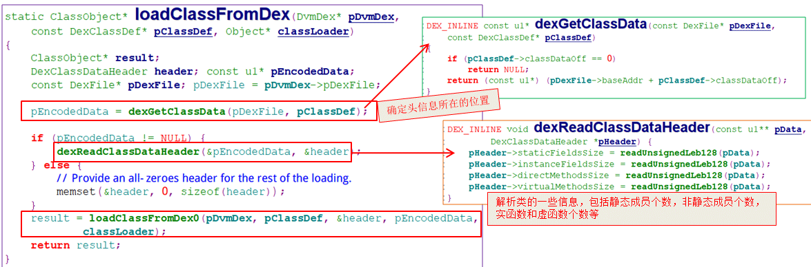

其中主要的加载函数是 loadClassFromDex0，其代码如图 35 所示：


以上是 loadClassFromDex0 的第一部分内容，这这一块比较简单，也就是设置一些东西。下面看图 36


图 36 中：

- newClazz 的基类和它所实现的接口类，在 loadClassFromDex0 中还只是一索引来标识。最后这些索引会在 dvmLinkClass 里转换并指向成真正的 ClassObject。
- 然后调用 loadSFieldFromDex 来解析类的静态成员信息。成员信息由数据结构 DexFieldId 表示，其实包含的那些信息

其实 loadClassFromDex0 后面的工作也类似，比如解析成员函数信息，成员变量信息等。我们直接看相关函数吧：

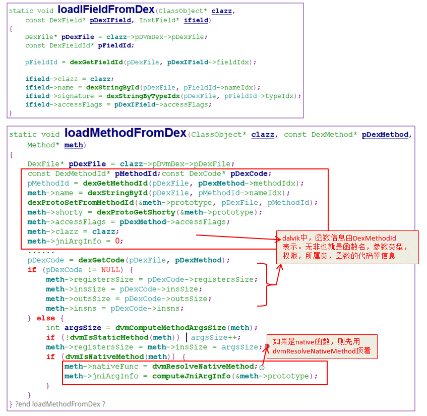

图 37 展示了解析成员变量和解析函数用的两个函数。

注意 native 函数的处理，此处是先用 dvmResolveNativeMethod 顶着。我们以后分析 JNI 的时候再来讨论它。

上面的 findClassNoInit 是用于搜索 Class 的，下面我们来看 dvmFindDirectMethodByDescriptor 函数，它是用来搜索方法的，代码如图 38 所示：


对 compareMethodHelper 好奇的读者，我在图 40 里展示了如何从 dex 文件中获取一个函数的返回值信息。

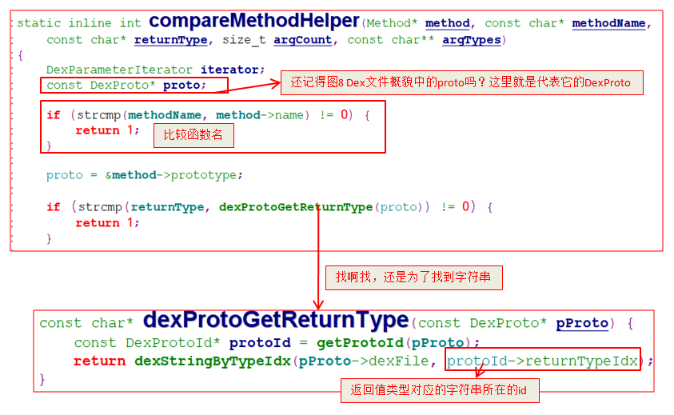

好像感觉我们一直和字符串在玩耍。

### 4.3 小结

说实话，讲到现在，其实虚拟机启动的流程差不多就完了。当然，本节所说的这个流程是很粗犷的，主要内容还是集中在 Class 的加载上，然后浮光掠影看了下一些重要的数据结构。Anyway，上述流程，我建议读者结合代码反复走几个来回。下面我们将开始介绍一些细节性的内容：

- 第五章介绍类的初始化和加载。
- 第六章介绍 Java 中的函数调用到底是怎么实现的。
- 第七章介绍 JNI 的内容。

## 五、Class 的加载和初始化

JVM 中，一个 Class 首先被使用的时候会调用它的函数。函数是一个由编译器生成的函数，当类有 static 成员变量或者 static 语句块的时候，编译器就会为它生成这个函数。那么，我们要搞清楚这个函数在什么时候被调用，以什么样的方式被调用。

先来看一段示例代码，如图 41 所示：

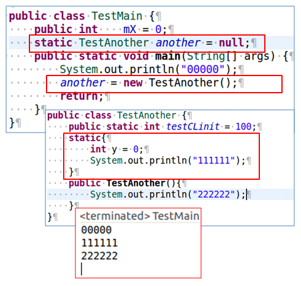

示例代码中：

- TestMain 有一个静态成员变量 another，其类型是 TestAnother。初始值是 NULL。
- main 函数中，构造了这个 TestAnother 对象。
- TestAnother 有一个静态成员变量 testCLinit 和 static 语句。
- 最后一个图是执行结果。从其输出来看，main 函数的“00000”先执行，然后执行的是 TestAnother 的 static 语句，最后是 TestAnother 的构造函数。

问题来了：TestAnother 的什么时候被调用？我一开始思考这个问题的时候：这个函数是编译器自动生成的，那么调用它的地方是不是也由编译器控制呢？

要确认这一点，只需要看 dexdump 的结果，如图 42 所示：


图 42 中：

- 上图：由于 TestMain 也有静态成员变量，所以编译器为它生成了函数。在它的中，由于 another 变量赋值为 null，所以没有触发 another 类的加载（不过，这个结论不是由图 42 得到的，而是由图 41 日志输出的顺序得到的）。
- 下图：是 TestMain 的 main 函数。我们来看 another 对象的创建，首先是通过 new-instance 指令创建，然后通过 invoke-direct 调用了 TestAnother 的函数。是的，你没看错，TestAnother 的构造函数（也就是）是明确被调用的，但是 TestAnother 的调用之处却毫无踪迹。

当然，根据图 41 的日志输出，我们知道是在 TestAnother 的构造函数之前调用的，那唯一有可能的地方会不会是 new-instance 呢？

### 5.1 new-instance

我们在 3.1 节 portable 的纯解释执行一节中提到过 new-instance，下面我们将以 portable 为主要讲解对象来介绍。

其实，不管是 portable 还是 arm、x86 方式，最终都会变成机器指令来执行。相对 arm、x86 的汇编代码，portable 是以 C 语言实现的 Java 字节码解释器，非常方便我们理解。

图 43 为 new-instance 指令对应的代码：

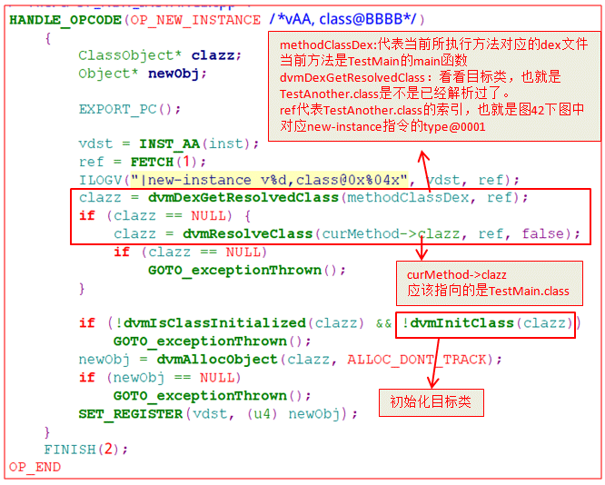

第六节会介绍 portable 模式下 Java 函数是如何执行的，所以这里大家先不用管 HANDLE_OPCODE 这样的宏是干什么用的。图 43 中：

- 先调用 dvmDexGetResolvedClass，看看目标类 TestAnother 是不是已经被解析过了。前面曾经提到说，一个类在初始化的时候可能会解析它所使用到的其他类。
- 假设被引用的类没有解析过，则调用 dvmResolveClass 来加载目标类。
- 目标类加载成功后，如果该类没有初始化过，则调用 dvmInitClass 进行初始化。

我们重点介绍 dvmResolveClass 和 dvmInitClass。

#### **5.1.1 dvmResolveClass 分析**

图 44 是 dvmResolveClass 的代码：


图 44 中：

- 上图是 dvmResolveClass 的代码，其主要逻辑就是先得到目标类名（Lcom/test/TestAnother;）然后调用 dvmFindClassNoInit 来加载目标类。
- 下图是 dmvFindClassNoInit 的代码，由于 referrer 的 ClassLoader（也就是使用 TestAnother 类的 TestMain 类的 ClassLoader）不为空，代码逻辑将走到 findClassFromLoaderNoInit。注意，dvmFindSystemClassNoInit 我们在 4.2.2.4 节将 bootclass 类解析的时候讲过。

图 45 是 findClassFromLoaderNoInit 的代码，出奇的简单：

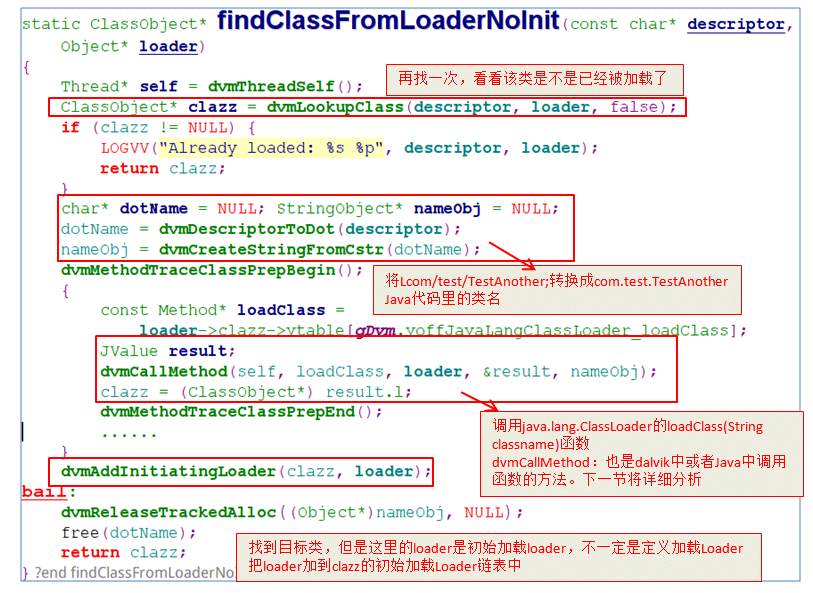

代码真是简洁啊，居然调用 java/lang/ClassLoader 的 loadClass 函数来加载类。当然，dalvik 中调用 Java 函数是通过 dvmCallMethod 来实现的。这个函数我们下一节再介绍。然后，我们把 loader 存储到目标 clazz 的初始加载 loader 链表中。初始加载链表在决定类唯一性的时候很有帮助（不记得初始加载器和定义加载器的同学们，请回顾图 23 后的说明和图 33）。

Anyway，到此，目标类就算加载成功了。类加载成功到底意味这什么？前面讲过 loadClassFromDex 等函数，类加载成功意味着 dalvik 虚拟机从 dex 字节码文件中成功得到了一个代表该类的 ClassObject 对象，里边该填的信息在这里都填好了！

加载成功，下一步工作是初始化，来看下一节：

#### 5.1.2 dvmInitClass 分析

图 46 为 dvmInitClass 的代码：


终于，在 dvmInitClass 中，我们看到了的执行。其他感觉没什么特别需要说的了。

再次强调，本章是整个虚拟机旅程中一次浮光掠影般的介绍，先让大家，包括我自己看看虚拟机是个什么样子，有一个粗略的认识即可。后续有打算搞一个完整的，严谨的，基于 ART 的虚拟机分析系列。

## 六、Java 函数是怎么 run 起来的

JVM 规范定义了 JVM 应该怎么执行一个函数，东西较碎，但和其他语言一样，无非是如下几个要点：

- JVM 在执行一个函数之前，它会首先分配一个栈帧（JVM 中叫 Frame），这个 Frame 其实就是一块内存，里边存储了参数，还预留了空间用来存储返回值，还有其他一些东西。
- 函数执行时，从当前栈帧（每一个函数执行之前，JVM 都会为它分配一个栈帧）获取参数等信息，然后执行，然后将返回值存储到当前栈帧。当前正在执行的函数叫 current Method（当前方法）
- 函数返回后，JVM 回收当前栈帧。

函数执行肯定是在一个线程里来做的，栈帧则理所当然就会和某个线程相关联。我们先来看 dalvik 是怎么创建线程及对应栈的。

### 6.1 allocThread 分析

Dalvik 中，allocThread 用于创建代表一个线程的线程对象，其代码如图 47 所示：


图 47 是 dalvik 虚拟机为一个线程创建代表对象的处理代码，其中，它为每个线程都创建了一个线程栈。线程栈大小默认为 16KB，并设置了相关的栈顶和栈底指针，如图中右下角所示：

- interpStackStart 为栈顶，位于内存高位值。
- interpStackEnd 为栈底，位于内存地位。
- 整个栈的内存起始位置为 stackBottom。stackBottom 和 interpStackEnd 还有一个 768 字节的保护区域。如果栈内容下压到这块区域，就认为出错了。

每个线程都分配 16KB，会不会耗费内存呢？不会，这是因为 mmap 只是在内核里建立了一个内存映射项，这个项覆盖 16KB 内存。注意，它只是告诉 kernel，这块区域最大能覆盖 16KB 内存。如果一直没有使用这块内存的话，那么内存并不会真正分配。所以，只有我们真正操作了这块内存，系统才会为它分配内存。

### 6.2 dvmCallMethod

dalvik 中，如果需要调用某个函数，则会调用 dvmCallMethod（嗯嗯？不对吧，Java 字节码里的 invoke-direct 指令难道也是调用这个么？别急，待会再说 invoke-direct 的实现。）

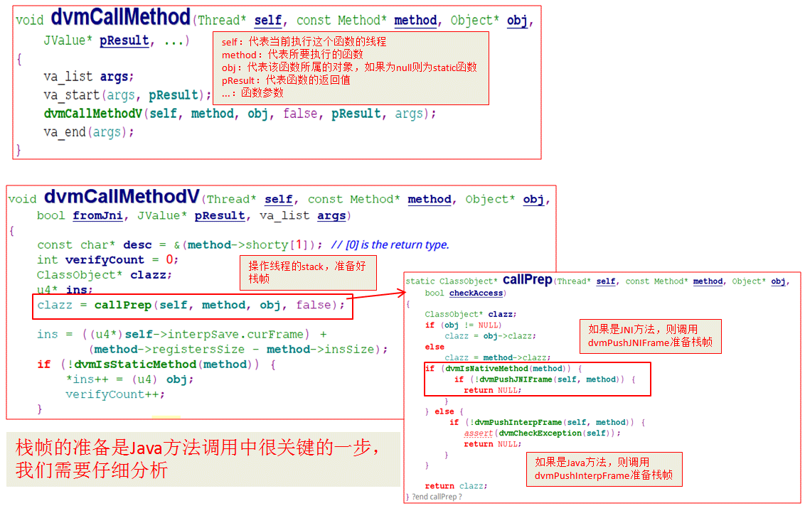

dvmCallMethod 第一步主要是调用 callPrep 准备栈帧，这是函数调用的关键一步，马上来看：

#### **6.2.1 dvmPushInterpFrame**

当调用一个 Java 函数时，JVM 需要为它搞一个新的栈帧，图 49 展示了 dvmPushInterpFrame 的代码

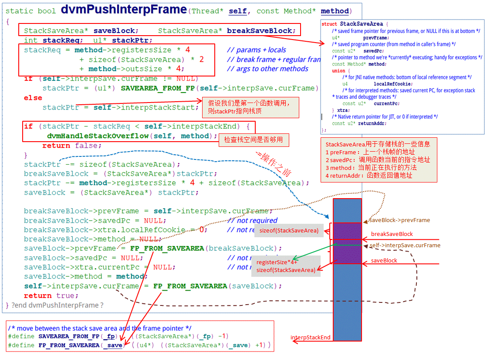

图 49 中：

- 一个栈帧的大小包括两个 StackSaveArea 和输入参数及函数内部本地变量（大小为 method->registersSize*4）所需的空间。但是，在计算栈是否 overflow 的时候，会额外加上该函数内部调用其他函数时所传参数所占空间（大小为 method->outsSize*4）
- 这两个 StackSaveArea，一个叫 BreakSaveBlock，另外一个叫 SaveBlock。其分布如图 49 中右下角位置所示。这两个 SSA 的作用，我们后面将看到。
- self->interpSave.curFrame 指向 saveBlock 的高地址。紧接其上的就是参数空间

1 注意：registersSize 包括函数输入参数和函数内部本地变量的个数

2 dvmPushJNIFrame，这个函数是当 Java 要调用 JNI 函数时的压栈处理，该函数和 dvmPushInterpFrame 几乎一样，只是在计算所需栈空间时，没有加上 outsSize*4，因为 native 函数所需栈是由 Native 自己控制的。此函数代码很简单，请童鞋们自己学习

好了，栈已经准备好了，我们看看函数到底怎么执行。

#### **6.2.2 参数入栈**

图 48 中 dvmCallMethodV 调用 callPrep 之后，有一段代码我们还没来得及展示，如图 50 所示：


参数入栈，您看明白了吗？

#### **6.2.3 调用函数**

接着看 dvmCallMethodV 调用函数部分，如图 51 所示

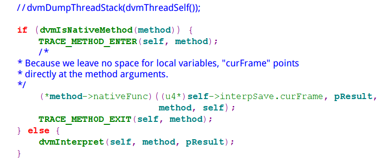

对于 java 函数，其处理逻辑由 dvmInterpret 完成，对于 Native 函数，则由对应的 nativeFunc 完成。JNI 我们放到后面讲，先来处理 dvmInterpret。如图 52 所示：

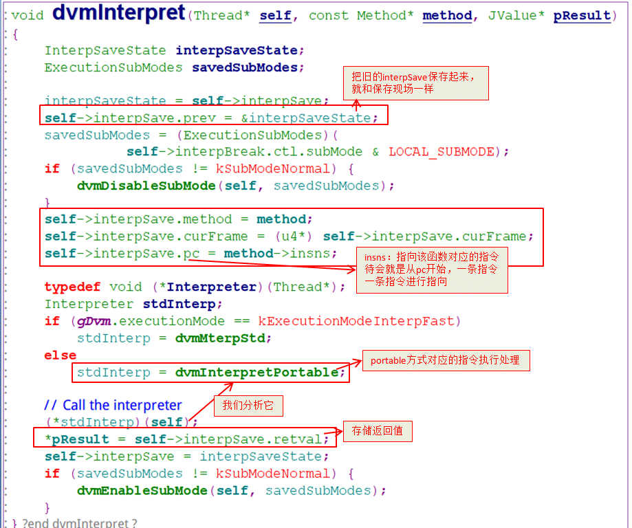

图 52 中：

- self->interpSave.pc 指向要指向函数的指令部分（method->insns）

下面我们来看 dvmInterpretPortable 的处理：

##### （1） dvmInterpretPortable

dvmInterpretPortable 位于 dalvik/vm/mterp/out/InterpC-portable.cpp 里，这个 InterpC-portable.cpp 是用工具生成的，将分散在其他地方的函数合并到最终这一个文件里。我们先来看该函数的第一段内容，如图 53 所示：

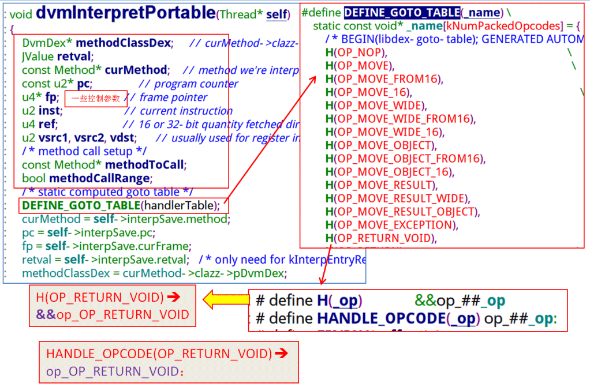

第一部分中，我们发现 dvmInterpretPortable 通过 DEFINE_GOTO_TABLE 定义了一个 handlerTable[kNumPackedOpcodes] 数组，这个数组里的元素通过 H 宏定义。H 宏使用了 && 操作符来获取某个 goto label 的位置。比如图中的 H(OP_RETURN_VOID)，展开这个宏后得到 &&op_OP_RETURN_VOID，这表示 op_OP_RETURN_VOID 的位置。

那么，这个 op_OP_RETURN_VOID 标签是谁定义的呢？恩，图中的 HANDLE_OPCODE 宏定义的，展开后得到 op_OP_RETURN_VOID:。

最后：

- pc=self->interpSave.pc：将 pc 指向 self->interpSave.pc，它是什么？回顾图 52，原来这就是 method->insns。也就是这个方法的第一个字节码指令。
- fp=self->interpSave.curFrame：参看图 50 右边的示意图。

来看 portable 模式下 Java 字节码的处理，这也是最精妙的一部分，如图 54 所示：

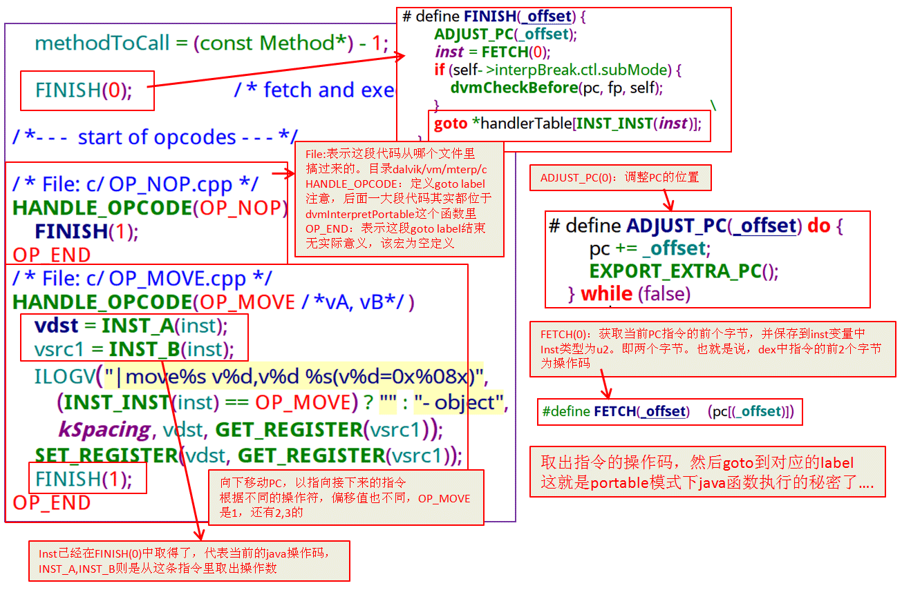

请先认真看图 54 的内容，然后再看下面的总结，portable 模式下：

- FINISH(0)：移动 PC，然后获取对应指令的操作码到 ins。根据 ins 获取该指令的操作码（注意，一条指令包含操作码和操作数），然后 goto 到该操作码对应的处理 label 处。
- 在对应 label 处理逻辑处：从指令中提取参数，比如 INST_A 或 INST_B。然后处理，然后再次调整 PC，使得它能处理下一条指令。

好了，portable 模式下 dalvik 如何运行 java 指令就是这样的，就是这么任性，就是这么简单。下面，我们来看 Invoke-direct 指令又是如何被解析然后执行的。

##### （2） invoke-direct 指令是如何被执行的

刚才你看到了 portable 模式下指令的执行，就是解析指令的操作码然后跳转到对应的 label。假设我们现在碰到了 invoke-direct 指令，这是用来调用函数的。我们看看 dvmInterpretPortable 怎么处理它。一个图就可以了，如图 55 所示：


就是跳来跳去麻烦点，其实和 dvmCallMethod 一样一样。

##### （3） 函数返回

一切尽在图 56。

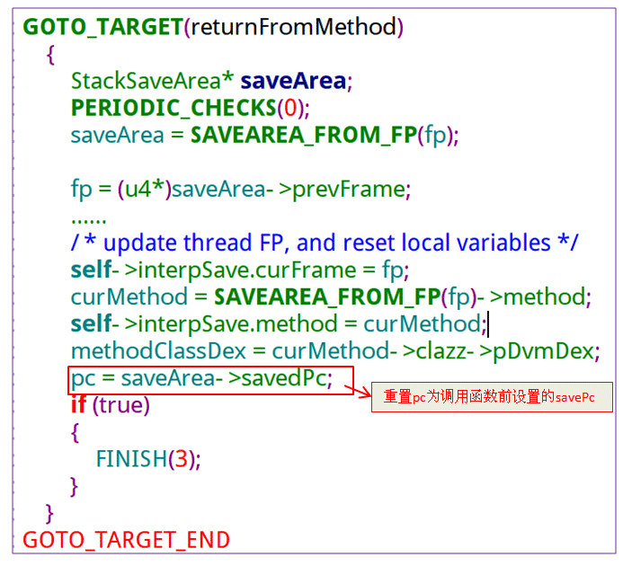

函数返回后，还需要 pop 栈帧，代码在 stack.cpp 的 dvmPopFrame 中。此处略过不讨论了。

### 6.3 小结

这一节你真得要好好思考，函数调用，不论是 Java、C/C++，python 等等，都有这类似的处理：

- 建立栈帧，参数入栈。
- 跳转到对应函数的位置，native 就是函数地址指针，Java 这是 goto label，转换成汇编还是地址指针。
- 函数返回，pop 栈帧。

这好像是程序设计的基础知识，这回你真正明白了吗？

## 七、JNI 相关

关于 JNI，我打算介绍下面几个内容：

- Java 层加载 so 库，so 库中一般会注册相关 JNI 函数。
- Java 层调用 native 函数。

native 库中，如果某个线程需要调用 java 函数，它会先创建一个 JNIEnv 环境，然后 callXXMethod 来调用 Java 层函数。这部分内容请大家自行研究吧…

把这几个步骤讲清楚的话，JNI 内容就差不多了。

### 7.1 so 加载和 JNI 函数注册

#### 7.1.1 so 文件搜索路径和 so 加载

APP 中，如果要使用 JNI 的话，native 函数必须封装在动态库里，Windows 平台叫 DLL，Linux 平台叫 so。然后，我们要在 APP 中通过 System.loadLibrary 方法把这个 so 加载进来。所以，入口是 System 的 loadLibrary 函数。相关代码如图 57 所示：


图 57 是 System.loadLibrary 的相关代码。这里主要介绍了 so 加载路径的问题：

- 我们在应用里调用 loadLibrary 的时候系统默认会传入调用类的 ClassLoader。如果有 ClassLoader，则 so 必须由它加载。原因其实很简单，就是 APP 只能加载自己的 so，而不能加载别的 APP 的 so。这种做法和传统的 linux 平台上把 so 的搜索路径设置到 LD_LIBRARY_PATH 环境变量中有冲突，所以 Android 想出了这种办法。
- 如果没有 ClassLoader，则还是使用传统的 LD_LIBRARY_PATH 来搜索相关目录以加载 so。

这里再明确解释下，loadLibrary 只是指定了 so 文件的名字，而没有指定绝对路径。所以虚拟机得知道去哪个目录搜索这个文件。传统做法是搜索 LD_LIBRARY_PATH 环境变量所表明的文件夹（AOSP 默认是 /vendor/lib 和 /system/lib）这两个目录。但是我刚才讲，如果使用传统方法，APP A 有 so 要加载的话，得把自己的路径加到 LD_LIBRARY_PATH 里去。比如 LD_LIBRARY_PATH=/vendor/lib:/system/lib:/data/data/pkg-of-app-A/libs，这种方法将导致任何 APP 都可以加载 A 的 so。

真正的加载由 doLoad 函数完成。这个函数相关的代码如图 58 所示：

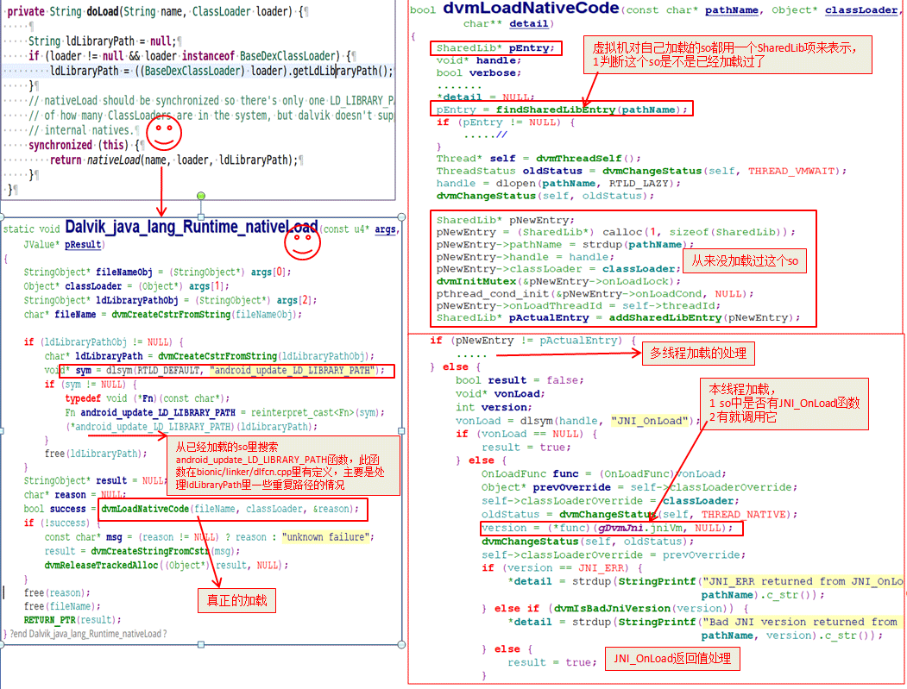

没什么太多可说的，无非就是 dlopen 对应的 so，然后调用 JNI_OnLoad（如果该 so 定义了这个函数的话）。另外，dalvik 虚拟机会保存自己加载的 so 项。

注意，图 58 里左边有两个笑脸，当然是很“阴险”的笑脸。什么意思呢？请童鞋们看看 nativeLoad 和它对应的 Dalvik_java_lang_Runtime_nativeLoad 函数。你会发现 Runtime_nativeLoad 的函数参数声明好奇怪，完全不符合 JNI 规范。并且，Runtime_nativeLoad 的函数返回是 void，但是 Java 中的 nativeLoad 却是有返回值的。怎么回事？？？此处不表，下文接着说。

#### 7.1.2 JNI 函数主动注册和被动注册

##### （1） 调用 RegisterNatives 主动注册 JNI 函数

我们在 JNI 里，往往会自行注册 java 中 native 函数和 native 层对应函数的关系。这样，Java 层调用 native 函数时候就会转到 native 层对应函数来执行。注册，是通过 JNIEnv 的 RegisterNatives 函数来完成的。我们来看看它的实现。如图 59 所示：


RegisterNatives 里有几个比较重要的点：

- 如果签名信息以! 开头，则采用 fastjni 模式。这个玩意具体是什么，我们后面会讲。
- Method 的 nativeFunc 指向 dvmCallJNIMethod，当 java 层调用 native 函数的时候会进入这个函数。而真正的 native 函数指针则存储在 Method->insns 中。我们知道 insns 代表一个函数的字节码…。

##### （2） 被动注册

被动注册，也就是 JNI 里不调用 RegisterNatives 函数，而是让虚拟机根据一定规则来查找 native 函数的实现。一般的 JNI 教科书都是介绍被动注册，不过我从《深入理解 Android 卷 1》开始就建议直接上主动注册方法。

dalvik 中，当最开始加载类并解析其中的函数时，如果标记为 native 函数，则会把 Method->nativeFunc 设置为 dvmResolveNativeMethod（请回头看图 37）。我们来看这个函数的内容，如图 60 所示：


被动注册的方式是在该 native 函数第一次调用的时候被处理。童鞋们主要注意 native 函数的匹配规则。Anyway，不建议使用被动注册的方法，因为 native 层设置的函数名太长，搞起来很不方便。

### 7.2 调用 Java native 函数

6.2 节专门讲过如何调用 java 函数，故事还得从 dvmCallMethodV 说起，如图 61 所示：


整个流程如下：

- dvmCallMethodV 发现目标函数是 native 的时候，就直接调用 method->nativeFunc。当 native 函数已经解析过的时候，一般情况下该函数都指向 dvmCallJNIMethod。如果这个 native 函数之前没有解析，则它指向 dvmResolveNativeMethod。
- dvmCallJNIMethod 进行参数处理，然后调用 dvmPlatformInvoke，这个函数一般由不同平台的汇编代码提供，大致工作流程也就是解析参数，压栈，然后调用 method->insns 指向的 native 层函数。

图 62 是 X86 平台上关于 dvmPlatformInvoke 注释：


也就是解析参数嘛，不多说了。和前面讲的 Java 准备栈帧类似，无非是用汇编写得罢了。

##### （1） 神秘得 fastJni

fastJni，唉，可惜代码里有这个，但是好像没地方用。干啥的呢？还记得我们前面图 58 里的两个笑脸吗？

实话告诉大家，fastJni 如果真正实现的话，可以加快 JNI 层函数的调用。为什么？我先给你看个东西，如图 63 所示：

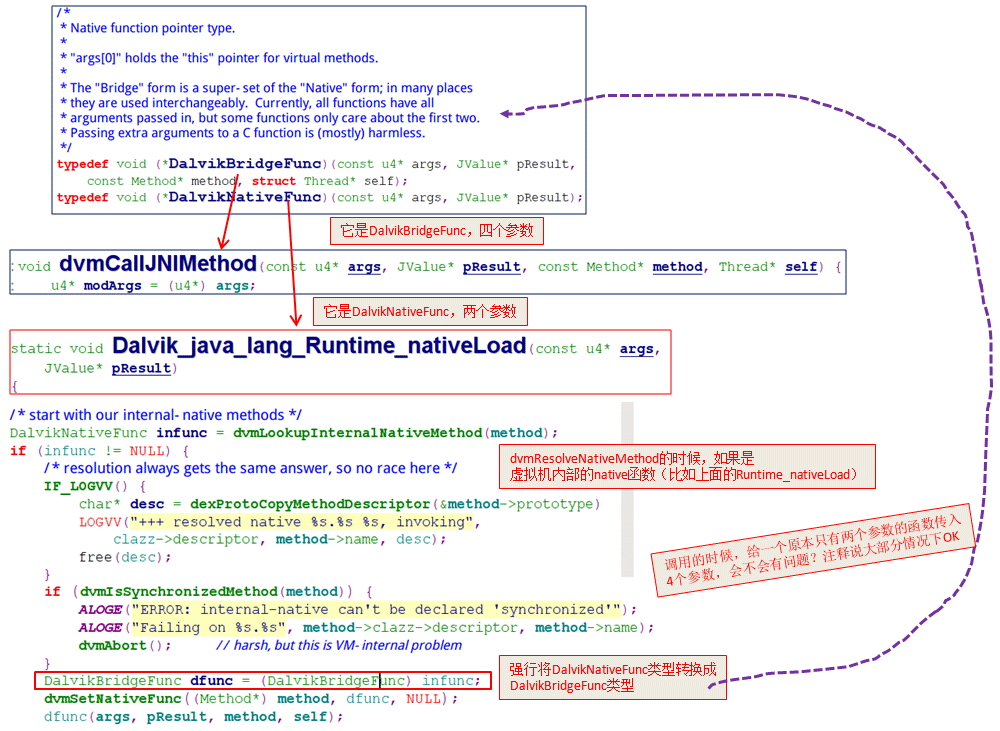

图 63 需要好好解释下：

- 首先，我们有两种类型的函数，一个是 DalvikBridgeFunc，这个函数有四个参数。一个是 DalvikNativeFunc，这个函数有两个参数。
- dvmResolveNativeMethod 或者是 dvmCallJNIMethod 都属于 DalvikBridgeFunc 类型。
- 不过，如果是 dalvik 内部注册的 native 函数时候，比如 Dalvik_java_lang_Runtime_nativeLoad 这样的，它就属于 dalvik 内部注册的 native 函数，这个函数的类型就是 DalvikNativeFunc。参考图 61 右上角。也就是说，Android 为 java.lang.Runtime.nativeLoad 这个 java 层的 native 函数设置了一个 native 层的实现，这个实现就是 Dalvik_java_lang_Runtime_nativeLoad。
- 接着，这个函数被强制转换成 DalvikBridgeFunc 类型，并且设置到了 Method->nativeFunc 上。

这种做法会造成什么后果呢？

- dvmCallMethodV 发现自己调用的是 native 函数时候，直接调用 Method->nativeFunc，也就是说，要么调用到 dvmCallJNIMethod（或者是 dvmResolveNativeMethod，姑且不论它）要么就直接调用到 Dalvik_java_lang_Runtime_nativeLoad 上了。

注意喔，这两个函数的参数一个是四个参数，一个是两个参数。不过注释中说了，给一个只有两个参数的函数传 4 个参数没有问题…

等等，这么做的好处是什么？

- 原来，dvmCallJNIMethod 干了好多杂事，比如参数解析，参数入栈，然后才是通过 dvmPlatformInvoke 来调用真正的 native 层函数。而且还要对返回值进行处理。
- fastJni 模式下，直接调用对应的函数（比如 Dalvik_java_lang_Runtime_nativeLoad），这样就没必要做什么参数入栈之类，也不用借助 dvmPlatformInvoke 再跳转了，肯定比 dvmCallMethod 省了不少时间。

当然，fastJni 模式是有要求的，比如是静态，而且非 synchronized 函数。Anyway，目前这么高级的功能还是只有虚拟机自己用，没放开给应用层。

## 八 dalvik 虚拟机小结

本篇是我第一次细致观察 Android 上 Java 虚拟机的实现，起因是想知道 xposed 的原理。我们下一篇会分析 xposed 的原理，其实蛮简单。因为 xposed 只涉及到了函数调用，hook 之类的东西，没有虚拟机里什么内存管理，线程管理之类的。所以，我们这两篇文章都不会涉及内存管理，线程管理之类的高级玩意儿。

简单点说，本章介绍得和 dalvik 相关的内容还是比较好理解。希望各位先看看，有个感性认识，为将来我们搞更深入的研究而打点基础。

- [参考文档](http://elinux.org/images/d/d9/A_deep_dive_into_dex_file_format--chiossi.pdf)。
- 很详细的[关于 dex 文件的中文介绍](http://www.blogfshare.com/dex-format.html)。
- dex/odex 指令集可参考[这里](http://pallergabor.uw.hu/androidblog/dalvik_opcodes.html)。
- [解释器中对标号的使用](http://www.cnblogs.com/openix/archive/2012/12/14/2818495.html)。
- 深入理解 Android 卷 1 和卷 2 的电子版已经全部公开，卷 1 第四章内容请参考[这里](http://blog.csdn.net/innost/article/details/47207845)。

2015 年 12 月 14 日 04:50

