# ELF文件结构详解

url：http://www.wireghost.cn/2015/04/01/ELF%E6%96%87%E4%BB%B6%E7%BB%93%E6%9E%84%E8%AF%A6%E8%A7%A3/

## 链接与装载视图

Elf文件有2个平行视角：一个是程序链接角度，一个是程序装载角度。从链接的角度来看，Elf文件是按“Section”（节）的形式存储；而在装载的角度上，Elf文件又可以按“Segment”（段）来划分。实际上，Section和Segment难以从中文的翻译上加以区分。因为很多时候Section也被翻译成段，比如Section Header Table，有的资料叫段表、有的称为节区。后面在讲解时，就不对其加以区分。。

## 关于动态链接与静态链接

链接分为2种方式：一种是静态链接、一种是动态链接。
静态链接是在编译链接时直接将需要执行的代码拷贝到调用处；动态链接则是在编译的时候不直接拷贝可执行代码，而是通过记录一系列符号和参数，在程序运行或加载时将这些信息传递给操作系统，由系统负责将所需的动态库加载到内存，然后当程序运行到指定的代码时，去共享执行内存中已经加载的动态库可执行代码，最终达到运行时链接的目的。
程序是静态链接还是动态链接，由编译器的链接参数指定。具体来说，在Android上用C++进行ndk编程时，可以通过设置Application.mk的相关内容，将相应的运行库作为动态库或静态库。

## 编写例子so

为了方便自己学习和记忆，编写了一个例子so。这里我仅贴了部分代码，用于后面的分析与测试。

## 目标文件中的数据类型

在介绍Elf文件格式前，先看看Elf文件中用到的数据类型：

| Name          | Size |
| :------------ | :--- |
| Elf32_Addr    | 4    |
| Elf32_Half    | 2    |
| Elf32_Off     | 4    |
| Elf32_Sword   | 4    |
| Elf32_Word    | 4    |
| unsigned char | 1    |

## Elf文件头

Elf文件头描述了整个文件基本属性，如段表偏移、程序头部偏移等重要信息。它的定义如下：
[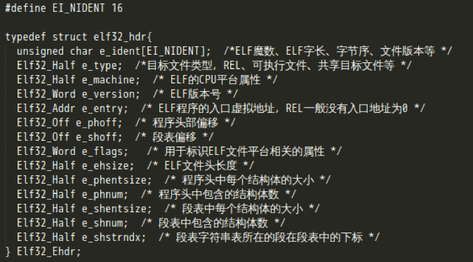](http://www.wireghost.cn/2015/04/01/ELF文件结构详解/4.png)[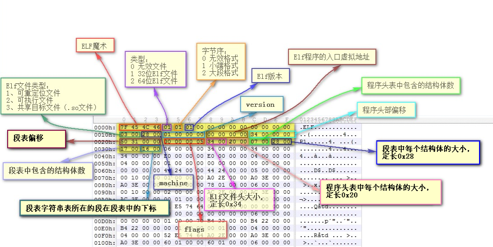](http://www.wireghost.cn/2015/04/01/ELF文件结构详解/5.png)

## 节区头部（段表）

前面有提过，Elf文件链接时是以Section的形式进行存储。其中，节区头部（段表）就是保存这些Section基本属性的结构。它描述了Elf中各个节的信息，比如每个节的名称、长度、在文件中的偏移、读写权限及其他属性，是一个以Elf32_Shdr结构体为元素的数组，而这个结构体又被称为段描述符。
因为sh_name是在段表字符串表中的索引，所以实际在解析时需要先定位到.shstrtab表，该表是专门用来存放Section名称的字符串表。而它对应的描述符在段表数组中的下标，则在Elf文件头中有给出，通常都是最后一个下标。在拿到节区名称后，再通过sh_offset、sh_size确定每一个节区在文件中的位置与长度。
最后，用readelf命令来查看下目标文件中的段，对照相应输出来分析确认段表结构(PS：段表数组中，第一个元素总是无效的描述符，全部为0)
[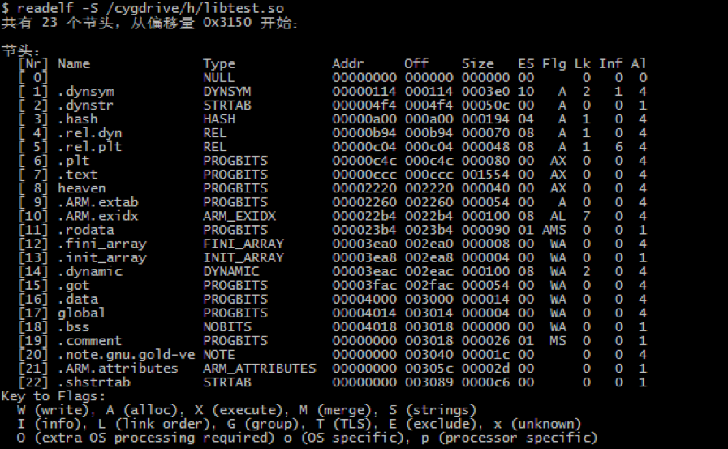](http://www.wireghost.cn/2015/04/01/ELF文件结构详解/8.png)

## 代码段

.text代码段中保存程序指令，具体可以去查看arm、thumb指令集的opcode。。
[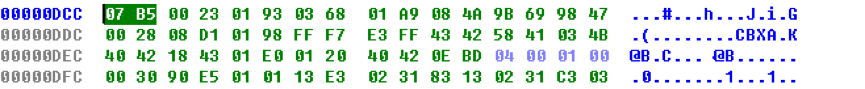](http://www.wireghost.cn/2015/04/01/ELF文件结构详解/9.png)[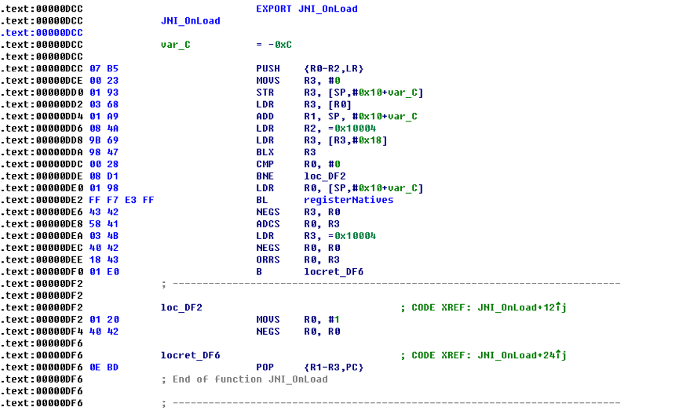](http://www.wireghost.cn/2015/04/01/ELF文件结构详解/10.png)

## 数据段和只读数据段

“.rodata”段存放的是只读数据，一般是程序里的只读变量（如const修饰的变量）和字符串常量；”.data”段保存的是已经初始化的全局静态变量和局部静态变量。
PS：有时候编译器会把字符串常量放到”.data”段，而不是单独放到”.rodata”只读数据段。

## BSS段

.bss段中存放的是未初始化的全局变量和局部静态变量，这个Section在Elf文件中没有被分配空间。。

## 自定义section

在声明一个函数或变量时，可以加上**attribute**((section(“自定义section名”)))前缀的方式，将其添加到自定义段。

## 字符串表

Elf文件中用到的字符串，如段名、函数名、变量名称等，均保存在字符串表中。其中，shstrtab段表字符串表仅用来保存段名，而strtab或dynstr section则是存放普通字符串，如函数、变量名等符号名称，字符串之间以”00”截断。。
[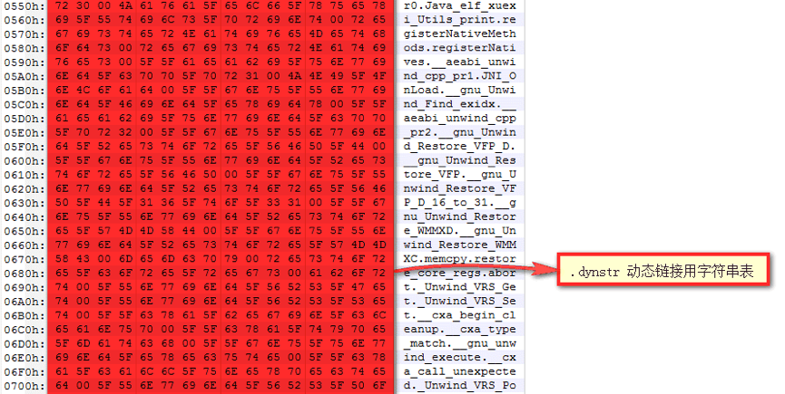](http://www.wireghost.cn/2015/04/01/ELF文件结构详解/11.png)

## 符号表

在链接过程中，函数和变量统称为符号，函数名或变量名就是符号名。符号表的段名为symtab或dynsym，它是一个Elf32_Sym结构的数组。
[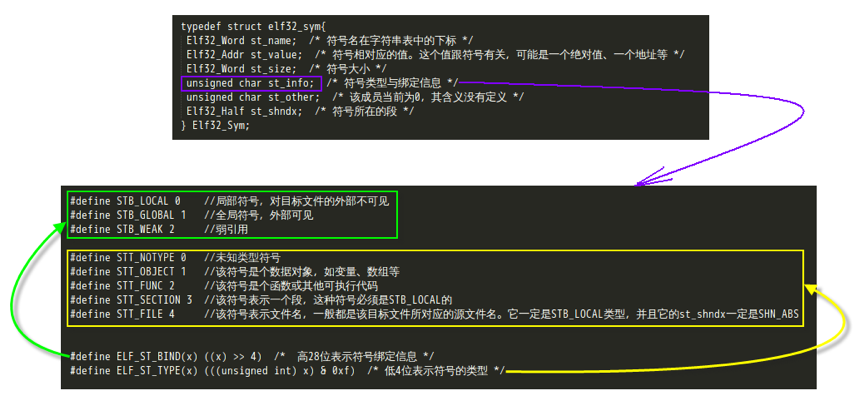](http://www.wireghost.cn/2015/04/01/ELF文件结构详解/12.png)使用readelf命令来查看目标文件的符号信息：
[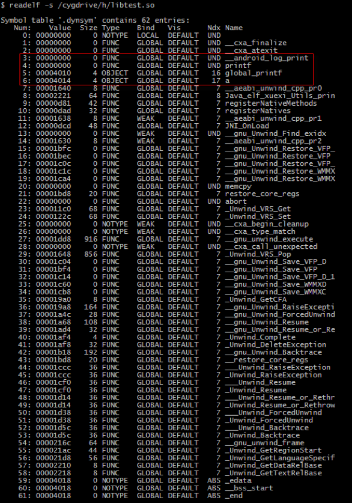](http://www.wireghost.cn/2015/04/01/ELF文件结构详解/13.png)从以上输出可以看到，第一个元素即下标为0的符号，总是一个未定义的符号。
其中st_size符号大小，它的取值有以下几种情况：对于数据类型的符号，它的值为该数据类型的大小；对于函数类型的符号，它的值为该方法的长度；如果该值为0，表示该符号大小为0或未知。
一般情况下，st_value符号值，为相应符号的偏移（“COMMON”块除外，表示该符号的对齐属性）。如本地定义的JNI_OnLoad方法，这个符号的值为0xdcd，实际上这个函数的地址就是0xdcc（因为指令集的切换加1）。
此外，让我们注意下红框中的几个符号。其中printf、__android_log_print这2个符号因为定义在其他库文件中，所以对应的符号值和大小都是0；而全局变量a和声明的全局函数指针global_printf的符号值，分别为0x4010、0x4014，都已经超过了文件长度，那么这些值实际上是在表示什么呢？通过动态调试，我们得知它其实是程序在内存中的虚拟地址。
[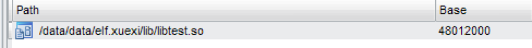](http://www.wireghost.cn/2015/04/01/ELF文件结构详解/14.png)[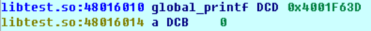](http://www.wireghost.cn/2015/04/01/ELF文件结构详解/15.png)这里再简单说明下，在链接过程中，链接器并不关心模块内部的非导出符号，如start这个函数。它是通过本地注册的方式声明的，实际寻址时可以通过registerNatives找到该方法，像这种函数会被编译器优化掉，变成偏移。
[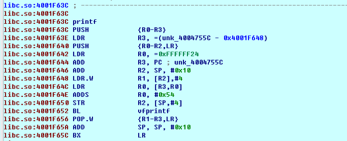](http://www.wireghost.cn/2015/04/01/ELF文件结构详解/16.png)PS：对符号表的理解，是elf hook的基础（导出表、导入表Hook）

## 程序解释器

“.interp”段用于指定解释器路径，里面保存的就是一个字符串，Android下固定为”/system/bin/linker”[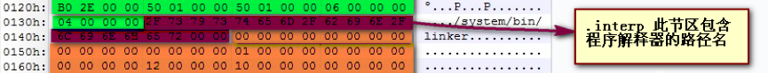](http://www.wireghost.cn/2015/04/01/ELF文件结构详解/17.png)

## 全局偏移表（GOT）

在位置无关代码中，一般不能包含绝对虚拟地址。当在程序中引用某个共享库中的符号时，编译链接阶段并不知道这个符号的具体位置，如上面的__android_log_print，只有等到动态链接器将所需要的共享库加载到内存后，也就是运行阶段，符号的地址才会最终确定。因此，需要有一个数据结构来保存符号的绝对地址，这便是GOT表。这样，程序就可以通过引用GOT来获得某个符号的地址。
在Linux下，GOT被拆分成”.got”和”.got.plt”2个表。其中”.got”用来保存全局变量引用的地址，”.got.plt”用来保存函数引用的地址。此外，”.got.plt”的前三项保留，用于存放特殊的数据结构地址：第一项保存的是”.dynamic”动态节区的地址；第二项保存的是本模块ID，指向已经加载的共享库的链表地址（前面提到加载的共享库会形成一个链表）；第三项保存的是_dl*runtime* resolve函数的地址（用于查找指定模块下的特定方法）.
而在Android平台，got表并没有细分”.got”、”.got.plt”，但仔细观察可以发现，它其实有通过_GLOBAL_OFFSET*TABLE*来区分上下两个结构。。
[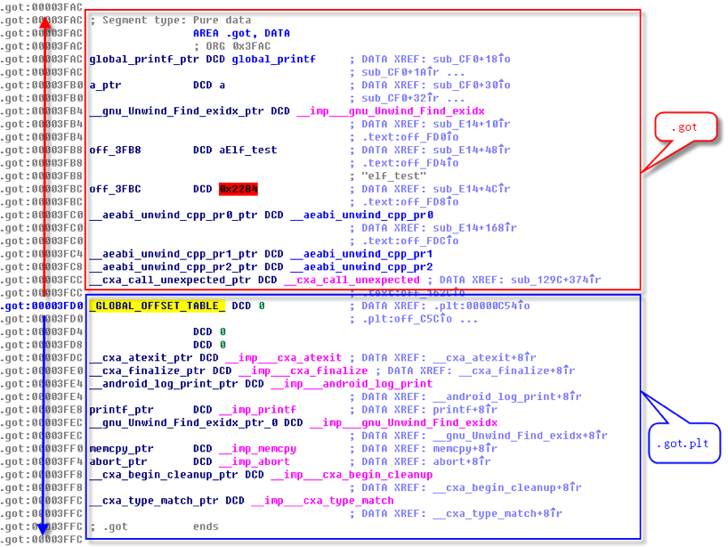](http://www.wireghost.cn/2015/04/01/ELF文件结构详解/18.png)

## 过程链接表（PLT）

在支持懒绑定的情况下，当发生对外部函数的调用时，程序会通过PLT表将控制交给动态链接器，后者解析出函数的绝对地址，修改GOT中相应的值，之后的调用将不再需要链接器的绑定。Android虽然内核基于Linux，但其动态链接机制却不是ld.so而是自带的linker。由于linker是不支持懒绑定的，所以在进程初始化时，动态链接器首先解析出外部过程引用的绝对地址，一次性的修改所有相应的GOT表项。
基于上文的说明，再来简单分析下Android平台中Elf文件的PLT过程链接表。可以发现，plt其实也是代码段，除PLT[0]外，其它所有PLT项的形式都一样，且包括PLT[0]在内的每个表项都占16个字节，所以整个PLT就像个数组。其中，PLT[0]内容固定，跳转到GOT[2]即_dl*runtime* resolve函数，查找特定模块下的指定方法，并填充到GOT表。而其他PLT普通表项则相当于一个函数的桩函数（stub），通过引用GOT表中函数的绝对地址，来把控制转移到实际的函数。
PS：这一部分知识可以用来实现GOT、PLT表hook，即导入表hook。。
[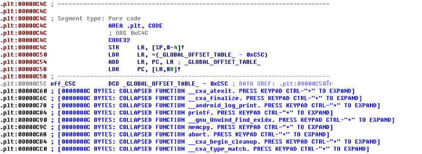](http://www.wireghost.cn/2015/04/01/ELF文件结构详解/19.png)[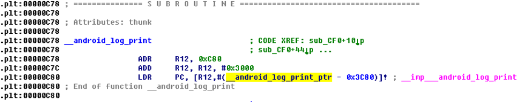](http://www.wireghost.cn/2015/04/01/ELF文件结构详解/20.png)[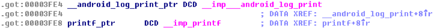](http://www.wireghost.cn/2015/04/01/ELF文件结构详解/21.png)

## 重定位表

在前面介绍符号表、got表、plt表时，其实就已经涉及到了重定位。重定位是将符号引用与符号定义进行链接的过程。例如，当程序调用了一个函数时，相关的调用指令必须把控制传输到适当的目标执行地址。
在Elf文件中，以”.rel”或”.rela”开头的section就是一个重定位段。它是一个Elf32_Rel结构数组，每个元素对应一个重定位入口。
本例中的重定位表是”.rel.dyn”和”.rel.plt”，它们分别相当于静态链接中的”.rel.data”和”.rel.text”。”.rel.dyn”实际上是对数据引用的修正，它所修正的位置相当于”.got “以及数据段；而”.rel.plt”则是对函数引用的修正，所修正的位置位于”.got.plt”。然后，使用”readelf -r”命令，查看重定位表，并依此进行对比分析。。
[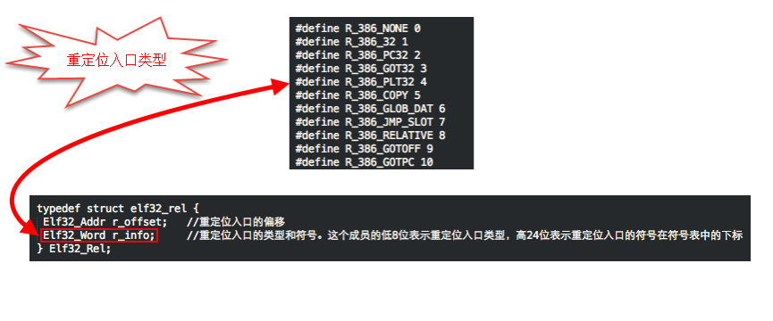](http://www.wireghost.cn/2015/04/01/ELF文件结构详解/22.png)[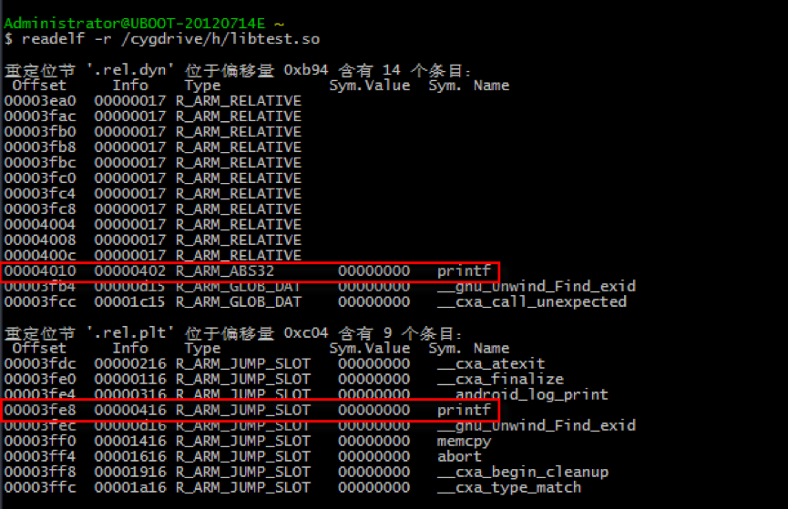](http://www.wireghost.cn/2015/04/01/ELF文件结构详解/23.png)接下来，结合代码看看Android系统的Linker是如何实现重定位的。将例子so拖到Ida中，查找到对应start方法的偏移函数。然后，将几个重要的地址先找出来，分别是：
[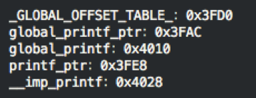](http://www.wireghost.cn/2015/04/01/ELF文件结构详解/24.png)[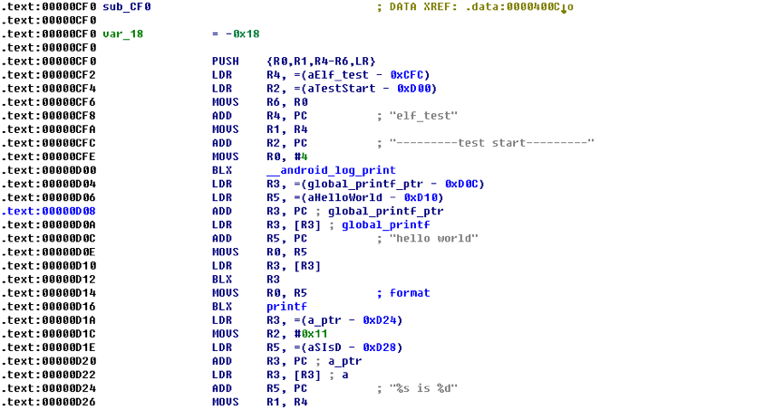](http://www.wireghost.cn/2015/04/01/ELF文件结构详解/25.png)

### 全局函数指针调用外部函数

global_printf方法是我们声明的指向printf函数的全局指针，调用global_printf方法时，R3的值是*global_printf，而global_printf的值0x4010刚好在.rel.dyn中的R_ARM_ABS32的重定位项，因此可以得出结论：通过全局函数指针的方式调用外部函数，它的重定位类型是R_ARM_ABS32，并且位于.rel.dyn 节区。
继续分析global_printf的调用流程的调用流程，首先定位到global_printf_ptr（0x3FD0），该地址位于.got 节区，GLOBAL_OFFSET_TABLE的上方。然后再通过global_printf_ptr 定位到0x4010（位于.data节区），最后再通过0x4010 定位到最终的函数地址，因此R_ARM_ABS32重定位项的Offset指向最终调用函数地址的地址（也就是函数指针的指针），整个重定位过程是先位到.got，再从.got 定位到.date。下面是.got 段区的16进制表示：
[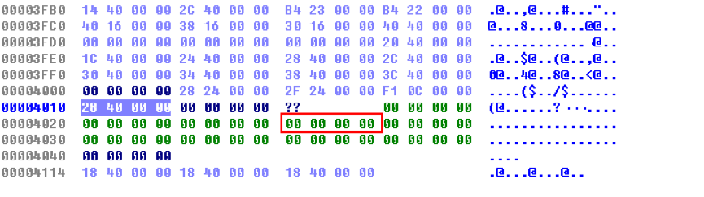](http://www.wireghost.cn/2015/04/01/ELF文件结构详解/26.png)结果发现0x4028地址中的数据全为0，当动态链接时，linker会覆盖0x00004010地址的值，指向printf的真正地址（而不是现在的0x00004028）

### 直接调用外部函数

再来看下直接调用printf函数时的情况，对应0xD16的BLX 指令，它会跳转.plt节。最后，PC指向*printf_ptr，其中printf_ptr的地址为0x3FE8，位于.got.plt 节区，而0x3FE8 地址值的正好是前面有提到的0x4028，于是可以得出结论：直接调用外部函数，它的重定位类型是R_ARM_JUMP_SLOT，位于.re.plt 节区，其Offset指向最终调用函数地址的地址（也就是函数指针的指针）。整个过程是先到.plt，再到.got，最后才定位到真正的函数地址。。
[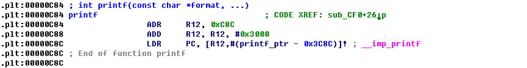](http://www.wireghost.cn/2015/04/01/ELF文件结构详解/27.png)

## 动态节区（dynamic）

Dynamic段是动态链接中Elf最重要的一个section，这里面保存了动态链接器所需的基本信息，如依赖于哪些共享对象、动态链接符号表的位置、共享对象初始化代码的地址等。
动态节区是一个数组，每个元素都是Elf32_dyn结构体。它的定义如下所示，由一个类型值加上一个附加的数值或指针，对于不同的类型，后面附加的数值或指针有着不同含义。。
[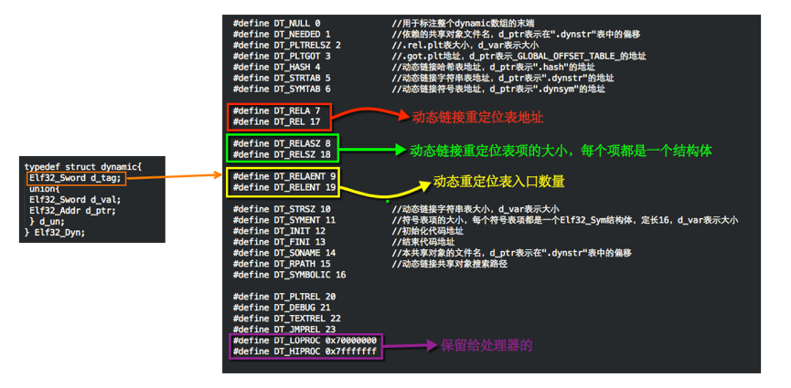](http://www.wireghost.cn/2015/04/01/ELF文件结构详解/28.png)[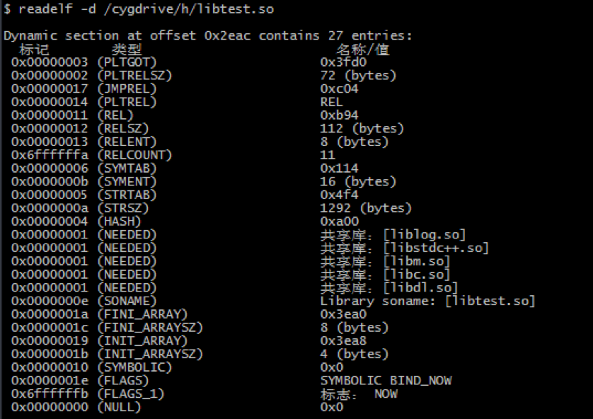](http://www.wireghost.cn/2015/04/01/ELF文件结构详解/29.png)

## 程序头表（Program Header Table）

前面已经就链接视图将重要的一些Section做了详尽解析，这里再从装载角度介绍下程序头表，它是一个以Elf32_Phdr结构体为元素的数组。
然后，再来简单介绍下Segment这个概念。因为程序在加载的过程中，是根据权限映射到内存空间的，而一个Segment可以包含一个或多个属性类似的Section。
其中，p_memsz的值不可以小于p_filesz，否则就是不符合常理的。如果p_memsz大于p_filesz，就表示该Segment在内存中所分配的空间超过在文件中的实际大小，多余的部分全部填充0，如BSS段。。
使用readelf命令查看程序头表，进行对比分析。其中第一项Program Header，用来描述程序头表自身的位置和大小；第二项和第三项为Load Segment，只有这部分会被加载到内存，并因为权限属性的不同，被划分成了多个部分（具体到这个so则是2块）。它包括代码段、数据段等；第三项是Dynamic Segment，它提供了Dynamic动态节区的偏移和大小，并通过寻址到Dynamic节进而获取动态链接器所需的基本信息。
[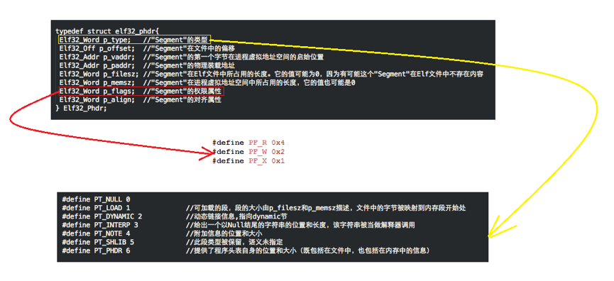](http://www.wireghost.cn/2015/04/01/ELF文件结构详解/30.png)使用“cat /proc/pid/maps”命令，查看libtest.so在内存中的映射，发现它被分成了3个子空间，继续看第二列。其中，r表示只读，w表示可写，x表示可执行，p表示私有（s表示共享）。这一部分基本对应前面的程序头表，至于为什么会多出一块只读部分，个人的理解是程序头表只是根据权限将属性相近的段划到一个Segment，加载的时候还是按照权限进行映射的。最明显的就是，rodata只读数据段和代码段放到了一个Segment，但代码段是可读可执行的。
[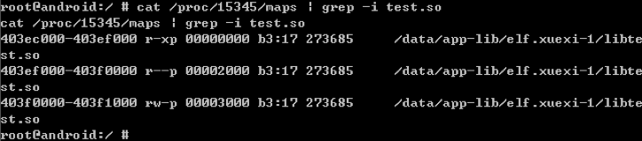](http://www.wireghost.cn/2015/04/01/ELF文件结构详解/32.png)最后，再来简单的说下页对齐。在进行内存映射时，实际是以一个“页（Page）”为单位进行映射的，而在Android平台下，页的单位为0x1000（4096）字节。这里再来看下上图中的第一行信息，libtest.so映射到内存空间中的起始地址为0x403ec000，这一块地址空间的权限为可读可执行，在程序头表中相应的Load段的大小为0x2444，二者相加为0x403EE444。但是，它的结束地址却不是0x403EE444，而是0x403ef000，多出的那一部分字节正是为了做页对齐。。

## 总结

至此，Elf文件结构的学习和总结告一段落。这部分知识，可以应用在Elf hook和Elf的加固上，其中Elf hook已经有了一个简单的认识，后续有时间我会进行相关说明并整理相应的代码实现。。