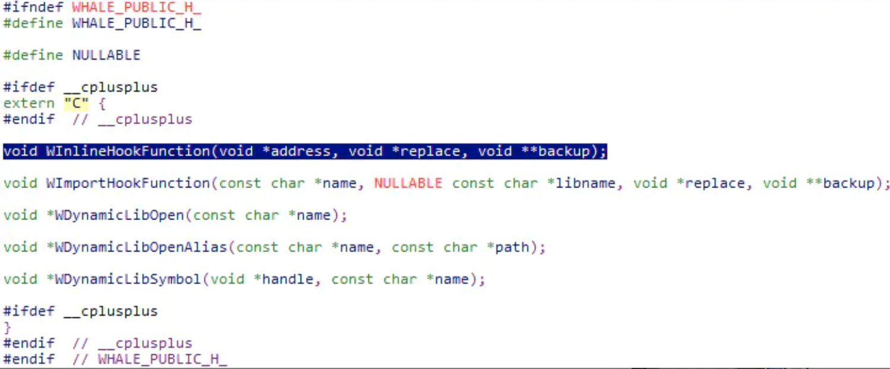
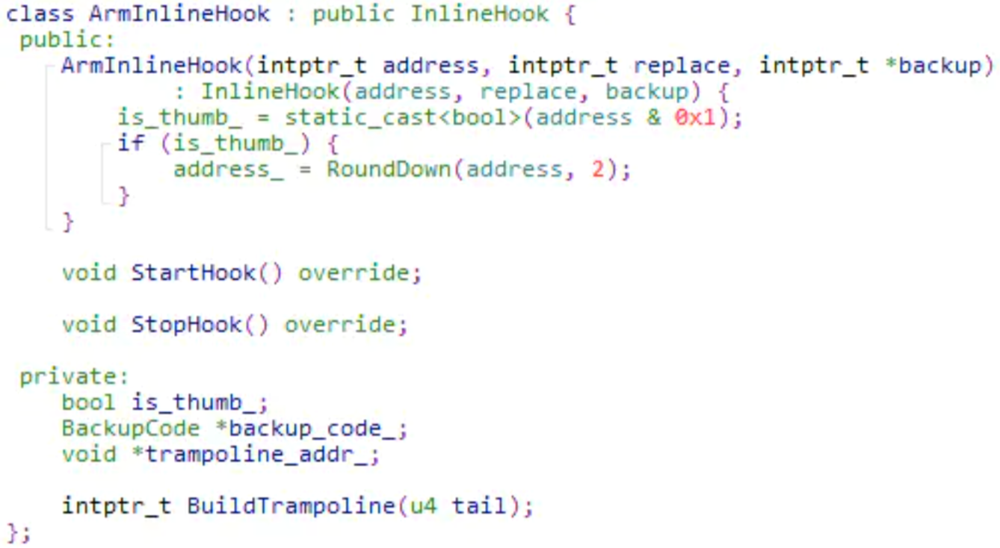
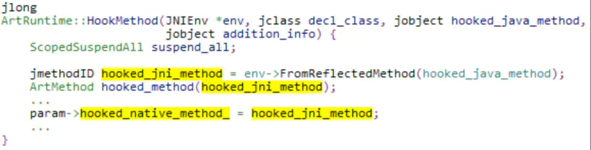
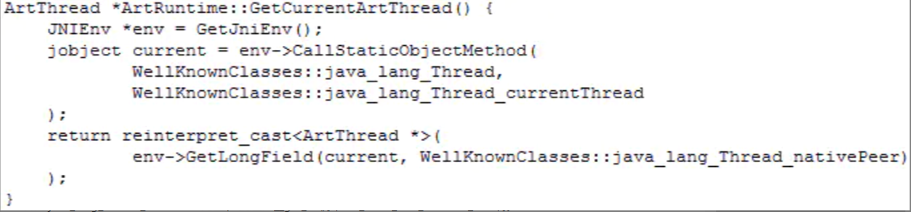

# 开源Hook框架-whale-实现浅析

url：https://www.jianshu.com/p/24dc1a15b58e

[whale](https://github.com/asLody/whale)是lody大神开源的一个Hook框架，支持ART下Java方法的HOOK，也支持native InlineHook。

本文走马观花一下。

whale支持Xposed-Style Method Hook。

Xposed Hook的代码通常这么写：

在whale的java/com/lody/whale/xposed目录中存放的是兼容Xposed风格的代码。

所以，先看一下whale的XposedHelpers.findAndHookMethod和XC_MethodHook的实现源码。

其中，findAndHookMethod用来完成Method Hook，XC_MethodHook对象用于回调。

简单看一下class XC_MethodHook：

重写XC_MethodHook的beforeHookedMethod或者afterHookedMethod，这两个方法相当于是在原方法的调用前后插桩。根据需要，把我们逻辑代码放在这两个函数中就可以了。

重点看一下XposedHelpers.findAndHookMethod。

findAndHookMethod先调用findMethodExact得到要Hook的Method对象，然后调用XposedBridge.hookMethod完成Hook。

getParameterClasses用于获取参数的Class类型：

从getParameterClasses的实现来看，参数类型不仅可以传Class，还可以直接传String。

如：Bundle.class或"android.os.Bundle "。

有了方法名和参数类型，以及实现该方法的clazz，findMethodExact的实现就很简单了：

这里还维护了一个methodCache，用于存储所有已经find过的method。

回到findAndHookMethod，继续跟踪代码，看XposedBridge.hookMethod的实现。

所有已经Hook过的method及其对应的callbacks，全部存储在sHookedMethodCallbacks中，这是一个HashMap。如果该method已经Hook过，那直接把callback回调对象加入到其对应的callbacks集合中就可以了。这样在该method被调用时，callbacks集合中所有回调都会被遍历执行。

如果该method没有被Hook过，那就调用WhaleRuntime.hookMethodNative进行Hook。

这是一个native方法，对应的代码在whale/src/android/art/native_on_load.cc中。

继续跟踪ArtRuntime::HookMethod，完成Hook的关键代码就在这里了。

这里省略了大量细节代码。先抓主干，了解基本原理。

ArtRuntime::HookMethod将被Hook的method设置为native方法，然后将Jni入口点设置为一个closure。这样当该method被调用时，就会执行这里设置的closure。因为被Hook的method已经为native，所以ArtMethod结构中的dex_code_item_offset_成员就没用了，直接清0。

另外，将quick_compiled_code和interpreter的入口点分别设置为quick_generic_jni_trampoline_和artInterpreterToCompiledCodeBridge，这样无论被Hook的方法从解释器执行，还是直接以本地指令的方式执行，最终都会执行Jni入口点，都会执行这里设置的closure。

所以，ArtRuntime::HookMethod执行之后，被Hook方法的执行就由closure接管了，这个closure是由BuildJniClosure构造的，继续跟踪该方法。

这里利用[libffi](https://github.com/libffi/libffi)根据原method的参数和返回类型构造一个jni-closure（jni函数相比原Java method会多两个参数，一个是JNIEnv*，另一个是jclass或者jobject）。

libffi是一个开源项目，可以用于动态生成遵守特定调用约定的代码。android系统源码中也有这个库（android/platform/external/libffi）。

当被Hook的method被调用时，就会执行这里构造的closure的callback，也就是FFIJniDispatcher，并将原参数传入。另外，这里创建closure时，还将ArtHookParam*类型的参数param作为userdata传入，所以FFIJniDispatcher被调用的时候，这里的参数param也会作为userdata传入。

看一下FFIJniDispatcher的实现：

FFIJniDispatcher先利用QuickArgumentBuilder将传给原methhod的所有参数存放到一个jobjectArray参数数组中。然后根据原method的返回类型，调用InvokeJavaBridge或InvokeVoidJavaBridge。

继续跟踪ArtRuntime::InvokeHookedMethodBridge：

这里是直接调用java_class_的bridge_method_方法。

java_class_和bridge_method_是在ArtRuntime::OnLoad中初始化的：

而ArtRuntime::OnLoad是被libwhale.so的JNI_Onload方法调用的。

所以，这个bridge_method_就是com/lody/whale/WhaleRuntime的handleHookedMethod方法。

继续看XposedBridge.handleHookedMethod：

beforeHookedMethod和afterHookedMethod的调用就在这里了，相当于在原函数的调用点前后各插了一个桩。

这里的callbacks是通过参数additionalInfo得到的，而参数additionalInfo是早在XposedBridge.hookMethod方法中就创建的，并一路传到了XposedBridge.handleHookedMethod。

再把上面的图重复贴一下：

在XposedBridge.handleHookedMethod中，通过XposedBridge.invokeOriginalMethod来调用原方法，继续跟踪一下：

XposedBridge.invokeOriginalMethod又调用了WhaleRuntime.invokeOriginalMethodNative。

这是一个native方法，对应源码在whale/src/android/art/native_on_load.cc中。

继续ArtRuntime::InvokeOriginalMethod：

ArtRuntime::InvokeOriginalMethod先通过参数拿到原始的method，然后通过java.lang.reflect.Method.Invoke()反射调用。

参数slot是在ArtRuntime::HookMethod方法中创建的，类型是“ArtHookParam*”，param->origin_method_中保存原method对象。

至此，Java method的Hook流程基本上跟踪完了。不过，忽略了很多值得关注和学习的细节，后面笔记再写。

除了Java method的Hook之外，whale还支持对native函数的InlineHook。

whale/include/whale.h：

在built目录下还有编译好的libwhale.so可以直接使用。

看一下WInlineHookFunction的实现：

看一下arm平台下的Hook实现ArmInlineHook：

继续看ArmInlineHook::StartHook：

native层的InlineHook都是通过在目标方法的指令开始处加跳转指令来实现的。

这块很复杂，先不看了。

ArmInlineHook的实现借助了[vixl](https://git.linaro.org/arm/vixl.git/about/)，这是一个arm平台的运行时代码生成库。android系统源码也有这个库（android/platform/external/vixl）。

记录一些实现细节。（下面贴代码时，省略了一些无关代码，并且加了一些注释）

### 一、ArtRuntime::HookMethod对被Hook的method所对应的ArtMethod对象做了什么？

见代码中的注释：

### 二、关于“原method”的执行。

首先，在ArtRuntime::HookMethod中，会根据原method克隆一个新的method，然后保存到param->origin_method_。

这里的hooked_method相当于原method对应的ArtMethod对象，然后调用ArtMethod::Clone为原method克隆了一个新的method（为了Hook，原来的ArtMethod会被修改，所以克隆一个新的保存起来）。这个新的method随着param参数，最终一路传递到ArtRuntime::InvokeOriginalMethod。

这里可以看到，原method最终是通过JNI调用java.lang.reflect.Method.invoke()反射执行的。

### 三、ArtMethod::Clone是如何实现的。

分段贴代码：

##### 第1步：先根据原ArtMethod，克隆出一个新的ArtMethod。

##### 第2步：调整access_flags。

这里把非direct方法的访问权限设置为private有什么作用？

（后来想了想，是不是防止后面调用原method时，不要去调用该method可能override的父类方法？）

另外，为什么要去除kAccSynchronized？不去除有什么影响？

（防止阻塞？）

##### 第3步：设置hotness_count和profiling_info。

备注：注释中的“b>”写错了。由GetEntryPointFromJni得到的不是新克隆出来的ArtMethod的profiling_info，而是原方法ArtMethod的profiling_info。

在Android9上，ProfilingInfo结构是这样的：

##### 第4步：对于非native方法，将compiled_code入口点设置为art_quick_to_interpreter_bridge。

这里为什么要修改compiled_code入口点？是因为前面阻止了JIT编译，所以该方法不会有compiled_code，所以将compiled_code入口点设置为art_quick_to_interpreter_bridge，由Interpreter解释执行？

##### 第5步：将jni_clone_method转换为Method对象，然后调用setAccessible，取消Java方法调用时的访问权限检查。

最后将java_method返回。

### 四、ArtRuntime::HookMethod中调用ProfileSaver::ForceProcessProfiles是何意？

是因为“hooked_method.Clone里面修改了hooked_method的profiling_info”，然后调用ProfileSaver::ForceProcessProfiles强制更新到disk？

### 五、ArtRuntime::HookMethod利用ScopedSuspendAll暂停和恢复VM。

暂停和恢复VM的工作是在ScopedSuspendAll的构造和析构函数中完成的：

实际是调用了art::Dbg::SuspendVM和art::Dbg::ResumeVM。

### 六、ArtRuntime::InvokeOriginalMethod中对于“GC可能带来的影响”的处理：

这里有一个“param->decl_class_ != decl_class”的比较，先看param->decl_class_是怎么来的：

实际就是原method（被Hook的Java method）对应的ArtMethod数据结构中的declaring_class_成员，然后保存到param，一路传递到ArtRuntime::InvokeOriginalMethod。

然后看decl_class，它是param->hooked_native_method_指向的ArtMethod数据结构中的declaring_class_成员。而param->hooked_native_method_就是原method对应的ArtMethod。

既然param->decl_class_和decl_class都是由原method对应的ArtMethod数据结构中的declaring_class_得到的，那怎么会不一样呢？按lody的注释可知是GC影响的，因为ArtMethod数据结构中的declaring_class_是一个GcRoot reference。

param->decl_class_保存的是ArtMethod以前的declaring_class_，而decl_class是该ArtMethod此刻的declaring_class_。在这期间，由于GC的影响，declaring_class_可能已经发生了变化。

发生这种情况怎么办呢？根据param->hooked_native_method_，也就是原method（被Hook的Java method）此刻对应的ArtMethod重造一个origin_method，然后再执行。

### 七、关于ArtRuntime::GetCurrentArtThread()的实现

以前是这样实现的：

但可能有的系统中java.lang.Thread类中没有nativePeer这个成员，所以后来lody修正了一下：

如果java_lang_Thread_nativePeer为空，就返回__get_tls()[7/*TLS_SLOT_ART_THREAD_SELF*/]。

这个是怎么来的呢？看一下art::Thread::Current()的实现就清楚了：

__get_tls的定义在“/bionic/libc/private/__get_tls.h”中：

### 八、whale还支持“bypass Hidden API Policy”，实现如下：

API-Level在ANDROID_O_MR1(27)以下的，因为没有Hidden API策略，所以直接返回true。否则调用ArtRuntime::EnforceDisableHiddenAPIPolicyImpl。

针对Android P预览版的处理就不看了。

在Android P的Release版上是通过InlineHook art:: hiddenapi::GetMemberActionImpl<ArtField>和art:: hiddenapi::GetMemberActionImpl<ArtMethod>来实现的。

如果传入的member是可访问的话，这两个函数会返回kAllow。

而被劫持之后，成了下面这样：

无论传入的什么，都返回false。false是0，相当于kAllow。

另外，在ArtRuntime::EnforceDisableHiddenAPIPolicyImpl的开头还有下面这段代码，这是什么意思呢？

我的理解是：java.lang.Object的shadow$*klass*成员应该是受hiddenapi策略保护的，这里是想先测试一下，如果能够获取shadow$*klass*的fieldID，说明在当前系统中，没有启动hiddenapi保护，那就直接返回true就可以了，不需要进行InlineHook强行Disable了。

