# epic-实现浅析

url：https://www.jianshu.com/p/deec463a72f6

[epic](https://links.jianshu.com/go?to=https%3A%2F%2Fgithub.com%2Ftiann%2Fepic)是weishu大神开源的一个Hook框架，支持ART上的Java方法HOOK。实现原理：[http://weishu.me/2017/11/23/dexposed-on-art/](https://links.jianshu.com/go?to=http%3A%2F%2Fweishu.me%2F2017%2F11%2F23%2Fdexposed-on-art%2F)

本文走马观花一下。

epic相当于ART上的Dexposed，所以也是Xposed-Style Method Hook。从DexposedBridge.findAndHookMethod开始跟踪代码：

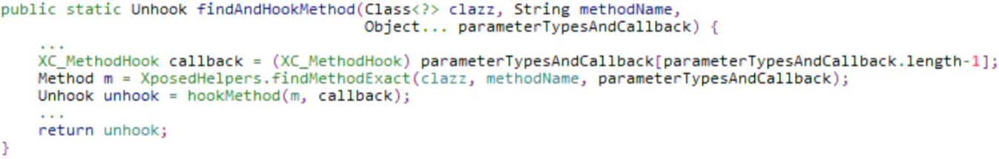

取出最后一个参数callback，然后调用XposedHelpers.findMethodExact得到想要Hook的method，最后调用DexposedBridge.hookMethod进行Hook。

XposedHelpers.findMethodExact的实现在[之前的笔记](https://www.jianshu.com/p/24dc1a15b58e)中已经看过了，这里不看了。

直接看DexposedBridge.hookMethod：

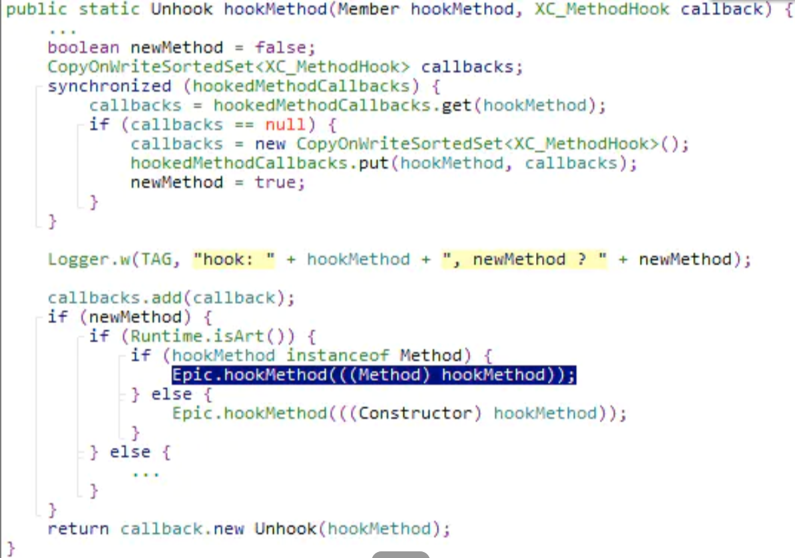

所有已经Hook过的method及其对应的callbacks，全部存储在hookedMethodCallbacks中，这是一个HashMap。如果该method已经Hook过，那直接把callback回调对象加入到其对应的callbacks集合中就可以了。这样在该method被调用时，callbacks集合中所有回调都会被遍历执行。

如果该method没有被Hook过，那就调用Epic.hookMethod进行Hook。

（这里以Method为例，Constructor的Hook大同小异）

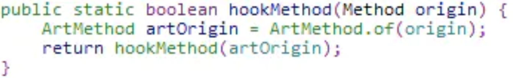

先看一下ArtMethod.of：

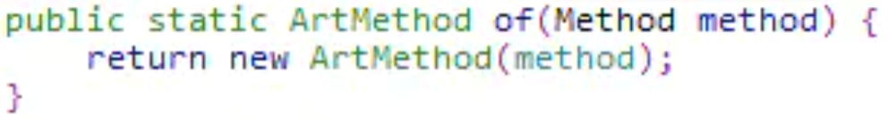

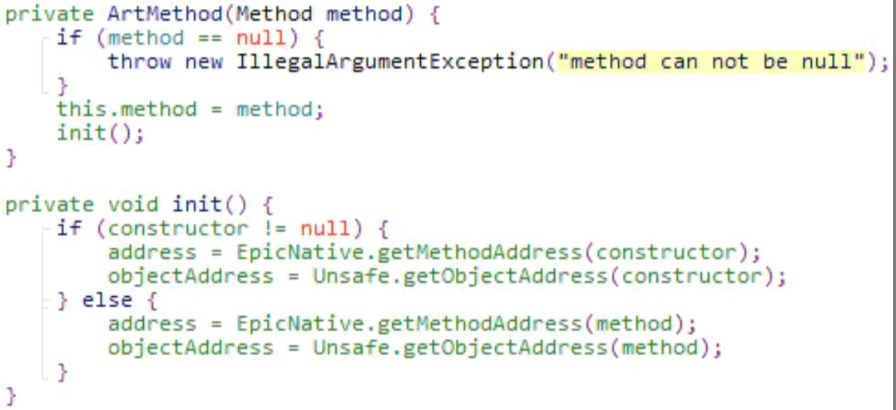

ArtMethod.of是以Method对象作为参数，创建一个me.weishu.epic.art.Epic.ArtMethod对象。

- artOrigin. method保存原始的Java Method对象。
- artOrigin. address保存的是原始的Method对象在ART中对应的art::mirror::ArtMethod对象的地址。
- artOrigin. objectAddress保存的是原始的Java Method对象（Java Object）在内存中的地址。

（EpicNative.getMethodAddress和Unsafe.getObjectAddress的实现代码先不贴了。getMethodAddress的实现很简单，getObjectAddress的实现稍复杂，但也不难理解。这里先跟踪主要代码，忽略旁枝末节。）

继续看Epic.hookMethod(ArtMethod artOrigin)：

（这个函数的实现有点长，分段贴）

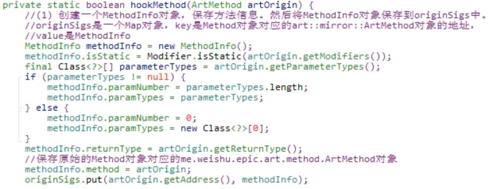

首先创建一个MethodInfo对象，用于保存方法信息。其中methodInfo.method保存了原始的Method对象对应的me.weishu.epic.art.method.ArtMethod对象。

然后将MethodInfo对象保存到originSigs中。originSigs是一个Map对象，key是Method对象对应的art::mirror::ArtMethod对象的地址，value是MethodInfo。

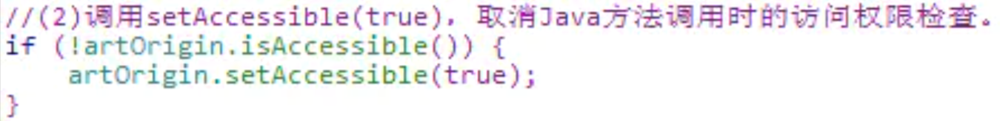

调用setAccessible(true)，取消Java方法调用时的访问权限检查。

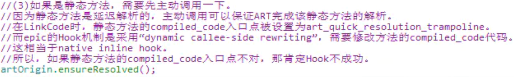

调用ensureResolved，保证静态方法完成解析。为什么要这么干，已经写在注释里了。

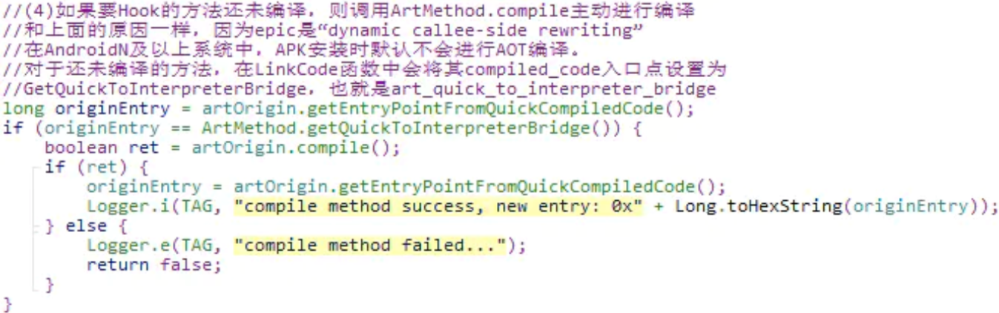

如果要Hook的方法还未编译，则调用ArtMethod.compile主动进行编译，这么做也是因为epic是“dynamic callee-side rewriting”。

ArtMethod.compile是通过调用JIT的[jit_compile_method](https://www.jianshu.com/p/e5e58596d27c)来完成方法编译的。

最后，compiled_code入口点会保存到originEntry变量中。

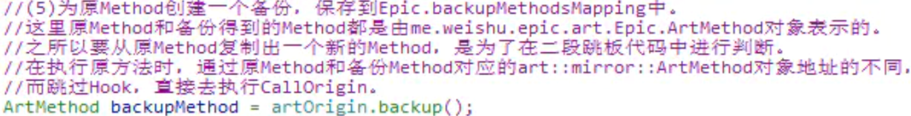

为原Method创建一个备份，保存到Epic.backupMethodsMapping中。

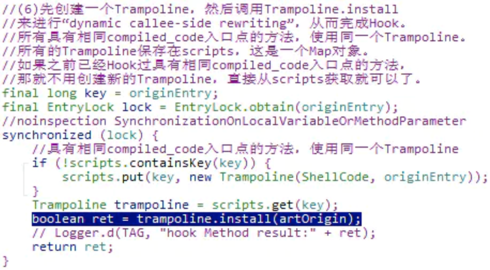

前面是铺垫，最重要的一步来了，具体看注释。

哪些不同的Java方法会具有相同的compiled_code入口点呢？

1、所有ART版本上未被resolve的static函数

2、Android N 以上的未被编译的所有函数

3、代码逻辑一模一样的函数

4、JNI函数

其中，情况1和2在上面已经处理过了，应该不会遇到了，剩下3和4。

对于JNI函数，因为不会涉及到字节码编译，也没有对应的compiled_code，所以其compiled_code入口点会统一设置为GetQuickGenericJniStub，即art_quick_generic_jni_trampoline。

继续跟Trampoline.install，看看是如何安装跳板代码来最终完成Hook的。

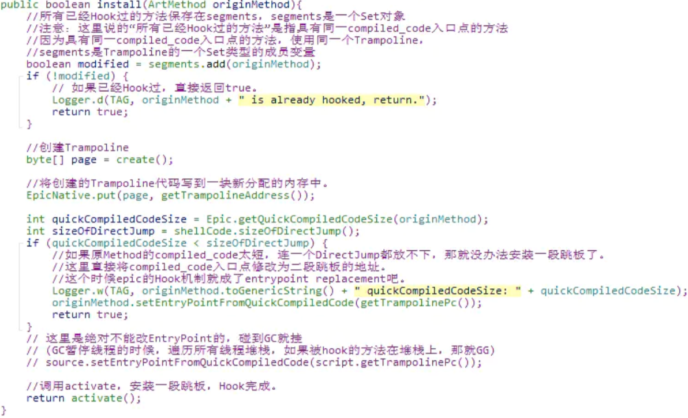

这个函数的功能描述已经写到注释里了。核心操作有两点：

1）创建Trampoline（包括“二段跳板”BridgeJump，和CallOrigin）

2）创建和安装“一段跳板”，完成Hook。

简单看一下epic的基本原理图：

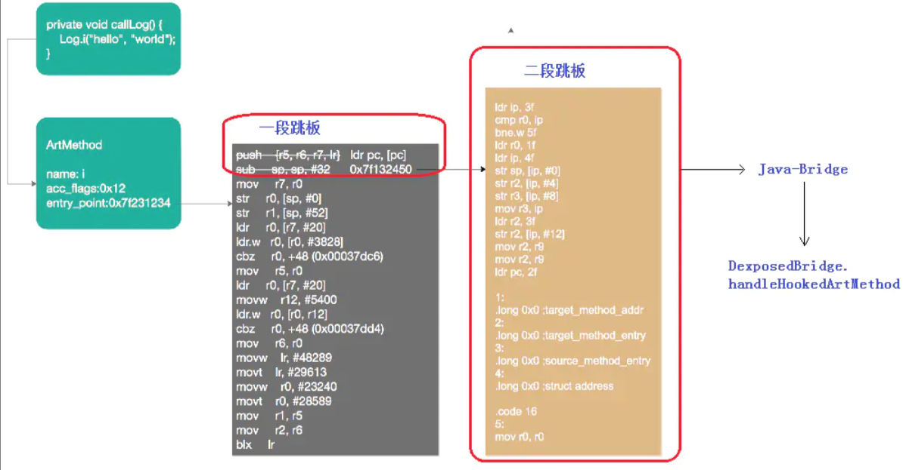

epic的Hook机制是“dynamic callee-side rewriting”。具体点说：

1）保证要Hook的method完成compile，也就是运行时要执行其compiled_code。

2）根据要Hook的method对应的art::mirror::ArtMethod找到compiled_code入口点。

3）在compiled_code的开始位置放置一段很短的跳转代码，称为“一段跳板”，作用是跳转到二段跳板。之所以弄一个一段跳板，是怕二段跳板太长，原方法的compiled_code区域放不下。

4）二段跳板会将一些必要的参数打包，调用Java-Bridge方法，并将打包在一起的参数，通过r3传递给Java-Bridge。

5）Java-Bridge方法取出传递进来的参数，然后根据r1、r2、r3以及sp（以Thumb2为例，除了r0~r3，剩余的参数会通过sp传递），构造出原方法的参数，最后调用DexposedBridge.handleHookedArtMethod。

6）由DexposedBridge.handleHookedArtMethod调用beforeHookedMethod、原方法和afterHookedMethod。

二段跳板的创建由Trampoline.create方法完成，一段跳板的创建和安装由Trampoline. activate方法完成。

先看Trampoline.create：

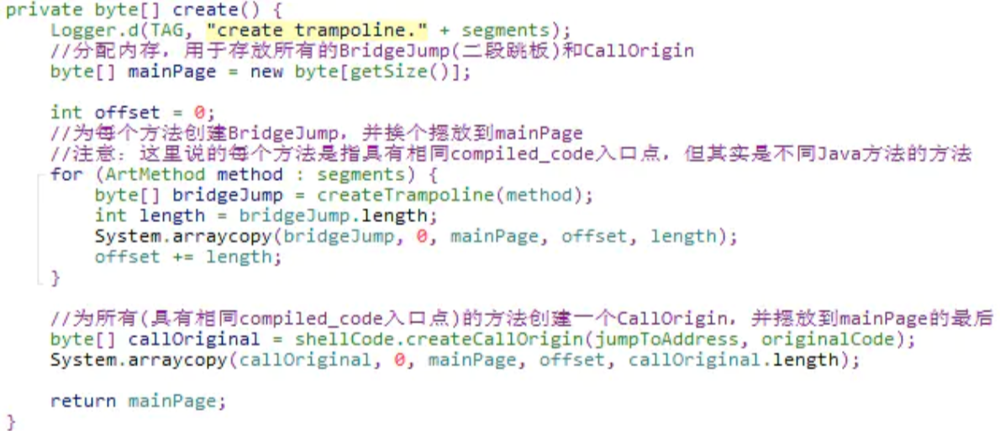

那这里创建的BridgeJump（二段跳板）和CallOrigin是什么样子的呢？分别看一下Trampoline. createTrampoline和shellCode.createCallOrigin方法。

先看Trampoline. createTrampoline：

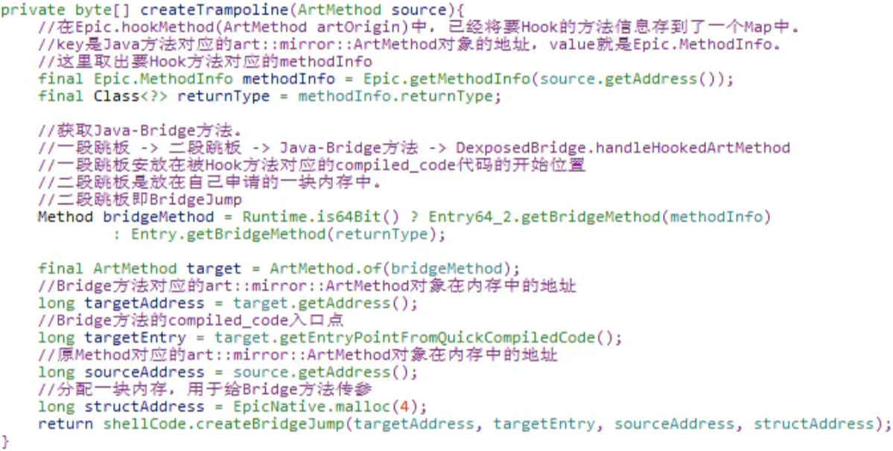

先调用Entry.getBridgeMethod返回一个Bridge方法，这个Bridge是一个Java方法。然后调用shellCode.createBridgeJump创建BridgeJump（二段跳板）。

我们先看shellCode.createBridgeJump（以Thumb2为例）创建的BridgeJump（二段跳板），然后再去看Entry.getBridgeMethod返回的Bridge方法。调用shellCode.createBridgeJump时传入的各个参数的含义已经写到注释里了。

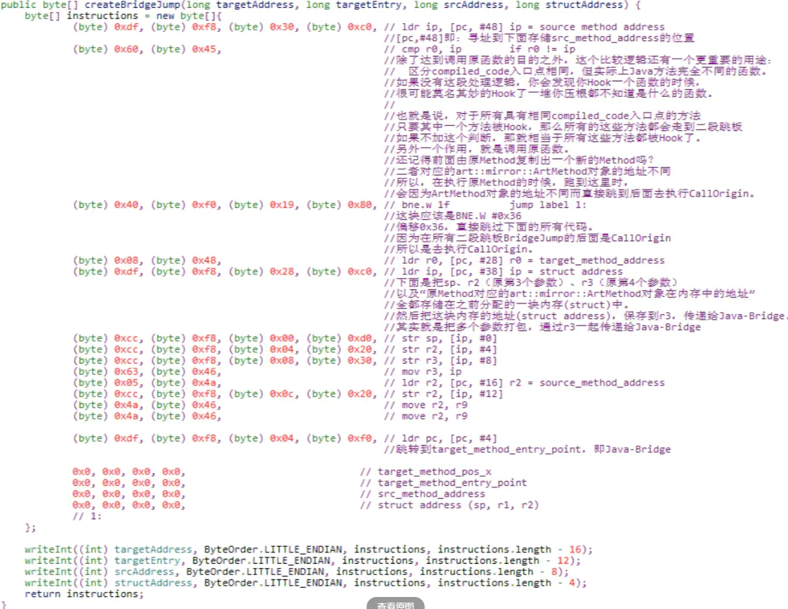

这里创建的就是上面原理图中的二段跳板代码，详情看注释。重点有两处：

1）art::mirror::ArtMethod对象地址的比较

2）打包参数，然后跳转到Java-Bridge，打包之后的参数通过r3传递。

现在可以去看上面由Entry.getBridgeMethod返回的Bridge方法了（以32位运行时为例）。

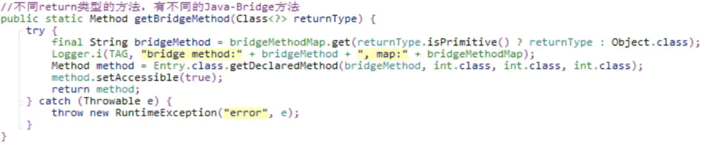

假设returnType是Object.class，那么返回的Bridge方法就是Entry.referenceBridge：

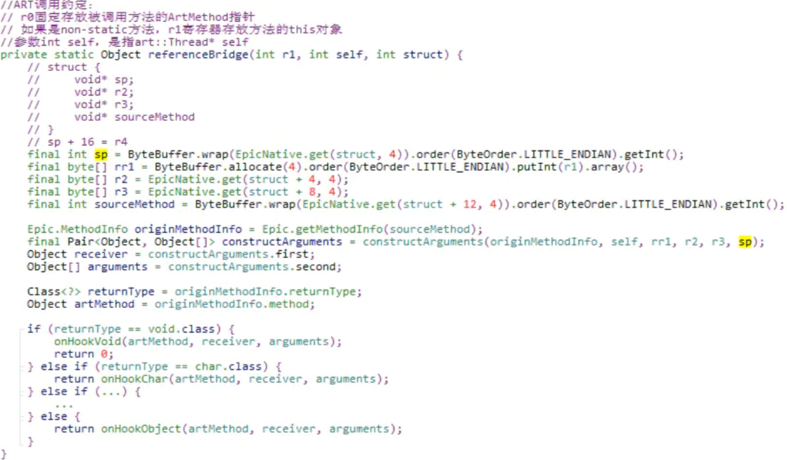

从前面的二段跳板代码可知，传递给referenceBridge的第3个参数struct是一个结构体指针。

按照之前的规则，依次取出sp、r2、r3和sourceMethod。sourceMethod是原Method对应的art::mirror::ArtMethod对象在内存中的地址。然后根据r1、r2、r3以及self、sp（以Thumb2为例，除了r0~r3，剩余的参数会通过sp传递），构造出原方法的参数。然后根据returnType的不同，分别调用onHookXXX函数。

Entry.constructArguments的实现逻辑不难理解，但是从weishu大神的处理来看，不同情况下的兼容还是最头疼的问题。

还是假设returnType是Object.class，看一下Entry. onHookObject：

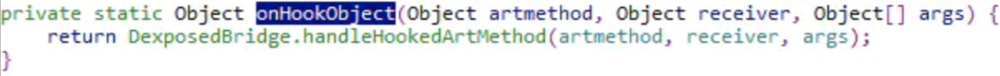

其实就是调用了DexposedBridge.handleHookedArtMethod。

DexposedBridge.handleHookedArtMethod的逻辑，熟悉Xposed的人应该都很熟悉。前面的[whale笔记](https://www.jianshu.com/p/24dc1a15b58e)也跟踪过代码了，这里就不看了。beforeHookedMethod、原方法和afterHookedMethod都是在DexposedBridge.handleHookedArtMethod里面调用的。

回到Trampoline.create，再看一下shellCode.createCallOrigin：

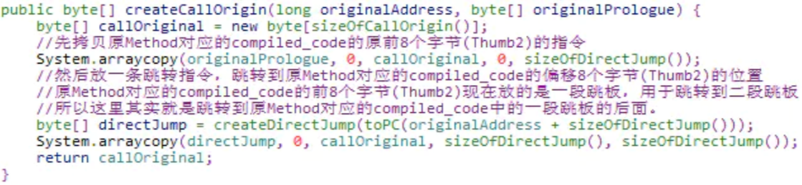

创建CallOrigin的逻辑就比较简单了，先是compiled_code的原前8个字节的指令（以Thumb2为例），然后是一条跳转指令，跳转到原Method对应的compiled_code的偏移8个字节的位置，也就是一段跳板代码的后面，去执行原Method的compiled_code中剩余的指令。

最后，再回到Trampoline.install，看一下Trampoline. activate是如何创建和安装一段跳板的。

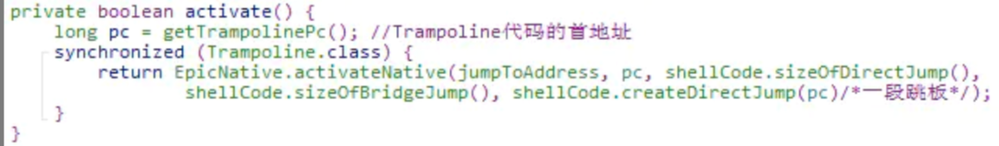

Trampoline. activate直接调用EpicNative.activateNative。

1）参数jumpToAddress原Method的compiled_code入口点。

2）参数是pc是Trampoline代码的首地址，即：前面创建的一块内存，里面是二段跳板BridgeJump和CallOrigin。

3）最后一个参数是一段跳板代码，由shellCode.createDirectJump(pc)创建。

看一下shellCode.createDirectJump是如何创建一段跳板的（以Thumb2为例）：

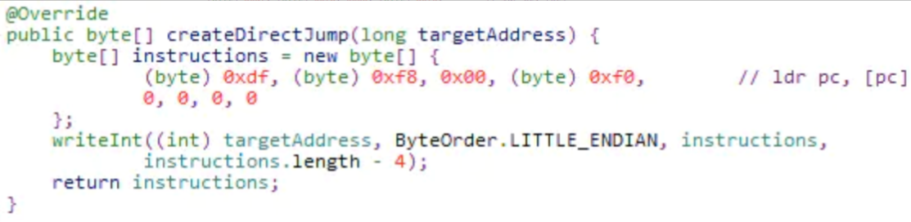

很简单，就是一条ldr指令，将要跳转的地址（二段跳板的代码地址）赋给pc。

最后，看一下EpicNative.activateNative，这是一个native方法，实现代码如下：

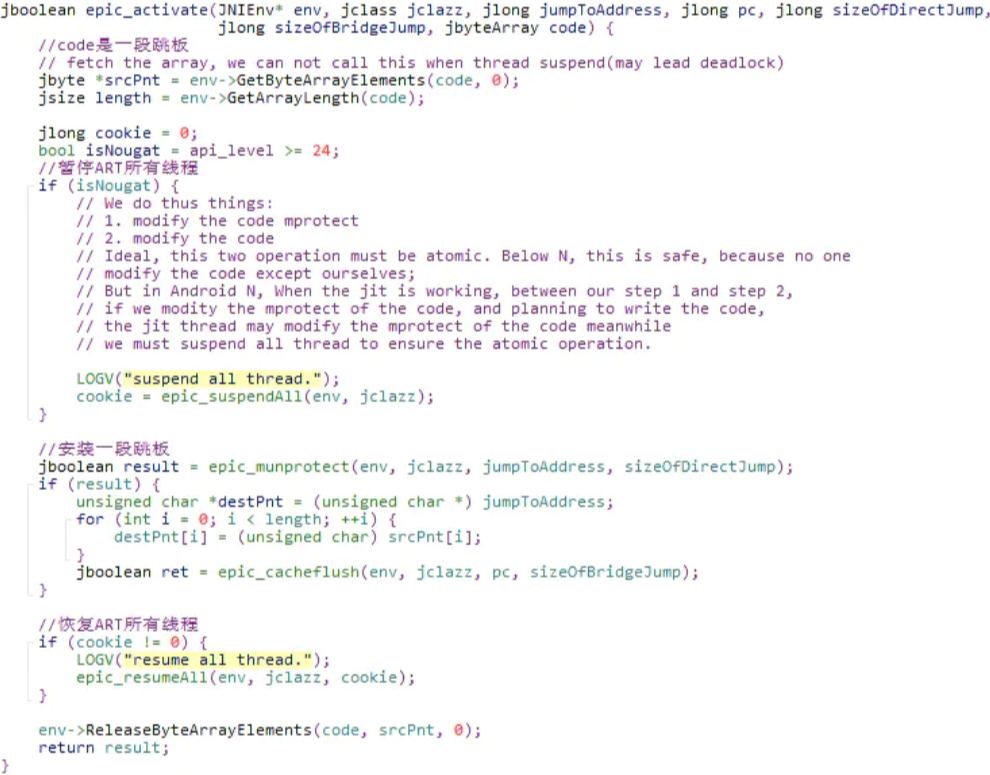

这个函数的实现也很简单。就是将一段跳板的代码拷贝到原Method对应的compiled_code的开始处，类似native函数的InlineHook。和Whale一样，这里在安装一段跳板前也暂停了ART的所有线程，原因已经写在注释里了。另外，在arm平台下，更新完指令要记得cacheflush。

至此，epic的Hook就算完成了。

本篇笔记只是草草的跟踪一下代码，并未将所有的实现细节全部看完。但主干代码和实现原理已经算是清楚了。

