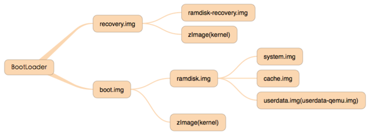
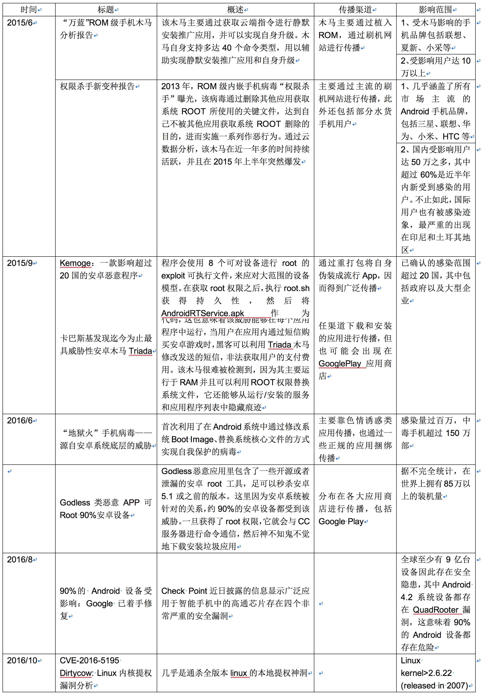

# ROM安全梳理

url：http://www.wireghost.cn/2017/01/27/ROM%E5%AE%89%E5%85%A8%E6%A2%B3%E7%90%86/


## 定义

智能手机配置中的ROM指的是EEProm（电擦除可写只读存储器），类似于计算机的硬盘，而一般手机刷机的过程，就是将只读内存镜像（ROM image）写入到只读内存（ROM）的过程。常见的ROM image有img、zip等格式，前者通常用fastboot程序通过数据线刷入（线刷），后者通常用recovery模式从SD卡刷入（卡刷），故img镜像也被称为线刷包，zip镜像被称为卡刷包。
此外，因为ROM image是定制系统最常见的发布形式，所以ROM这个词有时也会被用来指代手机的操作系统。

## 分类

因为Android系统的开放性，大多数情况下ROM都是指代Android系统的各种发行版，可将其分为两大类：

1. 一种是出自手机制造商官方的原版ROM，特点是稳定，功能上随厂商定制而各有不同；
2. 另一种是开发爱好者利用官方发布的源代码自主编译的原生ROM，特点是根据用户具体需求进行调整，使之更符合不同地区用户的使用习惯。

## 文件格式

一个完整的ROM线刷包通常会包含以下镜像文件：
[](http://www.wireghost.cn/2017/01/27/ROM安全梳理/1.png)

### boot.img&&recovery.img

boot和recovery镜像，它并不是普通意义上的文件系统，而是一种android自定义的文件格式。该格式包括了2K的文件头，后面紧跟着是用gzip压缩过的内核，再往后是一个ramdisk内存盘，然后紧跟着second stage loader（第二阶段的载入器程序）。此类文件头的具体结构可以从源代码system/core/mkbootimg/bootimg.h中看到。

```
struct boot_img_hdr
{
    unsigned char magic[BOOT_MAGIC_SIZE];

    unsigned kernel_size;  /* size in bytes */
    unsigned kernel_addr;  /* physical load addr */

    unsigned ramdisk_size; /* size in bytes */
    unsigned ramdisk_addr; /* physical load addr */

    unsigned second_size;  /* size in bytes */
    unsigned second_addr;  /* physical load addr */

    unsigned tags_addr;    /* physical addr for kernel tags */
    unsigned page_size;    /* flash page size we assume */
    unsigned unused[2];    /* future expansion: should be 0 */

    unsigned char name[BOOT_NAME_SIZE]; /* asciiz product name */

    unsigned char cmdline[BOOT_ARGS_SIZE];

    unsigned id[8]; /* timestamp / checksum / sha1 / etc */
};

/*
** +-----------------+
** | boot header     | 1 page
** +-----------------+
** | kernel          | n pages
** +-----------------+
** | ramdisk         | m pages
** +-----------------+
** | second stage    | o pages
** +-----------------+
**
** n = (kernel_size + page_size - 1) / page_size
** m = (ramdisk_size + page_size - 1) / page_size
** o = (second_size + page_size - 1) / page_size
**
** 0. all entities are page_size aligned in flash
** 1. kernel and ramdisk are required (size != 0)
** 2. second is optional (second_size == 0 -> no second)
** 3. load each element (kernel, ramdisk, second) at
**    the specified physical address (kernel_addr, etc)
** 4. prepare tags at tag_addr.  kernel_args[] is
**    appended to the kernel commandline in the tags.
** 5. r0 = 0, r1 = MACHINE_TYPE, r2 = tags_addr
** 6. if second_size != 0: jump to second_addr
**    else: jump to kernel_addr
*/
```


boot中的ramdisk映像是一个最基础的小型文件系统，它包括了初始化系统所需要的全部核心文件，例如：初始化init进程以及init.rc（可以用于设置很多系统的参数）等文件，以下是一个典型的ramdisk中包含的文件列表：

> ./init.trout.rc
> ./default.prop
> ./proc
> ./dev
> ./init.rc
> ./init
> ./sys
> ./init.goldfish.rc
> ./sbin
> ./sbin/adbd
> ./system
> ./data

recovery镜像包含了一些额外的文件，例如一个叫做recovery的二进制程序以及一些对该程序支持性的资源图片文件（当按下home+power组合键的时候就会运行该程序），典型的文件列表如下：

> ./res/images
> ./res/images/progress_bar_empty_left_round.bmp
> ./res/images/icon_firmware_install.bmp
> ./res/images/indeterminate3.bmp
> ./res/images/progress_bar_fill.bmp
> ./res/images/progress_bar_left_round.bmp
> ./res/images/icon_error.bmp
> ./res/images/indeterminate1.bmp
> ./res/images/progress_bar_empty_right_round.bmp
> ./res/images/icon_firmware_error.bmp
> ./res/images/progress_bar_right_round.bmp
> ./res/images/indeterminate4.bmp
> ./res/images/indeterminate5.bmp
> ./res/images/indeterminate6.bmp
> ./res/images/progress_bar_empty.bmp
> ./res/images/indeterminate2.bmp
> ./res/images/icon_unpacking.bmp
> ./res/images/icon_installing.bmp
> ./sbin/recovery

### system.img

system.img是Android系统中存放系统文件的映像文件，文件格式为ext或yaff2，它将被init进程通过解析 init.rc 文件挂载 (mount) 到/system分区下，内容如下：

> - build.prop：存储系统属性
> - system/app：系统自带的一些应用程序
> - system/app：系统自带的一些应用程序
> - system/etc：保存系统配置文件，如APN接入点设置等核心配置
> - system/fonts：字体文件夹
> - system/framework：主要是一些核心的文件，从后缀名为jar可以看出是系统平台框架
> - system/lib：目录中存放的主要是系统底层库，如平台运行时库
> - system/media：铃声音乐文件夹，除了常规的铃声外还有一些系统提示事件音
> - system/usr：用户文件夹，包含共享、键盘布局、时间区域文件等。

### ramdisk.img

ramdisk.img是一个分区映像文件，它会在kernel启动的时候，以只读的方式将root file system（根文件系统）mount （挂载）起来。PS：其实ramdisk.img的内容就是/out/target/product/generic/root目录的压缩而已。。

> /system
> /sys
> /sbin
> /proc
> init.rc
> init.goldfish.rc
> init
> default.prop
> /dev
> /data

### userdata.img

userdata.img会被挂载到/data分区下，包含了所有应用相关的配置文件，以及用户相关的数据。

> /misc
> /data
> /app-private
> /app
> /property
> /dalvik-cache
> /lost+found

### cache.img

cache.img映像文件的内容如下：

> - /recovery：recovery操作的日志文件
> - /backup：备份文件
> - /lost+found

## 运行时的挂载顺序

当PC启动的时候，首先执行的是在BIOS上的代码，然后再由BIOS负责将Kernel加载起来执行。在嵌入式世界里，BootLoader的作用就相当于PC的BIOS。手机开机会先进入Bootloader，然后判断是正常启动还是进入recovery，若正常启动则对boot.img解压并将执行权限交给zImage，zImage挂载ramdisk.img执行其中的init进程，init进程进一步挂载system.img、cache.img、userdata.img文件系统镜像。
[](http://www.wireghost.cn/2017/01/27/ROM安全梳理/2.png)

## Android攻击面

在学习ROM安全之前，先让我们试着对整个Android设备的攻击面做下了解（参考《Android安全攻防权威指南》）：
[](http://www.wireghost.cn/2017/01/27/ROM安全梳理/3.png)

### 远程攻击面

最巨大的、最危险的、最有吸引力的攻击界面，攻击者无需本地物理接触受害者。

#### 网络协议栈

安全漏洞研究中的”圣杯”是这样的一种远程攻击，它不需要与目标交互就可以实施，就能获取系统的完全访问权限。在这种攻击场景中，攻击者通常只需能在因特网上与目标主机进行通信即可。这类攻击可以简单到发送单个数据包，也可能需要一长串复杂的协议谈判过程。由于防火墙和NAT技术的广泛使用，这一攻击面变得更难可达，因此在这些底层代码中的安全漏洞往往只暴露给网络邻居攻击者。
在Android系统上，符合这一描述的主要攻击面是Linux内核中的网络协议栈：

- Linux底层的网络协议栈由C/C++编写，其存在的“缓冲区溢出”等代码问题可能导致远程执行任意代码
- 协议处理过程中的某些字段没有作判断而导致拒绝服务
- …

检查方法：代码review，并搜索不安全函数

#### 暴露的网络服务

无需目标用户交互的联网服务是第二位有吸引力的攻击面，这些服务通常在用户空间中执行，消除了获得内核空间代码执行的可能性。但是仍然有一些潜在的网络服务，如果被成功利用攻击面中的安全漏洞，就可以获取到root权限，不过这类网络服务在Android系统上极少的，多是由应用程序暴露，如开启WIFI热点功能后，会监听TCP 53端口。
检查方法：通过nmap扫描或者本地执行netstat -na|grep LISTEN可以获得暴露的服务，再进行分析。

#### 移动技术

这里指SMS、MMS、电话等蜂窝网络服务暴露的攻击面。
SMS、MMS服务使用WAP协议，其中的WAP PUSH消息可被用来发送Service Loading request (SL消息)，SL消息可以去调用USSD(Unstructured Supplementary Service Data)功能来执行充值、语音邮箱查询等操作。
已知攻击：发送tel://开头的SL指令可触发手机打电话。

#### 客户端攻击面

手机上安装的客户端软件引入的的攻击界面：

- 浏览器攻击面：主要有URL钓鱼、MitM、XSS、CSRF这些方面的威胁
- Web引擎的移动应用：使用webview技术而引入的攻击面
- 广告
- 媒体推送：处理图片、文档的开源库，如libjpeg，包括png攻击和stagefright攻击
- 电子邮件：电邮应用引入的漏洞

#### 谷歌的基础设施

Google体系中的后端云服务引入的攻击面：

- Google Play：Google应用市场中可能存在恶意APP
- 第三方应用市场：非官方应用市场中可能存在伪装为热门APP的恶意程序，以及在热门APP中注入的后门软件
- Google Phones Home：GTalkService是google云服务中的重要组件，允许google在用户不知情的情况下在用户设备上安装或卸载应用

### 物理邻接攻击

攻击者与被攻击对象在一定范围内，如GPS、WIFI

#### 无线通信

- GPS：用户位置信息被APP滥用，泄露用户隐私；发送虚假GPS信号导致GPS设备定位错误
- Baseband：伪基站、针对RIL层的攻击
- Bluetooth
- Wi-Fi
- NFC
- …

#### 其他技术

除了无线通信技术之外，还有两个技术也与Android的整体攻击面相关。具体而言，QR码（快速响应矩阵码）和语言指令在理论上可以导致设备被攻破。

### 本地攻击面

攻击者可以达到实现任意代码执行和提权的目的，这种攻击界面在测试新root方法时最为明显。

#### 探索文件系统

Android的Unix血统意味着许多攻击面都是通过文件系统条目暴露的，这些条目包括内核空间和用户空间的端点。在内核空间，设备驱动节点与特殊的虚拟文件系统提供与内核空间驱动代码进行直接交互的访问点。许多用户空间的组件，如特权服务，通过PF_UNIX族的套接字暴露进程间通信功能。甚至，一些普通文件与目录条目如果没有进行充分的权限限制，也会为几种攻击类型提供攻击路径。这部分的攻击面包括：文件系统访问权限设置、SUID/SGUID设置、Owner设置等。

#### 应用生命周期

程序应用生命周期中引入的攻击面。

##### install

安装流程中引入的攻击面，如超长应用名攻击、畸形AndroidManifest.xml标签、APK占位攻击、签名漏洞等。

##### Application run

应用运行流程中引入的攻击面。

##### backup

应用备份恢复时引入的攻击面，如ALLOW-BACKUP漏洞。

#### 找到其他的本地攻击面

其他的本地攻击面是由Linux内核暴露的，包括系统调用和套接字实现等。Android系统中的许多服务和应用通过不同类型的IPC（包括套接字与共享内存）暴露着本地攻击面。。

- System Calls：Linux内核在执行系统调用时可能还会处理一些潜在的恶意数据，因此内核中的系统调用函数是一个值得关注的攻击面。要想找到这些函数，可以简单的在源代码中检索“SYSCALL_DEFINE”字符串
- Sockets：sockets恶意调用
- Binder
- Shared Memory
- Baseband Interface
- Attacking Hardware Support Services
- JAVA Native Interface：JNI恶意调用、JNI-DOS
- AIDL service Calls
- TrustZone Proxy：TurstZone Proxy是链接非安全世界和安全世界的代理

### 物理攻击面

攻击需要物理接触设备，虽然大部分物理攻击可防御，但仍很严重因为有些攻击会在瞬间完成。

#### 拆解设备

打开一个硬件设备通常能发现：

- 暴露的串口，允许接收调试信息，或者在某些情况下，提供设备的shell访问
- 暴露的JTAG调试端口，允许对设备的固件进行调试、重刷或访问

极少数情况下，攻击者无法找到这些通用接口，但是其他攻击仍然是可能的。一个非常实用和真实的攻击是物理性地移除闪存或核心CPU（通常包含着内部内存）。一旦被移除，攻击者可以轻易地从设备中读取引导装载程序、启动配置和完整的闪存文件系统。攻击者完全占有设备后，能够实施许多攻击，这些只是其中的一部分。

#### USB

##### 枚举USB攻击面

USB暴露的攻击面取决于设备支持哪些USB模式（ADB、存储、MTP等）。

##### ADB

通常使用adb shell，4.2.2之前 ADB shell不需要认证，之后需要。
攻击场景：Juice Jacking 假充电站攻击

#### 其他物理攻击面

尽管USB是Android设备上最普遍存在的物理攻击面，但它并不是唯一的一个，其他物理攻击面包括手机SIM卡、SD卡、HDMI、暴露的测试点和对接连接器等。。

### 第三方修改

所有的第三方修改都可能会扩大设备的攻击面，而这种情况确实经常发生，主要包括：

- OEM厂家定制的预装应用
- 遗留的开发调测工具
- 对Framework层的修改引入的新功能、API、JNI
- 驱动层新增的驱动节点

## Rom安全

### Rom攻击面

由于这里所说的ROM主要是指代手机系统，根据前面对Android设备的攻击面整理，从系统层面对ROM安全进行分析，梳理如下：
[](http://www.wireghost.cn/2017/01/27/ROM安全梳理/4.png)

### 安全现状

下面我们将结合这两年的安全事件，从案例的角度对ROM安全的当前现状作简单介绍。。
[](http://www.wireghost.cn/2017/01/27/ROM安全梳理/14.png)

#### 解锁BootLoader

一般而言，通过在引导加载程序层次上实现一些限制，对引导加载程序进行锁定，可以防止终端用户修改设备固件，而这些限制取决于制造商的具体决策，可能会有所不同。解锁BootLoader能带来严重的安全隐患，如果这个设备丢失或者被盗，设备上的所有数据可以被攻击者轻易的恢复窃取。
PS：事实上在解锁BootLoader时，会执行一次恢复出厂设置，用以确保终端用户数据安全。尽管如此，对于一些设备，仍然有可能通过取证手段恢复被删数据，所以解锁BootLoader本身仍然带来了安全风险。。

##### 老罗羞愧！盘古团队成功破解锤子手机Bootloader

2017年2月近日，国内著名的技术团队盘古团队发布长文称：可以利用bootloader里的两个漏洞对锤子T1/2的bootloader进行解锁。
盘古团队在文章中称，和很多高通芯片的手机一样，T2的bootloader是基于高通开源的lk。所以参考源码可以很快梳理出bootloader的执行流程，并且进行后续的分析和多步的调试后完成了对bootloader的解锁。
[](http://www.wireghost.cn/2017/01/27/ROM安全梳理/5.png)最后，盘古团队也对此次破解进行了说明：对于T1和T2，锤子OS v2.6.7是最后一个可以解锁的ROM版本号，v2.6.8后由于大部分指令的被阉，盘古团队提供的方法就无法解锁锤子手机的bootloader。从这里也可以看出锤子在2016年8月推出的v2.6.8的时候应该是发现了此问题并对此进行了修复。

#### Root提权

##### Linux 全版本提权漏洞 Dirty COW

###### 漏洞概要

- 漏洞编号：CVE-2016-5195
- 漏洞类型：内核竞态条件漏洞
- 漏洞危害：本地提权
- 影响范围：Linux kernel>2.6.22 (released in 2007)

这个漏洞是在2016年10月18号被Phil Oester提交，被Linux的创始人Linus亲自修复。同年10月20号，漏洞的发现者Phil Oester将漏洞的部分细节提交到github上。当天朋友圈就被这个漏洞刷屏了，毕竟是几乎是通杀全版本linux的本地提权的神洞，这种漏洞还是很少见的。

#### 预装应用

##### 安卓曝ROM木马万蓝 超10万部手机受影响

2015年5月中旬，360手机安全中心收到用户反馈称自己的手机经常自动安装新的游戏应用，经分析排查发现，该用户中招的是一个名为“万蓝”的ROM级别手机木马，该木马主要通过联网下载shell脚本文件进行静默安装推广应用，并可以实现自身升级。
传播方式主要是通过植入ROM，利用刷机网站进行传播。到目前为止，恶意样本主要是植入为夏新、联想、小采等手机开发的三方ROM进行传播，受影响用户达10万以上。已知的ROM下载渠道有：
ROM基地 http://www.romjd.com/Rom/Detail/16229
ROM之家 http://www.romzj.com/rom/10300.htm
[](http://www.wireghost.cn/2017/01/27/ROM安全梳理/12.png)[](http://www.wireghost.cn/2017/01/27/ROM安全梳理/13.png)用户手机刷入被感染的ROM后，木马便疯狂地开始推广传播各种应用。
从后台挖掘出的脚本发现被推广的应用至少有近百个，以下是部分推广软件的包名（包名是Android软件一个标识），可以看到包括UC浏览器、百度浏览器、QQ浏览器、豌豆荚、100tv播放器、百度团购、折800、腾讯新闻等知名应用也在推广的名单内。

##### 来自中国的秘密：预装木马的安卓平板正在销往全世界

2015年双十一来临之际，猎豹移动安全实验室发现了一个危险系数较高的木马，该木马被称为Cloudsota。研究发现该木马是被预装在一些Android平板上的，而从当时的情况来看，遭受该木马感染的平板依然放置在亚马逊的购物架上，并且处于销售状态。

###### 发现之路：起于受害用户的抱怨

通过对收集的信息进行分析，该木马其实已经存在有一段时间了，而其间也有不少受害用户一直在 XDA、TechKnow等网上交流论坛上寻求帮助。
[](http://www.wireghost.cn/2017/01/27/ROM安全梳理/6.png)而在亚马逊上也发现了一些购买了平板的用户的抱怨。
[](http://www.wireghost.cn/2017/01/27/ROM安全梳理/7.png)

###### 恶意行径：Cloudsota木马伸出了恶魔之手

经过分析发现，Cloudsota木马能够远程控制受感染的设备，可在在未经用户允许的情况下，进行带有目的性的恶意操作。以下为该木马的主要行为轨迹：
首先，它可以直接将恶意广告软件或者其他的恶意软件安装到设备上。同时在初始阶段，该木马会先将杀毒应用卸载掉，从而方便进行其他的恶意操作。我们也发现，在root权限下，它不但能够自动打开所有安装在设备上的应用，而且经过检测，该木马会将开机动画和壁纸都替换成广告。和众多恶意广告软件一样，Cloudsota还会将浏览器的默认主页篡改，并重定向到一个广告页面上，绑定用户进行浏览。

###### 影响：超过153个国家地区的用户受到影响

根据初步的估算，至少有17,233台受感染的平板被线下的用户购买，并已经通过物流交付到用户手中。此外，由于目前许多平板是不受杀毒应用的保护，实际上感染设备的数量可能比我们预计要多得多。
[](http://www.wireghost.cn/2017/01/27/ROM安全梳理/8.png)其中最令人担心的是，这些平板电脑在许多电商平台都有出售，不乏零售巨头，如亚马逊。从当前的情况来看，显然大多数人都不知道cloudsota的潜在风险和破坏性，而在这里，必须提醒广大用户，可以说，这是一个定时炸弹，随时都有可能威胁个人隐私和财产安全。根据跟踪研究发现，目前有超过30个品牌的平板被预装了该木马，相对于大型品牌的平板电脑，影响最大的是一些小众品牌的平板。据统计，超过4000台受影响的小众品牌平板已经被出售到全球各地。
[](http://www.wireghost.cn/2017/01/27/ROM安全梳理/9.png)在遭受该木马感染的超过153个国家和地区中，美国、墨西哥和土耳其的情况是最为严重的。
[](http://www.wireghost.cn/2017/01/27/ROM安全梳理/10.png)我们可以在网上看到许多用户纷纷在亚马逊上评论，抱怨设备经常出现广告和弹窗。根据对收集到的信息进行统计，发现这些预装该木马的平板都有一定的相同之处，就是所有的这些平板，它们的价格都是比较廉价的，并且可以追溯到它们的制造商其实出自于一些不知名的小型车间。下面是一个不完整统计的在亚马逊上疑似预装木马的品牌列表：
[](http://www.wireghost.cn/2017/01/27/ROM安全梳理/11.png)