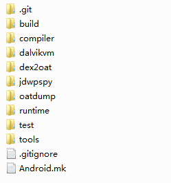

# android ART hook

url：https://www.cnblogs.com/lanrenxinxin/p/5207174.html


**0x00 前言**

之前一直都是在Dalvik 虚拟机上在折腾，从Android 4.4开始开始引入ART，到5.0已经成为默认选择。而且最近看到阿里开源的 Dexposed 框架，已经提供了对于android art 模式下的 hook 支持，所以对照着android art 部分的源码和之前 liang 大牛放出了hook代码研究了一下ART模式下的hook原理，做个简单的整理。关于android ART 更详尽的部分 可以阅读csdn的博客专栏《老罗的android之旅》。 

[Android运行时ART执行类方法的过程分析](http://blog.csdn.net/luoshengyang/article/details/40289405)

[Android运行时ART加载类和方法的过程分析](http://blog.csdn.net/luoshengyang/article/details/39533503)

[Android运行时ART加载OAT文件的过程分析](http://blog.csdn.net/luoshengyang/article/details/39307813)

 

**0x01 ART**

ART是Android平台上的新一代运行时,用来代替dalvik。它主要采用了AOT(Ahead Of Time)的方法，在apk安装的时候将dalvikbytecode一次性编译成arm本地指令（但是这种AOT与c语言等还是有本质不同的，还是需要虚拟机的环境支持），这样在运行的时候就无需进行任何解释或编译便可直接执行。因为Dalvik执行的是Dex字节码，通过解释器执行。虽然Dalvik也会对频繁执行的代码进行jIT生成本地机器指令来执行，但毕竟在应用程序运行过程中将Dex字节码翻译成本地机器指令也会影响到应用程序本身的执行。因此ART节省了运行时间，提高了效率，但是在一定程度上使得应用安装的时间变长，空间占用变大。

下图是ART 的源码目录结构：

​             

中间有几个目录比较关键，

首先是**dex2oat**，负责将dex文件给转换为oat文件，具体的翻译工作需要由compiler来完成，最后编译为dex2oat；

其次是**runtime**目录，内容比较多，主要就是运行时，编译为libart.so用来替换libdvm.so，dalvik是一个外壳，其中还是在调用ART runtime；

**oatdump**也是一个比较重要的工具，编译为oatdump程序，主要用来对oat文件进行分析并格式化显示出文件的组成结构；

**jdwpspy**是java的调试支持部分，即JDWP服务端的实现。

ART也是由zygote所启动的，与dalvik的启动过程完全一样，保证了由dalvik到ART的无缝衔接。

整个启动过程是从app_process(/framework/base/cmds/app_process/app_main.cpp)开始的，开始的时候，创建了一个对象AppRuntime runtime,这是个单例，整个系统运行时只有一个，随着zygote 的fork过程，每个子进程只是在不断的复制指向这个对象的指针个数。然后开始执行runtime.start方法(/frameworks/base/core/jni/AndrroidRuntime.cpp)。在start方法中会对系统的属性进行判断，选择libdvm.so 或者是libart.so进行链接。


```
/* start the virtual machine */
JniInvocation jni_invocation;
jni_invocation.Init(NULL);
JNIEnv* env;
if (startVm(&mJavaVM, &env) != 0) {
     return;
}
```


可以在JniInvocation.Init函数中看到初始化过程


```
bool JniInvocation::Init(const char* library) {
#ifdef HAVE_ANDROID_OS
  char default_library[PROPERTY_VALUE_MAX];
  property_get("persist.sys.dalvik.vm.lib", default_library, "libdvm.so");
#else
  const char* default_library = "libdvm.so";
#endif
  if (library == NULL) {
    library = default_library;
  }

  handle_ = dlopen(library, RTLD_NOW);
  if (handle_ == NULL) {
    ALOGE("Failed to dlopen %s: %s", library, dlerror());
    return false;
  }
  if (!FindSymbol(reinterpret_cast<void**>(&JNI_GetDefaultJavaVMInitArgs_),
                  "JNI_GetDefaultJavaVMInitArgs")) {
    return false;
  }
  if (!FindSymbol(reinterpret_cast<void**>(&JNI_CreateJavaVM_),
                  "JNI_CreateJavaVM")) {
    return false;
  }
  if (!FindSymbol(reinterpret_cast<void**>(&JNI_GetCreatedJavaVMs_),
                  "JNI_GetCreatedJavaVMs")) {
    return false;
  }
  return true;
}
```


而对于libdvm.so或者libart.so都需要提供几个公用的接口，以达到从Dalvik到ART的无缝衔接。而接下的来调用的JNI_CreateJavaVM()实际上是JniInvocation中的JNI_CreateJavaVM()函数

```
jint JniInvocation::JNI_CreateJavaVM(JavaVM** p_vm, JNIEnv** p_env, void* vm_args) {
  return JNI_CreateJavaVM_(p_vm, p_env, vm_args);
}
```

在之前的JniInvocation::init中函数指针已经选择保存了libdvm.so或者libart.so中的函数地址，在这里正式开始划分Dalvik和ART启动流程。Android系统通过将ART运行时抽象成一个Java虚拟机，以及通过系统属性persist.sys.dalvik.vm.lib和一个适配层JniInvocation，就可以无缝地将Dalvik虚拟机替换为ART运行时。

而hook代码中对于android运行模式判断也是如此，和JniInvocation::init函数中一样，都是判断系统属性值。

```
static bool isArt(){
    char value[PROPERTY_VALUE_MAX];
    property_get("persist.sys.dalvik.vm.lib", value, "");
    LOGI("[+] persist.sys.dalvik.vm.lib = %s", value);
    return strncmp(value, "libart.so", strlen("libart.so")) == 0;
}
```

 

**0x02  ART 中方法的调用**

还是通过源码，在ART启动过程中：


```
/* frameworks/base/core/jni/AndroidRuntime.cpp */
void AndroidRuntime::start(const char* className, const char* options)
{
    ......
    char* slashClassName = toSlashClassName(className);
    jclass startClass = env->FindClass(slashClassName);
    if (startClass == NULL) {
        ALOGE("JavaVM unable to locate class '%s'\n", slashClassName);
        /* keep going */
    } else {
        jmethodID startMeth = env->GetStaticMethodID(startClass, "main",
            "([Ljava/lang/String;)V");
        if (startMeth == NULL) {
            ALOGE("JavaVM unable to find main() in '%s'\n", className);
            /* keep going */
        } else {
            env->CallStaticVoidMethod(startClass, startMeth, strArray); 
            ......
        }
    }
    ......
}
```

跟入CallStaicVoidMethod() 函数


```
/* art/runtime/jni_internal.cc */
static void CallStaticVoidMethod(JNIEnv* env, jclass, jmethodID mid, ...) {
    va_list ap;
    va_start(ap, mid);
    CHECK_NON_NULL_ARGUMENT(CallStaticVoidMethod, mid);
    ScopedObjectAccess soa(env);
    InvokeWithVarArgs(soa, NULL, mid, ap);
    va_end(ap);}
```


JNI类的成员函数CallStaticVoidMethod实际上又是通过全局函数InvokeWithVarArgs来调用参数mid指定的方法。


```
/* art/runtime/jni_internal.cc */
static JValue InvokeWithVarArgs(const ScopedObjectAccess& soa, jobject obj,
                                jmethodID mid, va_list args)
    SHARED_LOCKS_REQUIRED(Locks::mutator_lock_) {
  ArtMethod* method = soa.DecodeMethod(mid);
  Object* receiver = method->IsStatic() ? NULL : soa.Decode<Object*>(obj);
  MethodHelper mh(method);
  JValue result;
  ArgArray arg_array(mh.GetShorty(), mh.GetShortyLength());
  arg_array.BuildArgArray(soa, receiver, args);
  InvokeWithArgArray(soa, method, &arg_array, &result, mh.GetShorty()[0]);
  return result;
}
```


函数InvokeWithVarArgs将调用参数封装在一个数组中，然后再调用另外一个函数InvokeWithArgArray来参数mid指定的方法。


```
/* art/runtime/jni_internal.cc */
void InvokeWithArgArray(const ScopedObjectAccess& soa, ArtMethod* method,
                        ArgArray* arg_array, JValue* result, char result_type)
    SHARED_LOCKS_REQUIRED(Locks::mutator_lock_) {
  uint32_t* args = arg_array->GetArray();
  if (UNLIKELY(soa.Env()->check_jni)) {
    CheckMethodArguments(method, args);
  }
  method->Invoke(soa.Self(), args, arg_array->GetNumBytes(), result, result_type);
}
```


可以看到参数mid实际上是一个ArtMethod对象指针，因此，将它转换为一个ArtMethod指针（dalvik也是如此），于是就可以得到被调用类方法的相关信息了。

函数InvokeWithArgArray通过ArtMethod类的成员函数Invoke来调用参数method指定的类方法。ArtMethod类的成员函数Invoke的实现如下所示：


```
/* art/runtime/mirror/art_method.cc*/
void ArtMethod::Invoke(Thread* self, uint32_t* args, uint32_t args_size, JValue* result,
                       char result_type) {
  ......

  // Push a transition back into managed code onto the linked list in thread.
  ManagedStack fragment;
  self->PushManagedStackFragment(&fragment);

  Runtime* runtime = Runtime::Current();
  // Call the invoke stub, passing everything as arguments.
  if (UNLIKELY(!runtime->IsStarted())) {
    ......
    if (result != NULL) {
      result->SetJ(0);
    }
  } else {
    const bool kLogInvocationStartAndReturn = false;
    if (GetEntryPointFromCompiledCode() != NULL) {
      ......
#ifdef ART_USE_PORTABLE_COMPILER
      (*art_portable_invoke_stub)(this, args, args_size, self, result, result_type);
#else
      (*art_quick_invoke_stub)(this, args, args_size, self, result, result_type);
#endif
      if (UNLIKELY(reinterpret_cast<int32_t>(self->GetException(NULL)) == -1)) {
        // Unusual case where we were running LLVM generated code and an
        // exception was thrown to force the activations to be removed from the
        // stack. Continue execution in the interpreter.
        self->ClearException();
        ShadowFrame* shadow_frame = self->GetAndClearDeoptimizationShadowFrame(result);
        self->SetTopOfStack(NULL, 0);
        self->SetTopOfShadowStack(shadow_frame);
        interpreter::EnterInterpreterFromDeoptimize(self, shadow_frame, result);
      }
      ......
    } else {
      ......
      if (result != NULL) {
        result->SetJ(0);
      }
    }
  }

  // Pop transition.
  self->PopManagedStackFragment(fragment);
}
```


 整个过程的重点就在art_protable_invoke_stub 和 art_quick_invoke_stub上，这也是整个hook工作的关键。函数中根据预定义宏ART_USE_PORTABLE_COMPILER来判断是protable 还是 quick 的方式。这里的protable 和 quick是android对于编译dex文件采用的两种不同的后端，protable生成的oat文件和传统的so，dll文件类似，处理不同模块之间的调用关系时需要重定位操作，而quick是通过线程的TLS中的跳转表来实现，不需要重定位操作，因此加载的速度更快。而android默认的是采用的quick，所以我们只分析quick的调用过程，也就是这里的art_quikc_invoke_stub。更详细的过程参考《老罗的android之旅》。

 我们继续看art_quick_invoke_stub的源码：


```
/*art/runtime/arch/arm/quick_entrypoints_arm.S*/   
    /*
     * Quick invocation stub.
     * On entry:
     *   r0 = method pointer
     *   r1 = argument array or NULL for no argument methods
     *   r2 = size of argument array in bytes
     *   r3 = (managed) thread pointer
     *   [sp] = JValue* result
     *   [sp + 4] = result type char
     */
ENTRY art_quick_invoke_stub
    push   {r0, r4, r5, r9, r11, lr}       @ spill regs
    .save  {r0, r4, r5, r9, r11, lr}
    .pad #24
    .cfi_adjust_cfa_offset 24
    .cfi_rel_offset r0, 0
    .cfi_rel_offset r4, 4
    .cfi_rel_offset r5, 8
    .cfi_rel_offset r9, 12
    .cfi_rel_offset r11, 16
    .cfi_rel_offset lr, 20
    mov    r11, sp                         @ save the stack pointer
    .cfi_def_cfa_register r11
    mov    r9, r3                          @ move managed thread pointer into r9
    mov    r4, #SUSPEND_CHECK_INTERVAL     @ reset r4 to suspend check interval
    add    r5, r2, #16                     @ create space for method pointer in frame
    and    r5, #0xFFFFFFF0                 @ align frame size to 16 bytes
    sub    sp, r5                          @ reserve stack space for argument array
    add    r0, sp, #4                      @ pass stack pointer + method ptr as dest for memcpy
    bl     memcpy                          @ memcpy (dest, src, bytes)
    ldr    r0, [r11]                       @ restore method*
    ldr    r1, [sp, #4]                    @ copy arg value for r1
    ldr    r2, [sp, #8]                    @ copy arg value for r2
    ldr    r3, [sp, #12]                   @ copy arg value for r3
    mov    ip, #0                          @ set ip to 0
    str    ip, [sp]                        @ store NULL for method* at bottom of frame
    ldr    ip, [r0, #METHOD_CODE_OFFSET]   @ get pointer to the code
    blx    ip                              @ call the method
    mov    sp, r11                         @ restore the stack pointer
    ldr    ip, [sp, #24]                   @ load the result pointer
    strd   r0, [ip]                        @ store r0/r1 into result pointer
    pop    {r0, r4, r5, r9, r11, lr}       @ restore spill regs
    .cfi_adjust_cfa_offset -24
    bx     lr
END art_quick_invoke_stub
```


前面的注释列出了 函数art_quick_invoke_stub被调用的时候，寄存器r0-r3的值，以及调用栈顶端的两个值。其中，

r0指向当前被调用的类方法，          

r1指向一个参数数组地址，                  

r2记录参数数组的大小，

r3指向当前线程，

调用栈顶端的两个元素分别用来保存调用结果及其类型。

真正调用类方法的汇编指令如下：

```
ldr    ip, [r0, #METHOD_CODE_OFFSET]   @ get pointer to the code
blx    ip                              @ call the method
```

这里的 METHOD_CODE_OFFSET 就是在ArtMethod*结构体中的偏移

```
/*art/runtime/asm_support.h*/
// Offset of field Method::entry_point_from_compiled_code_
#define METHOD_CODE_OFFSET 40
```

就是进入类方法的入口点，entry_point_from_compiled_code_字段，也是hook点。

 

**0x03 调用约定**

ART 其实也有两种执行模式，一种是本地机器指令，一种是类似于虚拟机的解释执行。ArtMethod结构体中的两个成员就和类方法入口有关：

```
// Compiled code associated with this method for callers from managed code.
const void* entry_point_from_compiled_code_;                 //本地机器指令入口  code_offset / GetCompiledCodeToInterpreterBridge (art_quick_to_interpreter_bridge)
                                                                  
// Called by the interpreter to execute this method.
EntryPointFromInterpreter* entry_point_from_interpreter_;  //解释执行入口  artInterpreterToInterpreterBridge / artInterpreterToCompiledCodeBridg
```

这两个成员都指针，其中EntryPointFromInterpreter* 是函数指针类型，实际上也就是一种调用，表示调用者是来自解释执行方式的一种调用约定

```
typedef void (EntryPointFromInterpreter)(Thread* self, MethodHelper& mh,
        const CodeItem* code_item, ShadowFrame* shadow_frame,
        JValue* result);
```

entry_point_from_interpreter_ 是作为调用者是解释执行的入口函数，也是分为两种情况：

　　1.当前ArtMethod对应的方法如果是解释执行话，将entry_point_from_interpreter_ 设置为artInterpreterToInterpreterBridge；

　　2.当前ArtMethod 对应的是方法是机器指令的话，就entry_point_from_interpreter_设置为artInterpreterToCompiledCodeBridge

 

而entry_point_from_compiled_code_表示调用者是机器指令的类方法入口，而他的值也是分为两种情况：

　　1.被调用的方法，也就是ArtMethod 所对应的方法如果需要通过解释执行，则赋值为GetCompiledCodeToInterpreterBridge() 函数的返回值；

　　2.ArtMethod 所对应的方法如果是本地机器指令，则直接指向方法在oat文件中的指令。

这两个字段的值的问题，更详细的可以阅读android art/runtime/class_linker.cc 文件中LinkCode()方法的源码，而这里我们hook的就是针对entry_point_from_compiled_code_ 字段。

可以通过art_quick_invoke_stub 汇编代码得出在调用ArtMethod 应该方法的执行入口时的栈帧布局：


```
   -(low)
   | caller(Method *)    | <- sp 
   | arg1                | <- r1
   | arg2                | <- r2
   | arg3                | <- r3
   | ...                 | 
   | argN                |
   | callee(Method *)    | <- r0
   +(high)
```


前三个参数还会**额外地**保存在寄存器r1、r2和r3中。这样对于小于等于3个参数的类方法，就可以通过访问寄存器来快速地获得参数。

 注意，传递给被调用类方法的参数并不是从栈顶第一个位置（一个位置等于一个字长，即4个字节）开始保存的，而是从第二个位置开始的，即sp + 4。这是因为栈顶的第一个位置是预留用来保存用来描述当调用类方法（Caller）的ArtMethod对象地址的。由于函数art_quick_invoke_stub是用来从外部进入到ART运行时的，即不存在调用类方法，因此这时候栈顶第一个位置会被设置为NULL。

 

**0x04  Hook**

之前说过，Method的id也就是jmethod实际上是一个指针，指向的就是代码类方法的ArtMethod结构体，通过类型转换就可以获得目标类方法的ArtMethod的指针

```
ArtMethod *artmeth = reinterpret_cast<ArtMethod *>(methid);
```

获得了ArtMethod* ，就可以设置类方法的entrypoint:


```
 if(art_quick_dispatcher != artmeth->GetEntryPointFromCompiledCode()){
     uint64_t (*entrypoint)(ArtMethod* method, Object *thiz, u4 *arg1, u4 *arg2);
     entrypoint = (uint64_t (*)(ArtMethod*, Object *, u4 *, u4 *))artmeth->GetEntryPointFromCompiledCode();

     info->entrypoint = (const void *)entrypoint;
     info->nativecode = artmeth->GetNativeMethod();

     artmeth->SetEntryPointFromCompiledCode((const void *)art_quick_dispatcher);
```


也就是如果替换了entry_point_from_compiled_code_的值，使其指向我们的代码art_quick_diapatcher，这时art_quick_invoke_stub调用我们自己的代码，但是调用约定并不是普通的arm下C/C++的调用约定，所以我们需要用汇编代码来对堆栈进行处理，然后再调用真正的额外执行的C++代码，而在C++代码中也需要返回原始的方法，同样的也需要对堆栈进行处理，同样需要借助汇编来还原堆栈，调用原始的entrypoint。


```
ENTRY art_quick_dispatcher
    push     {r4, r5, lr}           @ sp - 12
    mov     r0, r0                  @ pass r0 to method
    str     r1, [sp, #(12 + 4)]     @ arg array
    str     r2, [sp, #(12 + 8)]
    str     r3, [sp, #(12 + 12)]
    mov     r1, r9                  @ pass r1 to thread
    add     r2, sp, #(12 + 4)       @ pass r2 to args array
    add     r3, sp, #12             @ pass r3 to old SP
    blx     artQuickToDispatcher    @ (Method* method, Thread*, u4 **, u4 **)
    pop     {r4, r5, pc}            @ return on success, r0 and r1 hold the result
END art_quick_dispatcher
```


上面的汇编代码art_quick_dispatcher就是替换原始entrypoint的值，处理堆栈，然后调用自己的C++函数artQuickToDispatcher()，之后在artQuickToDispatcher()调用原始的entrypoint。当然这里对于原始的entrypoint是不能直接进行调用的，需要在利用一段汇编代码，将堆栈还原成art_quick_invoke_stub调用entrypoint时的样子。


```
/*
 *
 * Art Quick Call Entrypoint
 * On entry:
 *  r0 = method pointer
 *  r1 = thread pointer
 *  r2 = args arrays pointer
 *  r3 = old_sp
 *  [sp] = entrypoint
 */
ENTRY art_quick_call_entrypoint
    push    {r4, r5, lr}           @ sp - 12
    sub     sp, #(40 + 20)         @ sp - 40 - 20
    str     r0, [sp, #(40 + 0)]    @ var_40_0 = method_pointer
    str     r1, [sp, #(40 + 4)]    @ var_40_4 = thread_pointer
    str     r2, [sp, #(40 + 8)]    @ var_40_8 = args_array
    str     r3, [sp, #(40 + 12)]   @ var_40_12 = old_sp
    mov     r0, sp
    mov     r1, r3
    ldr     r2, =40
    blx     memcpy                 @ memcpy(dest, src, size_of_byte)
    ldr     r0, [sp, #(40 + 0)]    @ restore method to r0
    ldr     r1, [sp, #(40 + 4)]
    mov     r9, r1                 @ restore thread to r9
    ldr     r5, [sp, #(40 + 8)]    @ pass r5 to args_array
    ldr     r1, [r5]               @ restore arg1
    ldr     r2, [r5, #4]           @ restore arg2
    ldr     r3, [r5, #8]           @ restore arg3
    ldr     r5, [sp, #(40 + 20 + 12)] @ pass ip to entrypoint
    blx     r5
    add     sp, #(40 + 20)
    pop     {r4, r5, pc}           @ return on success, r0 and r1 hold the result
END art_quick_call_entrypoint
```


也就是art_quick_call_entrypoint恢复原来的堆栈，调用原始的entrypoint。但是，还有一个问题存在，也就是ART中关于延迟加载的问题。

 LinkCode 源码

在LinkCode() 的源码中可以看到这句代码：


```
 //trampoline 延迟链接
  if (method->IsStatic() && !method->IsConstructor()) {
    // For static methods excluding the class initializer, install the trampoline.
    // It will be replaced by the proper entry point by ClassLinker::FixupStaticTrampolines
    // after initializing class (see ClassLinker::InitializeClass method).
    method->SetEntryPointFromCompiledCode(GetResolutionTrampoline(runtime->GetClassLinker()));
  }
```


将entrypoint的设置为GetResolutionTrampoline() 的返回值，而这里就是


```
/*art/runtime/entrypoints/entrypoint_utils.h*/
static inline const void* GetCompiledCodeToInterpreterBridge() {
#if defined(ART_USE_PORTABLE_COMPILER)
  return GetPortableToInterpreterBridge();
#else
  return GetQuickToInterpreterBridge();
#endif
}
```


这里就是延迟链接，意思是在加载和链接类的时候，部分方法的entrypoint设置的并不是本地机器指令，或者解释执行的入口，而是一个代理函数。而这个代理函数真正是干什么的？简单来说就是延迟链接，只有当真正调用这个类方法的时候，调用trampoline 函数才会对这个类方法进行链接，设置ArtMethod*的entry_point_from_compiled_code_的值为真正的本地机器指令或者解释执行入口。那这时在之前设置的entry_point_from_compiled_code_ 的值为art_quick_dispatcher的地址就被覆盖调用了，所以需要在我们自己的artQuickToDispatcher调用完原始的entrypoint以后，再对entrypoint进行一次判断和赋值：


```
  /*
    * 处理的就是trampoline 在调用原来的tramp方法以后，重新绑定entry_pooint_from_complied_ 字段*/
    entrypoint = method->GetEntryPointFromCompiledCode();
    if(entrypoint != (const void *)art_quick_dispatcher){
        LOGW("[*] entrypoint was replaced. %s->%s", info->classDesc, info->methodName);

        method->SetEntryPointFromCompiledCode((const void *)art_quick_dispatcher);
```


整个ART模式下的hook流程大致就是如此。

 项目代码：https://github.com/boyliang/AllHookInOne