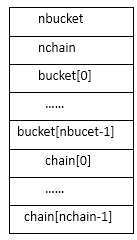

# 从dlsym()源码看android 动态链接过程

url：https://www.cnblogs.com/lanrenxinxin/p/4965149.html


**0x00  前言**

这篇文章其实是我之前学习elf文件关于符号表的学习笔记，网上也有很多关于符号表的文章，怎么说呢，感觉像是在翻译elf文件格式的文档一样，千篇一律，因此把自己的学习笔记分享出来。dlsym()的源码是分析的android4.4的源码，android自己实现的bonic C库。

**0x01  基本流程**

android中关于elf文件，关于so文件信息的结构体：

```
struct soinfo {
 public:
  char name[SOINFO_NAME_LEN];
  const Elf32_Phdr* phdr;
  size_t phnum;
  Elf32_Addr entry;
  Elf32_Addr base;
  unsigned size;

  uint32_t unused1;  // DO NOT USE, maintained for compatibility.

  Elf32_Dyn* dynamic;

  uint32_t unused2; // DO NOT USE, maintained for compatibility
  uint32_t unused3; // DO NOT USE, maintained for compatibility

  soinfo* next;
  unsigned flags;

  const char* strtab;
  Elf32_Sym* symtab;

  size_t nbucket;
  size_t nchain;
  unsigned* bucket;
  unsigned* chain;

  unsigned* plt_got;

  Elf32_Rel* plt_rel;
  size_t plt_rel_count;

  Elf32_Rel* rel;
  size_t rel_count;

  linker_function_t* preinit_array;
  size_t preinit_array_count;

  linker_function_t* init_array;
  size_t init_array_count;
  linker_function_t* fini_array;
  size_t fini_array_count;

  linker_function_t init_func;
  linker_function_t fini_func;

#if defined(ANDROID_ARM_LINKER)
  // ARM EABI section used for stack unwinding.
  unsigned* ARM_exidx;
  size_t ARM_exidx_count;
#elif defined(ANDROID_MIPS_LINKER)
  unsigned mips_symtabno;
  unsigned mips_local_gotno;
  unsigned mips_gotsym;
#endif

  size_t ref_count;
  link_map_t link_map;

  bool constructors_called;

  // When you read a virtual address from the ELF file, add this
  // value to get the corresponding address in the process' address space.
  Elf32_Addr load_bias;

  bool has_text_relocations;
  bool has_DT_SYMBOLIC;

  void CallConstructors();
  void CallDestructors();
  void CallPreInitConstructors();

 private:
  void CallArray(const char* array_name, linker_function_t* functions, size_t count, bool reverse);
  void CallFunction(const char* function_name, linker_function_t function);
};
```


然后就是我们关心的dlsym()函数，

```
void*dlsym(void*handle,constchar*symbol)
```

dlsym()的实现对于handle是分三种情况

(1)  handle = RTLD_DEFAULT；

(2)  handle = RTLD_NEXT；

(3) 其他，也就是我们平常调用dlopen()的返回值。

**0x02  RTLD_DEFAFULT**


```
  soinfo* found = NULL;
  Elf32_Sym* sym = NULL;
  if (handle == RTLD_DEFAULT) {
    sym = dlsym_linear_lookup(symbol, &found, NULL);
  }

///bonic/linker/Linker.cpp
Elf32_Sym* dlsym_linear_lookup(const char* name, soinfo** found, soinfo* start) {
  unsigned elf_hash = elfhash(name);   //计算符号名称的hash值
  if (start == NULL) {
//static soinfo* solist = &libdl_info;   libdl_info是soinfo类型的全局变量包含libdl.so的信息
    start = solist;    
  }
```


接下来就开始循环调用soinfo_elf_lookup() 遍历soinfo的链表


```
  Elf32_Sym* s = NULL;
  for (soinfo* si = start; (s == NULL) && (si != NULL); si = si->next) {
    s = soinfo_elf_lookup(si, elf_hash, name);
    if (s != NULL) {
      *found = si;
      break;
    }
  }
```


 soinfo_elf_lookup()函数的源码：


```
// /bonic/linker/Linker.cpp
//soinfo_elf_lookup()在指定模块查找指定的符号项
static Elf32_Sym* soinfo_elf_lookup(soinfo* si, unsigned hash, const char* name) {
    Elf32_Sym* symtab = si->symtab;  //这里实际上是.dynsym 不要被名字误导
    const char* strtab = si->strtab;   //这里实际上是.dynstr
    TRACE_TYPE(LOOKUP, "SEARCH %s in %s@0x%08x %08x %d",
               name, si->name, si->base, hash, hash % si->nbucket);

    for (unsigned n = si->bucket[hash % si->nbucket]; n != 0; n = si->chain[n]) {
        Elf32_Sym* s = symtab + n;
        if (strcmp(strtab + s->st_name, name)) continue;

            /* only concern ourselves with global and weak symbol definitions */
        switch(ELF32_ST_BIND(s->st_info)){
        case STB_GLOBAL:
        case STB_WEAK:
            if (s->st_shndx == SHN_UNDEF) {
                continue;
            }

            TRACE_TYPE(LOOKUP, "FOUND %s in %s (%08x) %d",
                       name, si->name, s->st_value, s->st_size);
            return s;
        }
    }

    return NULL;
}
  if (s != NULL) {
    TRACE_TYPE(LOOKUP, "%s s->st_value = 0x%08x, found->base = 0x%08x",
               name, s->st_value, (*found)->base);
  }

  return s;
}
```


需要说明的两点：

**1. symtab 和strtab**

Elf32_Sym* symtab = si->symtab; 

const char* strtab = si->strtab;

这两句代码，可以跟入dlopen()的源码看到soinfo_link_image()函数中对si->symtab和si->strtab的赋值，这里只截取部分代码：


```
  for (Elf32_Dyn* d = si->dynamic; d->d_tag != DT_NULL; ++d) {
    switch(d->d_tag){
        case DT_HASH:
            si->nbucket = ((unsigned *) (base + d->d_un.d_ptr))[0];
            si->nchain = ((unsigned *) (base + d->d_un.d_ptr))[1];
            si->bucket = (unsigned *) (base + d->d_un.d_ptr + 8);
            si->chain = (unsigned *) (base + d->d_un.d_ptr + 8 + si->nbucket * 4);
            break;
        case DT_STRTAB:  //.dynsym
            si->strtab = (const char *) (base + d->d_un.d_ptr);
            break;
        case DT_SYMTAB: //.dynstr
            si->symtab = (Elf32_Sym *) (base + d->d_un.d_ptr);
            break;
    }
}
```


可以看到strtab和symtab实际是.dynsym 和.dynstr。

可以看到循环条件中的si->dynamic，.dynamic section 保存了动态链接需要的基本信息，比如依赖哪些共享对象，动态链接符号表(.dynsym)的位置，动态链接重定位表(.rel.dyn)的位置，共享对象初始化代码的地址等等。.dynamic section可以看成动态链接下的类似的ELF“文件头”。


```
typedef struct {
         Elf32_Word        d_tag;      /* entry tag value */
         union {
             Elf32_Addr    d_ptr;
             Elf32_Word    d_val;
         } d_un;
} Elf32_Dyn;

typedef struct {
         Elf64_Xword       d_tag;      /* entry tag value */
         union {
            Elf64_Addr     d_ptr;
            Elf64_Xword    d_val;
         } d_un;
} Elf64_Dyn;
```


d_un联合体的取值很据d_tag来定，这里列举常用的一些：

| d_tag           | d_un                               | 作用                |
| --------------- | ---------------------------------- | ------------------- |
| DT_SYMTAB       | d_ptr  .dynsym section addr        | 确定.dynsym section |
| DT_STRTAB       | d_ptr  .dynstr section addr        | 确定 .dynstr        |
| DT_STRSZ        | d_val  .dynstr section size (byte) |                     |
| DT_REL          | d_ptr  .rel.dyn addr               | 确定.rel.dyn        |
| DT_RELSZ        | d_val  .rel.dyn size (byte)        |                     |
| DT_JMPREL       | d_ptr  .rel.plt  addr              | 确定.rel.plt        |
| DT_PLTRELSZ     | d_val  .rel.plt size (byte)        |                     |
| DT_INIT_ARRAY   | d_ptr  .init_array  addr           | 确定 .init_array    |
| DT_INIT_ARRAYSZ | d_val  .init_arrary size (byte)    |                     |
| DT_FINT_ARRAY   | d_ptr  .fint_array  addr           | 确定.finit_array    |
| DT_FINT_ARRAYSZ | d_val  .fint_array size (byte)     |                     |

**2. 迭代的条件**

for (unsigned n = si->bucket[hash % si->nbucket]; n != 0; n = si->chain[n]) 

迭代的条件根据符号表(这里就是.dynsym)中Elf32_Sym的存储结构来的



举个很简单的例子来理解这个结构：

一个由函数名hash获得的值为X，那么bucket[X%nbucket]将给出一个索引Y，即是符号表项的索引也是chain表的索引，如果根据Y得到符号表项不满足条件，chain[Y]将给出下一个符号表项(同样的哈希变量)，可以一直沿着“chain链”直到选择到期望名字的符号表项。

android 源码下的elfhash函数/bonic/linker/Linker.cpp


```
static unsigned elfhash(const char* _name) {
    const unsigned char* name = (const unsigned char*) _name;
    unsigned h = 0, g;
    while(*name) {
        h = (h << 4) + *name++;
        g = h & 0xf0000000;
        h ^= g;
        h ^= g >> 24;
    }
    return h;
}
```


 

**0x03  RTLD_NEXT**


```
else if (handle == RTLD_NEXT) {
    void* ret_addr = __builtin_return_address(0);
    soinfo* si = find_containing_library(ret_addr);
    sym = NULL;
    if (si && si->next) {
      sym = dlsym_linear_lookup(symbol, &found, si->next);
    }
  } 
```


 __builtin_return_address(0)是什么？

它其实是一个gcc的内置函数，用于帮助获取给定函数的调用地址，此处即是要获取dlsym()函数的调用地址。

__builtin_return_address()接收一个称为level的参数。这个参数定义希望获取返回地址的调用堆栈级别。例如，如果指定level为0，那么就是请求当前函数的返回地址。如果指定level为1，那么就是请求调用了当前函数的函数的返回地址，以此类推。

接下来的find_containing_library()


```
soinfo* find_containing_library(const void* p) {
  Elf32_Addr address = reinterpret_cast<Elf32_Addr>(p);  //类型转换
  for (soinfo* si = solist; si != NULL; si = si->next) {
    if (address >= si->base && address - si->base < si->size) {
      return si;
    }
  }
  return NULL;
}
```


 

```
//static soinfo* solist = &libdl_info;
```

这里的solist是不是很熟悉，就是之前在dym_linear_lookup()也使用soinfo结构的链表。

很明显find_containing_library()就是获得调用dlsym()函数的模块信息soinfo。

接下来也同样是调用dlsym_linear_lookup()函数，与RTLD_DEAFULT不同的是start参数的不同，从指定的soinfo开始查询，也就是dlsym()的调用模块。

**0x04  dlopen()**

```
else {
    found = reinterpret_cast<soinfo*>(handle);  //类型转换
    sym = dlsym_handle_lookup(found, symbol);
  }
```

很明显dlopen()返回值其实就是指定模块对应的信息soinfo结构体的地址。

```
Elf32_Sym* dlsym_handle_lookup(soinfo* si, const char* name)
{
    return soinfo_elf_lookup(si, elfhash(name), name);
}
```

在dlsym_handle_lookup()也知道简单的封装，只是调用了一次soinfo_elf_lookup()来查找指定的符号项。而soinfo_elf_lookup()的具体实现之前已经讨论了。

**0x05  剩下的部分**


```
 if (sym != NULL) {
    unsigned bind = ELF32_ST_BIND(sym->st_info);
    //是全局符号，并且不是section索引不是SHN_UNDEF(如果是SHN_UNDEF)说明这个
    //符号的定义并不在本文件中)
    if (bind == STB_GLOBAL && sym->st_shndx != 0) {
      unsigned ret = sym->st_value + found->load_bias;
    //load_bias :.so文件加载的虚拟基地址
      return (void*) ret;
    }

    __bionic_format_dlerror("symbol found but not global", symbol);
    return NULL;
  } else {
    __bionic_format_dlerror("undefined symbol", symbol);
    return NULL;
  }
}
```

 

```
#define SHN_UNDEF        0                /* Undefined section */
#define ELF_ST_BIND(info)               ((uint32_t)(info) >> 4)
#define ELF32_ST_BIND(info)           ELF_ST_BIND(info)
```

剩下的代码需要了解Elf32_Sym结构体各个字段的含义


```
typedef struct {
    Elf32_Word    st_name;    /* Symbol name (.strtab index) */
    Elf32_Word    st_value;    /* value of symbol */
    Elf32_Word    st_size;    /* size of symbol */
    Elf_Byte      st_info;    /* type / binding attrs */
    Elf_Byte      st_other;    /* unused */
    Elf32_Half    st_shndx;    /* section index of symbol */
} Elf32_Sym;
```


**st_name:**

符号的名字,但它并不是一个字符串,而是字符串表(.strtab或者.dynstr)中的一个索引值,在字符串表中该索引值的位置上存放的字符串就是该符号名字的实际文本。如果此值不为0,则它就代表符号名字在字符串表中的索引值;如果此值为0,则表示此符号没有名字。

**st_value:**

符号的值;这个字段的值没有固定的类型,它可能代表一个数值,也可能是一个地址,具体要依据上下文来确定;

- 在可重定位文件中，st_value 包含节索引为 SHN_COMMON 的符号的对齐约束。

- 在可重定位文件中，st_value 包含所定义符号的节偏移。st_value 表示从 st_shndx 所标识的节的起始位置的偏移。

- 在可执行文件和共享目标文件中，st_value 包含虚拟地址。为使这些文件的符号更适用于运行时链接程序，节偏移（文件解释）会替换为与节编号无关的虚拟地址（内存解释）。(根据源码，显然在android的bonic中这里的虚拟地址是指相对于加载基地址的偏移)。

例如：一个可执行文件中含有一个函数的引用,而这个函数被定义在一个共享目标文件中,那么在可执行文件中,针对那个共享目标文件的符号表中就应该含有这个函数的符号;符号表的st_shndx字段的值为SHN_UNDEF,这就告诉动态链接器,这个函数的符号定义并不在可执行文件中;如果已经在可执行文件中给这个符号申请了一个函数连接表项,而且符号表项的st_value字段的值不是0,那么st_value字段的值就将是函数连接表项中第一条指令的地址;否则,st_value字段的值就是0;这个函数连接表项的地址被动态链接器用来解析函数地址;

**st_size:**

符号的大小;各种符号的大小各不相同,比如一个对象的大小就是它实际占用的字节数;如果一个符号的大小为0,或者大小未知,则这个值为0;

**0x06  小结**

android 下打包进apk的so文件不存在.symtab和.strtab section ，dlsym()函数所做的就是解析so文件的.dynamic 通过符号表来获得函数的地址。而Windows下的应用层用GetProcAddress()获得动态链接库(dll)获得导出函数地址，内核层用MmGetSystemRoutinAddr()获的ntoskrnl.exe的导出表中的地址。Windows下的与elf不同，Windwos是通过PE文件的导出表获得函数地址。这里给出《0day》里面关于自己实现GetProcAddress()功能的汇编代码。


```
#include <IOSTREAM>
#include <WINDOWS.H>
using namespace std;


//GetProcAddress() 的汇编层实现

//MessageBoxA    GetHash--->0x1e380a6a
//ExitProcess    GetHash--->0x4fd18963
//LoadLibraryA   GetHash--->0x0c917432


DWORD GetHash(char *pFuncName)
{
    DWORD digest = 0;
    while(*pFuncName)
    {
        digest = ((digest<<25)|digest>>7);
        digest += *pFuncName;
        pFuncName++;
    }

    return digest;
}


//在将hash压入栈中之前，注意先将增量标志位DF清零，
//当shellcode 是利用异常处理机制植入的时候，
//往往产生标志位的变化，使shellcode中的字符处理方向发生变化而发生错误


void Func()
{

    _asm{

    //    ;find base addr of kernel32.dll
        mov ebx , fs:[edx+0x30]  //ebx = addr of PEB
        mov ecx , [ebx+0x0c]     //Ldr
        

// typedef struct _PEB_LDR_DATA32 
// {
//         ULONG Length;                                +0x00
//         BOOLEAN Initialized;                        +0x04
//         HANDLE SsHandle;                            +0x08
//         LIST_ENTRY InLoadOrderModuleList;            +0x0c        //按模块的加载顺序
//         LIST_ENTRY InMemoryOrderModuleList;            +0x14        //按模块在内存中的地址顺序
//         LIST_ENTRY InInitializationOrderModuleList;    +0x1c        //按初始化顺序
//         PVOID EntryInProgress;                        +0x24
// } PEB_LDR_DATA32, *PPEB_LDR_DATA32;
        mov ecx , [ecx+0x1c]         //ecx -->xxx.exe
        mov ebp , [ecx+0x08]         //ebp = addr of kernel32
    }
}


int main()
{

    _asm{
        CLD
        push 0x1e380a6a      //MessageBoxA
        push 0x4fd18963         //ExitProcess
        push 0x0c917432         //LoadLibraryA
        mov esi ,esp
        lea edi ,[esi-0x0c]

        //抬高栈顶
        xor ebx ,ebx
        sub esp ,0x04
        

        //?????
        //push a pointer to "user32" onto stack
        mov bx , 0x3233   //reset of ebx is null
        push ebx
        push 0x72657375
        push esp
        xor  edx , edx


        //find base addr of kernel32.dll
        mov ebx , fs:[edx+0x30]  //ebx = address of PEB
        mov ecx , [ebx+0x0c]     //ecx = pointer to loader data
        mov ecx , [ecx+0x1c]     //ecx = first entry in initialization order list 
        mov ecx , [ecx]             //ecx = second entry in list (kernel32.dll)
        mov ebp , [ecx+0x08]     //ebp = base address of kernel32.dll

        
find_lib_function:
        lodsd                     //load next hash into al and increment esi
        cmp eax , 0x1e380a6a      //hash of MessageBoxA - trigger
                                  //LoadLibrary("user32")
        jne find_functions
        schg eax , ebp              //save current hash
        call [edi-0x08]              //LoadLibraryA
        xchg eax , ebp              //restore current hash, and update ebp
                                  //with base address of user32.dll

find_function:
        pushed                        //preserve registers
        mov eax , [ebp+0x3c]        //eax = start of PE header
        mov ecx , [ebp+eax+0x78]    //ecx = relative offset of export table
        add ecx , ebp                //ecx = absolute addr of export table 
        mov ebx , [ecx+0x20]        //ebx = relative offset of name table
        add ebx , ebp                //ebx = absolute addr of name table
        xor edi , edi                //edi will count throght the function

next_function_loop:
        inc edi                        //increment function counter
        mov esi , [ebx+edi*4]  
        add esi , ebp
        cdq

hash_loop:
        movsx eax , byte ptr[esi]
        cmp al , ah
        jz compare_hsah
        ror edx , 7
        add edx , eax
        inc esi
        jmp hash_loop

compare_hash:
        cmp edx , [esp+0x1c]
        
    }
    return 0;
}
```


 

dlsym()是通过解析符号来获得函数地址的，可以考虑一下，在写native代码时，函数声明加 extern"C" 和不加extern "C"通过dlsym()获得地址有什么不同？dlsym()什么时候会失败？

Windows下开发dll程序时，加extern"C" 和__delspec(dllexport) 有什么用？如果不加为什么GetProcAddress()会崩溃？