# 细说So动态库的加载流程

url：https://bbs.pediy.com/thread-255674.htm

博客：www.wireghost.cn


## dlopen之内存装载

dlopen用来打开一个动态链接库，并将其装入内存。它的定义在Android源码中的路径为/bionic/linker/dlfcn.cpp，执行流程如下：
[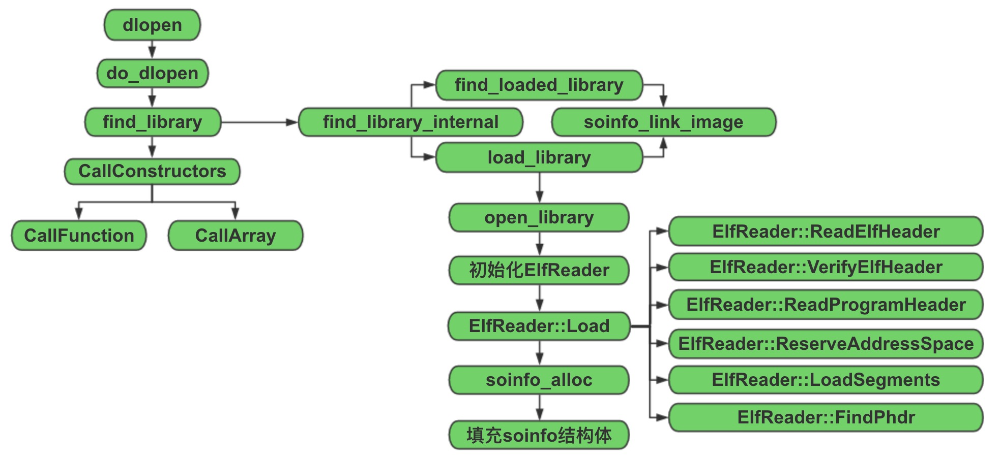](http://www.wireghost.cn/2015/04/09/细说So动态库的加载流程/so.jpg)其核心代码在do_dlopen中实现，根据传入的路径或文件名去查找一个动态库，并执行该动态链接库的初始化代码。

```
void* dlopen(const char* filename, int flags) {
  ScopedPthreadMutexLocker locker(&gDlMutex);
  soinfo* result = do_dlopen(filename, flags);
  if (result == NULL) {
    __bionic_format_dlerror("dlopen failed", linker_get_error_buffer());
    return NULL;
  }
  return result;
}

soinfo* do_dlopen(const char* name, int flags) {
  if ((flags & ~(RTLD_NOW|RTLD_LAZY|RTLD_LOCAL|RTLD_GLOBAL)) != 0) {
    DL_ERR("invalid flags to dlopen: %x", flags);
    return NULL;
  }
  set_soinfo_pool_protection(PROT_READ | PROT_WRITE);
  soinfo* si = find_library(name);
  if (si != NULL) {
    si->CallConstructors();
  }
  set_soinfo_pool_protection(PROT_READ);
  return si;
}
```


再来看find_library这个方法，它会先在solist（已经加载的动态链接库链表）里进行查找，如果找到了就返回对应的soinfo结构体指针。否则，就调用load_library进行加载。然后，调用soinfo_link_image方法，根据soinfo结构体解析相应的Section。

```
static soinfo *find_loaded_library(const char *name)
{
    soinfo *si;
    const char *bname;

    // TODO: don't use basename only for determining libraries
    // http://code.google.com/p/android/issues/detail?id=6670

    bname = strrchr(name, '/');
    bname = bname ? bname + 1 : name;

    for (si = solist; si != NULL; si = si->next) {
        if (!strcmp(bname, si->name)) {
            return si;
        }
    }
    return NULL;
}

static soinfo* find_library_internal(const char* name) {
  if (name == NULL) {
    return somain;
  }

  soinfo* si = find_loaded_library(name);
  if (si != NULL) {
    if (si->flags & FLAG_LINKED) {
      return si;
    }
    DL_ERR("OOPS: recursive link to \"%s\"", si->name);
    return NULL;
  }

  TRACE("[ '%s' has not been loaded yet.  Locating...]", name);
  si = load_library(name);
  if (si == NULL) {
    return NULL;
  }

  // At this point we know that whatever is loaded @ base is a valid ELF
  // shared library whose segments are properly mapped in.
  TRACE("[ init_library base=0x%08x sz=0x%08x name='%s' ]",
        si->base, si->size, si->name);

  if (!soinfo_link_image(si)) {
    munmap(reinterpret_cast<void*>(si->base), si->size);
    soinfo_free(si);
    return NULL;
  }

  return si;
}

static soinfo* find_library(const char* name) {
  soinfo* si = find_library_internal(name);
  if (si != NULL) {
    si->ref_count++;
  }
  return si;
}
```


load_library调用open_library打开一个动态链接库，返回一个句柄，将其与共享库所在的路径作为参数，对ElfReader进行初始化。
[](http://www.wireghost.cn/2015/04/09/细说So动态库的加载流程/7.png)[](http://www.wireghost.cn/2015/04/09/细说So动态库的加载流程/8.png)ElfReader作用域中的Load函数，会执行以下操作：

1. 读取并校验ELF文件头

2. 读ELF程序头并映射至内存

3. 将Load Segment加载进内存

4. 在内存中找到程序的起始地址

   ```
   bool ElfReader::Load() {
     return ReadElfHeader() &&
            VerifyElfHeader() &&
            ReadProgramHeader() &&
            ReserveAddressSpace() &&
            LoadSegments() &&
            FindPhdr();
   }
   
   bool ElfReader::ReadElfHeader() {
     ssize_t rc = TEMP_FAILURE_RETRY(read(fd_, &header_, sizeof(header_)));
     if (rc < 0) {
       DL_ERR("can't read file \"%s\": %s", name_, strerror(errno));
       return false;
     }
     if (rc != sizeof(header_)) {
       DL_ERR("\"%s\" is too small to be an ELF executable", name_);
       return false;
     }
     return true;
   }
   ```


**读ELF文件头**


```
// Loads the program header table from an ELF file into a read-only private
// anonymous mmap-ed block.
bool ElfReader::ReadProgramHeader() {
  phdr_num_ = header_.e_phnum;

  // Like the kernel, we only accept program header tables that
  // are smaller than 64KiB.
  if (phdr_num_ < 1 || phdr_num_ > 65536/sizeof(Elf32_Phdr)) {
    DL_ERR("\"%s\" has invalid e_phnum: %d", name_, phdr_num_);
    return false;
  }

  Elf32_Addr page_min = PAGE_START(header_.e_phoff);  //页的起始地址
  Elf32_Addr page_max = PAGE_END(header_.e_phoff + (phdr_num_ * sizeof(Elf32_Phdr)));  //页的结束地址
  Elf32_Addr page_offset = PAGE_OFFSET(header_.e_phoff);  //程序头部在页中的偏移

  phdr_size_ = page_max - page_min;

  void* mmap_result = mmap(NULL, phdr_size_, PROT_READ, MAP_PRIVATE, fd_, page_min);  //将程序头映射到内存
  if (mmap_result == MAP_FAILED) {
    DL_ERR("\"%s\" phdr mmap failed: %s", name_, strerror(errno));
    return false;
  }

  phdr_mmap_ = mmap_result;
  phdr_table_ = reinterpret_cast<Elf32_Phdr*>(reinterpret_cast<char*>(mmap_result) + page_offset);  //程序头表在内存中的地址
  return true;
}
```


**读ELF程序头，并映射到内存**


```
// Reserve a virtual address range big enough to hold all loadable
// segments of a program header table. This is done by creating a
// private anonymous mmap() with PROT_NONE.
bool ElfReader::ReserveAddressSpace() {
  Elf32_Addr min_vaddr;
  load_size_ = phdr_table_get_load_size(phdr_table_, phdr_num_, &min_vaddr);  //根据页对齐来计算Load段所占用的大小
  if (load_size_ == 0) {
    DL_ERR("\"%s\" has no loadable segments", name_);
    return false;
  }

  uint8_t* addr = reinterpret_cast<uint8_t*>(min_vaddr);
  int mmap_flags = MAP_PRIVATE | MAP_ANONYMOUS;  //匿名私有
  void* start = mmap(addr, load_size_, PROT_NONE, mmap_flags, -1, 0);  //调用mmap为动态库分配一块内存空间
  if (start == MAP_FAILED) {
    DL_ERR("couldn't reserve %d bytes of address space for \"%s\"", load_size_, name_);
    return false;
  }

  load_start_ = start;
  load_bias_ = reinterpret_cast<uint8_t*>(start) - addr;  //真实的加载地址与计算出来的（读ELF程序头中的p_vaddr）加载地址之差
  return true;
}
```


**调用mmap申请一块足够大的内存空间，为后面进行映射Load段的映射做准备**


```
// Map all loadable segments in process' address space.
// This assumes you already called phdr_table_reserve_memory to
// reserve the address space range for the library.
// TODO: assert assumption.
bool ElfReader::LoadSegments() {
  for (size_t i = 0; i < phdr_num_; ++i) {
    const Elf32_Phdr* phdr = &phdr_table_[i];

    if (phdr->p_type != PT_LOAD) {
      continue;
    }

    // Segment addresses in memory.
    Elf32_Addr seg_start = phdr->p_vaddr + load_bias_;
    Elf32_Addr seg_end   = seg_start + phdr->p_memsz;

    Elf32_Addr seg_page_start = PAGE_START(seg_start);
    Elf32_Addr seg_page_end   = PAGE_END(seg_end);

    Elf32_Addr seg_file_end   = seg_start + phdr->p_filesz;

    // File offsets.
    Elf32_Addr file_start = phdr->p_offset;
    Elf32_Addr file_end   = file_start + phdr->p_filesz;

    Elf32_Addr file_page_start = PAGE_START(file_start);
    Elf32_Addr file_length = file_end - file_page_start;

    if (file_length != 0) {
      void* seg_addr = mmap((void*)seg_page_start,          //将Load Segment映射到内存，大小为在ELF文件中所占用的长度
                            file_length,
                            PFLAGS_TO_PROT(phdr->p_flags),
                            MAP_FIXED|MAP_PRIVATE,
                            fd_,
                            file_page_start);
      if (seg_addr == MAP_FAILED) {
        DL_ERR("couldn't map \"%s\" segment %d: %s", name_, i, strerror(errno));
        return false;
      }
    }

    // if the segment is writable, and does not end on a page boundary,
    // zero-fill it until the page limit.
    if ((phdr->p_flags & PF_W) != 0 && PAGE_OFFSET(seg_file_end) > 0) {
      memset((void*)seg_file_end, 0, PAGE_SIZE - PAGE_OFFSET(seg_file_end));  //如果这块Segment是可写的，且在内存中的结束地址不在页的边界上，则将后面的数据都填充0
    }

    seg_file_end = PAGE_END(seg_file_end);

    // seg_file_end is now the first page address after the file
    // content. If seg_end is larger, we need to zero anything
    // between them. This is done by using a private anonymous
    // map for all extra pages.
    if (seg_page_end > seg_file_end) {
      void* zeromap = mmap((void*)seg_file_end,                 //如果seg_end大于它在文件中的长度，则继续为多出的那部分申请内存空间，并填充0。这里应该是主要针对bss段
                           seg_page_end - seg_file_end,
                           PFLAGS_TO_PROT(phdr->p_flags),
                           MAP_FIXED|MAP_ANONYMOUS|MAP_PRIVATE,
                           -1,
                           0);
      if (zeromap == MAP_FAILED) {
        DL_ERR("couldn't zero fill \"%s\" gap: %s", name_, strerror(errno));
        return false;
      }
    }
  }
  return true;
}
```


**将类型为Load的Segment映射到内存**


接下来，soinfo_alloc方法会为该库在共享库链表中分配一个soinfo节点，并初始化其数据结构。

```
static soinfo* load_library(const char* name) {
    // Open the file.
    int fd = open_library(name);
    if (fd == -1) {
        DL_ERR("library \"%s\" not found", name);
        return NULL;
    }

    // Read the ELF header and load the segments.
    ElfReader elf_reader(name, fd);
    if (!elf_reader.Load()) {
        return NULL;
    }

    const char* bname = strrchr(name, '/');
    soinfo* si = soinfo_alloc(bname ? bname + 1 : name);
    if (si == NULL) {
        return NULL;
    }
    si->base = elf_reader.load_start();
    si->size = elf_reader.load_size();
    si->load_bias = elf_reader.load_bias();
    si->flags = 0;
    si->entry = 0;
    si->dynamic = NULL;
    si->phnum = elf_reader.phdr_count();
    si->phdr = elf_reader.loaded_phdr();
    return si;
}

static soinfo* soinfo_alloc(const char* name) {
  if (strlen(name) >= SOINFO_NAME_LEN) {
    DL_ERR("library name \"%s\" too long", name);
    return NULL;
  }

  if (!ensure_free_list_non_empty()) {
    DL_ERR("out of memory when loading \"%s\"", name);
    return NULL;
  }

  // Take the head element off the free list.
  soinfo* si = gSoInfoFreeList;
  gSoInfoFreeList = gSoInfoFreeList->next;

  // Initialize the new element.
  memset(si, 0, sizeof(soinfo));
  strlcpy(si->name, name, sizeof(si->name));
  sonext->next = si;
  sonext = si;

  TRACE("name %s: allocated soinfo @ %p", name, si);
  return si;
}
```


再回过头来看下soinfo_link_image这个方法，它主要实现了动态链接库中section信息的解析：

1. 先解析dynamic section动态节区，进而实现各个Section的定位；
   [](http://www.wireghost.cn/2015/04/09/细说So动态库的加载流程/11.png)

2. 获取其他Section的信息；
   [](http://www.wireghost.cn/2015/04/09/细说So动态库的加载流程/12.png)

3. 待所有section信息解析完毕后，对HASH,STRTAB,SYMTAB节是否正常解析做校验；
   [](http://www.wireghost.cn/2015/04/09/细说So动态库的加载流程/13.png)

4. 若标志位有FLAG_EXE，则表示当前程序执行的是一个可执行文件。到这里可以确定，linker不仅负责加载so，也负责解析加载一个可执行的ELF文件；
   [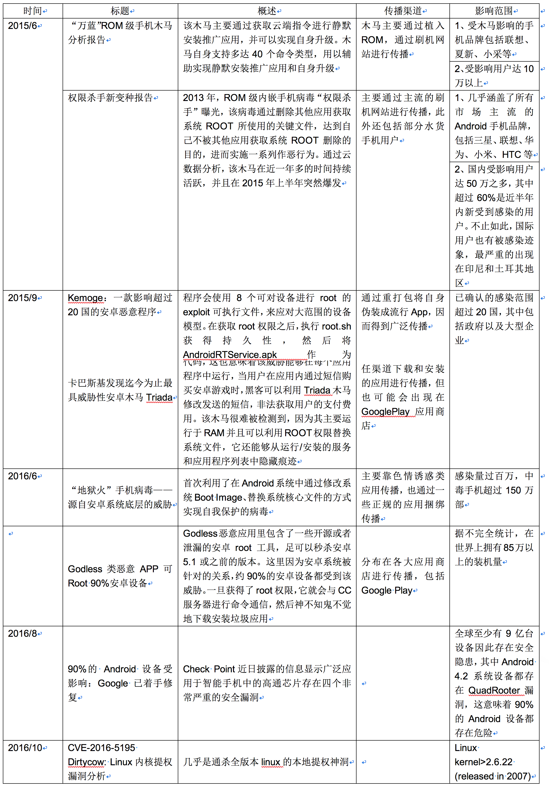](http://www.wireghost.cn/2015/04/09/细说So动态库的加载流程/14.png)

5. 加载所需要的其他共享库，其中find_library会递归调用这个so_link_image函数，直到某个so库没有DT_NEEDED段；
   [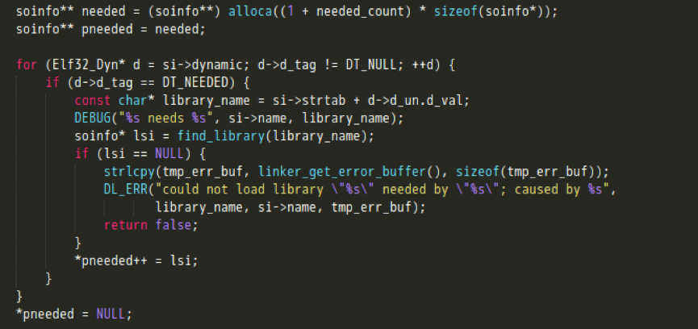](http://www.wireghost.cn/2015/04/09/细说So动态库的加载流程/15.png)

6. 完成rel节的重定位；

   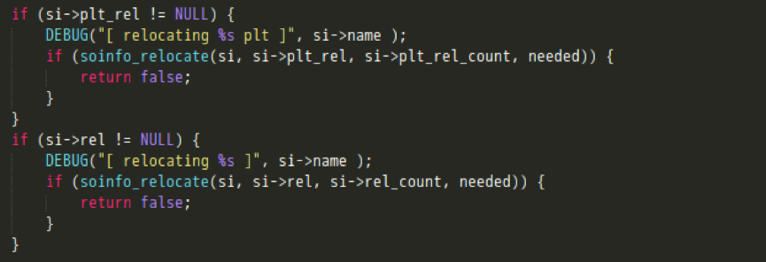

   最后，CallConstructors函数会根据动态节区中的信息，获取该共享库所依赖的所有so文件名，并在已加载的动态链接库链表中进行查找、递归调用它们的初始化函数。当运行所需的依赖库都初始化完成后，再执行init_func、init_array方法初始化该动态库。。

   ```
   void soinfo::CallConstructors() {
     if (constructors_called) {
       return;
     }
   
     // We set constructors_called before actually calling the constructors, otherwise it doesn't
     // protect against recursive constructor calls. One simple example of constructor recursion
     // is the libc debug malloc, which is implemented in libc_malloc_debug_leak.so:
     // 1. The program depends on libc, so libc's constructor is called here.
     // 2. The libc constructor calls dlopen() to load libc_malloc_debug_leak.so.
     // 3. dlopen() calls the constructors on the newly created
     //    soinfo for libc_malloc_debug_leak.so.
     // 4. The debug .so depends on libc, so CallConstructors is
     //    called again with the libc soinfo. If it doesn't trigger the early-
     //    out above, the libc constructor will be called again (recursively!).
     constructors_called = true;
   
     if ((flags & FLAG_EXE) == 0 && preinit_array != NULL) {
       // The GNU dynamic linker silently ignores these, but we warn the developer.
       PRINT("\"%s\": ignoring %d-entry DT_PREINIT_ARRAY in shared library!",
             name, preinit_array_count);
     }
   
     if (dynamic != NULL) {
       for (Elf32_Dyn* d = dynamic; d->d_tag != DT_NULL; ++d) {
         if (d->d_tag == DT_NEEDED) {
           const char* library_name = strtab + d->d_un.d_val;
           TRACE("\"%s\": calling constructors in DT_NEEDED \"%s\"", name, library_name);
           find_loaded_library(library_name)->CallConstructors();
         }
       }
     }
   
     TRACE("\"%s\": calling constructors", name);
   
     // DT_INIT should be called before DT_INIT_ARRAY if both are present.
     CallFunction("DT_INIT", init_func);
     CallArray("DT_INIT_ARRAY", init_array, init_array_count, false);
   }
   ```

## loadLibrary之加载调用

Java层通过System.load或System.loadLibrary来加载一个so文件，它的定义在Android源码中的路径为/libcore/luni/src/main/java/java/lang/System.java，执行流程如下：
[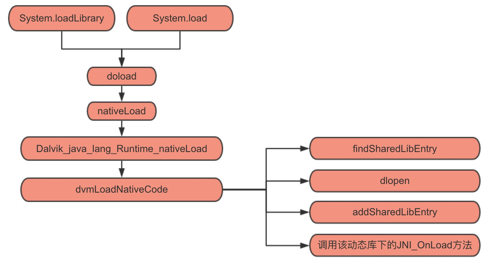](http://www.wireghost.cn/2015/04/09/细说So动态库的加载流程/load2.jpg)接下来，让我们具体看下System.loadLibrary这个方法的实现。可以发现它实际是先通过VMStack.getCallingClassLoader()获取到ClassLoader，然后调用运行时的loadLibrary。

```
/**
 * Loads and links the library with the specified name. The mapping of the
 * specified library name to the full path for loading the library is
 * implementation-dependent.
 *
 * @param libName
 *            the name of the library to load.
 * @throws UnsatisfiedLinkError
 *             if the library can not be loaded.
 */
public void loadLibrary(String libName) {
    loadLibrary(libName, VMStack.getCallingClassLoader());
}

/*
 * Searches for a library, then loads and links it without security checks.
 */
void loadLibrary(String libraryName, ClassLoader loader) {
    if (loader != null) {
        String filename = loader.findLibrary(libraryName);
        if (filename == null) {
            throw new UnsatisfiedLinkError("Couldn't load " + libraryName +
                                           " from loader " + loader +
                                           ": findLibrary returned null");
        }
        String error = doLoad(filename, loader);
        if (error != null) {
            throw new UnsatisfiedLinkError(error);
        }
        return;
    }

    String filename = System.mapLibraryName(libraryName);
    List<String> candidates = new ArrayList<String>();
    String lastError = null;
    for (String directory : mLibPaths) {
        String candidate = directory + filename;
        candidates.add(candidate);

        if (IoUtils.canOpenReadOnly(candidate)) {
            String error = doLoad(candidate, loader);
            if (error == null) {
                return; // We successfully loaded the library. Job done.
            }
            lastError = error;
        }
    }

    if (lastError != null) {
        throw new UnsatisfiedLinkError(lastError);
    }
    throw new UnsatisfiedLinkError("Library " + libraryName + " not found; tried " + candidates);
}
```


以上代码块的主要功能为：

> 1. 若ClassLoader非空，则利用ClassLoader的findLibrary方法来获取library的path；
> 2. 若ClassLoader为空，则根据传递进来的libraryName，获取到library file的name（比如传递“test”进来，经过System.mapLibraryName方法的调用，返回的会是“libtest.so”）。然后再在一个path list（即下面代码截图中的mLibPaths）中查找到这个library file，并最终确定library 的path；
> 3. 调用nativeLoad这个jni方法来load library。

然而，这里其实又牵扯出了几个问题：首先，可用的library path都是哪些？这实际上也决定了我们的so文件放在哪些目录下，才可以真正的被load起来。其次，在native层的nativeLoad又是如何实现加载的？下面会对这两个问题，逐一分析介绍。。

### So的加载路径

先来看看当传入的ClassLoader为空的情况(执行System.loadLibrary时并不会发生)，那么就需要关注下mLibPaths的赋值，相应代码如下：

```
private static final Runtime mRuntime = new Runtime();

/**
 * Holds the library paths, used for native library lookup.
 */
private final String[] mLibPaths = initLibPaths();

private static String[] initLibPaths() {
    String javaLibraryPath = System.getProperty("java.library.path");
    if (javaLibraryPath == null) {
        return EmptyArray.STRING;
    }
    String[] paths = javaLibraryPath.split(":");
    // Add a '/' to the end of each directory so we don't have to do it every time.
    for (int i = 0; i < paths.length; ++i) {
        if (!paths[i].endsWith("/")) {
            paths[i] += "/";
        }
    }
    return paths;
}
```


这里library path list实际上读取自一个system property，直接到System.java下查看初始化代码，它其实是LD_LIBRARY_PATH环境变量的值，具体内容可以查看注释，为”/vendor/lib:/system/lib”
[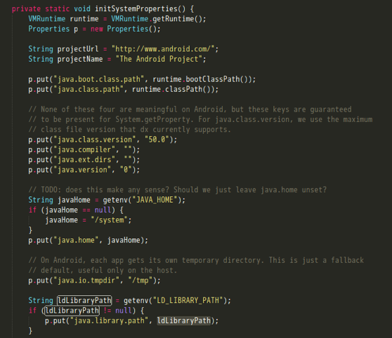](http://www.wireghost.cn/2015/04/09/细说So动态库的加载流程/20.png)[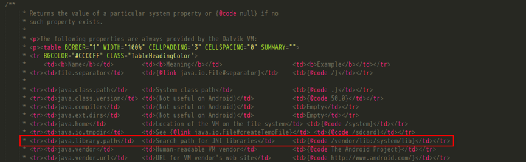](http://www.wireghost.cn/2015/04/09/细说So动态库的加载流程/21.png)然后再来看下传入的ClassLoader非空的情况，也就是ClassLoader的findLibrary的执行过程。

```
/**
 * Returns the absolute path of the native library with the specified name,
 * or {@code null}. If this method returns {@code null} then the virtual
 * machine searches the directories specified by the system property
 * "java.library.path".
 * <p>
 * This implementation always returns {@code null}.
 * </p>
 *
 * @param libName
 *            the name of the library to find.
 * @return the absolute path of the library.
 */
protected String findLibrary(String libName) {
    return null;
}
```


结果发现竟然是一个空函数，而ClassLoader本身也只是个抽象类，那系统中实际运行的ClassLoader是哪个呢？这里可以写个小程序，将实际运行的ClassLoader输出：
[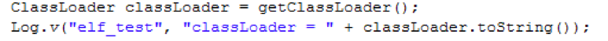](http://www.wireghost.cn/2015/04/09/细说So动态库的加载流程/23.png)[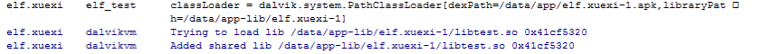](http://www.wireghost.cn/2015/04/09/细说So动态库的加载流程/24.png)于是，得知android系统中ClassLoader真正的实现在dalvik.system.PathClassLoader。此外，在这条日志中，还顺带将PathClassLoader初始化的参数一同打印了出来。其中，libraryPath为”/data/app-lib/elf.xuexi-1”..
不过PathClassLoader只是继承 BaseDexClassLoader，并没有实际内容。
[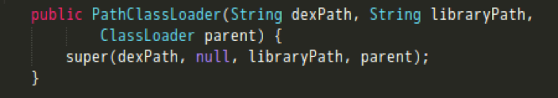](http://www.wireghost.cn/2015/04/09/细说So动态库的加载流程/25.png)继续到BaseDexClassLoader下看findLibrary的实现。
[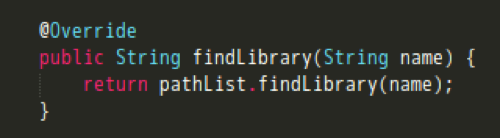](http://www.wireghost.cn/2015/04/09/细说So动态库的加载流程/26.png)[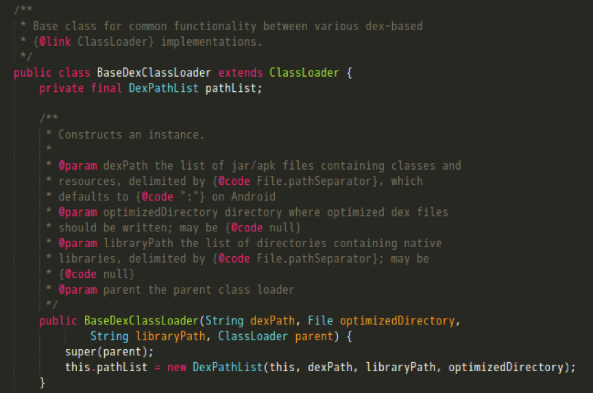](http://www.wireghost.cn/2015/04/09/细说So动态库的加载流程/27.png)可以看到，这里又是在调用DexPathList类下的findLibrary。关注splitLibraryPath方法，它返回了需要加载的动态库所在目录。
[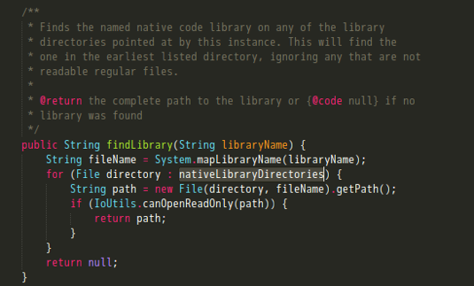](http://www.wireghost.cn/2015/04/09/细说So动态库的加载流程/28.png)[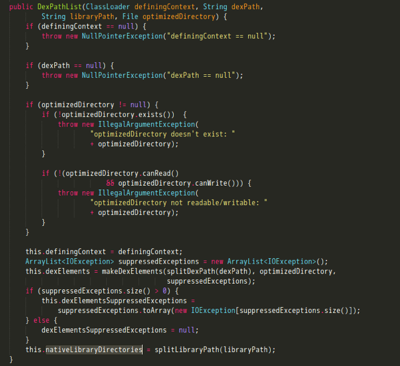](http://www.wireghost.cn/2015/04/09/细说So动态库的加载流程/29.png)这里简单说下splitLibraryPath方法的作用，它是根据传进来的libraryPath和system property中”java.library.path”的属性值即“/vendor/lib:/system/lib”来构造出要加载的动态库所在目录列表。

```
/**
 * Splits the given library directory path string into elements
 * using the path separator ({@code File.pathSeparator}, which
 * defaults to {@code ":"} on Android, appending on the elements
 * from the system library path, and pruning out any elements that
 * do not refer to existing and readable directories.
 */
private static File[] splitLibraryPath(String path) {
    // Native libraries may exist in both the system and
    // application library paths, and we use this search order:
    //
    //   1. this class loader's library path for application libraries
    //   2. the VM's library path from the system property for system libraries
    //
    // This order was reversed prior to Gingerbread; see http://b/2933456.
    ArrayList<File> result = splitPaths(path, System.getProperty("java.library.path"), true);
    return result.toArray(new File[result.size()]);
}

/**
 * Splits the given path strings into file elements using the path
 * separator, combining the results and filtering out elements
 * that don't exist, aren't readable, or aren't either a regular
 * file or a directory (as specified). Either string may be empty
 * or {@code null}, in which case it is ignored. If both strings
 * are empty or {@code null}, or all elements get pruned out, then
 * this returns a zero-element list.
 */
private static ArrayList<File> splitPaths(String path1, String path2,
        boolean wantDirectories) {
    ArrayList<File> result = new ArrayList<File>();
    splitAndAdd(path1, wantDirectories, result);
    splitAndAdd(path2, wantDirectories, result);
    return result;
}

/**
 * Helper for {@link #splitPaths}, which does the actual splitting
 * and filtering and adding to a result.
 */
private static void splitAndAdd(String searchPath, boolean directoriesOnly,
        ArrayList<File> resultList) {
    if (searchPath == null) {
        return;
    }
    for (String path : searchPath.split(":")) {
        try {
            StructStat sb = Libcore.os.stat(path);
            if (!directoriesOnly || S_ISDIR(sb.st_mode)) {
                resultList.add(new File(path));
            }
        } catch (ErrnoException ignored) {
        }
    }
}
```


现在可以对动态链接库的加载路径做个总结了，系统默认的目录为”/vendor/lib”和”/system/lib”。当使用System.loadLibrary或System.load来加载一个共享库的时候，会将VM栈中的ClassLoader传入。之后调用findLibrary方法，在两个目录中去寻找指定的so文件：一个是构造ClassLoader时，传进来的那个libraryPath；另一个则是system property中”java.library.path”的属性值。也就是说，实际上是会在如下的3个目录中进行查找：

> 1. “/vendor/lib”
> 2. “/system/lib”
> 3. “/data/app-lib/包名-n”

对于”/data/app-lib/包名-n”这个路径，大家可能会比较陌生，但应该都知道”/data/data/包名/lib”目录，这里就简单讲解下apk安装过程中的一点细节，以说明二者之间的关系（在Android源码中的路径为”/frameworks/native/cmds/installd/commands.c”）

```
int install(const char *pkgname, uid_t uid, gid_t gid, const char *seinfo)
{
    char pkgdir[PKG_PATH_MAX];
    char libsymlink[PKG_PATH_MAX];
    char applibdir[PKG_PATH_MAX];
    struct stat libStat;

    if ((uid < AID_SYSTEM) || (gid < AID_SYSTEM)) {
        ALOGE("invalid uid/gid: %d %d\n", uid, gid);
        return -1;
    }

    if (create_pkg_path(pkgdir, pkgname, PKG_DIR_POSTFIX, 0)) {  //创建包路径，"/data/data/包名"
        ALOGE("cannot create package path\n");
        return -1;
    }

    if (create_pkg_path(libsymlink, pkgname, PKG_LIB_POSTFIX, 0)) {  //创建库路径，"/data/data/包名/lib"
        ALOGE("cannot create package lib symlink origin path\n");
        return -1;
    }

    if (create_pkg_path_in_dir(applibdir, &android_app_lib_dir, pkgname, PKG_DIR_POSTFIX)) {  //创建"/data/app-lib/包名"目录
        ALOGE("cannot create package lib symlink dest path\n");
        return -1;
    }

    if (mkdir(pkgdir, 0751) < 0) {
        ALOGE("cannot create dir '%s': %s\n", pkgdir, strerror(errno));
        return -1;
    }
    if (chmod(pkgdir, 0751) < 0) {
        ALOGE("cannot chmod dir '%s': %s\n", pkgdir, strerror(errno));
        unlink(pkgdir);
        return -1;
    }

    if (lstat(libsymlink, &libStat) < 0) {
        if (errno != ENOENT) {
            ALOGE("couldn't stat lib dir: %s\n", strerror(errno));
            return -1;
        }
    } else {
        if (S_ISDIR(libStat.st_mode)) {
            if (delete_dir_contents(libsymlink, 1, 0) < 0) {
                ALOGE("couldn't delete lib directory during install for: %s", libsymlink);
                return -1;
            }
        } else if (S_ISLNK(libStat.st_mode)) {
            if (unlink(libsymlink) < 0) {
                ALOGE("couldn't unlink lib directory during install for: %s", libsymlink);
                return -1;
            }
        }
    }

    if (symlink(applibdir, libsymlink) < 0) {
        ALOGE("couldn't symlink directory '%s' -> '%s': %s\n", libsymlink, applibdir,
                strerror(errno));
        unlink(pkgdir);
        return -1;
    }

    if (selinux_android_setfilecon2(pkgdir, pkgname, seinfo, uid) < 0) {
        ALOGE("cannot setfilecon dir '%s': %s\n", pkgdir, strerror(errno));
        unlink(libsymlink);
        unlink(pkgdir);
        return -errno;
    }

    if (chown(pkgdir, uid, gid) < 0) {
        ALOGE("cannot chown dir '%s': %s\n", pkgdir, strerror(errno));
        unlink(libsymlink);
        unlink(pkgdir);
        return -1;
    }

    return 0;
}
```


以上代码会先构造几个目录名：pkgdir为”/data/data/包名”，libsymlink为”/data/data/包名/lib”，applibdir为”/data/app-lib/包名”。然后创建相应目录，并赋权限。之后，建立”/data/data/包名/lib”指向”/data/app-lib/包名”的符号链接。
现在再回过头来说明下”/data/app-lib/包名-n”、”/data/data/包名/lib”这二者之间的关系。在”/data/data/包名/“目录下执行ls –l命令，就会发现lib是一个链接，So其实是放在”/data/app-lib/包名-n”路径下的。。
[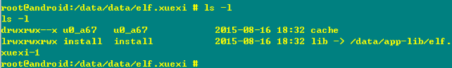](http://www.wireghost.cn/2015/04/09/细说So动态库的加载流程/30.png)

### Native 层的加载实现

doLoad实际上是调用本地的nativeLoad方法，nativeLoad会先更新LD_LIBRARY_PATH，然后执行dvmLoadNativeCode函数，真正实现so文件的加载。。

```
/*
 * static String nativeLoad(String filename, ClassLoader loader, String ldLibraryPath)
 *
 * Load the specified full path as a dynamic library filled with
 * JNI-compatible methods. Returns null on success, or a failure
 * message on failure.
 */
static void Dalvik_java_lang_Runtime_nativeLoad(const u4* args,
    JValue* pResult)
{
    StringObject* fileNameObj = (StringObject*) args[0];
    Object* classLoader = (Object*) args[1];
    StringObject* ldLibraryPathObj = (StringObject*) args[2];

    assert(fileNameObj != NULL);
    char* fileName = dvmCreateCstrFromString(fileNameObj);

    if (ldLibraryPathObj != NULL) {
        char* ldLibraryPath = dvmCreateCstrFromString(ldLibraryPathObj);
        void* sym = dlsym(RTLD_DEFAULT, "android_update_LD_LIBRARY_PATH");
        if (sym != NULL) {
            typedef void (*Fn)(const char*);
            Fn android_update_LD_LIBRARY_PATH = reinterpret_cast<Fn>(sym);
            (*android_update_LD_LIBRARY_PATH)(ldLibraryPath);
        } else {
            ALOGE("android_update_LD_LIBRARY_PATH not found; .so dependencies will not work!");
        }
        free(ldLibraryPath);
    }

    StringObject* result = NULL;
    char* reason = NULL;
    bool success = dvmLoadNativeCode(fileName, classLoader, &reason);
    if (!success) {
        const char* msg = (reason != NULL) ? reason : "unknown failure";
        result = dvmCreateStringFromCstr(msg);
        dvmReleaseTrackedAlloc((Object*) result, NULL);
    }

    free(reason);
    free(fileName);
    RETURN_PTR(result);
}
```


dvmLoadNativeCode定义在Android源码中的路径为/dalvik/vm/Native.cpp，它的主要功能如下：

1. 调用findSharedLibEntry方法，遍历查找已加载的lib。具体来说，就是先用待加载的lib路径名计算出一个32位hash值，然后遍历gDvm中的nativeLibs（其结构为HashTable用来保存加载的本地库），如果找到则返回一个SharedLib结构。这里如果LIB已被加载，则会对其加载的ClassLoader进行比较，JNI只允许同一个LIB只被一个ClassLoader加载;
   [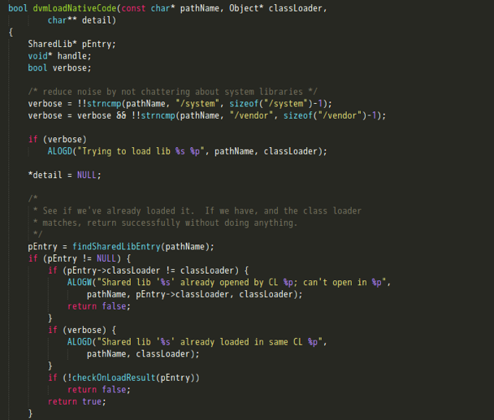](http://www.wireghost.cn/2015/04/09/细说So动态库的加载流程/31.png)[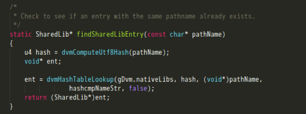](http://www.wireghost.cn/2015/04/09/细说So动态库的加载流程/32.png)[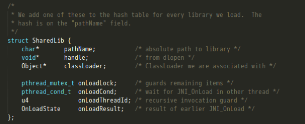](http://www.wireghost.cn/2015/04/09/细说So动态库的加载流程/33.png)
2. 调用dlopen打开一个so;
   [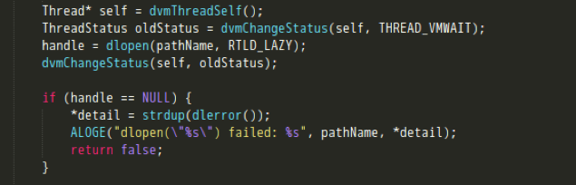](http://www.wireghost.cn/2015/04/09/细说So动态库的加载流程/34.png)
3. 将新加载的LIB插入到gDvm保存的链表中，执行JNI_OnLoad的调用。
   [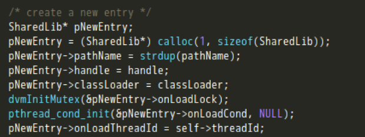](http://www.wireghost.cn/2015/04/09/细说So动态库的加载流程/35.png)[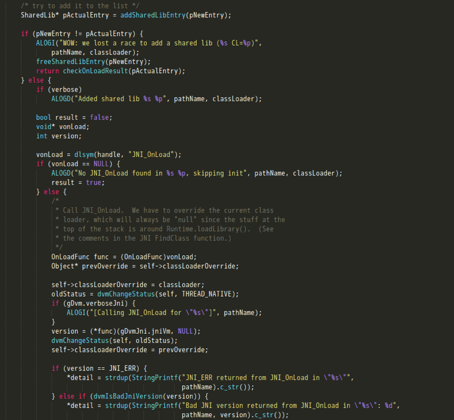](http://www.wireghost.cn/2015/04/09/细说So动态库的加载流程/36.png)

## 总结

在了解So在内存中的加载原理后，可以得知以下几点：

> 1. So的加载路径为：”/vendor/lib”、”/system/lib”、”/data/app-lib/包名-n”;
> 2. So的入口为init_array、init_func这些初始化函数。这部分在dlopen的过程中就会执行，再之后的是JNI_Onload方法的调用。这里面可以注册一些本地方法，也可以继续做些变量的初始化等操作;
> 3. 在So的加载流程中，最终会被存放到SharedLib这个结构体中，并添加到nativeLibs这个hash表下。。