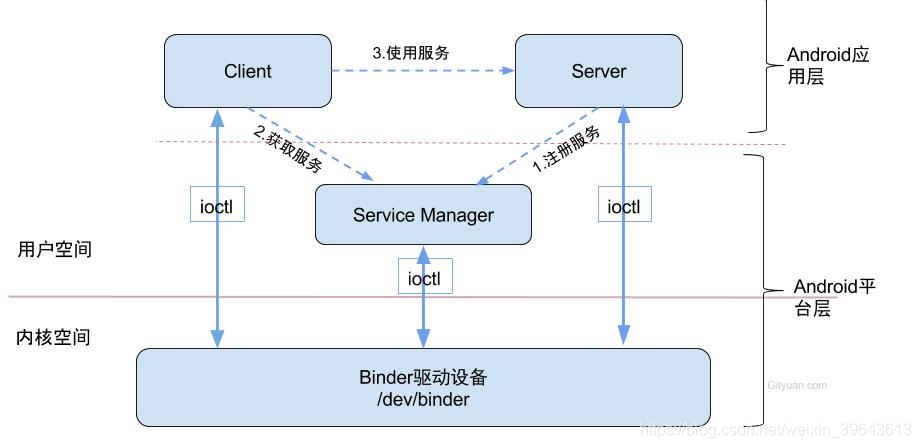
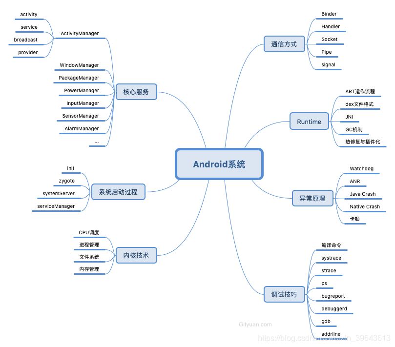
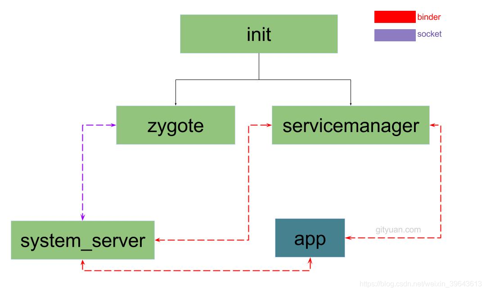

# Android 操作系统架构开篇

src:http://gityuan.com/android/

# 一、引言

众所周知，`Android`是谷歌开发的一款基于`Linux`的开源操作系统，从诞生至今已有10余年，这一路走来`Android`遇到哪些问题？大版本升级朝着什么方向演进？Android的未来如何？我的公号[《Android 技术架构演进与未来》 ](https://mp.weixin.qq.com/s/W38aauoCEEUbL8KvUkb_Rw)讲解了`Android`一路走来，在用户体验、性能、功耗、安全、隐私等方面取得的很大进步，以及未来可能的方向。

本文作为`Android`系统架构的开篇，起到提纲挈领的作用，从系统整体架构角度概要讲解`Android`系统的核心技术点，带领大家初探`Android`系统全貌以及内部运作机制。虽然`Android`系统非常庞大且错综复杂，需要具备全面的技术栈，但整体架构设计清晰。`Android`底层内核空间以`Linux Kernel`作为基石，上层用户空间由`Native`系统库、虚拟机运行环境、框架层组成，通过系统调用(`Syscall`)连通系统的内核空间与用户空间。对于用户空间主要采用`C++`和`Java`代码编写，通过JNI技术打通用户空间的`Java`层和`Native`层(`C++/C`)，从而连通整个系统。

为了能让大家整体上大致了解`Android`系统涉及的知识层面，先来看一张`Google`官方提供的经典分层架构图，从下往上依次分为`Linux`内核、`HAL`、系统`Native`库和`Android`运行时环境、`Java`框架层以及应用层这5层架构，其中每一层都包含大量的子模块或子系统。

上图采用静态分层方式的架构划分，众所周知，程序代码是死的，系统运转是活的，各模块代码运行在不同的进程(线程)中，相互之间进行着各种错终复杂的信息传递与交互流，从这个角度来说此图并没能体现`Android`整个系统的内部架构、运行机理，以及各个模块之间是如何衔接与配合工作的。

**为了更深入地掌握`Android`整个架构思想以及各个模块在`Android`系统所处的地位与价值，计划以`Android`系统启动过程为主线，以进程的视角来诠释`Android M`系统全貌**，全方位的深度剖析各个模块功能，争取各个击破。这样才能犹如庖丁解牛，解决、分析问题则能游刃有余。

# 二、Android架构

`Google`提供的5层架构图很经典，但为了更进一步透视`Android`系统架构，本文更多的是以进程的视角，以分层的架构来诠释`Android`系统的全貌，阐述`Android`内部的环环相扣的内在联系。

系统启动架构图

图解：` Android`系统启动过程由上图从下往上的一个过程是由`Boot Loader`引导开机，然后依次进入 -> `Kernel` ->` Native` -> `Framework `-> `App`，接来下简要说说每个过程。

关于`Loader`层：

* `Boot ROM`: 当手机处于关机状态时，长按`Power`键开机，引导芯片开始从固化在`ROM`里的预设代码开始执行，然后加载引导程序到`RAM`；
* `Boot Loader`：这是启动Android系统之前的引导程序，主要是检查`RAM`，初始化硬件参数等功能。

## 2.1 Linux内核层

`Android`平台的基础是`Linux`内核，比如`ART`虚拟机最终调用底层`Linux`内核来执行功能。`Linux`内核的安全机制为`Android`提供相应的保障，也允许设备制造商为内核开发硬件驱动程序。

* 启动`Kernel`的`swapper`进程(pid=0)：**该进程又称为`idle`进程, 系统初始化过程`Kernel`由无到有开创的第一个进程, 用于初始化进程管理、内存管理，加载`Display`,`Camera Driver`，`Binder Driver`等相关工作；**
* 启动`kthreadd`进程（pid=2）：**是Linux系统的内核进程，会创建内核工作线程`kworkder`，软中断线程`ksoftirqd`，`thermal`等内核守护进程。`kthreadd`进程是所有内核进程的鼻祖。**

## 2.2 硬件抽象层 (HAL)

硬件抽象层 (`HAL`) 提供标准接口，`HAL`包含多个库模块，其中每个模块都为特定类型的硬件组件实现一组接口，比如`WIFI`/蓝牙模块，当框架`API`请求访问设备硬件时，`Android`系统将为该硬件加载相应的库模块。

## 2.3 Android Runtime & 系统库

每个应用都在其自己的进程中运行，都有自己的虚拟机实例。`ART`通过执行`DEX`文件可在设备运行多个虚拟机，`DEX`文件是一种专为`Android`设计的字节码格式文件，经过优化，使用内存很少。**ART主要功能包括：预先(`AOT`)和即时(`JIT`)编译，优化的垃圾回收(`GC`)，以及调试相关的支持。**

这里的`Native`系统库主要包括`init`孵化来的用户空间的守护进程、`HAL`层以及开机动画等。启动`init`进程(pid=1),是`Linux`系统的用户进程，`init`进程是所有用户进程的鼻祖。

* `init`进程会孵化出`ueventd`、`logd`、`healthd`、`installd`、`adbd`、`lmkd`等用户守护进程；
* init进程还启动`servicemanager`(`binder`服务管家)、`bootanim`(开机动画)等重要服务
* `init`进程孵化出`Zygote`进程，`Zygote`进程是`Android`系统的第一个`Java`进程(即虚拟机进程)，`Zygote是所有Java进程的父进程`，`Zygote`进程本身是由`init`进程孵化而来的。

## 2.4 Framework层

* `Zygote`进程，是由`init`进程通过解析`init.rc`文件后`fork`生成的，`Zygote`进程主要包含：

1. 加载`ZygoteInit`类，注册`Zygote Socket`服务端套接字
2. 加载虚拟机
3. 提前加载类`preloadClasses`
4. 提前加载资源`preloadResouces`

* `System Server`进程，是由`Zygote`进程`fork`而来，`System Server`是`Zygote`孵化的第一个进程，`System Server`负责启动和管理整个`Java framework`，包含`ActivityManager`，`WindowManager`，`PackageManager`，`PowerManager`等服务。
* `Media Server`进程，是由`init`进程`fork`而来，负责启动和管理整个`C++ framework`，包含`AudioFlinger`，`Camera Service`等服务。

## 2.5 App层

* `Zygote`进程孵化出的第一个`App`进程是`Launcher`，这是用户看到的桌面`App`；
* `Zygote`进程还会创建`Browser`，`Phone`，`Email`等`App`进程，每个`App`至少运行在一个进程上。
* 所有的`App`进程都是由`Zygote`进程`fork`生成的。

## 2.6 Syscall && JNI

* `Native`与`Kernel`之间有一层系统调用(`SysCall`)层，见[Linux系统调用(Syscall)原理](http://gityuan.com/2016/05/21/syscall/);
* `Java`层与`Native`(`C/C++`)层之间的纽带`JNI`，见[Android JNI原理分析](http://gityuan.com/2016/05/28/android-jni/)。

# 三、通信方式

无论是`Android`系统，还是各种`Linux`衍生系统，各个组件、模块往往运行在各种不同的进程和线程内，这里就必然涉及进程/线程之间的通信。对于`IPC`(`Inter-Process Communication`, 进程间通信)，`Linux`现有管道、消息队列、共享内存、套接字、信号量、信号这些`IPC`机制，Android额外还有`Binder IPC`机制，`Android OS中`的`Zygote`进程的`IPC`采用的是`Socket`机制，在上层`system server`、`media server`以及上层`App`之间更多的是采用`Binder IPC`方式来完成跨进程间的通信。对于`Android`上层架构中，很多时候是在同一个进程的线程之间需要相互通信，例如同一个进程的主线程与工作线程之间的通信，往往采用的`Handler`消息机制。

想深入理解`Android`内核层架构，必须先深入理解`Linux`现有的`IPC`机制；对于`Android`上层架构，则最常用的通信方式是`Binder`、`Socket`、`Handler`，当然也有少量其他的`IPC`方式，比如杀进程`Process.killProcess()`采用的是`signal`方式。下面说说`Binder`、`Socket`、`Handler`。

## 3.1 Binder

`Binder`作为`Android`系统提供的一种`IPC`机制，无论从系统开发还是应用开发，都是`Android`系统中最重要的组成，也是最难理解的一块知识点，想了解[为什么Android要采用Binder作为IPC机制？ ](https://www.zhihu.com/question/39440766/answer/89210950)可查看我在知乎上的回答。深入了解`Binder`机制，最好的方法便是阅读源码，借用`Linux`鼻祖`Linus Torvalds`曾说过的一句话：`Read The Fucking Source Code`。下面简要说说`Binder IPC`原理。

### 3.1.1 Binder IPC原理

`Binder`通信采用`c/s`架构，从组件视角来说，包含`Client`、`Server`、`ServiceManager`以及`binder`驱动，其中`ServiceManager`用于管理系统中的各种服务。

* 想进一步了解`Binder`，可查看[Binder系列—开篇](http://gityuan.com/2015/10/31/binder-prepare/)，`Binder`系列花费了13篇文章的篇幅，从源码角度出发来讲述`Driver`、`Native`、`Framework`、`App`四个层面的整个完整流程。根据有些读者反馈这个系列还是不好理解，这个`binder`涉及的层次跨度比较大，知识量比较广，建议大家先知道`binder`是用于进程间通信，有个大致概念就可以先去学习系统基本知识，等后面有一定功力再进一步深入研究`Binder`机制。

### 3.1.2 Binder原理篇

| 序号 | 文章名                                                    | 概述                                          |
| ---- | --------------------------------------------------------- | --------------------------------------------- |
| 0    | Binder系列—开篇                                           | `Binder`概述                                  |
| 1    | Binder系列3—启动Service Manager	ServiceManager守护进程 | 注册和查询服务                                |
| 2    | Binder系列4—获取Service Manager                           | 获取代理对象`BpServiceManager`                |
| 3    | Binder系列5—注册服务(addService)                          | 注册`Media`服务                               |
| 4    | Binder系列6—获取服务(getService)                          | 获取`Media`代理，以及`DeathRecipient`         |
| 5    | Binder系列7—framework层分析                               | `framework`层服务注册和查询，`Binder`注册     |
| 6    | 理解Binder线程池的管理                                    | `Binder`的`startThreadPool`过程               |
| 7    | 彻底理解Android Binder通信架构                            | `startService`为主线                          |
| 8    | Binder系列10—总结                                         | `Binder`的简单总结                            |
| 9    | Binder IPC的权限控制                                      | `clearCallingIdentity/restoreCallingIdentity` |
| 10   | Binder死亡通知机制之linkToDeath                           | `Binder`死亡通知机制                          |

### 3.1.3 Binder驱动篇:

| 序号 | 文章名                        | 概述                                        |
| ---- | ----------------------------- | ------------------------------------------- |
| 1    | Binder系列1—Binder Driver初探 | 驱动open/mmap/ioctl，以及binder结构体       |
| 2    | Binder系列2—Binder            | ` Driver`再探	`Binder`通信协议，内存机制 |

### 3.1.4 Binder使用篇:

| 序号 | 文章名                     | 概述                                   |
| ---- | -------------------------- | -------------------------------------- |
| 1    | Binder系列8—如何使用Binder | `Native`层、Framwrok层自定义Binder服务 |
| 2    | Binder系列9—如何使用AIDL   | `App`层自定义`Binder`服务              |

## 3.2 Socket

`Socket`通信方式也是`C/S`架构，比`Binder`简单很多。在`Android`系统中采用`Socket`通信方式的主要有：

* `zygote`：用于孵化进程，`system_server`创建进程是通过`socket`向`zygote`进程发起请求；
* `installd`：用于安装`App`的守护进程，上层`PackageManagerService`很多实现最终都是交给它来完成；
  `lmkd`：`lowmemorykiller`的守护进程，`Java`层的`LowMemoryKiller`最终都是由`lmkd`来完成；
  `adbd`：这个也不用说，用于服务`adb`；
  `logcatd`:这个不用说，用于服务`logcat`；
  `vold`：即`volume Daemon`，是存储类的守护进程，用于负责如`USB`、`Sdcard`等存储设备的事件处理。

等等还有很多，这里不一一列举，`Socket`方式更多的用于`Android framework`层与`native`层之间的通信。`Socket`通信方式相对于`binder`比较简单，这里省略。

等等还有很多，这里不一一列举，`Socket`方式更多的用于`Android framework`层与`native`层之间的通信。`Socket`通信方式相对于`binder`比较简单，这里省略。

## 3.3 Handler

**`Binder/Socket`用于进程间通信，而`Handler`消息机制用于同进程的线程间通信**，Handler消息机制是由一组`MessageQueue`、`Message`、`Looper`、`Handler`共同组成的，为了方便且称之为`Handler`消息机制。

有人可能会疑惑，为何`Binder/Socket`用于进程间通信，能否用于线程间通信呢？答案是肯定，对于两个具有独立地址空间的进程通信都可以，当然也能用于共享内存空间的两个线程间通信，这就好比杀鸡用牛刀。接着可能还有人会疑惑，那`handler`消息机制能否用于进程间通信？答案是不能，`Handler`只能用于共享内存地址空间的两个线程间通信，即同进程的两个线程间通信。很多时候，`Handler`是工作线程向`UI`主线程发送消息，即`App`应用中只有主线程能更新`UI`，其他工作线程往往是完成相应工作后，通过`Handler`告知主线程需要做出相应地`UI`更新操作，`Handler`分发相应的消息给`UI`主线程去完成，如下图：

由于工作线程与主线程共享地址空间，即`Handler`实例对象`mHandler`位于线程间共享的内存堆上，工作线程与主线程都能直接使用该对象，只需要注意多线程的同步问题。工作线程通过`mHandler`向其成员变量`MessageQueue`中添加新`Message`，主线程一直处于`loop()`方法内，当收到新的`Message`时按照一定规则分发给相应的`handleMessage()`方法来处理。所以说，`Handler`消息机制用于同进程的线程间通信，其核心是线程间共享内存空间，而不同进程拥有不同的地址空间，也就不能用`handler`来实现进程间通信。

上图只是`Handler`消息机制的一种处理流程，是不是只能工作线程向`UI`主线程发消息呢，其实不然，可以是`UI`线程向工作线程发送消息，也可以是多个工作线程之间通过`handler`发送消息。更多关于`Handler`消息机制文章：

* [Android消息机制-Handler(framework篇)](http://gityuan.com/2015/12/26/handler-message-framework/)
* [Android消息机制-Handler(native篇)](http://gityuan.com/2015/12/27/handler-message-native/)
* [Android消息机制3-Handler(实战)](http://gityuan.com/2016/01/01/handler-message-usage/)

要理解`framework`层源码，掌握这3种基本的进程/线程间通信方式是非常有必要，当然`Linux`还有不少其他的`IPC`机制，比如共享内存、信号、信号量，在源码中也有体现，如果想全面彻底地掌握`Android`系统，还是需要对每一种`IPC`机制都有所了解。

# 四、核心提纲

博主对于`Android`从系统底层一路到上层都有自己的理解和沉淀，通过前面对系统启动的介绍，相信大家对`Android`系统有了一个整体观。接下来需抓核心、理思路，争取各个击破。后续将持续更新和完善整个大纲，不限于进程、内存、`IO`、系统服务架构以及分析实战等文章。

当然本站有一些文章没来得及进一步加工，有时间根据大家的反馈，不断修正和完善所有文章，争取给文章，再进一步精简非核心代码，增加可视化图表以及文字的结论性分析。基于 **`Android 6.0`的源码**，专注于分享`Android`系统原理、架构分析的原创文章。

**建议阅读群体**： 适合于正从事或者有兴趣研究`Android`系统的工程师或者技术爱好者，也适合`Android App`高级工程师；对于尚未入门或者刚入门的`App`工程师阅读可能会有点困难，建议先阅读更基础的资料，再来阅读本站博客。

看到`Android`整个系统架构是如此庞大的, 该问如何学习`Android`系统, 以下是我自己的`Android`的学习和研究论，仅供参考[如何自学Android](http://gityuan.com/2016/04/24/how-to-study-android/)。

从整理上来列举一下Android系统的核心知识点概览：

## 4.1 系统启动系列

[Android系统启动-概述](http://gityuan.com/2016/02/01/android-booting/): Android系统中极其重要进程：`init`, `zygote`, `system_server`, `servicemanager` 进程:

| 序号 | 进程启动                | 概述                                                    |
| ---- | ----------------------- | ------------------------------------------------------- |
| 1    | init进程                | `Linux`系统中用户空间的第一个进程, Init.main            |
| 2    | zygote进程              | 所有`Ａpp`进程的父进程, ZygoteInit.main                 |
| 3    | system_server进程(上篇) | 系统各大服务的载体, `forkSystemServer`过程              |
| 4    | system_server进程(下篇) | 系统各大服务的载体, `SystemServer.main`                 |
| 5    | servicemanager进程      | `binder`服务的大管家, 守护进程循环运行在`binder_loop`   |
| 6    | app进程                 | 通过`Process.start`启动`App`进程, `ActivityThread.main` |

再来看看守护进程(也就是进程名一般以d为后缀，比如`logd`，此处`d`是指`daemon`的简称), 下面介绍部分守护进程：

* [debuggerd](http://gityuan.com/2016/06/15/android-debuggerd/)
* [installd](http://gityuan.com/2016/11/13/android-installd/)
* [lmkd](http://gityuan.com/2016/09/17/android-lowmemorykiller/)
* [logd](http://gityuan.com/2018/01/27/android-log/)

## 4.2 系统稳定性系列

[Android系统稳定性](http://gityuan.com/2016/06/19/stability_summary/)主要是异常崩溃(`crash`)和执行超时(`timeout`):

| 序号 | 文章名                        | 概述                                        |
| ---- | ----------------------------- | ------------------------------------------- |
| 1    | 理解`Android ANR`的触发原理   | 触发`ANR`的场景以及机理                     |
| 2    | Input系统—ANR原理分析         | `input`触发`ANR`的原理                      |
| 3    | 理解Android ANR的信息收集过程 | `AMS.appNotResponding`过程分析,收集`traces` |
| 4    | 解读Java进程的Trace文件       | `kill -3 `信息收集过程                      |
| 5    | Native进程之Trace原理         | `debuggerd -b `信息收集过程                 |
| 6    | WatchDog工作原理              | ` WatchDog`触发机制                         |
| 7    | 理解Java Crash处理流程        | `AMS.handleApplicationCrash`过程分析        |
| 8    | 理解Native Crash处理流程      | `debuggerd`守护进程                         |
| 9    | global reference限制策略      | `global reference`                          |

## 4.3 Android进程系列

进程/线程是操作系统的魂，各种服务、组件、子系统都是依附于具体的进程实体。深入理解进程机制对于掌握`Android`系统整体架构和运转机制是非常有必要的，是系统工程师的基本功，下面列举进程相关的文章：

| 序号 | 文章名                          | 概述                                        |
| ---- | ------------------------------- | ------------------------------------------- |
| 1    | 理解Android进程创建流程         | `Process.start`过程分析                     |
| 2    | 理解杀进程的实现原理            | `Process.killProcess`过程分析               |
| 3    | Android四大组件与进程启动的关系 | `AMS.startProcessLocked`过程分析组件与进程  |
| 4    | Android进程绝杀技–forceStop     | `force-stop`过程分析彻底移除组件与杀进程    |
| 5    | 理解Android线程创建流程         | 3种不同线程的创建过程                       |
| 6    | 彻底理解Android Binder通信架构  | 以`start-service`为线,阐述进程间通信机理    |
| 7    | 理解Binder线程池的管理          | `Zygote fork`的进程都默认开启`binder`线程池 |
| 8    | Android进程生命周期与ADJ        | 进程`adj`, `processState`以及`lmk`          |
| 9    | Android LowMemoryKiller原理分析 | `lmk`原理分析                               |
| 10   | 进程优先级                      | 进程`nice`,`thread priority`以及scheduler   |
| 11   | Android进程调度之adj算法        | `updateOomAdjLocked`过程                    |
| 12   | Android进程整理                 | 整理系统的所有进程/线程                     |
| 13   | 解读Android进程优先级ADJ算法    | `Android`进程`ADJ`优先级                    |

## 4.4 四大组件系列

对于`App`来说，`Android`应用的四大组件`Activity`，`Service`，`Broadcast Receiver`， `Content Provider`最为核心，接下分别展开介绍：

| 序号 | 文章名                          | 概述                |
| ---- | ------------------------------- | ------------------- |
| 1    | startActivity启动过程分析       | `Activity`          |
| 2    | 简述Activity生命周期            | `Activity`          |
| 3    | startService启动过程分析        | `Service`           |
| 4    | bindService启动过程分析         | `Service`           |
| 5    | 以Binder视角来看Service启动     | `Service`           |
| 6    | Android Broadcast广播机制分析   | `Broadcast`         |
| 7    | 理解ContentProvider原理         | `ContentProvider`   |
| 8    | ContentProvider引用计数         | `ContentProvider`   |
| 9    | Activity与Service生命周期       | `Activity&&Service` |
| 10   | 简述Activity与Window关系        | `Activity&&Window`  |
| 11   | 四大组件之综述                  | `AMS`               |
| 12   | 四大组件之ServiceRecord         | `Service`           |
| 13   | 四大组件之BroadcastRecord       | `Broadcast`         |
| 14   | 四大组件之ContentProviderRecord | `ContentProvider`   |
| 15   | 理解Android Context             | `Context`           |
| 16   | 理解Application创建过程         | `Application`       |
| 17   | unbindService流程分析           | `Service`           |
| 18   | 四大组件之ActivityRecord        | `Activity`          |
| 19   | AMS总结(一)                     | `AMS`               |

## 4.5 图形系统系列

图形也是整个系统非常复杂且重要的一个系列，涉及`WindowManager`,`SurfaceFlinger`服务。

| 序号 | 文章名                        | 类别             |
| ---- | ----------------------------- | ---------------- |
| 1    | WindowManager启动篇           | `Window`         |
| 2    | WMS之启动窗口篇               | `Window`         |
| 3    | 以Window视角来看startActivity | `Window`         |
| 4    | Android图形系统概述           | `SurfaceFlinger` |
| 5    | SurfaceFlinger启动篇          | `SurfaceFlinger` |
| 6    | SurfaceFlinger绘图篇          | `SurfaceFlinger` |
| 7    | Choreographer原理             | `Choreographer`  |

## 4.6 系统服务篇

再则就是在整个架构中有大量的服务，都是基于[Binder](http://gityuan.com/2015/10/31/binder-prepare/)来交互的，[Android系统服务的注册过程](http://gityuan.com/2016/10/01/system_service_common/)也是在此之上的构建的。计划针对部分核心服务来重点分析：

* AMS服务
  AMS启动过程（一）
  更多组件篇[见小节4.3]
* Input系统
  Input系统—启动篇
  Input系统—InputReader线程
  Input系统—InputDispatcher线程
  Input系统—UI线程
  Input系统—进程交互
  Input系统—ANR原理分析
* PKMS服务
  PackageManager启动篇
  Installd守护进程
* Alarm服务
  理解AlarmManager机制
* JobScheduler服务
  理解JobScheduler机制
* BatteryService
  Android耗电统计算法
* PMS服务
* DropBox服务
  DropBoxManager启动篇
* UserManagerService
  多用户管理UserManager
* 更多系统服务

## 4.7 内存&&存储篇

* 内存篇
  Android LowMemoryKiller原理分析
  Linux内存管理
  Android内存分析命令
* 存储篇
  Android存储系统之源码篇
  Android存储系统之架构篇
* Linux驱动篇
* dalvik/art
  解读Java进程的Trace文件

## 4.8 工具篇

再来说说`Android`相关的一些常用命令和工具以及调试手段。

| 序号 | 文章名                     | 类别        |
| ---- | -------------------------- | ----------- |
| 1    | 理解Android编译命令        | `build`     |
| 2    | 理解Android.bp             | `build`     |
| 2    | 性能工具Systrace           | `systrace`  |
| 3    | Android内存分析命令        | `Memory`    |
| 4    | ps进程命令                 | `Process`   |
| 5    | Am命令用法                 | `Am`        |
| 6    | Pm命令用法                 | `Pm`        |
| 7    | 调试系列1：bugreport源码篇 | `bugreport` |
| 8    | 调试系列2：bugreport实战篇 | `bugreport` |
| 9    | dumpsys命令用法            | `dumpsys`   |
| 10   | Android logd日志原理       | `logd`      |
| 11   | 介绍gdb调试工具            | `	gdb`   |
| 12   | 介绍addr2line调试命令      | `addr2line` |

## 4.9 实战篇

下面列举处理过的部分较为典型的案例，供大家参考

| 序号 | 文章名                          | 类别         |
| ---- | ------------------------------- | ------------ |
| 1    | Binder Driver缺陷导致定屏的案例 | `binder`     |
| 2    | 深度解读ArrayMap优势与缺陷      | `ArrayMap`   |
| 3    | 数组越界导致系统重启的案例      | 数组越界     |
| 4    | 一行Log引发多线程并发问题的案例 | 多线程并发   |
| 5    | 跑monkey压力测试过程的冻屏案例  | `monkey`冻屏 |
| 6    | 深度剖析APP保活案例             | 保活         |

# 五、结束语

`Android`系统之博大精深，包括`Linux`内核、`Native`、虚拟机、`Framework`，通过系统调用连通内核与用户空间，通过`JNI`打通用户空间的`Java`层和`Native`层，通过`Binder`、`Socket`、`Handler`等打通跨进程、跨线程的信息交换。只有真正阅读并理解系统核心架构的设计，解决问题和设计方案才能做到心中无剑胜有剑，才能做到知其然知其所以然。当修炼到此，恭喜你对系统有了更高一个层次的理解，正如太极剑法，忘记了所有招式，也就练成了太极剑法。

再回过头去看看那些`API`，看到的将不再是一行行代码、一个个接口的调用，而是各种信息的传递与交互工作，而是背后成千上万个小蝌蚪的动态执行流。记得《侠客行》里面的龙木二岛主终其一生也无法参透太玄经，石破天却短短数日练成绝世神功，究其根源是龙木二岛主以静态视角去解读太玄经，而石破天把墙壁的图案想象成无数游动的蝌蚪，最终成就绝世神功。一言以蔽之，程序代码是死的，系统运转是活的，要以动态视角去理解系统架构。