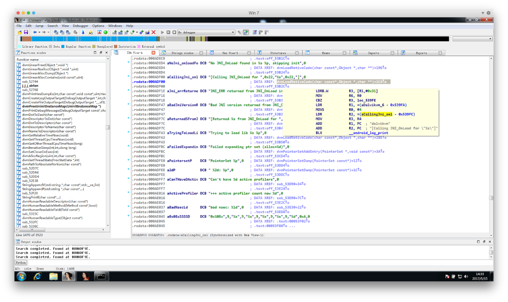
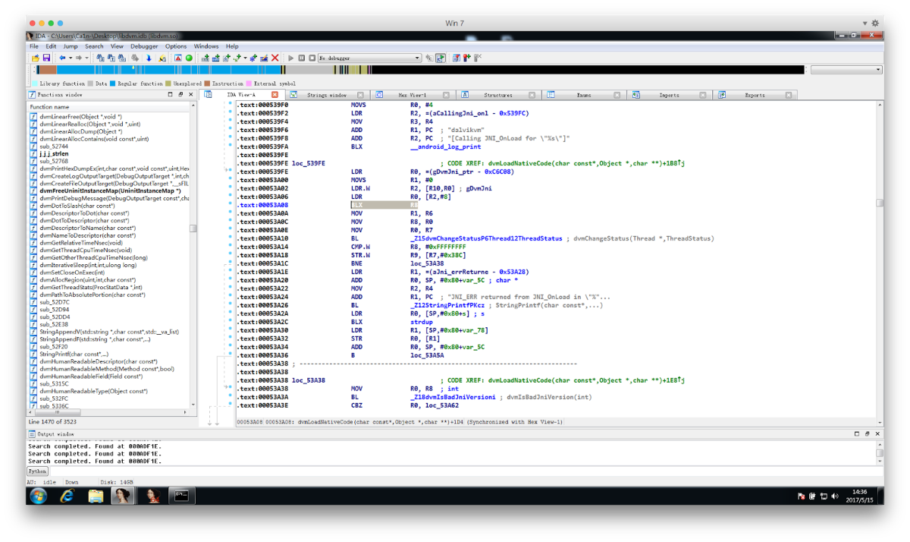

# 从 Android 源码看 SO 的加载 

url：https://bbs.pediy.com/thread-217656.htm


做安卓逆向的时候常常会碰到写在 Shared Object（即 [*.so] 文件，下文 SO）的加固逻辑，碰到 SO 的时候惯性分析方法是：静态找 JNI_Onload / .init / .init_array 这些在加载之初会被调用的代码段或者是指向被调用代码段的指针段。


然而现在的加固基本上都会用各种方式抹掉函数关系、SHT 等导致直接静态分析 SO 时既不能从函数表里找到 JNI_Onload 也不能从 SECTION 里找到 .init，部分逆向人员在这种情况下走了弯路。


## #1. Source Code

Android 作为开源的系统，既然可以拿到源码，那么就可以尝试分析加载 SO 时的流程，进而找到对应正确的下断位置来确定 JNI_Onload / .init 的偏移量。下文中所有源码均为 android-4.4.2_r1 版本，各个版本在细节上的实现可能存在差异。


以 **[java.lang.Runtime -> load()]** 为例子来说明（loadLiabrary() 最后和 load() 殊途同归，有兴趣的可以自行分析），对应的 Android 源码在 **[java/lang/Runtime.java]**，从 320 行开始。


```
/**
 * Loads and links the dynamic library that is identified through the
 * specified path. This method is similar to {@link #loadLibrary(String)},
 * but it accepts a full path specification whereas {@code loadLibrary} just
 * accepts the name of the library to load.
 *
 * @param pathName
 *            the absolute (platform dependent) path to the library to load.
 * @throws UnsatisfiedLinkError
 *             if the library can not be loaded.
 */
public void load(String pathName) {
    load(pathName, VMStack.getCallingClassLoader());
}
/*
 * Loads and links the given library without security checks.
 */
void load(String pathName, ClassLoader loader) {
    if (pathName == null) {
        throw new NullPointerException("pathName == null");
    }
    String error = doLoad(pathName, loader);
    if (error != null) {
        throw new UnsatisfiedLinkError(error);
    }
}

```

可以看到 **load(String pathName)** 实际上是调用了 **load(String pathName, ClassLoader loader)**，而后者又调用了 **doLoad(pathName, loader)**，这里的函数调用没有什么实际的意义（仅指对逆向者没有实质的意义，下同）一直在传值。


下面是 **doLoad(pathName, loader)** 的定义，源码还是在上面的 Runtime.java 里。


```
private String doLoad(String name, ClassLoader loader) {
    // Android apps are forked from the zygote, so they can't have a custom LD_LIBRARY_PATH,
    // which means that by default an app's shared library directory isn't on LD_LIBRARY_PATH.
    // The PathClassLoader set up by frameworks/base knows the appropriate path, so we can load
    // libraries with no dependencies just fine, but an app that has multiple libraries that
    // depend on each other needed to load them in most-dependent-first order.
    // We added API to Android's dynamic linker so we can update the library path used for
    // the currently-running process. We pull the desired path out of the ClassLoader here
    // and pass it to nativeLoad so that it can call the private dynamic linker API.
    // We didn't just change frameworks/base to update the LD_LIBRARY_PATH once at the
    // beginning because multiple apks can run in the same process and third party code can
    // use its own BaseDexClassLoader.
    // We didn't just add a dlopen_with_custom_LD_LIBRARY_PATH call because we wanted any
    // dlopen(3) calls made from a .so's JNI_OnLoad to work too.
    // So, find out what the native library search path is for the ClassLoader in question...
    String ldLibraryPath = null;
    if (loader != null && loader instanceof BaseDexClassLoader) {
        ldLibraryPath = ((BaseDexClassLoader) loader).getLdLibraryPath();
    }
    // nativeLoad should be synchronized so there's only one LD_LIBRARY_PATH in use regardless
    // of how many ClassLoaders are in the system, but dalvik doesn't support synchronized
    // internal natives.
    synchronized (this) {
        return nativeLoad(name, loader, ldLibraryPath);
    }
}
```

主要是检测 loader 的正确性，并带上 LD_LIBRARY_PATH 一起进入 **nativeLoad(name, loader, ldLibraryPath)**，这里开始进入 native 层，nativeLoad 的定义在 **vm/native/java_lang_Runtime.cpp # 64** 行，如下。

```
/*
 * static String nativeLoad(String filename, ClassLoader loader, String ldLibraryPath)
 *
 * Load the specified full path as a dynamic library filled with
 * JNI-compatible methods. Returns null on success, or a failure
 * message on failure.
 */
static void Dalvik_java_lang_Runtime_nativeLoad(const u4* args,
    JValue* pResult)
{
    StringObject* fileNameObj = (StringObject*) args[0];
    Object* classLoader = (Object*) args[1];
    StringObject* ldLibraryPathObj = (StringObject*) args[2];
    assert(fileNameObj != NULL);
    char* fileName = dvmCreateCstrFromString(fileNameObj);
    if (ldLibraryPathObj != NULL) {
        char* ldLibraryPath = dvmCreateCstrFromString(ldLibraryPathObj);
        void* sym = dlsym(RTLD_DEFAULT, "android_update_LD_LIBRARY_PATH");
        if (sym != NULL) {
            typedef void (*Fn)(const char*);
            Fn android_update_LD_LIBRARY_PATH = reinterpret_cast<Fn>(sym);
            (*android_update_LD_LIBRARY_PATH)(ldLibraryPath);
        } else {
            ALOGE("android_update_LD_LIBRARY_PATH not found; .so dependencies will not work!");
        }
        free(ldLibraryPath);
    }
    StringObject* result = NULL;
    char* reason = NULL;
    bool success = dvmLoadNativeCode(fileName, classLoader, &reason);
    if (!success) {
        const char* msg = (reason != NULL) ? reason : "unknown failure";
        result = dvmCreateStringFromCstr(msg);
        dvmReleaseTrackedAlloc((Object*) result, NULL);
    }
    free(reason);
    free(fileName);
    RETURN_PTR(result);
}
```

还是传值 + 检查，然后执行 **[bool success = dvmLoadNativeCode(fileName, classLoader, &reason);]** ，看下 dvmLoadNativeCode(...) 的代码，位于 **vm/Native.cpp # 301 行**。

```
/*
 * Load native code from the specified absolute pathname.  Per the spec,
 * if we've already loaded a library with the specified pathname, we
 * return without doing anything.
 *
 * TODO? for better results we should absolutify the pathname.  For fully
 * correct results we should stat to get the inode and compare that.  The
 * existing implementation is fine so long as everybody is using
 * System.loadLibrary.
 *
 * The library will be associated with the specified class loader.  The JNI
 * spec says we can't load the same library into more than one class loader.
 *
 * Returns "true" on success. On failure, sets *detail to a
 * human-readable description of the error or NULL if no detail is
 * available; ownership of the string is transferred to the caller.
 */
bool dvmLoadNativeCode(const char* pathName, Object* classLoader,
        char** detail)
{
    SharedLib* pEntry;
    void* handle;
    bool verbose;
    /* reduce noise by not chattering about system libraries */
    verbose = !!strncmp(pathName, "/system", sizeof("/system")-1);
    verbose = verbose && !!strncmp(pathName, "/vendor", sizeof("/vendor")-1);
    if (verbose)
        ALOGD("Trying to load lib %s %p", pathName, classLoader);
    *detail = NULL;
    /*
     * See if we've already loaded it.  If we have, and the class loader
     * matches, return successfully without doing anything.
     */
    pEntry = findSharedLibEntry(pathName);
    if (pEntry != NULL) {
        if (pEntry->classLoader != classLoader) {
            ALOGW("Shared lib '%s' already opened by CL %p; can't open in %p",
                pathName, pEntry->classLoader, classLoader);
            return false;
        }
        if (verbose) {
            ALOGD("Shared lib '%s' already loaded in same CL %p",
                pathName, classLoader);
        }
        if (!checkOnLoadResult(pEntry))
            return false;
        return true;
    }
    /*
     * Open the shared library.  Because we're using a full path, the system
     * doesn't have to search through LD_LIBRARY_PATH.  (It may do so to
     * resolve this library's dependencies though.)
     *
     * Failures here are expected when java.library.path has several entries
     * and we have to hunt for the lib.
     *
     * The current version of the dynamic linker prints detailed information
     * about dlopen() failures.  Some things to check if the message is
     * cryptic:
     *   - make sure the library exists on the device
     *   - verify that the right path is being opened (the debug log message
     *     above can help with that)
     *   - check to see if the library is valid (e.g. not zero bytes long)
     *   - check config/prelink-linux-arm.map to ensure that the library
     *     is listed and is not being overrun by the previous entry (if
     *     loading suddenly stops working on a prelinked library, this is
     *     a good one to check)
     *   - write a trivial app that calls sleep() then dlopen(), attach
     *     to it with "strace -p <pid>" while it sleeps, and watch for
     *     attempts to open nonexistent dependent shared libs
     *
     * This can execute slowly for a large library on a busy system, so we
     * want to switch from RUNNING to VMWAIT while it executes.  This allows
     * the GC to ignore us.
     */
    Thread* self = dvmThreadSelf();
    ThreadStatus oldStatus = dvmChangeStatus(self, THREAD_VMWAIT);
    handle = dlopen(pathName, RTLD_LAZY);
    dvmChangeStatus(self, oldStatus);
    if (handle == NULL) {
        *detail = strdup(dlerror());
        ALOGE("dlopen(\"%s\") failed: %s", pathName, *detail);
        return false;
    }
    /* create a new entry */
    SharedLib* pNewEntry;
    pNewEntry = (SharedLib*) calloc(1, sizeof(SharedLib));
    pNewEntry->pathName = strdup(pathName);
    pNewEntry->handle = handle;
    pNewEntry->classLoader = classLoader;
    dvmInitMutex(&pNewEntry->onLoadLock);
    pthread_cond_init(&pNewEntry->onLoadCond, NULL);
    pNewEntry->onLoadThreadId = self->threadId;
    /* try to add it to the list */
    SharedLib* pActualEntry = addSharedLibEntry(pNewEntry);
    if (pNewEntry != pActualEntry) {
        ALOGI("WOW: we lost a race to add a shared lib (%s CL=%p)",
            pathName, classLoader);
        freeSharedLibEntry(pNewEntry);
        return checkOnLoadResult(pActualEntry);
    } else {
        if (verbose)
            ALOGD("Added shared lib %s %p", pathName, classLoader);
        bool result = false;
        void* vonLoad;
        int version;
        vonLoad = dlsym(handle, "JNI_OnLoad");
        if (vonLoad == NULL) {
            ALOGD("No JNI_OnLoad found in %s %p, skipping init", pathName, classLoader);
            result = true;
        } else {
            /*
             * Call JNI_OnLoad.  We have to override the current class
             * loader, which will always be "null" since the stuff at the
             * top of the stack is around Runtime.loadLibrary().  (See
             * the comments in the JNI FindClass function.)
             */
            OnLoadFunc func = (OnLoadFunc)vonLoad;
            Object* prevOverride = self->classLoaderOverride;
            self->classLoaderOverride = classLoader;
            oldStatus = dvmChangeStatus(self, THREAD_NATIVE);
            if (gDvm.verboseJni) {
                ALOGI("[Calling JNI_OnLoad for \"%s\"]", pathName);
            }
            version = (*func)(gDvmJni.jniVm, NULL);
            dvmChangeStatus(self, oldStatus);
            self->classLoaderOverride = prevOverride;
            if (version == JNI_ERR) {
                *detail = strdup(StringPrintf("JNI_ERR returned from JNI_OnLoad in \"%s\"",
                                              pathName).c_str());
            } else if (dvmIsBadJniVersion(version)) {
                *detail = strdup(StringPrintf("Bad JNI version returned from JNI_OnLoad in \"%s\": %d",
                                              pathName, version).c_str());
                /*
                 * It's unwise to call dlclose() here, but we can mark it
                 * as bad and ensure that future load attempts will fail.
                 *
                 * We don't know how far JNI_OnLoad got, so there could
                 * be some partially-initialized stuff accessible through
                 * newly-registered native method calls.  We could try to
                 * unregister them, but that doesn't seem worthwhile.
                 */
            } else {
                result = true;
            }
            if (gDvm.verboseJni) {
                ALOGI("[Returned %s from JNI_OnLoad for \"%s\"]",
                      (result ? "successfully" : "failure"), pathName);
            }
        }
        if (result)
            pNewEntry->onLoadResult = kOnLoadOkay;
        else
            pNewEntry->onLoadResult = kOnLoadFailed;
        pNewEntry->onLoadThreadId = 0;
        /*
         * Broadcast a wakeup to anybody sleeping on the condition variable.
         */
        dvmLockMutex(&pNewEntry->onLoadLock);
        pthread_cond_broadcast(&pNewEntry->onLoadCond);
        dvmUnlockMutex(&pNewEntry->onLoadLock);
        return result;
    }
}
```

做了一些常规的检查，不赘述了，可以看到 **[version = (\*func)(gDvmJni.jniVm, NULL);]** 这里调用了 JNI_OnLoad，上一行是 **[ALOGI("[Calling JNI_OnLoad for \"%s\"]", pathName);]**，记录一下方便逆向时确定位置。


根据逆向经验 .init(_array) 段定义的内容是在 JNI_OnLoad 之前执行的，而 dlopen 是加载 SO 的函数可能会在这里执行 .init，看一下 dlopen 函数，它的定义在 **linker/dlfcn.cpp # 63 行**。


```
void* dlopen(const char* filename, int flags) {
  ScopedPthreadMutexLocker locker(&gDlMutex);
  soinfo* result = do_dlopen(filename, flags);
  if (result == NULL) {
    __bionic_format_dlerror("dlopen failed", linker_get_error_buffer());
    return NULL;
  }
  return result;
}
```

其实还是调用了 do_dlopen，do_dlopen 的定义在 **linker/linker.cpp # 823 行**，代码如下。

```
soinfo* do_dlopen(const char* name, int flags) {
  if ((flags & ~(RTLD_NOW|RTLD_LAZY|RTLD_LOCAL|RTLD_GLOBAL)) != 0) {
    DL_ERR("invalid flags to dlopen: %x", flags);
    return NULL;
  }
  set_soinfo_pool_protection(PROT_READ | PROT_WRITE);
  soinfo* si = find_library(name);
  if (si != NULL) {
    si->CallConstructors();
  }
  set_soinfo_pool_protection(PROT_READ);
  return si;
}
```


做了一些检查，*是否符合调用 dlopen 的格式、*是否属于已经加在过的 SO，如果属于之前没有加在过的 SO 就执行 **[si->CallConstructors();]**，看一下 CallConstructors() 的定义。

```
void soinfo::CallConstructors() {
  if (constructors_called) {
    return;
  }
  // We set constructors_called before actually calling the constructors, otherwise it doesn't
  // protect against recursive constructor calls. One simple example of constructor recursion
  // is the libc debug malloc, which is implemented in libc_malloc_debug_leak.so:
  // 1. The program depends on libc, so libc's constructor is called here.
  // 2. The libc constructor calls dlopen() to load libc_malloc_debug_leak.so.
  // 3. dlopen() calls the constructors on the newly created
  //    soinfo for libc_malloc_debug_leak.so.
  // 4. The debug .so depends on libc, so CallConstructors is
  //    called again with the libc soinfo. If it doesn't trigger the early-
  //    out above, the libc constructor will be called again (recursively!).
  constructors_called = true;
  if ((flags & FLAG_EXE) == 0 && preinit_array != NULL) {
    // The GNU dynamic linker silently ignores these, but we warn the developer.
    PRINT("\"%s\": ignoring %d-entry DT_PREINIT_ARRAY in shared library!",
          name, preinit_array_count);
  }
  if (dynamic != NULL) {
    for (Elf32_Dyn* d = dynamic; d->d_tag != DT_NULL; ++d) {
      if (d->d_tag == DT_NEEDED) {
        const char* library_name = strtab + d->d_un.d_val;
        TRACE("\"%s\": calling constructors in DT_NEEDED \"%s\"", name, library_name);
        find_loaded_library(library_name)->CallConstructors();
      }
    }
  }
  TRACE("\"%s\": calling constructors", name);
  // DT_INIT should be called before DT_INIT_ARRAY if both are present.
  CallFunction("DT_INIT", init_func);
  CallArray("DT_INIT_ARRAY", init_array, init_array_count, false);
}
```

重点是最后这的 **[CallFunction("DT_INIT", init_func);]** 和 **[CallArray("DT_INIT_ARRAY", init_array, init_array_count, false);]**，很明显是执行 **.init(_array)** 定义的内容，这里不贴 CallArray 的代码了，其实还是循环调用了 CallFunction，下面看看 CallFunction 的代码，**linker/linker.cpp # 1172 行**。

```
void soinfo::CallFunction(const char* function_name UNUSED, linker_function_t function) {
  if (function == NULL || reinterpret_cast<uintptr_t>(function) == static_cast<uintptr_t>(-1)) {
    return;
  }
  TRACE("[ Calling %s @ %p for '%s' ]", function_name, function, name);
  function();
  TRACE("[ Done calling %s @ %p for '%s' ]", function_name, function, name);
  // The function may have called dlopen(3) or dlclose(3), so we need to ensure our data structures
  // are still writable. This happens with our debug malloc (see http://b/7941716).
  set_soinfo_pool_protection(PROT_READ | PROT_WRITE);
}
```

看到这行代码 **[function();]**，所以可以确定 **.init(_array)** 定义的内容最终在这执行。同样记录一下 **[TRACE("[ Calling %s @ %p for '%s' ]", function_name, function, name);]** 方便逆向时确定位置。


## #2. Reverse Offset

找到具体调用的位置之后下面开始确定这两个位置在 ELF 中的便宜，以便动态调试时下断点，根据上面的分析：

\1. JNI_OnLoad 的调用在 vm/Native.cpp 里，对应 /system/lib/libdvm.so。

\2. .init(_array) 的调用在 linker/linker.cpp 里，对应 /system/bin/linker。


下面拿 JNI_OnLoad 做例子说明，adb pull 取出手机里的二进制文件 /system/lib/libdvm.so，拉入 IDA，[Shift + F12] 显示所有的字符串，直接找 **"[Calling JNI_OnLoad for \"%s\"]"** ，找到后如图所示。




跳到 DATA XREF 指向的位置 **[dvmLoadNativeCode(char const\*,Object \*,char \**)+1C4 ]**，汇编码如下，可以看到符合源代码中的调用情况，下图选中的 **[BLX R8]** 就是调用 JNI_OnLoad 的位置。

[](https://2.bp.blogspot.com/--cmuF99mXsw/WRlMhIzICdI/AAAAAAAAAQk/v3qryobZZNc50BWiB9l9P02Cjon3ryjKwCLcB/s1600/Screen%2BShot%2B2017-05-15%2Bat%2B14.36.41.png)

可以看到偏移为 [libdvm.so + 0x53A08]，所以当载入一个 SO 时只需要在这个偏移量对应的位置下断即可，.inti(_array) 的处理方法也相同，不重复说明了。


## #3. 结论

在本次分析的版本 4.4.2_r1 中，只需要在 **[/system/bin/linker + 0x274C]** 和

 **[/system/lib/libdvm.so + 0x53A08]** 这两个位置下断，即可成功找到 **.inti / .init_array / JNI_OnLoad** 并实现断点，不需要符号表，SEGMENT啥的，具体效果可以参考我前两篇文章。


## #4. Reference

\* [ Android安全–linker加载so流程，在.init下断点](http://www.blogfshare.com/linker-load-so.html)