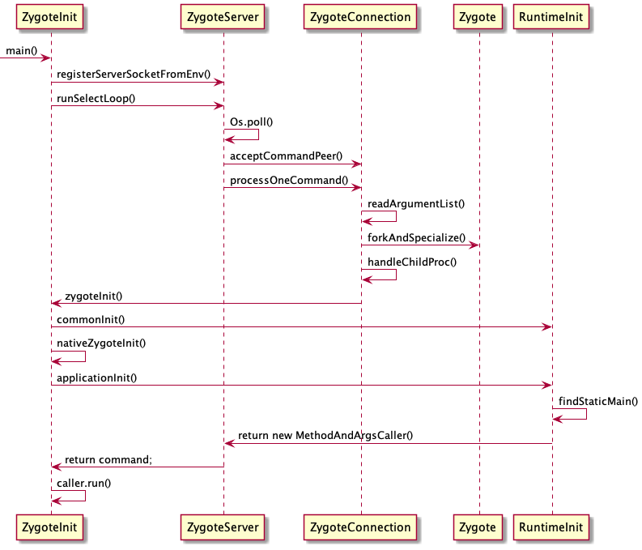
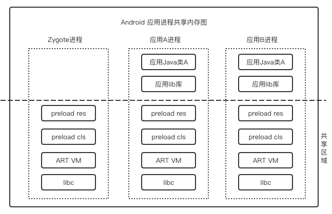

# 深入Android系统（七）Zygote进程

url：https://juejin.cn/post/6894828081908908040


`Zygote`是`Android`中非常重要的一个进程，它和`Init进程`、`SystemServer进程`在`Android`中有着不可替代的地位。

# `Zygote`简介

```
Linux`的进程是通过系统调用`fork`产生的，`fork`出的`子进程`除了`内核`中的一些核心的数据结构和`父进程`不相同外，其余的`内存映像`都是和`父进程`共享的。**只有当`子进程`需要去改写这些共享的内存时，`操作系统`才会为`子进程`分配一个新页面**。这就是所谓的`写时复制(Copy On Write)
```

通常`子进程`被`fork`出后，会继续执行系统调用`exec`。`exec`将用一个新的`可执行文件`的内容替换当前进程的`代码段`、`数据段`、`堆`和`栈`。

`fork`加`exec`是`Linux`启动应用的标准做法，`Init`进程也是这样来启动各种服务的。

> 不过`Zygote`创建`应用程序`时却只是用了`fork`，没有调用`exec`

首先，`Android应用`中跑的的是`虚拟机`，虚拟机中`Java`代码的不同才造成了`应用`的区别，而对于基础的`运行环境`，要求却是一样的。

其次，`Zygote`在初始化时就会会创建`虚拟机`，同时把需要的系统类库和资源文件加载的内存中。而`Zygote`在`fork`出子进程后，这个`子进程`也会得到一个已经加载好基础资源的`虚拟机`。

这样，接下来只需要装载`APK`相关的资源就可以运行了，可以做到提升效率

# `Zygote`进程的初始化

`Zygote`进程在`Init`进程中以`service`的方式启动的。我们来看下它在`init.rc`中的配置内容：

```
import /init.${ro.zygote}.rc
on late-init
    ......
    # Now we can start zygote for devices with file based encryption
    # 这里触发启动 zygote
    trigger zygote-start
on zygote-start && (*) //*用来省略一些属性值的判断
    start netd
    start zygote
    start zygote_secondary
复制代码
```

从`Android 5.0`开始，`Android`开始支持`64位`编译，`Zygote`本身也会有`32位`和`64位`的区别，因此，通过`ro.zygote`属性来控制启动不同版本的`Zygote`进程。在9.0的源码中，存在4个相关文件：

```
init.zygote32.rc
init.zygote32_64.rc
init.zygote64.rc
init.zygote64_32.rc
复制代码
```

挑个特殊的看下（`init.zygote32_64.rc`）：

```
service zygote /system/bin/app_process32 -Xzygote /system/bin --zygote --start-system-server --socket-name=zygote
    class main
    ......
service zygote_secondary /system/bin/app_process64 -Xzygote /system/bin --zygote --socket-name=zygote_secondary
    class main
    ......
复制代码
```

- 从文件内容中可以看到定义了两个`Zygote`服务：`zygote`和`zygote_secondary`
- 两个服务最大的区别是`可执行文件`不同：一个是`app_process32`、一个是`app_process64`
- `init.zygote64_32.rc`文件就不贴出来了，其实就是把两个`可执行文件`交换一下
- 对于`init.zygote32.rc`和`init.zygote64.rc`分别只有一个`Zygote`服务

从这里我们就可以知道，`Android`将会支持4中运行模式：

- 纯32位模式：`ro.zygote`的值为`zygote32`
- 32位模式为主，64位为辅：`ro.zygote`的值为`zygote32_64`
- 纯64位模式：`ro.zygote`的值为`zygote64`
- 64位模式为主，32位为辅：`ro.zygote`的值为`zygote64_32`

而对于可执行文件`app_process`，源文件路径在`frameworks/base/cmds/app_process`，不过在学习源码前，我们先来看下`app_process`用法

## `app_process`的用法

上面我们知道`Zygote`的启动是通过`app_process`来实现的

> `app_process`主要作用是解析启动参数，然后根据启动参数选择不同的启动模式

为了更好的理解`app_process`，我们先来看明白它是怎么使用的。不过关于`app_process`参数的使用说明，源码中却只有：

```
fprintf(stderr,
        "Usage: app_process [java-options] cmd-dir start-class-name [options]\n");
复制代码
```

有些太简洁了哈。。。。

我们还是来看几个示例吧，以`Zygote`为例：

```
 /system/bin/app_process32 -Xzygote /system/bin --zygote --start-system-server --socket-name=zygote
复制代码
```

再来一个有趣版本（下面这段指令的目的是：运行一个`Application`，包含`main`函数类的名称为`Test`）：

```
app_process -Djava.class.path=/data/local/tmp/Test.dex /data/lee Test
复制代码
```

结合源码中的`Usage(纯净版)...`和这两个例子，我们可以这么总结：

- `-Xzygote`和`-Djava.class.p**`：属于`[java-options]`，这些参数会传给`虚拟机`，并且参数必须以`-`开头，一旦遇到非`-`或者`--`，表示`[java-options]`结束
- `/system/bin`和`/data/lee`：属于`cmd-dir`，程序的运行目录，随便指定即可，文件操作时会以此为当前路径，正经的大多运行在`/system/bin`下
- `Test`：属于`start-class-name`，声明入口类的名称，有包名的话需要加上包名
- `--zygote`：属于`[options]`，这些参数都以符号`--`开头。参数`--zygote`表示要启动`Zygote`进程

## `app_process`的`main()`

有了上面`app_process`用法的铺垫，我们再来分析`main`函数就会更容易些，老样子，先看整体：

```c
int main(int argc, char* const argv[])
{
    // 1. 创建 AppRuntime 对象
    
    // 2. 保存 Java-Option 参数

    // 3. 解析 Option 参数：--开头的那种
    
    // 4. 根据参数的解析结果，准备ZygoteInit或者RuntimeInit相关的参数
    
    // 5. 将本进程名称改为nice-name指定的字符串
    
    // 6. 根据参数的解析结果，启动对应的Java类
}
复制代码
```

很清晰了然了哈，我们再看下具体的源码

### 创建`AppRuntime`对象

`main()`源码：

```java
AppRuntime runtime(argv[0], computeArgBlockSize(argc, argv));
复制代码
```

- `AppRuntime`是在`app_process`中定义的类，继承了系统的`AndroidRuntime`类。
- `AndroidRuntime`类是底层很重要很重要的一个类，主要作用是创建和初始化虚拟机，等下详细分析
- 整个`main()`的后续流程都是通过这个`runtime`来操作的

### 保存`Java-Option`参数

```java
    ......
    for (i = 0; i < argc; i++) {
        // 省略know_command相关
        ......
        if (argv[i][0] != '-') { 
            //如果不是-开头的话，解析结束
            //按照app_process的参数规则：java-option后面是cmd-dir，不是以-开头的
            //所以，正常情况解析到java-option就会停止
            break;
        }
        if (argv[i][1] == '-' && argv[i][2] == 0) {
            //如果是--开头并且后面是空字符时，结束解析
            //不知道加这个的目的是干啥
            ++i; // Skip --.
            break;
        }
        runtime.addOption(strdup(argv[i]));
        // 省略打印信息
        ......
    }
    ......
复制代码
```

### 解析`Option`参数

> ```
> Option`参数在源码中称为`runtime argument
> ```

```c
    //需要解析出来的参数都在这里了
    bool zygote = false;
    bool startSystemServer = false;
    bool application = false;
    String8 niceName;
    String8 className;
    
    // 按照参数的规则，上面java-option解析完后，紧接着是cmd-dir，也就是parent dir
    // 对于cmd dir不需要做额外处理，直接跳过
    ++i;  // Skip unused "parent dir" argument.
    while (i < argc) {
        const char* arg = argv[i++];
        if (strcmp(arg, "--zygote") == 0) {
            zygote = true;
            niceName = ZYGOTE_NICE_NAME;
        } else if (strcmp(arg, "--start-system-server") == 0) {
            startSystemServer = true;
        } else if (strcmp(arg, "--application") == 0) {
            application = true;
        } else if (strncmp(arg, "--nice-name=", 12) == 0) {
            niceName.setTo(arg + 12);
        } else if (strncmp(arg, "--", 2) != 0) {
            //如果不是--开头，就认为是class name
            className.setTo(arg);
            break;
        } else {
            --i;
            break;
        }
    }
复制代码
```

### 准备`ZygoteInit`或者`RuntimeInit`需要的参数

```c
    //定义一个字符参数集合
    Vector<String8> args;
    if (!className.isEmpty()) {
        // We're not in zygote mode, the only argument we need to pass
        // to RuntimeInit is the application argument.
        // 非Zygote模式，没有删掉官方注释，开心不
        // The Remainder of args get passed to startup class main(). Make
        // copies of them before we overwrite them with the process name.
        args.add(application ? String8("application") : String8("tool"));
        runtime.setClassNameAndArgs(className, argc - i, argv + i);
        // 省略打印部分
        ......
    } else {
        // We're in zygote mode.
        maybeCreateDalvikCache();
        if (startSystemServer) {
            args.add(String8("start-system-server"));
        }
        // 省略ABI属性值的获取
        ......
        String8 abiFlag("--abi-list=");
        abiFlag.append(prop);
        args.add(abiFlag);
        // In zygote mode, pass all remaining arguments to the zygote
        // main() method.
        // Zygote模式，app_process的参数会被统一打包进参数集合中
        for (; i < argc; ++i) {
            args.add(String8(argv[i]));
        }
    }
复制代码
```

### 将进程名称改为`nice-name`指定的字符串

```c
    if (!niceName.isEmpty()) {
        // 这是AndroidRuntime提供的函数，设置进程名称
        runtime.setArgv0(niceName.string(), true /* setProcName */);
    }
    
    // 在AndroidRuntime.cpp中
    void AndroidRuntime::setArgv0(const char* argv0, bool setProcName) {
        if (setProcName) {
            int len = strlen(argv0);
            if (len < 15) {
                pthread_setname_np(pthread_self(), argv0);
            } else {
                pthread_setname_np(pthread_self(), argv0 + len - 15);
            }
        }
        memset(mArgBlockStart, 0, mArgBlockLength);
        strlcpy(mArgBlockStart, argv0, mArgBlockLength);
    }
复制代码
```

### 启动对应的`Java`类

```c
    if (zygote) {
        // 如果是--zygote，则执行ZygoteInit类，启动Zygote进程
        runtime.start("com.android.internal.os.ZygoteInit", args, zygote);
    } else if (className) {
        // 如果是指定了class name，则通过RuntimeInit执行传进来的类
        runtime.start("com.android.internal.os.RuntimeInit", args, zygote);
    } else {
        fprintf(stderr, "Error: no class name or --zygote supplied.\n");
        app_usage();
        LOG_ALWAYS_FATAL("app_process: no class name or --zygote supplied.");
    }
复制代码
```

### `app_process`在`Android`中的应用

通过上面的源码分析我们知道：**`app_process`除了能启动Zygote进程，也可以使用它来执行某个系统的`Java`类**

`Android`中的常用工具`am`就是一个很好的例子：

> `am`是一个发送`Intent`的工具，像`am start`、`am broadcast`等。

但是，`am`实际上只是一个包含几行代码的脚本文件，它的功能都是通过调用`app_process`来完成的

```c
#!/system/bin/sh
if [ "$1" != "instrument" ] ; then
    cmd activity "$@"
else
    base=/system
    export CLASSPATH=$base/framework/am.jar
    exec app_process $base/bin com.android.commands.am.Am "$@"
fi
复制代码
```

有木有，有木有，`Android`还是蛮惊喜的，哈哈哈！

大家可以仔细阅读下`Am.java`这个类，很有特点，调用关系找起来是真滴费神，加油哟！

## 启动虚拟机-`AndroidRuntime`类

在分析`app_process`的`main()`时我们知道`AppRuntime`继承的`AndroidRuntime`类。

- `AndroidRuntime`类是一个很重要的类，它负责启动`虚拟机`以及`Java线程`
- `AndroidRuntime`类在一个进程中只有一个实例对象，保存在全局变量`gCurRuntime`中

### 构造函数

`AndroidRuntime`类构造函数如下：

```c
AndroidRuntime::AndroidRuntime(char* argBlockStart, const size_t argBlockLength) :
        mExitWithoutCleanup(false),
        mArgBlockStart(argBlockStart),
        mArgBlockLength(argBlockLength)
{
    // 初始化skia图形系统
    SkGraphics::Init();
    // Pre-allocate enough space to hold a fair number of options.
    mOptions.setCapacity(20);
    // 只能被初始化一次
    assert(gCurRuntime == NULL);        // one per process
    gCurRuntime = this;
}
复制代码
```

### 启动虚拟机

> 本章只是简单介绍下虚拟机的启动过程，具体的实现细节后面单独拉出一篇来学习

在`app_process`的`main()`函数中，最后调用了`runtime.start()`来执行`Java`类，这个`start()`函数就是在`AndroidRuntime`中定义的。代码比较长，我们还是先看整体流程：

```c
void AndroidRuntime::start(const char* className, const Vector<String8>& options, bool zygote)
{
    // 1. 打印启动log
    
    // 2. 获取系统目录 

    // 3. 启动虚拟机

    // 4. 调用onVmCreated函数
    
    // 5. 注册系统的JNI函数
    
    // 6. 准备Java类的main函数的相关参数
    
    // 7. 调用ZygoteInit类的main方法

}
复制代码
```

#### 打印启动`Log`

源码片段：

```c
ALOGD(">>>>>> START %s uid %d <<<<<<\n",
            className != NULL ? className : "(unknown)", getuid());
复制代码
```

我们再看下系统启动过程的`Log`片段：

```log
00:00:21.226808  3244  3244 D AndroidRuntime: >>>>>> START com.android.internal.os.ZygoteInit uid 0 <<<<<<
复制代码
```

- 这段`Log`标志着`Android`系统的启动
- 因为以后的应用进程都是从`Zygote`进程`fork`出来的，所以后面不会再执行`start()`函数了
- 如果`Android`的系统`log`中反复出现这段内容，而输出`ID`都是`Zygote`，则说明系统可能出现问题，`Zygote`进程在不断地重启

#### 获取系统目录

源码片段

```c
    const char* rootDir = getenv("ANDROID_ROOT");
    if (rootDir == NULL) {
        rootDir = "/system";
        if (!hasDir("/system")) {
            LOG_FATAL("No root directory specified, and /android does not exist.");
            return;
        }
        setenv("ANDROID_ROOT", rootDir, 1);
    }
复制代码
```

- 系统目录从环境变量`ANDROID_ROOT`读取

- 如果没有设置，则默认设置为

  ```
  /system
  ```

  - 系统目录是在`Init`进程中创建出来

- 如果`/system`目录不存在，直接退出

#### 启动虚拟机

源码片段

```c
    JniInvocation jni_invocation;
    jni_invocation.Init(NULL);
    JNIEnv* env;
    if (startVm(&mJavaVM, &env, zygote) != 0) {
        return;
    }
复制代码
```

通过`startVm`启动虚拟机，我们先往下看，后面会详细介绍。

#### 调用`onVmCreated`函数

```c
    onVmCreated(env);
复制代码
```

`onVmCreated`函数是一个虚函数，对于`app_process`来说实际上调用的是`AppRuntime`的重载函数，下面是`AppRuntime`中的代码逻辑：

```c
    virtual void onVmCreated(JNIEnv* env)
    {
        if (mClassName.isEmpty()) {
            return; // Zygote. Nothing to do here.
        }
        //  省略一部分和类加载有关的很有意思的注释
        ......
        
        char* slashClassName = toSlashClassName(mClassName.string());
        mClass = env->FindClass(slashClassName);
        if (mClass == NULL) {
            ALOGE("ERROR: could not find class '%s'\n", mClassName.string());
        }
        free(slashClassName);
        mClass = reinterpret_cast<jclass>(env->NewGlobalRef(mClass));
    }
复制代码
```

在`AppRuntime`的`onVmCreated`函数中：

- 如果是`Zygote`进程，变量`mClassName`的值会为`null`，会立刻返回

- 如果是一个普通`Java类`的调用，`mClassName`中会存放类的名称

- ```
  toSlashClassName(mClassName.string())
  ```

  的作用是将

  ```
  类名
  ```

  转换为类的

  ```
  全限定名
  ```

  - `类名`像`com.android.Zygote`转化为`全限定名`就变为`/com/android/Zygote`

#### 注册系统的JNI函数

源码片段

```c
    /*
     * Register android functions.
     */
    if (startReg(env) < 0) {
        ALOGE("Unable to register all android natives\n");
        return;
    }
复制代码
```

`startReg`通过调用`register_jni_procs`函数将全局数组`gRegJNI`中的`JNI`本地函数注册到虚拟机中:

```c
/*
 * Register android native functions with the VM.
 */
/*static*/ int AndroidRuntime::startReg(JNIEnv* env)
{
    ......
    // 这个函数会修改当前进程的全局变量gCreateThreadFn函数指针为 javaCreateThreadEtc()
    // 此之后那么新建的子线程便会
    // 先执行javaCreateThreadEtc（） -> javaThreadShell（） -> javaAttachThread() -> jvm->AttachCurrentThread() 
    // 此时从普通C层线程成为JVM线程
    androidSetCreateThreadFunc((android_create_thread_fn) javaCreateThreadEtc);
    ......
    if (register_jni_procs(gRegJNI, NELEM(gRegJNI), env) < 0) {
        env->PopLocalFrame(NULL);
        return -1;
    }
    ......
}
复制代码
```

而对于`gRegJNI`数组，格式为

```c
static const RegJNIRec gRegJNI[] = {
    ......
    REG_JNI(register_android_util_Log),
    ......
    REG_JNI(register_android_os_Binder),
    ......
    REG_JNI(register_android_graphics_Paint),
    ......
    REG_JNI(register_android_app_Activity),
    ......
};
复制代码
```

省略了很多元素，该数组中每一个成员都代表一类文件的`JNI`映射，其中`REG_JNI`是一个`宏定义`，该宏的作用就是调用相应的`JNI注册方法`

#### 准备Java类的main函数的相关参数

源码片段

```c
    jclass stringClass;
    jobjectArray strArray;
    jstring classNameStr;

    stringClass = env->FindClass("java/lang/String");
    assert(stringClass != NULL);
    strArray = env->NewObjectArray(options.size() + 1, stringClass, NULL);
    assert(strArray != NULL);
    classNameStr = env->NewStringUTF(className);
    assert(classNameStr != NULL);
    env->SetObjectArrayElement(strArray, 0, classNameStr);

    for (size_t i = 0; i < options.size(); ++i) {
        jstring optionsStr = env->NewStringUTF(options.itemAt(i).string());
        assert(optionsStr != NULL);
        env->SetObjectArrayElement(strArray, i + 1, optionsStr);
    }
复制代码
```

上面是非常经典的在`Native层`创建`Java层`对象的操作：

- 创建一个`java.lang.String`的数组对象
- 并根据传入的参数对数组对象逐个元素进行赋值

#### 调用ZygoteInit类的main方法

源码片段

```c
    // 转化为全限定名
    char* slashClassName = toSlashClassName(className != NULL ? className : "");
    // 获取类的class对象
    jclass startClass = env->FindClass(slashClassName);
    if (startClass == NULL) {
        ALOGE("JavaVM unable to locate class '%s'\n", slashClassName);
        /* keep going */
    } else {
        jmethodID startMeth = env->GetStaticMethodID(startClass, "main",
            "([Ljava/lang/String;)V");
        if (startMeth == NULL) {
            ALOGE("JavaVM unable to find main() in '%s'\n", className);
            /* keep going */
        } else {
            // 执行main函数
            env->CallStaticVoidMethod(startClass, startMeth, strArray);
    }
    // 此处main函数执行完毕，执行一些结束操作
    free(slashClassName);
    ALOGD("Shutting down VM\n");
    if (mJavaVM->DetachCurrentThread() != JNI_OK)
        ALOGW("Warning: unable to detach main thread\n");
    if (mJavaVM->DestroyJavaVM() != 0)
        ALOGW("Warning: VM did not shut down cleanly\n");
复制代码
```

调用`main`方法前：

- 先通过`GetStaticMethodID`获得`main`方法的`ID`
- 然后使用`CallStaticVoidMethod`来调用`Java`层的函数

到这里，`Zygote`进程的初始化过程将转到`Java层`了，还记得`app_process`的`main()`函数中的启动逻辑么？

回顾一下哈：

```c
    if (zygote) {
        // 如果是--zygote，则执行ZygoteInit类，启动Zygote进程
        runtime.start("com.android.internal.os.ZygoteInit", args, zygote);
    } else if (className) {
        // 如果是指定了class name，则通过RuntimeInit执行传进来的类
        runtime.start("com.android.internal.os.RuntimeInit", args, zygote);
    }
复制代码
```

接下来，我们就来看看`ZygoteInit.java`类吧

### 初始化工作-`ZygoteInit`类

`ZygoteInit`类负责`Zygote`进程`Java`层的初始化工作。 入口方法`main()`的具体代码如下（注释比较详细）：

```java
    public static void main(String argv[]) {
        // 创建Zygote服务管理类，用来注册socket监听
        ZygoteServer zygoteServer = new ZygoteServer();
        // Mark zygote start. This ensures that thread creation will throw
        // an error.
        // 调用此方法后，虚拟机会拒绝线程的创建，如果此时创建会产生错误
        ZygoteHooks.startZygoteNoThreadCreation();
        // Zygote goes into its own process group.
        Os.setpgid(0, 0);
        //......
        final Runnable caller;
        try {
            ......省略打印相关
            // 启动DDMS虚拟机监控调试服务
            RuntimeInit.enableDdms();
            
            // 参数解析
            boolean startSystemServer = false;
            String socketName = "zygote";
            String abiList = null;
            boolean enableLazyPreload = false;
            for (int i = 1; i < argv.length; i++) {
                if ("start-system-server".equals(argv[i])) {
                    // 开启系统服务
                    startSystemServer = true;
                } else if ("--enable-lazy-preload".equals(argv[i])) {
                    // 启动延迟加载
                    enableLazyPreload = true;
                } else if (argv[i].startsWith(ABI_LIST_ARG)) {
                    // abi类型，一个CPU对应一个abi
                    abiList = argv[i].substring(ABI_LIST_ARG.length());
                } else if (argv[i].startsWith(SOCKET_NAME_ARG)) {
                    // 解析socket name
                    socketName = argv[i].substring(SOCKET_NAME_ARG.length());
                } else {
                    // 未知参数会抛出异常
                    throw new RuntimeException("Unknown command line argument: " + argv[i]);
                }
            }
            // 没有指定ABI参数会抛出异常
            if (abiList == null) {
                throw new RuntimeException("No ABI list supplied.");
            }
            // 注册Zygote的socket监听端口，用来接收启动应用程序的消息
            zygoteServer.registerServerSocketFromEnv(socketName);
            // In some configurations, we avoid preloading resources and classes eagerly.
            // In such cases, we will preload things prior to our first fork.
            if (!enableLazyPreload) {
                // 没有启用延迟加载的情况
                .....省略一些log打印
                // 执行预加载操作，包括系统预加载类、Framework资源和openGL资源
                preload(bootTimingsTraceLog);
                .....省略一些log打印
            } else {
                // 延迟加载的情况，reset 线程的优先级
                Zygote.resetNicePriority();
            }
            // Do an initial gc to clean up after startup
            ......省略log打印
            // 官方注释：运行几个指定的GC，尝试清除几代的软引用和可达的对象，还有别的垃圾
            // 此方法只在fork()前是好使的
            gcAndFinalize();
            ......省略log打印
            // 一些与安全相关的初始化操作
            Zygote.nativeSecurityInit();
            // Zygote process unmounts root storage spaces.
            // 目的是将整体的存储目录/storage卸载，取而代之的是挂载临时目录
            // 这个动作和Android 的沙箱(隔离存储)有关
            Zygote.nativeUnmountStorageOnInit();
            // 呼应前面的startZygoteNoThreadCreation()方法
            // 通知虚拟机，现在可以在zygote进程中创建线程了
            ZygoteHooks.stopZygoteNoThreadCreation();
            if (startSystemServer) {
                // fork SystemServer
                Runnable r = forkSystemServer(abiList, socketName, zygoteServer);
                // {@code r == null} in the parent (zygote) process, and {@code r != null} in the
                // child (system_server) process.
                // 如果 r 为空，说明是 zygote 进程，不做任何处理，继续执行
                if (r != null) {
                    // r 不为空，说明是孵化的子进程 systemserver，启动后直接返回
                    r.run();
                    return;
                }
            }
            Log.i(TAG, "Accepting command socket connections");
            // The select loop returns early in the child process after a fork and
            // loops forever in the zygote.
            // 这部分是在zygote进程中执行
            // 此处进入一个无限循环中，处理zygote socket接收到数据
            caller = zygoteServer.runSelectLoop(abiList);
        } catch (Throwable ex) {
            Log.e(TAG, "System zygote died with exception", ex);
            throw ex;
        } finally {
            // 请留意这部分，主要是给子进程用的
            // 子进程中是不需要在有zygote服务的
            // 所以这里的关闭理论上是为了在子进程中关闭无用的zygote服务
            zygoteServer.closeServerSocket();
        }
        // We're in the child process and have exited the select loop. Proceed to execute the
        // command.
        // 除systemserver外的进程，都是在这里真正的开始main函数的
        // 有没有感到疑惑，runSelectLoop是一个无线循环，要怎么才能周到这里呢？
        // 走到这里为什么一定是子进程呢？
        if (caller != null) {
            caller.run();
        }
    }
复制代码
```

看完这个`main`函数大家一定有很多疑问，由于有了子进程，代码的处理逻辑变得有些复杂

现将本人学习过程中的疑惑点和理解与大家分享下

#### 知识点：`fork`的结果

关于`fork`，我们需要记住：

- `fork`会产生和当前进程完全一样的新进程

- 在

  ```
  fork
  ```

  函数调用后

  - 新的进程将启动
  - 并和当前进程一起从`fork`函数返回

- 关于

  ```
  fork
  ```

  的返回值

  - 新的进程返回`0`
  - 当前进程返回新进程的`pid`

#### 疑问2：`systemserver`的启动

```java
            if (startSystemServer) {
                // fork SystemServer
                Runnable r = forkSystemServer(abiList, socketName, zygoteServer);
                // {@code r == null} in the parent (zygote) process, and {@code r != null} in the
                // child (system_server) process.
                // 如果 r 为空，说明是 zygote 进程，不做任何处理，继续执行
                if (r != null) {
                    // r 不为空，说明是孵化的子进程 systemserver，启动后直接返回
                    r.run();
                    return;
                }
            }
复制代码
```

这段代码通过`forkSystemServer`来完成`systemserver`的`fork`，而`forkSystemServer`逻辑是：

- 执行`pid = Zygote.forkSystemServer`

  - 请注意，执行完后会产生两个进程：`zygote`和`systemserver`
  - 并且，两个进程同时开始执行，但是进程收到的`pid`是不一样的
  - 可参照前面的`知识点`

- `pid`判断:

  ```java
      // 对于systemserver进程，pid是0
      if (pid == 0) {
          if (hasSecondZygote(abiList)) {
              waitForSecondaryZygote(socketName);
          }
          zygoteServer.closeServerSocket();
          // handleSystemServerProcess这个函数会：
          // 通过反射找到SystemServer的main函数
          // 并包装到Runnable的run函数中
          return handleSystemServerProcess(parsedArgs);
      }
      // pid不等于0，父进程，也就是zygote，返回null
      return null;
  复制代码
  ```

到这里，大家应该明白了下面这段代码的处理意义了吧：

```java
        if (r != null) {
            r.run();
            return;
        }
复制代码
```

#### 疑问3：`main`函数最后的`caller.run()`怎么执行到的

> 应用程序的启动应该就是通过这个`caller.run()`，弄明白它问题就不大了

```java
    public static void main(String argv[]) {
        ......
        try{
        ......
            caller = zygoteServer.runSelectLoop(abiList);
        }finally {
            zygoteServer.closeServerSocket();
        }
        ......
        if (caller != null) {
            caller.run();
        }
    }
复制代码
```

官方注释已经说了`caller.run();`才是子进程真正运行的地方，但是`zygoteServer.runSelectLoop`不是一个无线循环么，咋处理的呢？

我们来看下`runSelectLoop`函数：

```java
    Runnable runSelectLoop(String abiList) {
        ......
        while (true) {
            ......
            try {
            ZygoteConnection connection = peers.get(i);
            final Runnable command = connection.processOneCommand(this);
            if (mIsForkChild) {
                // We're in the child. We should always have a command to run at this
                // stage if processOneCommand hasn't called "exec".
                if (command == null) {
                    throw new IllegalStateException("command == null");
                }
                return command;
            } else {
                // We're in the server - we should never have any commands to run.
            ......
            }
        }
        ......
    }
复制代码
```

两个重要的点：

- 一个

  ```
  mIsForkChild
  ```

  属性

  - 当`mIsForkChild`属性为`true`时，会退出循环
  - 并返回一个`Runnable`对象

- 一个`processOneCommand`函数

对于`processOneCommand`函数，它也有一个很重要的操作：

```java
Runnable processOneCommand(ZygoteServer zygoteServer) {
        ......
        // fork 子进程
        pid = Zygote.forkAndSpecialize(......;
        if (pid == 0) {
            // in child
            // 设置mIsForkChild为true
            zygoteServer.setForkChild();
            zygoteServer.closeServerSocket();
            ......
            // handleChildProc这个函数会：
            // 通过反射找到启动类的main函数
            // 并包装到Runnable的run函数中
            return handleChildProc(......);
        } else {
            ......
            return null;
        }
}
复制代码
```

在`zygote`的无限循环里，当监听到数据后：

- 通过

  ```
  processOneCommand
  ```

  函数

  ```
  fork
  ```

  出了

  ```
  子进程
  ```

  ，此时：

  - 存在两个进程正在运行：`zygote`和`子进程`

- 仍然还是根据

  ```
  pid
  ```

  来判断哪个是

  ```
  子进程
  ```

  - 对于`子进程`，设置`mIsForkChild`属性为`true`
  - 并且`子进程`将打包好的`Runnable`对象返回
  - 对于`zygote`，返回`null`

这样，`子进程`中的`runSelectLoop()`便会停止循环，执行到`caller.run()`

> 书中`Android 5.0`的源码是通过抛出异常的方式来执行`caller.run()`，也很有趣，哈哈哈

有了这些铺垫，相信下面`zygote 启动应用程序`这部分应该就不难了吧，哈哈哈

# `Zygote`启动应用程序

我们已经知道，`Zygote`进程初始化完毕后，会通过`runSelectLoop()`化身为`守护进程`来执行启动应用程序的任务，先看下整个过程的时序图，再逐一详解吧



## 注册Zygote的socket

`ZygoteInit`类的`main()`函数

- 首先调用了`ZygoteServer`的`registerServerSocketFromEnv`来创建一个本地的`socket`
- 接着调用`runSelectLoop`来进入等来`socket`连接的循环中

`registerServerSocketFromEnv()`函数如下：

```java
    void registerServerSocketFromEnv(String socketName) {
        if (mServerSocket == null) {
            int fileDesc;
            // 拼接后的fullSocketName为ANDROID_SOCKET_zygote
            final String fullSocketName = ANDROID_SOCKET_PREFIX + socketName;
            try {
                String env = System.getenv(fullSocketName);
                fileDesc = Integer.parseInt(env);
            } catch (RuntimeException ex) {
                throw new RuntimeException(fullSocketName + " unset or invalid", ex);
            }
            try {
                FileDescriptor fd = new FileDescriptor();
                fd.setInt$(fileDesc);
                mServerSocket = new LocalServerSocket(fd);
                mCloseSocketFd = true;
            } catch (IOException ex) {
                throw new RuntimeException(
                        "Error binding to local socket '" + fileDesc + "'", ex);
            }
        }
    }
复制代码
```

函数通过环境变量`ANDROID_SOCKET_zygote`来获取`socket`的`fileDesc`。

- 这个

  ```
  fileDesc(文件描述符)
  ```

  怎么来的呢？我们再来回顾下

  ```
  init.rc
  ```

  中的内容：

  ```
  service zygote /system/bin/app_process32 -Xzygote /system/bin --zygote --start-system-server --socket-name=zygote
  ......
  socket zygote stream 660 root system
  ......
  复制代码
  ```

- ```
  Zygote
  ```

  服务启动时指定了一个

  ```
  option
  ```

  用来进行

  ```
  socket
  ```

  的创建

  - `Init`进程会根据这条选项来创建一个用于本地通信的`socket`
  - 并把这个`socket`的`fileDesc`放到环境变量`ANDROID_SOCKET_zygote`中
  - 环境变量字符串后面部分的`zygote`就是`option`中的名称

- 得到`fileDesc`后，通过`LocalServerSocket()`创建一个本地的`socket`服务，并保存到全局变量`mServerSocket`中

## 请求启动应用

`Android`启动一个新的进程是在`ActivityManagerService`中完成的，可能会有很多原因导致系统启动一个新的进程，最终在`ActivityManagerService`中都是通过调用方法`startProcess()`来实现：

```java
final String entryPoint = "android.app.ActivityThread";
private ProcessStartResult startProcess(String hostingType, String entryPoint,
            ProcessRecord app, int uid, int[] gids, int runtimeFlags, int mountExternal,
            String seInfo, String requiredAbi, String instructionSet, String invokeWith,
            long startTime) {
        ......
        final ProcessStartResult startResult;
        if (hostingType.equals("webview_service")) {
            ......
        } else {
            startResult = Process.start(entryPoint,
                    app.processName, uid, uid, gids, runtimeFlags, mountExternal,
                    app.info.targetSdkVersion, seInfo, requiredAbi, instructionSet,
                    app.info.dataDir, invokeWith,
                    new String[] {PROC_START_SEQ_IDENT + app.startSeq});
        }
        ......
}
复制代码
```

可以看到，关键的函数为`Process.start()`。而`Process.start()`的第一个参数`entryPoint`就是启动后执行的`Java`类：`android.app.ActivityThread`

> 我们这里主要是想看下启动应用时发送给Zygote的参数有哪些？而关于应用的启动流程，后面再进行展开哈

我们跟踪下`Process.start()`:

```java
// class:Process
public static final ProcessStartResult start(final String processClass ......) {
        return zygoteProcess.start(processClass......);
}
// class:ZygoteProcess
public final Process.ProcessStartResult start(final String processClass ......) {
        return startViaZygote(processClass ......);
}
private Process.ProcessStartResult startViaZygote(final String processClass ......){
        ArrayList<String> argsForZygote = new ArrayList<String>();

        // --runtime-args, --setuid=, --setgid=,
        // and --setgroups= must go first
        argsForZygote.add("--runtime-args");
        ......
        argsForZygote.add(processClass);
        return zygoteSendArgsAndGetResult(openZygoteSocketIfNeeded(abi), argsForZygote);
}
复制代码
```

参数有点多，代码部分意思一下哈，嘿嘿

- `start()`方法调用`startViaZygote()`方法来启动应用

- `startViaZygote()`首先将应用进程的启动参数保存到`argsForZygote`集合中

- 然后调用`zygoteSendArgsAndGetResult`方法将应用程序进程的启动参数发送的`Zygote`进程

- ```
  zygoteSendArgsAndGetResult()
  ```

  方法中会调用

  ```
  openZygoteSocketIfNeeded()
  ```

  方法用来创建用于通信的

  ```
  socket
  ```

  ，整理后的代码是这样的:

  ```java
  public static final String ZYGOTE_SOCKET = "zygote";
  public static final LocalSocketAddress address = new LocalSocketAddress(ZYGOTE_SOCKET, LocalSocketAddress.Namespace.RESERVED);
  final LocalSocket zygoteSocket = new LocalSocket();
  zygoteSocket.connect(address);
  复制代码
  ```

  - 对于`Local Socket`使用字符串作为地址就可以通信，灰常方便啊

- ```
  socket
  ```

  连接建立完后，

  ```
  zygoteSendArgsAndGetResult
  ```

  利用这个

  ```
  socket
  ```

  进行启动参数的写入：

  ```java
  writer.write(Integer.toString(args.size()));
  writer.newLine();
  for (int i = 0; i < sz; i++) {
      String arg = args.get(i);
      writer.write(arg);
      writer.newLine();
  }
  writer.flush();
  复制代码
  ```

到这里，请求应用启动的参数就发送给`Zygote`进程了，我们接下来看下`Zygote`的处理过程

## 处理启动应用的请求

`Zygote`进程通过`runSelectLoop()`来监听和处理启动应用的请求，我们看下`runSelectLoop()`，注释比较详细哈：

```java
    Runnable runSelectLoop(String abiList) {
        ArrayList<FileDescriptor> fds = new ArrayList<FileDescriptor>();
        ArrayList<ZygoteConnection> peers = new ArrayList<ZygoteConnection>();
        // 将socket zygote的文件描述符添加到fds集合中
        // 此处需要留意，mServerSocket是集合中第一个元素
        fds.add(mServerSocket.getFileDescriptor());
        peers.add(null);
        while (true) {
            // 动态生成pollFds数组，作为poll的监听参数
            StructPollfd[] pollFds = new StructPollfd[fds.size()];
            for (int i = 0; i < pollFds.length; ++i) {
                pollFds[i] = new StructPollfd();
                pollFds[i].fd = fds.get(i);
                pollFds[i].events = (short) POLLIN;
            }
            try {
                // 通过poll对pollFds数组中的文件进行事件监听
                // -1 表示阻塞直到有数据进来
                Os.poll(pollFds, -1);
            } catch (ErrnoException ex) {
                throw new RuntimeException("poll failed", ex);
            }
            // 当有数据到来时，才会执行到这里
            for (int i = pollFds.length - 1; i >= 0; --i) {
                // 循环遍历，查找接收到数据的文件
                if ((pollFds[i].revents & POLLIN) == 0) {
                    continue;
                }
                if (i == 0) {
                    // i=0 说明是 mServerSocket
                    // 意味着客户端发起了连接请求
                    // 按照LocalServerSocket的流程，需要创建一个LocalSocket来用于客户端的通信
                    // acceptCommandPeer()就是按照这个流程来创建ZygoteConnection对象
                    // 其实真正的通信对象还是LocalSocket
                    // 然后将通信对象的FD添加到fds集合中
                    // 大家没必要纠结这部分的处理方式，当做是LocalSocket的标准用法就可以啦
                    ZygoteConnection newPeer = acceptCommandPeer(abiList);
                    peers.add(newPeer);
                    fds.add(newPeer.getFileDesciptor());
                } else {
                    try {
                        // 这里才是真正的处理部分
                        ZygoteConnection connection = peers.get(i);
                        // 执行对应connection的processOneCommand函数
                        // 函数中会读取解析参数并进行子进程fork的相关操作
                        final Runnable command = connection.processOneCommand(this);

                        if (mIsForkChild) {
                            ......
                            // 子进程，退出selectLoop循环
                            return command;
                        } else {
                            ......
                            // zygote进程，关闭移除connection
                            if (connection.isClosedByPeer()) {
                                connection.closeSocket();
                                peers.remove(i);
                                fds.remove(i);
                            }
                        }
                    } catch (Exception e) {
                        if (!mIsForkChild) {
                            // 异常后的清除操作
                            ......
                            ZygoteConnection conn = peers.remove(i);
                            conn.closeSocket();
                            fds.remove(i);
                        } else {
                            ......
                        }
                    } finally {
                        ......
                        mIsForkChild = false;
                    }
                }
            }
        }
    }
复制代码
```

从上面的代码中我们知道，对于消息真正的处理是在`ZygoteConnection.processOneCommand`函数中，我们来重点看下：

### `processOneCommand`函数

函数分为了三部分：

- 解析启动参数
- 子进程`fork`
- 子进程初始化

我们来逐一看下

#### 解析启动参数

参数解析的流程是

- 先通过

  ```
  readArgumentList
  ```

  方法从

  ```
  socket
  ```

  连接中读取多个参数行

  - 参数行的样式是`--setuid=1`
  - 行与行之间以`\r`、`\n`或者`\r\n`分割

- 读完后再调用

  ```
  Arguments
  ```

  类的

  ```
  parseArgs
  ```

  方法将数据解析为参数列表

  - 具体的参数意义，大家可以参考`Arguments`类的注释

解析完参数后，`processOneCommand`还会对解析出的参数进行检查和设置：

```java
        ...... 省略一些参数属性判断
        // 检查客户端手有权限指定进程的用户ID、组ID
        // 如果是 root 进程，可以任意指定
        // 如果是 sys 进程，需要在ro.factorytest值 > 0时可以指定
        applyUidSecurityPolicy(parsedArgs, peer);
        // 判断是否具有invoke-with的执行权限
        applyInvokeWithSecurityPolicy(parsedArgs, peer);
        // 如果ro.debuggable是1的话，启动JDWP协议
        applyDebuggerSystemProperty(parsedArgs);
        // 处理invoke-with属性
        applyInvokeWithSystemProperty(parsedArgs);
复制代码
```

细节就不展开了哈

#### `fork`子进程

参数检查无误后，`processOneCommand`函数会调用`forkAndSpecialize`方法来`fork`子进程：

```java
    pid = Zygote.forkAndSpecialize(parsedArgs.uid, parsedArgs.gid, parsedArgs.gids,
            parsedArgs.runtimeFlags, rlimits, parsedArgs.mountExternal, parsedArgs.seInfo,
            parsedArgs.niceName, fdsToClose, fdsToIgnore, parsedArgs.startChildZygote,
            parsedArgs.instructionSet, parsedArgs.appDataDir);
复制代码
```

`forkAndSpecialize`最终是通过`native`层的`ForkAndSpecializeCommon`来完成`fork`的，我们这里只是简单介绍下函数的主要工作哈：

- 通过`fork`创建子进程
- 在子进程中挂载`emulate storage`
- 在子进程中设置用户ID、组ID、和进程所属的组
- 在子进程中通过`setrlimit`系统调用设置进程的系统资源限制
- 在子进程中通过`capset`系统调用设置进程的权限
- 在子进程中通过`selinux_android_setcontext`设置应用进程的安全上下文

从`native层`返回`Java层`后

- 如果`pid==0`，表示处于子进程中，执行`handleChildProc`函数
- 如果`pid!=0`，表示在Zygote进程中，执行`handleParentProc`函数，并返回`null`

这部分代码在前面的`疑问`中其实已经展示过了哈：

```java
    if (pid == 0) {
        // in child
        zygoteServer.setForkChild();
        zygoteServer.closeServerSocket();
        IoUtils.closeQuietly(serverPipeFd);
        serverPipeFd = null;
        return handleChildProc(parsedArgs, descriptors, childPipeFd,parsedArgs.startChildZygote);
    } else {
        // In the parent. A pid < 0 indicates a failure and will be handled in
        // handleParentProc.
        IoUtils.closeQuietly(childPipeFd);
        childPipeFd = null;
        handleParentProc(pid, descriptors, serverPipeFd);
        return null;
    }
复制代码
```

#### 子进程的初始化

`Zygote`进程`fork`出子进程后，调用`handleChildProc`方法来完成子进程的初始化工作。

- ```
  handleChildProc
  ```

  方法首先关闭了监听用的

  ```
  socket
  ```

  和从

  ```
  Zygote
  ```

  中继承的文件描述符

  ```java
      closeSocket();
      ......
      for (FileDescriptor fd: descriptors) {
          IoUtils.closeQuietly(fd);
      }
      ......
  复制代码
  ```

- 接下来，根据启动参数是否有

  ```
  --runtime-init
  ```

  以及

  ```
  --invoke-with
  ```

  来判断如何初始化

  ```java
      if (parsedArgs.invokeWith != null) {
          WrapperInit.execApplication(......);
          ......
      } else {
          ......
          return ZygoteInit.zygoteInit(......);
          ......
      }
  复制代码
  ```

  - 启动`apk`应用都会带有`--runtime-init`参数，但是`--invoke-with`通常为`null`
  - `--invoke-with`不为`null`将会通过`exec`的方式启动`app_process`来执行`Java`类
  - 正常情况下会调用`ZygoteInit.zygoteInit`方法

- ```
  ZygoteInit.zygoteInit
  ```

  方法又调用了三个方法：

  ```
  RuntimeInit.commonInit()
  ```

  、

  ```
  ZygoteInit.nativeZygoteInit()
  ```

  、

  ```
  RuntimeInit.applicationInit()
  ```

  ，最后

  ```
  return
  ```

  一个

  ```
  Runnable
  ```

  的对象给调用者

  - ```
    commonInit()
    ```

    ：一些通用配置的简单初始化：

    - 设置`KillApplicationHandler`为默认的`UncaughtExceptionHandler`
    - 设置时区
    - 设置`http.agent`属性，用于`HttpURLConnection`
    - 重置`Android`的`Log`系统
    - 通过`NetworkManagementSocketTagger`设置`socket`的`tag`，用于流量统计

  - ```
    nativeZygoteInit()
    ```

    - 这是一个本地方法，但是很重要，因为它做了这么一件事

    ```c
    static void com_android_internal_os_ZygoteInit_nativeZygoteInit(JNIEnv* env, jobject clazz)
    {
        gCurRuntime->onZygoteInit();
    }
    复制代码
    ```

    - `gCurRuntime`？有木有很眼熟，它其实就是`AppRuntime`的实例，大家可以往上翻看`AndroidRuntime`初始化的部分
    - 然后调用了`onZygoteInit`，我们看下`AppRuntime`的函数实现：

    ```java
    virtual void onZygoteInit()
    {
        sp<ProcessState> proc = ProcessState::self();
        proc->startThreadPool();
    }
    复制代码
    ```

    - 这段代码是不是也眼熟，哈哈哈，在`Binder`章节我们已经学过了
    - 主要是初始化`Binder`的使用环境，这样，应用进程就可以使用`Binder`了

  - ```
    applicationInit()
    ```

    ：前两步初始化完成后，会执行并返回这个函数

    - 设置虚拟机的`HeapUtilization`为`0.75f`
    - 设置当前的`SDKVersion`
    - 除了上面的两个，最重要的是调用了`findStaticMain()`函数来查找`Java`类的`main`方法，并包装成`Runnable`的形式

    ```java
    protected static Runnable findStaticMain(......) {
        Class<?> cl = Class.forName(className, true, classLoader);
        Method m = cl.getMethod("main", new Class[] { String[].class });
        int modifiers = m.getModifiers();
        return new MethodAndArgsCaller(m, argv);
    }
    static class MethodAndArgsCaller implements Runnable {
        private final Method mMethod;
        private final String[] mArgs;
        ......
        public void run() {
            ......
            mMethod.invoke(null, new Object[] { mArgs });
            ......
        }
    }
    复制代码
    ```

    - 到这里，函数的调用就结束了
    - 这都是一些`Java反射`的相关知识啦，不清楚的话要学习哟

#### `processOneCommand`函数的终点

`processOneCommand`函数执行完会出现两种情况：

- 对于`子进程`，返回都打包好的`MethodAndArgsCaller`实例
- 对于`Zygote`，继续循环

此时，子进程的`runSelectLoop`会退出循环，并返回`MethodAndArgsCaller`实例，最终执行到：

```java
    caller = zygoteServer.runSelectLoop(abiList);
    if (caller != null) {
        caller.run();
    }
复制代码
```

# 预加载系统类和资源

为了加快应用程序的启动，`Android`会把系统常用的`Java类`和一部分`Framework`的资源放在`Zygote`进程中进行`预加载`。这些`预加载`的类和资源在所有经`zygote`进程`fork`出的`子进程`中是共享的。

如图所示：
 

`预加载`操作是在`ZygoteInit.main()`函数中，通过`preload()`函数来完成的，代码如下：

```java
    static void preload(TimingsTraceLog bootTimingsTraceLog) {
        ......
        // 设置软引用保护，避免被GC回收掉
        beginIcuCachePinning();
        ......
        // 加载系统类
        preloadClasses();
        ......
        // 加载系统资源
        preloadResources();
        ......
        // 
        nativePreloadAppProcessHALs();
        ......
        // 加载OpenGL资源
        preloadOpenGL();
        // 加载一些共享so库，其实就三个：android、compiler_rt、jnigraphics
        preloadSharedLibraries();
        // 加载字体资源
        preloadTextResources();
        ......
        // 加载webview相关资源
        WebViewFactory.prepareWebViewInZygote();
        // 取消软引用保护
        endIcuCachePinning();
        // 初始化JCA安全相关的参数
        warmUpJcaProviders();
        Log.d(TAG, "end preload");
        sPreloadComplete = true;
    }
复制代码
```

注释比较详细，我们重点看下Java类、系统资源和共享库的加载

## 预加载Java类

`Android`将所有需要`预加载`的`Java类`放在文本文件`preload-classes`中。

在`9.0`源码中的文件存放路径是在`frameworks/base/config/preloaded-classes`，内容格式如下：

```
#
# This file has been derived for mainline phone (and tablet) usage.
#
......
android.animation.Animator
android.app.ActivityThread
android.app.FragmentManager
......
复制代码
```

`preloadClasses()`函数的作用就是解析这个文件，并加载里面声明的的所有类，函数如下：

```java
    private static final String PRELOADED_CLASSES = "/system/etc/preloaded-classes";
    private static void preloadClasses() {
        ......
        InputStream is = new FileInputStream(PRELOADED_CLASSES);
        ......
        BufferedReader br = new BufferedReader(new InputStreamReader(is), 256);
        int count = 0;
        String line;
        while ((line = br.readLine()) != null) {
            line = line.trim();
            if (line.startsWith("#") || line.equals("")) {
                continue;
            }
            ......
            Class.forName(line, true, null);
            ......
        }
    }
复制代码
```

到此，对于这些类，虚拟机也仅仅是完成了装载而已。只有在首次主动使用时，才会真正的进行类的初始化

**`preloaded-classes`声明了这么多类，它是怎么生成的呢？**

生成流程是：

- 首先有一个`frameworks/base/tools/preload/WritePreloadedClassFile.java`类，它对应的`module`是`preload`

- 其次还有有一个`frameworks/base/tools/preload/20100223.compiled`文件

- 然后通过`mmm frameworks/base/tools/preload`可以编译出`preload.jar`

- 最后通过

  ```
  java -Xss4M -cp out/host/linux-x86/framework/preload.jar WritePreloadedClassFile frameworks/base/tools/preload/20100223.compiled
  ```

  来解析，解析的结果是得到一个包含所有

  ```
  Java类
  ```

  的列表，列表的内容包括：

  - root对象
  - 被几个进程装载
  - 装载的平均时长

- 最后文件生成路径在`/frameworks/base/preloaded-classes`

`20100223.compiled`是源码自带的，那么问题就来了，**`.compiled`这种类型的文件是怎么生成的呢？**

- 首先，有一个`frameworks/base/tools/preload/Compile.java`类，也是在`preload`中，它是用来分析`log`的`preload`信息的
- 然后我们可以通过`java -Xss512M -cp out/host/linux-x86/framework/preload.jar Compile logcat.txt 20201111.compiled`来生成分析结果，也就是`.compiled`文件

## 预加载系统资源

预加载系统资源的函数是`preloadResources()`，主要代码如下：

```java
    private static void preloadResources() {
        ......
        mResources = Resources.getSystem();
        mResources.startPreloading();
        if (PRELOAD_RESOURCES) {
            ......
            TypedArray ar = mResources.obtainTypedArray(com.android.internal.R.array.preloaded_drawables);
            int N = preloadDrawables(ar);
            ar.recycle();
            ......
            ar = mResources.obtainTypedArray(com.android.internal.R.array.preloaded_color_state_lists);
            N = preloadColorStateLists(ar);
            ar.recycle();
            ......
        }
        mResources.finishPreloading();
        ......
    }
复制代码
```

预加载`Framework`的资源核心的两个函数是：

- `preloadDrawables`：加载`drawable`资源
- `preloadColorStateLists`：加载`color`状态定义资源

具体资源加载过程后面再详细学习，我们先看下`预加载`资源的定义，在源码目录`frameworks/base/core/res/res/values/arrays.xml`：

```xml
    <array name="preloaded_drawables">
        <item>@drawable/action_bar_item_background_material</item>
        <item>@drawable/activated_background_material</item>
    </array>
    <array name="preloaded_color_state_lists">
        <item>@color/primary_text_dark</item>
        <item>@color/primary_text_dark_disable_only</item>
    </array>
复制代码
```

## 预加载共享库

预加载共享库的函数是`preloadSharedLibraries()`，代码如下：

```java
    private static void preloadSharedLibraries() {
        Log.i(TAG, "Preloading shared libraries...");
        System.loadLibrary("android");
        System.loadLibrary("compiler_rt");
        System.loadLibrary("jnigraphics");
    }
复制代码
```

一共是是三个`so`文件：

- `libandroid.so`
- `libcompiler_rt.so`
- `libjnigraphics.so`

# 结语

`Zygote`进程的学习到这里就结束啦，又进一步加深了对`Android`的认知，哈哈哈哈！

> 为啥这里叒叒叒叒有结语呢？哈哈哈哈，好奇宝宝可以看这里!

> [一个无关紧要的私人计划](http://cdn.hualee.top/旅行计划.png)

知识终归是知识，技巧还是有待磨练滴！ 下一篇开始学习`Android 的资源管理`，加油~~


作者：apigfly
链接：https://juejin.cn/post/6894828081908908040
来源：掘金
著作权归作者所有。商业转载请联系作者获得授权，非商业转载请注明出处。