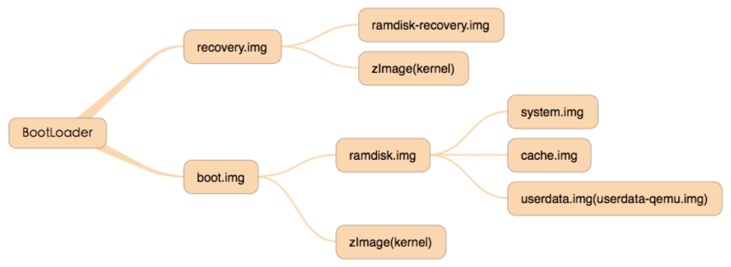

# 浅谈ELF可执行文件的启动流程

url：http://www.wireghost.cn/2015/04/17/%E6%B5%85%E8%B0%88ELF%E5%8F%AF%E6%89%A7%E8%A1%8C%E6%96%87%E4%BB%B6%E7%9A%84%E5%90%AF%E5%8A%A8%E6%B5%81%E7%A8%8B/

## 源码分析

无论是动态链接还是静态链接的原生程序，在链接阶段都会传入一个链接脚本。根据链接时指定参数的不同，所传入的链接脚本也不一样。在 NDK 目录下检索 ldscripts，所有的链接脚本都在该路径中。默认情况下，会传入armelf_linux_eabi.x脚本文件。
[](http://www.wireghost.cn/2015/04/17/浅谈ELF可执行文件的启动流程/1.png)在默认的链接脚本中，声明了可执行文件在进程中的基地址为0x00008000，并将”_start”指定为入口函数。这里，我们可以动手用IDA调试一个原生程序进行对比确认。。
[](http://www.wireghost.cn/2015/04/17/浅谈ELF可执行文件的启动流程/2.png)其中，_start函数定义在Android源码路径中的/bionic/libc/arch-arm/bionic/Crtbegin.c

```
#include "../../bionic/libc_init_common.h"
#include <stddef.h>
#include <stdint.h>

__attribute__ ((section (".preinit_array")))
void (*__PREINIT_ARRAY__)(void) = (void (*)(void)) -1;

__attribute__ ((section (".init_array")))
void (*__INIT_ARRAY__)(void) = (void (*)(void)) -1;

__attribute__ ((section (".fini_array")))
void (*__FINI_ARRAY__)(void) = (void (*)(void)) -1;

__LIBC_HIDDEN__ void _start() {
  structors_array_t array;
  array.preinit_array = &__PREINIT_ARRAY__;
  array.init_array = &__INIT_ARRAY__;
  array.fini_array = &__FINI_ARRAY__;

  void* raw_args = (void*) ((uintptr_t) __builtin_frame_address(0) + sizeof(void*));
  __libc_init(raw_args, NULL, &main, &array);
}

#include "__dso_handle.h"
#include "atexit.h"
```


_start方法中调用了_libc_init，并将main函数的地址和指向preinit_array、init_array、fini_array数组的指针作为参数传入。再来看下_libc_init的实现，这部分在Android源码中的路径为/bionic/libc/bionic/libc_init_static.cpp及/bionic/libc/bionic/libc_init_dynamic.cpp，分别对应静态链接和动态链接的程序。
这里，让我们先看下静态链接的部分。在__libc_init中会先进行一些初始化工作，再调用preinit_array、init_array，最后调用由参数slingshot传入的main函数。

```
__noreturn void __libc_init(void* raw_args,
                            void (*onexit)(void),
                            int (*slingshot)(int, char**, char**),
                            structors_array_t const * const structors) {
  KernelArgumentBlock args(raw_args);
  __libc_init_tls(args);
  __libc_init_common(args);

  apply_gnu_relro();

  // Several Linux ABIs don't pass the onexit pointer, and the ones that
  // do never use it.  Therefore, we ignore it.

  call_array(structors->preinit_array);
  call_array(structors->init_array);

  // The executable may have its own destructors listed in its .fini_array
  // so we need to ensure that these are called when the program exits
  // normally.
  if (structors->fini_array != NULL) {
    __cxa_atexit(__libc_fini,structors->fini_array,NULL);
  }

  exit(slingshot(args.argc, args.argv, args.envp));
}
```


静态链接的程序在启动时不需要额外加载其他的动态库，不过这类程序相对较少，Android系统已知的有init、adbd、linker等程序。实际我们遇到的大多数可执行文件都是动态链接的，它的情况较上面的描述稍有不同。动态链接的程序在运行前还需要做一些初始化工作，如运行所依赖的动态库需要先被载入内存。当执行动态链接的程序时，系统会解析该ELF文件，并找到.interp段中所保存的程序解释器，默认是”/system/bin/linker”。然后先执行linker，linker会加载该程序的所依赖的一系列so，最后再调用该可执行程序。
值得注意的是，linker的入口函数_start并不在Crtbegin.c中。在源码/bionic/linker/Android.mk文件中，linker指定了自己的启动函数所在路径，即/bionic/linker/arch/arm/begin.S

```
    .text
    .align 4
    .type _start,#function
    .globl _start

_start:
    mov r0, sp
    mov r1, #0
    bl  __linker_init

    /* linker init returns the _entry address in the main image */
    mov pc, r0

    .section .ctors, "wa"
    .globl __CTOR_LIST__
__CTOR_LIST__:
    .long -1
```


首先，调用_linker_init函数完成linker的”自举”，并进行一些初始化工作，最后会返回原native程序的入口函数地址（根据native程序的文件头获取）。
至于”mov pc, r0”这条语句，它的作用则是跳转到native程序的入口函数(_start)去执行。
再往后的调用过程与之前已经描述过的一样，都是_start调用_libc_init。此外，前面还提到过，动态链接程序的__libc_init是定义在libc_init_dynamic.cpp文件中。

```
// This function is called from the executable's _start entry point
// (see arch-$ARCH/bionic/crtbegin_dynamic.S), which is itself
// called by the dynamic linker after it has loaded all shared
// libraries the executable depends on.
//
// Note that the dynamic linker has also run all constructors in the
// executable at this point.
__noreturn void __libc_init(void* raw_args,
                            void (*onexit)(void),
                            int (*slingshot)(int, char**, char**),
                            structors_array_t const * const structors) {

  KernelArgumentBlock args(raw_args);

  // Several Linux ABIs don't pass the onexit pointer, and the ones that
  // do never use it.  Therefore, we ignore it.

  // The executable may have its own destructors listed in its .fini_array
  // so we need to ensure that these are called when the program exits
  // normally.
  if (structors->fini_array) {
    __cxa_atexit(__libc_fini,structors->fini_array,NULL);
  }

  exit(slingshot(args.argc, args.argv, args.envp));
}
```


可以发现，这段代码比静态链接程序的__libc_init还要简单些，这是因为一些初始化工作由linker完成了。

## 总结

无论是静态链接还是动态链接，native程序的入口函数都是_start。里面存在main方法和执向init_array、fini_array等数组的指针，它们对应初始化函数和析构函数。其中，动态链接的程序在执行_start之前，会先由linker加载所需的依赖库，并进行一些初始化工作。此外，可执行文件在进程中的基地址为0x00008000，关于这点可以做下备忘。。