# 移动基带安全研究系列之一 概念和系统篇

阿里安全 谢君

**一、背景**

随着5G大浪潮的推进，未来万物互联将会有极大的井喷爆发的可能，而移动基带系统作为连接世界的桥梁，必将成为未来非常重要的基础设施，而基础设施的技术自主能力已经上升到非常重要的国家层面上的战略意义，从美国对待中国的通信产商华为的禁令就可以看得出基础技术的发展对一个国家的震慑，现今人类的生产生活已经离不开移动通信，未来也将会继续是引领人类科技的发展的重要媒介，人工智能，自动驾驶，物联网以及你所能想到的一切科技相关的发展都会与移动通信产生重要的联系，在此之上其安全性和可靠性将会成为人类所关心的重要问题，这也是笔者为了写这个系列文章的初衷，也希望更多的安全研究人员参与到基础设施的安全研究当中来，挖掘出更多的缺陷与隐患，完善未来的基础设施的安全。

**二、概念和研究目的**

3GPP 移动通信的标准化组织 3rd Generation Partnership Project，成立于上世纪末，主要职能是为了制订移动通信的技术标准，保证各个不同国家以及运营商在移动通信方面的兼容性，最常见的例子就是能够让我们的手机可以做到在不同的国家漫游使用。

3GPP所制定的移动通信技术标准涵盖了所有的2/3/4/5G通信相关的技术体系，产生了大量的技术文档供研究人员学习和参考，有兴趣的可以从3GPP的官方网站获取。

 本系列文章研究对像是指3GPP定义的移动通信相关2/3/4/5G的基带软硬件和通信系统，例如手机的语音/短信/数据流量，以及物联网中使用的相关移动通信技术的端设备。基带系统本身是泛指无线通信系统里面的软/硬件和通信技术的集合体，例如蓝牙/Wi-Fi/GSM都有基带系统，所以本系列文章所指的基带系统单指移动通信相关的2/3/4/5G技术相关的基带系统。

 研究对象和目的：高通的基带芯片以及对3GPP定义的对通信协议栈的实现，基带系统是一个非常庞大且复杂的系统，包括软/硬件和通信技术的完美融合，所以具有相关设计能力的芯片产商很少，从2018年基带芯片的市场份额分布，高通是这个领域市场份额做的最大的芯片产商，高通是多个国内手机产商的供应商，例如小米，oppo/vivo等，而华为现在已经有了自己基于海思芯片设计的基带系统，打破了国外基带芯片市场的垄断，现在华为的手机产品都是用的华为自产的海思基带芯片，不过软件系统还是基于人家的VxWorks，不过刚刚华为发布了鸿蒙微内核系统，这个系统很有可能华为会把基带系统移植上去，现在应该加紧进行基带系统的移植工作，本身各家的基带系统都是非常封闭的，因为涉及各家的核心技术能力，加上移动通信的复杂性，研究的人也比较少，我研究的目的之一就是挖掘里面的一些设计逻辑，结合3GPP的协议的定义来更好的理解整个基带系统的实现，并且深入挖掘里面的攻击面以及如何更好的发现里面的安全问题。

[上面图片来源](https://www.businesswire.com/news/home/20180731005614/en/Strategy-Analytics-Q1-2018-Baseband-Market-Share)

研究方法：

整个系列文章将会围绕高通基带系统对3GPP定义的协议栈的实现来挖掘里面的一些业务逻辑以及挖掘相关的攻击面来进行，所以我的研究方法会针对如下层次来进行。

1． 操作系统

2． 应用系统

3． 3GPP实现的协议栈

4． 攻击面研究以及缺陷挖掘

封闭的基带系统需要大量的逆向工程的工作，来获取对基带系统行为的了解，逆向工程是安全研究者在挖掘未知的必备技能，什么时候需要逆向工程，在你无法获取目标研究对象的源代码和设计文档或者仅能够获取极少文档信息的情况下，想了解其目标对象的一些设计逻辑，原理和算法，这个时候你只能通过逆向工程这种合法手段来达到上面的目的。

逆向工程也分软件和硬件，现今的数字系统基本上都是通过软件来定义的，我们对于硬件的逆向工程就不展开讲了，有机会单独写出来，所以本文讨论的也基本上是软件层面上的逆向工程，而基带系统与硬件结合又是非常紧密的，所以对基带系统的逆向工程也需要硬件研究能力的支撑，逆向工程的难易程度也是分等级的，如下是我个人对逆向工程难易的理解，默认下面所有应用的固件都可以获取，通过研究工具的获取和研究的成本来分类。

而我们选择的研究对象高通的MDM系列芯片按我的理解难度应该在上图的L3的级别，非常有限的芯片信息的情况下。

**三、高通基带硬件系统介绍**

高通的基带硬件按照功能的不同分为两类：

1． MSM系列  （Mobile Station Modem）

2． MDM系列   (Mobile Data Modem)

MSM系列主要是给手持移动通信设备使用，例如手机等

MDM系列主要是给移动数据流量设备使用，车联网或其它物联网设备等

MSM系列与MDM系列的区别

MSM系列芯片包括应用处理器（Application Processor）和基带系统处理器(Baseband Processor)还有Wi-Fi，蓝牙等,这个主要是提供整体的手机解决方案来给手机产商使用，Android生态的大部分手机都是运行在高通的MSM系列的SoC之上，例如小米5手机搭载的高通骁龙系列S820的SoC就是MSM8996系列的芯片，应用处理器运行的是Android系统。

MDM系列早期只包含（Baseband Processor），主要是提供数据modem和语音的功能，苹果手机生态和车联网以及4G无线上网卡等应用中比较常见，比如iPhone 8/8 Plus和iPhone X都是配备的高通MDM9655的基带芯片，而宝马/奥迪车联网的TBOX则配备的MDM6x00系列的基带芯片,而15年生产的通用安吉星系统TBOX则采用的是MDM9215系列，为了能够提供更强大的业务逻辑能力，MDM系列基带芯片SoC剥离了基带系统和业务系统，由两个core组成，比如mdm9xxx系列芯片包含一个hexagon的DSP基带处理核，以及一个ARM Cortex-A系列的核。

从功能上来说，MSM系列的功能是包含了MDM系列的功能

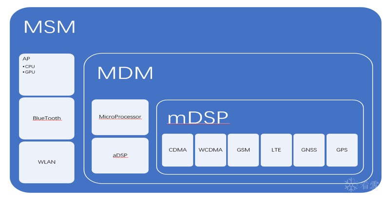

所以高通的MDM系列的Baseband Processor并不是严格意义上的一块处理器，而是至少有3个core。

1． 一个基于ARM的微处理子系统

a. ARM1136                    à MDM6600

b. ARM Cortex-A5 + Hexagon DSP  à MDM9215

2． 一个基于高通Hexagon QDSP架构的Modem DSP(mDSP)

3． 一个基于高通Hexagon QDSP架构的Application DSP(aDSP)

这3个core的主要功能如下：

1． 这个基于ARM的微处理器属于基带系统的子系统（MDM6x00基于ARM1136的架构，MDM9x15系列基于ARM Cortex-A5以及新增了一个hexagon DSP处理器），它将协助mDSP和aDSP的初始化和与这两个core进行通信交互以及实现3GPP定义通信的所需的协议栈功能和算法，也可作为特定应用相关处理平台，例如在车联网中会将它作为TBOX的应用逻辑的处理器，MDM9x15把3GPP协议栈的实现转移到了hexagon DSP上，而MDM6x00的3GPP协议栈的实现是在这个ARM1136上完成。

2． mDSP的主要功能就是无线信号的调制与解调，在3G为代表的MDM6x00系列的mDSP主要实现CDMA/WCDMA/GSM/GNSS信号的调制与解调，在4G为代表的MDM9x15系列主要实现了包括CDMA/WCDMA/GSM/LTE/GNSS信号的调制与解调。

3． aDSP(Application DSP)，主要功能是实现与应用相关的信号调制与解调，例如语音信号的调制与解调（Audio DSP），常见的应用就是我们手机语音通话时编码与解码以及压缩就是通过这个aDSP来实现。

下图为高通MDM系列基带芯片的一些特性：

 

上面图片来源高通

**四、高通基带软件系统介绍**

高通基带的软件系统从2000年左右就开始应用他们自己设计的嵌入式rtos系统REX来构建他们自己的手机基带应用系统AMSS，而且基础的应用软件架构一直沿用至今，由于基带应用系统其复杂的特性以及大量的功能应用，为了保证其应用良好的移植性和兼容性，所以基带的底层系统采用精简的微内核系统OKL4，这是一个开源的微内核系统，基于ARM的基带处理器都是采用的OKL4微内核，自从高通开发的新的hexagon DSP基带处理芯片后，一个名为QuRT嵌入式微内核系统因此而产生，这个QuRT前期也叫Blast，它的出现应该是专门为QDSPv6架构的DSP处理器而开发的，我们今天分析的MDM6600基带芯片是基于OKL4的微内核+REX AMSS应用系统，而我们重点关注的其实也是运行在REX之上的AMSS应用，下图是整个基带系统的基于ARM和基于hexagon QDSP架构逻辑，未来5G应用还会继续沿用右边的架构。

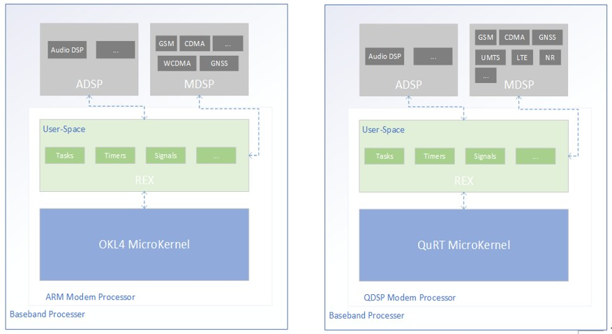

  微内核的好处在于，应用系统可以保持高度的可移植性，微内核系统只要满足基本的IPC通信机制，内存管理，CPU调度机制即可，驱动文件系统等以及应用都可以在用户态来初始化完成，这对于需要支持多个硬件平台的高通来说无疑非常高效的做法，如下图是高通的系统架构。

基带软件系统主要包括如下部分：

a.    启动管理

b.   内存管理

c.    文件系统

d.   定时器机制

e.    任务管理和IPC通信机制

f.    中断管理

**a.   基带系统启动过程**

高通基带芯片很早就引入了secure boot的启动验证机制，来防止启动过程中运行的代码或数据被篡改，旨在安全可信计算，现在大部分高通系的手机都有这个功能，芯片上电后先被芯片的BootRom接管，该BootRom里面的代码不可篡改，里面存有flash控制器的基本读写功能，而且芯片的OTP区域可以存储产商授权的公钥证书，用于签名认证启动过程中需要认证的分区数据。以MDM6600芯片在某个车联网应用基带设备为例，它的启动过程如下：

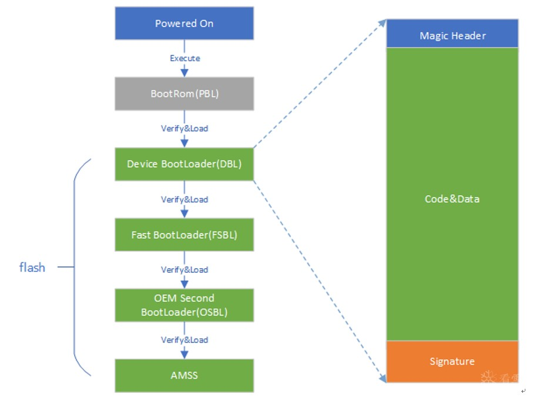

芯片上电后执行BootRom里面代码检测是否从flash启动，如果是从flash的第一个扇区读入数据到内存并搜索secureboot启动的Magic Header，然后解析头部相应的数据结构，获取代码和数据的大小和偏移以及装载到内存的地址信息，签名/证书数据偏移和长度，如下图是DBL头部区域信息。

0x00 - CodeWord ("D1 DC 4B 84")

0x04 - Magic ("34 10 D7 73")

0x14 – Body start offset (0x2050)

0x18 - Loading address (0x20012000)

0x1C - Body size (Code + Signature + Certificate store size)

0x20 - Code size

0x24 - Signature address

0x28 - Signature length (256 bytes)

0x2C - Certificate store address

0x30 - Certificate store length

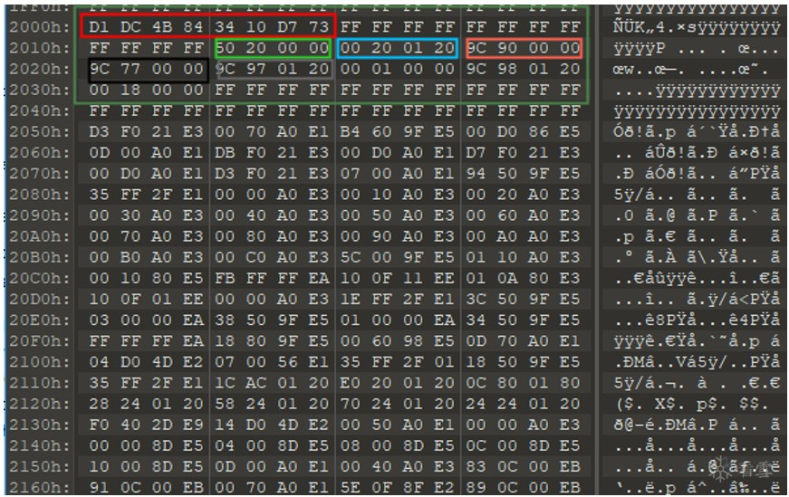

证书信息截图

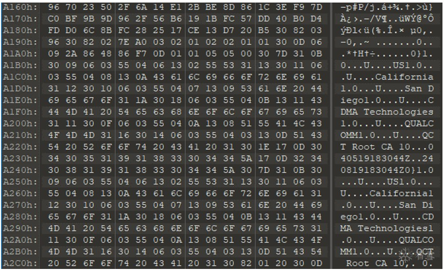

当BootRom验证DBL代码和数据签名成功后，此后DBL的代码接管执行，然后搜索MIBIB分区表，获取各个分区的起始block信息，然后在相应的块去读取相应的数据，接着就是验证相应分区数据的签名，然后相应的分区代码接管，完成一系列的信任启动链，DBL验证成功后，验证FSBL，然后是OSBL，最后是AMSS。

0x00 - CodeWord ("AA 73 EE 55")

0x04 - Magic ("DB BD 5E E3")

0x0C – Partition Nums (0xa)

每个分区表信息长度0x1c，例如

0x00 – 0x10 partition name (0:FSBL)

0x10 – Partition start block information (0x0f)

0x14 – Partition block length (0x2)

  这里定义的每个页是0x800字节，每个块block有64个页，所以每个block的长度是0x20000字节，所以根据这个信息我们就可以定位这些分区的物理偏移信息。

例如FSBL的物理偏移为0x20000*0xf=0x1e0000

AMSS的物理偏移为0x20000*0x16=0x2c0000

b.   基带系统内存管理

当基带系统的安全信任启动链验证完成后，最后系统被AMSS系统代码接管， AMSS系统定义了代码执行的内核特权模式以及AMSS应用模式，设置页表（映射硬件外设地址到页表中）并且开启MMU(内存管理单元)，在某些敏感的内存地址区域通过MPU的特性来进行保护，只有特定权限的应用的可以访问，应用模式的代码想要进入内核态（例如IPC消息发送），可以通过设置的特权中断指令SVC进入内核态，下图就是进入特权syscall的中断向量表入口。

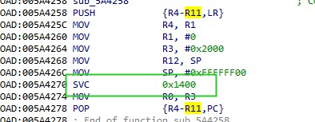

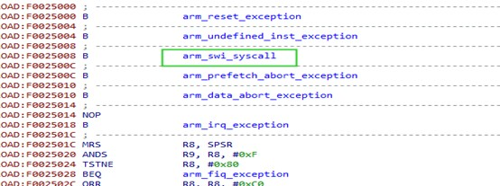

通过初始化页表完成内核地址空间和外设硬件地址映射，开启mmu，创建第一个rootTask后切入用户态空间，初始化用户态需要创建的应用与驱动，这里主要介绍应用层堆内存结构以及内存分配和回收算法。

REX系统堆内存分两种类型：

Big chunk（大堆）

small heap（小堆）

大堆在不同应用初始化的时候指定内存的起始地址与长度，而且根据应用功能的不同，分配方式也不同，小堆将会在大堆上进行分配使用，大堆由于给使用的应用不同，分配小堆的方式有所不同。

a． 大堆类型1,内存连续，分配小堆的方式是顺序分配，前面是分配好的小堆，后面是连续的空闲堆块，分配小堆只会在连续的空闲块上进行分配，例如前面多个分配好的小堆其中一个需要被释放后，只是把这个小堆的属性标记为freed，但由于它后面的小堆到连续的空闲块中间有标记为已经分配属性，所以后续在分配小堆的过程中不会考虑这块已经被释放的内存，除非要释放的小堆内存和连续的空闲块紧挨着，下一次分配内存时才会从这个已经标记为释放的内存上进行分配，而是直接到后面的连续空闲块上进行分配，这样做的目的是为了分配和释放内存更高效，虽然牺牲了一些空间，结构如下图。

下图是这种chunk上分配小堆的状态信息示例

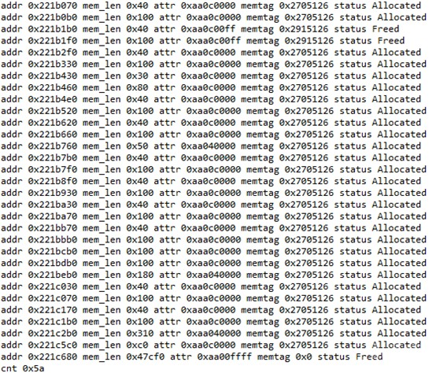

b． 大堆类型2,（modem chunk）,也是一个连续内存区域，但是chunk header在内存的底部，上部为分配小堆区域，分配顺序也是从上往下分配，小堆的头部数据结构中会指向上一个已经分配好的小堆，通过单向链表进行小堆内存的回溯，最上面的小堆回溯指针为空，但是它的内存分配算法跟上面的不同，就算要被释放的小堆内存和空闲块不挨着，但是它任能在下一次的堆内存申请中被重用，只要它的大小合适，而且小堆数据结构与类型1也不同，基本结构如下图。

Modem使用大堆结构示例

我们可以看到chunk类型1和chunk类型2上面分配的小堆内存结构稍有不同，数据结构如下：

Small heap1{

Uint32 size;//+0 分配内存空间的长度加上头部长度0xc字节

Uint8 mem_flag;//+0x4 内存属性标志，0表示已分配，0xff表示释放掉的内存

Uint8 extr_mem_flag;//+0x5 扩展内存属性标志，0表示内存分配过，0xff表示

//内存空间，没有被使用过

Uint8 mem_extra_size;//+0x6 额外分配的内存长度，为了内存0x10字节对齐

//所额外增加的申请内存长度，必须小0x10字节

Uint8 mem_pad_char;//+0x7 填充字节0xaa

Uint16 crc16_cookie;//+0x8 对传入的第三个参数的crc16计算的值

Uint16 mem_id;//0x0a  内存标识,第四个参数传入

Uint8 mem_buffer[size-0x0c];//+0xc 用户使用内存buffer

}

Small modem heap{

 Uint32 size;// +0 分配内存空间的长度加上头部长度0x10字节

 Uint32 *pre_alloc_ptr;//+4 指向上一个分配好的小堆内存头部指针

 Uint8 client_id;//+8 申请内存的应用id值，modem功能中定义了

//RRC/CM/SM/RLC/gstk/wms等多个应用，这个id来标识申请内

//存的应用来自于哪里

 Uint8 mem_flag;//+0x9 内存属性标志，0表示分配了，1表示释放了，

//3表示未使用

 Uint8 unknown_byte;//+0xa

 Uint8 mem_guard_bits;//+0xb modem内存保护标志0x6a

 Uint32 alloc_ret_addr;//+0xc 分配内存函数的下一条指令地址，目的是为了

//确定执行内存分配行为的精确地址

 Uint8 mem_buf[0xsize-0x10]; //+0x10 供用户使用的内存buffer

}

c.   基带系统文件系统

由于篇幅问题，我会对Qualcomm基带的文件系统EFS单独写一篇详细的分析文章。

d.   高通基带芯片定时器（Timer）

定时器是嵌入式芯片非常重要的组成部分，它在嵌入式操作系统的CPU调度和定时任务执行，以及精确的延时等待等操作中扮演着非常重要的角色，高通的基带芯片的定时器调度算法大体都差不太多，我们基于ARM1136架构的MDM6600基带芯片对定时器算法进行了深入分析。

MDM6600的定时器是通过Sleep Timer控制器来实现的，它包含两个16位的Timer0和Timer1，以及一个32位的TimeTick的计数器(counter)，它们的功能用途如下.

1．Timer0  供watchdog使用

2．Timer1  供3G的wcdma的功能模块使用

3．TimeTick 系统计数器，服务于系统的子任务模块创建的定时器任务的执行以及延时功能的使用

Timer0应用于watchdog功能中，Watchdog在实时嵌入式系统中扮演着非常重要的角色，它监控任务的正常运行，监控的任务必须定时喂狗（feed dog），watchdog才认为你在正常工作，要不然就可能会直接reset系统，后续也会介绍它在基带里面具体监控的应用。

Timer1将会在3G WCDMA应用中收发相关的定时中断中会详细介绍。

TimeTick是一个32位的系统计数器，初始化后会从0开始计数，计数到0xfffffff后溢出到0后重新开始计数，主要功能如下：

1． 执行定时任务

a.   执行一次

b.   周期性执行

2． 执行延时功能

a.   延时等待

TimeTick的时钟源为32768Hz，这意味着这个计数器1秒钟会计数32768次，通过这个信息我们可以大致计算出从0计数到0xffffffff需要36个小时。

  定时任务功能特性：

a.    通过设置TimeTick的match value来决定计数器计数到这个值后产生一个中断，中断里面可以处理相应的定时任务，以及设置新的TimeTick match value。

b.   所有的定时任务都会存储在定时任务列表中，提供定时任务的插入，删除，暂停，唤醒执行等功能。

下图描绘了定时器任务执行的基本过程

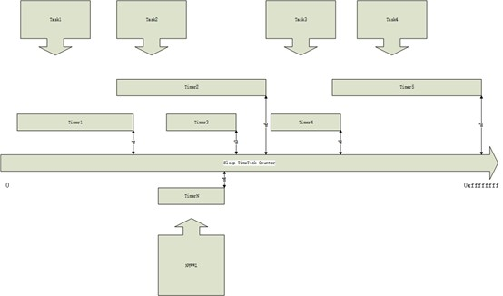

在基带系统中存在多个应用任务，每个任务的执行都是依赖内核的CPU调度，常见的方式就是时间片和优先级切换让各个不同的任务有机会得到执行，而某些任务在运行过程中的某个时机可能会创建一个或者多个定时器任务，例如上图所示的任务Task1创建的定时器任务Timer1，Task2创建的定时器任务Timer2和Timer3，处理这些任务的算法如下：

1． 创建定时任务时，获取当前TimeTick的计数

2． 把延时换算法成计数，比如1秒等于32768次计数

3． 把当前timetick计数加上延时的计数值作为该定时任务中断触发的match value

4． 遍历所有定时任务，根据任务设置的定时任务中断触发的match value大小排序插入到定时任务列表

5． 当timetick的计数到达某个定时任务的Match value的时候产生中断，中断处理例程ISR会通过向DPC（Deferred Procedure Calls）发送执行定时任务的消息去执行该定时任务的例程函数，如果只是延时任务就不需要执行了，同时更新timetick的下一次中断产生的match value，并把这个定时任务从定时任务列表中移除

如上图举例：

按照时间推进过程，这些定时任务执行需要设置的Match value来产生中断的顺序依次是：

所以在基带系统里面会有一个专们的定时器应用任务来管理维护其它应用任务产生的定时器任务的调度

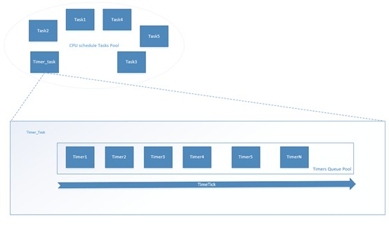

e.   任务管理和IPC通信机制

 上面提到基带系统从内核态切入到应用态会创建第一个rootTask应用任务，这个任务有点类似linux系统里面的init进程，rootTask接下来会创建应用权限很高的DPC_task任务（负责高实时异步任务执行），权限仅次于IST（interrupt service threads,中断服务接管线程），然后是应用层的全局管理任务main_task将会启动，接下来业务所需的各种驱动相关的初始化和通信业务逻辑任务将在main_task任务中得以创建，例如中断接管服务相关的IST(interrupt Service Threads)，定时器业务相关的timer_task，qualcomm EFS文件系统相关的fs_task，任务监控相关的watchdog_task，以及GSM/UMTS业务相关的通信层面的各个任务。

每个任务被创建时，REX内核和用户态各自会维护一套数据结构，以及用户自定义的一套TCB结构：

内核态—>KTCB（Kernel Task Control Block）

用户态—>UTCB（User Task Control Block）

用户态—>REX_TCB(用户自定义TCB结构)

在内核态，cpu通过KTCB来管理调度所有的任务，以及管理用户态任务在切换时存储任务的context信息。

内核态的KTCB列表包含1个idle内核线程,8个IRQ和1个FIQ内核线程任务KTCB结构，以及每一个用户任务UTCB对应的在内核空间存储的KTCB结构。

在用户态，每一个任务都会通过UTCB结构存储任务信息供用户读写，并且该UTCB结构也会映射到内核空间供内核读写，而用户态的REX_TCB是供用户自定义的数据结构，用户可以自定义一些方便业务间通信的数据结构。

任务的几个重要的特性：

\1.   内核态读取0xf0000008地址存储着当前活动任务的KTCB指针

\2.   内核态0xf001e000存储着所有KTCB结构的列表

\3.   在用户态读取0xff000ff0地址值可以获取当前活动任务的UTCB指针

KTCB，UTCB和用户定义的TCB结构关系如下图：

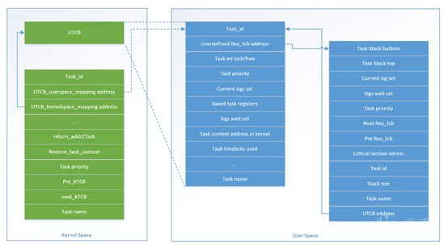

从上图可知，UTCB结构通过内存映射的方式会被内核态和用户态共同读写，utcb通过timetick计数器来记录任务使用了多少cpu时间，为任务调度提供了很好的判断条件。

每个被创建的任务都包含一些信息，初始化时会存储在UTCB结构和用户定义的TCB结构中:

\1.   任务的执行函数地址

\2.   任务执行函数参数

\3.   堆栈起始地址

\4.   堆栈的长度

\5.   任务优先级别

\6.   存储用户tcb地址

\7.   任务名称

任务创建函数定义类似结构如下，不同的版本可能会有一些变形：

Void *createTask(void *utcb,void *task_func_ptr,uint32 stack_size,void *stack_buttom,void *stack_top,uint32 task_priority，void *pararm)

用户定义tcb结构是一个双向链表结构，每个用户tcb会把高于自己优先的任务插入到前链，低于自己优先级的任务插入到后链，所有的任务中中断接受任务中的FIQ任务的优先级是最高的，它用于快速处理来自于fiq中断请求。

下图是枚举出的部分运行的任务列表：

所有的任务通过优先级的高低，利用双向链表链接起来，如下图，FIQ任务具有最高优先级。

而sleep任务具有最低运行优先级。

用户态的任务创建和运行流程如下图：

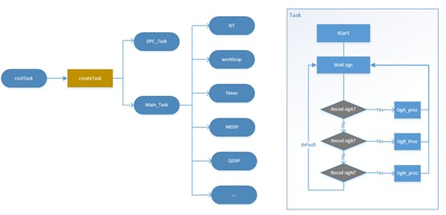

用户态任务运行特性：

a.    每个被创建后的任务会被调度运行起来后，直至到等待信号的循环，阻塞接收消息，此时交出cpu执行权，切换执行任务。

b.   当某个任务接收到消息后，任务等待信号的循环返回，根据接受到信号去处理相应的例程，然后清除接受到的信号值，继续新一轮的信号等待。

c.    任务通过设置接受信号的掩码来设置多个信号处理例程，每个任务最多支持设置32个信号接受值。

d.   信号接受值和信号接受掩码会在utcb结构中设置。

任务调度机制：

a.    中断发生时，cpu将调度到IST接管中断处理，因为IST的优先级比较高

b.   当任务等待消息阻塞时，任务主动交出cpu控制权

c.    应用任务都在等待时，rootTask和Main Task接管CPU，类似idle loop

d.   当各个任务都有接受到消息时，根据任务的优先级和cpu使用时间进行调度

如下图系统初始化过程中的任务的切换过程以及CPU使用时间统计。

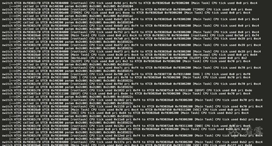

我们可以看到，在系统初始化过程中，各个任务的初始化过程，cpu使用时间都差不太多，因为初始化完了都处于阻塞状态了，只有rootTask和Main Task占有大量的CPU时间，因为rootTask需要负责大量的KTCB切换的通知操作，而且Main Task主动初始化那些应用任务。

IPC任务间通信

IPC通信是多任务协作通知和同步数据，非常重要的系统机制，在实时操作系统中应用广泛，对于无线通信复杂的状态机制以及低延时同步处理，IPC通信起到了至关重要的作用。

从上图我们可知每个运行的任务都有独立运行环境，有自己的堆栈空间，当不同任务之间进行数据交换和同步的时候，这时候就需要用到IPC机制了，我们把用户任务的rex_tcb结构作为任务的唯一标示，用它与之不同的任务进行通信，这里用到了很重要的信号通知和等待信号通知的机制，从上面我们可知每个任务可以定义最多32个信号量来区分接收到的不同信号，然后根据接受到的不同信号进行相应的处理。

例如A任务需要告之B任务，是时候处理B任务里面的某个分支逻辑时，A只需要设置B任务rex_tcb结构里面相应的信号值即可，当B任务被调度起来后的接受信号等待函数会返回取出A设置的信号值，然后B任务作相应的处理，该IPC通知机制在基带系统里面应用广泛，后续我也会提到。

f.    中断管理

 基带系统在系统初始化过程中会初始化中断控制器，注册相应的中断服务例程，设置中断优先级，并且生效中断响应，在高通的MDM6600基带系统中设置了8个响应IRQ的IST任务，和1个响应FIQ的IST任务，优先级依次提升，FIQ的IST任务具有最高的优先级别，因为在中断处理过程，可能会有更高优先级的中断产生，这时需要有高优先级的IST来接管响应来提升中断响应的实时性，由于中断是由硬件产生，而IST在应用态，所以中断处理过程如下。

1． 硬件中断产生                          （物理层）

2． 判断是否是generic irq还是fiq                  （物理层）

3． 进入到irq exception或者fiq exception向量表            （内核）

4． 投递到相应中断处理分发器                    （内核）

5． 查询IRQ和FIQ的内核KTCB状态是否空闲             （内核）

6． 通过KTCB结构找到相应的IST任务                （内核）

7． 相应的IST接管中断，锁定该IST，并查询中断号对应的ISR （应用层）

8． 执行ISR后，清除中断状态，解锁IST，等待新的中断响应  （应用层）

五、结语

 本文章的目的主要是为了对高通的基带系统有一个体系化的了解，操作系统作为承载业务系统的基础设施，了解其运行原理对于研究上层业务会有很大的帮助，由于高通的的基带系统非常封闭，研究需要大量的逆向工程的工作，记录了大量的笔记，无法一一整理发出，所以也有可能会有一些遗漏和不足，如果有熟悉的同学，也希望能够指出有错误的地方，便于改正，接下来系列的研究文章将针对高通基带对于3GPP定义的GSM/UMTS/LTE，以及5G的实现上，并且在研究过程中，也会对比三星和华为在基带方面的实现和安全问题，并且挖掘其安全攻击面。

​                                      阿里安全    谢君