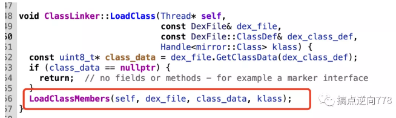

# InMemoryDexClassLoader

url：https://mp.weixin.qq.com/s/FSRIEr9pgyXSImjfUD3t_Q


## 前言

  由于壳都需要通过Classloader来加载App本身的Dex文件,一般都是通过DexClassLoader来加载,安卓8.0以后引入了InMemoryDexClassLoader从内存中加载dex文件.

## 整体壳加壳方案

  由于DexClassloader加载的Dex不能运行Activity,所以要通过ClassLoader的双亲委派机制来修正ClassLoader,从而使App的Activity可以运行起来


```
1. 替换当前android.app.LoadedApk的mClassLoader为需要加载的DexClassLoader,
 并把父节点指向PathClassLoader.(常用方案)
 2. 把加载的DexClassLoader的父节点指向BootClassLoader
 然后将PathClassLoader的父节点替换成DexClassLoader.(有兼容性问题)
 3. 找到当前的PathClassLoader的Elements和DexClassLoader的Elements进行合并(也适用于热修复)
等等...
```

## 整体壳脱壳方案

  从加壳角度出发,研究DexClassLoader和InMemoryDexClassLoader的源码所经之处,找到最后相同的点即为一个不错的脱壳点

  存在DexFile或者可以间接拿到DexFile的地方都可以是脱壳点.

  本文分析DexClassLoader和InMemoryDexClassLoader构造函数源码所经之处,找到两个函数相同经过的函数即为一个不错的脱壳点.

### DexClassLoader


分别进入看一下,以下进入Native层API

/art/runtime/native/dalvik_system_DexFile.cc

1.createCookieWithDirectBuffer


2.createCookieWithArray


/art/runtime/dex_file.cc


运行完构造函数后Dex就加载进内存了

脱壳点:

DexFile::Open -> DexFile::OpenCommon -> DexFile::DexFile

### InMemoryDexClassLoader

不会经过dex2oat


后续流程同DexClassLoader

流程图


接下来进入Native层


总结:

DexFile::DexFile 是一个不错的脱壳点,其中入参包括Dex的起始地址和大小,直接可以Dump下来保存为dex文件.(在Android7.1 和 Android8测试过 其他Android版本可以自行实验修改) 需要给App存储卡权限 或者 自己修改存储路径到app自身的路径.

Frida脚本


```
var savepath = "/sdcard"
function FindArtAddr() {
    var symbols = Process.getModuleByName("libart.so").enumerateSymbols();

    for (var i = 0; i < symbols.length; i++) {
        var symbol = symbols[i];
      //_ZN3art7DexFileC2EPKhmRKNSt3__112basic_stringIcNS3_11char_traitsIcEENS3_9allocatorIcEEEEjPKNS_10OatDexFileE
        if (symbol.name.indexOf("DexFileC2") >= 0
            && symbol.name.indexOf("OatDexFileE") >= 0
        ) {
            console.log(JSON.stringify(symbol))
            dexfile_dexfile_addr = symbol.address
        }
    }
    hook_DexFile_DexFile()
}

function hook_DexFile_DexFile() {
    if (dexfile_dexfile_addr) {
        console.log("dexfile_dexfile_addr",dexfile_dexfile_addr)
        Interceptor.attach(dexfile_dexfile_addr, {
            onEnter: function (args) {
                this.base = ptr(args[1])
                this.size = parseInt(args[2], 16)
                //var size = ptr(parseInt(base,16) + 0x20).readInt() // 通过dex格式来计算出size
            }, onLeave: function (retval) {
                var name = "dexfile_dexfile_" + this.size + ".dex"
                var path = savepath + "/" + name
                var dex_file = new File(path, "wb")
                //Memory.protect(base,size,"rwx")
                dex_file.write(Memory.readByteArray(this.base, this.size))
                dex_file.flush();
                dex_file.close();
                console.log("dexfile::dexfile dump over path -> ", path)
            }
        })
    }
}
}
FindArtAddr()
```

优点: 只要通过DexClassLoader或者InMemoryClassLoader都可以dump下dex,可以对抗整体壳.

缺点: dump时机太早,没有任何类进行加载,无法对抗抽取壳

  拿了一个抽取壳的app做测试,虽然dump出了很多dex 但是其中的指令部分都是nop,还没达到真正的脱壳.


  感谢寒冰老师带来精彩的课程!从课程和源码分析中学习到了很多

  下一篇文章介绍FridaFart中hook脚本的细节原理和fdex2脚本如何移植到安卓7以上的版本并使用Frida实现,以上都可以一定程度上去对抗抽取壳.


## 前言

  还原抽取壳的关键即为需要等待壳将抽空的函数修复回去的时机再dump下dex,所以dump的时机很关键.最近学习了Fart的原理,但是不太喜欢编译刷机去脱壳,比较独爱Frida,正好寒冰老师在直播课中也讲了Fridafart的脚本原理,本文通过分析Fridafart的代码,然后借鉴来写一个自己的脱壳脚本

## FridaFart学习分析与源码跟踪

  先是hook了libart.so里面的LoadMethod方法,然后加载了fart.so里面的方法(这部分可以暂且不先去关注,是用来保存codeitem的)


  然后对LoadMethod方法中的dexfile参数进行解析然后dump到文件,并缓存一份到全局对象中


  这里要注意的是寒冰老师github上的脚本适用于安卓8以上,因为安卓7版本的LoadMethod参数和安卓8以上不一样


  所以这里我们可以通过版本来判断修改参数位置由于它是ClassLinker中函数,Frida第零个参数会指向this,所以要从第一个参数开始算.


  后面通过dexfile的结构体偏移拿到dex文件的起始地址和大小,这里涉及到dexfile的内存布局,这里暂且还没学到,不太了解,就先照抄就好了.下面就是先把第一次经过LoadMethod的dexfile给dump下来,然后再做一个缓存,为什么要缓存呢,后面就马上介绍了.


  下面提供了一个fart的api,注释写了先是利用被动调用(就是你人工点击触发的函数)还原的函数进行dump,再利用枚举classloader传入dealwithclassloader这个api,最后在对所有缓存的dex进行dump.


  这就是缓存的作用,dealwithclassloader的这个api就是来枚举一个classloader中的所有类,然后主动调用loadClass加载所有类使得其中方法可能会被还原,然后利用之前hook保存的dex缓存,等待loadClass加载完所有类,然后进行dump.


  为什么要选择loadClass呢,一般加载类可以使用Class.forName()和ClassLoader.loadClass(),一个类的装载过程为三步.装载-链接-初始化


  两者的区别就是forName默认初始化一个类,导致类的静态代码块执行,loadClass默认不执行初始化,有些壳会对抗你主动初始化了一些不会被初始化的类从而检测到你正在脱壳于是退出app.

可以追踪一下源码,调用了loadClass会发生什么.


进入到native层


下面这个函数代码非常的多,看的比较眼花撩乱,做了很多的判断


其中DefineClass做了很多Class的准备


  通过注释可以知道一些fields和其他加载都在这个方法里,重点关注LoadClass



这里可以发现LoadMethod 和 另一个脱壳点LinkCode


  Loadmethod对CodeItem进行了第一次的set,说明调用loadClass加载一个类会对一个类中函数进行初始化.并且这个函数直接出现了DexFile对象和ArtMethod对象,是个非常好的时机,所以FridaFart对这个函数进行了hook保存了其中的DexFile对象和ArtMethod对象(使用ArtMethod对象来dump codeitem 就是 fart中的.bin文件)


 接下来我们可以看看LinkCode, LinkCode函数对不同函数类型进行了不同的处理，进而完成对ArtMethod中相关变量的初始化工作，如针对native函数进行method->UnregisterNative()，针对以quick模式或interpreter模式执行的函数的不同的初始化工作。虽然这个函数没有出现dexfile对象. 但是, ArtMethod类提供了一个函数：GetDexFile()，该函数也可以获取到当前ArtMethod对象所在的DexFile对象引用，在获得了当前DexFile对象引用后，也依然可以dump得到当前内存中的dex。将ArtMethod对象转为DexFile对象这个用Frida写不太方便,但是发现fridafart的反射版本出现了将ArtMethod转为DexFile的方法,我就直接拿来用了,fart.so做了混淆,暂时无法学习他的代码.


  所以可以将LinkCode也加入我们Frida脚本的脱壳点,经过测试android7.1无法使用fart.so的这个方法,因为无法获取到GetObsoleteDexCache 这个方法.所以我写的LinkCode这个脱壳点只能在安卓8或以上使用(需要将fart.so push到手机的/data/app目录下)

  完整流程图:


```
var LinkCode_addr;
var addrGetDexFile;
var funcGetDexFile;
var savepath = "/sdcard";
var dex_maps = {};
var LinkCode_artmethod_maps = {};

function init() {
    console.log("go into init," + "Process.arch:" + Process.arch);
    var module_libext = null;
    if (Process.arch === "arm64") {
        module_libext = Module.load("/data/app/fart64.so");
    } else if (Process.arch === "arm") {
        module_libext = Module.load("/data/app/fart.so");
    }
    if (module_libext != null) {
        addrGetDexFile = module_libext.findExportByName("GetDexFile");
        funcGetDexFile = new NativeFunction(addrGetDexFile, "pointer", ["pointer", "pointer"]);
    }
}
function FindArtAddr() {
    var symbols = Process.getModuleByName("libart.so").enumerateSymbols();
    for (var i = 0; i < symbols.length; i++) {
        var symbol = symbols[i];
        if (symbol.name.indexOf("ClassLinker") >= 0
        && symbol.name.indexOf("LinkCode") >= 0
        ) {
            //console.log(JSON.stringify(symbol))
            LinkCode_addr = symbol.address
        }
        // Android >= 8
        if (symbol.name.indexOf("ArtMethod") >= 0
           && symbol.name.indexOf("GetObsoleteDexCache") >= 0
        ) {
            addrGetObsoleteDexCache = symbol.address;
        }
    }
    hook_LinkCode();
}
function hook_LinkCode(){
    if(LinkCode_addr){
        console.log("LinkCode_addr", LinkCode_addr)
        Interceptor.attach(LinkCode_addr,{
            onEnter:function (args){
                this.artmethodptr = args[1];
            },onLeave: function (retval){
                    this.dexfileptr = funcGetDexFile(ptr(this.artmethodptr), ptr(addrGetObsoleteDexCache));
                    var dexfilebegin = Memory.readPointer(ptr(this.dexfileptr).add(Process.pointerSize * 1));
                    var dexfilesize = Memory.readU32(ptr(this.dexfileptr).add(Process.pointerSize * 2));
                    var dexfile_path = savepath + "/" + "LinkCode_" + dexfilesize + ".dex";
                    var dexfile_handle = null;
                    try {
                        dexfile_handle = new File(dexfile_path, "r");
                        if (dexfile_handle && dexfile_handle != null) {
                            dexfile_handle.close()
                        }

                    } catch (e) {
                        dexfile_handle = new File(dexfile_path, "a+");
                        if (dexfile_handle && dexfile_handle != null) {
                            var dex_buffer = ptr(dexfilebegin).readByteArray(dexfilesize);
                            dexfile_handle.write(dex_buffer);
                            dexfile_handle.flush();
                            dexfile_handle.close();
                            console.log("[First Dumpdex]:", dexfile_path);
                        }
                    }
                    var dexfileobj = new DexFile(dexfilebegin, dexfilesize);
                    if (dex_maps[dexfilebegin] == undefined) {
                        dex_maps[dexfilebegin] = dexfilesize;
                        console.log("got a dex:", dexfilebegin, dexfilesize);
                    }
                if (this.artmethodptr != null) {
                    var artmethodobj = new ArtMethod(dexfileobj, this.artmethodptr);
                    if (LinkCode_artmethod_maps[this.artmethodptr] == undefined) {
                        LinkCode_artmethod_maps[this.artmethodptr] = artmethodobj;
                    }
                }
            }
        })
    }
}
init()
FindArtAddr()
```

  也是一样做一份缓存 等待loadclass执行完再dump.

  然后提一下如何通过classloader来拿到所有类的,通过将classloader转为basedexclassloader拿到pathlist这个域(需要判断是否继承自他或者他的子类,不然没有这个域),然后在拿到其中的dexElements,遍历后就可以拿到dexFile对象通过其中的mCookie,使用getClassNameList方法获取到所有类的名字然后去dump,下面我加了个过滤条件,只dump包含app包名的类,快速过滤无关代码.这个mCookie是什么?改写fdex2脚本的时候会再提到的.


  说了这么多,可以先看看dump效果.测试了上篇文章的app

  这个app貌似对Loadmethod做了处理,attach hook不上这个函数,用spwan模式hook就退出


所以可以用上刚刚写的LinkCode这个脱壳点了.spwan模式也不崩溃了


  然后调用fart(),我这里没对被动调用的dex进行dump,只等所有类加载完后再dumpclass,因为我没加上dump codeitem脚本 所以只对最晚时间的dex进行dump 可以保证dex相对完整 不需要用修复脚本进行修复.

## 效果演示


拖出来看看上一篇文章的那个被抽空的类.

dexfile_dexfile:


第一次LinkCode dump下来的


loadclass后dump缓存的dex


直接都还原了


  说明可以一定程度上对抗这种不清场型的抽取壳.还原时机在loadmethod和linkcode之后的壳应该也不好对抗.可以使用刷机版fart大杀器来对抗.后续有空还会对fart原理进行介绍.写了好多,有点累,下篇文章再水fdex2的Frida脚本吧

我将脚本上传到了Github,后台回复“脱壳“, 即可获得脚本地址和抽取壳样本.

•android8运行fart()主动调用loadclass可能会崩溃,这种情况下可以试试android7,会稳定一点, 但是android7不支持hookLinkCode 可以手动注释.•脚本只测试过androi7.1.2和android8.1.0两个版本 其他版本自行实验修改
再次感谢寒冰老师~

参考资料:

https://bbs.pediy.com/thread-254028.htm

https://blog.csdn.net/zhu929033262/article/details/77477402

https://www.cnblogs.com/zabulon/p/5826610.html