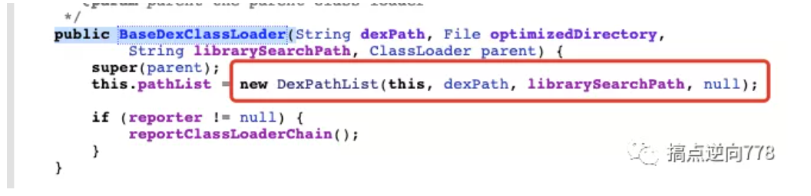
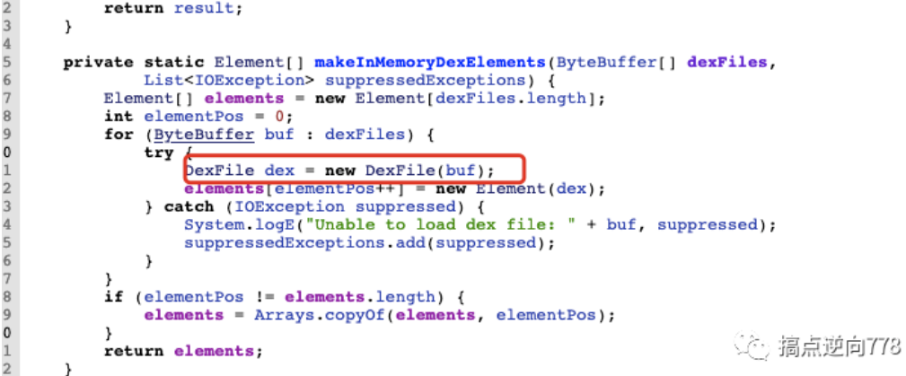
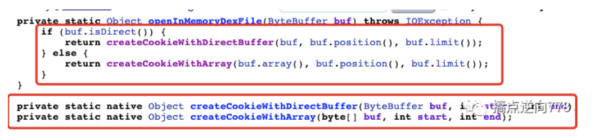
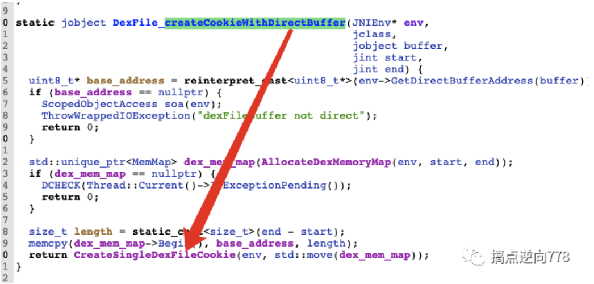
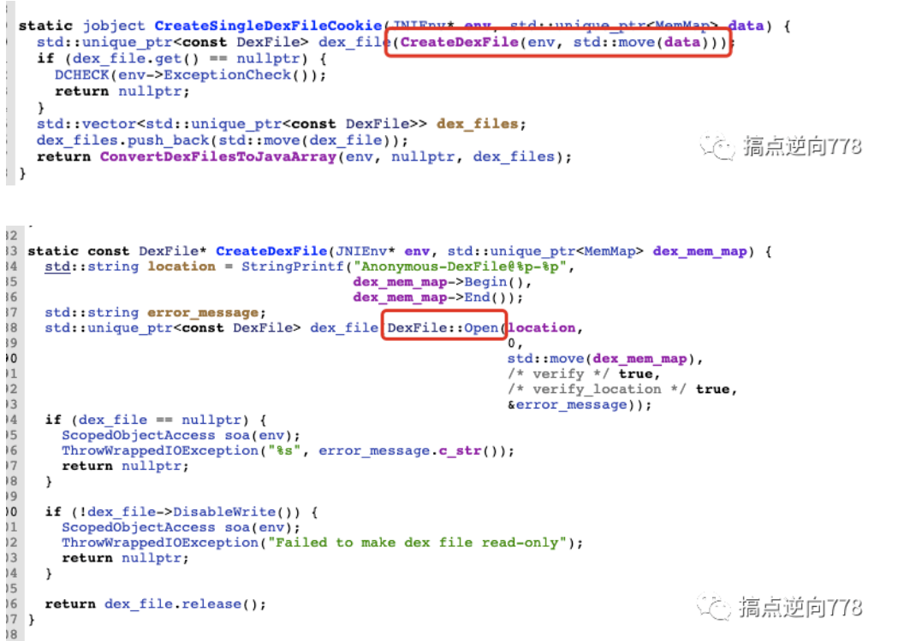
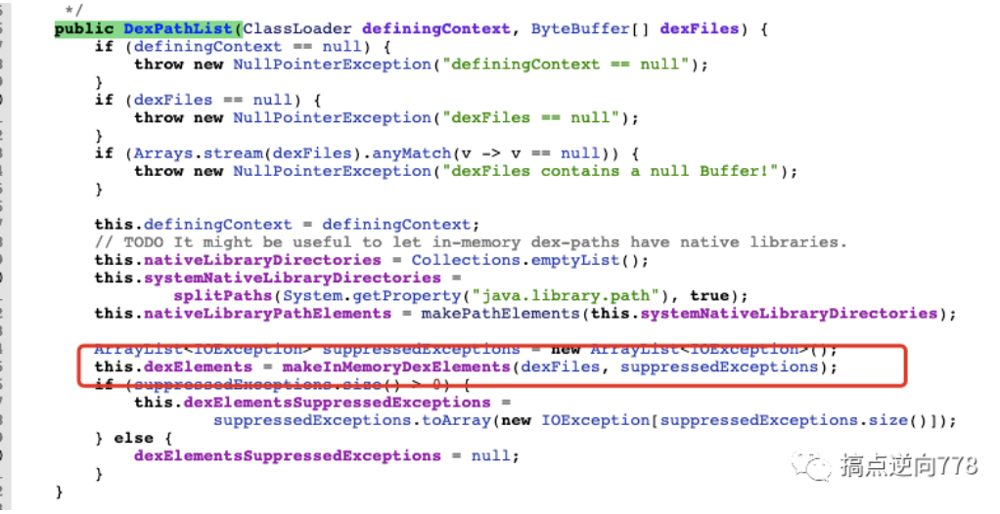
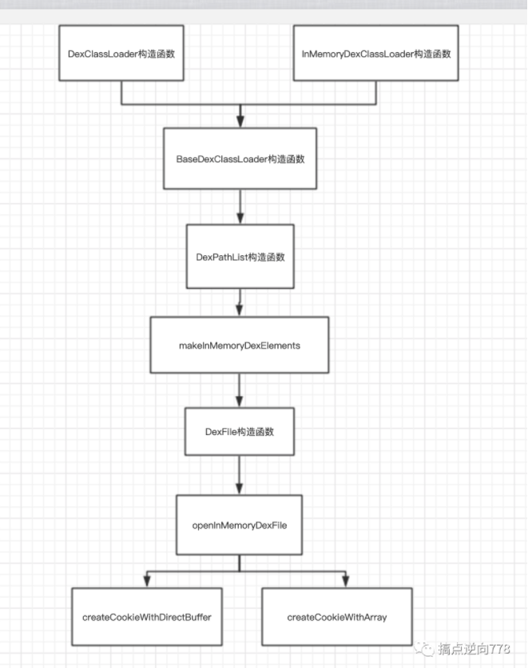
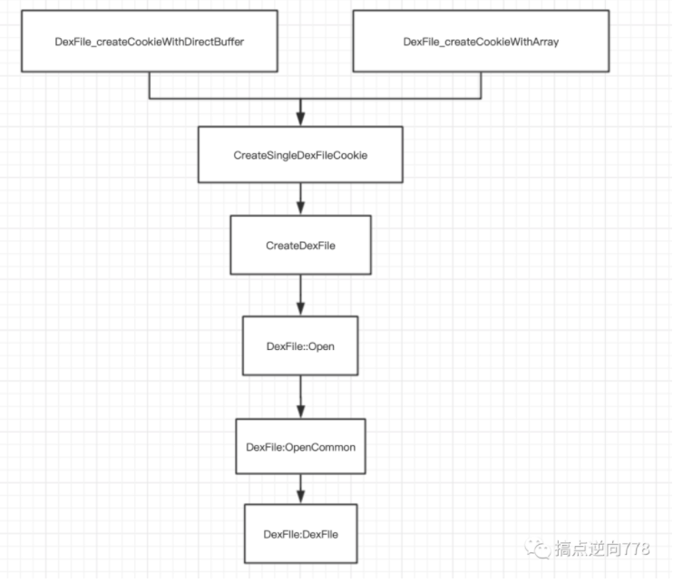
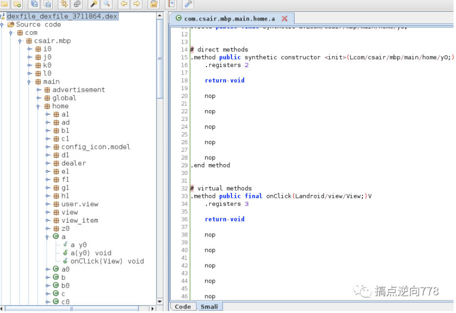

# InMemoryDexClassLoader

url：https://mp.weixin.qq.com/s/FSRIEr9pgyXSImjfUD3t_Q


## 前言

  由于壳都需要通过Classloader来加载App本身的Dex文件,一般都是通过DexClassLoader来加载,安卓8.0以后引入了InMemoryDexClassLoader从内存中加载dex文件.

## 整体壳加壳方案

  由于DexClassloader加载的Dex不能运行Activity,所以要通过ClassLoader的双亲委派机制来修正ClassLoader,从而使App的Activity可以运行起来

- 
- 
- 
- 
- 
- 

```
 1. 替换当前android.app.LoadedApk的mClassLoader为需要加载的DexClassLoader, 并把父节点指向PathClassLoader.(常用方案) 2. 把加载的DexClassLoader的父节点指向BootClassLoader 然后将PathClassLoader的父节点替换成DexClassLoader.(有兼容性问题) 3. 找到当前的PathClassLoader的Elements和DexClassLoader的Elements进行合并(也适用于热修复)等等...
```

## 整体壳脱壳方案

  从加壳角度出发,研究DexClassLoader和InMemoryDexClassLoader的源码所经之处,找到最后相同的点即为一个不错的脱壳点

  存在DexFile或者可以间接拿到DexFile的地方都可以是脱壳点.

  本文分析DexClassLoader和InMemoryDexClassLoader构造函数源码所经之处,找到两个函数相同经过的函数即为一个不错的脱壳点.

### DexClassLoader










分别进入看一下,以下进入Native层API

/art/runtime/native/dalvik_system_DexFile.cc

1.createCookieWithDirectBuffer



2.createCookieWithArray




/art/runtime/dex_file.cc


运行完构造函数后Dex就加载进内存了

脱壳点:

DexFile::Open -> DexFile::OpenCommon -> DexFile::DexFile

### InMemoryDexClassLoader

不会经过dex2oat




后续流程同DexClassLoader

流程图



接下来进入Native层



总结:

DexFile::DexFile 是一个不错的脱壳点,其中入参包括Dex的起始地址和大小,直接可以Dump下来保存为dex文件.(在Android7.1 和 Android8测试过 其他Android版本可以自行实验修改) 需要给App存储卡权限 或者 自己修改存储路径到app自身的路径.

Frida脚本

- 
- 
- 
- 
- 
- 
- 
- 
- 
- 
- 
- 
- 
- 
- 
- 
- 
- 
- 
- 
- 
- 
- 
- 
- 
- 
- 
- 
- 
- 
- 
- 
- 
- 
- 
- 
- 
- 
- 
- 

```
var savepath = "/sdcard"function FindArtAddr() {    var symbols = Process.getModuleByName("libart.so").enumerateSymbols();
    for (var i = 0; i < symbols.length; i++) {        var symbol = symbols[i];      //_ZN3art7DexFileC2EPKhmRKNSt3__112basic_stringIcNS3_11char_traitsIcEENS3_9allocatorIcEEEEjPKNS_10OatDexFileE        if (symbol.name.indexOf("DexFileC2") >= 0            && symbol.name.indexOf("OatDexFileE") >= 0        ) {            console.log(JSON.stringify(symbol))            dexfile_dexfile_addr = symbol.address        }    }    hook_DexFile_DexFile()}
function hook_DexFile_DexFile() {    if (dexfile_dexfile_addr) {        console.log("dexfile_dexfile_addr",dexfile_dexfile_addr)        Interceptor.attach(dexfile_dexfile_addr, {            onEnter: function (args) {                this.base = ptr(args[1])                this.size = parseInt(args[2], 16)                //var size = ptr(parseInt(base,16) + 0x20).readInt() // 通过dex格式来计算出size            }, onLeave: function (retval) {                var name = "dexfile_dexfile_" + this.size + ".dex"                var path = savepath + "/" + name                var dex_file = new File(path, "wb")                //Memory.protect(base,size,"rwx")                dex_file.write(Memory.readByteArray(this.base, this.size))                dex_file.flush();                dex_file.close();                console.log("dexfile::dexfile dump over path -> ", path)            }        })    }}}FindArtAddr()
```

优点: 只要通过DexClassLoader或者InMemoryClassLoader都可以dump下dex,可以对抗整体壳.

缺点: dump时机太早,没有任何类进行加载,无法对抗抽取壳

  拿了一个抽取壳的app做测试,虽然dump出了很多dex 但是其中的指令部分都是nop,还没达到真正的脱壳.




  感谢寒冰老师带来精彩的课程!从课程和源码分析中学习到了很多

  下一篇文章介绍FridaFart中hook脚本的细节原理和fdex2脚本如何移植到安卓7以上的版本并使用Frida实现,以上都可以一定程度上去对抗抽取壳.