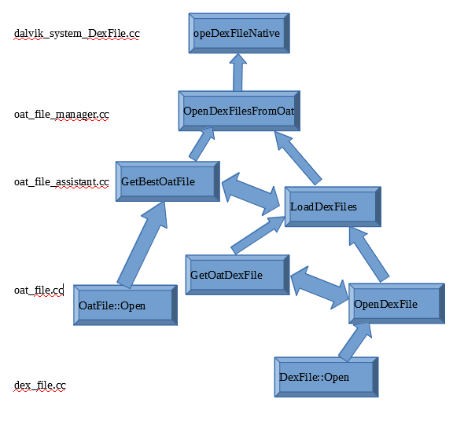
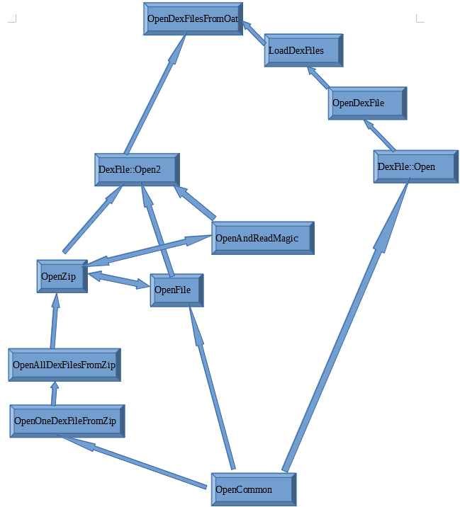

# 菜鸟学8.1版本dex加载流程笔记

# 第一篇：oat_file_manager与oat_file_assistant

菜鸟最近初学脱壳，必须得先搞明白dex的加载流程。n6装的8.1，最近跟了一遍8.1源码，记录笔记，理解一下类似opencommon的脱壳点

网上的文章大都比较老了，参考这篇6.0的加载https://www.jianshu.com/p/20dcfcf27004

新版本多走了 oat_file_manager.cc ，oat_file_assistant.cc这2个重要的类，

而没有去走linker，需要重新跟一次，在调试一遍才能搞明白整个流程。java层肯定走classloader，最终调用了dalvik_system_DexFile.cc的opeDexFileNative，进入so层，从这里开始分析

先放个简要流程，源码分别在dalvik_system_DexFile.cc ，oat_file_manager.cc ，oat_file_assistant.cc，oat_file.cc，dex_file.cc里，大致就是先得到Oat，通过Oat得到 OatDexFile，在通过 OatDexFile得到 DexFile

```
opeDexFileNative    dalvik_system_DexFile.cc 
{
  OpenDexFilesFromOat    oat_file_manager.cc 
  {
   GetBestOatFile     oat_file_assistant.cc
    {
      OatFile::Open    oat_file.cc
    }
   LoadDexFiles     oat_file_assistant.cc
    {
      GetOatDexFile(得到上面open的OatFile的OatDexFile)oat_file.cc
    OpenDexFile                   oat_file.cc
       {
      DexFile::Open           dex_file.cc
       } 
    }
  }
}
```

下面开始一步一步分析


1.首先是dalvik_system_DexFile.cc的opeDexFileNative

关键是这一句

dex_files = runtime->GetOatFileManager().OpenDexFilesFromOat(sourceName.c_str(),class_loader,dex_elements,/*out*/ &oat_file,/*out*/ &error_msgs);

与之前如6.0不同， OpenDexFilesFromOat 这个函数放在了 oat_file_manager.cc 而不是class_linker.cc

```
static jobject DexFile_openDexFileNative(JNIEnv* env,
                                         jclass,
                                         jstring javaSourceName,
                                         jstring javaOutputName ATTRIBUTE_UNUSED,
                                         jint flags ATTRIBUTE_UNUSED,
                                         jobject class_loader,
                                         jobjectArray dex_elements) {
  ScopedUtfChars sourceName(env, javaSourceName);
  if (sourceName.c_str() == nullptr) {
    return 0;
  }
 
  Runtime* const runtime = Runtime::Current();
  ClassLinker* linker = runtime->GetClassLinker(); //获得linker
  std::vector<std::unique_ptr<const DexFile>> dex_files;
  std::vector<std::string> error_msgs;
  const OatFile* oat_file = nullptr;
 
  dex_files = runtime->GetOatFileManager().OpenDexFilesFromOat(sourceName.c_str(),
                                                               class_loader,
                                                               dex_elements,
                                                               /*out*/ &oat_file,
                                                               /*out*/ &error_msgs);//这句调用OpenDexFilesFromOat获得dex_files
 
  if (!dex_files.empty()) {
    jlongArray array = ConvertDexFilesToJavaArray(env, oat_file, dex_files);//这句把DexFiles转化为JavaArray，方便java层使用
    if (array == nullptr) {
      ScopedObjectAccess soa(env);
      for (auto& dex_file : dex_files) {
        if (linker->IsDexFileRegistered(soa.Self(), *dex_file)) {  //这里linker只用来判断dex_file是不是已经存在，跟以前版本不同，需要注意一下
          dex_file.release();
        }
      }
    }
    return array;
  } else {
    ScopedObjectAccess soa(env);
    CHECK(!error_msgs.empty());
    // The most important message is at the end. So set up nesting by going forward, which will
    // wrap the existing exception as a cause for the following one.
    auto it = error_msgs.begin();
    auto itEnd = error_msgs.end();
    for ( ; it != itEnd; ++it) {
      ThrowWrappedIOException("%s", it->c_str());
    }
 
    return nullptr;
  }
}
```

2.进入oat_file_manager.cc的 OpenDexFilesFromOat

2.1,先通过：std::unique_ptr<const OatFile> oat_file(oat_file_assistant.GetBestOatFile().release())这句获得了oat_file，

2.2然后通过：dex_files = oat_file_assistant.LoadDexFiles(*source_oat_file, dex_location)这里通过加载source_oat_file获得dex_files

2.3如果上面2.1与2.2不成立：DexFile::Open(dex_location, dex_location, kVerifyChecksum, /*out*/ &error_msg, &dex_files)) //如果LoadDexFiles上面没有获得dex_files，直接DexFile::Open打开加载原始的dexfile

```
std::vector<std::unique_ptr<const DexFile>> OatFileManager::OpenDexFilesFromOat(
    const char* dex_location,
    jobject class_loader,
    jobjectArray dex_elements,
    const OatFile** out_oat_file,
    std::vector<std::string>* error_msgs) {
  ScopedTrace trace(__FUNCTION__);
  CHECK(dex_location != nullptr);
  CHECK(error_msgs != nullptr);
 
  // Verify we aren't holding the mutator lock, which could starve GC if we
  // have to generate or relocate an oat file.
  Thread* const self = Thread::Current();
  Locks::mutator_lock_->AssertNotHeld(self);
  Runtime* const runtime = Runtime::Current();
 
  OatFileAssistant oat_file_assistant(dex_location,
                                      kRuntimeISA,
                                      !runtime->IsAotCompiler());
 
  // Lock the target oat location to avoid races generating and loading the
  // oat file.
  std::string error_msg;
  if (!oat_file_assistant.Lock(/*out*/&error_msg)) {
    // Don't worry too much if this fails. If it does fail, it's unlikely we
    // can generate an oat file anyway.
    VLOG(class_linker) << "OatFileAssistant::Lock: " << error_msg;
  }
 
  const OatFile* source_oat_file = nullptr;
 
  if (!oat_file_assistant.IsUpToDate()) {
    // Update the oat file on disk if we can, based on the --compiler-filter
    // option derived from the current runtime options.
    // This may fail, but that's okay. Best effort is all that matters here.
    switch (oat_file_assistant.MakeUpToDate(/*profile_changed*/false, /*out*/ &error_msg)) {
      case OatFileAssistant::kUpdateFailed:
        LOG(WARNING) << error_msg;
        break;
 
      case OatFileAssistant::kUpdateNotAttempted:
        // Avoid spamming the logs if we decided not to attempt making the oat
        // file up to date.
        VLOG(oat) << error_msg;
        break;
 
      case OatFileAssistant::kUpdateSucceeded:
        // Nothing to do.
        break;
    }
  }
 
  // Get the oat file on disk.
  std::unique_ptr<const OatFile> oat_file(oat_file_assistant.GetBestOatFile().release());//这句获得了oat_file，下面LoadDexFiles使用这个oat_file获得dex_files
 
  if (oat_file != nullptr) {
    // Take the file only if it has no collisions, or we must take it because of preopting.
    bool accept_oat_file =
        !HasCollisions(oat_file.get(), class_loader, dex_elements, /*out*/ &error_msg);
    if (!accept_oat_file) {
      // Failed the collision check. Print warning.
      if (Runtime::Current()->IsDexFileFallbackEnabled()) {
        if (!oat_file_assistant.HasOriginalDexFiles()) {
          // We need to fallback but don't have original dex files. We have to
          // fallback to opening the existing oat file. This is potentially
          // unsafe so we warn about it.
          accept_oat_file = true;
 
          LOG(WARNING) << "Dex location " << dex_location << " does not seem to include dex file. "
                       << "Allow oat file use. This is potentially dangerous.";
        } else {
          // We have to fallback and found original dex files - extract them from an APK.
          // Also warn about this operation because it's potentially wasteful.
          LOG(WARNING) << "Found duplicate classes, falling back to extracting from APK : "
                       << dex_location;
          LOG(WARNING) << "NOTE: This wastes RAM and hurts startup performance.";
        }
      } else {
        // TODO: We should remove this. The fact that we're here implies -Xno-dex-file-fallback
        // was set, which means that we should never fallback. If we don't have original dex
        // files, we should just fail resolution as the flag intended.
        if (!oat_file_assistant.HasOriginalDexFiles()) {
          accept_oat_file = true;
        }
 
        LOG(WARNING) << "Found duplicate classes, dex-file-fallback disabled, will be failing to "
                        " load classes for " << dex_location;
      }
 
      LOG(WARNING) << error_msg;
    }
 
    if (accept_oat_file) {
      VLOG(class_linker) << "Registering " << oat_file->GetLocation();
      source_oat_file = RegisterOatFile(std::move(oat_file));//这里把oat_file注册给source_oat_file
      *out_oat_file = source_oat_file;
    }
  }
 
  std::vector<std::unique_ptr<const DexFile>> dex_files;
 
  // Load the dex files from the oat file.
  if (source_oat_file != nullptr) {
    bool added_image_space = false;
    if (source_oat_file->IsExecutable()) {
      std::unique_ptr<gc::space::ImageSpace> image_space =
          kEnableAppImage ? oat_file_assistant.OpenImageSpace(source_oat_file) : nullptr;
      if (image_space != nullptr) {
        ScopedObjectAccess soa(self);
        StackHandleScope<1> hs(self);
        Handle<mirror::ClassLoader> h_loader(
            hs.NewHandle(soa.Decode<mirror::ClassLoader>(class_loader)));
        // Can not load app image without class loader.
        if (h_loader != nullptr) {
          std::string temp_error_msg;
          // Add image space has a race condition since other threads could be reading from the
          // spaces array.
          {
            ScopedThreadSuspension sts(self, kSuspended);
            gc::ScopedGCCriticalSection gcs(self,
                                            gc::kGcCauseAddRemoveAppImageSpace,
                                            gc::kCollectorTypeAddRemoveAppImageSpace);
            ScopedSuspendAll ssa("Add image space");
            runtime->GetHeap()->AddSpace(image_space.get());
          }
          {
            ScopedTrace trace2(StringPrintf("Adding image space for location %s", dex_location));
            added_image_space = runtime->GetClassLinker()->AddImageSpace(image_space.get(),
                                                                         h_loader,
                                                                         dex_elements,
                                                                         dex_location,
                                                                         /*out*/&dex_files,
                                                                         /*out*/&temp_error_msg);//最终通过AddImageSpace在堆中分配了dex_elements，dex_files等的空间
          }
          if (added_image_space) {
            // Successfully added image space to heap, release the map so that it does not get
            // freed.
            image_space.release();
          } else {
            LOG(INFO) << "Failed to add image file " << temp_error_msg;
            dex_files.clear();
            {
              ScopedThreadSuspension sts(self, kSuspended);
              gc::ScopedGCCriticalSection gcs(self,
                                              gc::kGcCauseAddRemoveAppImageSpace,
                                              gc::kCollectorTypeAddRemoveAppImageSpace);
              ScopedSuspendAll ssa("Remove image space");
              runtime->GetHeap()->RemoveSpace(image_space.get());
            }
            // Non-fatal, don't update error_msg.
          }
        }
      }
    }
    if (!added_image_space) {
      DCHECK(dex_files.empty());
      dex_files = oat_file_assistant.LoadDexFiles(*source_oat_file, dex_location);//这里通过加载source_oat_file获得dex_files
    }
    if (dex_files.empty()) {
      error_msgs->push_back("Failed to open dex files from " + source_oat_file->GetLocation());
    }
  }
 
  // Fall back to running out of the original dex file if we couldn't load any
  // dex_files from the oat file.
  if (dex_files.empty()) {
    if (oat_file_assistant.HasOriginalDexFiles()) {
      if (Runtime::Current()->IsDexFileFallbackEnabled()) {
        static constexpr bool kVerifyChecksum = true;
        if (!DexFile::Open(
            dex_location, dex_location, kVerifyChecksum, /*out*/ &error_msg, &dex_files)) {//如果LoadDexFiles上面没有获得dex_files，直接DexFile::Open打开加载原始的dexfile
          LOG(WARNING) << error_msg;
          error_msgs->push_back("Failed to open dex files from " + std::string(dex_location)
                                + " because: " + error_msg);
        }
      } else {
        error_msgs->push_back("Fallback mode disabled, skipping dex files.");
      }
    } else {
      error_msgs->push_back("No original dex files found for dex location "
          + std::string(dex_location));
    }
  }
 
  return dex_files;
}
```

3.进入oat_file_assistant.cc的GetBestOatFile与LoadDexFiles

先看 GetBestOatFile ，当OatFileAssistant初始化status时Status构造函数通过GetFile调用OatFile::Open打开oatfile

```
std::unique_ptr<OatFile> OatFileAssistant::GetBestOatFile() {
  return GetBestInfo().ReleaseFileForUse();
}
 
OatFileAssistant::OatFileInfo& OatFileAssistant::GetBestInfo() {
  // TODO(calin): Document the side effects of class loading when
  // running dalvikvm command line.
  if (dex_parent_writable_) {
    // If the parent of the dex file is writable it means that we can
    // create the odex file. In this case we unconditionally pick the odex
    // as the best oat file. This corresponds to the regular use case when
    // apps gets installed or when they load private, secondary dex file.
    // For apps on the system partition the odex location will not be
    // writable and thus the oat location might be more up to date.
    return odex_;
  }
 
  // We cannot write to the odex location. This must be a system app.
 
  // If the oat location is usable take it.
  if (oat_.IsUseable()) {
    return oat_;
  }
 
  // The oat file is not usable but the odex file might be up to date.
  // This is an indication that we are dealing with an up to date prebuilt
  // (that doesn't need relocation).
  if (odex_.Status() == kOatUpToDate) {
    return odex_;
  }
 
  // The oat file is not usable and the odex file is not up to date.
  // However we have access to the original dex file which means we can make
  // the oat location up to date.
  if (HasOriginalDexFiles()) {
    return oat_;
  }
 
  // We got into the worst situation here:
  // - the oat location is not usable
  // - the prebuild odex location is not up to date
  // - and we don't have the original dex file anymore (stripped).
  // Pick the odex if it exists, or the oat if not.
  return (odex_.Status() == kOatCannotOpen) ? oat_ : odex_;
}
 
OatFileAssistant::OatStatus OatFileAssistant::OatFileInfo::Status() {
  if (!status_attempted_) {
    status_attempted_ = true;
    const OatFile* file = GetFile();
    if (file == nullptr) {
      // Check to see if there is a vdex file we can make use of.
      std::string error_msg;
      std::string vdex_filename = GetVdexFilename(filename_);
      std::unique_ptr<VdexFile> vdex = VdexFile::Open(vdex_filename,
                                                      /*writeable*/false,
                                                      /*low_4gb*/false,
                                                      /*unquicken*/false,
                                                      &error_msg);//这里在Status中先打开vdex，vdex也是版本新增的，可以加快启动速度
      if (vdex == nullptr) {
        status_ = kOatCannotOpen;
        VLOG(oat) << "unable to open vdex file " << vdex_filename << ": " << error_msg;
      } else {
        if (oat_file_assistant_->DexChecksumUpToDate(*vdex, &error_msg)) {
          // The vdex file does not contain enough information to determine
          // whether it is up to date with respect to the boot image, so we
          // assume it is out of date.
          VLOG(oat) << error_msg;
          status_ = kOatBootImageOutOfDate;
        } else {
          status_ = kOatDexOutOfDate;
        }
      }
    } else {
      status_ = oat_file_assistant_->GivenOatFileStatus(*file);
      VLOG(oat) << file->GetLocation() << " is " << status_
          << " with filter " << file->GetCompilerFilter();
    }
  }
  return status_;
}
 
const OatFile* OatFileAssistant::OatFileInfo::GetFile() {
  CHECK(!file_released_) << "GetFile called after oat file released.";
  if (!load_attempted_) {
    load_attempted_ = true;
    if (filename_provided_) {
      std::string error_msg;
      file_.reset(OatFile::Open(filename_.c_str(),
                                filename_.c_str(),
                                nullptr,
                                nullptr,
                                oat_file_assistant_->load_executable_,
                                /*low_4gb*/false,
                                oat_file_assistant_->dex_location_.c_str(),
                                &error_msg));
      if (file_.get() == nullptr) {
        VLOG(oat) << "OatFileAssistant test for existing oat file "
          << filename_ << ": " << error_msg;
      }
    }
  }
  return file_.get();
}
```

再看LoadDexFiles ，先通过GetOatDexFile得到上面open的OatFile的OatDexFile，在通过OpenDexFile打开获得OatDexFile的 DexFile，这里如果有多个dex，会通过for循环获得多个dex_file，组装出 dex_files。

```
std::vector<std::unique_ptr<const DexFile>> OatFileAssistant::LoadDexFiles(
    const OatFile& oat_file, const char* dex_location) {
  std::vector<std::unique_ptr<const DexFile>> dex_files;
 
  // Load the main dex file.
  std::string error_msg;
  const OatFile::OatDexFile* oat_dex_file = oat_file.GetOatDexFile(
      dex_location, nullptr, &error_msg);//这句oat_file通过获得oat_dex_file
  if (oat_dex_file == nullptr) {
    LOG(WARNING) << error_msg;
    return std::vector<std::unique_ptr<const DexFile>>();
  }
 
  std::unique_ptr<const DexFile> dex_file = oat_dex_file->OpenDexFile(&error_msg);//通过oat_dex_file获得dex_file
  if (dex_file.get() == nullptr) {
    LOG(WARNING) << "Failed to open dex file from oat dex file: " << error_msg;
    return std::vector<std::unique_ptr<const DexFile>>();
  }
  dex_files.push_back(std::move(dex_file));//把dex_file放入dex_files
 
  // Load the rest of the multidex entries
  for (size_t i = 1; ; i++) {
    std::string multidex_dex_location = DexFile::GetMultiDexLocation(i, dex_location);
    oat_dex_file = oat_file.GetOatDexFile(multidex_dex_location.c_str(), nullptr);//如果不是一个dex，通过循环加载其他的oat_dex_file
    if (oat_dex_file == nullptr) {
      // There are no more multidex entries to load.
      break;
    }
 
    dex_file = oat_dex_file->OpenDexFile(&error_msg);//通过oat_dex_file的OpenDexFile获得其余dex_file
    if (dex_file.get() == nullptr) {
      LOG(WARNING) << "Failed to open dex file from oat dex file: " << error_msg;
      return std::vector<std::unique_ptr<const DexFile>>();
    }
    dex_files.push_back(std::move(dex_file));//把multidex放入dex_files
  }
  return dex_files;
}
```

4.再往下，就是OatFile::Open，GetOatDexFile 和OpenDexFile，这3个函数就进入了 oat_file.cc中， OatFile::Open打开oat_file比较复杂，我们下一篇在分析，假设它很愉快完成了，得到了 oat_file ，后面通过 GetOatDexFile操作它得到 oat_dex_file，在通过 OpenDexFile操作 OatDexFile最终获得 dex_file返回。这三个类互相关联， OatFile包含 OatDexFile包含 DexFile，阅读 oat_file.cc源码可以搞明白他们的数据结构差异。

4.1先看 OatFile::Open ，先试图通过OatFileBase::OpenOatFile<DlOpenOatFile> oat_file ，我们知道art分为quick和portable两中优化模式，这里先假设他是portable尝试打开oat，失败就通过OatFileBase::OpenOatFile<ElfOatFile>打开 oat_file ，这就是quick模式了，和5.0以前版本的先判断quick还是portable模式在选择函数不太一样。oat文件的加载 就在这个OpenOatFile 函数中，下一篇我们重点分析oat加载流程

```
OatFile* OatFile::Open(const std::string& oat_filename,
                       const std::string& oat_location,
                       uint8_t* requested_base,
                       uint8_t* oat_file_begin,
                       bool executable,
                       bool low_4gb,
                       const char* abs_dex_location,
                       std::string* error_msg) {
  ScopedTrace trace("Open oat file " + oat_location);
  CHECK(!oat_filename.empty()) << oat_location;
  CheckLocation(oat_location);
 
  std::string vdex_filename = GetVdexFilename(oat_filename);//首先获得vdex的信息
 
  // Check that the files even exist, fast-fail.
  if (kIsVdexEnabled && !OS::FileExists(vdex_filename.c_str())) {
    *error_msg = StringPrintf("File %s does not exist.", vdex_filename.c_str());
    return nullptr;
  } else if (!OS::FileExists(oat_filename.c_str())) {
    *error_msg = StringPrintf("File %s does not exist.", oat_filename.c_str());
    return nullptr;
  }
 
  // Try dlopen first, as it is required for native debuggability. This will fail fast if dlopen is
  // disabled.
  OatFile* with_dlopen = OatFileBase::OpenOatFile<DlOpenOatFile>(vdex_filename,
                                                                 oat_filename,
                                                                 oat_location,
                                                                 requested_base,
                                                                 oat_file_begin,
                                                                 false /* writable */,
                                                                 executable,
                                                                 low_4gb,
                                                                 abs_dex_location,
                                                                 error_msg);//先试图通过OatFileBase::OpenOatFile<DlOpenOatFile>打开OatFile，我们知道art分为quick和portable两中优化模式，这里先假设他是portable尝试打开oat
  if (with_dlopen != nullptr) {
    return with_dlopen;
  }
  if (kPrintDlOpenErrorMessage) {
    LOG(ERROR) << "Failed to dlopen: " << oat_filename << " with error " << *error_msg;
  }
  // If we aren't trying to execute, we just use our own ElfFile loader for a couple reasons:
  //
  // On target, dlopen may fail when compiling due to selinux restrictions on installd.
  //
  // We use our own ELF loader for Quick to deal with legacy apps that
  // open a generated dex file by name, remove the file, then open
  // another generated dex file with the same name. http://b/10614658
  //
  // On host, dlopen is expected to fail when cross compiling, so fall back to OpenElfFile.
  //
  //
  // Another independent reason is the absolute placement of boot.oat. dlopen on the host usually
  // does honor the virtual address encoded in the ELF file only for ET_EXEC files, not ET_DYN.
  OatFile* with_internal = OatFileBase::OpenOatFile<ElfOatFile>(vdex_filename,
                                                                oat_filename,
                                                                oat_location,
                                                                requested_base,
                                                                oat_file_begin,
                                                                false /* writable */,
                                                                executable,
                                                                low_4gb,
                                                                abs_dex_location,
                                                                error_msg);//上面尝试不成功，就通过OatFileBase::OpenOatFile<ElfOatFile>打开oat，这就是quick模式了，和以前版本加载方式不大一样，以前是先判断quick还是portable模式在选择函数。
  return with_internal;
}
 
OatFile* OatFile::OpenWritable(File* file,
                               const std::string& location,
                               const char* abs_dex_location,
                               std::string* error_msg) {
  CheckLocation(location);
  return ElfOatFile::OpenElfFile(file,
                                 location,
                                 nullptr,
                                 nullptr,
                                 true,
                                 false,
                                 /*low_4gb*/false,
                                 abs_dex_location,
                                 error_msg);
}
```

4.2后面 GetOatDexFile 通过key也就是dex_location在oat_dex_files_map里查询，从oat_file里找到oat_dex_file，这里的oat_dex_files_这个map是oat_file初始化时在setup函数中生成的，具体要看oat文件加载过程

```
const OatFile::OatDexFile* OatFile::GetOatDexFile(const char* dex_location,
                                                  const uint32_t* dex_location_checksum,
                                                  std::string* error_msg) const {
  // NOTE: We assume here that the canonical location for a given dex_location never
  // changes. If it does (i.e. some symlink used by the filename changes) we may return
  // an incorrect OatDexFile. As long as we have a checksum to check, we shall return
  // an identical file or fail; otherwise we may see some unpredictable failures.
 
  // TODO: Additional analysis of usage patterns to see if this can be simplified
  // without any performance loss, for example by not doing the first lock-free lookup.
 
  const OatFile::OatDexFile* oat_dex_file = nullptr;
  StringPiece key(dex_location);
  // Try to find the key cheaply in the oat_dex_files_ map which holds dex locations
  // directly mentioned in the oat file and doesn't require locking.
  auto primary_it = oat_dex_files_.find(key);//通过key也就是dex_location在oat_dex_files_ map里查询，从oat_file里找到oat_dex_file，这里的oat_dex_files_这个map是oat_file初始化时在setup函数中生成的，具体要看oat文件加载过程    
// Add the location and canonical location (if different) to the oat_dex_files_ table.
//    StringPiece key(oat_dex_file->GetDexFileLocation());
 //   oat_dex_files_.Put(key, oat_dex_file);
 
  if (primary_it != oat_dex_files_.end()) {//下面几个if是判断其他特殊情况，处理异常的，比如dex_location不是唯一，dex_location没有找到如何加载和报错
    oat_dex_file = primary_it->second;
    DCHECK(oat_dex_file != nullptr);
  } else {
    // This dex_location is not one of the dex locations directly mentioned in the
    // oat file. The correct lookup is via the canonical location but first see in
    // the secondary_oat_dex_files_ whether we've looked up this location before.
    MutexLock mu(Thread::Current(), secondary_lookup_lock_);
    auto secondary_lb = secondary_oat_dex_files_.lower_bound(key);
    if (secondary_lb != secondary_oat_dex_files_.end() && key == secondary_lb->first) {
      oat_dex_file = secondary_lb->second;  // May be null.
    } else {
      // We haven't seen this dex_location before, we must check the canonical location.
      std::string dex_canonical_location = DexFile::GetDexCanonicalLocation(dex_location);//如果没有找到dex_location，这里会根据绝对路径重新加载dex
      if (dex_canonical_location != dex_location) {
        StringPiece canonical_key(dex_canonical_location);
        auto canonical_it = oat_dex_files_.find(canonical_key);
        if (canonical_it != oat_dex_files_.end()) {
          oat_dex_file = canonical_it->second;
        }  // else keep null.
      }  // else keep null.
 
      // Copy the key to the string_cache_ and store the result in secondary map.
      string_cache_.emplace_back(key.data(), key.length());
      StringPiece key_copy(string_cache_.back());
      secondary_oat_dex_files_.PutBefore(secondary_lb, key_copy, oat_dex_file);//这里把根据绝对路径重新加载的dex信息放入secondary map，以便下次使用
    }
  }
 
  if (oat_dex_file == nullptr) {
    if (error_msg != nullptr) {
      std::string dex_canonical_location = DexFile::GetDexCanonicalLocation(dex_location);
      *error_msg = "Failed to find OatDexFile for DexFile " + std::string(dex_location)
          + " (canonical path " + dex_canonical_location + ") in OatFile " + GetLocation();
    }
    return nullptr;
  }
 
  if (dex_location_checksum != nullptr &&
      oat_dex_file->GetDexFileLocationChecksum() != *dex_location_checksum) {
    if (error_msg != nullptr) {
      std::string dex_canonical_location = DexFile::GetDexCanonicalLocation(dex_location);
      std::string checksum = StringPrintf("0x%08x", oat_dex_file->GetDexFileLocationChecksum());
      std::string required_checksum = StringPrintf("0x%08x", *dex_location_checksum);
      *error_msg = "OatDexFile for DexFile " + std::string(dex_location)
          + " (canonical path " + dex_canonical_location + ") in OatFile " + GetLocation()
          + " has checksum " + checksum + " but " + required_checksum + " was required";
    }
    return nullptr;
  }
  return oat_dex_file;
}
```

4.3通过GetOatDexFile 获得 oat_file 里的oat_dex_file后，就可以调用OpenDexFile获得 oat_dex_file 存储的 dex_file的信息了，这里就走到了dex_file.cc文件里的DexFile::Open这个关键函数，而这个 DexFile::Open 最终调用了OpenCommon这个关键函数，这里就是我们常用的一个脱壳函数，下一篇分析 DexFile::Open 下层的函数，就可以搞明白大佬们为什么hook OpenCommon 和OpenAndReadMagic来脱整体的dex加固

```
std::unique_ptr<const DexFile> OatFile::OatDexFile::OpenDexFile(std::string* error_msg) const {
  ScopedTrace trace(__PRETTY_FUNCTION__);
  static constexpr bool kVerify = false;
  static constexpr bool kVerifyChecksum = false;
  return DexFile::Open(dex_file_pointer_,
                       FileSize(),
                       dex_file_location_,
                       dex_file_location_checksum_,
                       this,
                       kVerify,
                       kVerifyChecksum,
                       error_msg);
}
```

总结一下，时间仓促，有些注释可能有点错误，有些细节实现我也没仔细看，希望大家指出我的错误我好努力改进，在libre里画个及其丑陋的图辅助自己理解，箭头指向被调用的函数，双向箭头两个函数再同一个上层函数里先后调用，从opeDexFileNative最终调用到了OatFile::Open与DexFile::Open ，前者获得oat_file,，后者通过获得的oat_file得数据结构获得的 oat_dex_file的数据结构获得dex_file，下一篇菜鸟整理一下这2个函数是如何获得 oat_file与 oat_dex_file并加载到内存中的。




# 第二篇:DexFile::Open流程与简单脱壳原理

url：https://bbs.pediy.com/thread-257917.htm


菜鸟刚刚学完了 dex_file.cc这个源码，大致搞明白了大佬们hook脱整体加固的原理了，原理在帖子最后
学习了大佬 angelToms 的帖子https://bbs.pediy.com/thread-252828.htm与https://bbs.pediy.com/thread-252284.htm，总结的很清晰，dex 加载到内存之后，只要想方设法找到 DexFile的实例，就可以通过它的数据结构搞出整体加固的dex了，下面我们看下 dex_file.cc 的源码，顺便理解下初步脱壳的基本原理。还是先贴一下流程。

```
DexFile::Open(OpenDexFilesFromOat里，通过oatfile获得dexfile走这个) 
{
 OpenCommon
}
 
DexFile::Open (OpenDexFilesFromOat里，通过oatfile获得dexfile失败，直接打开源dex获得dexfile走这个 )
{
 OpenAndReadMagic
 if zip
  OpenZip
  {
   OpenAllDexFilesFromZip
   {
    OpenOneDexFileFromZip
    {
     OpenCommon
    }
   }
  }
 else dex
  OpenFile
   {
    OpenCommon
   }
}
```

1.先看DexFile::Open，看一下头文件，它在源码中有好几个重载函数 ，

第一个是OpenDexFilesFromOat里，通过oatfile获得dexfile成功的调用，看OpenDexFile函数中DexFile::Open的参数可以判断；

第三个是OpenDexFilesFromOat里，通过oatfile获得dexfile失败后，直接打开源dex的调用，看 OpenDexFilesFromOat 函数最后的DexFile::Open的参数可以判断

```
static std::unique_ptr<const DexFile> Open(const uint8_t* base,
                                             size_t size,
                                             const std::string& location,
                                             uint32_t location_checksum,
                                             const OatDexFile* oat_dex_file,
                                             bool verify,
                                             bool verify_checksum,
                                             std::string* error_msg);//这是OpenDexFilesFromOat里，通过oatfile获得dexfile走这个，看OpenDexFile函数中DexFile::Open的参数可以判断，不清楚的去看下上一篇
 
  // Opens .dex file that has been memory-mapped by the caller.
  static std::unique_ptr<const DexFile> Open(const std::string& location,
                                             uint32_t location_checkum,
                                             std::unique_ptr<MemMap> mem_map,
                                             bool verify,
                                             bool verify_checksum,
                                             std::string* error_msg);//这是打开已经被调用者memory-mapped过的
 
  // Opens all .dex files found in the file, guessing the container format based on file extension.
  static bool Open(const char* filename,
                   const std::string& location,
                   bool verify_checksum,
                   std::string* error_msg,
                   std::vector<std::unique_ptr<const DexFile>>* dex_files);//这是OpenDexFilesFromOat里，通过oatfile获得dexfile失败，直接打开源dex走这个，看OpenDexFilesFromOat函数中DexFile::Open的参数可以判断

```

1.1这里还是把 OpenDexFilesFromOat 这个函数贴一下，具体代码看前一篇

```
std::vector<std::unique_ptr<const DexFile>> OatFileManager::OpenDexFilesFromOat(
    const char* dex_location,
    jobject class_loader,
    jobjectArray dex_elements,
    const OatFile** out_oat_file,
    std::vector<std::string>* error_msgs) {
。。。
  
  // Get the oat file on disk.
  std::unique_ptr<const OatFile> oat_file(oat_file_assistant.GetBestOatFile().release());//这句获得了oat_file，下面LoadDexFiles使用这个oat_file获得dex_files
  
 。。。
    if (accept_oat_file) {
      VLOG(class_linker) << "Registering " << oat_file->GetLocation();
      source_oat_file = RegisterOatFile(std::move(oat_file));//这里把oat_file注册给source_oat_file
      *out_oat_file = source_oat_file;
    }
  }
  
  std::vector<std::unique_ptr<const DexFile>> dex_files;
  
  // Load the dex files from the oat file.
  。。。
      dex_files = oat_file_assistant.LoadDexFiles(*source_oat_file, dex_location);//这里通过加载source_oat_file获得dex_files，最终调用了DexFile::Open，这里的DexFile::Open是一个重载
  。。。
  // Fall back to running out of the original dex file if we couldn't load any
  // dex_files from the oat file.
  if (dex_files.empty()) {
    if (oat_file_assistant.HasOriginalDexFiles()) {
      if (Runtime::Current()->IsDexFileFallbackEnabled()) {
        static constexpr bool kVerifyChecksum = true;
        if (!DexFile::Open(
            dex_location, dex_location, kVerifyChecksum, /*out*/ &error_msg, &dex_files)) {//如果LoadDexFiles上面没有获得dex_files，直接DexFile::Open打开加载原始的dexfile，这里的DexFile::Open是另一个重载
          LOG(WARNING) << error_msg;
          error_msgs->push_back("Failed to open dex files from " + std::string(dex_location)
                                + " because: " + error_msg);
        }
  。。。
  
  return dex_files;
}
```

1.2这个就是走oatfile获得dexfile路径的DexFile::Open，没啥花样，直接调用OpenCommon

```
bool DexFile::Open(const char* filename,
                   const std::string& location,
                   bool verify_checksum,
                   std::string* error_msg,
                   std::vector<std::unique_ptr<const DexFile>>* dex_files) {
  ScopedTrace trace(std::string("Open dex file ") + std::string(location));
  DCHECK(dex_files != nullptr) << "DexFile::Open: out-param is nullptr";
  uint32_t magic;
  File fd = OpenAndReadMagic(filename, &magic, error_msg);//OpenAndReadMagic也是一个常用脱壳点，如果不是直接打开dex走这个函数，不会在这里被调用
  if (fd.Fd() == -1) {
    DCHECK(!error_msg->empty());
    return false;
  }
  if (IsZipMagic(magic)) {
    return DexFile::OpenZip(fd.Release(), location, verify_checksum, error_msg, dex_files);//如果是Zip，调用DexFile::OpenZip
  }
  if (IsDexMagic(magic)) {
    std::unique_ptr<const DexFile> dex_file(DexFile::OpenFile(fd.Release(),
                                                              location,
                                                              /* verify */ true,
                                                              verify_checksum,
                                                              error_msg));//如果是Dex，调用DexFile::OpenFile
    if (dex_file.get() != nullptr) {
      dex_files->push_back(std::move(dex_file));
      return true;
    } else {
      return false;
    }
  }
  *error_msg = StringPrintf("Expected valid zip or dex file: '%s'", filename);
  return false;
}
```

2.1先看OpenZip的逻辑，先通过fd文件描述符获得ZipArchive指针，在使用这个指针调用了OpenAllDexFilesFromZip处理 ZipArchive

```
bool DexFile::OpenZip(int fd,
                      const std::string& location,
                      bool verify_checksum,
                      std::string* error_msg,
                      std::vector<std::unique_ptr<const DexFile>>* dex_files) {
  ScopedTrace trace("Dex file open Zip " + std::string(location));
  DCHECK(dex_files != nullptr) << "DexFile::OpenZip: out-param is nullptr";
  std::unique_ptr<ZipArchive> zip_archive(ZipArchive::OpenFromFd(fd, location.c_str(), error_msg));
  if (zip_archive.get() == nullptr) {
    DCHECK(!error_msg->empty());
    return false;
  }
  return DexFile::OpenAllDexFilesFromZip(*zip_archive,
                                         location,
                                         verify_checksum,
                                         error_msg,
                                         dex_files);
}
```

2.2再看 OpenAllDexFilesFromZip ，调用了OpenOneDexFileFromZip，因为可能有多个dex，依次打开

```
bool DexFile::OpenAllDexFilesFromZip(const ZipArchive& zip_archive,
                                     const std::string& location,
                                     bool verify_checksum,
                                     std::string* error_msg,
                                     std::vector<std::unique_ptr<const DexFile>>* dex_files) {
  ScopedTrace trace("Dex file open from Zip " + std::string(location));
  DCHECK(dex_files != nullptr) << "DexFile::OpenFromZip: out-param is nullptr";
  ZipOpenErrorCode error_code;
  std::unique_ptr<const DexFile> dex_file(OpenOneDexFileFromZip(zip_archive,
                                                                kClassesDex,
                                                                location,
                                                                verify_checksum,
                                                                error_msg,
                                                                &error_code));
  if (dex_file.get() == nullptr) {
    return false;
  } else {
    // Had at least classes.dex.
    dex_files->push_back(std::move(dex_file));
 
    // Now try some more.
 
    // We could try to avoid std::string allocations by working on a char array directly. As we
    // do not expect a lot of iterations, this seems too involved and brittle.
 
    for (size_t i = 1; ; ++i) {
      std::string name = GetMultiDexClassesDexName(i);
      std::string fake_location = GetMultiDexLocation(i, location.c_str());
      std::unique_ptr<const DexFile> next_dex_file(OpenOneDexFileFromZip(zip_archive,
                                                                         name.c_str(),
                                                                         fake_location,
                                                                         verify_checksum,
                                                                         error_msg,
                                                                         &error_code));
      if (next_dex_file.get() == nullptr) {
        if (error_code != ZipOpenErrorCode::kEntryNotFound) {
          LOG(WARNING) << "Zip open failed: " << *error_msg;
        }
        break;
      } else {
        dex_files->push_back(std::move(next_dex_file));
      }
 
      if (i == kWarnOnManyDexFilesThreshold) {
        LOG(WARNING) << location << " has in excess of " << kWarnOnManyDexFilesThreshold
                     << " dex files. Please consider coalescing and shrinking the number to "
                        " avoid runtime overhead.";
      }
 
      if (i == std::numeric_limits<size_t>::max()) {
        LOG(ERROR) << "Overflow in number of dex files!";
        break;
      }
    }
 
    return true;
  }
}
```

2.3最后在OpenOneDexFileFromZip里最终也是调用了OpenCommon，殊途同归，最后都来到这个关键函数

```
std::unique_ptr<const DexFile> DexFile::OpenOneDexFileFromZip(const ZipArchive& zip_archive,
                                                              const char* entry_name,
                                                              const std::string& location,
                                                              bool verify_checksum,
                                                              std::string* error_msg,
                                                              ZipOpenErrorCode* error_code) {
  ScopedTrace trace("Dex file open from Zip Archive " + std::string(location));
  CHECK(!location.empty());
  std::unique_ptr<ZipEntry> zip_entry(zip_archive.Find(entry_name, error_msg));
  if (zip_entry == nullptr) {
    *error_code = ZipOpenErrorCode::kEntryNotFound;
    return nullptr;
  }
  if (zip_entry->GetUncompressedLength() == 0) {
    *error_msg = StringPrintf("Dex file '%s' has zero length", location.c_str());
    *error_code = ZipOpenErrorCode::kDexFileError;
    return nullptr;
  }
 
  std::unique_ptr<MemMap> map;
  if (zip_entry->IsUncompressed()) {
    if (!zip_entry->IsAlignedTo(alignof(Header))) {
      // Do not mmap unaligned ZIP entries because
      // doing so would fail dex verification which requires 4 byte alignment.
      LOG(WARNING) << "Can't mmap dex file " << location << "!" << entry_name << " directly; "
                   << "please zipalign to " << alignof(Header) << " bytes. "
                   << "Falling back to extracting file.";
    } else {
      // Map uncompressed files within zip as file-backed to avoid a dirty copy.
      map.reset(zip_entry->MapDirectlyFromFile(location.c_str(), /*out*/error_msg));
      if (map == nullptr) {
        LOG(WARNING) << "Can't mmap dex file " << location << "!" << entry_name << " directly; "
                     << "is your ZIP file corrupted? Falling back to extraction.";
        // Try again with Extraction which still has a chance of recovery.
      }
    }
  }
 
  if (map == nullptr) {
    // Default path for compressed ZIP entries,
    // and fallback for stored ZIP entries.
    map.reset(zip_entry->ExtractToMemMap(location.c_str(), entry_name, error_msg));
  }
 
  if (map == nullptr) {
    *error_msg = StringPrintf("Failed to extract '%s' from '%s': %s", entry_name, location.c_str(),
                              error_msg->c_str());
    *error_code = ZipOpenErrorCode::kExtractToMemoryError;
    return nullptr;
  }
  VerifyResult verify_result;
  std::unique_ptr<DexFile> dex_file = OpenCommon(map->Begin(),
                                                 map->Size(),
                                                 location,
                                                 zip_entry->GetCrc32(),
                                                 kNoOatDexFile,
                                                 /* verify */ true,
                                                 verify_checksum,
                                                 error_msg,
                                                 &verify_result);
  if (dex_file == nullptr) {
    if (verify_result == VerifyResult::kVerifyNotAttempted) {
      *error_code = ZipOpenErrorCode::kDexFileError;
    } else {
      *error_code = ZipOpenErrorCode::kVerifyError;
    }
    return nullptr;
  }
  dex_file->mem_map_ = std::move(map);
  if (!dex_file->DisableWrite()) {
    *error_msg = StringPrintf("Failed to make dex file '%s' read only", location.c_str());
    *error_code = ZipOpenErrorCode::kMakeReadOnlyError;
    return nullptr;
  }
  CHECK(dex_file->IsReadOnly()) << location;
  if (verify_result != VerifyResult::kVerifySucceeded) {
    *error_code = ZipOpenErrorCode::kVerifyError;
    return nullptr;
  }
  *error_code = ZipOpenErrorCode::kNoError;
  return dex_file;
}
```

3.最后我们认真分析OpenCommon这个函数，无论是通过oat_file获得的 oat_dex_file 获得 dex_file 也好，是直接打开zip或者dex文件获得 dex_file 也好，最终都得用到这个函数，所以它作为常用脱壳点的意义就很清楚了，它的前2个参数分别是dex的起始地址和大小，直接hook就可以dump出dex了。

其实只要有base地址，通过dex数据结构就可以定位size，加个偏移就行parseInt(base,16) + 0x20

```
std::unique_ptr<DexFile> DexFile::OpenCommon(const uint8_t* base,//这里是dex的开始
                                             size_t size,//这里是dex的大小
                                             const std::string& location,//这里是地址
                                             uint32_t location_checksum,
                                             const OatDexFile* oat_dex_file,//如果直接打开文件而不是通过oat文件获得dex，这个参数是kNoOatDexFile，hook打印这个参数就可以判断一些壳是否放弃了oat文件强制以dex解释运行
                                             bool verify,
                                             bool verify_checksum,
                                             std::string* error_msg,
                                             VerifyResult* verify_result) {
  if (verify_result != nullptr) {
    *verify_result = VerifyResult::kVerifyNotAttempted;
  }
  std::unique_ptr<DexFile> dex_file(new DexFile(base,
                                                size,
                                                location,
                                                location_checksum,
                                                oat_dex_file));//这里new了一个dex_file实例，至此dex_file加载结束
  if (dex_file == nullptr) {
    *error_msg = StringPrintf("Failed to open dex file '%s' from memory: %s", location.c_str(),
                              error_msg->c_str());
    return nullptr;
  }
  if (!dex_file->Init(error_msg)) {//init初始化
    dex_file.reset();
    return nullptr;
  }
  if (verify && !DexFileVerifier::Verify(dex_file.get(),
                                         dex_file->Begin(),
                                         dex_file->Size(),
                                         location.c_str(),
                                         verify_checksum,
                                         error_msg)) {//Verify验证
    if (verify_result != nullptr) {
      *verify_result = VerifyResult::kVerifyFailed;
    }
    return nullptr;
  }
  if (verify_result != nullptr) {
    *verify_result = VerifyResult::kVerifySucceeded;
  }
  return dex_file;
}
```

最后，仍然是画个及其丑陋的图，辅助自己理解。



4.下面贴一下frida hook脱壳脚本，很简单，每一步我都备注了，上次问我的同学仔细看一下，看看还有什么问题

```
/*  static std::unique_ptr<DexFile> OpenCommon(const uint8_t* base,
                                             size_t size,
                                             const std::string& location,
                                             uint32_t location_checksum,
                                             const OatDexFile* oat_dex_file,
                                             bool verify,
                                             bool verify_checksum,
                                             std::string* error_msg,
                                            VerifyResult* verify_result = nullptr); */
//这里我是安卓8.1的，不同版本不一样，自己pull出libart.so，打开ida查
var OpenCommon = Module.findExportByName("libart.so", "_ZN3art7DexFile10OpenCommonEPKhjRKNSt3__112basic_stringIcNS3_11char_traitsIcEENS3_9allocatorIcEEEEjPKNS_10OatDexFileEbbPS9_PNS0_12VerifyResultE");
console.log("[*] Opencommon method addr: " + OpenCommon);
Interceptor.attach(OpenCommon, {
    onEnter: function (args) {
        console.log("[*] begin = " + args[1]);//dex文件begin的地址
        console.log("[*] size = " + args[2]);//其实有了base就可以算出size了，这个参数不用也行，这里没有用
        var begin = args[1];
                console.log("magic : " + Memory.readUtf8String(begin)); //打印magic看下是不是dex
        var address = parseInt(begin,16) + 0x20;//通过begin计算size地址
        var dex_size = Memory.readInt(ptr(address));//读出size大小
        console.log("sizee : " + dex_size);//比较发现跟args[2]是一样的，证明有begin足够脱壳
        var dex_file = new File("/data/data/com.xxx.xxx/" + dex_size.toString() + ".dex", "wb");//这里自己修改下路径，最好放在apk自己的data目录下，不然以后找不着了
        dex_file.write(Memory.readByteArray(begin, dex_size));
        dex_file.flush();
        dex_file.close();
        console.log("dump dex success");
 
    },
    onLeave: function (retval) {
        //这里也可以通过retval获得dex_file，通过dex数据结构找到begin和size，dump出来     
    }
});
```

ps：菜鸟粗粗的阅读了下源码，又自己实践了一下，参考了Android万能脱壳机-- angelToms大佬的帖子https://bbs.pediy.com/thread-252284.htm，反思一下，如何做到对整体加固的脱壳，需要以下几个条件，以下纯属本人yy，大佬轻喷：

1.时机要对，一定要在dex完全加载到内存中才能完全脱下来(因为oat_file 包含dex_file，所以oat完全加载也可以，就是麻烦一点),如果在加载之前脱，脱出来的可能是壳，也可能是不完整的dex

2.脱壳最重要的就是dex文件的begin地址，拿到了这个地址，根据文件结构就可以找到size长度，就可以顺利的脱出来

3.只要脱壳时机对了，一切可以拿到 dex文件的begin地址 的地方都可以脱整体壳；

而 begin 存储在dex_file里， 所以一切可以拿到 dex_file 数据结构的地方都可以 脱整体壳 ；

而 dex_file 数据结构 存储在 oat_ dex_file 数据结构里， 所以一切可以拿到 oat_ dex_file 数据结构的地方都可以 脱整体壳 ；

而 oat_ dex_file 数据结构 存储在 oat_file 数据结构里， 所以一切可以拿到 oat_file 数据结构的地方都可以 脱整体壳

4.这个思路只能脱dex整体加固，抽取加固等菜鸟干完活，抽空阅读dex加载后类和方法的执行源码之后再看看能不能理解

5.下一篇菜鸟学习下oat文件加载的源码，再次增长自己的知识，争取靠大佬们更近一步


# 第三篇: OatFile::Open流程与OatDexFile的获得 

菜鸟最近破事比较多，磕磕绊绊总算把oat_file.cc大致流程看完了，论坛记录笔记方便以后查询

这个函数重点就是如何打开oat_file文件，然后通过解析oat文件构建出oat_dex_file数据结构，这个 oat_dex_file 存储了完整的dex信息，

如果走通过oat_file 获得 dex_file这条路，从 OpenDexFilesFromOat 直到 DexFile::Open 就是主要通过解析 oat_dex_file 的数据结构获得 dex_file 的

依然先贴一下流程，一些不重要的函数就省略了

```
OatFile::Open
{
 GetVdexFilename
 OatFileBase::OpenOatFile<DlOpenOatFile> or OatFileBase::OpenOatFile<ElfOatFile>
 {
  PreLoad
  LoadVdex
   {
    VdexFile::Open
   }
  Load
   {
    Dlopen
   }
  ComputeFields
   {
    FindDynamicSymbolAddress&oatdata，oatlastword，oatbss，oatbsslastword，oatbssmethods，oatbssroots
   }
  PreSetup
   {
    dl_iterate_phdr(dl_iterate_context::callback,&context)//遍历所有elf获得信息后调用callback函数map映射oat文件
   }
  Setup
   {
    GetOatHeader
    GetInstructionSetPointerSize
    GetOatDexFilesOffset//这里达到了OatDexFile的起始
    GetDexFileCount
     ReadOatDexFileData&dex_file_location_size//
     ResolveRelativeEncodedDexLocation
    ReadOatDexFileData&dex_file_checksum
    ReadOatDexFileData&dex_file_offset
    ReadOatDexFileData&class_offsets_offset
    ReadOatDexFileData&lookup_table_offset//加快类查找速度
    ReadOatDexFileData&dex_layout_sections_offset
     ReadOatDexFileData&method_bss_mapping_offset
     FindDexFileMapItem&call_sites_item//调用站点标识符 
    new OatDexFile
   }
 }
}
```

1.不管 DlOpenOatFile 还是 ElfOatFile ，都进入OpenOatFile，依次调用了，用于后面获得dex和调用等，流程比较清楚

```
OatFileBase* OatFileBase::OpenOatFile(const std::string& vdex_filename,
                                      const std::string& elf_filename,
                                      const std::string& location,
                                      uint8_t* requested_base,
                                      uint8_t* oat_file_begin,
                                      bool writable,
                                      bool executable,
                                      bool low_4gb,
                                      const char* abs_dex_location,
                                      std::string* error_msg) {
  std::unique_ptr<OatFileBase> ret(new kOatFileBaseSubType(location, executable));//不管是DlOpenOatFile还是ElfOatFile都先转换成OatFileBase指针
 
  ret->PreLoad();
 
  if (kIsVdexEnabled && !ret->LoadVdex(vdex_filename, writable, low_4gb, error_msg)) {
    return nullptr;
  }
 
  if (!ret->Load(elf_filename,
                 oat_file_begin,
                 writable,
                 executable,
                 low_4gb,
                 error_msg)) {
    return nullptr;
  }
 
  if (!ret->ComputeFields(requested_base, elf_filename, error_msg)) {
    return nullptr;
  }
 
  ret->PreSetup(elf_filename);
 
  if (!ret->Setup(abs_dex_location, error_msg)) {
    return nullptr;
  }
 
  return ret.release();
}
```

2.先看 PreLoad，通过 dl_iterate_phdr遍历所有加载的elf对象获得它们的dl_phdr_info，每次循环count+1， 然后把 count 存储在shared_objects_before_，下面 PreSetup 会使用 shared_objects_before_这个变量

这里重点关注一下 结构dl_phdr_info ，存储了elf的address，name，Pointer to array of ELF program headers等几个重要字段。

这里的 struct dl_iterate_context只有一个count字段，用于存储计数遍历的elf对象， callback 功能也比较简单，下面PreSetup还有一个dl_iterate_context 结构，它的callback函数就比较复杂了，遍历并且映射了oat_file的program segments

```
void DlOpenOatFile::PreLoad() {
#ifdef __APPLE__
  UNUSED(shared_objects_before_);
  LOG(FATAL) << "Should not reach here.";
  UNREACHABLE();
#else
  // Count the entries in dl_iterate_phdr we get at this point in time.//遍历所有elf的phdr
  struct dl_iterate_context {
    static int callback(struct dl_phdr_info *info ATTRIBUTE_UNUSED,
                        size_t size ATTRIBUTE_UNUSED,
                        void *data) {
 
// struct dl_phdr_info {
    // ElfW(Addr)        dlpi_addr;  /* Base address of object */
    // const char       *dlpi_name;  /* (Null-terminated) name of
                                     // object */
    // const ElfW(Phdr) *dlpi_phdr;  /* Pointer to array of
                                     // ELF program headers
                                     // for this object */
    // ElfW(Half)        dlpi_phnum; /* # of items in dlpi_phdr */
// }                          
 
 
      reinterpret_cast<dl_iterate_context*>(data)->count++;//每次循环count自增
      return 0;  // Continue iteration.
    }
    size_t count = 0;
  } context;
 
  dl_iterate_phdr(dl_iterate_context::callback, &context);//遍历所有elf对象获得dl_phdr_info并调用callback，这里的callback就是count自增1
  shared_objects_before_ = context.count; //把count最终值存储到shared_objects_before_ 
#endif
}
```

3.然后 LoadVdex，最终调用了 VdexFile::Open，这里的vdex是8.0以后的新变化，原先存储在oat里的dexfile现在似乎被quickene后放在在vdex里，组合oat_file和vdex_才能获得完整的oat_dex_file

```
bool OatFileBase::LoadVdex(const std::string& vdex_filename,
                           bool writable,
                           bool low_4gb,
                           std::string* error_msg) {
  vdex_ = VdexFile::Open(vdex_filename, writable, low_4gb, /* unquicken*/ false, error_msg);//打开并获得vdex_
  if (vdex_.get() == nullptr) {
    *error_msg = StringPrintf("Failed to load vdex file '%s' %s",
                              vdex_filename.c_str(),
                              error_msg->c_str());
    return false;
  }
  return true;
}
```

vdex简单结构

vdex_file.h，包含dex_files和QuickeningInfo

```
// File format:
//   VdexFile::Header    fixed-length header
//
//   DEX[0]              array of the input DEX files
//   DEX[1]              the bytecode may have been quickened
//   ...
//   DEX[D]
//   QuickeningInfo
//     uint8[]                     quickening data
//     unaligned_uint32_t[2][]     table of offsets pair:
//                                    uint32_t[0] contains code_item_offset
//                                    uint32_t[1] contains quickening data offset from the start
//                                                of QuickeningInfo
//     unalgined_uint32_t[D]       start offsets (from the start of QuickeningInfo) in previous
//                                 table for each dex file
```

4.下面是 Load 函数，最终调用了Dlopen加载oat，获得dlopen_handle_

```
bool DlOpenOatFile::Load(const std::string& elf_filename,
                         uint8_t* oat_file_begin,
                         bool writable,
                         bool executable,
                         bool low_4gb,
                         std::string* error_msg) {
  // Use dlopen only when flagged to do so, and when it's OK to load things executable.
  // TODO: Also try when not executable? The issue here could be re-mapping as writable (as
  //       !executable is a sign that we may want to patch), which may not be allowed for
  //       various reasons.
  if (!kUseDlopen) {
    *error_msg = "DlOpen is disabled.";
    return false;
  }
  if (low_4gb) {
    *error_msg = "DlOpen does not support low 4gb loading.";
    return false;
  }
  if (writable) {
    *error_msg = "DlOpen does not support writable loading.";
    return false;
  }
  if (!executable) {
    *error_msg = "DlOpen does not support non-executable loading.";
    return false;
  }
 
  // dlopen always returns the same library if it is already opened on the host. For this reason
  // we only use dlopen if we are the target or we do not already have the dex file opened. Having
  // the same library loaded multiple times at different addresses is required for class unloading
  // and for having dex caches arrays in the .bss section.
  if (!kIsTargetBuild) {
    if (!kUseDlopenOnHost) {
      *error_msg = "DlOpen disabled for host.";
      return false;
    }
  }
 
  bool success = Dlopen(elf_filename, oat_file_begin, error_msg);//调用Dlopen加载oat，获得dlopen_handle_
  DCHECK(dlopen_handle_ != nullptr || !success);
 
  return success;
}
```

看一下Dlopen，最终调用了android_dlopen_ext或者dlopen

```
bool DlOpenOatFile::Dlopen(const std::string& elf_filename,
                           uint8_t* oat_file_begin,
                           std::string* error_msg) {
#ifdef __APPLE__
  // The dl_iterate_phdr syscall is missing.  There is similar API on OSX,
  // but let's fallback to the custom loading code for the time being.
  UNUSED(elf_filename, oat_file_begin);
  *error_msg = "Dlopen unsupported on Mac.";
  return false;
#else
  {
    UniqueCPtr<char> absolute_path(realpath(elf_filename.c_str(), nullptr));
    if (absolute_path == nullptr) {
      *error_msg = StringPrintf("Failed to find absolute path for '%s'", elf_filename.c_str());
      return false;
    }
#ifdef ART_TARGET_ANDROID
    android_dlextinfo extinfo = {};
// typedef struct {
  // uint64_t flags;
  // void*   reserved_addr;
  // size_t  reserved_size;
  // int     relro_fd;
  // int     library_fd;
// } android_dlextinfo;
    extinfo.flags = ANDROID_DLEXT_FORCE_LOAD |                  // Force-load, don't reuse handle
                                                                //   (open oat files multiple
                                                                //    times).
                    ANDROID_DLEXT_FORCE_FIXED_VADDR;            // Take a non-zero vaddr as absolute
                                                                //   (non-pic boot image).
    if (oat_file_begin != nullptr) {                            //
      extinfo.flags |= ANDROID_DLEXT_LOAD_AT_FIXED_ADDRESS;     // Use the requested addr if
      extinfo.reserved_addr = oat_file_begin;                   // vaddr = 0.
    }                                                           //   (pic boot image).
    dlopen_handle_ = android_dlopen_ext(absolute_path.get(), RTLD_NOW, &extinfo);//这里oat_file_begin不为空如果调用android_dlopen_ext打开获得dlopen_handle_，在/bionic/libdl/libdl.c里
#else
    UNUSED(oat_file_begin);
    static_assert(!kIsTargetBuild || kIsTargetLinux, "host_dlopen_handles_ will leak handles");
    MutexLock mu(Thread::Current(), *Locks::host_dlopen_handles_lock_);
    dlopen_handle_ = dlopen(absolute_path.get(), RTLD_NOW);//如果没有oat_file_begin，直接调用dlopen从路径加载获得dlopen_handle_
    if (dlopen_handle_ != nullptr) {
      if (!host_dlopen_handles_.insert(dlopen_handle_).second) {//把dlopen_handle_插入host_dlopen_handles_中
        dlclose(dlopen_handle_);
        dlopen_handle_ = nullptr;
        *error_msg = StringPrintf("host dlopen re-opened '%s'", elf_filename.c_str());
        return false;
      }
    }
#endif  // ART_TARGET_ANDROID
  }
  if (dlopen_handle_ == nullptr) {
    *error_msg = StringPrintf("Failed to dlopen '%s': %s", elf_filename.c_str(), dlerror());
    return false;
  }
  return true;
#endif
}
```

5.下面是 ComputeFields，它从begin开始，调用FindDynamicSymbolAddress定位各种符号地址oatdata，oatlastword，oatbss，oatbsslastword，oatbssmethods，oatbssroots，其中 oatdata，oatlastword定位了begin_和end_

```
bool OatFileBase::ComputeFields(uint8_t* requested_base,
                                const std::string& file_path,
                                std::string* error_msg) {//这个函数从begin开始，定位各种符号地址oatdata，oatlastword，oatbss，oatbsslastword，oatbssmethods，oatbssroots
  std::string symbol_error_msg;
  begin_ = FindDynamicSymbolAddress("oatdata", &symbol_error_msg);
  if (begin_ == nullptr) {
    *error_msg = StringPrintf("Failed to find oatdata symbol in '%s' %s",
                              file_path.c_str(),
                              symbol_error_msg.c_str());
    return false;
  }
  if (requested_base != nullptr && begin_ != requested_base) {
    // Host can fail this check. Do not dump there to avoid polluting the output.
    if (kIsTargetBuild && (kIsDebugBuild || VLOG_IS_ON(oat))) {
      PrintFileToLog("/proc/self/maps", LogSeverity::WARNING);
    }
    *error_msg = StringPrintf("Failed to find oatdata symbol at expected address: "
        "oatdata=%p != expected=%p. See process maps in the log.",
        begin_, requested_base);
    return false;
  }
  end_ = FindDynamicSymbolAddress("oatlastword", &symbol_error_msg);
  if (end_ == nullptr) {
    *error_msg = StringPrintf("Failed to find oatlastword symbol in '%s' %s",
                              file_path.c_str(),
                              symbol_error_msg.c_str());
    return false;
  }
  // Readjust to be non-inclusive upper bound.
  end_ += sizeof(uint32_t);
 
  bss_begin_ = const_cast<uint8_t*>(FindDynamicSymbolAddress("oatbss", &symbol_error_msg));
  if (bss_begin_ == nullptr) {
    // No .bss section.
    bss_end_ = nullptr;
  } else {
    bss_end_ = const_cast<uint8_t*>(FindDynamicSymbolAddress("oatbsslastword", &symbol_error_msg));
    if (bss_end_ == nullptr) {
      *error_msg = StringPrintf("Failed to find oatbasslastword symbol in '%s'", file_path.c_str());
      return false;
    }
    // Readjust to be non-inclusive upper bound.
    bss_end_ += sizeof(uint32_t);
    // Find bss methods if present.
    bss_methods_ =
        const_cast<uint8_t*>(FindDynamicSymbolAddress("oatbssmethods", &symbol_error_msg));
    // Find bss roots if present.
    bss_roots_ = const_cast<uint8_t*>(FindDynamicSymbolAddress("oatbssroots", &symbol_error_msg));//root跟gc有关
  }
 
  return true;
}
```

6.下面是 PreSetup，这里主要是搞清楚dl_iterate_context和dl_phdr_info这2个struct与dl_iterate_phdr函数调用的关系

dl_iterate_phdr 大概用于遍历当前所有加载的elf并获得每个elf的dl_phdr_info，对每个elf对象调用callback

dl_iterate_context跟上面PreLoad的struct对比， 多了好几个字段，

begin_通过函数Begin()获得也就是oat_file的begin_；

shared_objects_before是上文PreLoad的dl_iterate_context通过dl_iterate_phdr遍历获得的加载的elf对象的个数；

shared_objects_seen是本dl_iterate_context内部通过dl_iterate_phdr遍历获得的加载的elf对象的个数计数；

dlopen_mmaps_向量存储了 oat_file 各个可以加载的segment通过MapDummy映射到内存的MemMap指针。

所以 PreSetup 大致功能如下：

声明一个 dl_iterate_context 结构

通过dl_iterate_phdr循环遍历加载的elf对象，每一次遍历shared_objects_seen自增1,

当 shared_objects_seen小于shared_objects_before，就说明elf还没有遍历完，重复循环，直到最后一个elf执行下面逻辑

通过dlpi_phnum判断segment数量，遍历elf 加载到内存的segment，如果p_type == PT_LOAD说明是load段，通过dl_phdr_info取出dlpi_phdr[i].p_memsz与dlpi_phdr[i].p_vaddr，获得每个segment加载到内存的地址和大小，如果begin_大于地址小于地址+大小，设置contains_begin = true，说明要开始遍历oat_file的sgment了，跳出循环，执行下面的逻辑

遍历dlpi_phdr，当p_type == PT_LOAD时通过MemMap::MapDummy根据segment 的vaddr, memsz映射sgment到内存，

其实这个函数我也没看太明白，希望大佬指正一下，等闲下来抽时间在认真研究研究，

```
void DlOpenOatFile::PreSetup(const std::string& elf_filename) {//Ask the linker where it mmaped the file and notify our mmap wrapper of the regions
#ifdef __APPLE__
  UNUSED(elf_filename);
  LOG(FATAL) << "Should not reach here.";
  UNREACHABLE();
#else
  struct dl_iterate_context {
    static int callback(struct dl_phdr_info *info, size_t /* size */, void *data) { 
    /*
struct dl_phdr_info {
  ElfW(Addr) dlpi_addr;
  const char* dlpi_name;
  const ElfW(Phdr)* dlpi_phdr;
  ElfW(Half) dlpi_phnum;}
    */
      auto* context = reinterpret_cast<dl_iterate_context*>(data);
      context->shared_objects_seen++;                                      //这里是shared_objects_seen自增了，跟上面shared_objects_before对比
      if (context->shared_objects_seen < context->shared_objects_before) { //只要shared_objects_seen小于shared_objects_before，就说明elf还没有遍历完，如果其他线程卸载了一个elf，这有可能出问题
        // We haven't been called yet for anything we haven't seen before. Just continue.
        // Note: this is aggressively optimistic. If another thread was unloading a library,
        //       we may miss out here. However, this does not happen often in practice.
        return 0;
      }
 
      // See whether this callback corresponds to the file which we have just loaded.
      bool contains_begin = false;                                        // 一直遍历直到contains_begin也就是包含begin_，这个begin_通过函数Begin()获得也就是oat_file的begin_
      for (int i = 0; i < info->dlpi_phnum; i++) {
        if (info->dlpi_phdr[i].p_type == PT_LOAD) {
          uint8_t* vaddr = reinterpret_cast<uint8_t*>(info->dlpi_addr +
              info->dlpi_phdr[i].p_vaddr);
          size_t memsz = info->dlpi_phdr[i].p_memsz;
          if (vaddr <= context->begin_ && context->begin_ < vaddr + memsz) {
            contains_begin = true;
            break;
          }
        }
      }
      // Add dummy mmaps for this file.
      if (contains_begin) {                                             //一旦 contains_begin = true，遍历dlpi_phdr当p_type == PT_LOAD时通过MemMap::MapDummy根据segment 的vaddr, memsz装载segment到内存
        for (int i = 0; i < info->dlpi_phnum; i++) {
          if (info->dlpi_phdr[i].p_type == PT_LOAD) {
            uint8_t* vaddr = reinterpret_cast<uint8_t*>(info->dlpi_addr +
                info->dlpi_phdr[i].p_vaddr);
            size_t memsz = info->dlpi_phdr[i].p_memsz;
            MemMap* mmap = MemMap::MapDummy(info->dlpi_name, vaddr, memsz);  
            context->dlopen_mmaps_->push_back(std::unique_ptr<MemMap>(mmap));//把新建的mmap添加进dlopen_mmaps_
          }
        }
        return 1;  // Stop iteration and return 1 from dl_iterate_phdr.      //结束循环  
      }
      return 0;  // Continue iteration and return 0 from dl_iterate_phdr when finished.
    }
    const uint8_t* const begin_;                             //begin_通过函数Begin()获得也就是oat_file的begin_
    std::vector<std::unique_ptr<MemMap>>* const dlopen_mmaps_;
    const size_t shared_objects_before;                      //上文PreLoad的dl_iterate_context通过dl_iterate_phdr遍历获得的加载的elf对象的个数
    size_t shared_objects_seen;                              //本dl_iterate_context内部通过dl_iterate_phdr遍历获得的加载的elf对象的个数计数
  };//到这一行struct  dl_iterate_context结束
  dl_iterate_context context = { Begin(), &dlopen_mmaps_, shared_objects_before_, 0}; //声明一个context
 
  if (dl_iterate_phdr(dl_iterate_context::callback, &context) == 0) {    //这里调用dl_iterate_phdr，这个callback回调函数完成了oat_file各个segment的mmap
    // Hm. Maybe our optimization went wrong. Try another time with shared_objects_before == 0
    // before giving up. This should be unusual.
    VLOG(oat) << "Need a second run in PreSetup, didn't find with shared_objects_before="
              << shared_objects_before_;
    dl_iterate_context context0 = { Begin(), &dlopen_mmaps_, 0, 0};
    if (dl_iterate_phdr(dl_iterate_context::callback, &context0) == 0) {
      // OK, give up and print an error.
      PrintFileToLog("/proc/self/maps", LogSeverity::WARNING);
      LOG(ERROR) << "File " << elf_filename << " loaded with dlopen but cannot find its mmaps.";
    }
  }
#endif
}
```

7.再往下就是OatFileBase::Setup，这里主要通过 ReadOatDexFileData函数 运用上文装载的oat_file获得了oat_dex_file以用于获得dex_file，这里的整个oat_file的数据结构综合了oat文件和vdex文件的信息。

```
 Setup
   {
    GetOatHeader
    GetInstructionSetPointerSize
    GetOatDexFilesOffset//这里达到了OatDexFile的Offset
    GetDexFileCount
     ReadOatDexFileData&dex_file_location_size//
     ResolveRelativeEncodedDexLocation
    ReadOatDexFileData&dex_file_checksum
    ReadOatDexFileData&dex_file_offset
    ReadOatDexFileData&class_offsets_offset
    ReadOatDexFileData&lookup_table_offset//加快类查找速度
    ReadOatDexFileData&dex_layout_sections_offset
     ReadOatDexFileData&method_bss_mapping_offset
     FindDexFileMapItem&call_sites_item//调用站点标识符 
    new OatDexFile   //根据上面的信息new   OatDexFile 以便于GetBestOatFile获得
   }
```

源码流程比较清楚，主要把握住 ReadOatDexFileData和oat文件指针的移动，最后创建oat_dex_file是最重要的

```
bool OatFileBase::Setup(const char* abs_dex_location, std::string* error_msg) {
  if (!GetOatHeader().IsValid()) {
    std::string cause = GetOatHeader().GetValidationErrorMessage();
    *error_msg = StringPrintf("Invalid oat header for '%s': %s",
                              GetLocation().c_str(),
                              cause.c_str());
    return false;
  }
  PointerSize pointer_size = GetInstructionSetPointerSize(GetOatHeader().GetInstructionSet());
  size_t key_value_store_size =
      (Size() >= sizeof(OatHeader)) ? GetOatHeader().GetKeyValueStoreSize() : 0u;
  if (Size() < sizeof(OatHeader) + key_value_store_size) {
    *error_msg = StringPrintf("In oat file '%s' found truncated OatHeader, "
                                  "size = %zu < %zu + %zu",
                              GetLocation().c_str(),
                              Size(),
                              sizeof(OatHeader),
                              key_value_store_size);
    return false;
  }
 
  size_t oat_dex_files_offset = GetOatHeader().GetOatDexFilesOffset();
  if (oat_dex_files_offset < GetOatHeader().GetHeaderSize() || oat_dex_files_offset > Size()) {
    *error_msg = StringPrintf("In oat file '%s' found invalid oat dex files offset: "
                                  "%zu is not in [%zu, %zu]",
                              GetLocation().c_str(),
                              oat_dex_files_offset,
                              GetOatHeader().GetHeaderSize(),
                              Size());
    return false;
  }
  const uint8_t* oat = Begin() + oat_dex_files_offset;  // Jump to the OatDexFile records.//oat指针跳到OatDexFile去
 
  DCHECK_GE(static_cast<size_t>(pointer_size), alignof(GcRoot<mirror::Object>));
  if (!IsAligned<kPageSize>(bss_begin_) ||
      !IsAlignedParam(bss_methods_, static_cast<size_t>(pointer_size)) ||
      !IsAlignedParam(bss_roots_, static_cast<size_t>(pointer_size)) ||
      !IsAligned<alignof(GcRoot<mirror::Object>)>(bss_end_)) {
    *error_msg = StringPrintf("In oat file '%s' found unaligned bss symbol(s): "
                                  "begin = %p, methods_ = %p, roots = %p, end = %p",
                              GetLocation().c_str(),
                              bss_begin_,
                              bss_methods_,
                              bss_roots_,
                              bss_end_);
    return false;
  }
 
  if ((bss_methods_ != nullptr && (bss_methods_ < bss_begin_ || bss_methods_ > bss_end_)) ||
      (bss_roots_ != nullptr && (bss_roots_ < bss_begin_ || bss_roots_ > bss_end_)) ||
      (bss_methods_ != nullptr && bss_roots_ != nullptr && bss_methods_ > bss_roots_)) {
    *error_msg = StringPrintf("In oat file '%s' found bss symbol(s) outside .bss or unordered: "
                                  "begin = %p, methods_ = %p, roots = %p, end = %p",
                              GetLocation().c_str(),
                              bss_begin_,
                              bss_methods_,
                              bss_roots_,
                              bss_end_);
    return false;
  }
 
  uint8_t* after_arrays = (bss_methods_ != nullptr) ? bss_methods_ : bss_roots_;  // May be null.
  uint8_t* dex_cache_arrays = (bss_begin_ == after_arrays) ? nullptr : bss_begin_;
  uint8_t* dex_cache_arrays_end =
      (bss_begin_ == after_arrays) ? nullptr : (after_arrays != nullptr) ? after_arrays : bss_end_;
  DCHECK_EQ(dex_cache_arrays != nullptr, dex_cache_arrays_end != nullptr);
  uint32_t dex_file_count = GetOatHeader().GetDexFileCount();//获得dex_file_count
  oat_dex_files_storage_.reserve(dex_file_count);
  for (size_t i = 0; i < dex_file_count; i++) {
    uint32_t dex_file_location_size;
    if (UNLIKELY(!ReadOatDexFileData(*this, &oat, &dex_file_location_size))) //循环通过ReadOatDexFileData函数读取dex_file_location_size并调整oat指针
      *error_msg = StringPrintf("In oat file '%s' found OatDexFile #%zu truncated after dex file "
                                    "location size",
                                GetLocation().c_str(),
                                i);
      return false;
    }
    if (UNLIKELY(dex_file_location_size == 0U)) {
      *error_msg = StringPrintf("In oat file '%s' found OatDexFile #%zu with empty location name",
                                GetLocation().c_str(),
                                i);
      return false;
    }
    if (UNLIKELY(static_cast<size_t>(End() - oat) < dex_file_location_size)) {
      *error_msg = StringPrintf("In oat file '%s' found OatDexFile #%zu with truncated dex file "
                                    "location",
                                GetLocation().c_str(),
                                i);
      return false;
    }
    const char* dex_file_location_data = reinterpret_cast<const char*>(oat);
    oat += dex_file_location_size;
 
    std::string dex_file_location = ResolveRelativeEncodedDexLocation(
        abs_dex_location,
        std::string(dex_file_location_data, dex_file_location_size));
 
    uint32_t dex_file_checksum;
    if (UNLIKELY(!ReadOatDexFileData(*this, &oat, &dex_file_checksum))) {//通过ReadOatDexFileData函数读取dex_file_checksum并调整oat指针
      *error_msg = StringPrintf("In oat file '%s' found OatDexFile #%zu for '%s' truncated after "
                                    "dex file checksum",
                                GetLocation().c_str(),
                                i,
                                dex_file_location.c_str());
      return false;
    }
 
    uint32_t dex_file_offset;
    if (UNLIKELY(!ReadOatDexFileData(*this, &oat, &dex_file_offset))) {//通过ReadOatDexFileData函数读取dex_file_offset并调整oat指针
      *error_msg = StringPrintf("In oat file '%s' found OatDexFile #%zu for '%s' truncated "
                                    "after dex file offsets",
                                GetLocation().c_str(),
                                i,
                                dex_file_location.c_str());
      return false;
    }
    if (UNLIKELY(dex_file_offset == 0U)) {
      *error_msg = StringPrintf("In oat file '%s' found OatDexFile #%zu for '%s' with zero dex "
                                    "file offset",
                                GetLocation().c_str(),
                                i,
                                dex_file_location.c_str());
      return false;
    }
    if (UNLIKELY(dex_file_offset > DexSize())) {
      *error_msg = StringPrintf("In oat file '%s' found OatDexFile #%zu for '%s' with dex file "
                                    "offset %u > %zu",
                                GetLocation().c_str(),
                                i,
                                dex_file_location.c_str(),
                                dex_file_offset,
                                DexSize());
      return false;
    }
    if (UNLIKELY(DexSize() - dex_file_offset < sizeof(DexFile::Header))) {
      *error_msg = StringPrintf("In oat file '%s' found OatDexFile #%zu for '%s' with dex file "
                                    "offset %u of %zu but the size of dex file header is %zu",
                                GetLocation().c_str(),
                                i,
                                dex_file_location.c_str(),
                                dex_file_offset,
                                DexSize(),
                                sizeof(DexFile::Header));
      return false;
    }
 
    const uint8_t* dex_file_pointer = DexBegin() + dex_file_offset;
    if (UNLIKELY(!DexFile::IsMagicValid(dex_file_pointer))) {
      *error_msg = StringPrintf("In oat file '%s' found OatDexFile #%zu for '%s' with invalid "
                                    "dex file magic '%s'",
                                GetLocation().c_str(),
                                i,
                                dex_file_location.c_str(),
                                dex_file_pointer);
      return false;
    }
    if (UNLIKELY(!DexFile::IsVersionValid(dex_file_pointer))) {
      *error_msg = StringPrintf("In oat file '%s' found OatDexFile #%zu for '%s' with invalid "
                                    "dex file version '%s'",
                                GetLocation().c_str(),
                                i,
                                dex_file_location.c_str(),
                                dex_file_pointer);
      return false;
    }
    const DexFile::Header* header = reinterpret_cast<const DexFile::Header*>(dex_file_pointer);
    if (DexSize() - dex_file_offset < header->file_size_) {
      *error_msg = StringPrintf("In oat file '%s' found OatDexFile #%zu for '%s' with dex file "
                                    "offset %u and size %u truncated at %zu",
                                GetLocation().c_str(),
                                i,
                                dex_file_location.c_str(),
                                dex_file_offset,
                                header->file_size_,
                                DexSize());
      return false;
    }
 
    uint32_t class_offsets_offset;
    if (UNLIKELY(!ReadOatDexFileData(*this, &oat, &class_offsets_offset))) {//通过ReadOatDexFileData函数读取class_offsets_offset并调整oat指针
      *error_msg = StringPrintf("In oat file '%s' found OatDexFile #%zu for '%s' truncated "
                                    "after class offsets offset",
                                GetLocation().c_str(),
                                i,
                                dex_file_location.c_str());
      return false;
    }
    if (UNLIKELY(class_offsets_offset > Size()) ||
        UNLIKELY((Size() - class_offsets_offset) / sizeof(uint32_t) < header->class_defs_size_)) {
      *error_msg = StringPrintf("In oat file '%s' found OatDexFile #%zu for '%s' with truncated "
                                    "class offsets, offset %u of %zu, class defs %u",
                                GetLocation().c_str(),
                                i,
                                dex_file_location.c_str(),
                                class_offsets_offset,
                                Size(),
                                header->class_defs_size_);
      return false;
    }
    if (UNLIKELY(!IsAligned<alignof(uint32_t)>(class_offsets_offset))) {
      *error_msg = StringPrintf("In oat file '%s' found OatDexFile #%zu for '%s' with unaligned "
                                    "class offsets, offset %u",
                                GetLocation().c_str(),
                                i,
                                dex_file_location.c_str(),
                                class_offsets_offset);
      return false;
    }
    const uint32_t* class_offsets_pointer =
        reinterpret_cast<const uint32_t*>(Begin() + class_offsets_offset);
 
    uint32_t lookup_table_offset;
    if (UNLIKELY(!ReadOatDexFileData(*this, &oat, &lookup_table_offset))) {//通过ReadOatDexFileData函数读取lookup_table_offset并调整oat指针,lookup_table用于加速类的查找
      *error_msg = StringPrintf("In oat file '%s' found OatDexFile #%zd for '%s' truncated "
                                    "after lookup table offset",
                                GetLocation().c_str(),
                                i,
                                dex_file_location.c_str());
      return false;
    }
    const uint8_t* lookup_table_data = lookup_table_offset != 0u
        ? Begin() + lookup_table_offset
        : nullptr;
    if (lookup_table_offset != 0u &&
        (UNLIKELY(lookup_table_offset > Size()) ||
            UNLIKELY(Size() - lookup_table_offset <
                     TypeLookupTable::RawDataLength(header->class_defs_size_)))) {
      *error_msg = StringPrintf("In oat file '%s' found OatDexFile #%zu for '%s' with truncated "
                                    "type lookup table, offset %u of %zu, class defs %u",
                                GetLocation().c_str(),
                                i,
                                dex_file_location.c_str(),
                                lookup_table_offset,
                                Size(),
                                header->class_defs_size_);
      return false;
    }
 
    uint32_t dex_layout_sections_offset;
    if (UNLIKELY(!ReadOatDexFileData(*this, &oat, &dex_layout_sections_offset))) {//通过ReadOatDexFileData函数读取dex_layout_sections_offset并调整oat指针
      *error_msg = StringPrintf("In oat file '%s' found OatDexFile #%zd for '%s' truncated "
                                    "after dex layout sections offset",
                                GetLocation().c_str(),
                                i,
                                dex_file_location.c_str());
      return false;
    }
    const DexLayoutSections* const dex_layout_sections = dex_layout_sections_offset != 0
        ? reinterpret_cast<const DexLayoutSections*>(Begin() + dex_layout_sections_offset)
        : nullptr;
 
    uint32_t method_bss_mapping_offset;
    if (UNLIKELY(!ReadOatDexFileData(*this, &oat, &method_bss_mapping_offset))) {//通过ReadOatDexFileData函数读取method_bss_mapping_offset并调整oat指针
      *error_msg = StringPrintf("In oat file '%s' found OatDexFile #%zd for '%s' truncated "
                                    "after method bss mapping offset",
                                GetLocation().c_str(),
                                i,
                                dex_file_location.c_str());
      return false;
    }
    const bool readable_method_bss_mapping_size =
        method_bss_mapping_offset != 0u &&
        method_bss_mapping_offset <= Size() &&
        IsAligned<alignof(MethodBssMapping)>(method_bss_mapping_offset) &&
        Size() - method_bss_mapping_offset >= MethodBssMapping::ComputeSize(0);
    const MethodBssMapping* method_bss_mapping = readable_method_bss_mapping_size
        ? reinterpret_cast<const MethodBssMapping*>(Begin() + method_bss_mapping_offset)
        : nullptr;
    if (method_bss_mapping_offset != 0u &&
        (UNLIKELY(method_bss_mapping == nullptr) ||
            UNLIKELY(method_bss_mapping->size() == 0u) ||
            UNLIKELY(Size() - method_bss_mapping_offset <
                     MethodBssMapping::ComputeSize(method_bss_mapping->size())))) {
      *error_msg = StringPrintf("In oat file '%s' found OatDexFile #%zu for '%s' with unaligned or "
                                    " truncated method bss mapping, offset %u of %zu, length %zu",
                                GetLocation().c_str(),
                                i,
                                dex_file_location.c_str(),
                                method_bss_mapping_offset,
                                Size(),
                                method_bss_mapping != nullptr ? method_bss_mapping->size() : 0u);
      return false;
    }
    if (kIsDebugBuild && method_bss_mapping != nullptr) {
      const MethodBssMappingEntry* prev_entry = nullptr;
      for (const MethodBssMappingEntry& entry : *method_bss_mapping) {
        CHECK_ALIGNED_PARAM(entry.bss_offset, static_cast<size_t>(pointer_size));
        CHECK_LT(entry.bss_offset, BssSize());
        CHECK_LE(POPCOUNT(entry.index_mask) * static_cast<size_t>(pointer_size),  entry.bss_offset);
        size_t index_mask_span = (entry.index_mask != 0u) ? 16u - CTZ(entry.index_mask) : 0u;
        CHECK_LE(index_mask_span, entry.method_index);
        if (prev_entry != nullptr) {
          CHECK_LT(prev_entry->method_index, entry.method_index - index_mask_span);
        }
        prev_entry = &entry;
      }
      CHECK_LT(prev_entry->method_index,
               reinterpret_cast<const DexFile::Header*>(dex_file_pointer)->method_ids_size_);
    }
 
    uint8_t* current_dex_cache_arrays = nullptr;
    if (dex_cache_arrays != nullptr) {
      // All DexCache types except for CallSite have their instance counts in the
      // DexFile header. For CallSites, we need to read the info from the MapList.
      //对于CallSites，必须从MapList中读取，他不存储在header中
      const DexFile::MapItem* call_sites_item = nullptr;
      if (!FindDexFileMapItem(DexBegin(),                                           //通过FindDexFileMapItem读取call_sites_item并解析
                              DexEnd(),
                              DexFile::MapItemType::kDexTypeCallSiteIdItem,
                              &call_sites_item)) {
        *error_msg = StringPrintf("In oat file '%s' could not read data from truncated DexFile map",
                                  GetLocation().c_str());
        return false;
      }
      size_t num_call_sites = call_sites_item == nullptr ? 0 : call_sites_item->size_;
      DexCacheArraysLayout layout(pointer_size, *header, num_call_sites);
      if (layout.Size() != 0u) {
        if (static_cast<size_t>(dex_cache_arrays_end - dex_cache_arrays) < layout.Size()) {
          *error_msg = StringPrintf("In oat file '%s' found OatDexFile #%zu for '%s' with "
                                        "truncated dex cache arrays, %zu < %zu.",
                                    GetLocation().c_str(),
                                    i,
                                    dex_file_location.c_str(),
                                    static_cast<size_t>(dex_cache_arrays_end - dex_cache_arrays),
                                    layout.Size());
          return false;
        }
        current_dex_cache_arrays = dex_cache_arrays;
        dex_cache_arrays += layout.Size();
      }
    }
 
    std::string canonical_location = DexFile::GetDexCanonicalLocation(dex_file_location.c_str());
 
    // Create the OatDexFile and add it to the owning container.
    OatDexFile* oat_dex_file = new OatDexFile(this,                                 //根据上面ReadOatDexFileData和FindDexFileMapItem获得的信息构建oat_dex_file
                                              dex_file_location,
                                              canonical_location,
                                              dex_file_checksum,
                                              dex_file_pointer,
                                              lookup_table_data,
                                              method_bss_mapping,
                                              class_offsets_pointer,
                                              current_dex_cache_arrays,
                                              dex_layout_sections);
    oat_dex_files_storage_.push_back(oat_dex_file);
 
    // Add the location and canonical location (if different) to the oat_dex_files_ table.
    StringPiece key(oat_dex_file->GetDexFileLocation());
    oat_dex_files_.Put(key, oat_dex_file);
    if (canonical_location != dex_file_location) {
      StringPiece canonical_key(oat_dex_file->GetCanonicalDexFileLocation());
      oat_dex_files_.Put(canonical_key, oat_dex_file);
    }
  }
 
  if (dex_cache_arrays != dex_cache_arrays_end) {
    // We expect the bss section to be either empty (dex_cache_arrays and bss_end_
    // both null) or contain just the dex cache arrays and optionally some GC roots.
    *error_msg = StringPrintf("In oat file '%s' found unexpected bss size bigger by %zu bytes.",
                              GetLocation().c_str(),
                              static_cast<size_t>(bss_end_ - dex_cache_arrays));
    return false;
  }
  return true;
}
```

还有一种 打开 ElfOatFile 的方式，应该是调用了系统自己的elf加载器，大致流程应该类似，菜鸟有空在慢慢分析，

最后再梳理一下流程 ，大致如下：

PreLoad，遍历所有加载的elf对象获得dl_phdr_info，计算所有elf的个数存储在shared_objects_before_中

LoadVdex，通过VdexFile::Open加载vdex文件，vdex里面也存储了一些dex文件信息

Load，调用Dlopen加载oat_file，获得dlopen_handle_

ComputeFields，从begin开始，通过FindDynamicSymbolAddress定位各种符号地址,也就界定了oat_file在内存中的范围

PreSetup， 再次遍历所有加载的elf对象，在最后一个elf对象的load段之后，通过mmap映射oat_file的segment到内存

Setup，通过 ReadOatDexFileData等函数解析oat_file信息，组装 oat_dex_file

根据以上几步，最终通过oat_file获得了oat_dex_file.

由于菜鸟有些地方也没搞太明白，中间免不了有一些错误，有些语句也叙述的不够恰当，毕竟外行而且语文不咋地，但大致流程应该没问题，希望各位大佬指出我的问题，我好早日改正。

参考：老罗大佬的安卓之旅 https://www.kancloud.cn/alex_wsc/androids/473622