# 深入理解 Android（一）：Gradle 详解

url：https://www.infoq.cn/news/android-in-depth-gradle


编者按：随着移动设备硬件能力的提升，Android 系统开放的特质开始显现，各种开发的奇技淫巧、黑科技不断涌现，InfoQ 特联合《深入理解 Android》系列图书作者邓凡平，开设[深入理解Android ](http://www.infoq.com/cn/android-in-depth)专栏，探索Android 从框架到应用开发的奥秘。

Gradle 是当前非常“劲爆”的构建工具。本篇文章就是专为讲解 Gradle 而来。介绍 Gradle 之前，先说点题外话。

## 一、题外话

说实话，我在索尼工作的时候，就见过 Gradle。但是当时我一直不知道这是什么东西。而且索尼工具组的工程师还将其和 Android Studio 索尼版一起推送，偶一看就更没兴趣了。为什么那个时候如此不待见 Gradle 呢？因为我此前一直是做 ROM 开发。在这个层面上，我们用 make，mm 或者 mmm 就可以了。而且，编译耗时对我们来说也不是啥痛点，因为用组内吊炸天的神机服务器完整编译索尼的 image 也要耗费 1 个小时左右。所以，那个时侯 Gradle 完全不是我们的菜。

现在，搞 APP 开发居多，编译 / 打包等问题立即就成痛点了。比如：

- 一个 APP 有多个版本，Release 版、Debug 版、Test 版。甚至针对不同 APP Store 都有不同的版本。在以前 ROM 的环境下，虽然可以配置 Android.mk，但是需要依赖整个 Android 源码，而且还不能完全做到满足条件，很多事情需要手动搞。一个 app 如果涉及到多个开发者，手动操作必然会带来混乱。
- library 工程我们需要编译成 jar 包，然后发布给其他开发者使用。以前是用 eclipse 的 export，做一堆选择。要是能自动编译成 jar 包就爽了。

上述问题对绝大部分 APP 开发者而言都不陌生，而**Gradle**作为一种很方便的的构建工具，可以非常轻松得解决构建过程中的各种问题。

## 二、闲言构建

构建，叫 build 也好，叫 make 也行。反正就是根据输入信息然后干一堆事情，最后得到几个产出物（Artifact）。

最最简单的构建工具就是 make 了。make 就是根据 Makefile 文件中写的规则，执行对应的命令，然后得到目标产物。

**日常生活中，和构建最类似的一个场景就是做菜。输入各种食材，然后按固定的工序，最后得到一盘菜。当然，做同样一道菜，由于需求不同，做出来的东西也不尽相同。比如，宫保鸡丁这道菜，回民要求不能放大油、口淡的要求少放盐和各种油、辣不怕的男女汉子们可以要求多放辣子…总之，做菜包含固定的工序，但是对于不同条件或需求，需要做不同的处理。**

在 Gradle 爆红之前，常用的构建工具是 ANT，然后又进化到 Maven。ANT 和 Maven 这两个工具其实也还算方便，现在还有很多地方在使用。但是二者都有一些缺点，所以让更懒得人觉得不是那么方便。比如，Maven 编译规则是用 XML 来编写的。XML 虽然通俗易懂，但是很难在 xml 中描述 **if{某条件成立，编译某文件}/else{编译其他文件}** 这样有不同条件的任务。

怎么解决？怎么解决好？对程序员而言，自然是编程解决，但是有几个小要求：

- 这种“编程”不要搞得和程序员理解的编程那样复杂。寥寥几笔，轻轻松松把要做的事情描述出来就最好不过。所以，Gradle 选择了 Groovy。Groovy 基于 Java 并拓展了 Java。 Java 程序员可以无缝切换到使用 Groovy 开发程序。**Groovy 说白了就是把写 Java 程序变得像写脚本一样简单。写完就可以执行，Groovy 内部会将其编译成 Java class 然后启动虚拟机来执行。当然，这些底层的渣活不需要你管。**
- 除了可以用很灵活的语言来写构建规则外，Gradle 另外一个特点就是它是一种 DSL，即**Domain Specific Language**，领域相关语言。什么是 DSL，说白了它是某个行业中的行话。还是不明白？徐克导演得《智取威虎山》中就有很典型的 DSL 使用描述，比如：

> 土匪：蘑菇，你哪路？什么价？（什么人？到哪里去？）
>
> 杨子荣：哈！想啥来啥，想吃奶来了妈妈，想娘家的人，孩子他舅舅来了。（找同行）
>
> 杨子荣：拜见三爷！
>
> 土匪：天王盖地虎！（你好大的胆！敢来气你的祖宗？）
>
> 杨子荣：宝塔镇河妖！（要是那样，叫我从山上摔死，掉河里淹死。）
>
> 土匪：野鸡闷头钻，哪能上天王山！（你不是正牌的。）
>
> 杨子荣：地上有的是米，喂呀，有根底！（老子是正牌的，老牌的。）

Gradle 中也有类似的行话，比如 sourceSets 代表源文件的集合等…**太多了，记不住**。以后我们都会接触到这些行话。那么，对使用者而言，这些行话的好处是什么呢？这就是：

**一句行话可以包含很多意思，而且在这个行当里的人一听就懂，不用解释。另外，基于行话，我们甚至可以建立一个模板，使用者只要往这个模板里填必须要填的内容，Gradle 就可以非常漂亮得完成工作，得到想要的东西。**

这就和现在的智能炒菜机器似的，只要选择菜谱，把食材准备好，剩下的事情就不用你操心了。吃货们对这种做菜方式肯定是以反感为主，太没有特色了。但是程序员对 Gradle 类似做法却热烈拥抱。

到此，大家应该明白要真正学会 Gradle 恐怕是离不开下面两个基础知识：

- Groovy，由于它基于 Java，所以我们仅介绍 Java 之外的东西。了解 Groovy 语言是掌握 Gradle 的基础。
- Gradle 作为一个工具，它的行话和它“为人处事”的原则。

## 三、Groovy 介绍

Groovy 是一种动态语言。这种语言比较有特点，它和 Java 一样，也运行于 Java 虚拟机中。恩？？对头，简单粗暴点儿看，你可以认为 Groovy 扩展了 Java 语言。比如，Groovy 对自己的定义就是：**Groovy 是在 java 平台上的、 具有像 Python， Ruby 和 Smalltalk 语言特性的灵活动态语言， Groovy 保证了这些特性像 Java 语法一样被 Java 开发者使用。**

除了语言和 Java 相通外，Groovy 有时候又像一种脚本语言。前文也提到过，当我执行 Groovy 脚本时，Groovy 会先将其编译成 Java 类字节码，然后通过 Jvm 来执行这个 Java 类。图 1 展示了 Java、Groovy 和 Jvm 之间的关系。

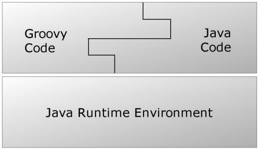

**实际上，由于 Groovy Code 在真正执行的时候已经变成了 Java 字节码，所以 JVM 根本不知道自己运行的是 Groovy 代码**。

下面我们将介绍 Groovy。由于此文的主要目的是 Gradle，所以我们不会过多讨论 Groovy 中细枝末节的东西，而是把知识点集中在以后和 Gradle 打交道时一些常用的地方上。

### 3.1 Groovy 开发环境

在学习本节的时候，最好部署一下 Groovy 开发环境。根据[ Groovy 官网](http://www.groovy-lang.org/download.html#gvm)的介绍，部署 Groovy 开发环境非常简单，在 Ubuntu 或者 cygwin 之类的地方：

- curl -s get.gvmtool.net | bash
- source “$HOME/.gvm/bin/gvm-init.sh”
- gvm install groovy
- 执行完最后一步，Groovy 就下载并安装了。

然后，创建一个 test.groovy 文件，里边只有一行代码：

`println "hello groovy"`- 执行 groovy test.groovy，输出结果如图 2 所示：

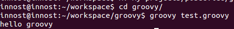

亲们，必须要完成上面的操作啊。做完后，有什么感觉和体会？

**最大的感觉可能就是 groovy 和 shell 脚本，或者 python 好类似。**

另外，除了可以直接使用 JDK 之外，Groovy 还有一套[ GDK ](http://www.groovy-lang.org/api.html)。

说实话，看了这么多家 API 文档，还是 Google 的 Android API 文档做得好。其页面中右上角有一个搜索栏，在里边输入一些关键字，瞬间就能列出候选类，相关文档，方便得不得了啊…

### 3.2 一些前提知识

为了后面讲述方面，这里先介绍一些前提知识。初期接触可能有些别扭，看习惯就好了。

- Groovy 注释标记和 Java 一样，支持 **//**或者**/**/**
- Groovy 语句可以不用分号结尾。Groovy 为了尽量减少代码的输入，确实煞费苦心
- Groovy 中支持动态类型，即**定义变量的时候可以不指定其类型**。Groovy 中，变量定义可以使用关键字 def。**注意，虽然 def 不是必须的，但是为了代码清晰，建议还是使用 def 关键字**

复制代码

```
   def variable1 = 1   // 可以不使用分号结尾
   def varable2 = "I am a person"
   def  int x = 1   // 变量定义时，也可以直接指定类型
```

- 函数定义时，参数的类型也可以不指定。比如

复制代码

```
String testFunction(arg1,arg2){// 无需指定参数类型
  ...
}
```

- 除了变量定义可以不指定类型外，Groovy 中函数的返回值也可以是无类型的。比如：

// 无类型的函数定义，必须使用 def 关键字

复制代码

```
def  nonReturnTypeFunc(){
     last_line   // 最后一行代码的执行结果就是本函数的返回值
}
 
// 如果指定了函数返回类型，则可不必加 def 关键字来定义函数
String  getString(){
   return "I am a string"
}
```

其实，所谓的无返回类型的函数，我估计内部都是按返回 Object 类型来处理的。毕竟，Groovy 是基于 Java 的，而且最终会转成 Java Code 运行在 JVM 上

- 函数返回值：Groovy 的函数里，可以不使用 return xxx 来设置 xxx 为函数返回值。如果不使用 return 语句的话，则函数里最后一句代码的执行结果被设置成返回值。比如

复制代码

```
// 下面这个函数的返回值是字符串 "getSomething return value"
 
def getSomething(){
 
      "getSomething return value" // 如果这是最后一行代码，则返回类型为 String
 
      1000 // 如果这是最后一行代码，则返回类型为 Integer
 
}
```

注意，如果函数定义时候指明了返回值类型的话，函数中则必须返回正确的数据类型，否则运行时报错。如果使用了动态类型的话，你就可以返回任何类型了。

- Groovy 对字符串支持相当强大，充分吸收了一些脚本语言的优点：

1 单引号’'中的内容严格对应 Java 中的 String，不对 $ 符号进行转义

`def singleQuote='I am $ dolloar' // 输出就是 I am $ dolloar`2 双引号""的内容则和脚本语言的处理有点像，如果字符中有 $ 号的话，则它会**$ 表达式**先求值。

复制代码

```
   def doubleQuoteWithoutDollar = "I am one dollar" // 输出 I am one dollar
   def x = 1
   def doubleQuoteWithDollar = "I am $x dolloar" // 输出 I am 1 dolloar
```

3 三个引号’’‘xxx’’'中的字符串支持随意换行 比如

复制代码

```
   def multieLines = ''' begin
     line  1 
     line  2
     end '''
```

- 最后，除了每行代码不用加分号外，Groovy 中函数调用的时候还可以不加括号。比如：

`println("test") ---> println "test"`**注意，虽然写代码的时候，对于函数调用可以不带括号，但是 Groovy 经常把属性和函数调用混淆。比如**

复制代码

```
def getSomething(){
   "hello"
}
```

getSomething() // 如果不加括号的话，Groovy 会误认为 getSomething 是一个变量。

所以，调用函数要不要带括号，我个人意见是如果这个函数是 Groovy API 或者 Gradle API 中比较常用的，比如 println，就可以不带括号。否则还是带括号。Groovy 自己也没有太好的办法解决这个问题，只能**兵来将挡水来土掩**了。

好了，了解上面一些基础知识后，我们再介绍点深入的内容。

### 3.3 Groovy 中的数据类型

Groovy 中的数据类型我们就介绍两种和 Java 不太一样的：

- 一个是 Java 中的基本数据类型。
- 另外一个是 Groovy 中的容器类。
- 最后一个非常重要的是闭包。

放心，这里介绍的东西都很简单

**3.3.1 基本数据类型**

作为动态语言，Groovy 世界中的所有事物都是对象。所以，**int，boolean 这些 Java 中的基本数据类型，在 Groovy 代码中其实对应的是它们的包装数据类型。比如 int 对应为 Integer，boolean 对应为 Boolean。**比如下图中的代码执行结果：

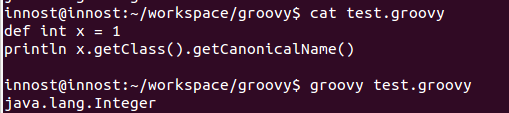

图 4 int 实际上是 Integer

**3.3.2 容器类**

Groovy 中的容器类很简单，就三种：

- List：链表，其底层对应 Java 中的 List 接口，一般用 ArrayList 作为真正的实现类。
- Map：键 - 值表，其底层对应 Java 中的 LinkedHashMap。
- Range：范围，它其实是 List 的一种拓展。

对容器而言，我们最重要的是了解它们的用法。下面是一些简单的例子：

\1. List 类

复制代码

```
变量定义：List 变量由 [] 定义，比如
 
def aList = [5,'string',true] //List 由 [] 定义，其元素可以是任何对象
 
变量存取：可以直接通过索引存取，而且不用担心索引越界。如果索引超过当前链表长度，List 会自动
往该索引添加元素
 
assert aList[1] == 'string'
assert aList[5] == null // 第 6 个元素为空
aList[100] = 100  // 设置第 101 个元素的值为 10
assert aList[100] == 100
 
那么，aList 到现在为止有多少个元素呢？
 
println aList.size  ===> 结果是 101
```

\2. Map 类

复制代码

```
容器变量定义
 
变量定义：Map 变量由 [:] 定义，比如
 
def aMap = ['key1':'value1','key2':true] 
 
Map 由 [:] 定义，注意其中的冒号。冒号左边是 key，右边是 Value。key 必须是字符串，value 可以是任何对象。另外，key 可以用''或 "" 包起来，也可以不用引号包起来。比如
 
def aNewMap = [key1:"value",key2:true] // 其中的 key1 和 key2 默认被
处理成字符串 "key1" 和 "key2"
 
不过 Key 要是不使用引号包起来的话，也会带来一定混淆，比如
 
def key1="wowo"
def aConfusedMap=[key1:"who am i?"]
 
aConfuseMap 中的 key1 到底是 "key1" 还是变量 key1 的值“wowo”？显然，答案是字符串 "key1"。如果要是 "wowo" 的话，则 aConfusedMap 的定义必须设置成：
 
def aConfusedMap=[(key1):"who am i?"]
 
Map 中元素的存取更加方便，它支持多种方法：
 
println aMap.keyName    <== 这种表达方法好像 key 就是 aMap 的一个成员变量一样
println aMap['keyName'] <== 这种表达方法更传统一点
aMap.anotherkey = "i am map"  <== 为 map 添加新元素
```

\3. Range 类

Range 是 Groovy 对 List 的一种拓展，变量定义和大体的使用方法如下：

复制代码

```
def aRange = 1..5  <==Range 类型的变量 由 begin 值 + 两个点 +end 值表示
                      左边这个 aRange 包含 1,2,3,4,5 这 5 个值
 
如果不想包含最后一个元素，则
 
def aRangeWithoutEnd = 1..<5  <== 包含 1,2,3,4 这 4 个元素
println aRange.from
println aRange.to
```

**3.3.4 Groovy API 的一些秘笈**

前面讲这些东西，主要是让大家了解 Groovy 的语法。实际上在 coding 的时候，是离不开 SDK 的。由于 Groovy 是动态语言，所以要使用它的 SDK 也需要掌握一些小诀窍。

Groovy 的 API 文档位于 http://www.groovy-lang.org/api.html

以上文介绍的 Range 为例，我们该如何更好得使用它呢？

- 先定位到 Range 类。它位于 groovy.lang 包中：

有了 API 文档，你就可以放心调用其中的函数了。**不过，不过，不过**：我们刚才代码中用到了 Range.from/to 属性值，但翻看 Range API 文档的时候，其实并没有这两个成员变量。图 6 是 Range 的方法

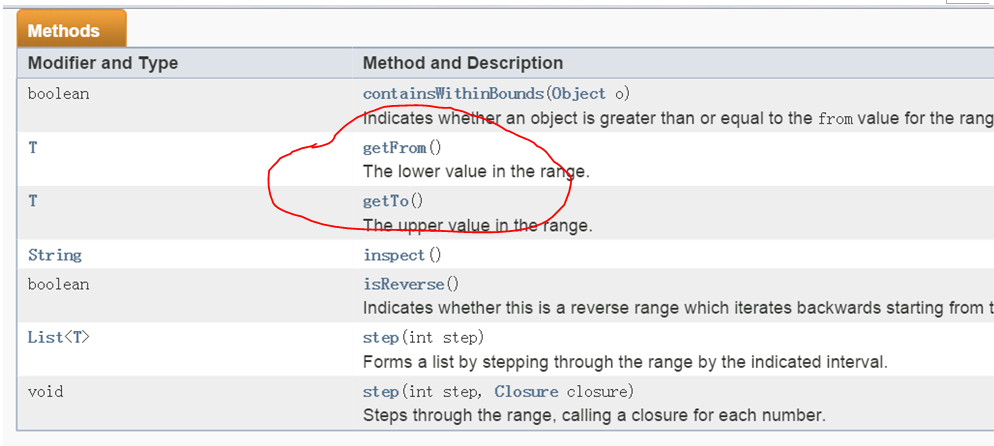

文档中并没有说明 Range 有 from 和 to 这两个属性，但是却有 getFrom 和 getTo 这两个函数。**What happened？**原来：

根据 Groovy 的原则，如果一个类中有名为 xxyyzz 这样的属性（其实就是成员变量），Groovy 会自动为它添加 getXxyyzz 和 setXxyyzz 两个函数，用于获取和设置 xxyyzz 属性值。

注意，get 和 set 后第一个字母是大写的

所以，当你看到 Range 中有 getFrom 和 getTo 这两个函数时候，就得知道潜规则下，Range 有 from 和 to 这两个属性。当然，由于它们不可以被外界设置，所以没有公开 setFrom 和 setTo 函数。

### 3.4 闭包

**3.4.1 闭包的样子**

闭包，英文叫 Closure，是 Groovy 中非常重要的一个数据类型或者说一种概念了。闭包的历史来源，种种好处我就不说了。我们直接看怎么使用它！

闭包，是一种数据类型，它代表了一段可执行的代码。其外形如下：

复制代码

```
def aClosure = {// 闭包是一段代码，所以需要用花括号括起来..  
    Stringparam1, int param2 ->  // 这个箭头很关键。箭头前面是参数定义，箭头后面是代码  
    println"this is code" // 这是代码，最后一句是返回值，  
   // 也可以使用 return，和 Groovy 中普通函数一样  
}  
```

简而言之，Closure 的定义格式是：

复制代码

```
def xxx = {paramters -> code}  // 或者  
def xxx = {无参数，纯 code}  这种 case 不需要 -> 符号
```

**说实话，从 C/C++ 语言的角度看，闭包和函数指针很像**。闭包定义好后，要调用它的方法就是：

闭包对象.call(参数) 或者更像函数指针调用的方法：

闭包对象 (参数)

比如：

复制代码

```
aClosure.call("this is string",100)  或者  
aClosure("this is string", 100)  
```

上面就是一个闭包的定义和使用。在闭包中，还需要注意一点：

**如果闭包没定义参数的话，则隐含有一个参数，这个参数名字叫 it，和 this 的作用类似。it 代表闭包的参数。**

比如：

复制代码

```
def greeting = { "Hello, $it!" }
assert greeting('Patrick') == 'Hello, Patrick!'
```

等同于：

复制代码

```
def greeting = { it -> "Hello, $it!" }
assert greeting('Patrick') == 'Hello, Patrick!'
```

但是，如果在闭包定义时，采用下面这种写法，则表示闭包没有参数！

`def noParamClosure = { -> true }`这个时候，我们就不能给 noParamClosure 传参数了！

`noParamClosure ("test") <== 报错喔！`**3.4.2 Closure 使用中的注意点**

\1. 省略圆括号

闭包在 Groovy 中大量使用，比如很多类都定义了一些函数，这些函数最后一个参数都是一个闭包。比如：

`public static <T> List<T> each(List<T> self, Closure closure)`上面这个函数表示针对 List 的每一个元素都会调用 closure 做一些处理。这里的 closure，就有点回调函数的感觉。但是，在使用这个 each 函数的时候，我们传递一个怎样的 Closure 进去呢？比如：

复制代码

```
def iamList = [1,2,3,4,5]  // 定义一个 List
iamList.each{  // 调用它的 each，这段代码的格式看不懂了吧？each 是个函数，圆括号去哪了？
      println it
}
```

上面代码有两个知识点：

- **each 函数调用的圆括号不见了**！原来，Groovy 中，当函数的最后一个参数是闭包的话，可以省略圆括号。比如

复制代码

```
def  testClosure(int a1,String b1, Closure closure){
      //do something
      closure() // 调用闭包
}
那么调用的时候，就可以免括号！
testClosure (4, "test", {
   println "i am in closure"
} )  // 红色的括号可以不写..
```

注意，这个特点非常关键，因为以后在 Gradle 中经常会出现图 7 这样的代码：

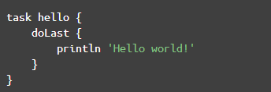

经常碰见图 7 这样的没有圆括号的代码。省略圆括号虽然使得代码简洁，看起来更像脚本语言，但是它这经常会让我 confuse（不知道其他人是否有同感），以 doLast 为例，完整的代码应该按下面这种写法：

复制代码

```
 doLast({
   println 'Hello world!'
})
```

有了圆括号，你会知道 doLast 只是把一个 Closure 对象传了进去。很明显，它不代表这段脚本解析到 doLast 的时候就会调用 println ‘Hello world!’ 。

但是把圆括号去掉后，就感觉好像 println 'Hello world!'立即就会被调用一样！

\2. 如何确定 Closure 的参数

另外一个比较让人头疼的地方是，Closure 的参数该怎么搞？还是刚才的 each 函数：

`public static <T> List<T> each(List<T> self, Closure closure)`如何使用它呢？比如：

复制代码

```
def iamList = [1,2,3,4,5]  // 定义一个 List 变量
iamList.each{  // 调用它的 each 函数，只要传入一个 Closure 就可以了。
  println it
}
```

看起来很轻松，其实：

- **对于 each 所需要的 Closure，它的参数是什么？有多少个参数？返回值是什么？**

我们能写成下面这样吗？

复制代码

```
iamList.each{String name,int x ->
  return x
}  // 运行的时候肯定报错！
```

所以，Closure 虽然很方便，但是它一定会和使用它的上下文有极强的关联。要不，作为类似回调这样的东西，我如何知道调用者传递什么参数给 Closure 呢？

此问题如何破解？只能通过查询 API 文档才能了解上下文语义。比如下图 8：

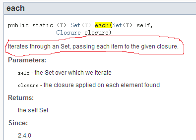

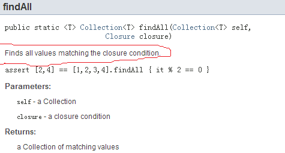

图 8 中：

- each 函数说明中，将给指定的 closure 传递 Set 中的每一个 item。所以，closure 的参数只有一个。
- findAll 中，**绝对抓瞎**了。一个是没说明往 Closure 里传什么。另外没说明 Closure 的返回值是什么…。

**对 Map 的 findAll 而言，Closure 可以有两个参数。findAll 会将 Key 和 Value 分别传进去。并且，Closure 返回 true，表示该元素是自己想要的。返回 false 表示该元素不是自己要找的**。示意代码如图 9 所示：

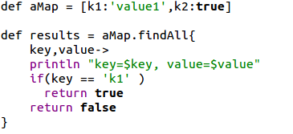

Closure 的使用有点坑，很大程度上依赖于你对 API 的熟悉程度，所以最初阶段，SDK 查询是少不了的。

### 3.5 脚本类、文件 I/O 和 XML 操作

最后，我们来看一下 Groovy 中比较高级的用法。

**3.5.1 脚本类**

\1. 脚本中 import 其他类

Groovy 中可以像 Java 那样写 package，然后写类。比如在文件夹 com/cmbc/groovy/ 目录中放一个文件，叫 Test.groovy，如图 10 所示：

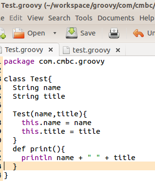

你看，图 10 中的 Test.groovy 和 Java 类就很相似了。当然，如果不声明 public/private 等访问权限的话，Groovy 中类及其变量默认都是 public 的。

现在，我们在测试的根目录下建立一个 test.groovy 文件。其代码如下所示：

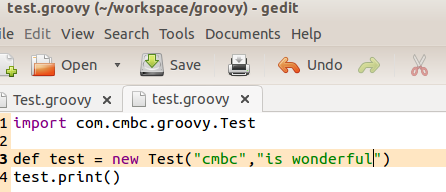

你看，test.groovy 先 import 了 com.cmbc.groovy.Test 类，然后创建了一个 Test 类型的对象，接着调用它的 print 函数。

这两个 groovy 文件的目录结构如图 12 所示：

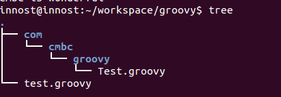

在 groovy 中，系统自带会加载当前目录 / 子目录下的 xxx.groovy 文件。所以，当执行 groovy test.groovy 的时候，test.groovy import 的 Test 类能被自动搜索并加载到。

\2. 脚本到底是什么

Java 中，我们最熟悉的是类。但是我们在 Java 的一个源码文件中，不能不写 class（interface 或者其他…），而 Groovy 可以像写脚本一样，把要做的事情都写在 xxx.groovy 中，而且可以通过 groovy xxx.groovy 直接执行这个脚本。这到底是怎么搞的？

既然是基于 Java 的，Groovy 会先把 xxx.groovy 中的内容转换成一个 Java 类。比如：

test.groovy 的代码是：

`println 'Groovy world!'`Groovy 把它转换成这样的 Java 类：

执行 **groovyc** -d classes test.groovy

**groovyc**是 groovy 的编译命令，-d classes 用于将编译得到的 class 文件拷贝到 classes 文件夹下

图 13 是 test.groovy 脚本转换得到的 java class。用 jd-gui 反编译它的代码：

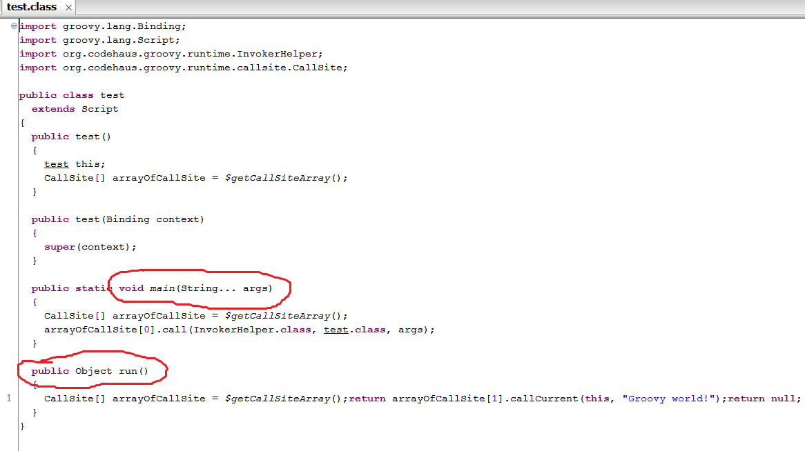

图 13 中：

- test.groovy 被转换成了一个 test 类，它从 script 派生。
- 每一个脚本都会生成一个 static main 函数。这样，当我们 groovy test.groovy 的时候，其实就是用 java 去执行这个 main 函数
- **脚本中的所有代码都会放到 run 函数中**。比如，println ‘Groovy world’，这句代码实际上是包含在 run 函数里的。
- 如果脚本中定义了函数，则函数会被定义在 test 类中。

**groovyc**是一个比较好的命令，读者要掌握它的用法。然后利用 jd-gui 来查看对应 class 的 Java 源码。

\3. 脚本中的变量和作用域

前面说了，xxx.groovy 只要不是和 Java 那样的 class，那么它就是一个脚本。而且脚本的代码其实都会被放到 run 函数中去执行。那么，在 Groovy 的脚本中，很重要的一点就是脚本中定义的**变量和它的作用域**。举例：

复制代码

```
def x = 1 <== 注意，这个 x 有 def（或者指明类型，比如 int x = 1）  
def printx(){  
   println x  
}  
```

printx() <== 报错，说 x 找不到

为什么？继续来看反编译后的 class 文件。

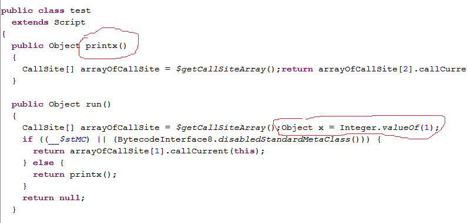

图 14 中：

- **printx 被定义成 test 类的成员函数**
- **def x = 1**，这句话是在 run 中创建的。所以，x=1 从代码上看好像是在整个脚本中定义的，但实际上 printx 访问不了它。printx 是 test 成员函数，除非 x 也被定义成 test 的成员函数，否则 printx 不能访问它。

那么，如何使得 printx 能访问 x 呢？很简单，定义的时候不要加类型和 def。即：

复制代码

```
x = 1  <== 注意，去掉 def 或者类型
def printx(){
   println x
}
printx()  <==OK
```

这次 Java 源码又变成什么样了呢？

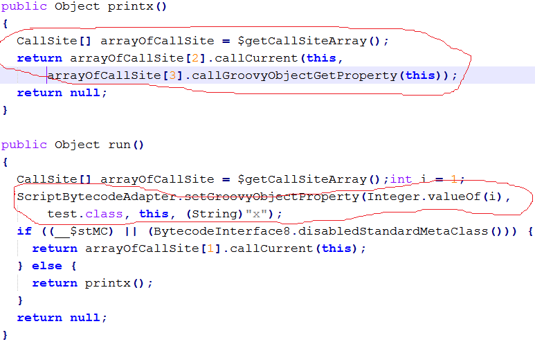

图 15 中，x 也没有被定义成 test 的成员函数，而是在 run 的执行过程中，将 x 作为一个属性添加到 test 实例对象中了。然后在 printx 中，先获取这个属性。

注意，Groovy 的文档说 x = 1 这种定义将使得 x 变成 test 的成员变量，但从反编译情况看，这是不对的…

虽然 printx 可以访问 x 变量了，但是假如有其他脚本却无法访问 x 变量。因为它不是 test 的成员变量。

比如，我在测试目录下创建一个新的名为 test1.groovy。这个 test1 将访问 test.groovy 中定义的 printx 函数：

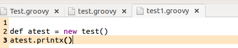

这种方法使得我们可以将代码分成模块来编写，**比如将公共的功能放到 test.groovy 中，然后使用公共功能的代码放到 test1.groovy 中**。

执行 groovy test1.groovy，报错。说 x 找不到。这是因为 x 是在 test 的 run 函数动态加进去的。怎么办？

复制代码

```
import groovy.transform.Field;   // 必须要先 import
@Field x = 1  <== 在 x 前面加上 @Field 标注，这样，x 就彻彻底底是 test 的成员变量了。
```

查看编译后的 test.class 文件，得到：

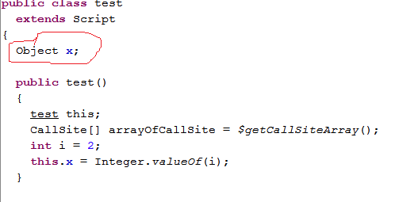

这个时候，test.groovy 中的 x 就成了 test 类的成员函数了。如此，我们可以在 script 中定义那些需要输出给外部脚本或类使用的变量了！

**3.5.2 文件 I/O 操作**

本节介绍下 Groovy 的文件 I/O 操作。直接来看例子吧，虽然比 Java 看起来简单，但要理解起来其实比较难。尤其是当你要自己查 SDK 并编写代码的时候。

整体说来，Groovy 的 I/O 操作是在原有 Java I/O 操作上进行了更为简单方便的封装，并且使用 Closure 来简化代码编写。主要封装了如下一些了类：

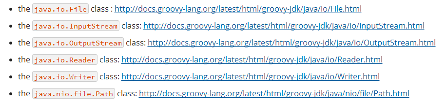

1. 读文件

Groovy 中，文件读操作简单到令人发指：

def targetFile = new File(文件名) <==File 对象还是要创建的。

然后打开 http://docs.groovy-lang.org/latest/html/groovy-jdk/java/io/File.html

看看 Groovy 定义的 API：

1 读该文件中的每一行：eachLine 的唯一参数是一个 Closure。Closure 的参数是文件每一行的内容

其内部实现肯定是 Groovy 打开这个文件，然后读取文件的一行，然后调用 Closure…

复制代码

```
targetFile.eachLine{   
  StringoneLine ->  
   printlnoneLine      
  <== 是不是令人发指？？！  
```

2 直接得到文件内容

`targetFile.getBytes() <== 文件内容一次性读出，返回类型为 byte[]` 注意前面提到的 getter 和 setter 函数，这里可以直接使用 targetFile.bytes //…

3 使用 InputStream.InputStream 的 SDK 在 http://docs.groovy-lang.org/latest/html/groovy-jdk/java/io/InputStream.html

复制代码

```
def ism =  targetFile.newInputStream()  
// 操作 ism，最后记得关掉  
ism.close  
```

4 使用闭包操作 inputStream，以后在 Gradle 里会常看到这种搞法

复制代码

```
 targetFile.withInputStream{ ism ->
   操作 ism. 不用 close。Groovy 会自动替你 close
}
```

确实够简单，令人发指。我当年死活也没找到 withInputStream 是个啥意思。所以，请各位开发者牢记 Groovy I/O 操作相关类的 SDK 地址：

- java.io.File: **http://docs.groovy-lang.org/latest/html/groovy-jdk/java/io/File.html**
- java.io.InputStream: **http://docs.groovy-lang.org/latest/html/groovy-jdk/java/io/InputStream.html**
- java.io.OutputStream: **http://docs.groovy-lang.org/latest/html/groovy-jdk/java/io/OutputStream.html**
- java.io.Reader: **http://docs.groovy-lang.org/latest/html/groovy-jdk/java/io/Reader.html**
- java.io.Writer: **http://docs.groovy-lang.org/latest/html/groovy-jdk/java/io/Writer.html**
- java.nio.file.Path: **http://docs.groovy-lang.org/latest/html/groovy-jdk/java/nio/file/Path.html**

\2. 写文件

和读文件差不多。不再啰嗦。这里给个例子，告诉大家如何 copy 文件。

复制代码

```
def srcFile = new File(源文件名)  
def targetFile = new File(目标文件名)  
targetFile.withOutputStream{ os->  
  srcFile.withInputStream{ ins->  
      os << ins   // 利用 OutputStream 的 << 操作符重载，完成从 inputstream 到 OutputStream  
       // 的输出  
   }  
}  
```

关于 OutputStream 的 << 操作符重载，查看 SDK 文档后可知：

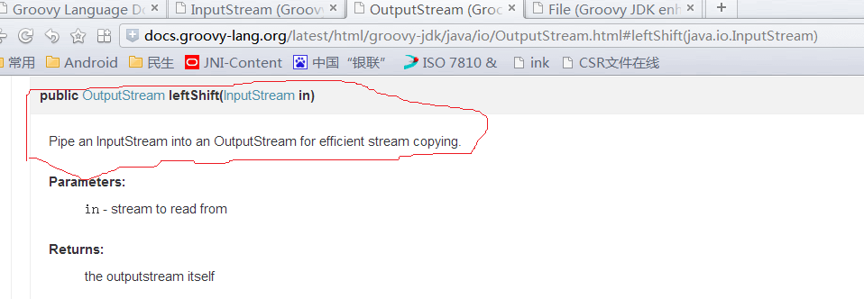

再一次向极致简单致敬。但是，SDK 恐怕是离不开手了…

**3.5.3 XML 操作**

除了 I/O 异常简单之外，Groovy 中的 XML 操作也极致得很。Groovy 中，XML 的解析提供了和 XPath 类似的方法，名为 GPath。这是一个类，提供相应 API。关于 XPath，请看[ Wiki ](https://en.wikipedia.org/wiki/XPath)。

GPath 功能包括：给个例子好了，来自 Groovy 官方文档。

test.xml 文件：

复制代码

```
<response version-api="2.0">  
       <value>  
           <books>  
               <book available="20" id="1">  
                   <title>Don Xijote</title>  
                   <author id="1">Manuel De Cervantes</author>  
               </book>  
               <book available="14" id="2">  
                   <title>Catcher in the Rye</title>  
                  <author id="2">JD Salinger</author>  
              </book>  
              <book available="13" id="3">  
                  <title>Alice in Wonderland</title>  
                  <author id="3">Lewis Carroll</author>  
              </book>  
              <book available="5" id="4">  
                  <title>Don Xijote</title>  
                  <author id="4">Manuel De Cervantes</author>  
              </book>  
           </books>  
      </value>  
   </response>  
```

- 现在来看怎么玩转 GPath：

复制代码

```
// 第一步，创建 XmlSlurper 类  
def xparser = new XmlSlurper()  
def targetFile = new File("test.xml")  
// 轰轰的 GPath 出场  
GPathResult gpathResult =xparser.parse(targetFile)  
   
// 开始玩 test.xml。现在我要访问 id=4 的 book 元素。  
// 下面这种搞法，gpathResult 代表根元素 response。通过 e1.e2.e3 这种  
// 格式就能访问到各级子元素....  
def book4 = gpathResult.value.books.book[3]  
// 得到 book4 的 author 元素  
def author = book4.author  
// 再来获取元素的属性和 textvalue  
assert author.text() == ' Manuel De Cervantes '  
获取属性更直观  
author.@id == '4' 或者 author['@id'] == '4'  
属性一般是字符串，可通过 toInteger 转换成整数  
author.@id.toInteger() == 4  
好了。GPath 就说到这。再看个例子。我在使用 Gradle 的时候有个需求，就是获取 AndroidManifest.xml 版本号（versionName）。有了 GPath，一行代码搞定，请看：  
def androidManifest = newXmlSlurper().parse("AndroidManifest.xml")  
println androidManifest['@android:versionName']  
或者  
println androidManifest.@'android:versionName'  
```

### 3.6 更多

作为一门语言，Groovy 是复杂的，是需要深入学习和钻研的。一本厚书甚至都无法描述 Groovy 的方方面面。

Anyway，从使用角度看，尤其是又限定在 Gradle 这个领域内，能用到的都是 Groovy 中一些简单的知识。

## 四、Gradle 介绍

现在正式进入 Gradle。Gradle 是一个工具，同时它也是一个编程框架。前面也提到过，使用这个工具可以完成 app 的编译打包等工作。当然你也可以用它干其他的事情。

Gradle 是什么？学习它到什么地步就可以了？

=====> 看待问题的时候，所站的角度非常重要。

–> 当你把 Gradle 当工具看的时候，我们只想着如何用好它。会写、写好配置脚本就 OK

–> 当你把它当做编程框架看的时候，你可能需要学习很多更深入的内容。

另外，今天我们把它当工具看，明天因为需求发生变化，我们可能又得把它当编程框架看。

### 4.1 Gradle 开发环境部署

Gradle 的官网：**[ http://gradle.org/](http://gradle.org/)**

文档位置：[ https://docs.gradle.org/current/release-notes。其中的 ** ](https://docs.gradle.org/current/release-notes。其中的**)*User Guide***和***DSL Reference*** 很关键。User Guide 就是介绍 Gradle 的一本书，而 DSL Reference 是 Gradle API 的说明。

以 Ubuntu 为例，下载 Gradle：**[ http://gradle.org/gradle-download/ ](http://gradle.org/gradle-download/)**选择**Complete distribution**和**Binary only distribution**都行。然后解压到指定目录。

最后，设置~/.bashrc，把 Gradle 加到 PATH 里，如图 20 所示：

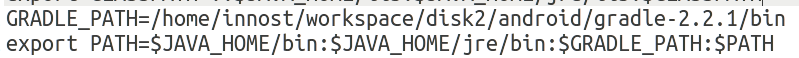

**执行 source ~/.bashrc，初始化环境**。

**执行 gradle --version，如果成功运行就 OK 了**。

注意，为什么说 Gradle 是一个编程框架？来看它提供的 API 文档：

**https://docs.gradle.org/current/javadoc/org/gradle/api/Project.html**

原来，我们编写所谓的编译脚本，其实就是玩 Gradle 的 API…所以它从更底层意义上看，是一个编程框架！

既然是编程框架，我在讲解 Gradle 的时候，尽量会从 API 的角度来介绍。有些读者肯定会不耐烦，为嘛这么费事？

**从我个人的经历来看：因为我从网上学习到的资料来看，几乎全是从脚本的角度来介绍 Gradle，结果学习一通下来，只记住参数怎么配置，却不知道它们都是函数调用，都是严格对应相关 API 的。**

而从 API 角度来看待 Gradle 的话，有了 SDK 文档，你就可以编程。编程是靠记住一行行代码来实现的吗？不是，是在你掌握大体流程，然后根据 SDK+API 来完成的！

其实，Gradle 自己的 User Guide 也明确说了：

**Build scripts are code**

### 4.2 基本组件

Gradle 是一个框架，它定义一套自己的游戏规则。我们要玩转 Gradle，必须要遵守它设计的规则。下面我们来讲讲 Gradle 的基本组件：

Gradle 中，每一个待编译的工程都叫一个 Project。每一个 Project 在构建的时候都包含一系列的 Task。比如一个 Android APK 的编译可能包含：**Java 源码编译 Task、资源编译 Task、JNI 编译 Task、lint 检查 Task、打包生成 APK 的 Task、签名 Task 等**。

一个 Project 到底包含多少个 Task，其实是由编译脚本指定的插件决定。插件是什么呢？插件就是用来定义 Task，并具体执行这些 Task 的东西。

刚才说了，Gradle 是一个框架，作为框架，它负责定义流程和规则。而具体的编译工作则是通过插件的方式来完成的。比如**编译 Java 有 Java 插件，编译 Groovy 有 Groovy 插件，编译 Android APP 有 Android APP 插件，编译 Android Library 有 Android Library 插件**

好了。到现在为止，你知道 Gradle 中每一个待编译的工程都是一个 Project，一个具体的编译过程是由一个一个的 Task 来定义和执行的。

**4.2.1 一个重要的例子**

下面我们来看一个实际的例子。这个例子非常有代表意义。图 22 是一个名为 posdevice 的目录。这个目录里包含 3 个 Android Library 工程，2 个 Android APP 工程。

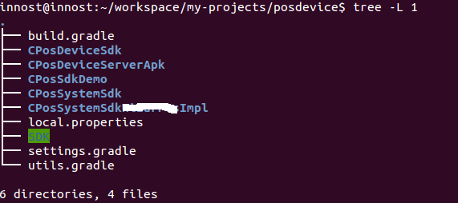

在图 22 的例子中：

- CPosDeviceSdk、CPosSystemSdk、CPosSystemSdkxxxImpl 是 Android Library。**其中，CPosSystemSdkxxxImpl 依赖 CPosSystemSdk**
- CPosDeviceServerApk 和 CPosSdkDemo 是 Android APP。这些 App 和 SDK 有依赖关系。CPosDeviceServerApk 依赖 CPosDeviceSdk，而 CPosSdkDemo 依赖所有的 Sdk Library。

请回答问题，在上面这个例子中，有多少个 Project？

答案是：每一个 Library 和每一个 App 都是单独的 Project。根据 Gradle 的要求，每一个 Project 在其根目录下都需要有一个 build.gradle。build.gradle 文件就是该 Project 的编译脚本，类似于 Makefile。

看起来好像很简单，但是请注意：posdevice 虽然包含 5 个独立的 Project，但是要独立编译他们的话，得：

1. cd 某个 Project 的目录。比如 cd CPosDeviceSdk
2. 然后执行 gradle xxxx（xxx 是任务的名字。对 Android 来说，assemble 这个 Task 会生成最终的产物，所以 gradle assemble）

这很麻烦啊，有 10 个独立 Project，就得重复执行 10 次这样的命令。更有甚者，所谓的独立 Project 其实有依赖关系的。比如我们这个例子。

那么，我想在 posdevice 目录下，直接执行 gradle assemble，是否能把这 5 个 Project 的东西都编译出来呢？

答案自然是可以。在 Gradle 中，这叫**Multi-Projects Build**。把 posdevice 改造成支持 Gradle 的 Multi-Projects Build 很容易，需要：

- 在 posdevice 下也添加一个 build.gradle。这个 build.gradle 一般干得活是：配置其他子 Project 的。比如为子 Project 添加一些属性。这个 build.gradle 有没有都无所属。
- 在 posdevice 下添加一个名为 settings.gradle。这个文件很重要，名字必须是 settings.gradle。它里边用来告诉 Gradle，这个 multiprojects 包含多少个子 Project。

来看 settings.gradle 的内容，最关键的内容就是告诉 Gradle 这个 multiprojects 包含哪些子 projects:

[settings.gradle]

复制代码

```
// 通过 include 函数，将子 Project 的名字（其文件夹名）包含进来  
include  'CPosSystemSdk' ,'CPosDeviceSdk' ,  
       'CPosSdkDemo','CPosDeviceServerApk','CPosSystemSdkWizarPosImpl'  
```

强烈建议：

如果你确实只有一个 Project 需要编译，我也建议你在目录下添加一个 settings.gradle。我们团队内部的所有单个 Project 都已经改成支持 Multiple-Project Build 了。改得方法就是添加 settings.gradle，然后 include 对应的 project 名字。

另外，settings.gradle 除了可以 include 外，还可以设置一些函数。这些函数会在 gradle 构建整个工程任务的时候执行，所以，可以在 settings 做一些初始化的工作。比如：我的 settings.gradle 的内容：

复制代码

```
// 定义一个名为 initMinshengGradleEnvironment 的函数。该函数内部完成一些初始化操作
// 比如创建特定的目录，设置特定的参数等
def initMinshengGradleEnvironment(){  
    println"initialize Minsheng Gradle Environment ....."  
    ......// 干一些 special 的私活....  
    println"initialize Minsheng Gradle Environment completes..."  
}  
//settings.gradle 加载的时候，会执行 initMinshengGradleEnvironment  
initMinshengGradleEnvironment()  
//include 也是一个函数：  
include 'CPosSystemSdk' , 'CPosDeviceSdk' ,  
      'CPosSdkDemo','CPosDeviceServerApk','CPosSystemSdkWizarPosImpl' 
```

**4.2.2 gradle 命令介绍**

\1. gradle projects 查看工程信息

到目前为止，我们了解了 Gradle 什么呢？

- **每一个 Project 都必须设置一个 build.gradle 文件。至于其内容，我们留到后面再说**。
- **对于 multi-projects build，需要在根目录下也放一个 build.gradle，和一个 settings.gradle**。
- **一个 Project 是由若干 tasks 来组成的，当 gradle xxx 的时候，实际上是要求 gradle 执行 xxx 任务。这个任务就能完成具体的工作**。
- 当然，具体的工作和不同的插件有关系。编译 Java 要使用 Java 插件，编译 Android APP 需要使用 Android APP 插件。这些我们都留待后续讨论

gradle 提供一些方便命令来查看和 Project，Task 相关的信息。比如在 posdevice 中，我想看这个 multi projects 到底包含多少个子 Project：

执行 gradle projects，得到图 23：

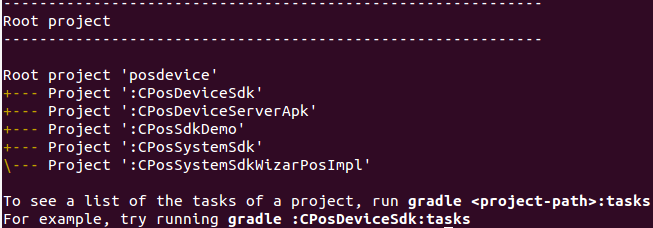

你看，multi projects 的情况下，posdevice 这个目录对应的 build.gradle 叫 Root Project，它包含 5 个子 Project。

如果你修改 settings.gradle，使得 include 只有一个参数，则 gradle projects 的子 project 也会变少，比如图 24：

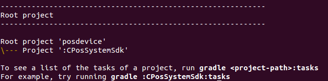

1. gradle tasks 查看任务信息

查看了 Project 信息，这个还比较简单，直接看 settings.gradle 也知道。那么 Project 包含哪些 Task 信息，怎么看呢？图 23,24 中最后的输出也告诉你了，想看某个 Project 包含哪些 Task 信息，只要执行：

**gradle project-path:tasks** 就行。注意，**project-path**是目录名，后面必须跟冒号。

对于 Multi-project，在根目录中，需要指定你想看哪个 poject 的任务。不过你要是已经 cd 到某个 Project 的目录了，则不需指定 Project-path。

来看图 25：

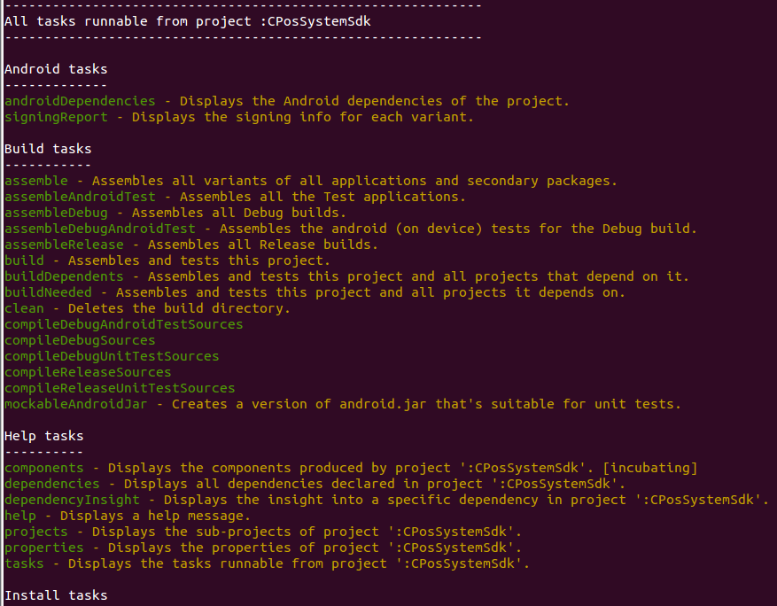

图 25 是 gradle CPosSystemSdk:tasks 的结果。

- cd CPossystemSdk
- gradle tasks 得到同样的结果

CPosSystemSdk 是一个 Android Library 工程，Android Library 对应的插件定义了好多 Task。每种插件定义的 Task 都不尽相同，这就是所谓的 Domain Specific，需要我们对相关领域有比较多的了解。

这些都是后话，我们以后会详细介绍。

\3. gradle task-name 执行任务

图 25 中列出了好多任务，这时候就可以通过 gradle 任务名来执行某个任务。这和 make xxx 很像。比如：

- gradle clean 是执行清理任务，和 make clean 类似。
- gradle properites 用来查看所有属性信息。

gradle tasks 会列出每个任务的描述，通过描述，我们大概能知道这些任务是干什么的…。然后 gradle task-name 执行它就好。

这里要强调一点：Task 和 Task 之间往往是有关系的，**这就是所谓的依赖关系。比如，assemble task 就依赖其他 task 先执行，assemble 才能完成最终的输出**。

依赖关系对我们使用 gradle 有什么意义呢？

如果知道 Task 之间的依赖关系，那么开发者就可以添加一些定制化的 Task。比如我为 assemble 添加一个 SpecialTest 任务，并指定 assemble 依赖于 SpecialTest。当 assemble 执行的时候，就会先处理完它依赖的 task。自然，SpecialTest 就会得到执行了…

大家先了解这么多，等后面介绍如何写 gradle 脚本的时候，这就是调用几个函数的事情，Nothing Special!

### 4.3 Gradle 工作流程

Gradle 的工作流程其实蛮简单，用一个图 26 来表达：

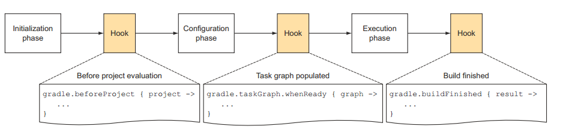

图 26 告诉我们，Gradle 工作包含三个阶段：

- 首先是初始化阶段。对我们前面的 multi-project build 而言，就是执行 settings.gradle
- Initiliazation phase 的下一个阶段是 Configration 阶段。
- Configration 阶段的目标是解析每个 project 中的 build.gradle。比如 multi-project build 例子中，解析每个子目录中的 build.gradle。在这两个阶段之间，我们可以加一些定制化的 Hook。这当然是通过 API 来添加的。
- Configuration 阶段完了后，整个 build 的 project 以及内部的 Task 关系就确定了。恩？前面说过，一个 Project 包含很多 Task，每个 Task 之间有依赖关系。Configuration 会建立一个有向图来描述 Task 之间的依赖关系。所以，我们可以添加一个 HOOK，即当 Task 关系图建立好后，执行一些操作。
- 最后一个阶段就是执行任务了。当然，任务执行完后，我们还可以加 Hook。

我在：

- settings.gradle 加了一个输出。
- 在 posdevice 的 build.gradle 加了图 25 中的 beforeProject 函数。
- 在 CPosSystemSdk 加了 taskGraph whenReady 函数和 buidFinished 函数。

好了，Hook 的代码怎么写，估计你很好奇，而且肯定会埋汰，怎么就还没告诉我怎么写 Gradle。马上了！

最后，关于 Gradle 的工作流程，你只要记住：

- Gradle 有一个初始化流程，这个时候 settings.gradle 会执行。
- 在配置阶段，每个 Project 都会被解析，其内部的任务也会被添加到一个有向图里，用于解决执行过程中的依赖关系。
- 然后才是执行阶段。你在 gradle xxx 中指定什么任务，gradle 就会将这个 xxx 任务链上的所有任务全部按依赖顺序执行一遍！

**下面来告诉你怎么写代码！**

### 4.4 Gradle 编程模型及 API 实例详解

**希望你在进入此节之前，一定花时间把前面内容看一遍！！！**

**[https://docs.gradle.org/current/dsl/ ](https://docs.gradle.org/current/dsl/)**<== 这个文档很重要

Gradle 基于 Groovy，Groovy 又基于 Java。所以，Gradle 执行的时候和 Groovy 一样，会把脚本转换成 Java 对象。Gradle 主要有三种对象，这三种对象和三种不同的脚本文件对应，在 gradle 执行的时候，会将脚本转换成对应的对端：

- Gradle 对象：当我们执行 gradle xxx 或者什么的时候，gradle 会从默认的配置脚本中构造出一个 Gradle 对象。在整个执行过程中，只有这么一个对象。Gradle 对象的数据类型就是 Gradle。我们一般很少去定制这个默认的配置脚本。
- Project 对象：每一个 build.gradle 会转换成一个 Project 对象。
- Settings 对象：显然，每一个 settings.gradle 都会转换成一个 Settings 对象。

注意，对于其他 gradle 文件，除非定义了 class，否则会转换成一个实现了 Script 接口的对象。这一点和 3.5 节中 Groovy 的脚本类相似

当我们执行 gradle 的时候，gradle 首先是按顺序解析各个 gradle 文件。这里边就有所所谓的生命周期的问题，即先解析谁，后解析谁。图 27 是 Gradle 文档中对生命周期的介绍：结合上一节的内容，相信大家都能看明白了。**现在只需要看红框里的内容：**

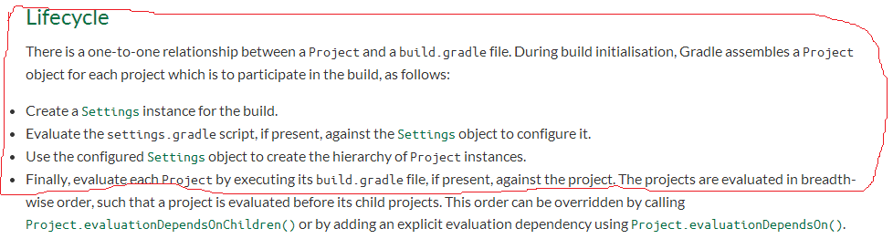

**4.4.1 Gradle 对象**

我们先来看 Gradle 对象，它有哪些属性呢？如图 28 所示：

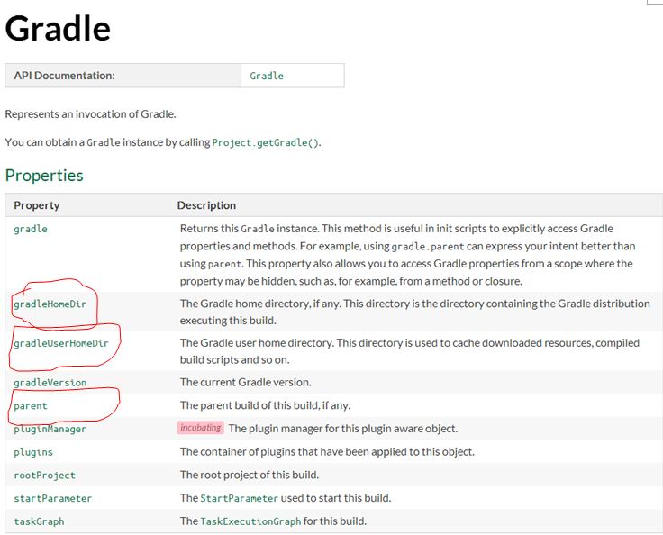

我在 posdevice build.gradle 中和 settings.gradle 中分别加了如下输出：

复制代码

```
// 在 settings.gradle 中，则输出 "In settings,gradle id is"  
println "In posdevice, gradle id is " +gradle.hashCode()  
println "Home Dir:" + gradle.gradleHomeDir  
println "User Home Dir:" + gradle.gradleUserHomeDir  
println "Parent: " + gradle.parent  
```

得到结果如图 29 所示：

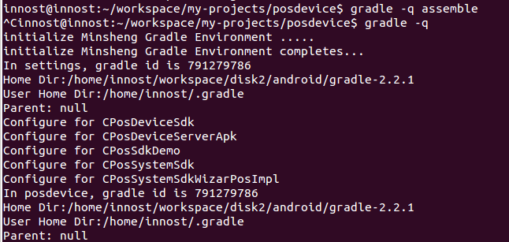

- 你看，在 settings.gradle 和 posdevice build.gradle 中，我们得到的 gradle 实例对象的 hashCode 是一样的（都是 791279786）。
- HomeDir 是我在哪个目录存储的 gradle 可执行程序。
- User Home Dir：是 gradle 自己设置的目录，里边存储了一些配置文件，以及编译过程中的缓存文件，生成的类文件，编译中依赖的插件等等。

Gradle 的函数接口在文档中也有。

**4.4.2 Project 对象**

每一个 build.gradle 文件都会转换成一个 Project 对象。在 Gradle 术语中，Project 对象对应的是**Build Script**。

Project 包含若干 Tasks。另外，由于 Project 对应具体的工程，所以需要为 Project 加载所需要的插件，比如为 Java 工程加载 Java 插件。**其实，一个 Project 包含多少 Task 往往是插件决定的。**

所以，在 Project 中，我们要：

- 加载插件。
- 不同插件有不同的行话，即不同的配置。我们要在 Project 中配置好，这样插件就知道从哪里读取源文件等
- 设置属性。

\1. 加载插件

Project 的 API 位于**[ https://docs.gradle.org/current/javadoc/org/gradle/api/Project.html ](https://docs.gradle.org/current/javadoc/org/gradle/api/Project.html)**。加载插件是调用它的 apply 函数.apply 其实是 Project 实现的 PluginAware 接口定义的：

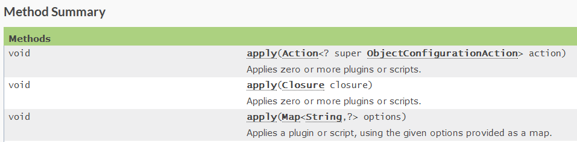

来看代码：

[apply 函数的用法]

apply 是一个函数，此处调用的是图 30 中最后一个 apply 函数。注意，Groovy 支持函数调用的时候通过 参数名 1: 参数值 2，参数名 2：参数值 2 的方式来传递参数

复制代码

```
apply plugin: 'com.android.library'    <== 如果是编译 Library，则加载此插件
apply plugin: 'com.android.application'  <== 如果是编译 Android APP，则加载此插件
```

除了加载二进制的插件（上面的插件其实都是下载了对应的 jar 包，这也是通常意义上我们所理解的插件），还可以加载一个 gradle 文件。为什么要加载 gradle 文件呢？

**其实这和代码的模块划分有关。一般而言，我会把一些通用的函数放到一个名叫 utils.gradle 文件里。然后在其他工程的 build.gradle 来加载这个 utils.gradle。这样，通过一些处理，我就可以调用 utils.gradle 中定义的函数了。**

加载 utils.gradle 插件的代码如下：

utils.gradle 是我封装的一个 gradle 脚本，里边定义了一些方便函数，比如读取 AndroidManifest.xml 中

的 versionName，或者是 copy jar 包 /APK 包到指定的目录

`apply from: rootProject.getRootDir().getAbsolutePath() + "/utils.gradle"`也是使用 apply 的最后一个函数。那么，apply 最后一个函数到底支持哪些参数呢？还是得看图 31 中的 API 说明：

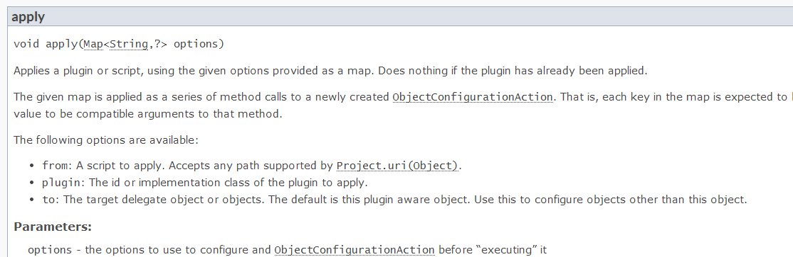

我这里不遗余力的列出 API 图片，就是希望大家在写脚本的时候，碰到不会的，一定要去查看 API 文档！

\2. 设置属性

如果是单个脚本，则不需要考虑属性的跨脚本传播，但是 Gradle 往往包含不止一个 build.gradle 文件，比如我设置的 utils.gradle，settings.gradle。如何在多个脚本中设置属性呢？

Gradle 提供了一种名为**extra property**的方法。**extra property**是额外属性的意思，在第一次定义该属性的时候需要通过 ext 前缀来标示它是一个额外的属性。定义好之后，后面的存取就不需要 ext 前缀了。ext 属性支持 Project 和 Gradle 对象。即 Project 和 Gradle 对象都可以设置 ext 属性

举个例子：

我在 settings.gradle 中想为 Gradle 对象设置一些外置属性，所以在 initMinshengGradleEnvironment 函数中

复制代码

```
def initMinshengGradleEnvironment(){  
    // 属性值从 local.properites 中读取  
    Propertiesproperties = new Properties()  
    FilepropertyFile = new File(rootDir.getAbsolutePath() +"/local.properties")  
   properties.load(propertyFile.newDataInputStream())  
    //gradle 就是 gradle 对象。它默认是 Settings 和 Project 的成员变量。可直接获取  
   //ext 前缀，表明操作的是外置属性。api 是一个新的属性名。前面说过，只在  
   // 第一次定义或者设置它的时候需要 ext 前缀  
    gradle.ext.api =properties.getProperty('sdk.api')  
     
    println gradle.api  // 再次存取 api 的时候，就不需要 ext 前缀了  
    ......  
    } 
```

再来一个例子强化一下：

我在 utils.gradle 中定义了一些函数，然后想在其他 build.gradle 中调用这些函数。那该怎么做呢？

[utils.gradle]

复制代码

```
//utils.gradle 中定义了一个获取 AndroidManifests.xmlversionName 的函数  
def  getVersionNameAdvanced(){  
&#140;  下面这行代码中的 project 是谁？  
   defxmlFile = project.file("AndroidManifest.xml")  
   defrootManifest = new XmlSlurper().parse(xmlFile)  
   returnrootManifest['@android:versionName']    
}  
// 现在，想把这个 API 输出到各个 Project。由于这个 utils.gradle 会被每一个 Project Apply，所以  
// 我可以把 getVersionNameAdvanced 定义成一个 closure，然后赋值到一个外部属性  
&#141;  下面的 ext 是谁的 ext？  
ext{ // 此段花括号中代码是闭包  
    // 除了 ext.xxx=value 这种定义方法外，还可以使用 ext{}这种书写方法。  
    //ext{}不是 ext(Closure) 对应的函数调用。但是 ext{}中的{}确实是闭包。  
    getVersionNameAdvanced = this.&getVersionNameAdvanced  
 } 
```

上面代码中有两个问题：

- project 是谁？
- ext 是谁的 ext？

上面两个问题比较关键，我也是花了很长时间才搞清楚。这两个问题归结到一起，其实就是：

**加载 utils.gradle 的 Project 对象和 utils.gradle 本身所代表的 Script 对象到底有什么关系？**

我们在 Groovy 中也讲过怎么在一个 Script 中 import 另外一个 Script 中定义的类或者函数（见**3.5 脚本类、文件 I/O 和 XML 操作一节**）。在 Gradle 中，这一块的处理比 Groovy 要复杂，具体怎么搞我还没完全弄清楚，但是 Project 和 utils.gradle 对于的 Script 的对象的关系是：

- 当一个 Project apply 一个 gradle 文件的时候，这个 gradle 文件会转换成一个 Script 对象。这个，相信大家都已经知道了。
- Script 中有一个 delegate 对象，这个 delegate 默认是加载（即调用 apply）它的 Project 对象。但是，在 apply 函数中，有一个 from 参数，还有一个 to 参数（参考**图 31**）。通过 to 参数，你可以把 delegate 对象指定为别的东西。
- delegate 对象是什么意思？当你在 Script 中操作一些不是 Script 自己定义的变量，或者函数时候，gradle 会到 Script 的 delegate 对象去找，看看有没有定义这些变量或函数。

现在你知道问题 1,2 和答案了：

- 问题 1：project 就是加载 utils.gradle 的 project。由于 posdevice 有 5 个 project，所以 utils.gradle 会分别加载到 5 个 project 中。所以，getVersionNameAdvanced 才不用区分到底是哪个 project。反正一个 project 有一个 utils.gradle 对应的 Script。
- 问题 2：ext：自然就是 Project 对应的 ext 了。此处为 Project 添加了一些 closure。那么，在 Project 中就可以调用 getVersionNameAdvanced 函数了

比如：我在 posdevice 每个 build.gradle 中都有如下的代码：

复制代码

```
tasks.getByName("assemble"){  
   it.doLast{  
       println "$project.name: After assemble, jar libs are copied tolocal repository"  
        copyOutput(true)  //copyOutput 是 utils.gradle 输出的 closure  
     }  
}  
```

**通过这种方式，我将一些常用的函数放到 utils.gradle 中，然后为加载它的 Project 设置 ext 属性。最后，Project 中就可以调用这种赋值函数了！**

注意：此处我研究的还不是很深，而且我个人感觉：

1. 在 Java 和 Groovy 中：我们会把常用的函数放到一个辅助类和公共类中，然后在别的地方 import 并调用它们。
2. 但是在 Gradle，更正规的方法是在 xxx.gradle 中定义插件。然后通过添加 Task 的方式来完成工作。gradle 的 user guide 有详细介绍如何实现自己的插件。

\3. Task 介绍

Task 是 Gradle 中的一种数据类型，它代表了一些要执行或者要干的工作。不同的插件可以添加不同的 Task。每一个 Task 都需要和一个 Project 关联。

Task 的 API 文档位于**[ https://docs.gradle.org/current/dsl/org.gradle.api.Task.html ](https://docs.gradle.org/current/dsl/org.gradle.api.Task.html)**。关于 Task，我这里简单介绍下 build.gradle 中怎么写它，以及 Task 中一些常见的类型

关于 Task。来看下面的例子：

[build.gradle]

复制代码

```
//Task 是和 Project 关联的，所以，我们要利用 Project 的 task 函数来创建一个 Task  
task myTask  <==myTask 是新建 Task 的名字  
task myTask { configure closure }  
task myType << { task action } <== 注意，<< 符号是 doLast 的缩写  
task myTask(type: SomeType)  
task myTask(type: SomeType) { configure closure } 
```

上述代码中都用了 Project 的一个函数，名为 task，注意：

- 一个 Task 包含若干 Action。所以，Task 有 doFirst 和 doLast 两个函数，用于添加需要最先执行的 Action 和需要和需要最后执行的 Action。Action 就是一个闭包。
- Task 创建的时候可以指定 Type，通过**type: 名字**表达。这是什么意思呢？其实就是告诉 Gradle，这个新建的 Task 对象会从哪个基类 Task 派生。比如，Gradle 本身提供了一些通用的 Task，最常见的有 Copy 任务。Copy 是 Gradle 中的一个类。当我们：**task myTask(type:Copy)**的时候，创建的 Task 就是一个 Copy Task。
- 当我们使用 **task myTask{ xxx}** 的时候。花括号是一个 closure。这会导致 gradle 在创建这个 Task 之后，返回给用户之前，会先执行 closure 的内容。
- 当我们使用 **task myTask << {xxx}** 的时候，我们创建了一个 Task 对象，同时把 closure 做为一个 action 加到这个 Task 的 action 队列中，并且告诉它“最后才执行这个 closure”（**注意，<< 符号是 doLast 的代表**）。

图 32 是 Project 中关于 task 函数说明：

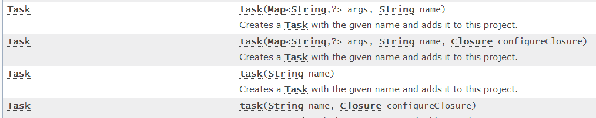

陆陆续续讲了这么些内容，我自己感觉都有点烦了。是得，Gradle 用一整本书来讲都嫌不够呢。

anyway，到目前为止，我介绍的都是一些比较基础的东西，还不是特别多。但是后续例子该涉及到的知识点都有了。下面我们直接上例子。这里有两个例子：

- posdevice 的例子
- 另外一个是单个 project 的例子

**4.4.3 posdevice 实例**

现在正是开始通过例子来介绍怎么玩 gradle。这里要特别强调一点，根据 Gradle 的哲学。gradle 文件中包含一些所谓的**Script Block**（**姑且这么称它**）。**Script Block**作用是让我们来配置相关的信息。不同的**SB**有不同的需要配置的东西。这也是我最早说的行话。比如，源码对应的 SB，就需要我们配置源码在哪个文件夹里。关于 SB，我们后面将见识到！

posdevice 是一个 multi project。下面包含 5 个 Project。对于这种 Project，请大家回想下我们该创建哪些文件？

- settings.gradle 是必不可少的
- 根目录下的 build.gradle。这个我们没讲过，因为 posdevice 的根目录本身不包含代码，而是包含其他 5 个子 project。
- 每个 project 目录下包含对于的 build.gradle
- 另外，我把常用的函数封装到一个名为 utils.gradle 的脚本里了。

马上一个一个来看它们。

\1. utils.gradle

utils.gradle 是我自己加的，为我们团队特意加了一些常见函数。主要代码如下：

[utils.gradle]

复制代码

```
import groovy.util.XmlSlurper  // 解析 XML 时候要引入这个 groovy 的 package  
   
def copyFile(String srcFile,dstFile){  
     ......// 拷贝文件函数，用于将最后的生成物拷贝到指定的目录  
}  
def rmFile(String targetFile){  
    .....// 删除指定目录中的文件  
}  
   
def cleanOutput(boolean bJar = true){  
    ....//clean 的时候清理  
}  
   
def copyOutput(boolean bJar = true){  
    ....//copyOutput 内部会调用 copyFile 完成一次 build 的产出物拷贝  
}  
   
def getVersionNameAdvanced(){// 老朋友  
   defxmlFile = project.file("AndroidManifest.xml")  
   defrootManifest = new XmlSlurper().parse(xmlFile)  
   returnrootManifest['@android:versionName']    
}  
   
// 对于 android library 编译，我会 disable 所有的 debug 编译任务  
def disableDebugBuild(){  
  //project.tasks 包含了所有的 tasks，下面的 findAll 是寻找那些名字中带 debug 的 Task。  
  // 返回值保存到 targetTasks 容器中  
  def targetTasks = project.tasks.findAll{task ->  
     task.name.contains("Debug")  
  }  
  // 对满足条件的 task，设置它为 disable。如此这般，这个 Task 就不会被执行  
 targetTasks.each{  
     println"disable debug task  :${it.name}"  
    it.setEnabled false  
  }  
}  
// 将函数设置为 extra 属性中去，这样，加载 utils.gradle 的 Project 就能调用此文件中定义的函数了  
ext{  
    copyFile= this.©File  
    rmFile =this.&rmFile  
   cleanOutput = this.&cleanOutput  
   copyOutput = this.©Output  
   getVersionNameAdvanced = this.&getVersionNameAdvanced  
   disableDebugBuild = this.&disableDebugBuild  
}  
```

图 33 展示了被 disable 的 Debug 任务的部分信息：

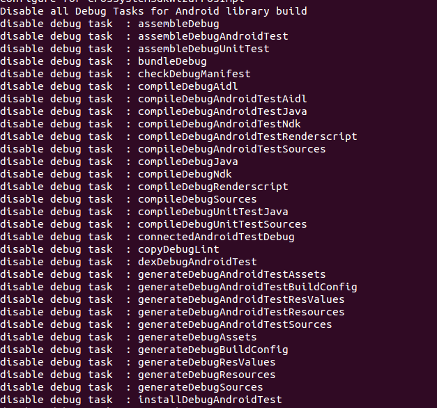

1. settings.gradle

这个文件中我们该干什么？调用 include 把需要包含的子 Project 加进来。代码如下：

[settings.gradle]

复制代码

```
/* 我们团队内部建立的编译环境初始化函数 
  这个函数的目的是 
  1  解析一个名为 local.properties 的文件，读取 AndroidSDK 和 NDK 的路径 
  2  获取最终产出物目录的路径。这样，编译完的 apk 或者 jar 包将拷贝到这个最终产出物目录中 
  3 获取 Android SDK 指定编译的版本 
*/  
def initMinshengGradleEnvironment(){  
    println"initialize Minsheng Gradle Environment ....."  
   Properties properties = new Properties()  
   //local.properites 也放在 posdevice 目录下  
    FilepropertyFile = new File(rootDir.getAbsolutePath()+ "/local.properties")  
   properties.load(propertyFile.newDataInputStream())  
    /* 
      根据 Project、Gradle 生命周期的介绍，settings 对象的创建位于具体 Project 创建之前 
      而 Gradle 底对象已经创建好了。所以，我们把 local.properties 的信息读出来后，通过 
     extra 属性的方式设置到 gradle 对象中 
      而具体 Project 在执行的时候，就可以直接从 gradle 对象中得到这些属性了！ 
    */  
    gradle.ext.api =properties.getProperty('sdk.api')  
    gradle.ext.sdkDir =properties.getProperty('sdk.dir')  
     gradle.ext.ndkDir =properties.getProperty('ndk.dir')  
     gradle.ext.localDir =properties.getProperty('local.dir')  
    // 指定 debugkeystore 文件的位置，debug 版 apk 签名的时候会用到  
    gradle.ext.debugKeystore= properties.getProperty('debug.keystore')  
     ......  
    println"initialize Minsheng Gradle Environment completes..."  
}  
// 初始化  
initMinshengGradleEnvironment()  
// 添加子 Project 信息  
include 'CPosSystemSdk' , 'CPosDeviceSdk' ,'CPosSdkDemo','CPosDeviceServerApk', 'CPosSystemSdkWizarPosImpl' 
```

注意，对于 Android 来说，local.properties 文件是必须的，它的内容如下：

[local.properties]

复制代码

```
local.dir=/home/innost/workspace/minsheng-flat-dir/  
// 注意，根据 Android Gradle 的规范，只有下面两个属性是必须的，其余都是我自己加的  
sdk.dir=/home/innost/workspace/android-aosp-sdk/  
ndk.dir=/home/innost/workspace/android-aosp-ndk/  
debug.keystore=/home/innost/workspace/tools/mykeystore.jks  
sdk.api=android-19  
```

再次强调，**sdk.dir**和**ndk.dir**是 Android Gradle 必须要指定的，其他都是我自己加的属性。当然。不编译**ndk**，就不需要**ndk.dir**属性了。

\3. posdevice build.gradle

作为 multi-project 根目录，一般情况下，它的 build.gradle 是做一些全局配置。来看我的 build.gradle

[posdevice build.gradle]

复制代码

```
// 下面这个 subprojects{}就是一个 Script Block  
subprojects {  
  println"Configure for $project.name" // 遍历子 Project，project 变量对应每个子 Project  
  buildscript {  // 这也是一个 SB  
    repositories {//repositories 是一个 SB  
       ///jcenter 是一个函数，表示编译过程中依赖的库，所需的插件可以在 jcenter 仓库中  
       // 下载。  
       jcenter()  
    }  
    dependencies { //SB  
        //dependencies 表示我们编译的时候，依赖 android 开发的 gradle 插件。插件对应的  
       //class path 是 com.android.tools.build。版本是 1.2.3  
        classpath'com.android.tools.build:gradle:1.2.3'  
    }  
   // 为每个子 Project 加载 utils.gradle 。当然，这句话可以放到 buildscript 花括号之后  
   applyfrom: rootProject.getRootDir().getAbsolutePath() + "/utils.gradle"  
 }//buildscript 结束  
}  
```

感觉解释得好苍白，SB 在 Gradle 的 API 文档中也是有的。先来看 Gradle 定义了哪些 SB。如图 34 所示：

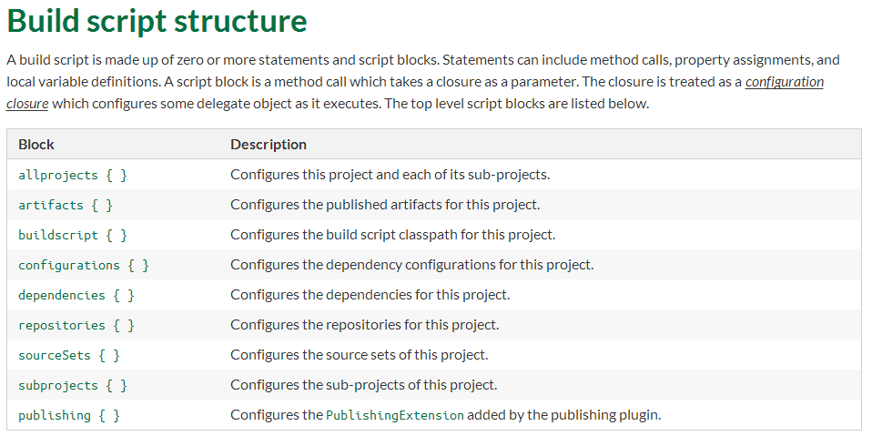

你看，subprojects、dependencies、repositories 都是 SB。那么 SB 到底是什么？它是怎么完成所谓配置的呢？

仔细研究，你会发现 SB 后面都需要跟一个花括号，而花括号，恩，我们感觉里边可能一个 Closure。由于图 34 说，这些 SB 的 Description 都有“Configure xxx for this project”，**所以很可能 subprojects 是一个函数，然后其参数是一个 Closure。是这样的吗？**

Absolutely right。只是这些函数你直接到 Project API 里不一定能找全。不过要是你好奇心重，不妨到**[ https://docs.gradle.org/current/javadoc/ ](https://docs.gradle.org/current/javadoc/)**，选择**Index**这一项，然后**ctrl+f**，输入图 34 中任何一个 Block，你都会找到对应的函数。比如我替你找了几个 API，如图 35 所示：

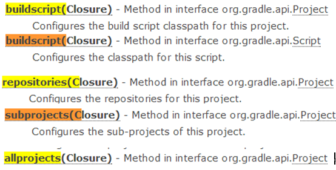

特别提示：当你下次看到一个不认识的 SB 的时候，就去看 API 吧。

下面来解释代码中的各个 SB：

- subprojects：它会遍历 posdevice 中的每个子 Project。在它的 Closure 中，默认参数是子 Project 对应的 Project 对象。由于其他 SB 都在 subprojects 花括号中，所以相当于对每个 Project 都配置了一些信息。
- buildscript：它的 closure 是在一个类型为 ScriptHandler 的对象上执行的。主意用来所依赖的 classpath 等信息。通过查看 ScriptHandler API 可知，在 buildscript SB 中，你可以调用 ScriptHandler 提供的 repositories(Closure )、dependencies(Closure) 函数。这也是为什么 repositories 和 dependencies 两个 SB 为什么要放在 buildscript 的花括号中的原因。**明白了？这就是所谓的行话，得知道规矩。不知道规矩你就乱了。记不住规矩，又不知道查 SDK，那么就彻底抓瞎，只能到网上到处找答案了！**
- 关于 repositories 和 dependencies，大家直接看 API 吧。后面碰到了具体代码我们再来介绍

\4. CPosDeviceSdk build.gradle

CPosDeviceSdk 是一个 Android Library。按 Google 的想法，Android Library 编译出来的应该是一个 AAR 文件。但是我的项目有些特殊，我需要发布 CPosDeviceSdk.jar 包给其他人使用。jar 在编译过程中会生成，但是它不属于 Android Library 的标准输出。在这种情况下，我需要在编译完成后，主动 copy jar 包到我自己设计的产出物目录中。

复制代码

```
//Library 工程必须加载此插件。注意，加载了 Android 插件就不要加载 Java 插件了。因为 Android  
// 插件本身就是拓展了 Java 插件  
apply plugin: 'com.android.library'   
//android 的编译，增加了一种新类型的 ScriptBlock-->android  
android {  
       // 你看，我在 local.properties 中设置的 API 版本号，就可以一次设置，多个 Project 使用了  
      // 借助我特意设计的 gradle.ext.api 属性  
       compileSdkVersion =gradle.api  // 这两个红色的参数必须设置  
       buildToolsVersion  = "22.0.1"  
       sourceSets{ // 配置源码路径。这个 sourceSets 是 Java 插件引入的  
       main{ //main：Android 也用了  
           manifest.srcFile 'AndroidManifest.xml' // 这是一个函数，设置 manifest.srcFile  
           aidl.srcDirs=['src'] // 设置 aidl 文件的目录  
           java.srcDirs=['src'] // 设置 java 文件的目录  
        }  
     }  
   dependencies {  // 配置依赖关系  
      //compile 表示编译和运行时候需要的 jar 包，fileTree 是一个函数，  
     //dir:'libs'，表示搜索目录的名称是 libs。include:['*.jar']，表示搜索目录下满足 *.jar 名字的 jar  
     // 包都作为依赖 jar 文件  
       compile fileTree(dir: 'libs', include: ['*.jar'])  
   }  
}  //android SB 配置完了  
//clean 是一个 Task 的名字，这个 Task 好像是 Java 插件（这里是 Android 插件）引入的。  
//dependsOn 是一个函数，下面这句话的意思是 clean 任务依赖 cposCleanTask 任务。所以  
// 当你 gradle clean 以执行 clean Task 的时候，cposCleanTask 也会执行  
clean.dependsOn 'cposCleanTask'  
// 创建一个 Task，  
task cposCleanTask() <<{  
    cleanOutput(true)  //cleanOutput 是 utils.gradle 中通过 extra 属性设置的 Closure  
}  
// 前面说了，我要把 jar 包拷贝到指定的目录。对于 Android 编译，我一般指定 gradle assemble  
// 它默认编译 debug 和 release 两种输出。所以，下面这个段代码表示：  
//tasks 代表一个 Projects 中的所有 Task，是一个容器。getByName 表示找到指定名称的任务。  
// 我这里要找的 assemble 任务，然后我通过 doLast 添加了一个 Action。这个 Action 就是 copy  
// 产出物到我设置的目标目录中去  
tasks.getByName("assemble"){  
   it.doLast{  
       println "$project.name: After assemble, jar libs are copied tolocal repository"  
        copyOutput(true)  
     }  
}  
/* 
  因为我的项目只提供最终的 release 编译出来的 Jar 包给其他人，所以不需要编译 debug 版的东西 
  当 Project 创建完所有任务的有向图后，我通过 afterEvaluate 函数设置一个回调 Closure。在这个回调 
  Closure 里，我 disable 了所有 Debug 的 Task 
*/  
project.afterEvaluate{  
    disableDebugBuild()  
}  
```

Android 自己定义了好多 ScriptBlock。Android 定义的 DSL 参考文档在

**[https://developer.android.com/tools/building/plugin-for-gradle.html ](https://developer.android.com/tools/building/plugin-for-gradle.html)**下载。注意，它居然没有提供在线文档。

图 36 所示为 Android 的 DSL 参考信息。

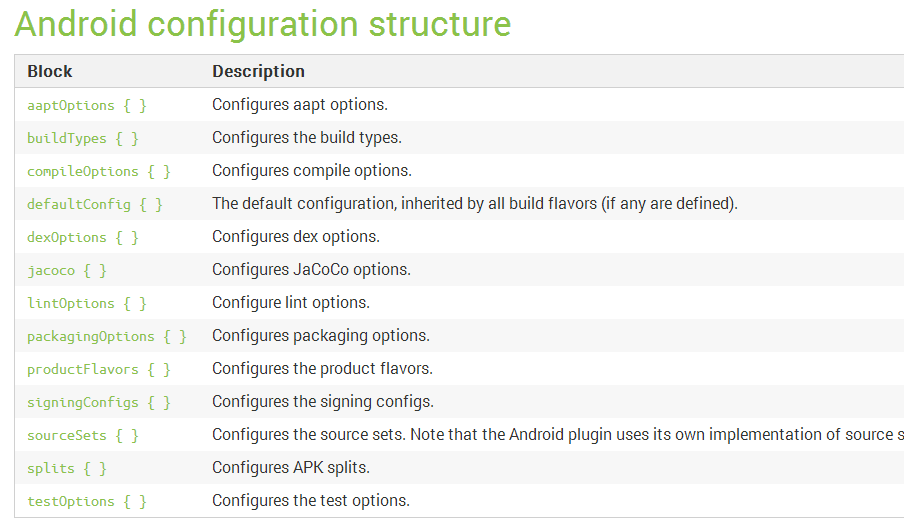

图 37 为**buildToolsVersion**和**compileSdkVersion**的说明：

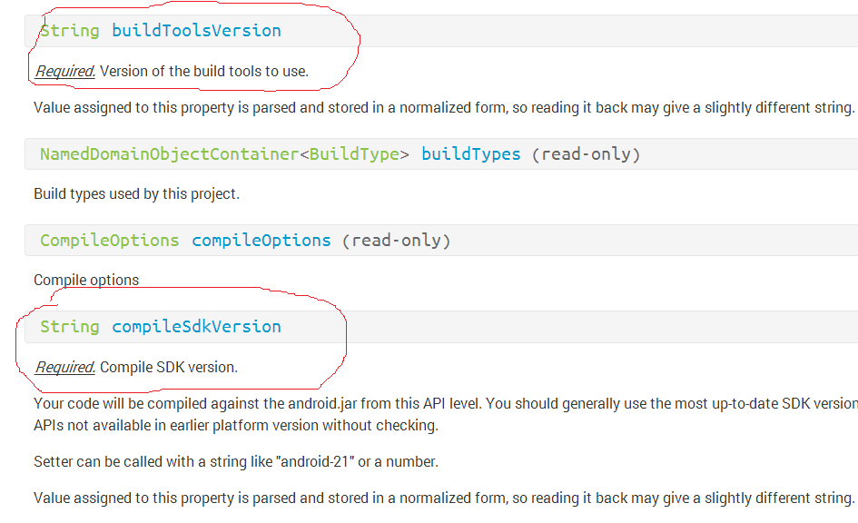

从图 37 可知，这两个变量是必须要设置的…

\5. CPosDeviceServerApk build.gradle

再来看一个 APK 的 build，它包含 NDK 的编译，并且还要签名。根据项目的需求，我们只能签 debug 版的，而 release 版的签名得发布 unsigned 包给领导签名。另外，CPosDeviceServerAPK 依赖 CPosDeviceSdk。

虽然我可以先编译 CPosDeviceSdk，得到对应的 jar 包，然后设置 CPosDeviceServerApk 直接依赖这个 jar 包就好。但是我更希望 CPosDeviceServerApk 能直接依赖于 CPosDeviceSdk 这个工程。这样，整个 posdevice 可以做到这几个 Project 的依赖关系是最新的。

[build.gradle]

复制代码

```
apply plugin: 'com.android.application'  //APK 编译必须加载这个插件  
android {  
      compileSdkVersion gradle.api  
      buildToolsVersion "22.0.1"  
      sourceSets{  // 差不多的设置  
       main{  
           manifest.srcFile 'AndroidManifest.xml'  
          // 通过设置 jni 目录为空，我们可不使用 apk 插件的 jni 编译功能。为什么？因为据说  
         //APK 插件的 jni 功能好像不是很好使.... 晕菜  
          jni.srcDirs = []   
           jniLibs.srcDir 'libs'  
            aidl.srcDirs=['src']  
           java.srcDirs=['src']  
           res.srcDirs=['res']  
        }  
    }//main 结束  
   signingConfigs { // 设置签名信息配置  
       debug {  // 如果我们在 local.properties 设置使用特殊的 keystore，则使用它  
           // 下面这些设置，无非是函数调用.... 请务必阅读 API 文档  
           if(project.gradle.debugKeystore != null){  
              storeFile file("file://${project.gradle.debugKeystore}")  
              storePassword "android"  
              keyAlias "androiddebugkey"  
              keyPassword "android"  
           }  
        }  
   }//signingConfigs 结束  
     buildTypes {  
       debug {  
           signingConfig signingConfigs.debug  
           jniDebuggable false  
        }  
    }//buildTypes 结束  
   dependencies {  
        //compile：project 函数可指定依赖 multi-project 中的某个子 project  
       compile project(':CPosDeviceSdk')  
       compile fileTree(dir: 'libs', include: ['*.jar'])  
   } //dependices 结束  
  repositories{  
   flatDir {//flatDir：告诉 gradle，编译中依赖的 jar 包存储在 dirs 指定的目录  
           name "minsheng-gradle-local-repository"  
            dirsgradle.LOCAL_JAR_OUT //LOCAL_JAR_OUT 是我存放编译出来的 jar 包的位置  
   }  
  }//repositories 结束  
}//android 结束  
/* 
   创建一个 Task，类型是 Exec，这表明它会执行一个命令。我这里让他执行 ndk 的 
   ndk-build 命令，用于编译 ndk。关于 Exec 类型的 Task，请自行脑补 Gradle 的 API 
*/  
// 注意此处创建 task 的方法，是直接{}喔，那么它后面的 tasks.withType(JavaCompile)  
// 设置的依赖关系，还有意义吗？Think！如果你能想明白，gradle 掌握也就差不多了  
task buildNative(type: Exec, description: 'CompileJNI source via NDK') {  
       if(project.gradle.ndkDir == null) // 看看有没有指定 ndk.dir 路径  
          println "CANNOT Build NDK"  
       else{  
            commandLine "/${project.gradle.ndkDir}/ndk-build",  
               '-C', file('jni').absolutePath,  
               '-j', Runtime.runtime.availableProcessors(),  
               'all', 'NDK_DEBUG=0'  
        }  
  }  
 tasks.withType(JavaCompile) {  
       compileTask -> compileTask.dependsOn buildNative  
  }  
  ......    
 // 对于 APK，除了拷贝 APK 文件到指定目录外，我还特意为它们加上了自动版本命名的功能  
 tasks.getByName("assemble"){  
       it.doLast{  
       println "$project.name: After assemble, jar libs are copied tolocal repository"  
       project.ext.versionName = android.defaultConfig.versionName  
       println "\t versionName = $versionName"  
       copyOutput(false)  
     }  
}  
```

\6. 结果展示

在 posdevice 下执行 gradle assemble 命令，最终的输出文件都会拷贝到我指定的目录，结果如图 38 所示：

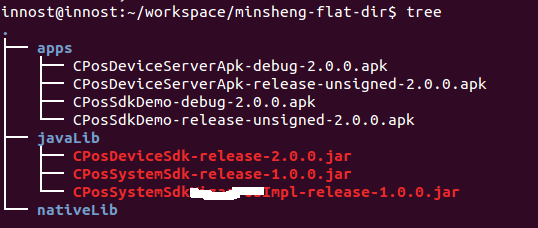

图 38 所示为 posdevice **gradle assemble**的执行结果：

- library 包都编译 release 版的，copy 到 xxx/javaLib 目录下
- apk 编译 debug 和 release-unsigned 版的，copy 到 apps 目录下
- 所有产出物都自动从 AndroidManifest.xml 中提取 versionName。

**4.4.4 实例 2**

下面这个实例也是来自一个实际的 APP。这个 APP 对应的是一个单独的 Project。但是根据我前面的建议，我会把它改造成支持 Multi-Projects Build 的样子。即在工程目录下放一个 settings.build。

另外，这个 app 有一个特点。它有三个版本，分别是 debug、release 和 demo。这三个版本对应的代码都完全一样，但是在运行的时候需要从 assets/runtime_config 文件中读取参数。参数不同，则运行的时候会跳转到 debug、release 或者 demo 的逻辑上。

注意：我知道 assets/runtime_config 这种做法不 decent，但，这是一个既有项目，我们只能做小范围的适配，而不是伤筋动骨改用更好的方法。另外，从未来的需求来看，暂时也没有大改的必要。

引入 gradle 后，我们该如何处理呢？

解决方法是：在编译 build、release 和 demo 版本前，在 build.gradle 中自动设置 runtime_config 的内容。代码如下所示：

[build.gradle]

复制代码

```
apply plugin: 'com.android.application'  // 加载 APP 插件  
// 加载 utils.gradle  
apply from:rootProject.getRootDir().getAbsolutePath() + "/utils.gradle"  
//buildscript 设置 android app 插件的位置  
buildscript {  
   repositories { jcenter() }  
   dependencies { classpath 'com.android.tools.build:gradle:1.2.3' }  
}  
//androidScriptBlock  
android {  
   compileSdkVersion gradle.api  
   buildToolsVersion "22.0.1"  
   sourceSets{// 源码设置 SB  
        main{  
           manifest.srcFile 'AndroidManifest.xml'  
           jni.srcDirs = []  
           jniLibs.srcDir 'libs'  
           aidl.srcDirs=['src']  
           java.srcDirs=['src']  
           res.srcDirs=['res']  
           assets.srcDirs = ['assets'] // 多了一个 assets 目录  
        }  
    }  
   signingConfigs {// 签名设置  
       debug {  //debug 对应的 SB。注意  
           if(project.gradle.debugKeystore != null){  
               storeFile file("file://${project.gradle.debugKeystore}")  
               storePassword "android"  
               keyAlias "androiddebugkey"  
               keyPassword "android"  
           }  
        }  
    }  
    /* 
     最关键的内容来了： buildTypesScriptBlock. 
     buildTypes 和上面的 signingConfigs，当我们在 build.gradle 中通过{}配置它的时候， 
     其背后的所代表的对象是 NamedDomainObjectContainer<BuildType> 和 
     NamedDomainObjectContainer<SigningConfig> 
     注意，NamedDomainObjectContainer<BuildType/ 或者 SigningConfig> 是一种容器， 
     容器的元素是 BuildType 或者 SigningConfig。我们在 debug{}要填充 BuildType 或者 
    SigningConfig 所包的元素，比如 storePassword 就是 SigningConfig 类的成员。而 proguardFile 等 
    是 BuildType 的成员。 
    那么，为什么要使用 NamedDomainObjectContainer 这种数据结构呢？因为往这种容器里 
    添加元素可以采用这样的方法： 比如 signingConfig 为例 
    signingConfig{// 这是一个 NamedDomainObjectContainer<SigningConfig> 
       test1{// 新建一个名为 test1 的 SigningConfig 元素，然后添加到容器里 
         // 在这个花括号中设置 SigningConfig 的成员变量的值 
       } 
      test2{// 新建一个名为 test2 的 SigningConfig 元素，然后添加到容器里 
         // 在这个花括号中设置 SigningConfig 的成员变量的值 
      } 
    } 
    在 buildTypes 中，Android 默认为这几个 NamedDomainObjectContainer 添加了 
    debug 和 release 对应的对象。如果我们再添加别的名字的东西，那么 gradleassemble 的时候 
    也会编译这个名字的 apk 出来。比如，我添加一个名为 test 的 buildTypes，那么 gradle assemble 
    就会编译一个 xxx-test-yy.apk。在此，test 就好像 debug、release 一样。 
   */  
   buildTypes{  
        debug{ // 修改 debug 的 signingConfig 为 signingConfig.debug 配置  
           signingConfig signingConfigs.debug  
        }  
        demo{ //demo 版需要混淆  
           proguardFile 'proguard-project.txt'  
           signingConfig signingConfigs.debug  
        }  
       //release 版没有设置，所以默认没有签名，没有混淆  
    }  
      ......// 其他和 posdevice 类似的处理。来看如何动态生成 runtime_config 文件  
   def  runtime_config_file = 'assets/runtime_config'  
   /* 
   我们在 gradle 解析完整个任务之后，找到对应的 Task，然后在里边添加一个 doFirst Action 
   这样能确保编译开始的时候，我们就把 runtime_config 文件准备好了。 
   注意，必须在 afterEvaluate 里边才能做，否则 gradle 没有建立完任务有向图，你是找不到 
   什么 preDebugBuild 之类的任务的 
   */  
   project.afterEvaluate{  
      // 找到 preDebugBuild 任务，然后添加一个 Action   
      tasks.getByName("preDebugBuild"){  
           it.doFirst{  
               println "generate debug configuration for ${project.name}"  
               def configFile = new File(runtime_config_file)  
               configFile.withOutputStream{os->  
                   os << I am Debug\n'  // 往配置文件里写 I am Debug  
                }  
           }  
        }  
       // 找到 preReleaseBuild 任务  
       tasks.getByName("preReleaseBuild"){  
           it.doFirst{  
               println "generate release configuration for ${project.name}"  
               def configFile = new File(runtime_config_file)  
               configFile.withOutputStream{os->  
                   os << I am release\n'  
               }  
           }  
        }  
       // 找到 preDemoBuild。这个任务明显是因为我们在 buildType 里添加了一个 demo 的元素  
      // 所以 Android APP 插件自动为我们生成的  
       tasks.getByName("preDemoBuild"){  
           it.doFirst{  
               println "generate offlinedemo configuration for${project.name}"  
               def configFile = new File(runtime_config_file)  
               configFile.withOutputStream{os->  
                   os << I am Demo\n'  
               }  
            }  
        }  
    }  
}  
 .....//copyOutput  
```

最终的结果如图 39 所示：

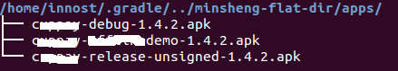

几个问题，为什么我知道有 preXXXBuild 这样的任务？

**答案：gradle tasks --all 查看所有任务。然后，多尝试几次，直到成功**

五、总结

到此，我个人觉得 Gradle 相关的内容都讲完了。很难相信我仅花了 1 个小时不到的时间就为实例 2 添加了 gradle 编译支持。在一周以前，我还觉得这是个心病。回想学习 gradle 的一个月时间里，走过不少弯路，求解问题的思路也和最开始不一样：

- 最开始的时候，我一直把 gradle 当做脚本看。然后到处到网上找怎么配置 gradle。可能能编译成功，但是完全不知道为什么。比如 NameDomainObjectContainer，为什么有 debug、release。能自己加别的吗？不知道怎么加，没有章法，没有参考。出了问题只能 google，找到一个解法，试一试，成功就不管。这么搞，心里不踏实。
- 另外，对语法不熟悉，尤其是 Groovy 语法，虽然看了下快速教材，但总感觉一到 gradle 就看不懂。主要问题还是闭包，比如 Groovy 那一节写得文件拷贝的例子中的 withOutputStream，还有 gradle 中的 withType，都是些啥玩意啊？
- 所以后来下决心先把 Groovy 学会，主要是把自己暴露在闭包里边。另外，Groovy 是一门语言，总得有 SDK 说明吧。写了几个例子，慢慢体会到 Groovy 的好处，也熟悉 Groovy 的语法了。
- 接着开始看 Gradle。Gradle 有几本书，我看过 Gradle in Action。说实话，看得非常痛苦。现在想起来，Gradle 其实比较简单，知道它的生命周期，知道它怎么解析脚本，知道它的 API，几乎很快就能干活。而 Gradle In Action 一上来就很细，而且没有从 API 角度介绍。说个很有趣的事情，书中有个类似下面的例子

复制代码

```
task myTask  <<  {
   println ' I am myTask'
}
```

书中说，如果代码没有加 <<，则这个任务在脚本**initialization**（也就是你无论执行什么任务，这个任务都会被执行，**I am myTask**都会被输出）的时候执行，如果加了**<<**，则在 gradle myTask 后才执行。

我开始完全不知道为什么，死记硬背。**现在你明白了吗？？？？**

这和我们调用 task 这个函数的方式有关！如果没有 <<，则闭包在 task 函数返回前会执行，而如果加了 <<，则变成调用 myTask.doLast 添加一个 Action 了，自然它会等到 grdle myTask 的时候才会执行！

现在想起这个事情我还是很愤怒，API 都说很清楚了…而且，如果你把 Gradle 当做编程框架来看，对于我们这些程序员来说，写这几百行代码，那还算是事嘛？？