# LBE主动防御逆向

url：http://www.wireghost.cn/2015/06/30/LBE%E4%B8%BB%E5%8A%A8%E9%98%B2%E5%BE%A1%E9%80%86%E5%90%91%E5%88%86%E6%9E%90/

**LBE安全大师**

运行程序，LBEApplication会释放assets/hips.jar文件，解压缩至app_hips目录。开启主动防御功能后，会申请获取su权限，运行bootstrap可执行文件。
[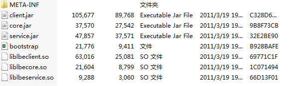](http://www.wireghost.cn/2015/06/30/LBE主动防御逆向分析/1.png)

**hips.jar目录结构**

[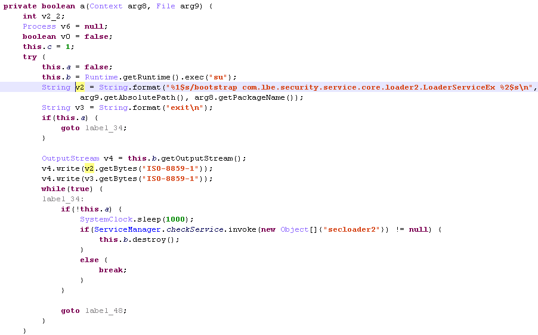](http://www.wireghost.cn/2015/06/30/LBE主动防御逆向分析/2.png)

**获取su权限，运行bootstrap可执行文件**

## Bootstrap：关闭selinux，运行core.jar

Bootstrap文件的作用就是关闭selinux安全机制，为后续的注入工作做准备，并运行core.jar文件。
[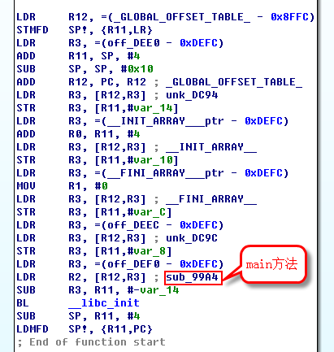](http://www.wireghost.cn/2015/06/30/LBE主动防御逆向分析/3.png)[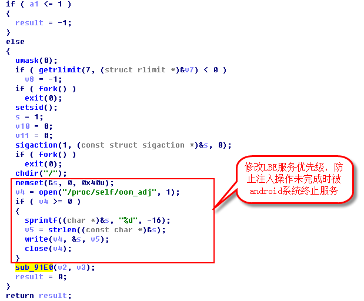](http://www.wireghost.cn/2015/06/30/LBE主动防御逆向分析/4.png)[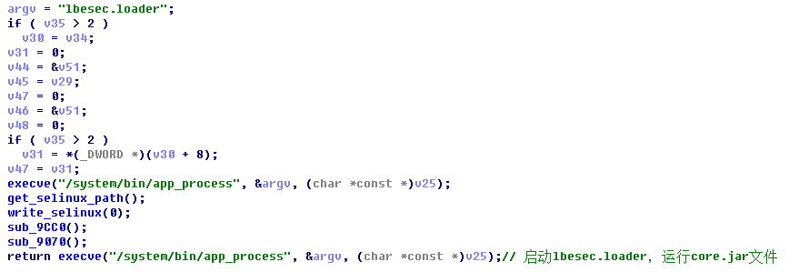](http://www.wireghost.cn/2015/06/30/LBE主动防御逆向分析/5.png)[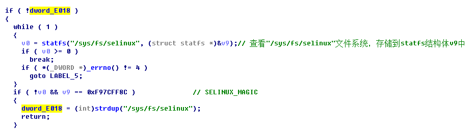](http://www.wireghost.cn/2015/06/30/LBE主动防御逆向分析/6.png)

**直接判断”/sys/fs/selinux”是否为SELINUX_MAGIC，确认是否为selinux目录**

[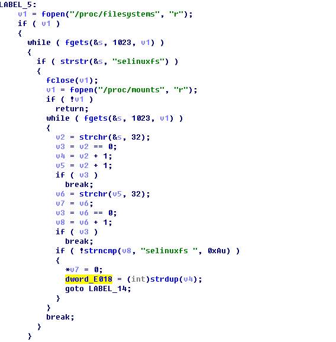](http://www.wireghost.cn/2015/06/30/LBE主动防御逆向分析/7.png)

**通过在/proc/filesystems中找”selinuxfs”，再在”/proc/mounts”中找”selinuxfs”定位selinux目录**

[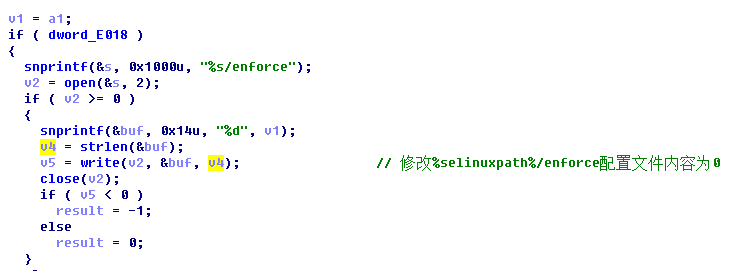](http://www.wireghost.cn/2015/06/30/LBE主动防御逆向分析/8.png)

**关闭selinux**

## core.jar&&core.so：实现进程注入

core.jar包中的主要功能就是将client.jar、client.so注入到所有父进程为Zygote进程的子进程中，并将service.jar和service.so注入到system_server目标进程。
[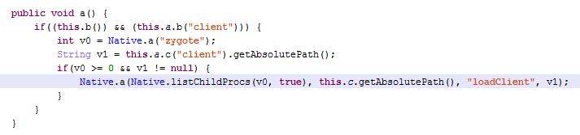](http://www.wireghost.cn/2015/06/30/LBE主动防御逆向分析/9.png)[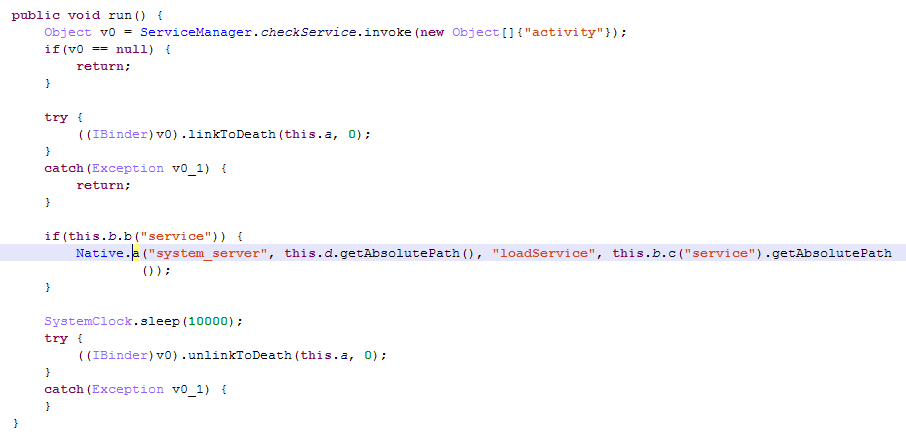](http://www.wireghost.cn/2015/06/30/LBE主动防御逆向分析/10.png)[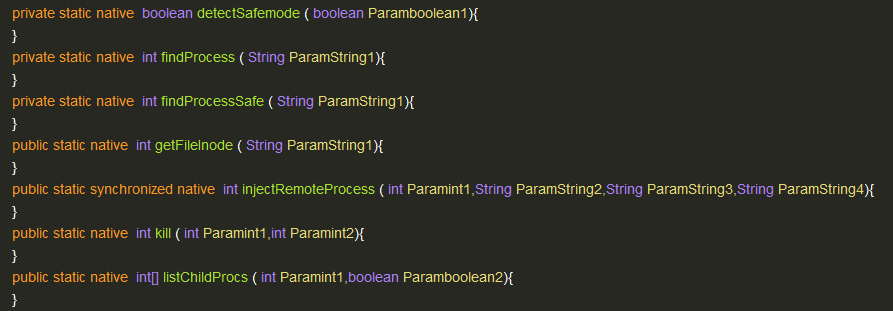](http://www.wireghost.cn/2015/06/30/LBE主动防御逆向分析/11.png)[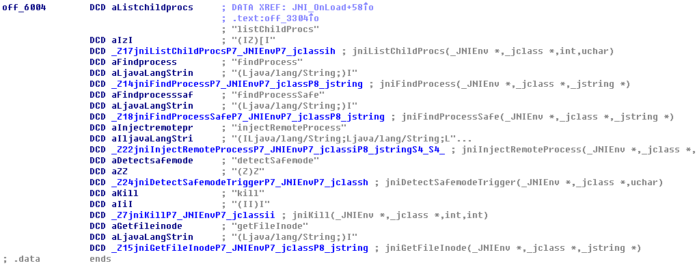](http://www.wireghost.cn/2015/06/30/LBE主动防御逆向分析/12.png)

**core.so 中的 JNINativeMethod结构体**

[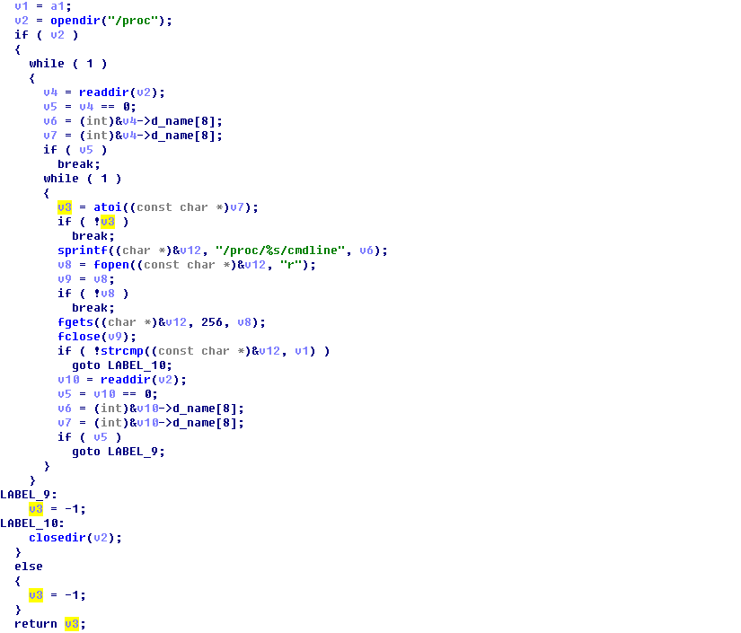](http://www.wireghost.cn/2015/06/30/LBE主动防御逆向分析/13.png)

**通过 /proc/pid/cmdline 文件获取进程pid**

注入代码的具体实现如下：
[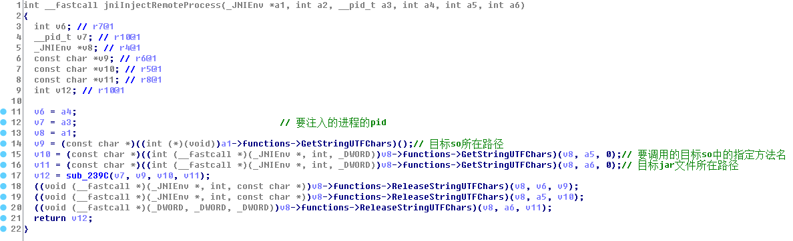](http://www.wireghost.cn/2015/06/30/LBE主动防御逆向分析/14.png)[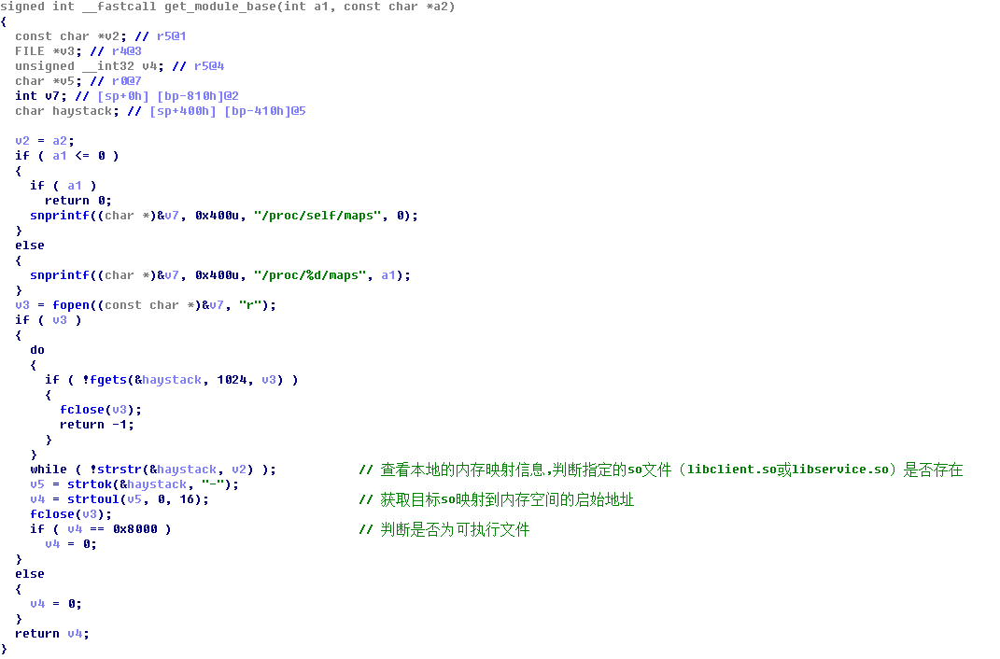](http://www.wireghost.cn/2015/06/30/LBE主动防御逆向分析/15.png)

**获取本地某个模块的起始地址**

先调用dlsym方法获取在当前进程下，mmap、dlopen、dlsym等符号的地址。并计算在该进程中指定的so文件的起始地址与在目标进程中的起始地址的偏移差，从而得到指定函数在目的进程中的虚拟地址。
[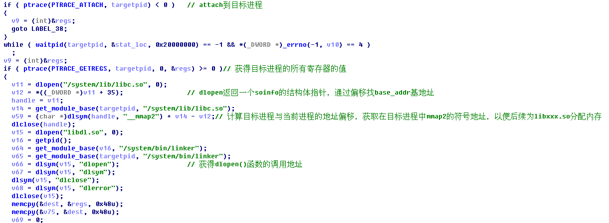](http://www.wireghost.cn/2015/06/30/LBE主动防御逆向分析/16.png)这里计算在soinfo结构体中base基地址的偏移：（128+4+4+4）/4=35
[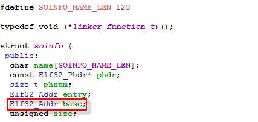](http://www.wireghost.cn/2015/06/30/LBE主动防御逆向分析/17.png)目标进程中所有寄存器的值，被保存到v75指针中。查看pt_regs结构体，可以得知ida中解析出v75、v76、v77这些变量分别对应ARM_r0、ARM_r1、ARM_r2等寄存器。结合后面的分析，可以发现这里是在设置mmap方法所要调用的参数值。需要注意的是，当有4个以上的参数时，多出的参数会写在sp堆栈里。之后，将PC寄存器的值设置为目标进程中mmap函数的地址，并继续执行，实现函数调用。
[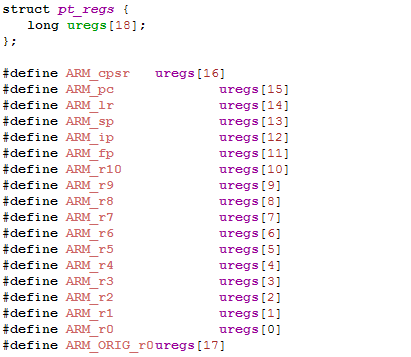](http://www.wireghost.cn/2015/06/30/LBE主动防御逆向分析/18.png)[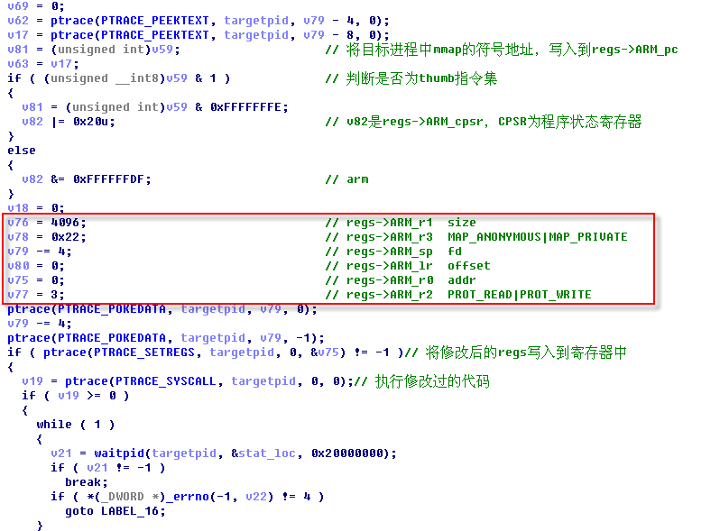](http://www.wireghost.cn/2015/06/30/LBE主动防御逆向分析/19.png)在目标进程中调用mmap申请内存空间后，就可以将要注入的so写入到那片内存，再通过dlopen、dlsym来获取指定函数地址，并调用。
[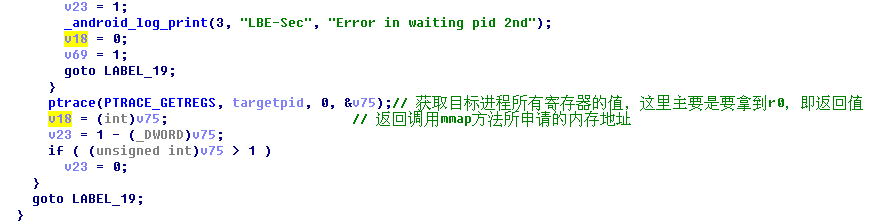](http://www.wireghost.cn/2015/06/30/LBE主动防御逆向分析/20.png)[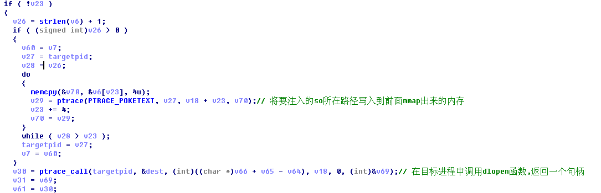](http://www.wireghost.cn/2015/06/30/LBE主动防御逆向分析/21.png)[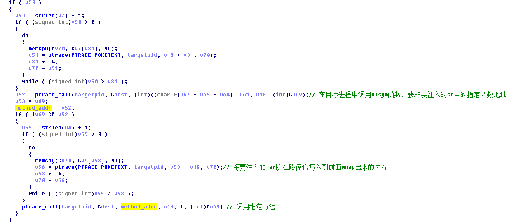](http://www.wireghost.cn/2015/06/30/LBE主动防御逆向分析/22.png)

## 实现类加载器，回调java代码

成功注入后，会调用client.so中的loadClient、service.so中的loadService方法。这2个函数都实现了一个类加载器，会加载对应的jar包，并反射调用java层的指定代码，为后续的hook做准备。
[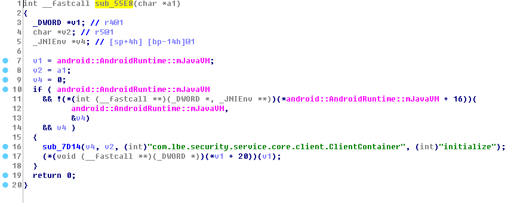](http://www.wireghost.cn/2015/06/30/LBE主动防御逆向分析/23.png)[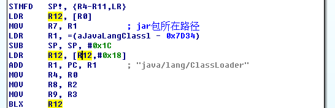](http://www.wireghost.cn/2015/06/30/LBE主动防御逆向分析/24.png)[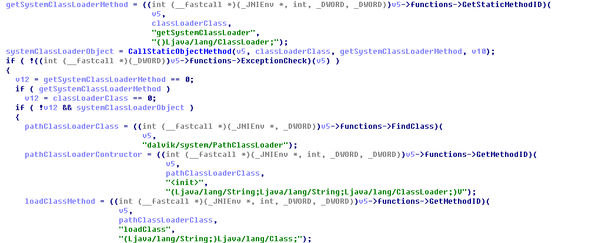](http://www.wireghost.cn/2015/06/30/LBE主动防御逆向分析/25.png)[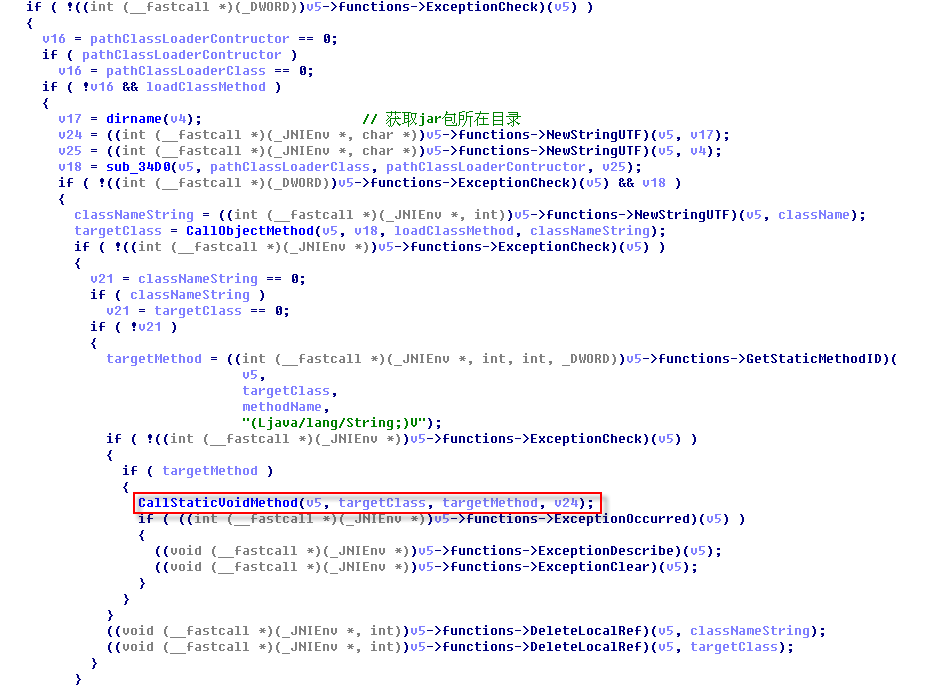](http://www.wireghost.cn/2015/06/30/LBE主动防御逆向分析/26.png)

## client.jar分析

ClientContainer类下的initialize方法，会通过反射获取当前ActivityThread对象的mInstrumentation成员和mH成员的mCallback属性，并将其替换为本地继承了Callback、Instrumentation的自定义类。其中mInstrumentation用于监控应用程序与系统的交互，mH对应的内部类H处理从AMS接收到的消息，从而实现拦截Activity生命周期回调的HOOK功能，这个方式和金山的比较类似。。
[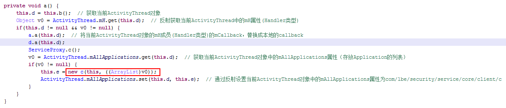](http://www.wireghost.cn/2015/06/30/LBE主动防御逆向分析/27.png)[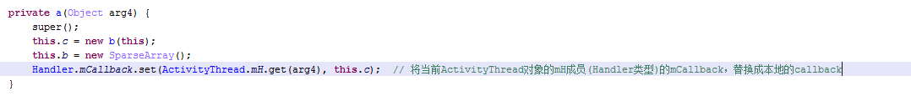](http://www.wireghost.cn/2015/06/30/LBE主动防御逆向分析/28.png)[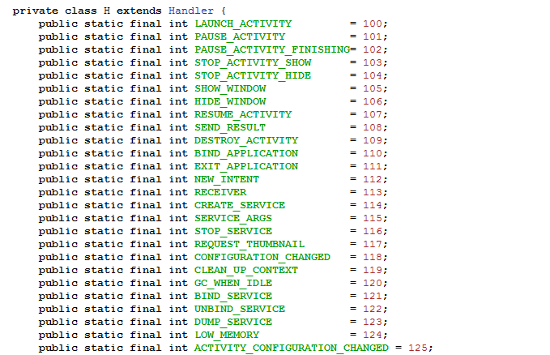](http://www.wireghost.cn/2015/06/30/LBE主动防御逆向分析/29.png)[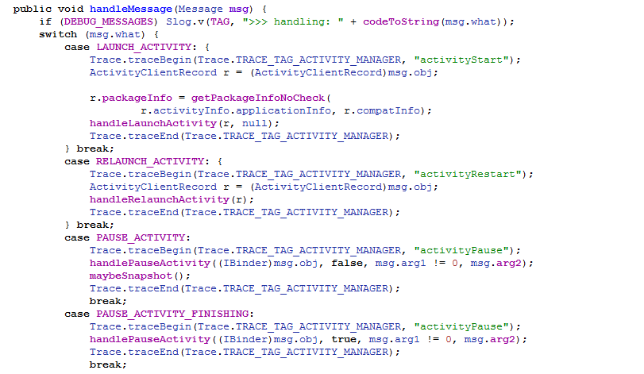](http://www.wireghost.cn/2015/06/30/LBE主动防御逆向分析/30.png)

**ApplicationThread与AMS通过H类的对象mH进行交互，并在handleMessage中处理**

[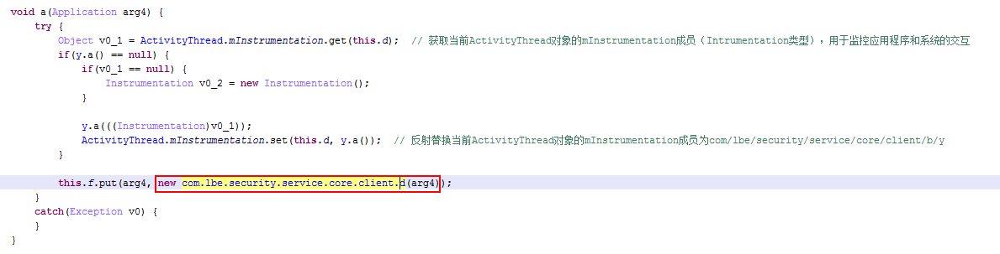](http://www.wireghost.cn/2015/06/30/LBE主动防御逆向分析/31.png)这里简单分析下系统源码，当mH接收到从ActivityMangerService服务的RESUME_ACTIVITY消息时，会调用handleResumeActivity方法，并跳转callActivityOnResume函数，最终调用Activity的onResume方法，使一个Activity变得可见。而注入到应用进程的client.jar会hook当前ActivityThread对象的mInstrumentation成员为com/lbe/security/service/core/client/b/y类（继承了Instrumentation），并在原本的方法上添加了一些代码，达到拦截广告的目的。还是以callActivityOnResume为例，可以发现它在实现了Instrumentation父类中的callActivityOnResume方法后，又做了一次跳转，com/lbe/security/service/core/client/b/z只是一个接口，实际指向com/lbe/security/service/core/client/b下的相应方法，最后调用AdBlockClient类实现广告拦截（具体实现还没有看完，但是感觉和金山毒霸的原理应该是很相近的）。
[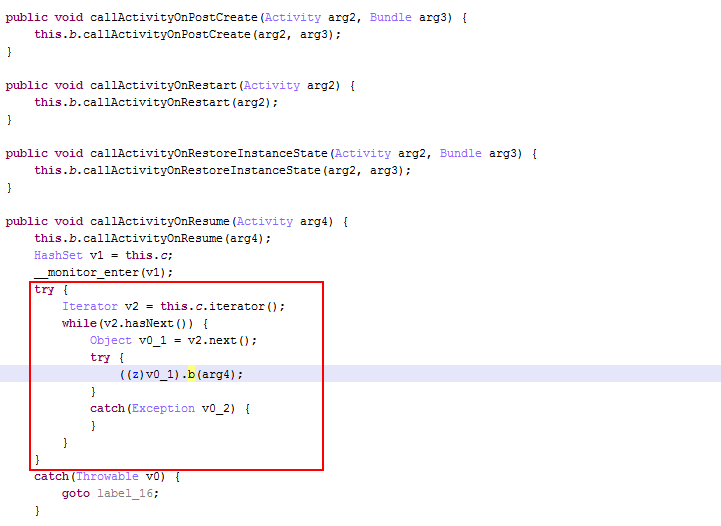](http://www.wireghost.cn/2015/06/30/LBE主动防御逆向分析/32.png)[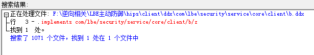](http://www.wireghost.cn/2015/06/30/LBE主动防御逆向分析/33.png)[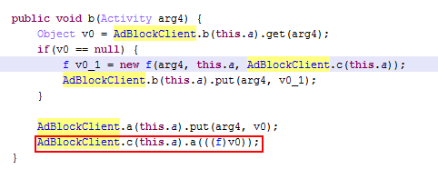](http://www.wireghost.cn/2015/06/30/LBE主动防御逆向分析/34.png)

## 疑惑

1. 对于将service.jar、service.so注入到System_service进程中的作用不是很清楚，相关的hook拦截即主动防御的功能基本都是在client.jar、client.so中实现的。因为要与底层服务进行通信，所以要注入这个进程？
2. 跟进nativeenablehook方法，发现它会为android.webkit.BrowserFrame、com.android.org.chromium.content.browser.ContentViewCore类动态注册nativeloadurl、nativePostUrl、nativeLoadData本地方法。但是这些函数在对应的类路径（系统类）下是有jni方法的，这里就是有个疑问，同一个native方法可以重复注册么，还是说这是jni hook的一种实现方式？
   [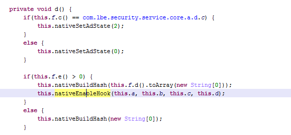](http://www.wireghost.cn/2015/06/30/LBE主动防御逆向分析/35.png)[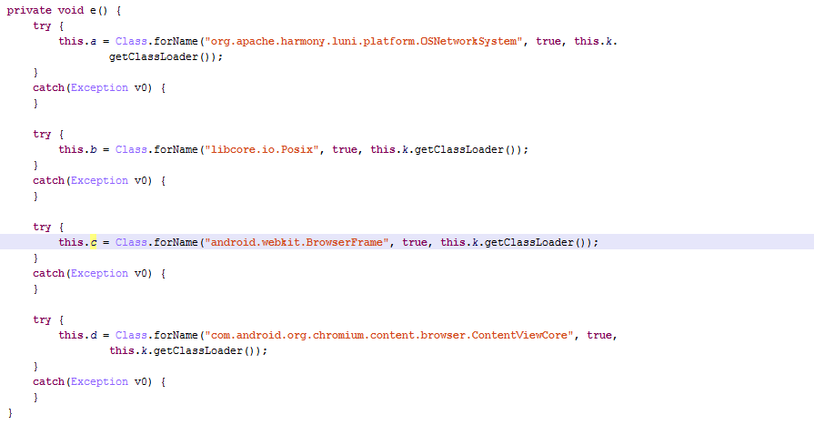](http://www.wireghost.cn/2015/06/30/LBE主动防御逆向分析/36.png)[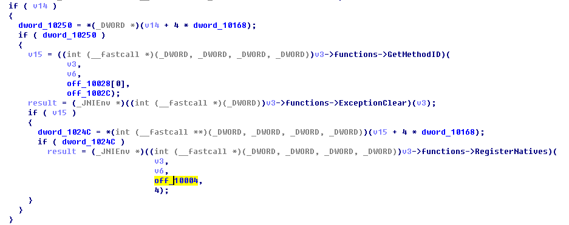](http://www.wireghost.cn/2015/06/30/LBE主动防御逆向分析/37.png)[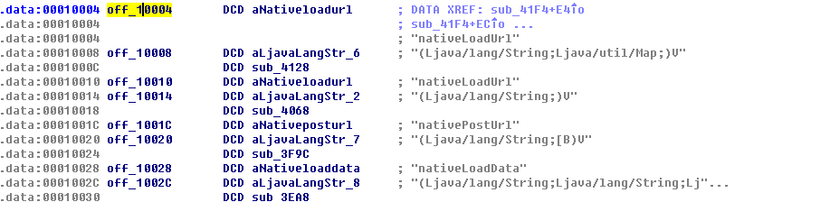](http://www.wireghost.cn/2015/06/30/LBE主动防御逆向分析/38.png)[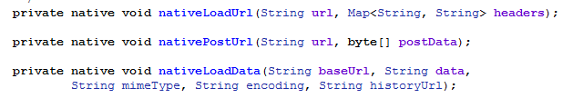](http://www.wireghost.cn/2015/06/30/LBE主动防御逆向分析/39.png)

------ 本文结束 感谢阅读 ------