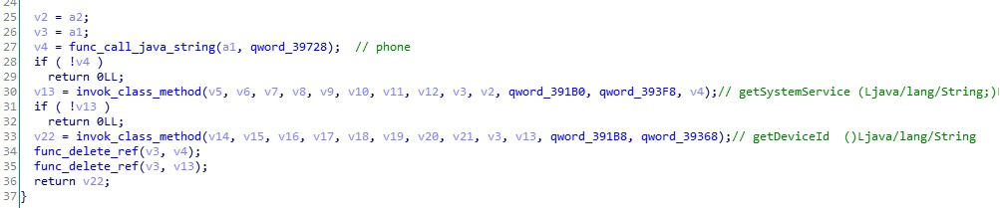
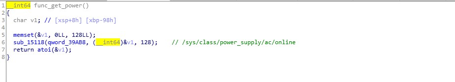
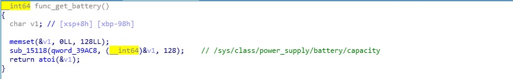
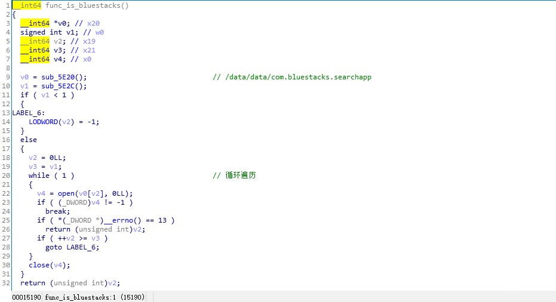
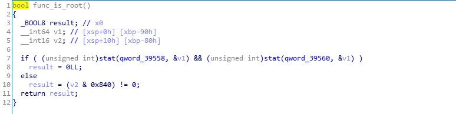

# 对国内某盟ID厂商产品的技术分析（Android版）

url：https://bbs.pediy.com/thread-258656.htm

最近由于公司业务需要，我对Android设备标注和模拟器判断这块进行了一些研究。

后来，看到了看雪之前也谈论过的一些问题，之后我决定动手分析了一下:

 (1) https://bbs.pediy.com/thread-251387.htm

 (2) https://bbs.pediy.com/thread-218339.htm

本文的分析也是基于上面两篇的样本进行深入分析的，希望对大家有点帮助。

**1.基本原理**

看了一下他的so的加载部分，无非就是个壳，然后加载内存加载，再来个Ollvm混淆，最多也就是加个字符串加密。

基于上面两位学友已经成功破解了并抓取了核心SO逻辑，所以我也不做太多分析。

当然，首先声明一下，我只是做一下研究，没有其他意思。至于你们拿去干嘛，我可管不了( [奸笑] )。

**2.特征上报**

首先是，各种通过GetProperty获取的硬件信息（包括品牌、型号、系统API等等）

```
"gsm.sim.state":"ABSENT",
  "gsm.version.baseband":"angler-03.78",
  "gsm.version.ril-impl":"Qualcomm RIL 1.0",
  "net.hostname":"android-541a2dbcc9bf10cd",
  "ro.board.platform":"msm8994",
  "ro.boot.bootloader":"angler-03.64",
  "ro.build.characteristics":"nosdcard",
  "ro.build.date.utc":"1500464208",
  "ro.build.date":"2017... 07... 19... ......... 19:36:48 CST",
  "ro.build.description":"aosp_angler-userdebug 7.1.1 NUF26N eng.cc.20170719.193648 test-keys",
  "ro.build.display.id":"aosp_angler-userdebug 7.1.1 NUF26N eng.cc.20170719.193648 test-keys",
  "ro.build.fingerprint":"Android\/aosp_angler\/angler:7.1.1\/NUF26N\/cc07191936:userdebug\/test-keys",
  "ro.build.host":"Andr0id",
  "ro.build.id":"NUF26N",
  "ro.build.type":"userdebug",
  "ro.boot.serialno":"84B7N16126003133",
  "ro.opengles.version":"196610",
  "ro.product.board":"angler",
  "ro.product.brand":"Android",
  "ro.product.cpu.abi":"arm64-v8a",
  "ro.build.version.sdk":"25",
  "ro.product.manufacturer":"Huawei",
  "gsm.current.phone-type":"1",
  "gsm.network.type":"Unknown",
  "ro.product.model":"AOSP onangler",
  "ro.build.version.release":"7.1.1",
  "ro.product.device":"angler",
  "gsm.operator.isroaming":"false",
  "ro.carrier":"unknown",
  "ro.vendor.extension_library":"libqti-perfd-client.so",
  "keyguard.no_require_sim":"true",
  "wlan.driver.status":"unloaded",
  "ro.runtime.firstboot":"50639810179",
  "init.svc.adbd":"running",
  "ro.hardware":"angler",
  "ro.boot.btmacaddr":"1C:67:58:06:85:30",
  "ro.boot.wifimacaddr":"1C:67:58:06:82:D2",
  "ro.recovery_id":"0x5c5922f5a56969664c1e23f66a7e7a9e86898186000000000000000000000000"}
```

这个不是通过Java获取的，我反编译之后有点麻烦，他给那个GetProperty获取的信息做了混淆，基本上没法看（我在附件那里做了标记，函数名叫f_get_info）

**2.获取设备地址，比如MAC地址、IMEI、IMSI**

这些都是基本操作，随随便便就过了。

 

**
**

**不过厉害的是，他做了一个直接在Linux Api上获取MAC地址的辅助函数**


大概就是创建一个Socket，然后通过ioctl获取MAC地址（直接钩住ioctl别让他返回个假地址，或者直接禁止获取就行了）

不过，经过测试，这个函数只能针对Android 6及以下版本，Android 6以上的获取不了，没什么用

**3.辅助特征**

**辅助特征，就是不直接影响ID的生成，但是辅助它判断是否为同一个设备**

**电池电池特征:
**

**
**



还有，一些Android ID、DNS之类的特征（主要就是调用Java API来实现的）

**4.安全环境检测**

这个是重点，无论你特征去除伪装做得多好，只要它找到模拟器特征，基本上就直接否了

首先是最基本的，也是最常用的两个特征:


```
 "ro.secure":"1",
  "ro.debuggable":"1",
```


然后是各种文件判断，和特征判断



判断是否有roo权限（有的话，会判断为高危设备）：



**5.破解方法**

**这个嘛。。（先说明，我没有恶意，我不想去吃国家饭，哈哈哈）**

**它宣传的刷ROM也没法篡改，这个基本上是不可能的。。。（要是可以的话，黑产早就没饭吃了）**

**直接去掉上述特征，然后伪造个新特征，基本可以过掉。但是需要注意的是，一定要把模拟器特征去掉，最好是用真机，不断去修改特征就行了。****它貌似判断逻辑是云端的，所以它后面应该是有一个比较全面的特征库。就是收集各种手机、和模拟器的特征，然后进行深度比对，如果发现信息不正常，基本上就否掉了。至于怎么过特征。我给提出以下建议：**

 **1.尽量去复制真机的特征（像ro.build.\*、ro.device.\*这类的）**

 **2.尽量隐藏模拟器特征**

 **3.用户行为特征去除(这个的话，直接写个脚本去模拟就行了)**

**其他的还有一些部分没分析，等后面有空了再进行分析一下它的用户行为特征收集。**

**附件上标注不清楚的地方，请自行理解 (没办法，实在太乱了有些地方)**


