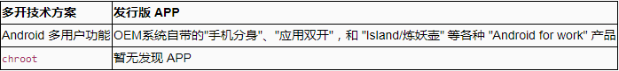
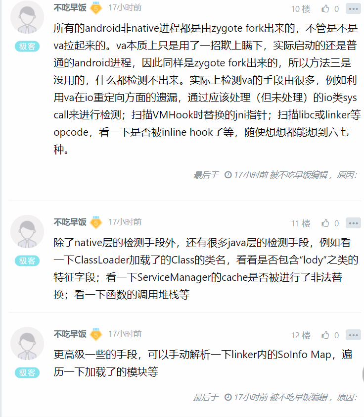

# 黑产对抗系列之 多开检测 

好久没更新了，最近事情比较多，更新有点慢，勿急。本系列会继续更新，希望能够给新手入门带来一些帮助。（本文章仅讨论安卓平台的实现，iOS和Windows的不做叙述）


1. 多开在黑产中的作用和危害

多开/分身原本用于方便有多个微信/QQ解决同时登录的问题，但近来年多被各种黑产所利用，多见于薅羊毛、刷单，部分多开App甚至提供了篡改功能。而普通用户根本不会有多开的需求的App，一旦检测到当前运行在多开环境下，就有理由限制该用户的后续行为。


系统级多开

 




多用户模式主要用到 UserManager 相关类，切换不同的用户，在不同的用户下运行 App，实现多开。 最直观的例子是 Android 手机上的 多用户 功能， 手机分身 功能，以及 am switch-user 命令，这种简单粗暴的用法会将 Android 服务都运行一份，如果只用于应用多开，且不说资源消耗，切换用户确实是麻烦。 在Android 5.0上基于多用户功能 添加了 Android for work 功能，可以在同一个桌面启动器下使用受限用户启动 APP，而不再需要切换界面。同时将权限开发给了非系统应用。 chroot UNIX 的 chroot 系统调用在 Android 上也能用，但是需要 root 权限。 在本地挂载运行精简版系统镜像，使用远程桌面软件如 VNC 等访问本地多开的系统。目前尚未发现发行版 APP，可能在 ARM 服务器云手机中用到。


用户级技术


目前市面上的多开App的原理类似，都是以新进程运行被多开的App，并hook各类系统函数，使被多开的App认为自己是一个正常的App在运行。


从形式上来说多开App有2种形式，一种是从多开App中直接加载被多开的App，如平行空间、VirtualApp等，另一种是让用户新安装一个App，但这个App本质上就是一个壳，用来加载被多开的App，其原理和前一种是一样的，市面上多开分身这款App是用的这种形式，用户每分身一个App需新安装一个包名为dkmodel.xxx.xxx的App。


2.如何对抗？


对抗系统级多开

```
// --- C++ ---

#include <stdlib.h>

bool isDualApp(){

  return 0 != getuid()/100000;

}
```


```
// --- Java ---

static boolean isDualApp()

{

return 0 != Process.myUid() / 100000;

}
```

对抗用户多开

```
public boolean checkByPrivateFilePath(Context context) {

        String path = context.getFilesDir().getPath();

        for (String virtualPkg : virtualPkgs) {

            if (path.contains(virtualPkg)) return true;

        }

        return false;

    }


public boolean checkByHasSameUid() {

        String filter = getUidStrFormat();//拿uid

        String result = CommandUtil.getSingleInstance().exec("ps");

        if (result == null || result.isEmpty()) return false;


        String[] lines = result.split("\n");

        if (lines == null || lines.length <= 0) return false;


        int exitDirCount = 0;

        for (int i = 0; i < lines.length; i++) {

            if (lines[i].contains(filter)) {

                int pkgStartIndex = lines[i].lastIndexOf(" ");

                String processName = lines[i].substring(pkgStartIndex <= 0

                        ? 0 : pkgStartIndex + 1, lines[i].length());

                File dataFile = new File(String.format("/data/data/%s", processName, Locale.CHINA));

                if (dataFile.exists()) {

                    exitDirCount++;

                }

            }

        }


        return exitDirCount > 1;

    }
```


3.全新方法（全新原创）

第2段中所写的方法是从网上抄的，作用也是一般般，但是可以作为一个基本检测来用。从我最近些天研究来看，我发现了一个全新的检测方法。

```
bool checkDualApp(){

  char buf[128];

  readlink("/proc/self/exe",(char*)&buf,127);

  return strstr("app_process") ==0;

}
```


原理：大部分多开APP是通过一个自定义的启动器来启动的，而正常APP都是通过app_process或者app_process64来启动的，这时候只需要判断/proc/self/exe指向的文件是不是指向app_process即可判断是否为真实环境。


经过测试，该方法可以秒杀目前99%的多开APP。


