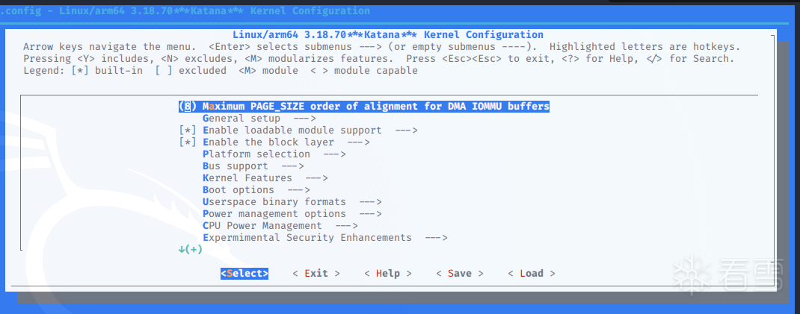
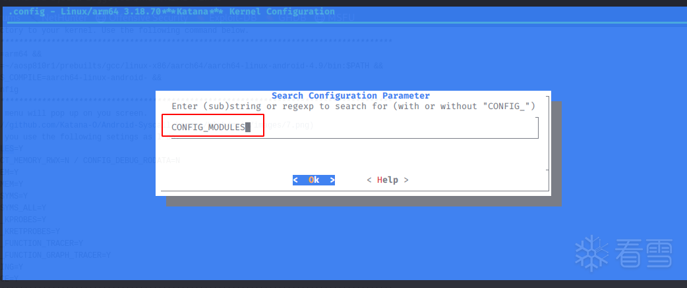
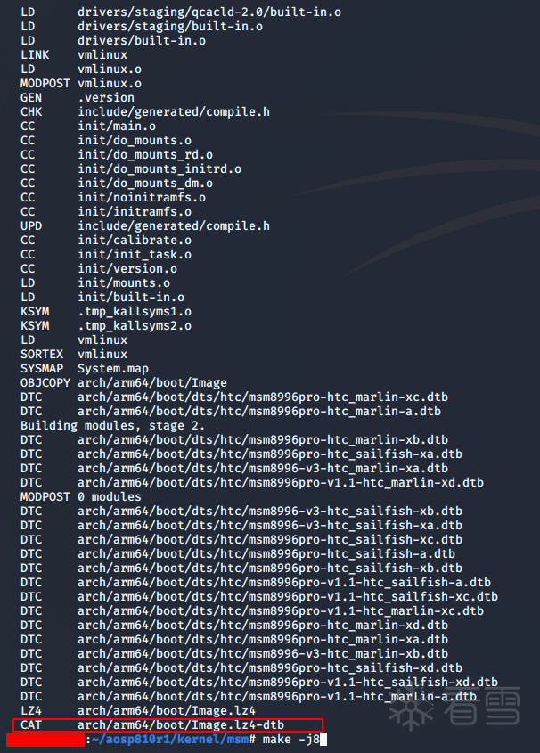
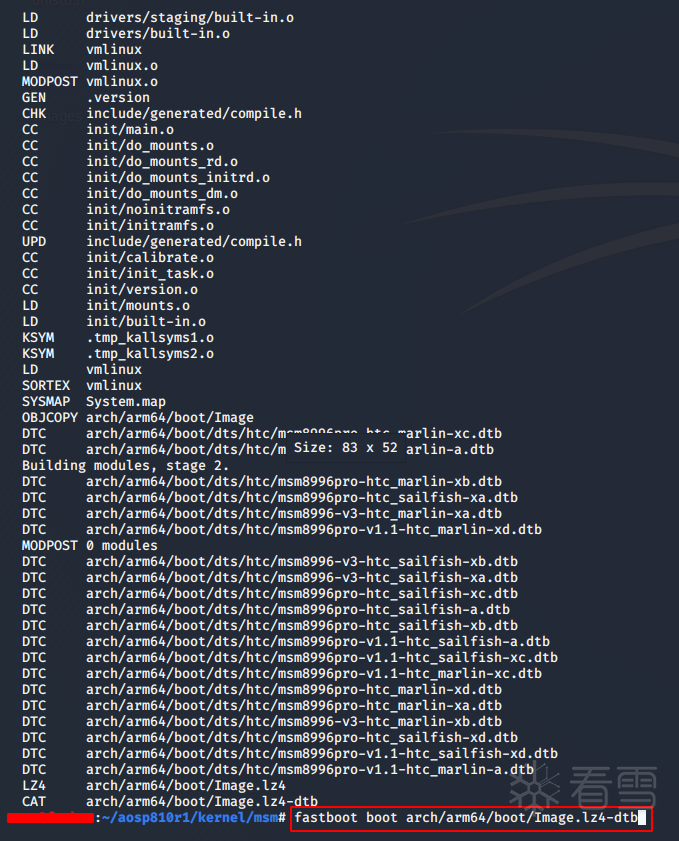
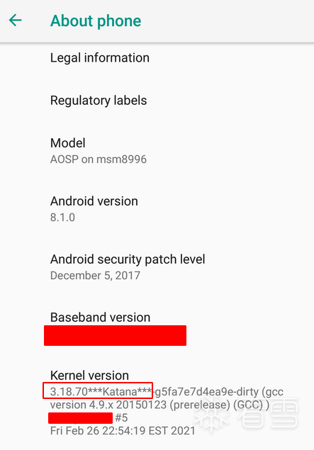
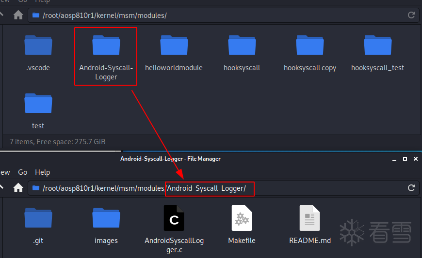
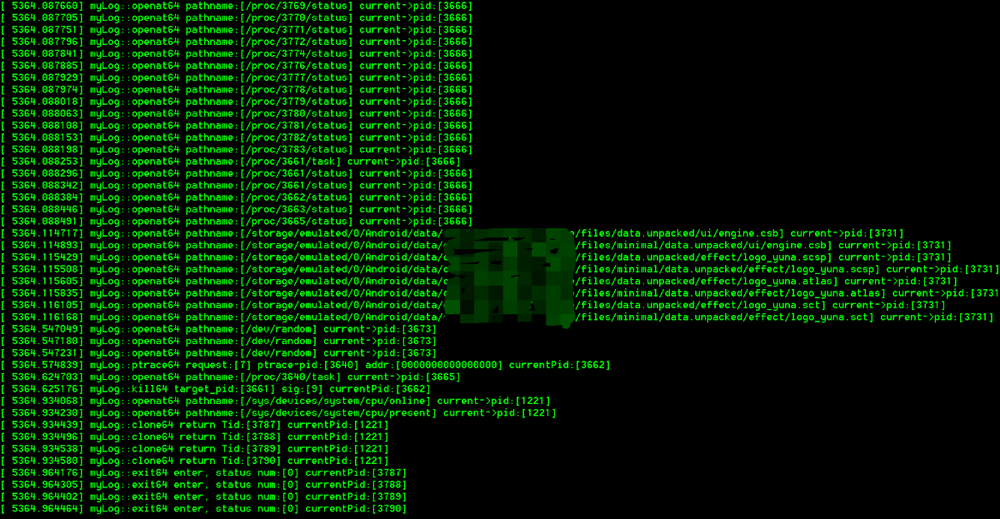

# AndroidSyscallLogger

url：https://bbs.pediy.com/thread-267004.htm


大家好，我是逆向时长一年的逆向练习生喳喳辉。今天，我教你搞内核。
故事是这样纸的，有天我看到有个壳，壳他太猛，各种汇编syscall, 搞得我很烦，不能忍，思考了两秒钟的亚子, 怼通内核就像一道闪电击中了我。
平时不咋发帖，文字规范有啥不足请斧正，并且笔者的知识和外世界的知识总是不停的迭代更替的，部分理解可能存误差，恳请读者斧正。那么正文开始。

# Android-Syscall-Logger

一个通过重写系统调用表帮助你拦截内核调用的内核模块（驱动）

# 前置要求

1. 会刷内核
2. 用这些手机 Pixel(Tested), Pixel 2 XL, Pixel 2, Pixel XL, Pixel C, Nexus 6P, Nexus 5X
3. 使用 8.1.0_r1 安卓系统版本
4. root

# 测试环境

系统：Kali
安卓内核版本：3.18.70-g1292056

# 优势

真机捕获内核调用，比起基于虚拟cpu的调试方向更能降低被检测的概率. 而且不像frida或者xposed需要注入到目标app，是通过改机实现的。

# 直接上手体验部分

不想折腾就直接用我提供的boot.img 和 AndroidSyscallLogger.ko 吧，
到这里下 https://github.com/Katana-O/Android-Syscall-Logger/releases/tag/v1.0
使用方法是 进入 bootloader，
然后 fastboot flash boot boot.img
然后 推送到可执行目录， insmod AndroidSyscallLogger.ko
ok了。

# 定制内核部分

首先说明为什么要定制我们的内核，因为我们的Linux内核平时是不允许人去改写他滴，内核如内裤，不让人随便看，但我们要hook内核调用，那就只能把内裤脱了（内核改了）。
git clone 内核代码到任意目录，我是放在 /aosp/kernel/msm 下的。
然后打开Terminal，并且cd 到 /aosp/kernel/msm 下。
输入以下命令：

```
export ARCH=arm64 &&
export PATH=~/aosp810r1/prebuilts/gcc/linux-x86/aarch64/aarch64-linux-android-4.9/bin:$PATH &&
export CROSS_COMPILE=aarch64-linux-android- &&
make menuconfig
```


然后你可能会看到这个菜单，这个菜单就是kernel hacking的导航页，帮助我们去定制自己的linux内核的。


需要你的内核使用下面的配置

```
CONFIG_MODULES=Y
CONFIG_STRICT_MEMORY_RWX=N / CONFIG_DEBUG_RODATA=N
CONFIG_DEVMEM=Y
CONFIG_DEVKMEM=Y
CONFIG_KALLSYMS=Y
CONFIG_KALLSYMS_ALL=Y
CONFIG_HAVE_KPROBES=Y
CONFIG_HAVE_KRETPROBES=Y
CONFIG_HAVE_FUNCTION_TRACER=Y
CONFIG_HAVE_FUNCTION_GRAPH_TRACER=Y
CONFIG_TRACING=Y
CONFIG_FTRACE=Y
```

咋修改这些配置捏？在导航页按下 / ，搜索下，copy下，回车下，oj8k了。

比如找这个


 

看到这我假设你已经配置好内核了，那么开始编译内核了，跑下 make命令，oj8k了。

make好后，手机启动到 bootloader，我们使用 boot 命令临时启动内核镜像。

重启后，看到这个标签，就知道内核改了，如果你没改名字，看到的应该是 dirty 啥的。


 

定制好了内核后，可以开始写逻辑代码了，首先先写自己的 Makefile 文件，因为内核驱动的编译工具是 Makefile，这里 Kernel Dir 就是改成自己的内核代码存放路径， ToolChain 就是交叉编译用的编译器，这里读者依葫芦画飘。


 

为了确保syscall table的地址准确性，在 shell 里可以通过 cat /proc/kallsyms 来查看我们的table，如果你显示的是0，echo 0 > /proc/sys/kernel/kptr_restrict 用这个命令就能看了。


 

我们在自己的驱动编写目录下用 make 命令生成内核驱动，就会生成一个 .ko 后缀的驱动文件。比如我的工程是在这个目录下的。


 

然后将 .ko 驱动 push 到你的手机有可执行权限的目录。


 

启动你的驱动模块


 

开始监控内核调用


 

哎呀，哎呀，哎呀~~~


# 代码阐述

核心就是先动态找到syscall table的起始位置，这种做法可以规避每次重启手机syscall table的地址都会变的问题，然后再去替换每个syscall table中的函数地址为我们的地址，类似 Windows的SSDT hook。并且中间会遇到log太多的问题，通过判断 当前的 uid 的值来过滤系统的call，使得只保留第三方app的call，而且卸载内核模块会死机，所以卸载时把原来的函数地址还回去。

```
#include "linux/kernel.h"
#include "linux/init.h"
#include "linux/module.h"
#include "linux/moduleparam.h"
#include "asm/unistd.h"
#include "linux/slab.h"
#include "linux/sched.h"
#include "linux/uaccess.h"
#include <linux/syscalls.h>
 
 
void ** sys_call_table64 = (void**)0x0;
 
#define SURPRESS_WARNING __attribute__((unused))
#define LL unsigned long long
 
// find sys_call_table through sys_close address
SURPRESS_WARNING unsigned long long ** findSysCallTable(void) {
   unsigned long long offset;
   unsigned long long **sct;
   int flag = 1;
   for(offset = PAGE_OFFSET; offset < ULLONG_MAX; offset += sizeof(void *)) {
      sct = (unsigned long long**) offset;
      if( (unsigned long long *)sct[__NR_close] == (unsigned long long *)sys_close )
      {
         if(flag == 0){
            printk("myLog::find sys_call_table :%p \n", sct);
            return sct;
         }
         else{
            printk("myLog::find first sys_call_table :%p \n", sct);
            flag--;
         }
      }
   }
   return NULL;
}
 
SURPRESS_WARNING int getCurrentPid(void)
{
   int pid = get_current()->pid;
   return pid;
}
 
SURPRESS_WARNING LL isUserPid(void)
{
   const struct cred * m_cred = current_cred();
   kuid_t uid = m_cred->uid;
   int m_uid = uid.val;
   if(m_uid > 10000)
   {
      return true;
   }
   return false;
}
 
SURPRESS_WARNING asmlinkage LL (*old_openat64)(int dirfd, const char __user* pathname, int flags, umode_t modex);
SURPRESS_WARNING LL new_openat64(int dirfd, const char __user* pathname, int flags, umode_t modex)
{
   LL ret = -1;
   if(isUserPid())
   {
      char bufname[256] = {0};
      strncpy_from_user(bufname, pathname, 255);
      printk("myLog::openat64 pathname:[%s] current->pid:[%d]\n", bufname, getCurrentPid());
   }
   ret = old_openat64(dirfd, pathname, flags, modex);
   return ret;
}
 
//extern "C" long __ptrace(int req, pid_t pid, void* addr, void* data);
SURPRESS_WARNING asmlinkage LL (*old_ptrace64)(int request, pid_t pid, void* addr, void* data);
SURPRESS_WARNING LL new_ptrace64(int request, pid_t pid, void* addr, void* data){
   LL ret = -1;
   if(isUserPid()){
      printk("myLog::ptrace64 request:[%d] ptrace-pid:[%d] addr:[%p] currentPid:[%d]\n", request, pid, addr, getCurrentPid());
   }
   ret = old_ptrace64(request, pid, addr, data);
   return ret;
}
 
//int kill(pid_t pid, int sig);
SURPRESS_WARNING asmlinkage LL (*old_kill64)(pid_t pid, int sig);
SURPRESS_WARNING LL new_kill64(pid_t pid, int sig){
   LL ret = -1;
   if(isUserPid()){
      printk("myLog::kill64 target_pid:[%d] sig:[%d] currentPid:[%d]\n", pid, sig, getCurrentPid());
   }
   ret = old_kill64(pid, sig);
   return ret;
}
 
//int tkill(int tid, int sig);
SURPRESS_WARNING asmlinkage LL (*old_tkill64)(int tid, int sig);
SURPRESS_WARNING LL new_tkill64(int tid, int sig){
   LL ret = -1;
   if(isUserPid()){
      printk("myLog::tkill64 target_tid:[%d] sig:[%d] currentPid:[%d]\n", tid, sig, getCurrentPid());
   }
   ret = old_tkill64(tid, sig);
   return ret;
}
 
//int tgkill(int tgid, int tid, int sig);
SURPRESS_WARNING asmlinkage LL (*old_tgkill64)(int tgid, int tid, int sig);
SURPRESS_WARNING LL new_tgkill64(int tgid, int tid, int sig){
   LL ret = -1;
   if(isUserPid()){
      printk("myLog::tgkill64 tgid:[%d] tid:[%d] sig:[%d] currentPid:[%d]\n", tgid, tid, sig, getCurrentPid());
   }
   ret = old_tgkill64(tgid, tid, sig);
   return ret;
}
 
 
//void exit(int status);
SURPRESS_WARNING asmlinkage LL (*old_exit64)(int status);
SURPRESS_WARNING LL new_exit64(int status){
   LL ret = -1;
   if(isUserPid()){
      printk("myLog::exit64 enter, status num:[%d] currentPid:[%d]\n", status, getCurrentPid());
   }
   ret = old_exit64(status);
   return ret;
}
 
 
//int execve(const char *pathname, char *const argv[], char *const envp[]);
SURPRESS_WARNING asmlinkage LL (*old_execve64)(const char *pathname, char *const argv[], char *const envp[]);
SURPRESS_WARNING LL new_execve64(const char *pathname, char *const argv[], char *const envp[]){
   LL ret = -1;
   if(isUserPid()){
      char bufname[256] = {0};
      strncpy_from_user(bufname, pathname, 255);
      printk("myLog::execve64 pathname:[%s] currentPid:[%d]\n", bufname, getCurrentPid());
   }
   ret = old_execve64(pathname, argv, envp);
   return ret;
}
 
//int execve(const char *pathname, char *const argv[], char *const envp[]);
SURPRESS_WARNING asmlinkage LL (*old_clone64)(void * a0, void * a1, void * a2, void * a3, void * a4);
SURPRESS_WARNING LL new_clone64(void * a0, void * a1, void * a2, void * a3, void * a4){
   LL tid = old_clone64(a0, a1, a2, a3, a4);
   if(isUserPid()){
      printk("myLog::clone64 return Tid:[%lld] currentPid:[%d]\n", tid, getCurrentPid());
   }
   return tid;
}
 
 
//fork = __NR_set_tid_address + __NR_unshare
 
//set_tid_address - set pointer to thread ID
SURPRESS_WARNING asmlinkage LL (*old_set_tid_address)(int * tidptr);
SURPRESS_WARNING LL new_set_tid_address(int * tidptr){
   LL tid = old_set_tid_address(tidptr);
   if(isUserPid()){
      printk("myLog::set_tid_address64 return Tid:[%lld]\n", tid);
   }
   return tid;
}
 
//int unshare(int flags);
SURPRESS_WARNING asmlinkage LL (*old_unshare)(int flags);
SURPRESS_WARNING LL new_unshare(int flags)
{
   if(isUserPid()){
      printk("myLog::unshare flags:[%d]\n", flags);
   }
   return old_unshare(flags);
}
 
 
 
SURPRESS_WARNING int hook_init(void){
   printk("myLog::hook init success\n");
   sys_call_table64 = (void**)findSysCallTable();
   if(sys_call_table64){
      old_openat64 = (void*)(sys_call_table64[__NR_openat]);
      printk("myLog::old_openat64 : %p\n", old_openat64);
      sys_call_table64[__NR_openat] = (void*)new_openat64;
 
      old_ptrace64 = (void*)(sys_call_table64[__NR_ptrace]);
      printk("myLog::old_ptrace64 : %p\n", old_ptrace64);
      sys_call_table64[__NR_ptrace] = (void*)new_ptrace64;
 
      old_kill64 = (void*)(sys_call_table64[__NR_kill]);
      printk("myLog::old_kill64 : %p\n", old_kill64);
      sys_call_table64[__NR_kill] = (void*)new_kill64;
 
      old_tkill64 = (void*)(sys_call_table64[__NR_tkill]);
      printk("myLog::old_tkill64 : %p\n", old_tkill64);
      sys_call_table64[__NR_tkill] = (void*)new_tkill64;
 
      old_tgkill64 =(void*)(sys_call_table64[__NR_tgkill]);
      printk("myLog::old_tgkill64 : %p\n", old_tgkill64);
      sys_call_table64[__NR_tgkill] = (void*)new_tgkill64;
 
      old_exit64 =(void*)(sys_call_table64[__NR_exit]);
      printk("myLog::old_exit64 : %p\n", old_exit64);
      sys_call_table64[__NR_exit] = (void*)new_exit64;
 
      old_execve64 =(void*)(sys_call_table64[__NR_execve]);
      printk("myLog::old_execve64 : %p\n", old_execve64);
      sys_call_table64[__NR_execve] = (void*)new_execve64;
 
      old_clone64 =(void*)(sys_call_table64[__NR_clone]);
      printk("myLog::old_clone64 : %p\n", old_clone64);
      sys_call_table64[__NR_clone] = (void*)new_clone64;
 
      old_set_tid_address =(void*)(sys_call_table64[__NR_set_tid_address]);
      printk("myLog::old_set_tid_address64 : %p\n", old_set_tid_address);
      sys_call_table64[__NR_set_tid_address] = (void*)new_set_tid_address;
 
      old_unshare =(void*)(sys_call_table64[__NR_unshare]);
      printk("myLog::old_unshare64 : %p\n", old_unshare);
      sys_call_table64[__NR_unshare] = (void*)new_unshare;
      printk("myLog::hook init end\n");
   }
   else{
      printk("mylog::fail to find sys_call_table\n");
   }
   return 0;
}
 
 
int __init myInit(void){
   printk("myLog::hooksyscall Loaded1\n");
   hook_init();
   return 0;
}
 
void __exit myExit(void){
   if(sys_call_table64){
      printk("myLog::cleanup start\n");
      sys_call_table64[__NR_openat] = (void*)old_openat64;
      sys_call_table64[__NR_ptrace] = (void*)old_ptrace64;
      sys_call_table64[__NR_kill] = (void*)old_kill64;
      sys_call_table64[__NR_tkill] = (void*)old_tkill64;
      sys_call_table64[__NR_tgkill] = (void*)old_tgkill64;
      sys_call_table64[__NR_exit] = (void*)old_exit64;
      sys_call_table64[__NR_execve] = (void*)old_execve64;
      sys_call_table64[__NR_clone] = (void*)old_clone64;
      sys_call_table64[__NR_set_tid_address] = (void*)old_set_tid_address;
      sys_call_table64[__NR_unshare] = (void*)old_unshare;
      printk("myLog::cleanup finish\n");
   }
   printk("myLog::hooksyscall Quited\n");
}
module_init(myInit);
module_exit(myExit);
```

# 感谢这些家伙：

https://github.com/OWASP/owasp-mstg/blob/master/Document/0x04c-Tampering-and-Reverse-Engineering.md
https://www.anquanke.com/post/id/199898
https://github.com/invictus1306/Android-syscall-monitor
https://www.cnblogs.com/lanrenxinxin/p/6289436.html

 

俺的github：https://github.com/Katana-O