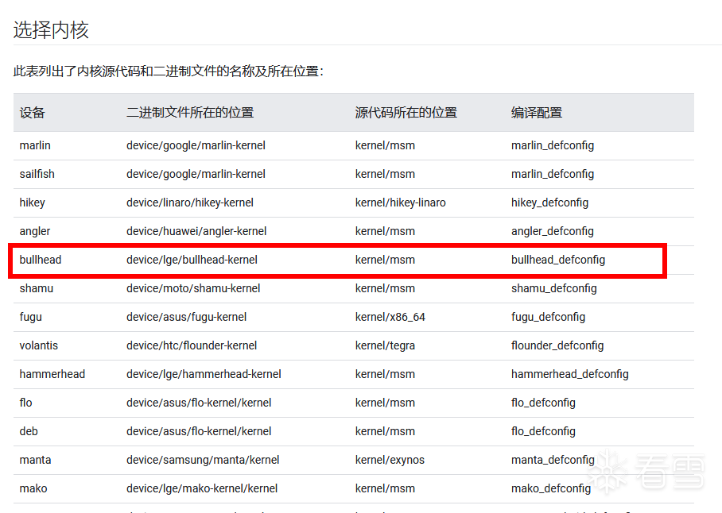
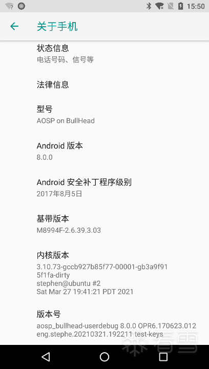
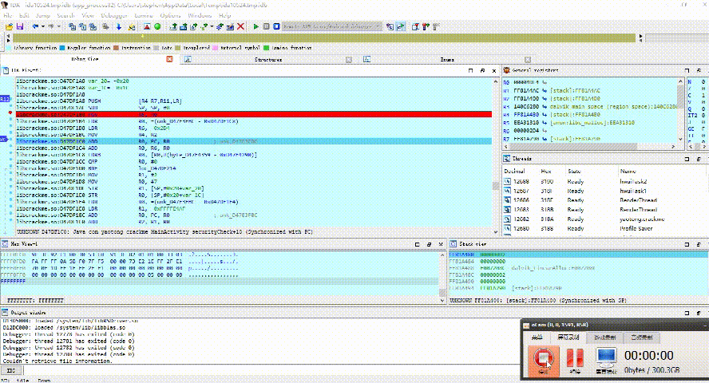

# Nexus 5X过反调试修改Android内核实践笔记 

url：https://bbs.pediy.com/thread-266841.htm

# 学习背景

最近开始学习用修改内核的方式过反调试，因为之前都是用native inline hook的方式改变应用的运行逻辑。但是如果应用在很早的时机就开始检测调试，那你用hook方式就很不稳定了。正所谓让自己成为操作系统才能对app进行降维打击，所为我参考了网上很多资料发现都是你抄我，我抄你，连错误也抄进去了。也不知道原创作者到底是谁！所以，过程也十分艰难，最后总算是成功了。由于此次学习成果颇丰，所以记录下来供日后自己参考。

# 确定内核大版本

首先，我的手机的Nexus 5X所以系统名称叫bullhead。参考[kernels](https://source.android.com/source/building-kernels)我的内核大版本如下。



# 下载内核源码

由于网络连接问题，可以把上面所有 git clone命令中https://android.googlesource.com/网址换成清华镜像站的https://aosp.tuna.tsinghua.edu.cn/ 网址。
所以最后我执行以下命令就把大版本内核源码clone下来了

`git clone https://aosp.tuna.tsinghua.edu.cn/kernel/msm.git`

注意clone下来以后，master分支是不会有任何文件的。这是正常的，我需要checkout到我们的小版本才能显示源码。

# 确定设备对应的内核小版本

### 方法一

打开手机设置-关于手机，查看内核版本可得知我的小版本短名称是b3a9f915f1fa


### 方法二

进入手机adb命令行

```
stephen@ubuntu:/data/msm$ adb shell
bullhead:/ $ su
bullhead:/ # cat /proc/version
Linux version 3.10.73-gccb927b85f77-00001-gb3a9f915f1fa-dirty (stephen@ubuntu) (gcc version 4.9.x 20150123 (prerelease) (GCC) ) #2 SMP PREEMPT Sat Mar 27 19:41:21 PDT 2021
bullhead:/ #
```

我们也可以得知我们的手机内核版本是b3a9f915f1fa，以上两个方法都适用。

# checkout对应内核版本源码

```
stephen@ubuntu:/data/msm$ git checkout b3a9f915f1fa
warning: refname 'dc40906c97ae' is ambiguous.
Updating files: 100% (47111/47111), done.
Switched to branch 'b3a9f915f1fa'
```

这时候msm目录下就有文件了

```
stephen@ubuntu:/data/msm$ ls
android           build.config.net_test  drivers   ipc      MAINTAINERS     net             scripts     usr
AndroidKernel.mk  COPYING                firmware  Kbuild   Makefile        output          security    virt
arch              CREDITS                fs        Kconfig  mm              README          sound       vmlinux
block             crypto                 include   kernel   modules.order   REPORTING-BUGS  System.map  vmlinux.o
build.config      Documentation          init      lib      Module.symvers  samples         tools
```

# 修改内核过反调试

### fs/proc/array.c的task_state_array数组中两个变量修改

```
"T (stopped)"``,     ``/``*`  `4` `*``/
"t (tracing stop)"``,   ``/``*`  `8` `*``/
```

改为

```
"S (sleeping)",        /*   4 */
"S (sleeping)",    /*   8 */
```

修改后task_state_array数组全貌

```
static const char * const task_state_array[] = {
    "R (running)",        /*   0 */
    "S (sleeping)",        /*   1 */
    "D (disk sleep)",    /*   2 */
    "S (sleeping)",        /*   4 */
    "S (sleeping)",    /*   8 */
    "Z (zombie)",        /*  16 */
    "X (dead)",        /*  32 */
    "x (dead)",        /*  64 */
    "K (wakekill)",        /* 128 */
    "W (waking)",        /* 256 */
    "P (parked)",        /* 512 */
};
```

### fs/proc/array.c的函数task_state修改

找到引用变量tpid的地方，直接强制使用0即可。-> 因为tpid就是TracerPid的意思。
修改后task_state函数全貌

```
static inline void task_state(struct seq_file *m, struct pid_namespace *ns,
                struct pid *pid, struct task_struct *p)
{
    struct user_namespace *user_ns = seq_user_ns(m);
    struct group_info *group_info;
    int g;
    struct fdtable *fdt = NULL;
    const struct cred *cred;
    pid_t ppid = 0, tpid = 0;
    struct task_struct *leader = NULL;
 
    rcu_read_lock();
    if (pid_alive(p)) {
        struct task_struct *tracer = ptrace_parent(p);
        if (tracer)
            tpid = task_pid_nr_ns(tracer, ns);
        ppid = task_tgid_nr_ns(rcu_dereference(p->real_parent), ns);
        leader = p->group_leader;
    }
    cred = get_task_cred(p);
    seq_printf(m,
        "State:\t%s\n"
        "Tgid:\t%d\n"
        "Pid:\t%d\n"
        "PPid:\t%d\n"
        "TracerPid:\t%d\n"
        "Uid:\t%d\t%d\t%d\t%d\n"
        "Gid:\t%d\t%d\t%d\t%d\n",
        get_task_state(p),
        leader ? task_pid_nr_ns(leader, ns) : 0,
        pid_nr_ns(pid, ns),
        ppid, 0,
        from_kuid_munged(user_ns, cred->uid),
        from_kuid_munged(user_ns, cred->euid),
        from_kuid_munged(user_ns, cred->suid),
        from_kuid_munged(user_ns, cred->fsuid),
        from_kgid_munged(user_ns, cred->gid),
        from_kgid_munged(user_ns, cred->egid),
        from_kgid_munged(user_ns, cred->sgid),
        from_kgid_munged(user_ns, cred->fsgid));
 
    task_lock(p);
    if (p->files)
        fdt = files_fdtable(p->files);
    seq_printf(m,
        "FDSize:\t%d\n"
        "Groups:\t",
        fdt ? fdt->max_fds : 0);
    rcu_read_unlock();
 
    group_info = cred->group_info;
    task_unlock(p);
 
    for (g = 0; g < group_info->ngroups; g++)
        seq_printf(m, "%d ",
               from_kgid_munged(user_ns, GROUP_AT(group_info, g)));
    put_cred(cred);
 
    seq_putc(m, '\n');
}
```

### fs/proc/base.c的proc_pid_wchan函数修改

函数原样

```
static int proc_pid_wchan(struct task_struct *task, char *buffer)
{
    unsigned long wchan;
    char symname[KSYM_NAME_LEN];
 
    wchan = get_wchan(task);
 
    if (lookup_symbol_name(wchan, symname) < 0)
        if (!ptrace_may_access(task, PTRACE_MODE_READ))
            return 0;
        else
            return sprintf(buffer, "%lu", wchan);
    else
        return sprintf(buffer, "%s", symname);
}
```

修改if逻辑后

```
static int proc_pid_wchan(struct task_struct *task, char *buffer)
{
    unsigned long wchan;
    char symname[KSYM_NAME_LEN];
 
    wchan = get_wchan(task);
 
    if (lookup_symbol_name(wchan, symname) < 0)
        if (!ptrace_may_access(task, PTRACE_MODE_READ))
            return 0;
        else
            return sprintf(buffer, "%lu", wchan);
    else{
        if (strstr(symname, "trace")) {
            return sprintf(buffer, "%s", "sys_epoll_wait");
        }
        return sprintf(buffer, "%s", symname);
    }   
}
```

总结:修改内核涉及到fs/proc/array.c和fs/proc/base.c两个文件共计3处地方的修改，这里痛批网上其他教程核心地方不说清楚。一看就是在抄文章，肯定没实践过。

# 配置内核编译环境

在msm目录直接执行以下命令，配置临时环境变量就好了。如果你想配置到/etc/profile也可以

```
export ANDROID_AARCH64=/data/android-8.0.0_r3/prebuilts/gcc/linux-x86/aarch64/aarch64-linux-android-4.9/bin
export ARCH=arm64
export SUBARCH=arm64
export PATH=$PATH:$ANDROID_AARCH64
export CROSS_COMPILE=aarch64-linux-android-
`
```

注意1、ANDROID_AARCH64可以用你Android源码编译套件里面的，
注意2、export PATH=$PATH:$ANDROID_AARCH64这条命令一定是在export ANDROID_AARCH64以后执行，如果执行顺序错误就会报如下异常

# 编译内核

在msm目录下执行make就可以了，不出意外的话将在几分钟后编译完成。

```
stephen@ubuntu:/data/msm$ make
scripts/kconfig/conf --silentoldconfig Kconfig
warning: (PCI_MSM && AMD_IOMMU) selects PCI_MSI which has unmet
......
  DTC     arch/arm64/boot/dts/lge/../msm8992-bullhead-rev-101.dtb
  DTC     arch/arm64/boot/dts/lge/../msm8992-bullhead-rev-a.dtb
  DTC     arch/arm64/boot/dts/lge/../msm8992-bullhead-rev-11.dtb
  DTC     arch/arm64/boot/dts/lge/../msm8992-bullhead-rev-b.dtb
  DTC     arch/arm64/boot/dts/lge/../msm8992-bullhead-rev-10.dtb
  DTC     arch/arm64/boot/dts/lge/../msm8992-bullhead-rev-0.dtb
  OBJCOPY arch/arm64/boot/Image
  GZIP    arch/arm64/boot/Image.gz
  CAT     arch/arm64/boot/Image.gz-dtb
```

编译完成以后会在msm/arch/arm64/boot目录下生成内核文件

```
stephen@ubuntu:/data/msm/arch/arm64/boot$ ls
dts  Image  Image.gz  Image.gz-dtb  install.sh  Makefile  wrapper
stephen@ubuntu:/data/msm/arch/arm64/boot$
```

我们要的是Image.gz-dtb这个文件，它才是替换boot.img中kernel的。

# 安装bootimg-tools

`git clone https://github.com/pbatard/bootimg-tools.git`

下载后进入bootimg-tools目录，执行make 命令编译该项目，在 makebootimg目录下生成了相应的二进制执行文件,将该二进制文件所在路径添加到 PATH路径中

# 重打包boot.img

我们回到安卓系统编译目标目录

```
stephen@ubuntu:/data/android-8.0.0_r3/out/target/product/bullhead$ ls
android-info.txt       clean_steps.mk  installed-files.json  obj_arm                   recovery.id   system.img
boot.img               data            installed-files.txt   previous_build_config.mk  recovery.img  testboot
build_fingerprint.txt  dex_bootjars    kernel                ramdisk.img               root          userdata.img
cache                  fake_packages   module-info.json      ramdisk-recovery.img      symbols       vendor
cache.img              gen             obj                   recovery                  system        vendor.img
```

在这个目录下我们创建一个testboot目录作为重打包的工作目录，万一失败了我们刷回原来的系统就是。

```
mkdir testboot && cp boot.img /testboot
```

```
stephen@ubuntu:/data/android-8.0.0_r3/out/target/product/bullhead/testboot$ unmkbootimg -i boot.img
kernel written to 'kernel' (10844163 bytes)
ramdisk written to 'ramdisk.cpio.gz' (1965202 bytes)
 
To rebuild this boot image, you can use the command:
  mkbootimg --base 0 --pagesize 4096 --kernel_offset 0x00008000 --ramdisk_offset 0x02000000 --second_offset 0x00f00000 --tags_offset 0x01e00000 --cmdline 'console=ttyHSL0,115200,n8 androidboot.hardware=bullhead boot_cpus=0-5 lpm_levels.sleep_disabled=1 msm_poweroff.download_mode=0 loop.max_part=7 buildvariant=userdebug' --kernel kernel --ramdisk ramdisk.cpio.gz -o boot.img
```

解包成功后，unmkbootimg 会生成你待会儿重打包的命令。这个用户体验设计很贴心，点赞！！！
解压之后我们得到 kernel 和 ramdisk.cpio.gz 两个文件

### boot.img重打包

我们把刚才编译好的内核文件Image.gz-dtb拷贝过来

```
stephen@ubuntu:/data/android-8.0.0_r3/out/target/product/bullhead/testboot$ cp /data/msm/arch/arm64/boot/Image.gz-dtb .
```

更改重打包命令中--kernel kernel为--kernel Image.gz-dtb，所以产生如下命令

```
	
mkbootimg --base 0 --pagesize 4096 --kernel_offset 0x00008000 --ramdisk_offset 0x02000000 --second_offset 0x00f00000 --tags_offset 0x01e00000 --cmdline 'console=ttyHSL0,115200,n8 androidboot.hardware=bullhead boot_cpus=0-5 lpm_levels.sleep_disabled=1 msm_poweroff.download_mode=0 loop.max_part=7 buildvariant=userdebug' --kernel Image.gz-dtb --ramdisk ramdisk.cpio.gz -o newboot.img
```

执行重打包命令，这时候目录下多了一个newboot.img文件

```
stephen@ubuntu:/data/android-8.0.0_r3/out/target/product/bullhead/testboot$ ls
boot.img  Image.gz-dtb  kernel  newboot.img  ramdisk.cpio.gz
```

我们把newboot.img移动到/data/android-8.0.0_r3/out/target/product目录下，覆盖原boot.img文件（万一后面刷机失败了，我们可以用boot.img恢复下）

```
stephen@ubuntu:/data/android-8.0.0_r3/out/target/product/bullhead/testboot$ mv newboot.img ../boot.img
```

**重刷系统**

```
stephen@ubuntu:~/and8out/target/product/bullhead$ adb reboot bootloader
* daemon not running; starting now at tcp:5037
* daemon started successfully
stephen@ubuntu:~/and8out/target/product/bullhead$ fastboot -w flashall
--------------------------------------------
Bootloader Version...: BHZ21c
Baseband Version.....: M8994F-2.6.39.3.03
Serial Number........: 01030f49c3892095
--------------------------------------------
fastboot: error: ANDROID_PRODUCT_OUT not set
stephen@ubuntu:~/and8out/target/product/bullhead$ export ANDROID_PRODUCT_OUT=~/and8out/target/product/bullhead
stephen@ubuntu:~/and8out/target/product/bullhead$ echo $ANDROID_PRODUCT_OUT
/home/stephen/and8out/target/product/bullhead
stephen@ubuntu:~/and8out/target/product/bullhead$ fastboot -w flashall
--------------------------------------------
Bootloader Version...: BHZ21c
Baseband Version.....: M8994F-2.6.39.3.03
Serial Number........: 01030f49c3892095
--------------------------------------------
Checking 'product'                                 OKAY [  0.019s]
Sending 'boot' (12436 KB)                          OKAY [  1.609s]
Writing 'boot'                                     OKAY [  0.133s]
Sending 'recovery' (16541 KB)                      OKAY [  2.149s]
Writing 'recovery'                                 OKAY [  0.178s]
Sending sparse 'system' 1/2 (524151 KB)            OKAY [ 72.581s]
Writing 'system'                                   OKAY [  6.879s]
Sending sparse 'system' 2/2 (444012 KB)            OKAY [ 65.429s]
Writing 'system'                                   OKAY [  6.182s]
Sending 'vendor' (180311 KB)                       OKAY [ 25.206s]
Writing 'vendor'                                   OKAY [  2.489s]
Erasing 'userdata'                                 OKAY [  0.863s]
mke2fs 1.45.4 (23-Sep-2019)
Creating filesystem with 6661115 4k blocks and 1667904 inodes
Filesystem UUID: 5b482ac2-6275-4816-a082-e785253bb603
Superblock backups stored on blocks:
    32768, 98304, 163840, 229376, 294912, 819200, 884736, 1605632, 2654208,
    4096000
 
Allocating group tables: done                           
Writing inode tables: done                           
Creating journal (32768 blocks): done
Writing superblocks and filesystem accounting information: done  
 
Sending 'userdata' (180 KB)                        OKAY [  0.105s]
Writing 'userdata'                                 OKAY [  0.026s]
Erasing 'cache'                                    OKAY [  0.077s]
mke2fs 1.45.4 (23-Sep-2019)
Creating filesystem with 24576 4k blocks and 24576 inodes
 
Allocating group tables: done                           
Writing inode tables: done                           
Creating journal (1024 blocks): done
Writing superblocks and filesystem accounting information: done
Sending 'cache' (44 KB)
```

刷机成功！！！

# IDA动态调试测试

我们准备一个会基于TracerPid反调试的app AliCrackme.apk，[点击下载AliCrackme.apk](https://bbs.pediy.com/upload/attach/202104/913632_YFJRMQDE39CERKE._apk)
该app只要进行了ptrace就会崩溃，这个本人前期已经验证。

### IDA动态调试展示



### app程序没有崩溃


### 同时查看进程status文件TracerPid还是0

```
bullhead:/ # cat /proc/12666/status                                                                                              
Name:    yaotong.crackme
State:    S (sleeping)
Tgid:    12666
Pid:    12666
PPid:    571
TracerPid:    0
Uid:    10064    10064    10064    10064
Gid:    10064    10064    10064    10064
FDSize:    128
Groups:    9997 20064 50064
VmPeak:     1720060 kB
VmSize:     1715184 kB
VmLck:           0 kB
VmPin:           0 kB
VmHWM:       70500 kB
VmRSS:       70128 kB
VmData:      148720 kB
VmStk:        8196 kB
VmExe:          20 kB
VmLib:      116388 kB
VmPTE:         828 kB
VmSwap:           8 kB
Threads:    23
SigQ:    0/6515
SigPnd:    0000000000000000
ShdPnd:    0000000000000000
SigBlk:    0000000000001204
SigIgn:    0000000000000000
SigCgt:    20000006400084f8
CapInh:    0000000000000000
CapPrm:    0000000000000000
CapEff:    0000000000000000
CapBnd:    0000000000000000
CapAmb:    0000000000000000
Seccomp:    2
Cpus_allowed:    3f
Cpus_allowed_list:    0-5
Mems_allowed:    1
Mems_allowed_list:    0
voluntary_ctxt_switches:    1504
nonvoluntary_ctxt_switches:    187
```

总结：编译内核其实不难，主要是步骤很多很繁琐！重点是修改内核文件之前不知道修改哪些代码，这里我都详细阐述了。逆向工程师是真正的全栈工程师，不接受反驳！