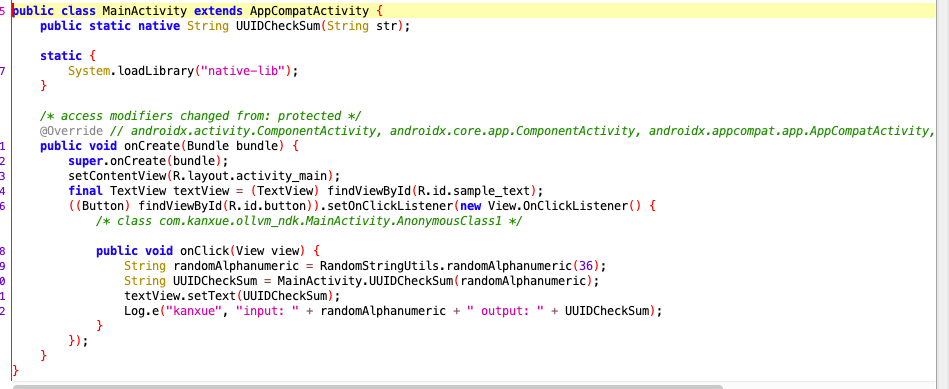
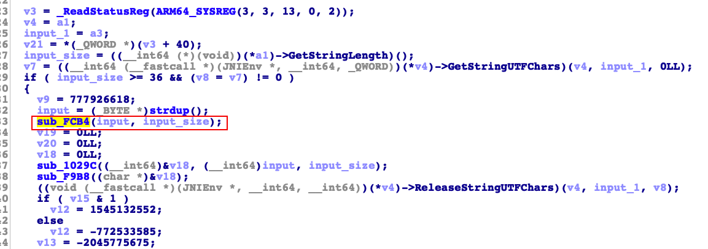

#  Unicorn Trace还原Ollvm算法

url：https://bbs.pediy.com/thread-267018.htm


## 使用unicorn来trace还原ollvm混淆的非标准算法

题目出自高研班3W计划9月的题目还原ollvm混淆的自定义算法，见本帖附件。

 

ollvm的自定义算法的还原一般就是意味着非常多的分支。我们可以F5打开后。逐步根据参数的传递。逐步的进行追踪。又或者是根据返回值。来逐层向来源追踪。如果这个算法是一个比较纯粹的算法。那么我们可以用unicorn来模拟执行这个代码段。并且打印所有的汇编指令每一行的变化。最后还原出这个算法。这个题目就是一个比较纯粹的算法。这里我采用了unicorn来进行算法的恢复。

 

做这个题目。我定制了一个专门用来trace指令详细变化的回调。可以直观的看到每行汇编指令当前的寄存器的数值和指令执行后的数值。

 

unicorn相当于是一个cpu的模拟器，可以用来执行so中的代码段，一般不要直接使用apk中的so文件，直接使用是需要修复上下文的，这样会比较复杂。最好是直接从内存中直接dump一个so出来。然后就可以直接执行so里面的代码段。然后看一个例子ollvm9.apk

 

最终trace出来的成品demo：https://github.com/dqzg12300/unicornDemo

 

首先用jadx打开这个apk。看看里面的按钮的功能

 



 

然后看到这里主要用到了UUIDCheckSum这个函数来进行加密

 

解压这个apk。用ida打开libnative-lib.so找到UUIDCheckSum函数。发现这个函数是ollvm混淆的。然后找入参的使用，发现了一个关键函数。

 



 

然后我们想要用unicorn来执行这个函数。首先找到函数的起始和终止位置，这个函数我找到是start:0xfcb4 end:0xff2c

 

直接使用我们这个ida查看的so文件是不行了。最好是在真机执行时从内存中dump这个so出来。就是拥有完整上下文信息的。这里我使用了大佬的工具来dump：https://github.com/lasting-yang/frida_dump

 

使用起来也是非常简单

 

```
frida -U com.kanxue.ollvm_ndk_9 -l dump_so.js
```

 

```
dump_so("libnative-lib.so")
```

 

执行后生成了一个so文件libnative-lib.so_0x7eae047000_0x38000.so。将这个文件拷贝到py项目下。

 

接着梳理一下想要写一个使用unicorn来执行的流程。

1. 创建一个unicorn对象
2. 使用unicorn创建一块内存，用来存放这个so代码
3. 使用unicorn创建一块内存，用来存放栈空间
4. 使用unicorn创建一块内存，用来存放要执行函数的参数
5. 读取so，将so写入到上面预先创建的内存中。
6. 给参数的那块内存赋值
7. 给寄存器赋值（x0,x1,sp），X0就是ida函数中看到的第一个参数，X1就是第二个参数
8. unicorn启动执行指定片段的代码
9. 读取执行结果
10. 释放创建的内存

然后下面看一下实现的代码


```
if __name__ == '__main__':
    initGlobalData()
    #创建uc对象
    uc=unicorn.Uc(unicorn.UC_ARCH_ARM64,unicorn.UC_MODE_ARM)
    #从内存中dump下来so的基址
    code_addr=0x7eae047000
    #用来存放so代码的大小，尽量大一点。内存不值钱
    code_size=8*0x1000*0x1000
    #创建一块内存
    uc.mem_map(code_addr,code_size)
    #在上面那块内存后面继续划一片内存来当做栈空间
    stack_addr=code_addr+code_size
    stack_size=0x1000
    #栈顶的位置，这里是64位的，所以偏移8个字节
    stack_top=stack_addr+stack_size-0x8
    #申请一块栈空间
    uc.mem_map(stack_addr,stack_size)
    #栈空间往后继续划一块空间用来存放参数
    args_addr=stack_addr+stack_size
    args_size=0x1000
    uc.mem_map(args_addr, args_size)
    #设置每句汇编执行都会调用hook_code
    #uc.hook_add(unicorn.UC_HOOK_CODE,hook_code)
    #读取so
    with open("./libnative-lib.so_0x7eae047000_0x38000.so","rb") as f:
        sodata=f.read()
        #给前面创建的空间写入so的数据
        uc.mem_write(code_addr,sodata)
        #要执行的代码开始位置
        start_addr=code_addr+0xFCB4
        #要执行的代码结束位置
        end_addr=code_addr+0xFF2C
        #随机生成一个入参
        input_str = ranstr(36)
        print("input:%s input_addr:0x%x" % (input_str,args_addr))
        input_byte=str.encode(input_str)
        #将生成的入参写入前面创建的内存空间
        uc.mem_write(args_addr,input_byte)
        #ida中看到的函数有参数1、2，然后分别对应X0和X1，写入对应数据，栈寄存器给一个栈顶的地址
        uc.reg_write(unicorn.arm64_const.UC_ARM64_REG_X0,args_addr)
        uc.reg_write(unicorn.arm64_const.UC_ARM64_REG_X1,len(input_str))
        uc.reg_write(unicorn.arm64_const.UC_ARM64_REG_SP,stack_top)
        #开始执行代码段
        uc.emu_start(start_addr,end_addr)
        #ida中看到返回值是直接写在入参中，所以结果我们直接从入参的内存中读取
        result=uc.mem_read(args_addr,args_size)
        print("result:",result.decode(encoding="utf-8"))
    #最后释放创建的内存
    uc.mem_unmap(args_addr, args_size)
    uc.mem_unmap(stack_addr,stack_size)
    uc.mem_unmap(code_addr,code_size)
```

执行后，得到下面的结果

```
input:nxRH3WwuTJgUfqcOS94CM5QEkoPeF0sZ8mGj input_addr:0x7eb6048000
result: oySI2Vvt-KfTg-4NR8-BL4Pj-nQdG1r[9laf
```

执行这个代码段成功后，我们想的是能够将每行执行的汇编代码都打印一下。可以使用hook_add来添加一个指令执行时的回调函数，我们解开上面代码的这句注释

```
uc.hook_add(unicorn.UC_HOOK_CODE,hook_code)
```

然后先设置一个最简单的打印看看

```
def hook_code(uc: unicorn.Uc, address, size, user_data):
    inst_code=uc.mem_read(address,size)
    for inst in cs.disasm(inst_code,size):
        print("0x%x:\t%s\t%s" % (address, inst.mnemonic, inst.op_str))
```

设置之后的打印效果是

```
0x7eae056f08:    ldr    x25, [sp, #0x10]
0x7eae056f0c:    sub    w9, w10, w9
0x7eae056f10:    strb    w8, [x0, #0x23]
0x7eae056f14:    ldrb    w8, [x11, w9, uxtw]
0x7eae056f18:    strb    w8, [x0, #0x22]
0x7eae056f1c:    ldp    x20, x19, [sp, #0x40]
0x7eae056f20:    ldp    x22, x21, [sp, #0x30]
0x7eae056f24:    ldp    x24, x23, [sp, #0x20]
0x7eae056f28:    add    sp, sp, #0x50
```

但是仅仅是这样的效果还是没办法拿来分析算法，必须将每个寄存器的结果在后面打印出来，所以要改造下,下面是我根据自己的需求定制的一个trace打印

1. 在每行的汇编后面打印该行中所有使用到的寄存器数据
2. 在每行的最后再打印这个寄存器在计算后的结果值
3. 监控指定地址的内存变动。如果数据发生改变。则打印这块内存的数据

下面看具体实现。

 

首先创建一个全局文件globalData.py用来存放全局变量

```
#上一次汇编指令
global pre_codestr
#上一次汇编的第一个寄存器名称
global pre_regname
#是否有记录上一次的数据
global has_pre
#监控的地址
global watch_addrs
```

下面贴上完整例子

```
import unicorn
import random
import string
import capstone
import re
import globalData
import binascii
 
def ranstr(num):
    salt = ''.join(random.sample(string.ascii_letters + string.digits, num))
    return salt
 
cs = capstone.Cs(capstone.CS_ARCH_ARM64, capstone.CS_MODE_ARM)
cs.detail = True
all_regs = None
reg_names = {
    "X0": unicorn.arm64_const.UC_ARM64_REG_X0,
    "X1": unicorn.arm64_const.UC_ARM64_REG_X1,
    "X2": unicorn.arm64_const.UC_ARM64_REG_X2,
    "X3": unicorn.arm64_const.UC_ARM64_REG_X3,
    "X4": unicorn.arm64_const.UC_ARM64_REG_X4,
    "X5": unicorn.arm64_const.UC_ARM64_REG_X5,
    "X6": unicorn.arm64_const.UC_ARM64_REG_X6,
    "X7": unicorn.arm64_const.UC_ARM64_REG_X7,
    "X8": unicorn.arm64_const.UC_ARM64_REG_X8,
    "X9": unicorn.arm64_const.UC_ARM64_REG_X9,
    "X10": unicorn.arm64_const.UC_ARM64_REG_X10,
    "X11": unicorn.arm64_const.UC_ARM64_REG_X11,
    "X12": unicorn.arm64_const.UC_ARM64_REG_X12,
    "X13": unicorn.arm64_const.UC_ARM64_REG_X13,
    "X14": unicorn.arm64_const.UC_ARM64_REG_X14,
    "X15": unicorn.arm64_const.UC_ARM64_REG_X15,
    "X16": unicorn.arm64_const.UC_ARM64_REG_X16,
    "X17": unicorn.arm64_const.UC_ARM64_REG_X17,
    "X18": unicorn.arm64_const.UC_ARM64_REG_X18,
    "X19": unicorn.arm64_const.UC_ARM64_REG_X19,
    "X20": unicorn.arm64_const.UC_ARM64_REG_X20,
    "X21": unicorn.arm64_const.UC_ARM64_REG_X21,
    "X22": unicorn.arm64_const.UC_ARM64_REG_X22,
    "X23": unicorn.arm64_const.UC_ARM64_REG_X23,
    "X24": unicorn.arm64_const.UC_ARM64_REG_X24,
    "X25": unicorn.arm64_const.UC_ARM64_REG_X25,
    "X26": unicorn.arm64_const.UC_ARM64_REG_X26,
    "X27": unicorn.arm64_const.UC_ARM64_REG_X27,
    "X28": unicorn.arm64_const.UC_ARM64_REG_X28,
    "W0": unicorn.arm64_const.UC_ARM64_REG_W0,
    "W1": unicorn.arm64_const.UC_ARM64_REG_W1,
    "W2": unicorn.arm64_const.UC_ARM64_REG_W2,
    "W3": unicorn.arm64_const.UC_ARM64_REG_W3,
    "W4": unicorn.arm64_const.UC_ARM64_REG_W4,
    "W5": unicorn.arm64_const.UC_ARM64_REG_W5,
    "W6": unicorn.arm64_const.UC_ARM64_REG_W6,
    "W7": unicorn.arm64_const.UC_ARM64_REG_W7,
    "W8": unicorn.arm64_const.UC_ARM64_REG_W8,
    "W9": unicorn.arm64_const.UC_ARM64_REG_W9,
    "W10": unicorn.arm64_const.UC_ARM64_REG_W10,
    "W11": unicorn.arm64_const.UC_ARM64_REG_W11,
    "W12": unicorn.arm64_const.UC_ARM64_REG_W12,
    "W13": unicorn.arm64_const.UC_ARM64_REG_W13,
    "W14": unicorn.arm64_const.UC_ARM64_REG_W14,
    "W15": unicorn.arm64_const.UC_ARM64_REG_W15,
    "W16": unicorn.arm64_const.UC_ARM64_REG_W16,
    "W17": unicorn.arm64_const.UC_ARM64_REG_W17,
    "W18": unicorn.arm64_const.UC_ARM64_REG_W18,
    "W19": unicorn.arm64_const.UC_ARM64_REG_W19,
    "W20": unicorn.arm64_const.UC_ARM64_REG_W20,
    "W21": unicorn.arm64_const.UC_ARM64_REG_W21,
    "W22": unicorn.arm64_const.UC_ARM64_REG_W22,
    "W23": unicorn.arm64_const.UC_ARM64_REG_W23,
    "W24": unicorn.arm64_const.UC_ARM64_REG_W24,
    "W25": unicorn.arm64_const.UC_ARM64_REG_W25,
    "W26": unicorn.arm64_const.UC_ARM64_REG_W26,
    "W27": unicorn.arm64_const.UC_ARM64_REG_W27,
    "W28": unicorn.arm64_const.UC_ARM64_REG_W28,
    "SP": unicorn.arm64_const.UC_ARM64_REG_SP,
}
 
#初始化全局数据
def initGlobalData():
    globalData.has_pre=False
    globalData.pre_codestr=""
    globalData.pre_regname=""
    #添加监视列表,trace时打印该内存的变动
    globalData.watch_addrs= {0x7eae07e060:""}
 
 
def hook_code(uc: unicorn.Uc, address, size, user_data):
    inst_code=uc.mem_read(address,size)
    for inst in cs.disasm(inst_code,size):
        #判断是否保存有上次的指令，有的话，则先打印上次的指令，并且查询上次的第一个寄存器的新数值
        if globalData.has_pre and globalData.pre_regname:
            regindex = reg_names[globalData.pre_regname.upper()]
            regvalue = uc.reg_read(regindex)
            globalData.pre_codestr+="\t//%s=0x%x" % (globalData.pre_regname,regvalue)
            print(globalData.pre_codestr)
            globalData.pre_codestr=""
            globalData.has_pre=False
 
        #监控我关心的内存空间，如果发生变动会再打印
        if len(globalData.watch_addrs)>0:
            for i,v in globalData.watch_addrs.items():
                idata= uc.mem_read(i,0x10)
                buf= binascii.b2a_hex(idata)
                hexstr=buf.decode(encoding="utf-8")
                if globalData.watch_addrs[i]==hexstr:
                    continue
                globalData.watch_addrs[i]=hexstr
                print("0x%x\t%s" % (i, hexstr))
 
        #拼接当前行的汇编指令
        opstr="0x%x:\t%s\t%s" % (address, inst.mnemonic, inst.op_str)
        #从当前行指令中匹配出所有的寄存器
        res = re.findall(r'[^0]([wx][0-9]+)', " " + inst.op_str, re.I | re.M)
        #如果有多个寄存器，取第一个为数值被改变的寄存器
        if len(res)>0:
            globalData.pre_regname = res[0]
        res=list(set(res))
        #如果有sp寄存器，则单独插入
        if "sp" in inst.op_str:
            res.append("sp")
        #如果没有寄存器，则不需要记录为上次的，直接打印即可
        if len(res)<=0:
            has_pre=False
            print(opstr)
            continue
        #记录数据为上次的指令
        fenge = "\t\t------"
        curreg=""
        for regname in res:
            regindex=reg_names[regname.upper()]
            regvalue=uc.reg_read(regindex)
            curreg+="%s=0x%x\t" % (regname,regvalue)
        globalData.pre_codestr=opstr +fenge+ curreg
        globalData.has_pre=True
 
 
# Press the green button in the gutter to run the script.
if __name__ == '__main__':
    initGlobalData()
    #创建uc对象
    uc=unicorn.Uc(unicorn.UC_ARCH_ARM64,unicorn.UC_MODE_ARM)
    #从内存中dump下来so的基址
    code_addr=0x7eae047000
    #用来存放so代码的大小，尽量大一点。内存不值钱
    code_size=8*0x1000*0x1000
    #创建一块内存
    uc.mem_map(code_addr,code_size)
    #在上面那块内存后面继续划一片内存来当做栈空间
    stack_addr=code_addr+code_size
    stack_size=0x1000
    #栈顶的位置，这里是64位的，所以偏移8个字节
    stack_top=stack_addr+stack_size-0x8
    #申请一块栈空间
    uc.mem_map(stack_addr,stack_size)
    #栈空间往后继续划一块空间用来存放参数
    args_addr=stack_addr+stack_size
    args_size=0x1000
    uc.mem_map(args_addr, args_size)
    #设置每句汇编执行都会调用hook_code
    uc.hook_add(unicorn.UC_HOOK_CODE,hook_code)
    #读取so
    with open("./libnative-lib.so_0x7eae047000_0x38000.so","rb") as f:
        sodata=f.read()
        #给前面创建的空间写入so的数据
        uc.mem_write(code_addr,sodata)
        #要执行的代码开始位置
        start_addr=code_addr+0xFCB4
        #要执行的代码结束位置
        end_addr=code_addr+0xFF2C
        #随机生成一个入参
        input_str = ranstr(36)
        print("input:%s input_addr:0x%x" % (input_str,args_addr))
        input_byte=str.encode(input_str)
        #将生成的入参写入前面创建的内存空间
        uc.mem_write(args_addr,input_byte)
        #ida中看到的函数有参数1、2，然后分别对应X0和X1，写入对应数据，栈寄存器给一个栈顶的地址
        uc.reg_write(unicorn.arm64_const.UC_ARM64_REG_X0,args_addr)
        uc.reg_write(unicorn.arm64_const.UC_ARM64_REG_X1,len(input_str))
        uc.reg_write(unicorn.arm64_const.UC_ARM64_REG_SP,stack_top)
        #开始执行代码段
        uc.emu_start(start_addr,end_addr)
        #ida中看到返回值是直接写在入参中，所以结果我们直接从入参的内存中读取
        result=uc.mem_read(args_addr,args_size)
        print("result:",result.decode(encoding="utf-8"))
    #最后释放创建的内存
    uc.mem_unmap(args_addr, args_size)
    uc.mem_unmap(stack_addr,stack_size)
    uc.mem_unmap(code_addr,code_size)
```

下面贴个打印的效果片段

```
input:L8Cs5ntgNWiPMQRUKYXva0juFw9JqI4ApyZT input_addr:0x7eb6048000
0x7eae07e060    30313233343536373839616263646566
0x7eae056cb8:    str    x25, [sp, #0x10]        ------x25=0x0    sp=0x7eb6047fa8        //x25=0x0
0x7eae056cbc:    stp    x24, x23, [sp, #0x20]        ------x23=0x0    x24=0x0    sp=0x7eb6047fa8        //x24=0x0
0x7eae056cc0:    stp    x22, x21, [sp, #0x30]        ------x21=0x0    x22=0x0    sp=0x7eb6047fa8        //x22=0x0
0x7eae056cc4:    stp    x20, x19, [sp, #0x40]        ------x19=0x0    x20=0x0    sp=0x7eb6047fa8        //x20=0x0
0x7eae056cc8:    ldrb    w22, [x0, #0x18]        ------x0=0x7eb6048000    w22=0x0        //w22=0x46
0x7eae056ccc:    movz    w8, #0xf6c3        ------w8=0x0        //w8=0xf6c3
0x7eae056cd0:    movz    w9, #0xa29a        ------w9=0x0        //w9=0xa29a
0x7eae056cd4:    movz    w13, #0x4941        ------w13=0x0        //w13=0x4941
0x7eae056cd8:    movz    w14, #0x7f29        ------w14=0x0        //w14=0x7f29
0x7eae056cdc:    movz    w15, #0x57d9        ------w15=0x0        //w15=0x57d9
0x7eae056ce0:    movz    w16, #0xcdcc        ------w16=0x0        //w16=0xcdcc
0x7eae056ce4:    movz    w17, #0x425b        ------w17=0x0        //w17=0x425b
0x7eae056ce8:    movz    w2, #0x30e6        ------w2=0x0        //w2=0x30e6
0x7eae056cec:    movz    w3, #0x7f2a        ------w3=0x0        //w3=0x7f2a

```

有了这份寄存器的变动，然后再根据我们的参数的指针在这份代码中查找。我搜索一下0x7eb6048000这个使用到的地方，然后就可以找到关于input的每个字节是怎么变换的规则了。这个例子的难度在于最后两个字节的变动。我只说一下最后两个字节的计算是怎么来的。

```
0x7eae056ee8:    ldrb    w8, [sp, #0xc]        ------w8=0x6cdff6c3    sp=0x7eb6047fa8        //w8=0x90
0x7eae056eec:    adrp    x11, #0x28000        ------x11=0x9db        //x11=0x7eae07e000
0x7eae056ef0:    ldr    w9, [sp, #0x1c]        ------w9=0x6594a29a    sp=0x7eb6047fa8        //w9=0x9db
0x7eae056ef4:    add    x11, x11, #0x60        ------x11=0x7eae07e000        //x11=0x7eae07e060
0x7eae056ef8:    and    x8, x8, #0xf        ------x8=0x90        //x8=0x0
0x7eae056efc:    ldr    w10, [sp, #0x1c]        ------w10=0x22    sp=0x7eb6047fa8        //w10=0x9db
0x7eae056f00:    ldrb    w8, [x11, x8]        ------w8=0x0    x8=0x0    x11=0x7eae07e060        //w8=0x30
0x7eae056f04:    and    w9, w9, #0xfffffff0        ------w9=0x9db        //w9=0x9d0
0x7eae056f08:    ldr    x25, [sp, #0x10]        ------x25=0x0    sp=0x7eb6047fa8        //x25=0x0
0x7eae056f0c:    sub    w9, w10, w9        ------w9=0x9d0    w10=0x9db        //w9=0xb
0x7eae056f10:    strb    w8, [x0, #0x23]        ------w8=0x30    x0=0x7eb6048000        //w8=0x30
0x7eae056f14:    ldrb    w8, [x11, w9, uxtw]        ------w8=0x30    w9=0xb    x11=0x7eae07e060        //w8=0x62
0x7eae056f18:    strb    w8, [x0, #0x22]        ------w8=0x62    x0=0x7eb6048000        //w8=0x62
0x7eae056f1c:    ldp    x20, x19, [sp, #0x40]        ------x20=0x9db    x19=0xa0504942    sp=0x7eb6047fa8        //x20=0x0
0x7eae056f20:    ldp    x22, x21, [sp, #0x30]        ------x21=0x90    x22=0xa0504942    sp=0x7eb6047fa8        //x22=0x0
0x7eae056f24:    ldp    x24, x23, [sp, #0x20]        ------x23=0x98c
```

这是最后的一段代码可以看到w8=0x62写入到了0x22的位置，w8=0x30写入到了0x23的位置。那么这两个数值是什么来历呢

```
ldrb    w8, [x11, w9, uxtw]        ------w8=0x30    w9=0xb    x11=0x7eae07e060        //w8=0x62
```

这里看到是从另外一块内存0x7eae07e060的0xb的位置读取到了0x62。由于我前面已经使用了内存监控。所以这块地址的数据我们可以看到是下面的

```
0x7eae07e060    30313233343536373839616263646566
```

这段字节转成字符串之后的结果就是

```
0x7eae07e060    0123456789abcdef
```

而0xb的位置实际就是62。那么这里的意思就将0xb转成ascii，所以直接找0xb怎么来的就行了

```
0x7eae056f0c:    sub    w9, w10, w9        ------w9=0x9d0    w10=0x9db        //w9=
```

然后继续找0x9d0和0x9db怎么来的

```
0x7eae056f04:    and    w9, w9, #0xfffffff0        ------w9=0x9db        //w9=0x9d0
```

最后只差0x9db是哪里来的，搜索一下0x9db

```
0x7eae056e34:    add    w20, w23, w20        ------w20=0x4f    w23=0x98c        //w20=0x9db
```

然后这里我查过0x4f和0x98c了。然后发现上面有长的相同的流程。所以这种遍历的情况。我们直接搜索前面的地址0x7eae056e34就行了

```
"0x7eae056e34:    add    w20, w23, w20        ------w20=0x69    w23=0x0        //w20=0x69"
"0x7eae056e34:    add    w20, w23, w20        ------w20=0x6b    w23=0x69        //w20=0xd4"
"0x7eae056e34:    add    w20, w23, w20        ------w20=0x6a    w23=0xd4        //w20=0x13e"
"0x7eae056e34:    add    w20, w23, w20        ------w20=0x75    w23=0x13e        //w20=0x1b3"
"0x7eae056e34:    add    w20, w23, w20        ------w20=0x50    w23=0x1b3        //w20=0x203"
"0x7eae056e34:    add    w20, w23, w20        ------w20=0x73    w23=0x203        //w20=0x276"
"0x7eae056e34:    add    w20, w23, w20        ------w20=0x37    w23=0x276        //w20=0x2ad"
"0x7eae056e34:    add    w20, w23, w20        ------w20=0x62    w23=0x2ad        //w20=0x30f"
"0x7eae056e34:    add    w20, w23, w20        ------w20=0x38    w23=0x30f        //w20=0x347"
"0x7eae056e34:    add    w20, w23, w20        ------w20=0x46    w23=0x347        //w20=0x38d"
"0x7eae056e34:    add    w20, w23, w20        ------w20=0x61    w23=0x38d        //w20=0x3ee"
"0x7eae056e34:    add    w20, w23, w20        ------w20=0x68    w23=0x3ee        //w20=0x456"
"0x7eae056e34:    add    w20, w23, w20        ------w20=0x4a    w23=0x456        //w20=0x4a0"
"0x7eae056e34:    add    w20, w23, w20        ------w20=0x70    w23=0x4a0        //w20=0x510"
"0x7eae056e34:    add    w20, w23, w20        ------w20=0x35    w23=0x510        //w20=0x545"
"0x7eae056e34:    add    w20, w23, w20        ------w20=0x6e    w23=0x545        //w20=0x5b3"
"0x7eae056e34:    add    w20, w23, w20        ------w20=0x48    w23=0x5b3        //w20=0x5fb"
"0x7eae056e34:    add    w20, w23, w20        ------w20=0x72    w23=0x5fb        //w20=0x66d"
"0x7eae056e34:    add    w20, w23, w20        ------w20=0x67    w23=0x66d        //w20=0x6d4"
"0x7eae056e34:    add    w20, w23, w20        ------w20=0x52    w23=0x6d4        //w20=0x726"
"0x7eae056e34:    add    w20, w23, w20        ------w20=0x4e    w23=0x726        //w20=0x774"
"0x7eae056e34:    add    w20, w23, w20        ------w20=0x4c    w23=0x774        //w20=0x7c0"
"0x7eae056e34:    add    w20, w23, w20        ------w20=0x30    w23=0x7c0        //w20=0x7f0"
"0x7eae056e34:    add    w20, w23, w20        ------w20=0x66    w23=0x7f0        //w20=0x856"
"0x7eae056e34:    add    w20, w23, w20        ------w20=0x57    w23=0x856        //w20=0x8ad"
"0x7eae056e34:    add    w20, w23, w20        ------w20=0x55    w23=0x8ad        //w20=0x902"
"0x7eae056e34:    add    w20, w23, w20        ------w20=0x47    w23=0x902        //w20=0x949"
"0x7eae056e34:    add    w20, w23, w20        ------w20=0x43    w23=0x949        //w20=0x98c"
"0x7eae056e34:    add    w20, w23, w20        ------w20=0x4f    w23=0x98c        //w20=0x9db"

```

了。这个0x9db是input的累加。不过并不是完整的累加。所以这里稍微留意下。就能得出结果了。

 

最后0x23位置的字节处理和0x22位置的基本雷同。我就不重复讲了。直接贴上解密后的代码

```
#include <iostream>
# include <stdlib.h>
#include <stdio.h>
 
char getAscii(int num){
    char tmp[3];
    snprintf(tmp,3,"%x",num);
    return tmp[0];
}
 
int main() {
    char input[]="L8Cs5ntgNWiPMQRUKYXva0juFw9JqI4ApyZT";
    char output[strlen(input)];
    int sum=0;
    int eorsum=0xff;
    for(int i=0;i<strlen(input);i++){
        output[i]=input[i]^0x1;
        if(i==0x8||i==0xd||i==0x12||i==0x18){
            output[i]=0x2d;
            continue;
        }else if(i==0xe){
            output[i]=0x34;
            continue;
        }else if(i==0x23){
            output[i]=input[0x22];
            continue;
        }else if(i==0x22){
            output[i]=input[0x9];
            continue;
        }else if(i==0x17){
            output[i]=input[0x18]^0x1;
        }
        if(i<0x22){
            int addvalue=input[i];
            if(i==0x17){
                addvalue=input[0x18];
            }
            sum+=addvalue;
            eorsum^=addvalue;
        }
    }
    int data22=sum-(sum&0xfffffff0);
    char tmp22=getAscii(data22);
    int data23=eorsum&0xf;
    char tmp23=getAscii(data23);
    output[0x22]=tmp22;
    output[0x23]=tmp23;
    output[strlen(input)]=0x0;
    printf("input:%s output:%s\n",input,output);
    return 0;
```

最后输出结果

```
input:L8Cs5ntgNWiPMQRUKYXva0juFw9JqI4ApyZT output:M9Br4ouf-VhQL-4TJX-w`1kG-v8KpH5@qx7c
```

