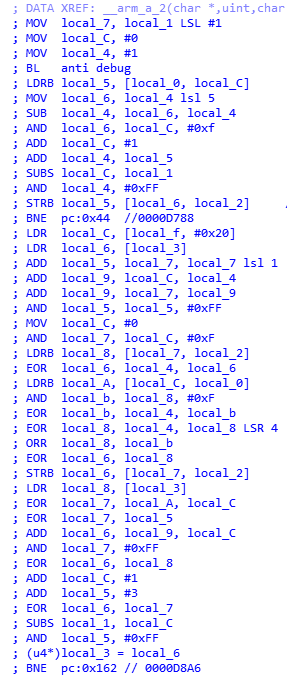

# libjiagu.so 解密，还原

url：https://bbs.pediy.com/thread-267029.htm


ELF 部分的解密流程

1. 读取 .bmp 解密key
2. 读取 .mips 用上面的 key 解密
3. 调用 uncompress 解密
4. 依次解密被抽调的数据和SO


```
public static jiagu decode_jiagu(byte[] bmp, byte[] mips){
jiagu jg = new jiagu();
byte[] key = decode_bmp(bmp);
if( key != null ){
    byte[] zip = decode_mips(mips, key);
    byte[] md = new byte[zip.length -4];
    System.arraycopy(zip, 4, md, 0, md.length);
    byte[] uncompress = unjzlib(md);
    if( uncompress == null )
        return null;
 
    int off = 1;
    jg.Phdr = elf_decode(uncompress, off);
    off += jg.Phdr.length + 4;
 
    jg.plt_rel = elf_decode(uncompress, off);
    off += jg.plt_rel.length + 4;
 
    jg.rel = elf_decode(uncompress, off);
    off += jg.rel.length + 4;
 
    jg.Dyn = elf_decode(uncompress, off);
 
    int pElf = off + jg.Dyn.length + 4;
    jg.elf = new byte[ uncompress.length - pElf ];
    System.arraycopy(uncompress, pElf, jg.elf, 0, uncompress.length - pElf);
 
}
return jg;
}
```


修复方法。直接写回去就好了。

```
public int save(String out){
	int err = 0;
int size = this.Phdr.length / SIZEOF_Elf32_Phdr;   
long dyn_address = 0, dyn_size = 0;
for(int i = 0; i < size; i++){
    // Type           Offset   VirtAddr   PhysAddr   FileSiz    MemSiz     Flg Align
    // PHDR           0x000034 0x00000034 0x00000034 0x00000100 0x00000100 R   0x4
    // DYNAMIC        0x031BFC 0x00032BFC 0x00032BFC 0x00000108 0x00000108 RW  0x4   
    Elf32_Phdr p = Bytes2Phdr( memcpy(this.Phdr, i * SIZEOF_Elf32_Phdr, SIZEOF_Elf32_Phdr) );
    if( p.p_type == PT_PHDR ){
        System.arraycopy(this.Phdr, 0, this.elf, (int)p.p_offset, this.Phdr.length);
        continue;
    }
    if( p.p_type == PT_DYNAMIC ){
        dyn_address = p.p_offset;
        dyn_size = p.p_filesz / SIZEOF_Elf32_Dyn;
        System.arraycopy(this.Dyn, 0, this.elf, (int)p.p_offset, this.Dyn.length);
        continue;
    }
}
 
if( dyn_address == 0 || dyn_size == 0 ){
    System.out.println("Elf32_Dyn 异常");
    return 1;
}
 
size = this.Dyn.length / SIZEOF_Elf32_Dyn;
long rel = 0, rel_count = 0;
long plt_rel = 0, plt_rel_count = 0;
// long symtab_address = 0, stratb_address = 0;
for(int i = 0; i < size; i++){
Elf32_Dyn dyn = Bytes2Dyn( memcpy(this.elf, dyn_address + i * SIZEOF_Elf32_Dyn , SIZEOF_Elf32_Dyn) );
if(dyn.d_tag == DT_PLTREL){
if(dyn.d_un.d_val != DT_REL){
System.out.println("DT_PLTREL 异常");
err = 2;
break;
}
}else if(dyn.d_tag == DT_JMPREL){
plt_rel = dyn.d_un.d_ptr;
}else if(dyn.d_tag == DT_PLTRELSZ){
plt_rel_count = dyn.d_un.d_val / SIZEOF_Elf32_Rel;

}else if(dyn.d_tag == DT_REL){
    rel = dyn.d_un.d_ptr;
}else if(dyn.d_tag == DT_RELSZ){
    rel_count = dyn.d_un.d_val / SIZEOF_Elf32_Rel;
    
// }else if(dyn.d_tag == DT_SYMTAB){
// symtab_address = dyn.d_un.d_ptr;
// }else if(dyn.d_tag == DT_STRTAB ){
// stratb_address = dyn.d_un.d_ptr;
}
}
if( rel != 0 && rel_count != 0 ){
size = (int) (rel_count SIZEOF_Elf32_Rel);
if( size > this.rel.length )
size = this.rel.length;
System.arraycopy(this.rel, 0, this.elf, (int)rel, size);
} else {
err = 3;
}
if( plt_rel != 0 && plt_rel_count != 0 ){
size = (int) (plt_rel_count SIZEOF_Elf32_Rel);
if( size > this.plt_rel.length )
size = this.plt_rel.length;
System.arraycopy(this.plt_rel, 0, this.elf, (int)plt_rel, size);
  } else {
        err = 4;
    }
 
 
    this.pshdr = ByteToDword(this.elf, 32);
    long e_shstrndx = ByteToWord(this.elf, 50);
    // 主动添加 .dynamic ，，否则readelf报错
    // [ 2] .dynsym           DYNSYM          00000148 000148 001b90 10   A  3   1  4
    long str = shstrtab();
    Elf32_Shdr es = new Elf32_Shdr();
    // [20] .dynamic          DYNAMIC         00032bfc 031bfc 000108 08  WA  3   0  4
    es.sh_name = sh_name(str, ".dynamic");
    es.sh_type = SHT_DYNAMIC;
    es.sh_addr = dyn_address;
    es.sh_offset = dyn_address;
    es.sh_size = dyn_size * SIZEOF_Elf32_Dyn;
    es.sh_entsize = SIZEOF_Elf32_Dyn;
    es.sh_flags = SHF_ALLOC | SHF_WRITE;
    es.sh_link = 3;
    es.sh_info = 0;
    es.sh_addralign = 4;
    System.arraycopy(Shdr2Bytes(es), 0, this.elf, (int)pshdr+ SIZEOF_Elf32_Shdr * 2, SIZEOF_Elf32_Shdr);
 
    // [32] .shstrtab         STRTAB          00000000 09c30f 000125 00      0   0  1
    es.sh_name = sh_name(str, ".shstrtab");
    es.sh_type = SHT_STRTAB;
    es.sh_addr = 0;
    es.sh_offset = shstrtab();
    es.sh_size = this.pshdr - str;
    es.sh_entsize = 0;
    es.sh_flags = 0;
    es.sh_link = 0;
    es.sh_info = 0;
    es.sh_addralign = 1;
    System.arraycopy(Shdr2Bytes(es), 0, this.elf, (int)(pshdr+ SIZEOF_Elf32_Shdr * e_shstrndx), SIZEOF_Elf32_Shdr);
 
    FileOutputStream fos = null;
    try {
        File file = new File(out);
        fos = new FileOutputStream(file);
        fos.write( this.elf );
        fos.close();
 
    } catch (Exception e) {
        err = 5;
    }
    return err;
}

```

DEX解密：
classes.dex 加固后的结构： 360的dex + 热修复信息 + 原APP的dex
1.读取360的dex大小，获取 热修复信息 偏移，大小,每个字节^ 0x52解密出信息

1. 热修复信息的地址，大小调用makekey->_Z9**arm_a_2PcjS_Rii->_Z9**arm_a_0v->_Z10__fun_a_18Pcj 计算2组KEY。
   翻译出来的代码如下
   

```
public static Object[] makekey(byte[] fix, long xor){
Object[] result = new Object[2];
byte[] rc4 = new byte[16];
long local_1 = fix.length, local_4 = 1, local_5 = 0, local_6 = 0;
long local_7 = fix.length << 1, local_8 = 0, local_9, local_A = 0, local_B = 0;
int local_C = 0;
for(local_C = 0; local_C < local_1; local_C++){
    local_5 = fix[local_C] & 0xFFL;
    local_6 = local_4 << 5;
    local_4 = local_6 - local_4;
    local_6 = local_C & 0xFL;
    local_4 += local_5;
    local_4 &= 0xFFL;
    rc4[(int) local_6] = (byte) (local_5 & 0xFFL);
}
local_C = 0;
local_6 = xor;
local_5 = (local_7 + (local_7 << 1)) & 0xFFL;
local_9 = local_C + local_4 + local_7;
for(local_C = 0; local_C < local_1; local_C++){
    local_7 = local_C & 0xFL;
    local_8 = rc4[(int) local_7] & 0xFFL;
    local_6 = (local_4 ^ local_6) & 0xFFFFFFFFL;
    local_A = fix[local_C] & 0xFFL;
    local_B = local_8 & 0xFL;
    local_B = (local_4 ^ local_B) & 0xFFFFFFFFL;
    local_8 = (local_4 ^ (local_8 >> 4)) & 0xFFFFFFFFL;
    local_8 = (local_8 | local_B) & 0xFFFFFFFFL;
    local_6 = (local_6 ^ local_8) & 0xFFFFFFFFL;
    rc4[(int) local_7] = (byte) (local_6 & 0xFFL);
    local_8 = xor;
    local_7 = (local_A ^ local_C) & 0xFFFFFFFFL;
    local_7 = (local_7 ^ local_5) & 0xFFFFFFFFL;
    local_7 = local_7 & 0xFFL;
    local_6 = (local_9 + local_C) & 0xFFFFFFFFL;
    local_6 = (local_6 ^ local_8) & 0xFFFFFFFFL;
    local_5 += 3;
    local_6 = (local_6 ^ local_7) & 0xFFFFFFFFL;
    local_5 &= 0xFFL;
    xor = local_6;
}
result[0] = rc4;
result[1] = xor;
return result;
}

```

3.依次读取每个DEX的数据,详细结构: dexindex+next+data1size+data1+data2
解密流程：

```
result = new byte[(int) size][];
long dex_off = 4;
for(int i = 0; i < size; i++){
    // next_off, dex_size, dex[]
    long next_off = off + dex_off;
    int size_1 = (int) ByteToDword(dex, next_off + 4);
    long size_2 = ByteToDword(dex, next_off);
 
    byte[] dex_data = memcpy(dex, next_off + 8, size_1);
    byte[] dex_data2 = memcpy(dex, next_off + 8 + size_1, size_2 - size_1 - 4);
 
    byte[] key = init_rc4(rc4, rc4.length);
    dex_rc4_decode(key, dex_data, size_1);
 
    dex_data = LZMA(dex_data);
    if(dex_data == null || dex_data.length == 0 )
        continue;
 
    for(int j = 0; j < 0x70; j++)
        dex_data[j] = (byte) (((dex_data[j] & 0xFFL) ^ (xor & 0xFFL) )& 0xFFL);   
 
    // 解密剩余的部分
 
    // 2个解密后的byte[]合并成一个行的byte[]
    byte[] dex_3 = new byte[dex_data.length + dex_data2.length];
    System.arraycopy(dex_data, 0, dex_3, 0, dex_data.length);
    System.arraycopy(dex_data2, 0, dex_3, dex_data.length, dex_data2.length);
 
    result[i] = dex_3;
    dex_off += size_2 + 4;
}
```

用makekey计算出来的rc4key 先解密，然后 LZMA:24解压，在把前0x70个字节和makeykey的第二个KEY^最后和dex_data2合并就得到完整的dex

其余的代码很好逆，菜鸟代码写的比较挫就不献丑了。