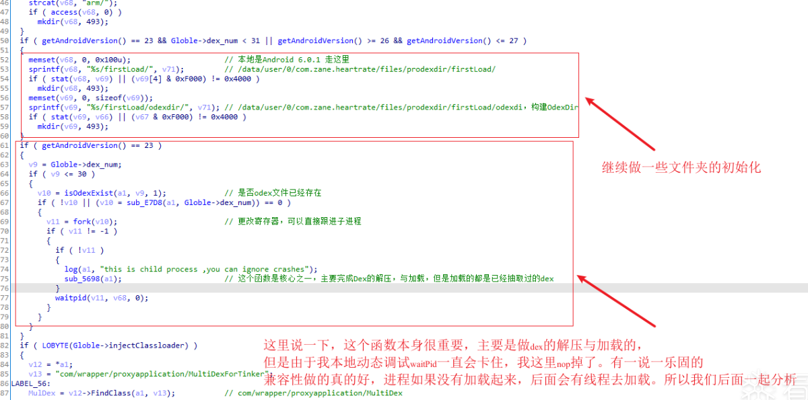

# 分析一下乐固

url：https://bbs.pediy.com/thread-266972.htm


### 前言

最近分析了一下乐固，20年中的一个版本，简单记录一下，感兴趣的小伙伴可以看一看。文中图片出现的字段和函数名绝大部分都是根据自己理解改变的，可能存在不准的情况，大家有需要就参考一下。如果文章内容有错误，请大家指正,并多多包含。

### Java层

定位com.zane.heartrate.MyWrapperProxyApplication->initProxyApplication()

 


 

下面直接进入So层

### So

#### init_array

简单看一下init_array


#### JNI_ONLOAD

可以看到已经被ollvm了


 

IDA 7.5 F5配合动态调试，可以慢慢探索里面的流程。

#### 读取加密数据

我们上面Java层分析到，有个比较重要的assets文件，会在Java层copy到应用的私有目录中


定位偏移sub_DAC4，我们先介绍一个Globle，一个重要的结构体。


 

下面依然可以看到一些重要的变量都存在Globle中


 

好，结构体介绍完了，下面介绍第一个阶段的核心，定位**sub_D01C: 这个函数主要负责加载起来那个加密的文件，并且读取文件中的内容，赋值Globle结构体，这里取的内容都比较重要，后面会用到**


 

**加密文件中读取数据**


##### 加载Dex

定位0x7098:这个函数是整个流程的核心，流程比较长

 


下面开始
   

##### sub_700C


那我们先看Dex是怎么出来的?
跟进**sub_6E30(prepareDex)**
   
经过上面的流程，Dex已经准备好了，现在继续分析如何把数据填充回去
跟进**sub_8D98**
  
上面说了，在有xp的情况下，会提前填充。如果没有xp的情况下，在哪里填充的呢？还记得我们上面说过，有xp的时候，乐固重新注册这个defineclassnative函数.

继续跟进**sub_BD7C**


### 脱壳

这个方法应该能脱掉近2年的所有乐固壳
hook libc的strstr

```
int new_strstr(char *str1, char *str2) {
    if (strcmp("xposed", str2) == 0) {
        return 1;
    }
    return old_strstr(str1, str2);
}
```

然后再hook libart的DefineClassNative对dex进行整体dump.

 

这种情况，dump出的dex全部是完整的。

### 反调试

sub_156FC这个函数中（原理rtld_db_dlactivity相关的，这个很多大佬已经分析过了）


### 一个问题

有个问题一直没解决，就是乐固会在新的进程中load dex，我本地动态调试过waitpid后一直卡住（后面我nop掉了waitpid，让乐固走了另一种方案），这种情况该怎么处理呢？希望大佬们能指点小弟一下。

### 致谢

谢谢大家的观看！！！
资源链接:
链接：https://pan.baidu.com/s/1U9FTvL78FT3n4p4XnBTgag
提取码：fdtd


