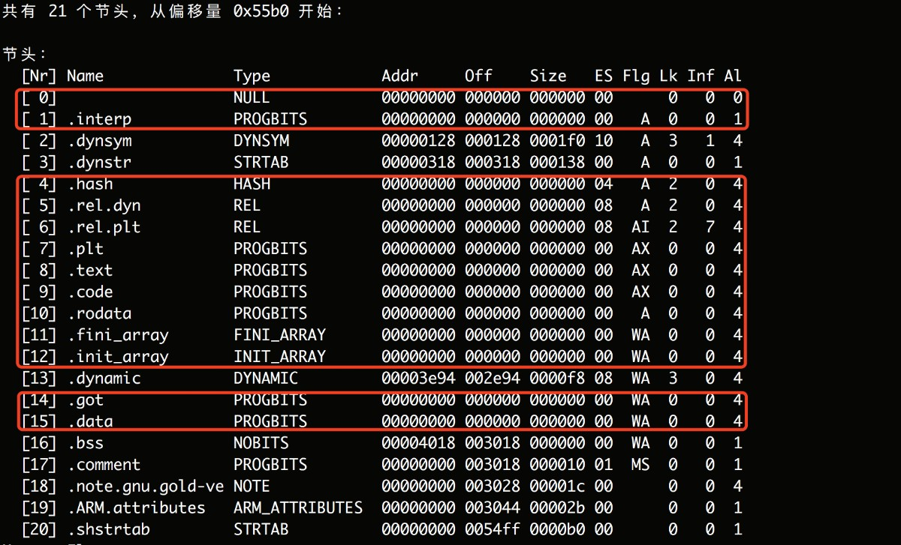
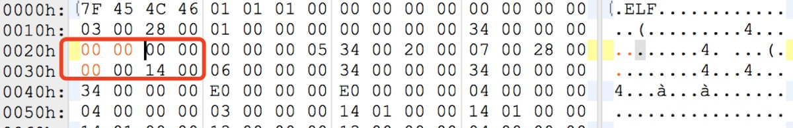
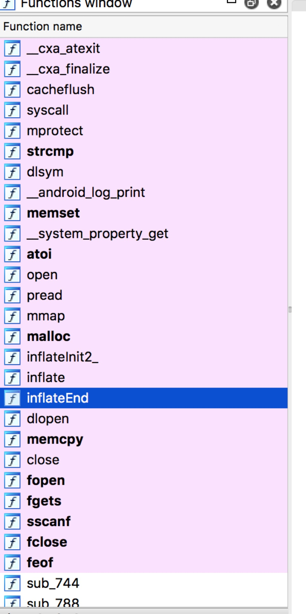
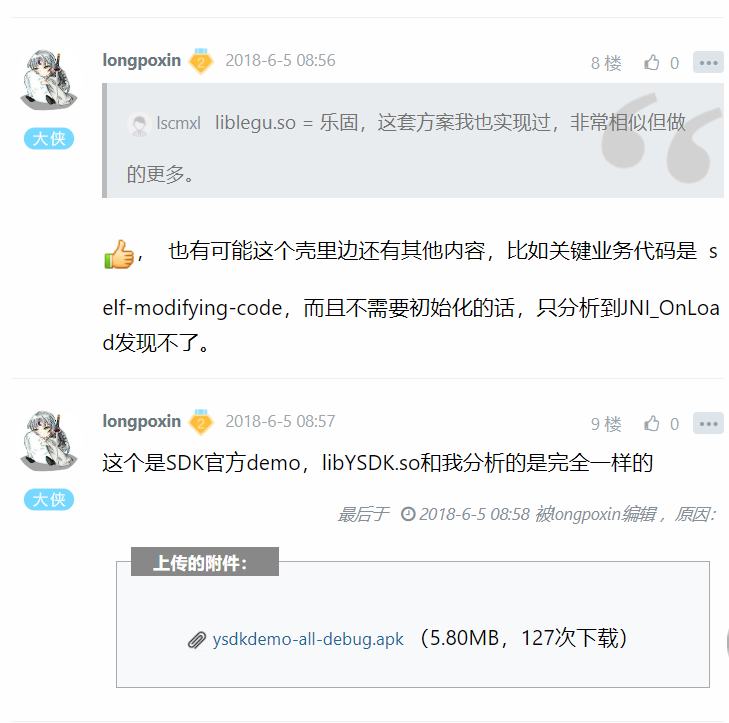
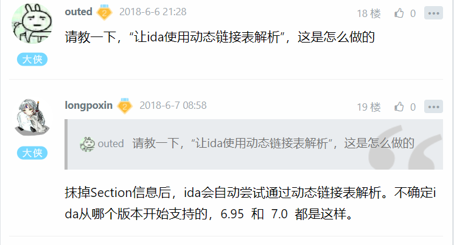

# 分析一个有趣的so双重壳

url：https://bbs.pediy.com/thread-227179-1.htm

# 背景

去年四五月份的时候客户反馈过一个so加壳的问题，分析后发现是和某Android应用市场SDK的libYSDK.so冲突。当时该so解壳过程中会操作linker的soinfo结构的部分数据，壳作者把dlopen返回的handle强制转成soinfo结构体指针，这操作个必然有兼容性问题。后来该壳也做了升级，其最新版本有一些挺有趣的技术点，跟大家分享下。


# 两层壳：

Ida直接打开:


函数列表只有31个sub_**（__mprotect是笔者改名来的）, 再看下Section表 ：




很多内容被擦掉了，dynsym 和 dynstr在7.0+上linker需要，必须保留，其他保留项对分析没什么用，壳的作者也保留了，这里直接抹掉elf-header中的section表偏移和大小，让ida使用动态链接表解析：




再用IDA打开后函数列表变了：




但是往下看代码区（JNI_OnLoad），代码加密了：


继续往后边拖拽，符号表竟然都在第二个loadsegment:


**init解密壳**


先考虑第一个loadsegment代码加密的问题，一般在linker的init中执行解密逻辑，init对应的那部分code一定是明文状态，greadelf –d libYSDK.so:


该so编译时的名字是“legu”，后来重命名为“YSDK”的，没有找到init段，只有init_array，跳过去看下：


看来sub_838就是解密函数了，贴上它的伪代码： 


```
int sub_838()
{
  unsigned int code_segment_end_segment; // ST28_4
  unsigned int data_segment_begin_page; // ST24_4
  unsigned int data_segment_end_page; // ST20_4
  unsigned __int64 v3; // kr00_8
  char v4; // ST13_1
  int result; // r0
  int v6; // [sp+4h] [bp-40h]
  int v7; // [sp+8h] [bp-3Ch]
  int j; // [sp+2Ch] [bp-18h]
  char v9; // [sp+30h] [bp-14h]
  char v10; // [sp+31h] [bp-13h]
  char v11; // [sp+32h] [bp-12h]
  char v12; // [sp+33h] [bp-11h]
  unsigned int v13; // [sp+34h] [bp-10h]
  _DWORD *e_pheaders; // [sp+38h] [bp-Ch]
  unsigned int i; // [sp+3Ch] [bp-8h]
 
  for ( i = (unsigned int)sub_838 & 0xFFFFF000; *(_DWORD *)i != 0x464C457F; i -= 0x1000 )
    ;
  e_pheaders = (_DWORD *)(*(_DWORD *)(i + 0x1C) + i);// i = loadbase
  v13 = 0;
  while ( *(unsigned __int16 *)(i + 0x2C) > v13 )// phnum > 0
  {
    if ( *e_pheaders != 1 || e_pheaders[6] != 5 )// type != PT_LOAD || flag != Read_Exe
    {
      if ( *e_pheaders == 1 && e_pheaders[6] == 6 )// type == PT_LOAD && flag == Read_Write
      {
        data_segment_begin_page = e_pheaders[2] & 0xFFFFF000;
        data_segment_end_page = (e_pheaders[2] + e_pheaders[4] + 4095) & 0xFFFFF000;
        break;
      }
    }
    else
    {
      code_segment_end_segment = (e_pheaders[2] + e_pheaders[4] + 4095) & 0xFFFFF000;
    }
    ++v13;
    e_pheaders += 8;
  }
  v12 = 0x2B;
  v11 = 0x99u;
  v10 = 32;
  v9 = 21;
  v3 = (unsigned __int64)(unsigned int)dword_4008 << 16;// 0x100028cc << 16
  v7 = (unsigned __int16)dword_4008;
  v6 = (unsigned __int16)dword_4008 - ((unsigned int)dword_4008 >> 16);
  _mprotect(i + ((unsigned int)dword_4008 >> 16), (v6 + 4095) & 0xFFFFF000, 3);// mprotect(loadbase + 0x1000, 0x2000, Read_Write)
  for ( j = HIDWORD(v3); j <= v7; ++j )         // 解密代码区加密部分（0x1000~0x28cc）
  {
    v4 = *(_BYTE *)(i + j);
    *(_BYTE *)(i + j) ^= (unsigned __int8)(((v11 - v10) ^ j) + v9) ^ v12;
    *(_BYTE *)(i + j) += v10 & v9 ^ v11;
    v12 += (v11 + v10 - v9) & v4 & j;
    v11 += (j + v12) ^ v4;
    v10 ^= (v4 - v12) ^ j;
    v9 += j - (v4 + v12);
  }
  _mprotect(i + HIDWORD(v3), (v6 + 4095) & 0xFFFFF000, 5);// mprotect(loadbase + 0x1000, 0x2000, Read_Exe)
  result = __cache_flush(i + HIDWORD(v3), v6);
  dword_4008 = i;            // JNI_OnLoad 中通过该变量获取so的路径
  return result;
}
```

对0x1000~0x28cc区间解密算法很简单，不过还是偷懒直接动态调试从内存扣了，ida脚本如下：

```
import idaapi
data = idaapi.dbg_read_memory(0xEF214000, 0xEF2158CC - 0xEF214000)
fp = open("/**/ysdk.dmp", "wb")
fp.write(data)
fp.close()
```

然后再替换到原so的0x1000~0x28cc上，再用IDA打开，JNI_OnLoad可以直接静态分析了（还原后的内容见附件）：


## JNI_OnLoad加载器壳 

IDA分析的第二个加载段中符号表是怎么回事呢？我们先看下010Editor打开该so后布局上的诡异之处：


很明显，文件末尾放着更多内容，这才是真正的业务逻辑相关的代码、数据，加载这些内容的代码就在JNI_OnLoad中,伪代码如下：

```
void *__fastcall JNI_OnLoad(int a1, int a2)
{
  void *v2; // r3
  int v4; // [sp+0h] [bp-414h]
  int v5; // [sp+4h] [bp-410h]
  int cur_so_path; // [sp+8h] [bp-40Ch]
  int (__fastcall *v7)(int, int); // [sp+408h] [bp-Ch]
  int v8; // [sp+40Ch] [bp-8h]
 
  v5 = a1;
  v4 = a2;
  memset(&cur_so_path, 0, 0x400u);
  while ( sub_2418((int)&cur_so_path) )         // 通过 dword_4008和maps比对 获取当前so的全路径，
                                                // 在init解密代码段结束时把dword_4008赋值为了当前so的base地址
    ;
  load_true_code((int)&cur_so_path, (int)off_4004);
  v8 = dlopen(&cur_so_path, 0);
  v7 = (int (__fastcall *)(int, int))dlsym(v8, "JNI_OnLoad");// 调用真正的JNI_OnLoad，当前这个JNI_OnLoad算是壳JNI_OnLoad吧
  _android_log_print(6, "txtag", "load done!");
  if ( v7 )
    v2 = (void *)v7(v5, v4);
  else
    v2 = &unk_10004;
  return v2;
}
```

核心内容在 load_true_code中，继续看伪代码（日志给了很多提示）：

```
int __fastcall load_true_code(int a1, int a2)
{
  void (__fastcall *v2)(int); // r3
  int v3; // r3
  int v4; // r3
  int v5; // r3
  int v6; // r0
  int v7; // r0
  int v8; // r0
  int offset; // [sp+10h] [bp-22D4h]
  int v11; // [sp+14h] [bp-22D0h]
  int *v12; // [sp+18h] [bp-22CCh]
  int v13; // [sp+1Ch] [bp-22C8h]
  unsigned int v14; // [sp+24h] [bp-22C0h]
  int v15; // [sp+28h] [bp-22BCh]
  int v16; // [sp+38h] [bp-22ACh]
  int v17; // [sp+3Ch] [bp-22A8h]
  int v18; // [sp+40h] [bp-22A4h]
  int v19; // [sp+50h] [bp-2294h]
  int v20; // [sp+1050h] [bp-1294h]
  char v21; // [sp+2050h] [bp-294h]
  unsigned int v22; // [sp+20DCh] [bp-208h]
  void *true_symstr_ptr; // [sp+20FCh] [bp-1E8h]
  void *true_symtab_ptr; // [sp+2100h] [bp-1E4h]
  int v25; // [sp+2104h] [bp-1E0h]
  int v26; // [sp+2108h] [bp-1DCh]
  void *v27; // [sp+210Ch] [bp-1D8h]
  unsigned int v28; // [sp+2110h] [bp-1D4h]
  void *v29; // [sp+2118h] [bp-1CCh]
  int v30; // [sp+211Ch] [bp-1C8h]
  void *v31; // [sp+2120h] [bp-1C4h]
  int v32; // [sp+2124h] [bp-1C0h]
  int v33; // [sp+2130h] [bp-1B4h]
  unsigned int v34; // [sp+2134h] [bp-1B0h]
  void (__fastcall *v35)(int); // [sp+2140h] [bp-1A4h]
  int v36; // [sp+2148h] [bp-19Ch]
  int v37; // [sp+214Ch] [bp-198h]
  unsigned int v38; // [sp+216Ch] [bp-178h]
  int v39; // [sp+21F0h] [bp-F4h]
  int v40; // [sp+21F4h] [bp-F0h]
  unsigned __int16 v41; // [sp+21F8h] [bp-ECh]
  unsigned __int16 v42; // [sp+21FAh] [bp-EAh]
  int v43; // [sp+2200h] [bp-E4h]
  int v44; // [sp+2204h] [bp-E0h]
  int v45; // [sp+2208h] [bp-DCh]
  int value_fe08; // [sp+220Ch] [bp-D8h]
  unsigned __int16 v47; // [sp+221Ah] [bp-CAh]
  unsigned __int16 v48; // [sp+221Ch] [bp-C8h]
  int v49; // [sp+2220h] [bp-C4h]
  int v50; // [sp+2224h] [bp-C0h]
  int v51; // [sp+2228h] [bp-BCh]
  int v52; // [sp+222Ch] [bp-B8h]
  int v53; // [sp+2230h] [bp-B4h]
  unsigned __int16 v54; // [sp+2234h] [bp-B0h]
  unsigned __int16 v55; // [sp+2236h] [bp-AEh]
  int v56; // [sp+2238h] [bp-ACh]
  int v57; // [sp+223Ch] [bp-A8h]
  unsigned __int16 v58; // [sp+2240h] [bp-A4h]
  char v59; // [sp+2244h] [bp-A0h]
  unsigned int v60; // [sp+2284h] [bp-60h]
  unsigned int v61; // [sp+2288h] [bp-5Ch]
  unsigned int v62; // [sp+228Ch] [bp-58h]
  int v63; // [sp+2290h] [bp-54h]
  unsigned int v64; // [sp+2294h] [bp-50h]
  int v65; // [sp+2298h] [bp-4Ch]
  unsigned int v66; // [sp+229Ch] [bp-48h]
  unsigned int v67; // [sp+22A0h] [bp-44h]
  unsigned int v68; // [sp+22A4h] [bp-40h]
  unsigned int v69; // [sp+22A8h] [bp-3Ch]
  unsigned int v70; // [sp+22ACh] [bp-38h]
  _DWORD *v71; // [sp+22B0h] [bp-34h]
  unsigned int base_ptr; // [sp+22B4h] [bp-30h]
  int min_vaddr; // [sp+22B8h] [bp-2Ch]
  int fd; // [sp+22BCh] [bp-28h]
  unsigned int m; // [sp+22C0h] [bp-24h]
  int k; // [sp+22C4h] [bp-20h]
  unsigned int j; // [sp+22C8h] [bp-1Ch]
  int v78; // [sp+22CCh] [bp-18h]
  int v79; // [sp+22D0h] [bp-14h]
  _DWORD *l; // [sp+22D4h] [bp-10h]
  unsigned int mmap_Addr; // [sp+22D8h] [bp-Ch]
  unsigned int i; // [sp+22DCh] [bp-8h]
  char v83[4]; // [sp+22E0h] [bp-4h]
 
  v11 = a1;
  offset = a2;
  memset(&v59, 0, 0x40u);
  _system_property_get("ro.build.version.sdk", &v59);
  sdk_ver_num = (void *)atoi(&v59);
  _android_log_print(6, "txtag", "version:%d", sdk_ver_num);
  do
    fd = open(v11, 0x80000);
  while ( fd == -1 );
  memset(&v39, 0, 0x54u);
  for ( i = 0; i <= 0x53; i = pread(fd, &v39, 0x54, offset) )// offset=58f8，读取了0x54个字节
    ;
  _android_log_print(6, "txtag", "load library %s at offset %x read count %x\n", v11, offset, i);
  memset(&v21, 0, 0x1A0u);
  _android_log_print(6, "txtag", "min_vaddr:%x size:%x\n", v39, v40);
  min_vaddr = v39;
  do
  {
    mmap_Addr = mmap(min_vaddr, v40, 0, 34, -1, 0);// 分配空间
    if ( mmap_Addr <= 0x457FFFFF && mmap_Addr > 0x40000000 - v40 && (unsigned int)sdk_ver_num <= 0xA )
    {
      _android_log_print(6, "txtag", "addr:%p", mmap_Addr);
      mmap_Addr = -1;
    }
  }
  while ( mmap_Addr == -1 );
  base_ptr = mmap_Addr - min_vaddr;
  v22 = mmap_Addr;
  v38 = mmap_Addr - min_vaddr;
  true_symstr_ptr = (void *)(v43 + mmap_Addr - min_vaddr);
  true_symtab_ptr = (void *)(v44 + mmap_Addr - min_vaddr);
  if ( v45 )
    v2 = (void (__fastcall *)(int))(v45 + base_ptr);
  else
    v2 = 0;
  v35 = v2;
  if ( value_fe08 )
    v3 = value_fe08 + base_ptr;
  else
    v3 = 0;
  v33 = v3;
  v34 = v47;
  v25 = v50;
  v27 = (void *)(v52 + base_ptr);
  v26 = v51;
  v28 = v52 + base_ptr + 4 * v50;
  v36 = v57;
  v37 = v58;
  v29 = (void *)(v53 + base_ptr);
  v30 = v54;
  v31 = (void *)(v56 + base_ptr);
  v32 = v55;
  _android_log_print(6, "txtag", "load_bias:%p base:%p\n", base_ptr, mmap_Addr);
  v71 = malloc(24 * v42);
  l = v71;
  for ( i = 0; 24 * (unsigned int)v42 > i; _android_log_print(6, "txtag", "read count:%x", i) )
    i = pread(fd, l, 0x18 * v42, v41 + offset);
  v79 = 0;
  while ( v42 > v79 )
  {                                             // 根据true_code的pheaders加载并解压相应内容
    v70 = *l + base_ptr;
    v69 = l[1] + v70;
    v68 = v70 & 0xFFFFF000;
    v67 = (v69 + 4095) & 0xFFFFF000;
    v66 = v67 - (v70 & 0xFFFFF000);
    i = 0;
    v78 = 0;
    if ( l[3] )
    {
      mmap(v68, v66, 3, 50, -1, 0);
      v16 = 0;
      v17 = 0;
      v18 = 0;
      v13 = 0;
      v12 = 0;
      while ( inflateInit2_(&v12, -15, "1.2.3", 56) )
        ;
      while ( l[3] > i )
      {
        if ( i + 4096 <= l[3] )
          v4 = 4096;
        else
          v4 = l[3] - i;
        v65 = v4;
        if ( i + 4096 <= l[5] )
          v5 = 4096;
        else
          v5 = l[5] - i;
        v64 = v5;
        v65 = pread(fd, &v19, v65, l[2] + offset + i);
        sub_D94((int)"Tx:12345Tx:12345", &v19, v64, 16);
        v13 = v65;
        v12 = &v19;
        _android_log_print(6, "txtag", "read count:%x", v65);
        v15 = 0x100000;
        v14 = v78 + v70;
        v63 = inflate(&v12, 0);
        v78 = v78 - v15 + 0x100000;
        i += v65;
      }
      inflateEnd(&v12);
      for ( j = v70; v78 + v70 > j; j += 1024 )
        _cache_flush(j, 1024);
      _android_log_print(6, "txtag", "seg_start:%p size:%x infsize:%x offset:%x\n", v70, l[3], v78, l[2]);
    }
    if ( l[4] & 2 && (v78 & 0xFFF) > 0 )
      memset((void *)(v78 + v70), 0, 4096 - ((v78 + v70) & 0xFFF));
    ++v79;
    l += 6;
  }
  memset(&v20, 0, 0x1000u);
  v62 = v49 + base_ptr;
  for ( k = 0; v48 > k; ++k )                   // 加载true_code依赖的so
  {
    v6 = dlopen((char *)true_symstr_ptr + *(_DWORD *)(v62 + 4 * k), 0);
    *(_DWORD *)&v83[4 * k - 4752] = v6;
  }
  _android_log_print(6, "txtag", "do relocate!\n");// 为true_code做重定位
  relocate_rel_table(&v21, v31, v32, &v20, v48);
  relocate_rel_table(&v21, v29, v30, &v20, v48);
  memset(v31, 0, 8 * v32);
  memset(v29, 0, 8 * v30);
  _android_log_print(6, "txtag", "replace");    // 用true_so的符号表、字符串表、hash表覆盖壳的对应内容
  fix_symtab((int)&v21);                        // 修正符号表的函数地址
  symtab_ptr = (Elf32_Sym *)((char *)symtab_ptr + dword_4008);
  _android_log_print(6, "txtag", "syminfo:%p new:%p size:%x", symtab_ptr, true_symtab_ptr, true_symtab_len);
  memcpy(symtab_ptr, true_symtab_ptr, true_symtab_len);
  _android_log_print(6, "txtag", "strtab:%p size:%x", (char *)symtab_ptr + true_symtab_len, true_symstr_len);
  memcpy((char *)symtab_ptr + true_symtab_len, true_symstr_ptr, true_symstr_len);
  _android_log_print(
    6,
    "txtag",
    "bucket:%p bucket:%p size:%x",
    (char *)&symtab_ptr->st_size + true_symtab_len + true_symstr_len,
    v27,
    4 * (v25 + v26));
  memcpy((char *)&symtab_ptr->st_size + true_symtab_len + true_symstr_len, v27, 4 * (v25 + v26));
  _android_log_print(6, "txtag", "set back protect of the memory\n");
  for ( l = v71; &v71[6 * v42] > l; l += 6 )
  {
    v61 = (*l & 0xFFFFF000) + base_ptr;
    v60 = ((*l + l[1] + 4095) & 0xFFFFF000) + base_ptr;
    mprotect(v61, v60 - v61, 4 * (l[4] & 1) | l[4] & 2 | ((l[4] & 4u) >> 2));
  }
  if ( v35 && v35 != (void (__fastcall *)(int))-1 )// 调用被加固代码的init
  {
    v7 = _android_log_print(6, "txtag", "init func:%p\n", v35);
    v35(v7);
  }
  for ( m = 0; v34 > m; ++m )                   // 调用被加固代码的init_array
  {
    if ( *(_DWORD *)(v33 + 4 * m) && *(_DWORD *)(v33 + 4 * m) != -1 )
    {
      v8 = _android_log_print(6, "txtag", "init array func:%p\n", *(_DWORD *)(v33 + 4 * m));
      (*(void (__fastcall **)(int))(v33 + 4 * m))(v8);
      *(_DWORD *)(v33 + 4 * m) = 0;
    }
  }
  close(fd);
  return 0;
}

```

**总结**

壳作者做了两层加固保护，第一次加密了代码段中JNI_OnLoad相关的代码，原理比较简单，在init中将加密的代码解密就OK。第二次是在JNI_OnLoad中，加载真正的业务逻辑代码（true_code）, 新的loadsegment布局到内存后，用新的symtab、symstr、hash表内容覆盖壳的对应数据，这样系统对该so再次dlopen和dlsym就是在true_code查找相关函数了。另外两个重要操作是对true_code重定位，以及修正新的symtab数据，因为linker在dlsym的时候符号地址要加load_bias，所以这里提前对符号表内容加了新mmap地址和壳load_bias之间的差值。

# 思考

如果我们正向考虑实现这套加固系统，应该怎么做呢？

\1. 需要提前编译好一个libstub.so，内容是init_array的解密函数和JNI_OnLoad的加载器代码，声明一些全局标记用来注入

\2. 打包so的工具，对libstub.so和需要加固的so处理，把加密信息和true_code的地址信息注入到libstub.so中

如果要改进，把JNI_OnLoad的内容放在init中做，以实现更强的通用性，需要注意重定位时不能再用dlopen和dlsym了，需要借助maps表找函数地址，但这种方式会有一些兼容性问题。

这套系统应该可以“免汇编”实现，维护方便，向壳作者致敬！如果分析有错误和纰漏，请大家多多指教！




