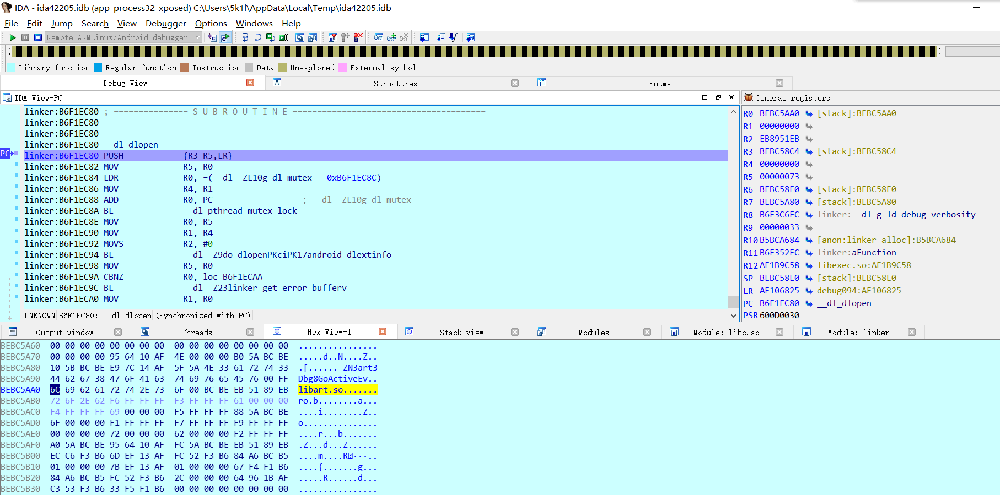
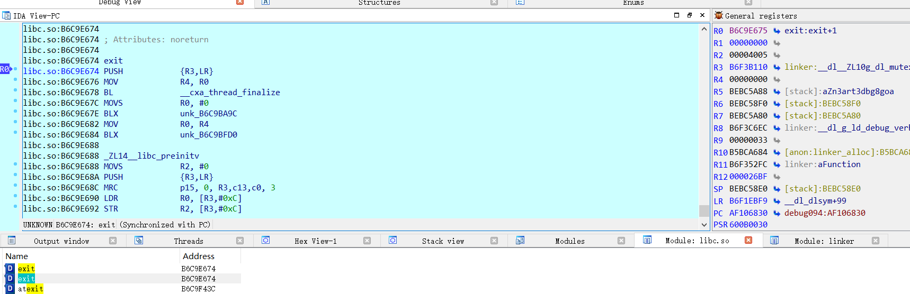
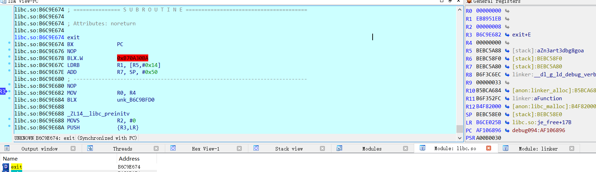
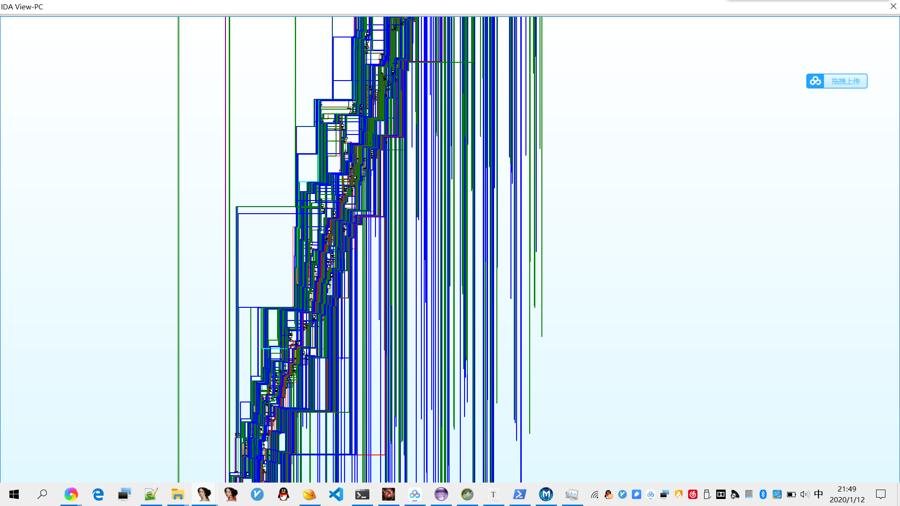
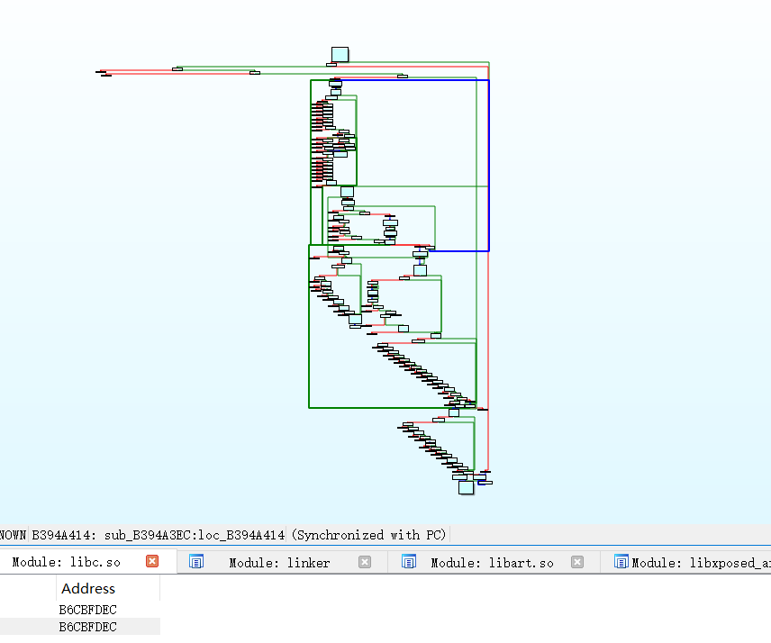
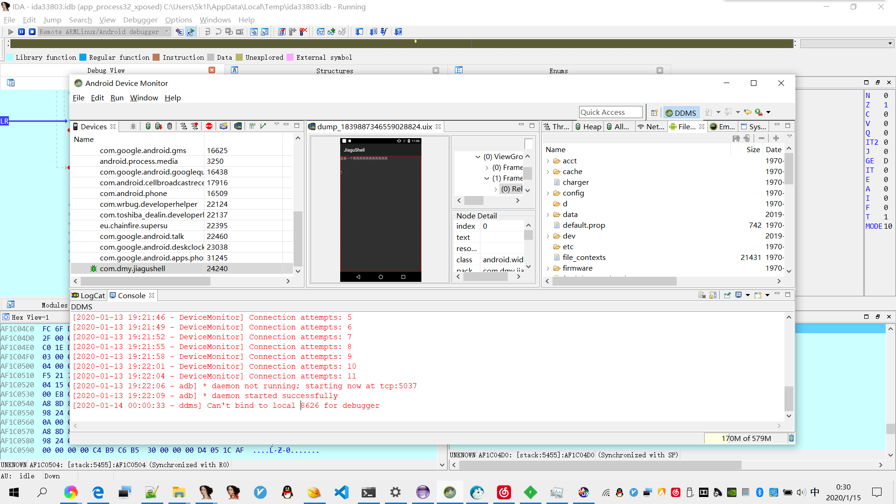

# CISCN2018—爱加密过反调试的尝试

url：https://5k1l.github.io/2020/01/12/CISCN2018%E7%88%B1%E5%8A%A0%E5%AF%86%E8%BF%87%E5%8F%8D%E8%B0%83%E8%AF%95%E7%9A%84%E5%B0%9D%E8%AF%95/


## 准备

手机root，打开调试模式，尽量尽量不要国产机器（产生一些奇奇怪怪的问题，我这里使用的是nexus 5， 6.0.1系统）

几条命令

```
adb push android_server /sdcard/
su
mount -o remount,rw /system #挂载system可读可写
cp android_server /system/bin/as #个人习惯，这样在环境变量目录里面了，直接as就能运行 还能避免对名字的检测
as -p23947 #端口直接紧跟-p
adb forward tcp:23947 tcp:23947 #端口转发 避免检测23946  本机 手机
adb shell am start -D -n monkeylord.trygetflag/monkeylord.trygetflag.MainActivity #需要打开monitor，自动转发到8700
jdb -connect "com.sun.jdi.SocketAttach:hostname=localhost,port=8700" #附加之后执行
```

之后看到了参考文章中X加密那一篇文章，发现基本是同一款，就直接使用了文章中提供的样本

## init initarray

init 是一个函数

initarray是一个数组，存放要运行的函数指针，进行反调试操作的有0x2c 0x2e对应的

其运行实际都要早于JNI_OnLoad，这个壳子就在这里做了一些操作

1. 调用gettimeofday进行时间反调试
2. status反调试，fopen fgets
3. signal 注册 1 2 3
4. hook _ZN3art3Dbg8GoActtivityEv
5. 可能还有其它的反调试，暂未发现

1 参考别人文章，对于r0置0即可

2 我的办法是先在fopen下断，看到打开了文件之后就在fgets段尾下断点，置r0为0，这样就不会进入判断了

我大概跟了一下status这个反调试，大概流程是先获取时间，之后getpid，用sprintf构造字符串/proc/xxxx/status，打开，然后fgets获取文件内容，使用strtok分解字符，strncmp匹配TracerPid，atoi转整数验证

3 signal反调试那个我按照参考文章中处理的，r1为要绑定的函数，置零即可，但是感觉好像

4 前边这算是比较常规，一开始直接下断点就发现了，后来在JNI_Onload里边有个函数反调试，死活找不到，我甚至把libexec.so导入表里面的函数大部分都下了个断，还是没有找到为什么挂了，后来提前在dlopen中下了个断，发现会dlopen libart.so 然后还会获取_ZN3art3Dbg8GoActiveEv的地址，传进某个函数，感觉很奇怪，上网搜了一下，发现这个函数在附加后会自动调用，还搜到了一个讲hook这个函数来反调试的文章，然后尝试将得到的地址换成了exit



我将其改成了exit函数，可以看到hook的效果





后来继续跟下去发现ijm还hook了好多函数，这个hook函数参数大概如下

r0 soname
r1 funcname
r2 replace func
r3 global

这样init 和initarray中的反调试就算过完了

## JNI_Onload进入之后

JNI_Onload可以在libart.so的LoadNativeLibrary下个断点直接进入

```
.text:0024A782                 ADD             R1, PC  ; "JNI_OnLoad"
.text:0024A784                 BLX             dlsym
```

这个之后跟几步就到了JNI_Onload

提前吐槽几句，这个混淆是真的牛皮，根本就没法看，放几张流程图





下边这是字符串隐藏

```
debug089:B3AA3694 81 54       STRB            R1, [R0,R2]
debug089:B3AA3696 07 4B       LDR             R3, =0x94
debug089:B3AA3698 9B 59       LDR             R3, [R3,R6]
debug089:B3AA369A 07 49       LDR             R1, =0xF4
debug089:B3AA369C 89 59       LDR             R1, [R1,R6]
debug089:B3AA369E C1 54       STRB            R1, [R0,R3]
debug089:B3AA36A0 06 4B       LDR             R3, =0xB8
debug089:B3AA36A2 9B 59       LDR             R3, [R3,R6]
debug089:B3AA36A4 06 49       LDR             R1, =0x11C
debug089:B3AA36A6 89 59       LDR             R1, [R1,R6]
debug089:B3AA36A8 C1 54       STRB            R1, [R0,R3]
debug089:B3AA36AA 06 4A       LDR             R2, =0xDC
debug089:B3AA36AC 92 59       LDR             R2, [R2,R6]
debug089:B3AA36AE 18 D4       BMI             loc_B3AA36E2
debug089:B3AA36B0 0A E0       B               loc_B3AA36C8
```

中间跟着各种跳，大跳小跳。

在这里发现了这几个反调试（或者说是检测）

1. gettimeofday之后pthread_create 一开始跟了，有一大堆汇编，后来的就直接跳过了，跳过也没发生啥异常
2. isDebuggerConnected 这个是JNI层调用的
3. 再次打开status文件
4. 时间反调试？
5. dexname 检测 dexhunter
6. maps 检测 ？修改dex？

1 我直接就跳过了

2 断在_ZN3art3JNI24CallStaticBooleanMethodVEP7_JNIEnvP7_jclassP10_jmethodIDSt9__va_list，修改返回值

3 上边提到了

4 记得timeofday第一个参数置零啊

5 我手机本身就不是dexhunter所以不用管

6 我没有去管，直接f9

## 成功截图



## 参考

[android源码中对于GoActive的解释](https://android.googlesource.com/platform/art/+/android-cts-5.0_r9/runtime/debugger.cc#734)

[X加密-反调试-DumpDex-修复指令-重打包](https://bbs.pediy.com/thread-249684.htm)

[Android逆向案例：干掉梆梆加固免费版的反调试检测](https://blog.csdn.net/CharlesSimonyi/article/details/91050233)