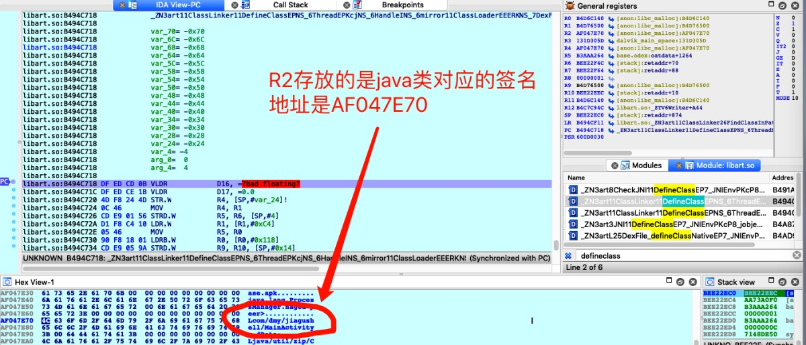

### X加密-反调试-DumpDex-修复指令-重打包

url：https://bbs.pediy.com/thread-249684.htm

## 1.简介

如果有描述不准确的地方，还请各位大佬指正


某加密的最近的版本，网上资料比较少,是比较早的，没有混淆的,以及没有指令抽取的

这里分析的实例，是某加密直接把壳代码写到了原始dex里面去


  1)反调试   网上的大部分资料都是些基础的反调试，而且SO是没有经过ollvm混淆的，所以都是些比较直观的能看到代码

​           而现在大部分是ollvm混淆过，另外加UPX压缩壳，以及SO自解密等

  2）dump dex，另一种找到dex.035的地址

  3) 修复被抽取指令，找到codeitem的insns指针，取出指令，填充到被nop的dex里面去 


  4) 重打包APK 应该是做了对抗dex2smali，无法转回去，不过有办法

## 2. 调试

先看看Application

```
// 各家的壳都类似, attach和onCreate做初始化工作
 
  protected void attachBaseContext(Context arg6) {
        // some code 
 
         调用2个native方法初始化壳，以及hook相关还原函数
        N.l(((Application)this), "com.dmy.jiagushell");
        N.r(((Application)this), "android.app.Application");
   }
 
    public void onCreate() {
     // some code
      调用真正apk的Application
       N.ra(((Application)this), "android.app.Application");
            if(S.n != null) {
                S.n.onCreate();
            }
    }
```

这个样本解压开虽然直接能看到dex，但是还是通过调试dump了一次，这样可以了解一下反调试


SO被ollvm混淆了，看起来很费力，所以都是从一些关键点下断点去调试和绕过


1-反调试

关于反调试，有文章介绍了17中反调试，可以参考一下，现有资料博客能搜到的反调试，就这几种

   时间检测，  检测status，检测ida端口，以及java层的反调试

但是现在的壳已经不止这几种了，多而杂，现在常见的信号反调试，以及断点检测就比较麻烦


可以参考  [IDA技巧](https://bbs.pediy.com/thread-249684.htm) 这位大神的方法，定位到initarray段的入口，和进入jni_onload的地址,


1.1 信号反调试，常识性的反调试，可以在bad_signal下断

 信号函数通常是   signal(SIGN_NO, antidebug_func)


跟进去看看 0xB388D391所在的函数内容，这个函数要在解密后才可以看到，就是获取pid，杀死


信号1，2，3的定义是

    

SIGHUP   终止进程   终端线路挂断
SIGINT   终止进程   中断进程
SIGQUIT  建立CORE文件终止进程，并且生成core文件   

绕过方法就是，signal注册信号函数的时候，吧函数地址改为0，让他注册失败


1.2

进入到initarray段的时候，会有很多个函数，我的做法是通常跳过，如果某一次跳过崩了，就进去找反调试

，就是这里的BLX R4,是循环进入initarray段内的函数


fget断点后看到status检测，修改为0即可，后面还会遇到检测，应该是检测了多次，可以用hook过掉，或者IDA直接手动改掉端口号


然后转换为数字 ，这个比较简单直接改掉字符串就行。


1.3 时间反调试，通常就是检测代码运行时间，暴力一点，R0保存的传入的参数,tm所以直接写0

 


struct timeval tm;


gettimeofday(&tm, NULL);


时间反调试是status检测是在同一函数内，这个结构看起来比较费力，而且比较多的是无效的if语句，还是找找汇编的关键点来的快

，

1.4 在application的几个native函数

找前面提到的java函数注册为native函数的地址 


看R2指针数据 是结构体，也就是0xBEE221E0

```
	
typedef struct {<br>    const char* name;<br>    const char* signature;<br>    void*       fnPtr;<br>} JNINativeMethod;
```


对应结构体，BEE221C8地址处就是函数名称，bee22198就是方法签名，可以看下面2张图

 也就是在java层的attachBaseContext中的第一个 


则be867090就是壳的第一个执行java层native函数


到第二个函数，这个点不像其他的 status是检测端口，时间是检测运行是否过长，以及信号注册函数

猜测可能是一个全局变量，存在这里，然后有我还没有发现的检测点，然后后面在判断这个全局变量（不知道这个解释是否合理）

如下图是运行到N.r这个里面进去

 

 就是这里的N.r这是个native函数，又一次检测，通过计算在调试的时候 上一步的地方 ，也就是0xB38ABC38 看出是在比较这个地址的值，不明白是什么检测方式，反正到这里下一句被崩，所以改了下寄存器先绕过吧


这里的反调试可能在检测一个全局变量


反调试可能还有检测断点的，偶尔会崩掉，这里请教下各位大佬，怎么快速定位检测断点的反调试


2.1 关于dumpdex，其实可以dump的点很多，我选择defineclass位于classlinker里面

是以为他的第三个参数是java类对应的签名就是哪个 env->FindClass的那个参数

由此可以判断此时加载的这个类是位于北加固的dex里面的，顺着这个地方可以找到DEX


根据这个参数可以找到dex



接下来， 看源码可以知道，第5个参数是dex引用，多余的参数在栈里，计算好地址 + 4 进去就是dex引用地址，然后这里比较奇怪的是dex的这个地址要加上4就能找到dex.035字符了，反正是加固前的DEX找到了，这里还要再琢磨下


这里看栈上的数据 aa73a0f0


  按说这个就是dex的地址了，但是这里需要加上4个字节才是真实的地址 也就是去b3aa9218，


往后20个字节是DEX的长度，好了直接dump

上脚本

```
import struct 
 
start = AskAddr(0xb3aa9218 , "start address:")
print "start address:%08x"%(start)
length = AskLong(0x3d98, "length:")
print "length:%d"%(length)
 
dump_so = "/Users/beita/Desktop//ijiami.dump.dex"
file = open(dump_so,'w')
file.close()
fn = AskStr(dump_so ,"save as:")
with open(fn,"wb+") as f:
    for addr in range(start , start+length):
        f.write(struct.pack("B" , Byte(addr)))
    print "success to save as " 
```


# （绕过 **部分反调试 ，因为这里的反调试我找到的不是所有的）**  此时dump出来的是方法体是空的


\4. 修复

  修复的，网上资料都能通用，我是编译源码直接写回DEX的，起始就是找到Method指针，然后取出insns的二进制，写回去就好了

我是改4.4的源码，因为小一点编译快一些

先看看被抽的dex ,指令都是空的，


// 如下是代码片段

```
// 在dvmResolveClass中过滤下方法名称
DexClassData *classData = dexFindClassData(pDvmDex->pDexFile, clsObj->descriptor);  
if(classData ==NULL) return;
// 里面的 dexFindClassData 直接调用就可以
for(u4 i = 0; i < classData->header.directMethodsSize; i++){ 
     
    Method *method = (Method *)(clsObj->directMethods + i);
    if(method == NULL || classData->directMethods ==NULL) continue; 
 
    DexMethod *dexMethod = classData->directMethods + i;    
    if(dexMethod == NULL || dexMethod->codeOff == 0) continue;
    const DexCode *code = (const DexCode *)(pDvmDex->pDexFile->baseAddr + dexMethod->codeOff);
    if(code == NULL) continue;        
  
    std::string insns_str;
    for(u4 k=0; k < code->insnsSize; k++){
        char tmp[32];
        // method->insns就是要回复的指令
        sprintf(tmp, "%04x ", method->insns[k]); 
        insns_str.append(tmp); 
    }
    // 用字符串拼接起来
}
```


还原前后


5.重打包 


我发现修复后的dex不能直接转smali，因为里面有 x加密加入的一些壳代码，

用d2j-dex2smali.sh吧修复的转成smali，然后删除那部分可代码，发现dex2smali会出错


解决办法：直接把修复的dex放进去先APKTOOL打包一下，然后把打包好的APK在 apktool d demo.apk 

这样就能转smali，方法比较简单，然后再打包就可以了

,经过测试运行是可以的，说明重打包方式有效，不过我觉得这里的原因可能是d2j-dex2smali的问题，apktool本身里面有转smali的工具，好在能解决这个问题


样本在后面的附件里


\-----------------------------------------------------------------------------------------------------------------------------------------------------

sodump出来的so进行分析比较简单，感谢ThomasKing的dump ，快速下断点过反调试，我感觉我没有吧反调试都找出来，只是找出了dump DEX的那部分，先分析到这里


如下偏移处

0x717c   0xd380  0x10cac 0x10cac 都是结束的地方

有很多无效判断来干扰分析，比如 这种代码,在汇编中会有很多看着蛋疼的地方

int x = 1;

if(x!= 1 && x==1) {}


还有花指令 


参考 :

https://bbs.pediy.com/thread-194053.htm


 https://bbs.pediy.com/thread-221876.htm


 


5  是不是加固会检测如果一个DEX比如类比较少，或者体积非常小，就不进行加密DEX，(加固厂商判断这是个测试APK？？？)，加固后直接在原来的基础上加进去了ProxyApplication部分代码呢