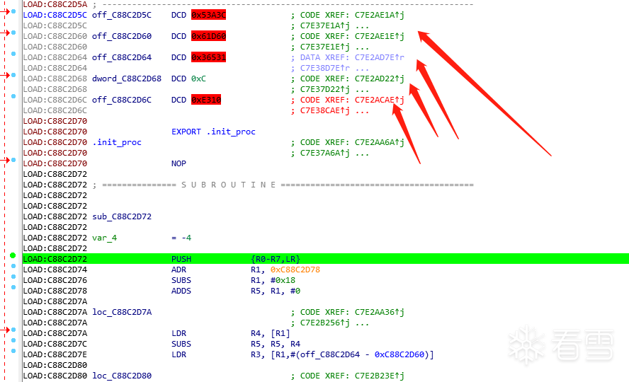
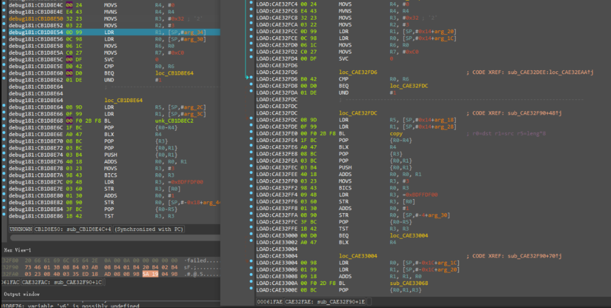
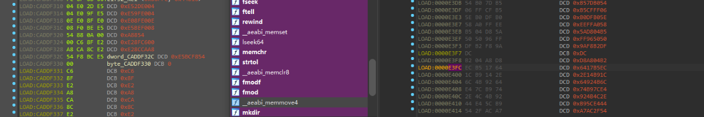
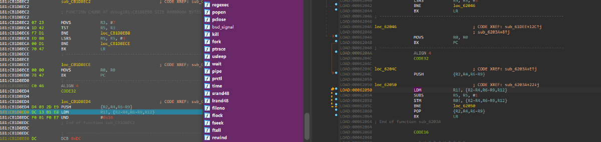
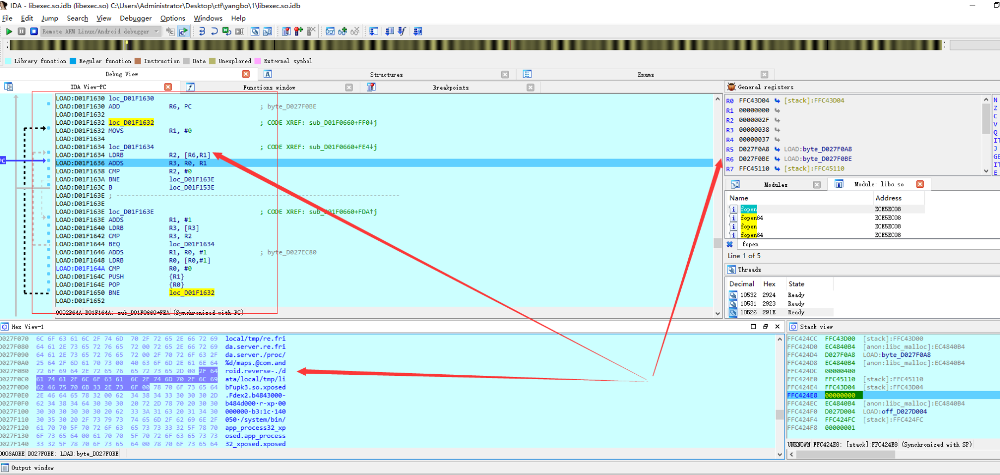
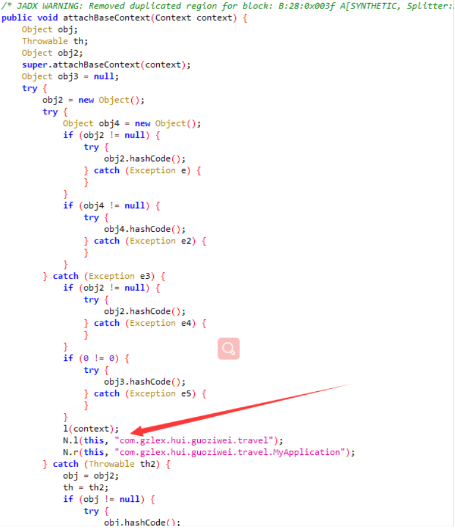
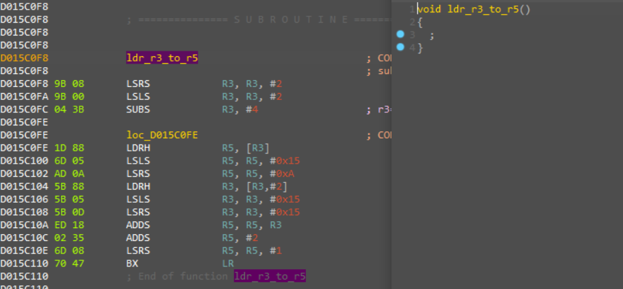

# 不知道起啥标题的某加固分析

url：https://bbs.pediy.com/thread-267155.htm


## 前言

  入手一个apk,我们该如何从头开始分析它那，讲apk分析的博客写的不少，但是很多都是大神写的，把关键点摘出来，让我们分享胜利的果实，但是那。。。。。。。。哎，可能是我更喜欢思路吧，更想问问大神是如何做到的，如何想的。

 

  得了，废话删了。

 

  下面说下目标，最近面试又被刷了，所以手撕一个apk找找感觉，手工硬调试，配置frida写动态脚本辅助分析

### 一、收集相关的安全资料和“测试”

- 测试

  > 你没看错，第一个就是测试。 测试要尽可能的全面，详细，尽可能一对一的找原因和结果
  >
  > 1. root测试
  > 2. magisk测试，隐藏非隐藏，magisk报名
  > 3. ida 和frida 开启，测试
  > 4. ro.debuggable测试，java附加测试
  >      说一下测试结果，上面这些一个不能开，root蹦，magisk非隐藏蹦（检查magisk的root），maigsk 不换包名蹦，java 附加，直接断开，ida 也蹦。单卡frida做不到，因为，必须root不蹦才行。感觉遇到了个大麻烦，一个坑一个坑的趟。

- 收集资料

  1. 想要分析加固，必有反调试啊，别人写的反调试来一份，了解原理，记录所有反调试点
  2. 反root，magisk,怎么怎么弄的找一找资料，寻找关键点，记录下来，可以挨个试
  3. 不写了，反正就是尽可能多了解这个加固的资料。

### 二、 寻找切入点，开始分析

  我们主要是要调试他，肯定要过反调试的，root权限，magisk什么的也想过了试试。测试的结果是，检查到root就崩溃，

1. 如果我们想用frida分析，首先可能就要通过脚本分析找到检测的点，过掉root检查，和magisk检查，以及frida检测
2. 如果我们直接附加调试，需要过掉反调试，root，magisk ,不必处理frida

  但是我都没有，首先我分析了java代码，看了一下他主要的so加载点，然后用frida脚本hook root检测可能的点，magisk 更换包名安转（最新版的的可能有点问题，有的手机更换包名不让用，可以用supersu,或者把包名卸载），肯定还有frida检测，所以我们要尽可能让apk死在frida检测的位置，而不是root检测的位置

```
Line 704: libc__access 0xe0c657f3 /data/local/su current Thread id: 16956
Line 705: libc__access 0xe0c657f3 /data/local/bin/su current Thread id: 16956
Line 706: libc__access 0xe0c657f3 /data/local/xbin/su current Thread id: 16956
Line 707: libc__access 0xe0c657f3 /sbin/su current Thread id: 16956
Line 708: libc__access 0xe0c657f3 /su/bin/su current Thread id: 16956
Line 709: libc__access 0xe0c657f3 /system/bin/su current Thread id: 16956
Line 710: libc__access 0xe0c657f3 /system/bin/.ext/su current Thread id: 16956
Line 711: libc__access 0xe0c657f3 /system/bin/failsafe/su current Thread id: 16956
Line 712: libc__access 0xe0c657f3 /system/sd/xbin/su current Thread id: 16956
Line 713: libc__access 0xe0c657f3 /system/usr/we-need-root/su current Thread id: 16956
Line 714: libc__access 0xe0c657f3 /system/xbin/su current Thread id: 16956
Line 715: libc__access 0xe0c657f3 /cache/su current Thread id: 16956
Line 716: libc__access 0xe0c657f3 /data/su current Thread id: 16956
Line 717: libc__access 0xe0c657f3 /dev/su current Thread id: 16956
Line 718: libc__access 0xe0c657f3 /system/sbin/su current Thread id: 16956
Line 719: libc__access 0xe0c657f3 /vendor/bin/su current Thread id: 16956
Line 720: libc__access 0xe0c657f3 /vendor/xbin/su current Thread id: 16956
```

Thread id是我后面发现很多线程后单独加上的

 

  从这里可以看到su文件检测的位置，通过修改这个函数的返回值，发现日志确实跑的比以前多一点了。

 

  然后是过frida检测，网上很多种凡是，什么检测maps,循环检测内存，read函数读文件，等等，实在太多了，frida脚本跑出了很多frida的关键字，但是感觉都有点问题，也不好修改。于是就放弃了使用脚本继续分析下去，改用动态调试找到frida检测的点，过掉，然后再用脚本辅助进行分析。

 

主要思维就是通过hook，分析加固逻辑，得出关键的点，然后利用动态调试，调试这些关键位置，这样循环推进，一环一环的解。

### 三、 初入调试，死的很展

  这就是理想很丰满，现实很骨感吗，ida f5大发完全失效,不是无法反汇编，就是反汇编过来我都觉得不对劲，入口函数看到一个init_proc函数，init_arry没找到，so载入的时候报错了，肯定做了特殊处理了(看到init_proc，我开始以为不会有init_arry了，实际上有)。

 

  动态调试，init_proc函数调着调着崩了，关键是，只调用了svc


```
一次svc 申请内存
一次svc 申请号好像是2w+ 不知道干嘛的，开始ida7.5在这里一直崩溃，于是我选择了跳过这条指令试试，反正后面一样崩溃，但是不跳过直接崩溃，开始的时候，以为是反调试，正常代码不走这里，于是调试了一天，一步一步跟，但是确实没有反调试相关函数的调用啊，于是每次在这个代码的位置下断点，手工跳过，接着跟代码，发现最后好像回调到一段申请的内存，肯定是前面申请的位置无疑了。
然后我继续跟，发现申请内存的代码某个位置发现了指令错误，不管怎么跑，都指令错误，还时不时的变更错误的位置，对了中间还夹杂这无数的ida错误，让我难辨真假。
```

<font size=6>写到这我必须要吐槽一下ida7.5,调试别的我没试过，但是armv7，坑也太多了，我给列下</font>：

1. 无故指令报错，arm 和thumb切换的时候，经常在libc库就崩了，关键是还崩在我下断点的位置不远，感觉这是往我心脏上插刀子啊。
2. 就是上面svc 2w+ 哪个，经常崩，好像没有不崩的时候
3. python3脚本不好用，一跑自动化脚本，就卡死，救不了
4. 开的时间长了，或者调试的时间长了，反正也不知道怎么回事，就在跑分析了，动也不动，关键是，时间也太长了，我跑了一晚上第二天一看，还没跑完，调也调不了，只能重开
5. 用ida7.0 能好一些，指令报错很少了，自动化脚本，也会好一些，

  整个崩溃的代码，从头到尾，基本都分析过了，但是没有发现什么反调试的痕迹，关键是还是，错误的位置还是动态的。

1. 断点反调试

```
后来我思考了一下，入口代码的逻辑，就是申请了一段内存，外加copy操作，那肯定是复制到申请的内存，然后每次崩溃都在申请内存崩溃，也就是，复制进去的内存本身有问题，然后我跟了一下，复制的原地址，竟然，包含了我真正调试的位置，然后我就懂。
原理就是通过我在内存中下断点，下了断点的位置，指令比如是有问题，把这段指令复制过去，断点也过了，所以执行必然报错，这种方式不需要调用系统函数，只要你调试这段复制的内容，就会自动崩溃。
```

后续接着调试，这个so是有init_array 的，我开始没发觉，ida只点了，so库加载的断点，这个so,做了特殊处理，估计是节头表删了，某些位置做了加密，怎么跑都跑不过去，我觉得，这个so的init执行玩肯定要执行下一个so的init啊，结果怎么跑也不行。后来我无意间在ptarce下了个断点试试，结果一直崩溃，ida7.5有bug。反正就是过不去了，不知道哪里有问题。

### 三、 frida辅助分析，精准定位so库调用点

  调试过不去，于是我找脚本试试运气，看看脚本是否跑过了这一块

```
我开始直接hook的linker 的 __dl__Z9do_dlopenPKciPK17android_dlextinfoPKv 函数，发现加载了好几个so：
    libexec.so
    libdvm.so
    libexecmain.so
    libmthook.so
看见这个libdvm.so 吓傻了，不会是4.4的dvm虚拟机给整上了吧，但是在本地中我没法libdvm.so，然后我想dump出来看看，也没有，看了下加载路径，没有后缀直接“libdvm.so”，我想了下，这不会是加载下dvm试试吧，通过dvm判断虚拟机啊，反正，我手机上没有。
    算了直接写结果了。hook __dl__Z9do_dlopenPKciPK17android_dlextinfoPKv 这个函数，只能证明，有人调用过dlopen ，是没有办法，没法定位到具体是init_proc 和init_array 的。我们可以hook掉调用init 函数的具体位置。
    android8 liner文件 符号：
        __dl__ZL13call_functionPKcPFviPPcS2_ES0_   
 
    这样就能找到具体是哪个ini函数调用的，我们还能打印出init函数地址，定位到具体是哪个init_array函数调用了那些系统函数
 
so_name onEnter：,/data/user/0/com.gzlex.hui.guoziwei.travel/files/libexec.so currentThread 31443
__dl__ZL13call_functionPKcPFviPPcS2_ES0_ currentThread 31443
return addr:,0xe8674c71 currentThread 31443
0xe8674c71 currentThread 31443
GetFieldID is at ,0xe4b26f0d,_ZN3art3JNI10GetFieldIDEP7_JNIEnvP7_jclassPKcS6_ currentThread 31443
AllocObject is at ,0xe4b10b8d,_ZN3art3JNI11AllocObjectEP7_JNIEnvP7_jclass
........
_ZN3art3JNI21ReleaseStringUTFCharsEP7_JNIEnvP8_jstringPKc currentThread 31443
FindClass is at ,0xe4b0bd81,_ZN3art3JNI9FindClassEP7_JNIEnvPKc currentThread 31443
linker_call_addr ,0xc7856d71 currentThread 31443
......
linker_call_addr ,0xc78895a5 currentThread 31443
linker_call_addr_leave ,0xc78895a5 currentThread 31443
linker_call_addr ,0xc788af49 currentThread 31443
linker_call_addr_leave ,0xc788af49 currentThread 31443
linker_call_addr ,0xc7805139 currentThread 31443
libc____system_property_get,0xc7806023,ro.build.version.sdk currentThread 31443
libc____system_property_get,0xc7806023,ro.build.version.sdk currentThread 31443
libc____system_property_get,0xc780612d,ro.yunos.version currentThread 31443
libc____system_property_get,0xc78061bf,ro.yunos.hardware currentThread 31443
libc____system_property_get,0xc780542f,ro.build.id currentThread 31443
linker_call_addr_leave ,0xc7805139 currentThread 31443
linker_call_addr ,0xc7807729 currentThread 31443
linker_call_addr_leave ,0xc7807729 currentThread 31443
.....
linker_call_addr ,0xc781f3e1 currentThread 31443
libc__fopen,0xc781f76d,/proc/31443/status currentThread 31443
libc__open,0xe72e6c33,/proc/31443/status currentThread 31443
libc__read,0xe72e6a0f,0x1f currentThread 31443
libc__fgets,TracerPid:  0 currentThread 31443
libc____system_property_get,0xc780c2cb,ro.build.version.sdk currentThread 31443
libc____system_property_get,0xc780c2cb,ro.build.version.release currentThread 31443
libc____system_property_get,0xc780c2cb,ro.build.version.release currentThread 31443
libc____system_property_get,0xc780c2cb,ro.build.version.sdk currentThread 31443
libc__fopen,0xc780a101,/proc/self/maps currentThread 31443
libc__open,0xe72e6c33,/proc/self/maps currentThread 31443
libc__read,0xe72e6a0f,0x1f currentThread 31443
libc__read,0xe72e6a0f,0x1f currentThread 31443
 
在上面我们还通过fopen 函数hook 找到了TracerPid 的位置（fgets函数是后续分析代码所得）
```

找到这这些函数以后，发现中间还有函数没有hook,jni_onload(这个后面写)

 

  通过frida，精准的定位到调用位置的偏移地址，然后在便宜位置下断点，调试就可以了
当然，即使这样最后，手工调试，依然没有完全的跑过去，frida的脚本，经过改善，最后跑到应用层，过掉了加固的检测，但是被应用本身的root检测被杀了，这个应用有两个地方进行root检测。反调试，最后调试到了多线程的位置，但是可能有线程同步的问题，直接睡眠没过去。看了hook脚本，后续可能没什么了，就当失败了吧。当然，后续还会有下文的，埋个伏笔。

### 四、具体调试情况

1. init_proc入口的技术

开始通过 init_proc函数，前面的几个存储好的内存数据，计算好要操作的数据



```
copy src: base + E000 malloc首地址  r5 = c4 跟上面一样  r5 = len  = c4
copy src: base  + E3D8  dst: malloc首地址+ 310  r5 = 14E60
copy src: base +  61E0C  dst: malloc首地址+ 310+ 14E60*4    r5 = 0x62
copy src: base +  61DBD  dst: malloc首地址+ 310+ 14E60*4 + 0x62*4     r5 = 0xD
copy src: base +  61FC4   dst: 上面的地址+长度     r5 = 0x2D
 
copy的内容页对齐的，方便后面清空这部分数据
```

申请内存的地址+53E4C,就是跳转到申请内存函数的第一个地址（ 跑了几次，结果相同53E4C ）
两边的内容是完全相同的，在so文件偏移 0x61FC4，这个地址，可以通过偏移和源文件对比,而且这个位置，刚好在init_proc跑的时候，跑了前半部分，这一部分没有跑。




还有copy函数，以及地址和数据大小问题，上面的copy次数可以看出来，其实主要大小就是第二次，而后三次，应该是用来反断点调试的，确保你调试这段copy过去的函数的时候，能刚好在copy过去要执行的代码上。


```
OAD:C88C2DEE                 PUSH            {LR}
LOAD:C88C2DF0                 LDRB            R3, [R1,#5]
LOAD:C88C2DF2                 PUSH            {R3}
LOAD:C88C2DF4                 LDRB            R3, [R1,#6]
LOAD:C88C2DF6                 PUSH            {R3}
LOAD:C88C2DF8                 PUSH            {R4}
LOAD:C88C2DFA                 PUSH            {R0}
.........
.........
OAD:C88C30FA loc_C88C30FA                            ; CODE XREF: C7E2B0B6↑j
LOAD:C88C30FA                                         ; C7E380B6↑j ...
LOAD:C88C30FA                 LSLS            R3, R3, #2
LOAD:C88C30FC                 SUBS            R3, #4  ; r3= 上层函数进入的地址
LOAD:C88C30FE
LOAD:C88C30FE loc_C88C30FE                            ; CODE XREF: C7E2A9BA↑j
LOAD:C88C30FE                                         ; C7E2ADF6↑j ...
LOAD:C88C30FE                 LDRH            R5, [R3]
LOAD:C88C3100
LOAD:C88C3100 loc_C88C3100                            ; CODE XREF: C7E2ACBA↑j
LOAD:C88C3100                                         ; C7E37CBA↑j ...
LOAD:C88C3100                 LSLS            R5, R5, #0x15
LOAD:C88C3102                 LSRS            R5, R5, #0xA
LOAD:C88C3104                 LDRH            R3, [R3,#2]
LOAD:C88C3106
LOAD:C88C3106 loc_C88C3106                            ; CODE XREF: C7E2AA56↑j
LOAD:C88C3106                                         ; C7E2AA62↑j ...
LOAD:C88C3106                 LSLS            R3, R3, #0x15
LOAD:C88C3108                 LSRS            R3, R3, #0x15
LOAD:C88C310A                 ADDS            R5, R5, R3
LOAD:C88C310C                 ADDS            R5, #2
LOAD:C88C310E
LOAD:C88C310E loc_C88C310E                            ; CODE XREF: C7E2A9CA↑j
LOAD:C88C310E                                         ; C7E379CA↑j ...
LOAD:C88C310E                 LSRS            R5, R5, #1
LOAD:C88C3110                 BX              LR
 
 
明显是手工写的汇编，首先将lr 地址放入r3，然后跳转到取地址的函数以后，通过lr，减4，就得到了b指令的地址，而b指令，会有一个跳转位置的相对偏移，就可以用这个偏移作为copy的大小
```

通过mmap 将源地址内容清空 ,清空的内容是 base + E000 ，然后将复制到malloc中的内容，在复制回去，解密

```
这里清口的代码包括init_proc入口的代码，也就是，调试一会，发现入口函数的代码数据，全部变成0了
```

解密数据 eor 0x50 (310第一个数据开始对比)


 

下面这个函数是copy函数，我在这个位置下了断点，结果在copy过去的时候，断点错位，指令无法解析


1. init_array系列函数

init_array函数应该有两次的 fopen /proc/self/status ,检测TracerPid。

 

  这两个ptrace，我是直接在open函数下断点，然后硬调试出来的，而且，最后我发现他调用fgets函数来获取结果，这个fgets函数在这个加固中很关键，许多位置都是直接调用fgets返回的，像frida内存maps检测的时候。而且，我还发现他特别喜欢调用时间函数，我hook的是 gettimeofday 这函数，然后每次这个函数一出来，都是关键位置，直接找到相关代码了。

1. 特征检测

  这部分代码在哪里找到的我忘了，但是fgets是我的幸运函数（我想以后可能不会有人用了），我hook open函数以后，如果打开关键文件，我就hook fgets，果然，我看他打开了maps文件，然后就跟我下去，发现了这个汇编写的比较函数：



```
/data/local/tmp/libFupk3.so
/data/dexname
/data/local/tmp/unpacker.config
/data/fart
/data/local/tmp/re.frida.server.re.frida.server
com.example.FunDex-
```

1. 多线程与反调试创建线程的代码

```
偏移位置和函数地址（没写全）
Line 228: module name: libexec.so offset: 0x1ec93    0x1EB60 
open proc/self/status  fgets  strdup  strtok  
然后找到了base.apk文件，fread了几个字节，然后关闭了
然后好像，直接退出了
 
Line 261: module name: libexec.so offset: 0x2b037    0x2BCDC
sleep(1)
open proc/self/status  fgets   TracerPid
 
后几个我直接用frida脚本，打印thread id ,看结果
Line 266: module name: libexec.so offset: 0x2b045
Line 271: module name: libexec.so offset: 0x2b057
Line 276: module name: libexec.so offset: 0x2b18b
```

在第一个线程创建完了以后有一个java debug检测

```
android/os/Debug.()Z.isDebuggerConnected   检测位置   0x1AC54 偏移
```

然后有一次/proc/getpid()/status ，检查TracerPid。
之后在后几个线程里，有检测，我尝试过睡眠过几个线程，但是效果不好全部卡死了，怀疑可能有线程同步部分，最后这一部分没有好好分析。

 

wchan反调试，是无意间发现的，我当时hook的popen ，我以为他会用 mount 来检查magisk，是我菜了，然后无意间发现了这个， proc/self/wchan 这个文件会有个字符串，attach以及调试的时候是不同的，可以通过读取这个文件做反调试。

 

还有一个线程，循环检测TracerPid
可能还有linker 反调试什么的，但是后学没有接着调试了。
目前就发现了这些

 

5.jni jni_onload

 

函数dlopen libdvm.so好像还有libmthook.so库(这个，我后续的frida分析日志，打印的日志不太匹配，不太确定了)
然后会调用attachbaseContext的这个位置的函数



这个 l 是个native

 

public static native boolean l(Application application, String str);

 

就到这里了，后续没有在分析了，frida已经跑过去了，硬分析没什么意义了。

1. frida so文件检测

大部分都是通过maps文件检测,另外还有内存扫射frida的，端口检测的这个不说了

```
frida这个路径是固定的，开源的必在这个位置
/data/local/tmp/re.frida.server/frida-agent-32.so
 
 
/proc/self/fd 下 /data/local/tmp/re.frida.server/linjector-13 凡是开了frida的都有这个文件描述符，检测这里也能检测到
/proc/self/fd u0_a125 u0_a125 64 2021-04-10 00:33 34 -> /data/local/tmp/re.frida.server/linjector-13
```

这里我提供一种隐藏maps文件检测的方法，这个方法的来自Riru 的 hide self maps

 

大致原理就是就这一段内存mmap一下，不过这个代码，必须放到一个so库中，通过获取符号调用，不能隐藏它本身

```
struct hide_struct {
    procmaps_struct *original;
    uintptr_t backup_address;
};
 
static int get_prot(const procmaps_struct *procstruct) {
    int prot = 0;
    if (procstruct->is_r) {
        prot |= PROT_READ;
    }
    if (procstruct->is_w) {
        prot |= PROT_WRITE;
    }
    if (procstruct->is_x) {
        prot |= PROT_EXEC;
    }
    return prot;
}
 
#define FAILURE_RETURN(exp, failure_value) ({   \
    __typeof__(exp) _rc;                    \
    _rc = (exp);                            \
    if (_rc == failure_value) {             \
        LOGE(#exp);                        \
        return 1;                           \
    }                                       \
    _rc; })
 
static int do_hide(hide_struct *data) {
    auto procstruct = data->original;
    auto start = (uintptr_t) procstruct->addr_start;
    auto end = (uintptr_t) procstruct->addr_end;
    auto length = end - start;
    int prot = get_prot(procstruct);
 
    // backup
    data->backup_address = (uintptr_t) FAILURE_RETURN(
            mmap(nullptr, length, PROT_READ | PROT_WRITE, MAP_ANONYMOUS | MAP_PRIVATE, -1, 0),
            MAP_FAILED);
    LOGD("%" PRIxPTR"-%" PRIxPTR" %s %ld %s is backup to %" PRIxPTR, start, end, procstruct->perm,
         procstruct->offset,
         procstruct->pathname, data->backup_address);
 
    if (!procstruct->is_r) {
        LOGD("mprotect +r");
        FAILURE_RETURN(mprotect((void *) start, length, prot | PROT_READ), -1);
    }
    LOGD("memcpy -> backup");
    memcpy((void *) data->backup_address, (void *) start, length);
 
    // munmap original
    LOGD("munmap original start = %x",start);
 
    FAILURE_RETURN(munmap((void *) start, length), -1);
 
    // restore
    LOGD("mmap original");
    FAILURE_RETURN(mmap((void *) start, length, prot, MAP_ANONYMOUS | MAP_PRIVATE, -1, 0),
                   MAP_FAILED);
    LOGD("mprotect +w");
    FAILURE_RETURN(mprotect((void *) start, length, prot | PROT_WRITE), -1);
    LOGD("memcpy -> original");
    memcpy((void *) start, (void *) data->backup_address, length);
    if (!procstruct->is_w) {
        LOGD("mprotect -w");
        FAILURE_RETURN(mprotect((void *) start, length, prot), -1);
    }
    return 0;
}
 
int riru_hide(std::string &names) {
    procmaps_iterator *maps = pmparser_parse(-1);
    if (maps == nullptr) {
        LOGE("cannot parse the memory map");
        return false;
    }
 
    char buf[PATH_MAX];
    hide_struct *data = nullptr;
    size_t data_count = 0;
    procmaps_struct *maps_tmp;
    while ((maps_tmp = pmparser_next(maps)) != nullptr) {
        bool matched = false;
//#ifdef DEBUG_APP
//        matched = strstr(maps_tmp->pathname, "libriru.so");
//#endif
        matched = strstr(maps_tmp->pathname,names.c_str());
 
        if (!matched) continue;
 
        auto start = (uintptr_t) maps_tmp->addr_start;
        auto end = (uintptr_t) maps_tmp->addr_end;
        if (maps_tmp->is_r) {
            if (data) {
                data = (hide_struct *) realloc(data, sizeof(hide_struct) * (data_count + 1));
            } else {
                data = (hide_struct *) malloc(sizeof(hide_struct));
            }
            data[data_count].original = maps_tmp;
            data_count += 1;
        }
        LOGD("%" PRIxPTR"-%" PRIxPTR" %s %ld %s", start, end, maps_tmp->perm, maps_tmp->offset,
             maps_tmp->pathname);
    }
 
    for (int i = 0; i < data_count; ++i) {
        do_hide(&data[i]);
    }
 
    if (data) free(data);
    pmparser_free(maps);
    return 0;
```

1. magisk检测

可能是我这个有点老，没有只有包名和so，这里我提供一种git上找到的，原理不讲了，有时间magisk单开一个
https://github.com/darvincisec/DetectMagiskHide

1. 如何预防idf反汇编，只谈论armv7

   不知道为什么好像没有人写过这个问题
   下面这个函数，就是其中一个例子。

   

ARM 汇编和 c函数调用是有标准的，ARM调用标准（ATPC）与函数参数传递,我就写一点，剩下网上查吧

```
1 寄存器的使用必须满足下面的规则：
子程序间通过寄存器R0-R3来传递参数，这时，寄存器R0-R3可以记作A1-A4。被调用的子程序在返回前无需恢复寄存器R0-R3的内容。
在子程序中，使用寄存器R4-R11来保存局部变量。这时，寄存器 R4-R11可以记作V1-V8。如果在子程序中使用到了寄存器V1-V8中的某些寄存器，子程序进入时必须保存这些寄存器的值，在返回前必须恢复这些寄存器的值；对于子程序中没有用到的寄存器则不必进行这些操作。在Thumb程序中，通常只能使用寄存器R4-R7来保存局部变量。
寄存器R12用作过程调用时的临时寄存器（用于保存SP，在函数返回时使用该寄存器出栈，函数返回值）， 记作ip。在子程序间的连接代码段中常有这种使用规则。
寄存器R13用作数据栈指针，记作sp。在子程序中寄存器R13不能用作其他用途。寄存器sp在进入子程序时的值和退出子程序时的值必须相等。
寄存器R14称为连接寄存器，记作lr。它用于保存子程序的返回地址。如果在子程序中保存了返回地址，寄存器R14则可以用作其他用途。
寄存器R15是程序计数器，记作pc。它不能用作其他用途。
2 ATPCS下ARM寄存器的命名：
R0 a1 工作寄存器
R1 a2 工作寄存器
R2 a3 工作寄存器
R3 a4 工作寄存器
R4 v1 必须保护；局部变量寄存器
R5 v2 必须保护；局部变量寄存器
R6 v3 必须保护；局部变量寄存器
R7 v4 必须保护；局部变量寄存器
R8 v5 必须保护；局部变量寄存器
R9 v6 必须保护；局部变量寄存器
R10 sl 栈限制
R11 fp 帧指针
R12 ip 指令指针
R13 sp 栈指针
R14 lr 连接寄存器
3 参数的传递规则：
根据参数个数是否固定,可以将子程序分为参数个数固定的子程序和参数个数可变的子程序。这两种子程序的参数传递规则是不同的。
```

而ida这个反编译，完全是基于这个规则来处理的，在这个so中，完全改变了参数使用的寄存器，所以反编译失败。

 

另外我们还可以基于llvm 后端编译器函数的编译特征来让ida无法自动识别函数长度（这个算是个人猜测，毕竟没用完全看过llvm arm编译器后端 函数编译的生产代码）。
大致是，函数开栈的时候，有几个固定的栈操作，闭栈的时候也一样，而我们完全可以自己用汇编随意写，最后只要保证栈平衡就好。甚至我们可以用闭栈用到的指令去开栈，开栈的指令闭栈，以前学x86的时候，x86编译出来的函数也有这种特征，所以。。。。。。。。。。

 

就到这里吧，不是闲的蛋疼的人，不要调试了，找到frdia检测的地方过掉，然后直接ptrace就好。